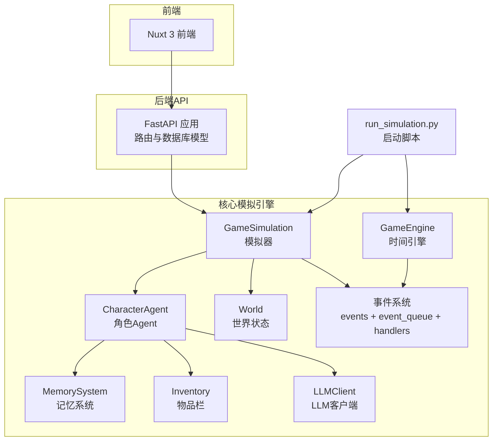
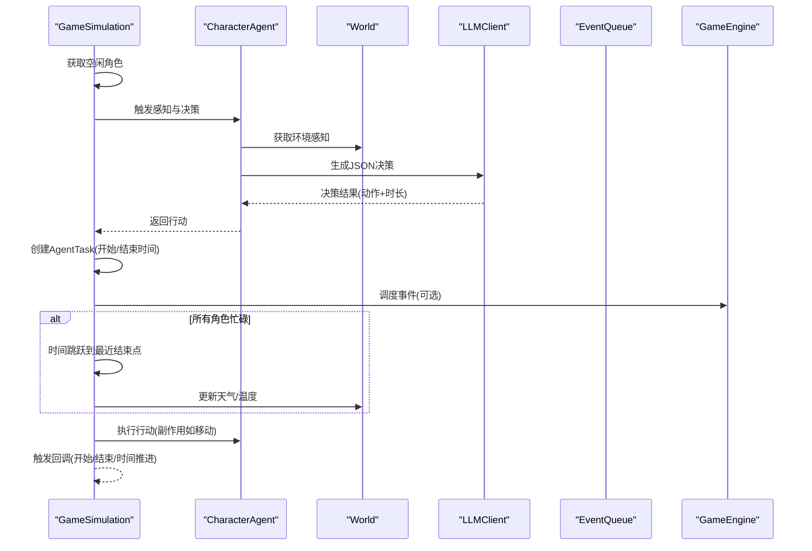
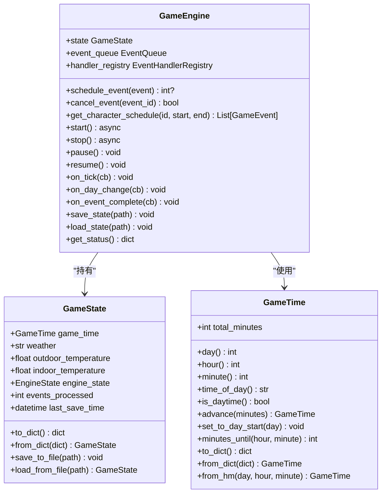
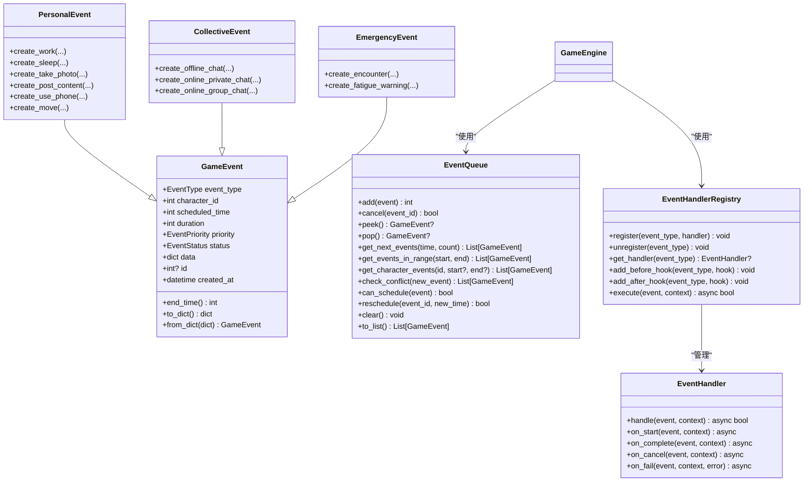
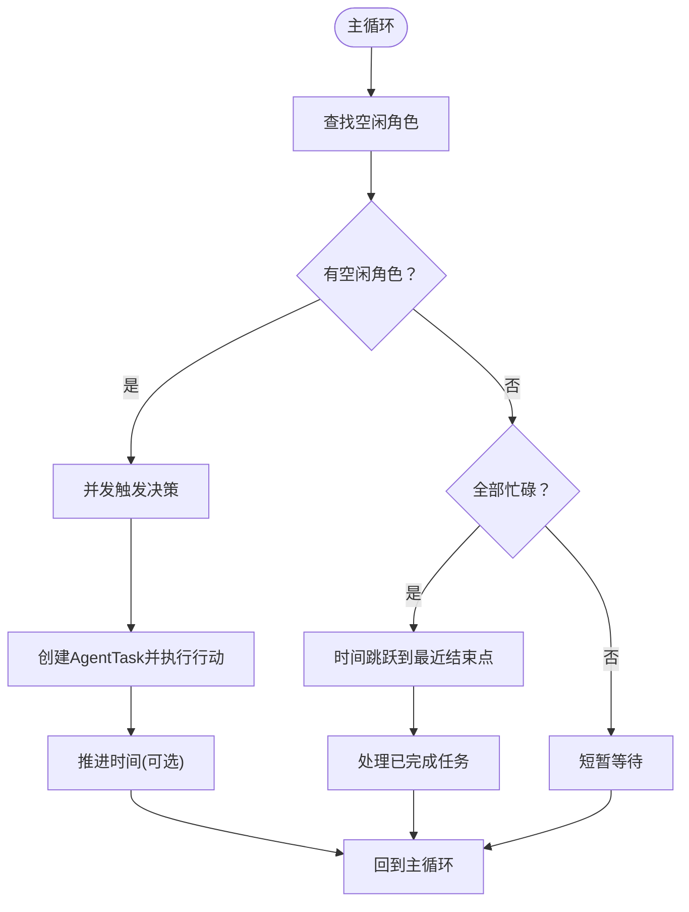
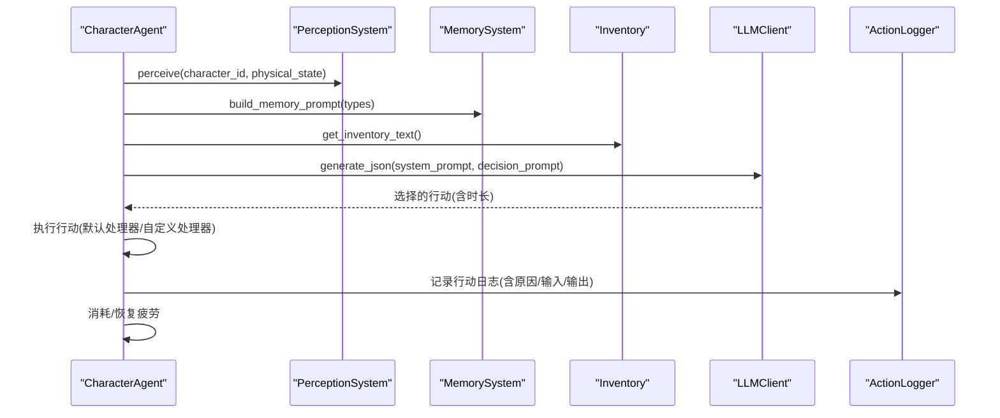
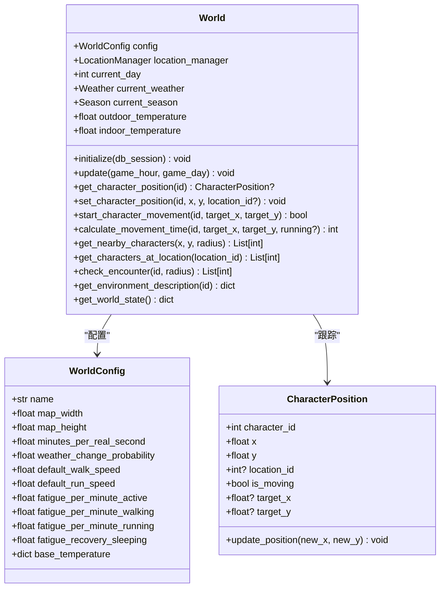
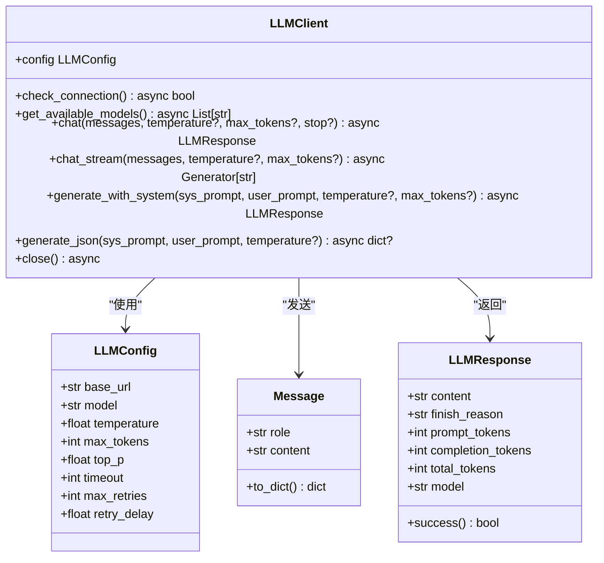
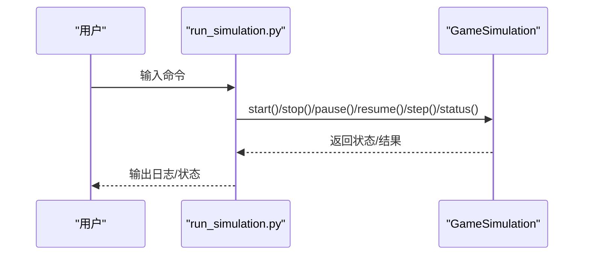
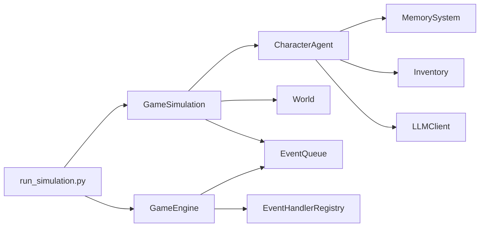

# AI模拟引擎

<cite>
**本文引用的文件**
- [engine.py](file://core_engine/engine.py)
- [simulation.py](file://core_engine/simulation.py)
- [events.py](file://core_engine/event_system/events.py)
- [event_queue.py](file://core_engine/event_system/event_queue.py)
- [handlers.py](file://core_engine/event_system/handlers.py)
- [llm_client.py](file://core_engine/ai_integration/llm_client.py)
- [agent.py](file://core_engine/character/agent.py)
- [world.py](file://core_engine/environment/world.py)
- [memory.py](file://core_engine/character/memory.py)
- [inventory.py](file://core_engine/character/inventory.py)
- [run_simulation.py](file://run_simulation.py)
- [README.md](file://README.md)
- [requirements.txt](file://requirements.txt)
</cite>

## 目录
1. [简介](#简介)
2. [项目结构](#项目结构)
3. [核心组件](#核心组件)
4. [架构总览](#架构总览)
5. [详细组件分析](#详细组件分析)
6. [依赖关系分析](#依赖关系分析)
7. [性能考量](#性能考量)
8. [故障排查指南](#故障排查指南)
9. [结论](#结论)
10. [附录](#附录)

## 简介
本文件为“AI模拟引擎”的技术文档，聚焦于事件驱动的时间管理系统、AI角色的自主决策与执行、事件系统实现、环境模拟机制、模拟器使用方式（交互与步进）、角色行为逻辑与记忆/物品栏管理，并提供性能优化、调试技巧与扩展开发指南。该引擎采用异步事件驱动模型，结合LLM进行角色决策，支持时间跳跃与角色忙碌/空闲状态机，形成高效的社区拟真模拟。

## 项目结构
- 后端API服务：FastAPI + SQLAlchemy，提供用户、帖子、消息等REST接口
- 前端：Nuxt 3 + Vue 3，提供Web界面
- 核心模拟引擎：
  - 时间与事件：engine.py、event_system/*
  - 模拟器：simulation.py
  - AI角色：character/*（agent、memory、inventory、perception）
  - 环境：environment/world.py
  - LLM集成：ai_integration/llm_client.py
- 启动脚本：run_simulation.py
- 依赖：requirements.txt

图表来源
- [run_simulation.py](file://run_simulation.py#L1-L258)
- [simulation.py](file://core_engine/simulation.py#L64-L529)
- [engine.py](file://core_engine/engine.py#L167-L429)
- [events.py](file://core_engine/event_system/events.py#L1-L356)
- [event_queue.py](file://core_engine/event_system/event_queue.py#L29-L244)
- [handlers.py](file://core_engine/event_system/handlers.py#L50-L156)
- [agent.py](file://core_engine/character/agent.py#L116-L800)
- [memory.py](file://core_engine/character/memory.py#L92-L200)
- [inventory.py](file://core_engine/character/inventory.py#L194-L200)
- [world.py](file://core_engine/environment/world.py#L93-L342)
- [llm_client.py](file://core_engine/ai_integration/llm_client.py#L54-L351)

章节来源
- [README.md](file://README.md#L1-L290)
- [requirements.txt](file://requirements.txt#L1-L32)

## 核心组件
- 时间与状态管理：GameTime、GameState、EngineState，支持时间推进、状态持久化与恢复
- 事件系统：GameEvent、EventType、EventPriority、EventStatus、EventQueue、EventHandlerRegistry
- 模拟器：GameSimulation，基于行动结束触发的时间推进策略，支持自动与步进模式
- AI角色：CharacterAgent，整合感知、记忆、物品栏、LLM决策与行动执行
- 环境系统：World，管理天气、季节、温度、角色位置与相遇检测
- LLM集成：LLMClient，OpenAI兼容接口，支持流式与非流式响应

章节来源
- [engine.py](file://core_engine/engine.py#L19-L165)
- [simulation.py](file://core_engine/simulation.py#L21-L114)
- [events.py](file://core_engine/event_system/events.py#L13-L53)
- [event_queue.py](file://core_engine/event_system/event_queue.py#L29-L90)
- [handlers.py](file://core_engine/event_system/handlers.py#L50-L84)
- [agent.py](file://core_engine/character/agent.py#L116-L175)
- [world.py](file://core_engine/environment/world.py#L93-L140)
- [llm_client.py](file://core_engine/ai_integration/llm_client.py#L54-L80)

## 架构总览
引擎采用“事件驱动 + 行动触发”的双层时间模型：
- 事件驱动层：GameEngine维护事件队列，按时间与优先级调度执行，支持状态回调与持久化
- 行动触发层：GameSimulation追踪角色忙碌/空闲状态，空闲角色由LLM决策行动，行动包含时长，所有角色忙碌时时间跳跃至最近结束点

图表来源
- [simulation.py](file://core_engine/simulation.py#L220-L395)
- [agent.py](file://core_engine/character/agent.py#L358-L477)
- [llm_client.py](file://core_engine/ai_integration/llm_client.py#L106-L171)
- [engine.py](file://core_engine/engine.py#L288-L382)
- [world.py](file://core_engine/environment/world.py#L122-L140)

## 详细组件分析

### 时间与状态管理（GameEngine）
- GameTime：以分钟为最小单位，提供天/时/分/时段/昼夜判断与推进
- GameState：封装天气、温度、引擎状态、事件统计与序列化
- GameEngine：主循环按事件队列推进，支持暂停/恢复/回调注册，事件执行后推进事件持续时间

图表来源
- [engine.py](file://core_engine/engine.py#L26-L165)
- [engine.py](file://core_engine/engine.py#L167-L429)

章节来源
- [engine.py](file://core_engine/engine.py#L26-L165)
- [engine.py](file://core_engine/engine.py#L167-L429)

### 事件系统（事件定义、队列与处理器）
- GameEvent：统一事件基类，含类型、优先级、状态、持续时间、数据等
- 事件类型：个人事件（工作、等待、睡眠、拍照、发帖、看手机、移动）、集体事件（线下/线上群聊/私聊）、突发事件（相遇、疲劳警告、视觉/听觉事件）
- EventQueue：基于堆的优先队列，支持冲突检测、懒删除、范围查询、重调度
- EventHandlerRegistry：处理器注册与执行，支持前后置钩子

图表来源
- [events.py](file://core_engine/event_system/events.py#L55-L129)
- [events.py](file://core_engine/event_system/events.py#L131-L356)
- [event_queue.py](file://core_engine/event_system/event_queue.py#L29-L244)
- [handlers.py](file://core_engine/event_system/handlers.py#L12-L48)
- [handlers.py](file://core_engine/event_system/handlers.py#L50-L137)
- [engine.py](file://core_engine/engine.py#L178-L182)

章节来源
- [events.py](file://core_engine/event_system/events.py#L13-L356)
- [event_queue.py](file://core_engine/event_system/event_queue.py#L29-L244)
- [handlers.py](file://core_engine/event_system/handlers.py#L50-L156)
- [engine.py](file://core_engine/engine.py#L178-L182)

### 模拟器（GameSimulation）
- 基于行动结束触发：空闲角色并发决策，所有角色忙碌时时间跳跃到最近结束点
- 任务堆：按结束时间排序，支持清理过期任务、批量处理完成任务
- 回调：行动开始/结束、时间推进
- 手动步进：step()返回时间前后状态与执行的动作

图表来源
- [simulation.py](file://core_engine/simulation.py#L220-L249)
- [simulation.py](file://core_engine/simulation.py#L344-L395)

章节来源
- [simulation.py](file://core_engine/simulation.py#L64-L529)

### AI角色（CharacterAgent）
- 角色设定：CharacterProfile，支持从数据库行解析
- 决策流程：感知环境→构建提示→LLM生成JSON→解析为行动→执行→记录日志与疲劳消耗
- 默认行动处理器：等待、休息、移动、浏览、发帖、私信、查看主页、主动发私信等
- 记忆与物品栏：MemorySystem、Inventory，支持序列化与数据库同步

图表来源
- [agent.py](file://core_engine/character/agent.py#L358-L477)
- [agent.py](file://core_engine/character/agent.py#L479-L521)
- [agent.py](file://core_engine/character/agent.py#L523-L565)

章节来源
- [agent.py](file://core_engine/character/agent.py#L116-L800)
- [memory.py](file://core_engine/character/memory.py#L92-L200)
- [inventory.py](file://core_engine/character/inventory.py#L194-L200)

### 环境系统（World）
- 天气与季节：按季节权重随机变化，温度随季节与小时变化
- 位置与移动：角色位置跟踪、移动开始/计算耗时、附近角色与地点检测
- 环境描述：为感知提供周边地点、角色、天气、温度等信息

图表来源
- [world.py](file://core_engine/environment/world.py#L93-L342)

章节来源
- [world.py](file://core_engine/environment/world.py#L93-L342)

### LLM集成（LLMClient）
- OpenAI兼容接口：支持聊天、流式聊天、JSON生成、模型列表查询
- 配置：基础URL、模型名、温度、最大token、超时与重试
- 单例：全局默认客户端，支持测试连接

图表来源
- [llm_client.py](file://core_engine/ai_integration/llm_client.py#L14-L351)

章节来源
- [llm_client.py](file://core_engine/ai_integration/llm_client.py#L54-L351)

### 模拟器使用方法（交互与步进）
- 交互模式：启动后通过命令控制（start/stop/pause/resume/step/status/quit）
- 步进模式：指定步数，逐步执行并显示结果
- 回调：行动开始/结束、时间推进，便于可视化与调试

图表来源
- [run_simulation.py](file://run_simulation.py#L54-L186)
- [run_simulation.py](file://run_simulation.py#L188-L253)

章节来源
- [run_simulation.py](file://run_simulation.py#L1-L258)
- [README.md](file://README.md#L129-L175)

## 依赖关系分析
- 模块耦合
  - GameSimulation依赖CharacterAgent、World、EventQueue、回调
  - CharacterAgent依赖MemorySystem、Inventory、PerceptionSystem、LLMClient、ActionLogger
  - GameEngine依赖EventQueue与EventHandlerRegistry
- 外部依赖
  - Python异步生态：asyncio、aiohttp
  - 数据库：SQLAlchemy + PyMySQL
  - LLM：本地LM Studio（OpenAI兼容）

图表来源
- [simulation.py](file://core_engine/simulation.py#L84-L114)
- [agent.py](file://core_engine/character/agent.py#L134-L144)
- [engine.py](file://core_engine/engine.py#L178-L182)
- [run_simulation.py](file://run_simulation.py#L17-L29)

章节来源
- [requirements.txt](file://requirements.txt#L1-L32)

## 性能考量
- 异步并发：模拟器并发触发空闲角色决策，减少等待；事件执行与时间推进使用微让权
- 事件调度：优先队列按时间与优先级排序，冲突检测避免时间重叠
- 时间跳跃：当所有角色忙碌时，直接跳到最近结束点，避免无效轮询
- LLM调用：超时与重试配置，JSON解析增强健壮性
- 记忆与物品栏：内存缓存与懒加载，数据库字段适配与ID计数器管理

## 故障排查指南
- LLM连接失败
  - 确认本地LLM服务已启动且端口为1234
  - 使用测试脚本验证连接与模型列表
- 数据库连接失败
  - 检查MySQL服务、凭据与数据库是否存在
- 没有AI角色
  - 在数据库中创建用户并设置is_ai=True，模拟器仅加载AI角色
- 模拟器无响应
  - 检查暂停标志与事件队列是否为空
  - 查看回调日志确认行动开始/结束与时间推进

章节来源
- [README.md](file://README.md#L269-L286)
- [llm_client.py](file://core_engine/ai_integration/llm_client.py#L319-L346)
- [run_simulation.py](file://run_simulation.py#L26-L29)

## 结论
本AI模拟引擎通过事件驱动与行动触发相结合的时间模型，实现了高效、可扩展的社区拟真模拟。角色具备感知、记忆、物品栏与LLM决策能力，环境系统提供天气、温度与位置管理，事件系统保证调度与执行的可靠性。配合交互与步进两种使用模式，既适合自动化运行也适合精细调试与教学演示。

## 附录
- 使用建议
  - 逐步增加角色数量，观察时间跳跃与冲突检测
  - 自定义事件处理器与行动处理器，扩展业务场景
  - 调整LLM温度与最大token，平衡创意与稳定性
- 扩展开发
  - 新增事件类型与处理器，注册到EventHandlerRegistry
  - 新增行动类型与处理器，注册到CharacterAgent
  - 扩展World的环境要素（如光照、音效、社交互动）
  - 增加可视化渲染与Web前端联动