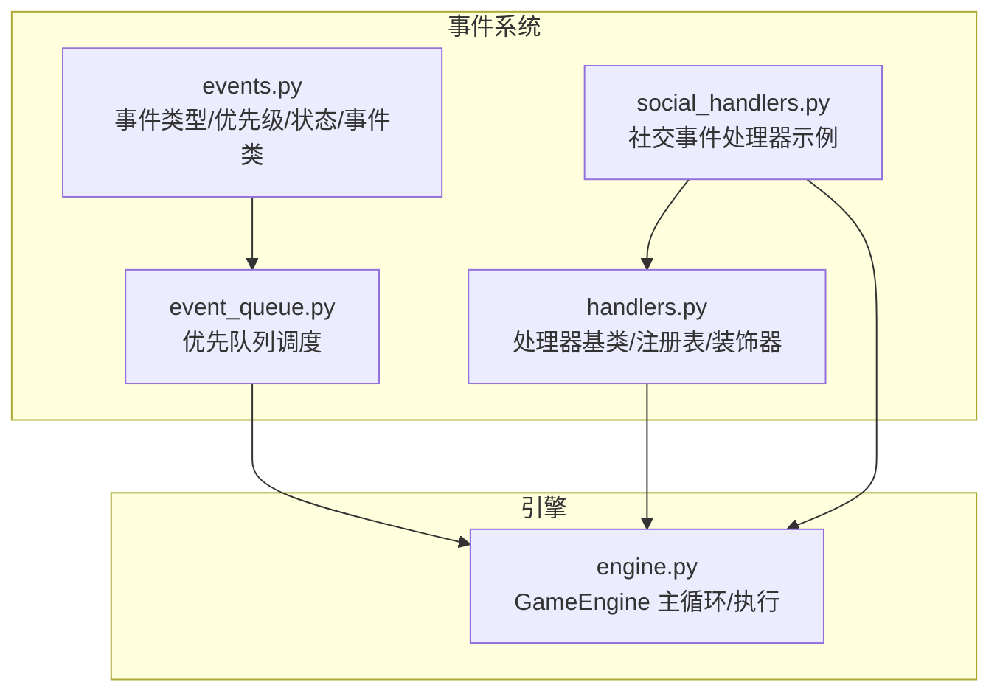
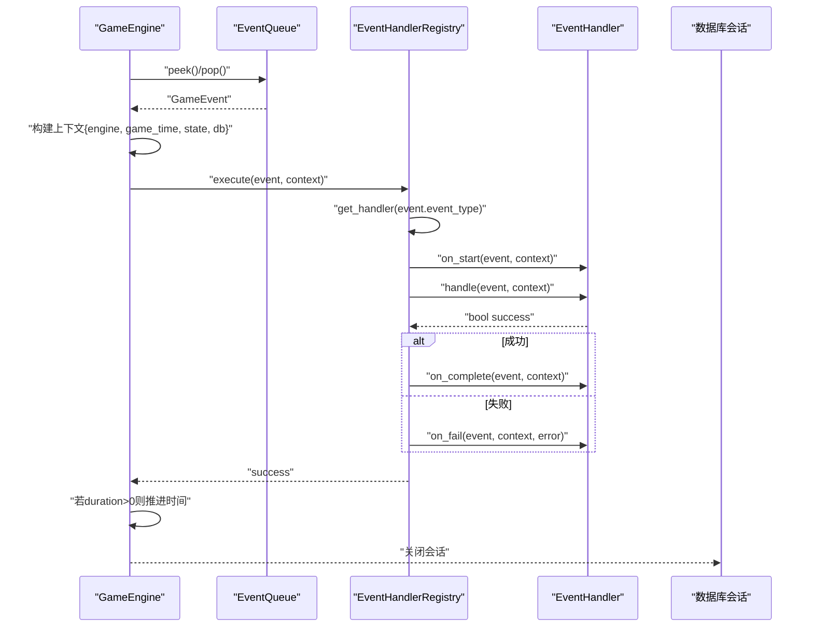
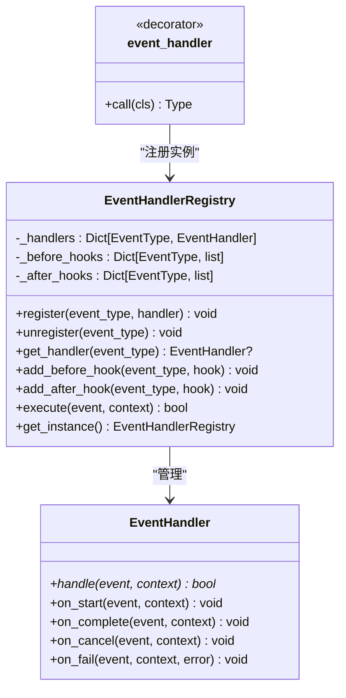
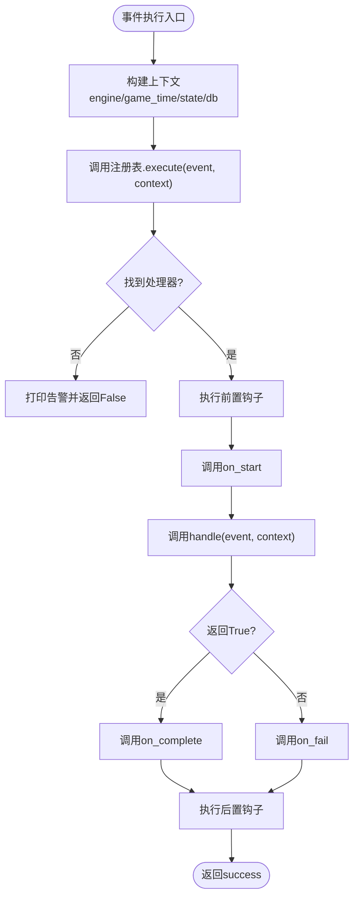
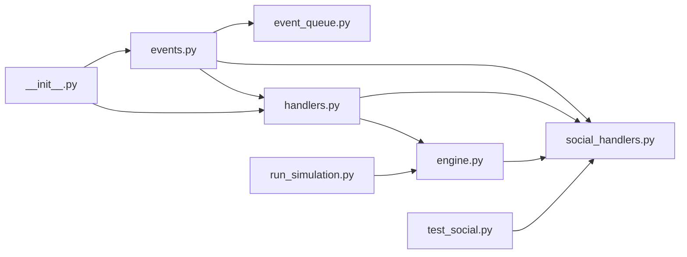

# 事件处理器

<cite>
**本文引用的文件**
- [handlers.py](file://core_engine/event_system/handlers.py)
- [events.py](file://core_engine/event_system/events.py)
- [event_queue.py](file://core_engine/event_system/event_queue.py)
- [engine.py](file://core_engine/engine.py)
- [social_handlers.py](file://core_engine/social/social_handlers.py)
- [__init__.py](file://core_engine/__init__.py)
- [run_simulation.py](file://run_simulation.py)
- [test_social.py](file://test_social.py)
</cite>

## 目录
1. [简介](#简介)
2. [项目结构](#项目结构)
3. [核心组件](#核心组件)
4. [架构总览](#架构总览)
5. [组件详解](#组件详解)
6. [依赖关系分析](#依赖关系分析)
7. [性能与并发](#性能与并发)
8. [故障排查指南](#故障排查指南)
9. [结论](#结论)
10. [附录](#附录)

## 简介
本文件面向事件处理器的设计与实现，系统性阐述 EventHandlerRegistry 的注册机制、查找算法与执行流程；详解事件处理器接口设计（handle 方法签名与参数规范）；说明处理器注册流程（事件类型绑定、处理器实例化与生命周期管理）；介绍事件处理执行机制（同步/异步、错误处理策略）；解释处理器扩展机制（自定义处理器开发、插件化架构与动态加载）；提供处理器开发指南（类设计、事件处理逻辑实现与测试方法）；并给出性能优化与并发安全建议，以及实际处理器实现示例与最佳实践。

## 项目结构
事件系统位于 core_engine/event_system 下，核心文件包括：
- 事件定义：events.py
- 事件队列：event_queue.py
- 处理器基类与注册表：handlers.py
- 引擎集成：engine.py
- 社交事件处理器示例：social_handlers.py
- 模块导出：__init__.py
- 启动与演示：run_simulation.py
- 测试脚本：test_social.py

图表来源
- [events.py](file://core_engine/event_system/events.py#L1-L356)
- [event_queue.py](file://core_engine/event_system/event_queue.py#L1-L244)
- [handlers.py](file://core_engine/event_system/handlers.py#L1-L156)
- [social_handlers.py](file://core_engine/social/social_handlers.py#L1-L253)
- [engine.py](file://core_engine/engine.py#L1-L429)

章节来源
- [handlers.py](file://core_engine/event_system/handlers.py#L1-L156)
- [events.py](file://core_engine/event_system/events.py#L1-L356)
- [event_queue.py](file://core_engine/event_system/event_queue.py#L1-L244)
- [engine.py](file://core_engine/engine.py#L1-L429)
- [social_handlers.py](file://core_engine/social/social_handlers.py#L1-L253)
- [__init__.py](file://core_engine/__init__.py#L1-L73)

## 核心组件
- 事件模型：EventType、EventPriority、EventStatus、GameEvent 及其派生类（PersonalEvent、CollectiveEvent、EmergencyEvent）
- 事件队列：EventQueue 基于优先队列的调度与冲突检测
- 处理器基类：EventHandler 抽象接口与生命周期回调
- 注册表：EventHandlerRegistry 单例注册与执行编排
- 执行器：GameEngine 主循环与事件执行上下文注入
- 示例处理器：UsePhoneHandler、PostContentHandler、OnlinePrivateChatHandler、EncounterHandler

章节来源
- [events.py](file://core_engine/event_system/events.py#L13-L129)
- [event_queue.py](file://core_engine/event_system/event_queue.py#L29-L244)
- [handlers.py](file://core_engine/event_system/handlers.py#L12-L156)
- [engine.py](file://core_engine/engine.py#L167-L429)
- [social_handlers.py](file://core_engine/social/social_handlers.py#L18-L253)

## 架构总览
事件系统采用“事件驱动 + 优先队列 + 处理器注册表”的解耦架构：
- GameEngine 作为调度中枢，按时间推进并从 EventQueue 取出事件
- 将事件与上下文注入 EventHandlerRegistry.execute
- 注册表根据事件类型查找处理器，执行生命周期回调与业务 handle
- 处理完成后推进事件持续时间并触发回调

图表来源
- [engine.py](file://core_engine/engine.py#L343-L382)
- [handlers.py](file://core_engine/event_system/handlers.py#L99-L137)
- [event_queue.py](file://core_engine/event_system/event_queue.py#L73-L89)

## 组件详解

### 事件模型与类型
- EventType：个人事件（如工作、等待、睡眠、拍照、发帖、看手机、移动）、集体事件（线下群聊、网络群聊、网络私聊）、突发事件（相遇、疲劳警告、视觉/声音事件）
- EventPriority：优先级数值越小优先级越高，支持紧急、高、普通、低、后台
- EventStatus：事件状态（待执行、执行中、已完成、已取消、执行失败）
- GameEvent：统一事件载体，包含类型、角色、时间、持续、优先级、状态、数据、创建时间等；提供结束时间、比较运算符、序列化/反序列化
- 派生事件类：PersonalEvent、CollectiveEvent、EmergencyEvent 提供常用事件工厂方法与特定数据字段

章节来源
- [events.py](file://core_engine/event_system/events.py#L13-L129)
- [events.py](file://core_engine/event_system/events.py#L131-L356)

### 事件队列与调度
- EventQueue：基于堆的优先队列，排序键为(scheduled_time, priority.value, id)，支持添加、取消（懒删除）、查看队首、批量获取、范围查询、按角色筛选、冲突检测、重新调度
- 冲突检测：按角色与时间段判断重叠
- 懒清理：弹出时清理已取消事件，避免堆内堆积无效项

章节来源
- [event_queue.py](file://core_engine/event_system/event_queue.py#L29-L244)

### 处理器基类与注册表
- EventHandler：抽象基类，要求实现异步 handle(event, context) -> bool，并提供 on_start/on_complete/on_cancel/on_fail 生命周期回调
- EventHandlerRegistry：单例注册表，维护 event_type -> handler 映射，提供 register/unregister/get_handler；支持 before/after 钩子；execute 执行流程包含钩子、生命周期回调、异常捕获与状态更新
- 装饰器 event_handler：便捷注册装饰器，自动将处理器实例注册到全局注册表

图表来源
- [handlers.py](file://core_engine/event_system/handlers.py#L12-L156)

章节来源
- [handlers.py](file://core_engine/event_system/handlers.py#L12-L156)

### 执行流程与上下文
- GameEngine._execute_event：构建上下文（引擎、时间、状态、可选数据库会话），调用注册表执行，成功则累加统计、推进事件持续时间、触发完成回调，异常则标记失败并关闭会话
- 主循环：按时间推进，遇到事件即执行；无事件时推进1分钟；支持暂停/恢复

图表来源
- [engine.py](file://core_engine/engine.py#L343-L382)
- [handlers.py](file://core_engine/event_system/handlers.py#L99-L137)

章节来源
- [engine.py](file://core_engine/engine.py#L288-L382)
- [handlers.py](file://core_engine/event_system/handlers.py#L99-L137)

### 示例处理器：社交事件
- UsePhoneHandler：处理看手机行为，调用社交调度器执行浏览/点赞/发帖等动作，汇总结果写入事件数据
- PostContentHandler：处理发帖，调用调度器创建帖子并记录结果
- OnlinePrivateChatHandler：处理私聊，支持回复或主动发起，记录对话结果
- EncounterHandler：处理线下相遇，区分AI与NPC，生成对话并记录

章节来源
- [social_handlers.py](file://core_engine/social/social_handlers.py#L18-L253)

### 插件化与动态加载
- 装饰器注册：通过 @event_handler(EventType.XXX) 将处理器类自动注册到全局注册表
- 模块导入：SocialEventHandlers.register_all() 仅确保模块被导入，装饰器已自动注册
- 钩子扩展：add_before_hook/add_after_hook 支持对特定事件类型注入横切逻辑

章节来源
- [handlers.py](file://core_engine/event_system/handlers.py#L140-L156)
- [social_handlers.py](file://core_engine/social/social_handlers.py#L215-L253)

## 依赖关系分析
- engine.py 依赖 events.py、event_queue.py、handlers.py
- handlers.py 依赖 events.py
- social_handlers.py 依赖 handlers.py、events.py、social_scheduler
- __init__.py 导出事件系统与社交处理器
- run_simulation.py 与 test_social.py 展示如何使用与验证社交功能

图表来源
- [engine.py](file://core_engine/engine.py#L14-L16)
- [handlers.py](file://core_engine/event_system/handlers.py#L7-L9)
- [social_handlers.py](file://core_engine/social/social_handlers.py#L13-L15)
- [__init__.py](file://core_engine/__init__.py#L9-L23)
- [run_simulation.py](file://run_simulation.py#L17-L24)
- [test_social.py](file://test_social.py#L22-L25)

章节来源
- [engine.py](file://core_engine/engine.py#L14-L16)
- [handlers.py](file://core_engine/event_system/handlers.py#L7-L9)
- [social_handlers.py](file://core_engine/social/social_handlers.py#L13-L15)
- [__init__.py](file://core_engine/__init__.py#L9-L23)

## 性能与并发
- 异步处理：所有处理器 handle 与注册表执行均声明为异步，便于I/O密集型操作（如数据库、外部服务）
- 优先队列：EventQueue 使用堆结构，插入/弹出复杂度 O(logN)，冲突检测线性扫描，整体满足中等规模调度需求
- 生命周期与钩子：on_start/on_complete/on_fail 与 before/after 钩子在异步上下文中执行，注意避免阻塞
- 数据库会话：GameEngine 在执行结束后显式关闭 db 会话，避免资源泄漏
- 并发安全：注册表为单例且内部为内存字典，未引入锁；在应用启动阶段完成注册后，运行期只读访问，避免竞态

章节来源
- [handlers.py](file://core_engine/event_system/handlers.py#L19-L47)
- [engine.py](file://core_engine/engine.py#L354-L381)
- [event_queue.py](file://core_engine/event_system/event_queue.py#L40-L244)

## 故障排查指南
- 无处理器注册：当事件类型未注册处理器时，注册表会打印告警并返回 False；检查装饰器是否正确使用与模块是否导入
- 处理器异常：注册表捕获异常并调用 on_fail，同时返回 False；检查处理器内部异常处理与日志输出
- 事件冲突：EventQueue.check_conflict 会检测同一角色时间重叠；可通过 reschedule 或调整计划避免
- 数据库会话：确保 db 会话在上下文中传递并在 finally 中关闭
- 回调异常：引擎对回调异常进行捕获并打印，不影响主流程

章节来源
- [handlers.py](file://core_engine/event_system/handlers.py#L110-L131)
- [engine.py](file://core_engine/engine.py#L357-L381)
- [event_queue.py](file://core_engine/event_system/event_queue.py#L154-L214)

## 结论
事件处理器体系通过清晰的接口、注册表与生命周期管理，实现了事件驱动的可扩展架构。装饰器与钩子机制提供了良好的扩展点，异步处理与优先队列保证了性能与实时性。结合社交事件处理器示例，开发者可快速实现新的事件类型与处理逻辑，并通过测试脚本验证功能。

## 附录

### 处理器开发指南
- 设计要点
  - 继承 EventHandler，实现异步 handle(event, context) -> bool
  - 在 handle 中完成业务逻辑，必要时读取 event.data 与 context（包含 engine、game_time、state、db）
  - 保持幂等与可重试性，避免副作用
- 注册方式
  - 使用 @event_handler(EventType.XXX) 装饰器自动注册
  - 或在应用启动阶段手动 registry.register(EventType.XXX, MyHandler())
- 生命周期
  - on_start：事件开始时设置状态为进行中
  - on_complete：成功时设置状态为已完成
  - on_fail：失败时设置状态为失败
- 错误处理
  - 在 handle 中抛出异常会被注册表捕获并标记失败
  - 建议在业务层捕获并记录异常，返回 False 表示处理失败
- 测试方法
  - 使用 test_social.py 中的模式构造 Agent、调用调度器与处理器
  - 通过断言事件数据与日志输出验证行为

章节来源
- [handlers.py](file://core_engine/event_system/handlers.py#L12-L47)
- [handlers.py](file://core_engine/event_system/handlers.py#L140-L156)
- [social_handlers.py](file://core_engine/social/social_handlers.py#L18-L253)
- [test_social.py](file://test_social.py#L27-L311)

### 实际处理器实现示例
- UsePhoneHandler：参考路径 [UsePhoneHandler.handle](file://core_engine/social/social_handlers.py#L29-L69)
- PostContentHandler：参考路径 [PostContentHandler.handle](file://core_engine/social/social_handlers.py#L80-L99)
- OnlinePrivateChatHandler：参考路径 [OnlinePrivateChatHandler.handle](file://core_engine/social/social_handlers.py#L110-L145)
- EncounterHandler：参考路径 [EncounterHandler.handle](file://core_engine/social/social_handlers.py#L156-L190)

### 最佳实践
- 事件数据结构化：将上下文与结果写入 event.data，便于后续钩子与日志
- 严格区分状态：遵循 EventStatus 的流转，避免状态不一致
- 钩子轻量：before/after 钩子应避免重逻辑，仅做观察与记录
- 资源管理：确保数据库会话与外部连接在上下文中正确释放
- 日志与可观测性：在关键节点打印日志，便于调试与审计