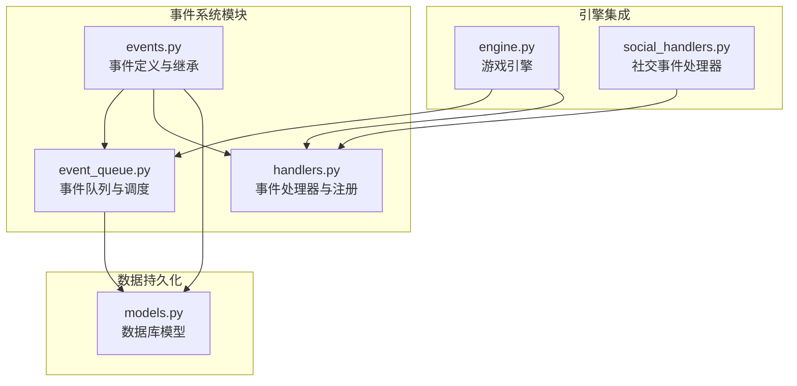
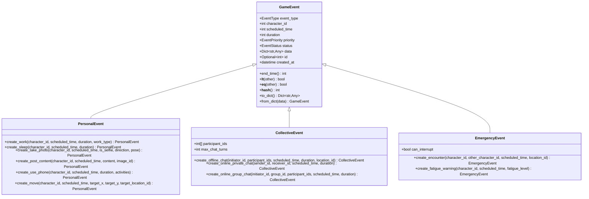
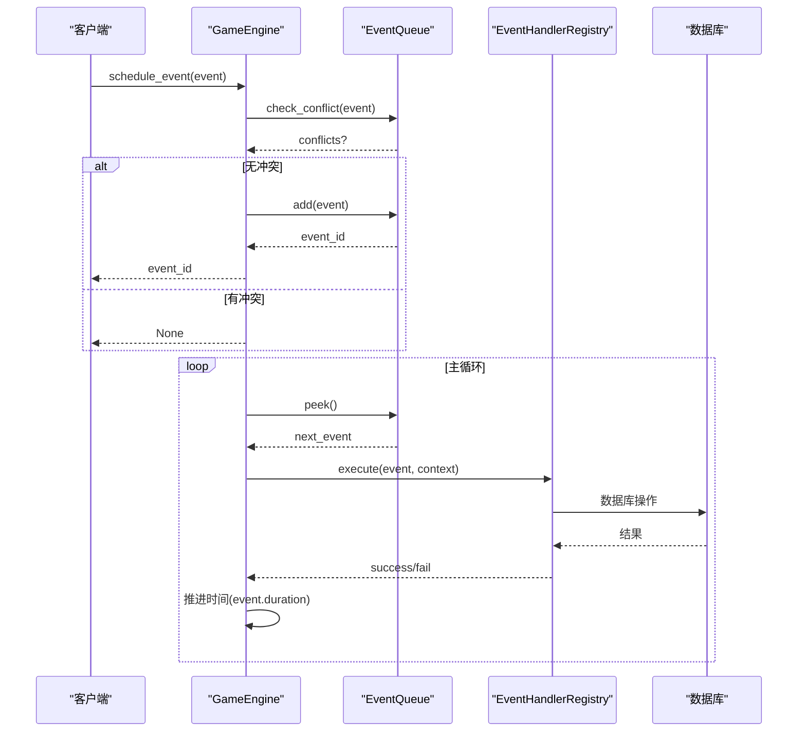
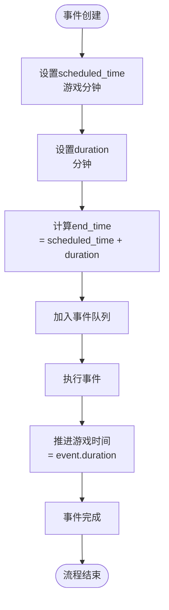
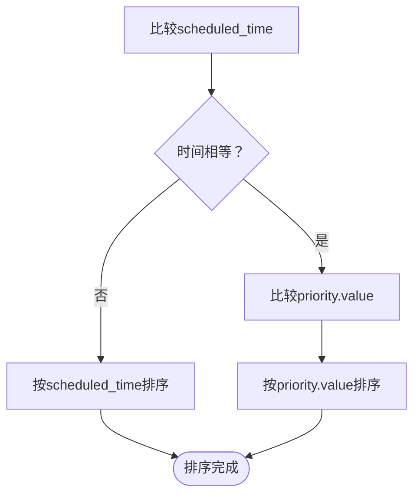
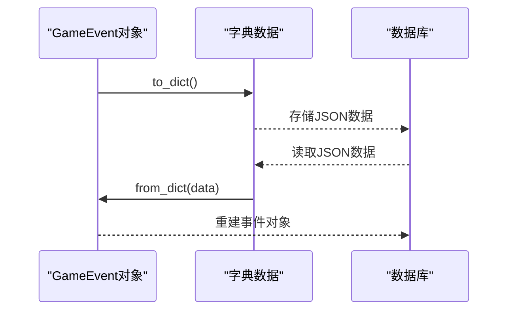
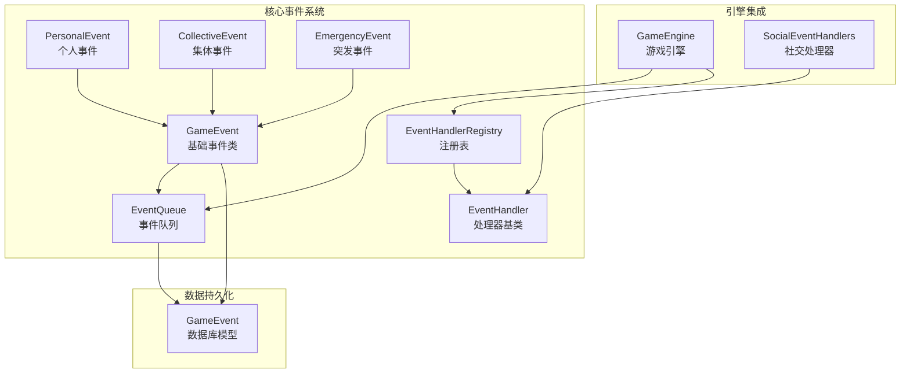

# 事件数据类设计

<cite>
**本文档引用的文件**
- [events.py](file://core_engine/event_system/events.py)
- [event_queue.py](file://core_engine/event_system/event_queue.py)
- [handlers.py](file://core_engine/event_system/handlers.py)
- [engine.py](file://core_engine/engine.py)
- [social_handlers.py](file://core_engine/social/social_handlers.py)
- [models.py](file://api_server/models.py)
</cite>

## 目录
1. [简介](#简介)
2. [项目结构](#项目结构)
3. [核心组件](#核心组件)
4. [架构概览](#架构概览)
5. [详细组件分析](#详细组件分析)
6. [依赖分析](#依赖分析)
7. [性能考虑](#性能考虑)
8. [故障排除指南](#故障排除指南)
9. [结论](#结论)
10. [附录](#附录)

## 简介
本文件为事件数据类设计的全面技术文档，重点介绍GameEvent基类的设计理念、事件属性的作用与约束、事件时间计算机制、事件比较运算符的实现逻辑、事件序列化机制、事件继承体系以及工厂方法。同时提供事件创建、状态管理和数据持久化的完整代码示例路径，帮助开发者快速理解和使用事件系统。

## 项目结构
事件系统位于core_engine/event_system目录下，包含以下关键文件：
- events.py：事件定义与继承体系
- event_queue.py：事件优先队列与调度
- handlers.py：事件处理器基类与注册机制
- engine.py：游戏引擎集成事件系统
- social_handlers.py：社交事件处理器示例
- models.py：数据库模型定义（含GameEvent）

**图表来源**
- [events.py](file://core_engine/event_system/events.py#L1-L356)
- [event_queue.py](file://core_engine/event_system/event_queue.py#L1-L244)
- [handlers.py](file://core_engine/event_system/handlers.py#L1-L156)
- [engine.py](file://core_engine/engine.py#L1-L429)
- [social_handlers.py](file://core_engine/social/social_handlers.py#L1-L253)
- [models.py](file://api_server/models.py#L185-L203)

**章节来源**
- [events.py](file://core_engine/event_system/events.py#L1-L356)
- [event_queue.py](file://core_engine/event_system/event_queue.py#L1-L244)
- [handlers.py](file://core_engine/event_system/handlers.py#L1-L156)
- [engine.py](file://core_engine/engine.py#L1-L429)
- [social_handlers.py](file://core_engine/social/social_handlers.py#L1-L253)
- [models.py](file://api_server/models.py#L185-L203)

## 核心组件
本节深入分析事件系统的核心组件，包括事件基类、事件类型枚举、优先级枚举、状态枚举以及继承体系。

### GameEvent基类
GameEvent是所有事件的基础类，定义了事件的核心属性和行为：
- id：事件唯一标识（可选，自动生成）
- event_type：事件类型（枚举）
- character_id：执行事件的角色ID
- scheduled_time：计划执行时间（游戏分钟）
- duration：事件持续时间（分钟）
- priority：事件优先级（枚举）
- status：事件状态（枚举）
- data：事件附加数据（字典）
- created_at：创建时间

**图表来源**
- [events.py](file://core_engine/event_system/events.py#L55-L356)

**章节来源**
- [events.py](file://core_engine/event_system/events.py#L55-L129)

### 事件类型枚举（EventType）
EventType定义了所有可用的事件类型，分为三类：
- 个人事件：WORK、WAIT、SLEEP、TAKE_PHOTO、POST_CONTENT、USE_PHONE、MOVE
- 集体事件：OFFLINE_CHAT、ONLINE_GROUP_CHAT、ONLINE_PRIVATE_CHAT
- 突发事件：ENCOUNTER、FATIGUE_WARNING、VISUAL_EVENT、AUDIO_EVENT

**章节来源**
- [events.py](file://core_engine/event_system/events.py#L13-L34)

### 事件优先级（EventPriority）
EventPriority定义了事件的优先级顺序，数值越小优先级越高：
- CRITICAL（0）：最高优先级（系统事件）
- EMERGENCY（10）：紧急事件（突发事件）
- HIGH（20）：高优先级
- NORMAL（50）：普通优先级
- LOW（80）：低优先级
- BACKGROUND（100）：后台任务

**章节来源**
- [events.py](file://core_engine/event_system/events.py#L36-L44)

### 事件状态（EventStatus）
EventStatus定义了事件的生命周期状态：
- PENDING：待执行
- IN_PROGRESS：执行中
- COMPLETED：已完成
- CANCELLED：已取消
- FAILED：执行失败

**章节来源**
- [events.py](file://core_engine/event_system/events.py#L46-L53)

## 架构概览
事件系统采用分层架构设计，通过优先队列进行事件调度，通过处理器机制执行具体业务逻辑。

**图表来源**
- [engine.py](file://core_engine/engine.py#L211-L382)
- [event_queue.py](file://core_engine/event_system/event_queue.py#L73-L116)
- [handlers.py](file://core_engine/event_system/handlers.py#L99-L137)

**章节来源**
- [engine.py](file://core_engine/engine.py#L211-L382)
- [event_queue.py](file://core_engine/event_system/event_queue.py#L29-L244)
- [handlers.py](file://core_engine/event_system/handlers.py#L50-L156)

## 详细组件分析

### 事件时间计算机制
事件时间计算是事件系统的核心机制之一，涉及scheduled_time、duration和end_time的关系。

**图表来源**
- [events.py](file://core_engine/event_system/events.py#L81-L84)
- [engine.py](file://core_engine/engine.py#L364-L366)

**章节来源**
- [events.py](file://core_engine/event_system/events.py#L81-L84)
- [engine.py](file://core_engine/engine.py#L364-L366)

### 事件比较运算符与优先队列排序
GameEvent实现了比较运算符，用于优先队列的排序规则：

**图表来源**
- [events.py](file://core_engine/event_system/events.py#L86-L91)

**章节来源**
- [events.py](file://core_engine/event_system/events.py#L86-L91)

### 事件序列化机制
事件提供了完整的序列化和反序列化机制：

**图表来源**
- [events.py](file://core_engine/event_system/events.py#L101-L128)

**章节来源**
- [events.py](file://core_engine/event_system/events.py#L101-L128)

### 事件继承体系与工厂方法
事件继承体系提供了专门的工厂方法来创建特定类型的事件：

#### PersonalEvent工厂方法
- create_work：创建工作事件
- create_sleep：创建睡眠事件（默认480分钟）
- create_take_photo：创建拍照事件（默认5分钟）
- create_post_content：创建发帖事件（默认3分钟）
- create_use_phone：创建看手机事件（默认30分钟）
- create_move：创建移动事件（持续时间由距离计算）

#### CollectiveEvent工厂方法
- create_offline_chat：创建线下群聊事件
- create_online_private_chat：创建网络私聊事件
- create_online_group_chat：创建网络群聊事件

#### EmergencyEvent工厂方法
- create_encounter：创建相遇事件（默认1分钟）
- create_fatigue_warning：创建疲劳警告事件

**章节来源**
- [events.py](file://core_engine/event_system/events.py#L131-L356)

## 依赖分析
事件系统各组件之间的依赖关系如下：

**图表来源**
- [events.py](file://core_engine/event_system/events.py#L55-L356)
- [event_queue.py](file://core_engine/event_system/event_queue.py#L29-L244)
- [handlers.py](file://core_engine/event_system/handlers.py#L12-L156)
- [engine.py](file://core_engine/engine.py#L167-L429)
- [social_handlers.py](file://core_engine/social/social_handlers.py#L1-L253)
- [models.py](file://api_server/models.py#L185-L203)

**章节来源**
- [events.py](file://core_engine/event_system/events.py#L55-L356)
- [event_queue.py](file://core_engine/event_system/event_queue.py#L29-L244)
- [handlers.py](file://core_engine/event_system/handlers.py#L12-L156)
- [engine.py](file://core_engine/engine.py#L167-L429)
- [social_handlers.py](file://core_engine/social/social_handlers.py#L1-L253)
- [models.py](file://api_server/models.py#L185-L203)

## 性能考虑
事件系统在设计时充分考虑了性能优化：

### 优先队列优化
- 使用二叉堆实现O(log n)的插入和删除操作
- 采用懒删除策略避免频繁重建堆
- 通过PrioritizedEvent包装器实现稳定的排序键

### 冲突检测优化
- 使用时间重叠算法O(n)检测冲突
- 支持批量冲突检测和范围查询
- 提供冲突预检功能避免无效调度

### 序列化性能
- 字典序列化避免复杂的对象图遍历
- 支持增量序列化和批量处理
- 数据库持久化采用JSON字段存储

## 故障排除指南
常见问题及解决方案：

### 事件冲突
**问题**：事件调度失败，返回None
**原因**：新事件与现有事件存在时间冲突
**解决**：使用check_conflict()方法检测冲突，调整事件时间或合并事件

### 事件状态异常
**问题**：事件状态未正确更新
**原因**：处理器执行异常或回调未正确调用
**解决**：检查EventHandler的回调方法，确保异常处理正确

### 序列化问题
**问题**：事件序列化/反序列化失败
**原因**：数据类型不兼容或缺少必要字段
**解决**：验证数据结构完整性，使用from_dict()的默认值机制

**章节来源**
- [event_queue.py](file://core_engine/event_system/event_queue.py#L154-L183)
- [handlers.py](file://core_engine/event_system/handlers.py#L33-L47)
- [events.py](file://core_engine/event_system/events.py#L115-L128)

## 结论
事件数据类设计采用了清晰的面向对象架构，通过基类抽象和继承体系实现了高度的可扩展性。系统提供了完善的事件生命周期管理、时间计算机制、优先级排序和序列化支持。通过工厂方法简化了事件创建过程，通过处理器注册机制实现了灵活的业务逻辑扩展。整体设计既保证了性能效率，又保持了良好的可维护性和可扩展性。

## 附录

### 事件创建示例路径
以下为完整的事件创建、状态管理和数据持久化示例路径：

#### 创建个人事件
- 工作事件：[create_work](file://core_engine/event_system/events.py#L139-L150)
- 睡眠事件：[create_sleep](file://core_engine/event_system/events.py#L152-L163)
- 拍照事件：[create_take_photo](file://core_engine/event_system/events.py#L165-L182)
- 发帖事件：[create_post_content](file://core_engine/event_system/events.py#L185-L199)
- 看手机事件：[create_use_phone](file://core_engine/event_system/events.py#L202-L221)
- 移动事件：[create_move](file://core_engine/event_system/events.py#L224-L239)

#### 创建集体事件
- 线下群聊：[create_offline_chat](file://core_engine/event_system/events.py#L254-L270)
- 网络私聊：[create_online_private_chat](file://core_engine/event_system/events.py#L273-L288)
- 网络群聊：[create_online_group_chat](file://core_engine/event_system/events.py#L291-L308)

#### 创建突发事件
- 相遇事件：[create_encounter](file://core_engine/event_system/events.py#L322-L337)
- 疲劳警告：[create_fatigue_warning](file://core_engine/event_system/events.py#L340-L355)

#### 事件调度与执行
- 事件调度：[schedule_event](file://core_engine/engine.py#L211-L226)
- 事件执行：[execute_event](file://core_engine/engine.py#L343-L382)
- 事件取消：[cancel_event](file://core_engine/engine.py#L228-L230)

#### 数据持久化
- 状态保存：[save_state](file://core_engine/engine.py#L383-L393)
- 状态加载：[load_state](file://core_engine/engine.py#L395-L412)
- 数据库模型：[GameEvent模型](file://api_server/models.py#L185-L203)

#### 事件处理器注册
- 处理器注册：[register](file://core_engine/event_system/handlers.py#L72-L74)
- 处理器执行：[execute](file://core_engine/event_system/handlers.py#L99-L137)
- 装饰器使用：[@event_handler](file://core_engine/event_system/handlers.py#L141-L155)