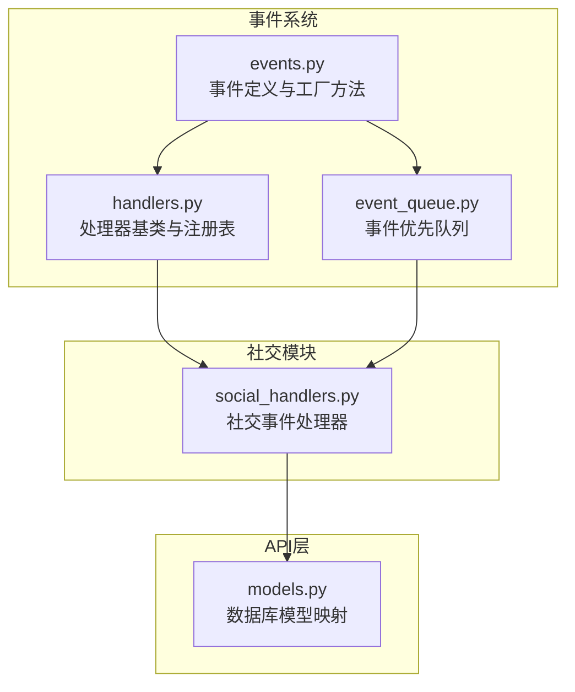
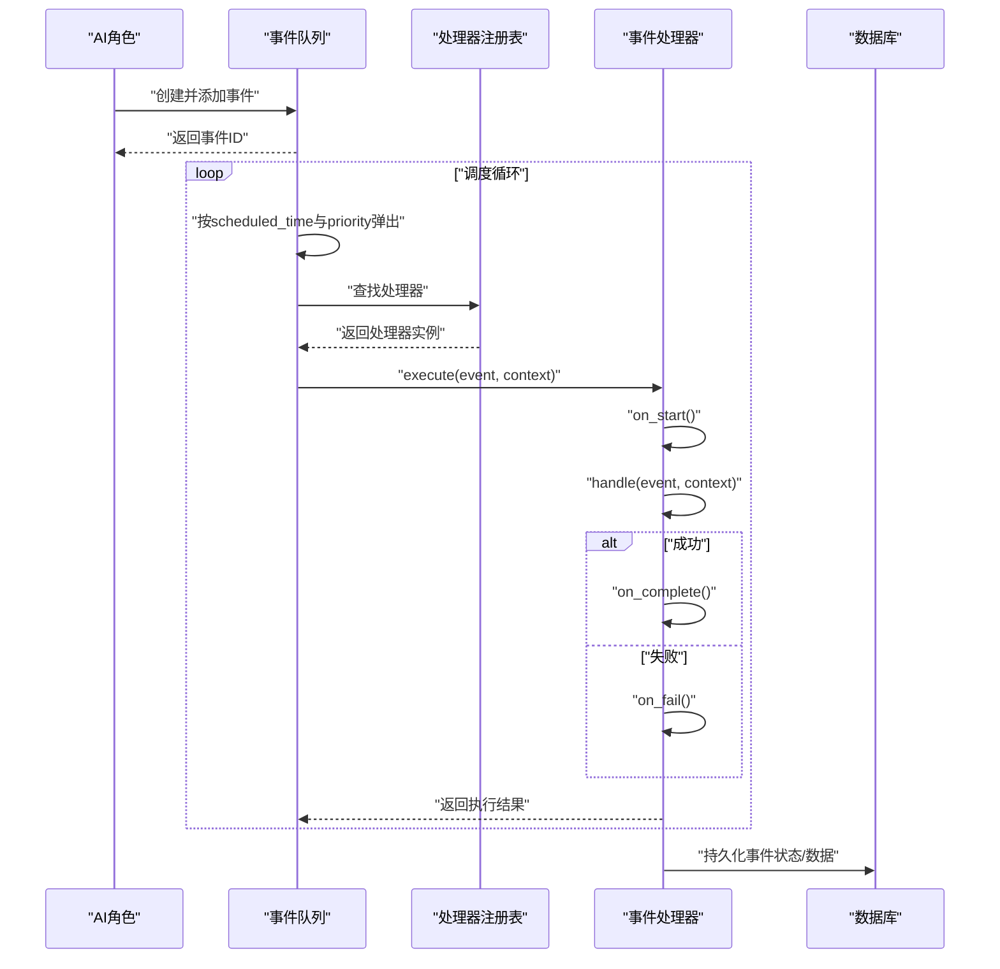
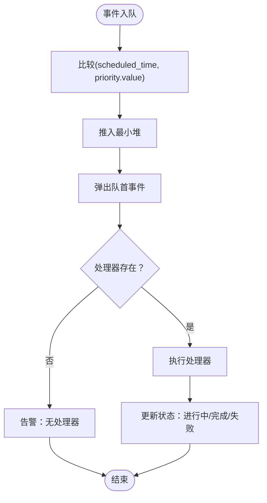
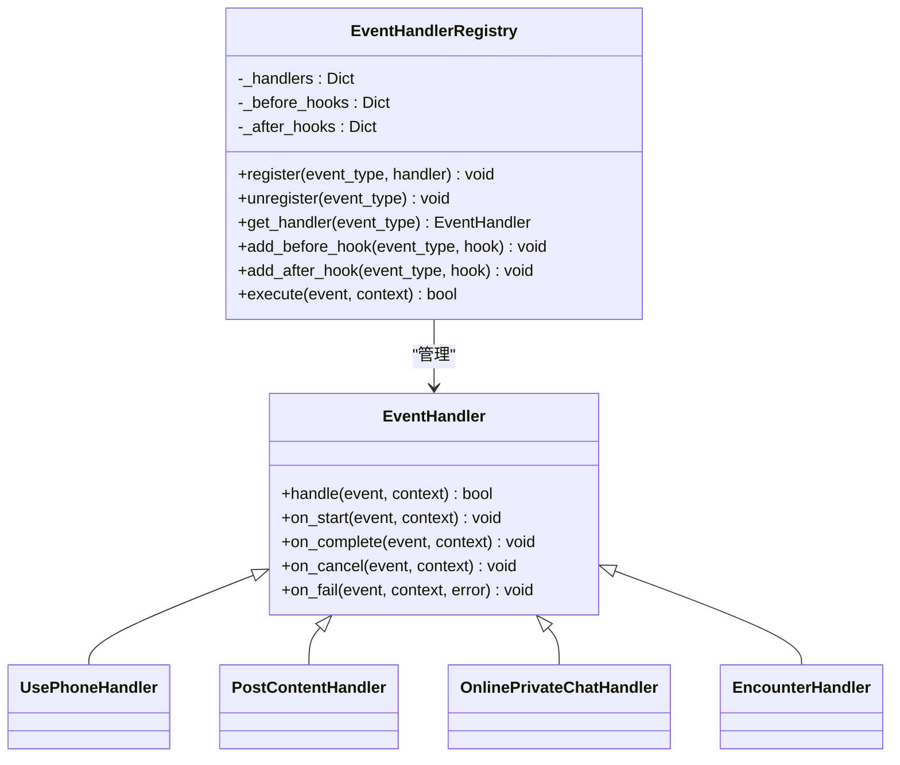
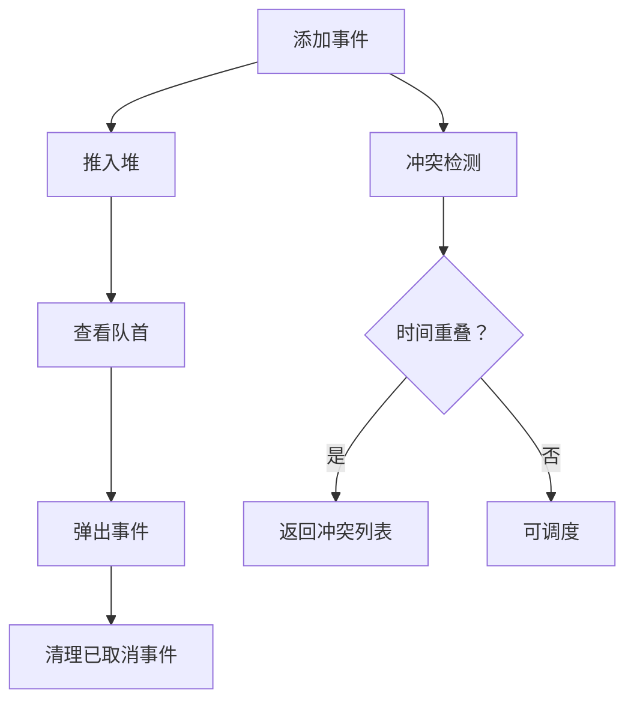
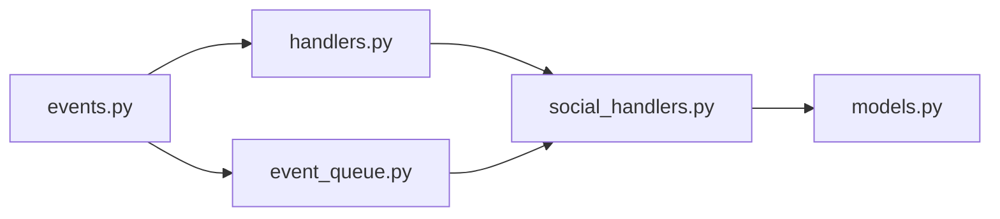

# 事件类型定义

<cite>
**本文档引用的文件**
- [events.py](file://core_engine/event_system/events.py)
- [event_queue.py](file://core_engine/event_system/event_queue.py)
- [handlers.py](file://core_engine/event_system/handlers.py)
- [__init__.py](file://core_engine/event_system/__init__.py)
- [social_handlers.py](file://core_engine/social/social_handlers.py)
- [models.py](file://api_server/models.py)
</cite>

## 目录
1. [简介](#简介)
2. [项目结构](#项目结构)
3. [核心组件](#核心组件)
4. [架构总览](#架构总览)
5. [详细组件分析](#详细组件分析)
6. [依赖关系分析](#依赖关系分析)
7. [性能考量](#性能考量)
8. [故障排查指南](#故障排查指南)
9. [结论](#结论)

## 简介
本文件面向事件类型定义与调度系统，系统性阐述以下内容：
- EventType枚举的分类设计与用途：个人事件、集体事件、突发事件
- EventPriority优先级系统的设计与调度策略
- EventStatus事件状态枚举的状态转换机制
- 每种事件类型的创建方法与参数说明（PersonalEvent、CollectiveEvent、EmergencyEvent）
- 事件数据字段的设计原则与扩展机制
- 事件队列调度与处理器注册体系的工作流

## 项目结构
事件系统位于核心引擎的event_system包内，配合社交模块的处理器共同构成完整的事件编排与执行链路。

图表来源
- [events.py](file://core_engine/event_system/events.py#L1-L356)
- [event_queue.py](file://core_engine/event_system/event_queue.py#L1-L244)
- [handlers.py](file://core_engine/event_system/handlers.py#L1-L156)
- [social_handlers.py](file://core_engine/social/social_handlers.py#L1-L200)
- [models.py](file://api_server/models.py#L185-L204)

章节来源
- [events.py](file://core_engine/event_system/events.py#L1-L356)
- [event_queue.py](file://core_engine/event_system/event_queue.py#L1-L244)
- [handlers.py](file://core_engine/event_system/handlers.py#L1-L156)
- [social_handlers.py](file://core_engine/social/social_handlers.py#L1-L200)
- [models.py](file://api_server/models.py#L185-L204)

## 核心组件
- EventType：事件类型枚举，分为个人事件、集体事件、突发事件三类
- EventPriority：事件优先级，数值越小优先级越高
- EventStatus：事件状态，贯穿事件生命周期
- GameEvent：事件基类，统一字段与序列化
- PersonalEvent、CollectiveEvent、EmergencyEvent：事件工厂方法封装
- EventQueue：基于最小堆的优先队列，支持冲突检测与懒删除
- EventHandler、EventHandlerRegistry：事件处理器抽象与注册表

章节来源
- [events.py](file://core_engine/event_system/events.py#L13-L129)
- [event_queue.py](file://core_engine/event_system/event_queue.py#L29-L244)
- [handlers.py](file://core_engine/event_system/handlers.py#L12-L156)

## 架构总览
事件从“感知/决策”生成，进入事件队列，按时间与优先级排序，由对应处理器执行，最终更新状态与数据。

图表来源
- [event_queue.py](file://core_engine/event_system/event_queue.py#L80-L117)
- [handlers.py](file://core_engine/event_system/handlers.py#L99-L137)
- [social_handlers.py](file://core_engine/social/social_handlers.py#L18-L70)

## 详细组件分析

### EventType枚举与分类逻辑
- 个人事件（PersonalEvent）：工作、等待、睡眠、拍照、发帖、看手机、移动
- 集体事件（CollectiveEvent）：线下群聊、网络群聊、网络私聊
- 突发事件（EmergencyEvent）：相遇、疲劳警告、视觉事件、听觉事件

分类依据：
- 个人事件：单角色独立执行，强调角色内在需求与习惯
- 集体事件：多角色协作或交互，强调社交属性
- 突发事件：高优先级或打断性事件，可能影响常规计划

章节来源
- [events.py](file://core_engine/event_system/events.py#L13-L34)

### EventPriority优先级系统与调度策略
- 设计原则：数值越小优先级越高，便于堆排序
- 数值分配：
  - CRITICAL：系统级事件
  - EMERGENCY：突发事件
  - HIGH：重要但非系统级
  - NORMAL：日常事务
  - LOW：低重要性
  - BACKGROUND：后台任务
- 调度策略：
  - 事件比较：先按scheduled_time，再按priority.value
  - 事件队列：最小堆，支持懒删除与冲突检测

图表来源
- [events.py](file://core_engine/event_system/events.py#L86-L96)
- [event_queue.py](file://core_engine/event_system/event_queue.py#L13-L27)

章节来源
- [events.py](file://core_engine/event_system/events.py#L36-L44)
- [events.py](file://core_engine/event_system/events.py#L86-L96)
- [event_queue.py](file://core_engine/event_system/event_queue.py#L13-L27)

### EventStatus事件状态枚举与转换机制
- 状态定义：PENDING、IN_PROGRESS、COMPLETED、CANCELLED、FAILED
- 转换机制：
  - 处理器基类在执行前后自动更新状态
  - 成功：IN_PROGRESS -> COMPLETED
  - 失败：IN_PROGRESS -> FAILED
  - 取消：直接置为CANCELLED
- 数据一致性：状态变更通过处理器回调保证原子性

章节来源
- [events.py](file://core_engine/event_system/events.py#L46-L53)
- [handlers.py](file://core_engine/event_system/handlers.py#L33-L47)

### 事件数据字段设计原则与扩展机制
- 统一字段：id、event_type、character_id、scheduled_time、duration、priority、status、data、created_at
- data扩展：按事件类型存放特定上下文，如工作类型、聊天历史、参与者列表、疲劳等级等
- 序列化：to_dict/from_dict支持持久化与跨进程传输
- 扩展建议：新增字段遵循“按事件类型命名空间”的约定，避免字段冲突

章节来源
- [events.py](file://core_engine/event_system/events.py#L55-L129)

### 事件工厂方法与创建示例

#### PersonalEvent工厂方法
- create_work：工作事件，支持work_type参数
- create_sleep：睡眠事件，默认时长8小时，需总结当日内容
- create_take_photo：拍照事件，支持自拍、朝向、姿态
- create_post_content：发帖事件，支持内容与图片ID
- create_use_phone：看手机事件，支持活动列表与浏览统计
- create_move：移动事件，支持目标坐标与地点ID

章节来源
- [events.py](file://core_engine/event_system/events.py#L131-L240)

#### CollectiveEvent工厂方法
- create_offline_chat：线下群聊，支持地点ID与聊天轮次
- create_online_private_chat：网络私聊，支持回复或主动发起
- create_online_group_chat：网络群聊，支持群组ID与聊天历史

章节来源
- [events.py](file://core_engine/event_system/events.py#L242-L309)

#### EmergencyEvent工厂方法
- create_encounter：相遇事件，可打断，包含互动选择
- create_fatigue_warning：疲劳警告事件，建议休息或减速

章节来源
- [events.py](file://core_engine/event_system/events.py#L311-L356)

### 事件处理器与注册机制
- EventHandler：抽象基类，定义handle与生命周期回调
- EventHandlerRegistry：单例注册表，管理事件类型到处理器的映射，并支持前后置钩子
- 装饰器：@event_handler自动注册处理器

图表来源
- [handlers.py](file://core_engine/event_system/handlers.py#L12-L156)
- [social_handlers.py](file://core_engine/social/social_handlers.py#L18-L200)

章节来源
- [handlers.py](file://core_engine/event_system/handlers.py#L12-L156)
- [social_handlers.py](file://core_engine/social/social_handlers.py#L18-L200)

### 事件队列与冲突检测
- 优先队列：基于最小堆，排序键为(scheduled_time, priority.value, id)
- 冲突检测：按角色与时间区间判断重叠
- 懒删除：取消事件仅标记状态，延迟从堆中移除
- 查询能力：按时间范围、角色筛选事件

图表来源
- [event_queue.py](file://core_engine/event_system/event_queue.py#L46-L90)
- [event_queue.py](file://core_engine/event_system/event_queue.py#L154-L178)

章节来源
- [event_queue.py](file://core_engine/event_system/event_queue.py#L29-L244)

### 数据库模型映射
- GameEvent模型：映射事件类型、状态、数据、外键关系
- 与前端/后端交互：通过to_dict/from_dict与数据库模型双向转换

章节来源
- [models.py](file://api_server/models.py#L185-L204)
- [events.py](file://core_engine/event_system/events.py#L101-L129)

## 依赖关系分析
- 事件定义依赖于枚举与数据类
- 事件队列依赖事件定义与优先级比较
- 处理器依赖事件定义与注册表
- 社交处理器依赖社交调度器与Agent上下文
- 数据库模型依赖事件状态枚举

图表来源
- [events.py](file://core_engine/event_system/events.py#L1-L356)
- [event_queue.py](file://core_engine/event_system/event_queue.py#L1-L244)
- [handlers.py](file://core_engine/event_system/handlers.py#L1-L156)
- [social_handlers.py](file://core_engine/social/social_handlers.py#L1-L200)
- [models.py](file://api_server/models.py#L185-L204)

章节来源
- [__init__.py](file://core_engine/event_system/__init__.py#L3-L21)

## 性能考量
- 事件比较与堆操作：O(log N)入队/出队
- 冲突检测：线性扫描堆中同角色事件，复杂度O(N)
- 懒删除：减少频繁重建堆的成本
- 状态更新：处理器回调保证状态一致性，避免额外查询
- 建议：对高频事件可引入事件池或批处理优化

## 故障排查指南
- 无处理器注册：执行时打印告警，确认@event_handler装饰器是否生效
- 事件冲突：使用can_schedule或check_conflict检查，必要时调整scheduled_time
- 状态异常：检查处理器回调是否正确调用on_start/on_complete/on_fail
- 数据丢失：确认to_dict/from_dict与数据库模型映射一致

章节来源
- [handlers.py](file://core_engine/event_system/handlers.py#L110-L114)
- [event_queue.py](file://core_engine/event_system/event_queue.py#L180-L214)

## 结论
该事件系统以清晰的类型划分、明确的优先级设计与完善的生命周期管理为基础，结合灵活的处理器注册与事件队列调度，实现了从感知到执行的完整闭环。通过工厂方法与数据字段扩展机制，系统既保证了易用性，又具备良好的可维护性与可扩展性。