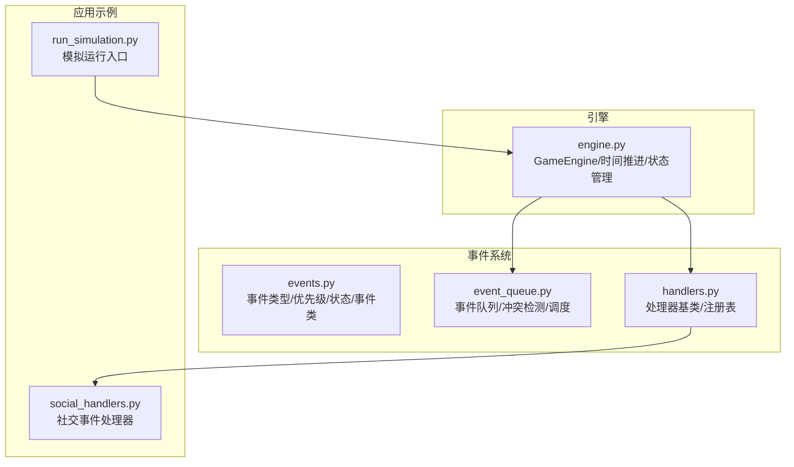
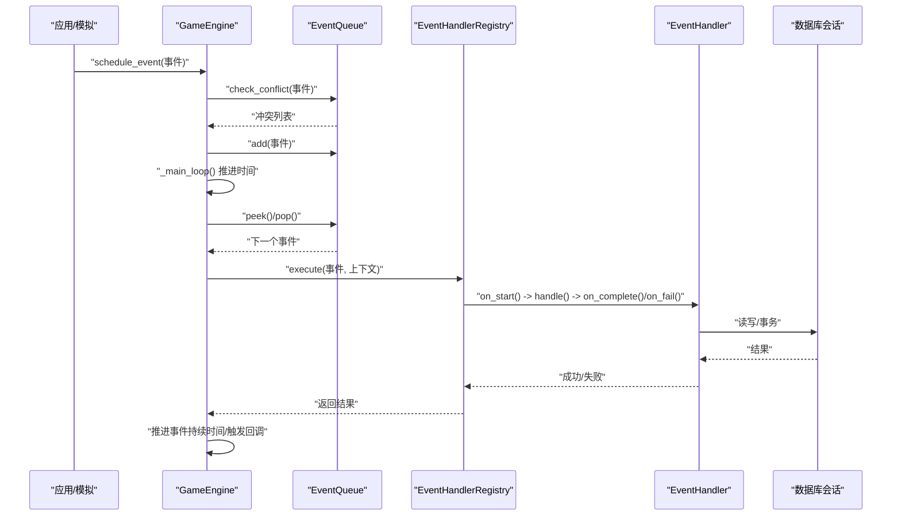
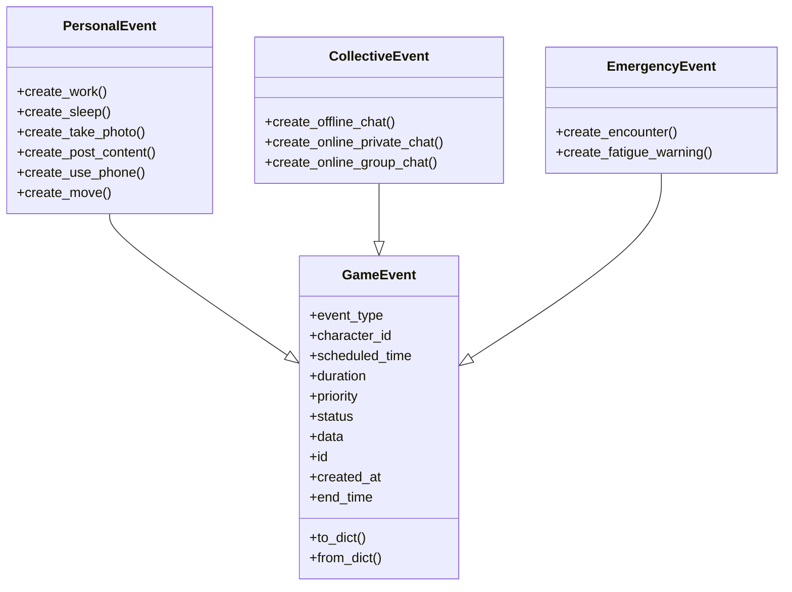
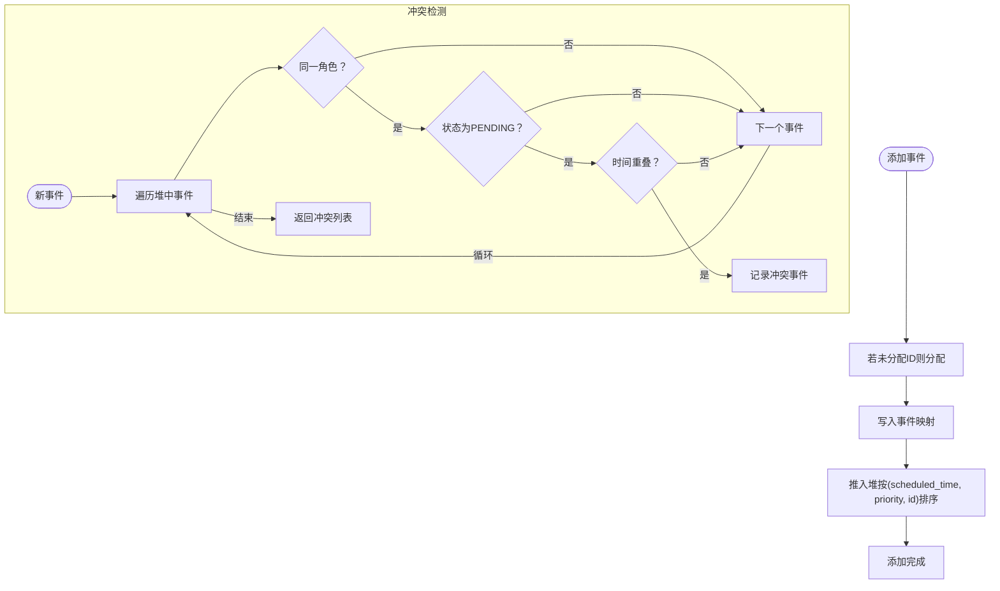
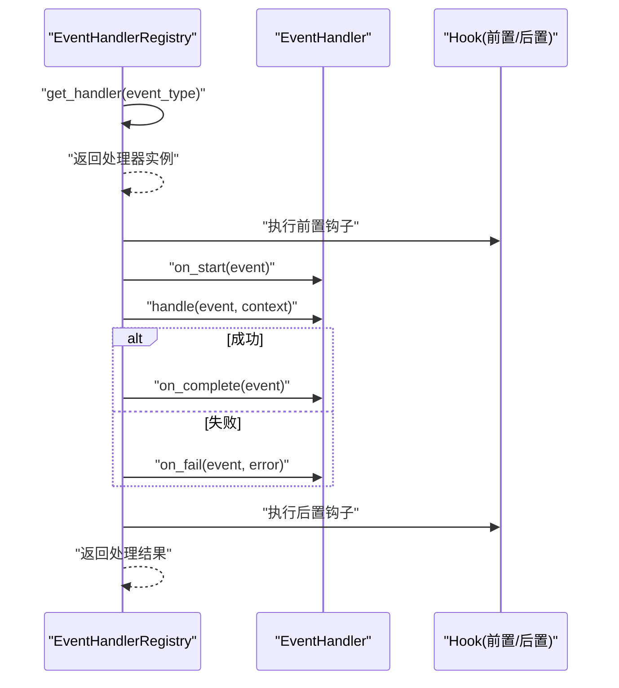
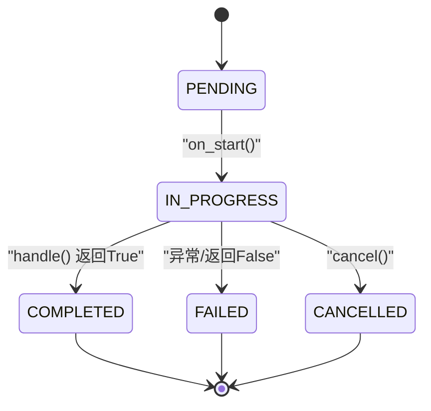
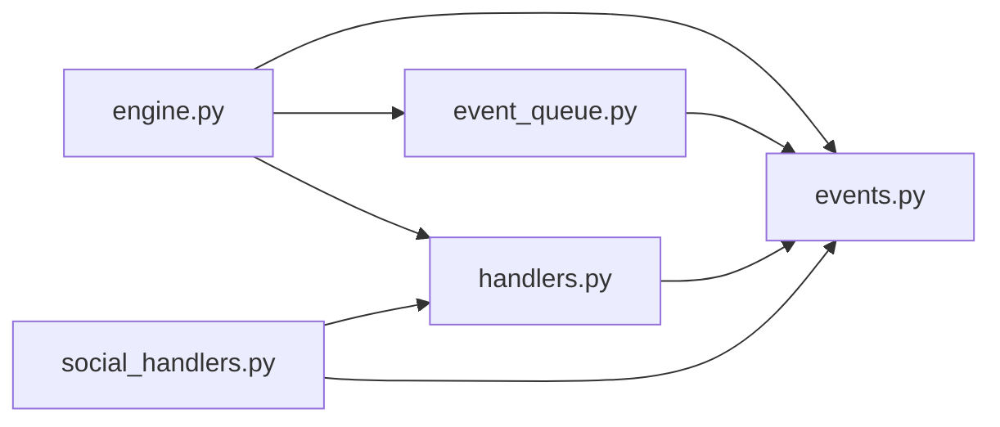

# 事件系统

<cite>
**本文引用的文件**
- [events.py](file://core_engine/event_system/events.py)
- [event_queue.py](file://core_engine/event_system/event_queue.py)
- [handlers.py](file://core_engine/event_system/handlers.py)
- [engine.py](file://core_engine/engine.py)
- [social_handlers.py](file://core_engine/social/social_handlers.py)
- [run_simulation.py](file://run_simulation.py)
</cite>

## 目录
1. [简介](#简介)
2. [项目结构](#项目结构)
3. [核心组件](#核心组件)
4. [架构总览](#架构总览)
5. [详细组件分析](#详细组件分析)
6. [依赖关系分析](#依赖关系分析)
7. [性能考量](#性能考量)
8. [故障排查指南](#故障排查指南)
9. [结论](#结论)
10. [附录](#附录)

## 简介
本技术文档围绕事件系统进行全面解析，涵盖事件类型定义（EventType 枚举）、事件类（GameEvent）设计、事件队列（EventQueue）实现、事件处理器注册机制（EventHandlerRegistry），以及事件生命周期管理与调度策略。文档同时提供事件创建、调度与处理的完整示例路径，并对冲突检测、优先级排序、状态转换与错误处理进行深入说明。

## 项目结构
事件系统位于 core_engine/event_system 目录，主要文件如下：
- events.py：事件类型、优先级、状态与事件类定义
- event_queue.py：事件优先队列、冲突检测与调度策略
- handlers.py：事件处理器抽象与注册表
- engine.py：游戏引擎，整合时间推进、事件调度与状态管理
- social_handlers.py：社交事件处理器示例（USE_PHONE、POST_CONTENT、ONLINE_PRIVATE_CHAT、ENCOUNTER）
- run_simulation.py：模拟运行入口，展示如何集成事件系统

图表来源
- [events.py](file://core_engine/event_system/events.py#L1-L356)
- [event_queue.py](file://core_engine/event_system/event_queue.py#L1-L244)
- [handlers.py](file://core_engine/event_system/handlers.py#L1-L156)
- [engine.py](file://core_engine/engine.py#L1-L429)
- [social_handlers.py](file://core_engine/social/social_handlers.py#L1-L253)
- [run_simulation.py](file://run_simulation.py#L1-L258)

章节来源
- [events.py](file://core_engine/event_system/events.py#L1-L356)
- [event_queue.py](file://core_engine/event_system/event_queue.py#L1-L244)
- [handlers.py](file://core_engine/event_system/handlers.py#L1-L156)
- [engine.py](file://core_engine/engine.py#L1-L429)
- [social_handlers.py](file://core_engine/social/social_handlers.py#L1-L253)
- [run_simulation.py](file://run_simulation.py#L1-L258)

## 核心组件
- 事件类型定义（EventType 枚举）：涵盖个人事件（WORK、WAIT、SLEEP、TAKE_PHOTO、POST_CONTENT、USE_PHONE、MOVE）、集体事件（OFFLINE_CHAT、ONLINE_GROUP_CHAT、ONLINE_PRIVATE_CHAT）与突发事件（ENCOUNTER、FATIGUE_WARNING、VISUAL_EVENT、AUDIO_EVENT）。
- 事件优先级（EventPriority 枚举）：数字越小优先级越高，包括 CRITICAL、EMERGENCY、HIGH、NORMAL、LOW、BACKGROUND。
- 事件状态（EventStatus 枚举）：PENDING、IN_PROGRESS、COMPLETED、CANCELLED、FAILED。
- 事件类（GameEvent）：统一事件模型，包含基础属性、结束时间计算、比较运算符、序列化/反序列化。
- 事件队列（EventQueue）：基于堆的优先队列，支持冲突检测、懒删除、重新调度与范围查询。
- 事件处理器（EventHandler）与注册表（EventHandlerRegistry）：异步处理框架，支持前置/后置钩子、状态回调与单例注册表。
- 引擎（GameEngine）：时间推进、事件调度、状态持久化与回调扩展点。

章节来源
- [events.py](file://core_engine/event_system/events.py#L13-L53)
- [event_queue.py](file://core_engine/event_system/event_queue.py#L29-L244)
- [handlers.py](file://core_engine/event_system/handlers.py#L12-L156)
- [engine.py](file://core_engine/engine.py#L167-L429)

## 架构总览
事件系统采用“事件定义 + 队列调度 + 处理器执行”的分层架构。GameEngine 作为协调者，通过 EventQueue 管理事件的入队、冲突检测与调度；通过 EventHandlerRegistry 将事件类型映射到具体处理器；处理器在异步回调中完成业务逻辑，并更新事件状态。

图表来源
- [engine.py](file://core_engine/engine.py#L288-L382)
- [event_queue.py](file://core_engine/event_system/event_queue.py#L73-L116)
- [handlers.py](file://core_engine/event_system/handlers.py#L99-L137)

## 详细组件分析

### 事件类型定义（EventType 枚举）
- 个人事件：WORK、WAIT、SLEEP、TAKE_PHOTO、POST_CONTENT、USE_PHONE、MOVE
- 集体事件：OFFLINE_CHAT、ONLINE_GROUP_CHAT、ONLINE_PRIVATE_CHAT
- 突发事件：ENCOUNTER、FATIGUE_WARNING、VISUAL_EVENT、AUDIO_EVENT

这些类型用于区分事件性质与处理方式，配合优先级与状态共同决定调度策略。

章节来源
- [events.py](file://core_engine/event_system/events.py#L13-L34)

### 事件优先级与状态
- 优先级：CRITICAL > EMERGENCY > HIGH > NORMAL > LOW > BACKGROUND
- 状态：PENDING、IN_PROGRESS、COMPLETED、CANCELLED、FAILED

优先级与状态为事件调度与生命周期管理提供基础。

章节来源
- [events.py](file://core_engine/event_system/events.py#L36-L53)

### 事件类（GameEvent）设计
- 属性：event_type、character_id、scheduled_time、duration、priority、status、data、id、created_at
- 行为：
  - end_time：scheduled_time + duration
  - 比较运算符：按 scheduled_time 优先，再按 priority.value
  - 序列化/反序列化：to_dict/from_dict
- 子类：
  - PersonalEvent：工作、睡眠、拍照、发帖、看手机、移动等便捷构造
  - CollectiveEvent：线下群聊、网络私聊、群聊等多人事件
  - EmergencyEvent：紧急/突发事件，可打断或提醒

图表来源
- [events.py](file://core_engine/event_system/events.py#L55-L356)

章节来源
- [events.py](file://core_engine/event_system/events.py#L55-L356)

### 事件队列（EventQueue）实现
- 数据结构：堆（heapq）+ 映射（_event_map）+ 懒删除集合（_cancelled）
- 关键能力：
  - add：分配事件ID、入堆、记录映射
  - cancel：标记为 CANCELLED，懒删除在清理阶段移除
  - peek/pop：取队首事件，内部清理无效项
  - get_next_events：按时间获取一批事件
  - get_events_in_range：时间窗口查询
  - get_character_events：按角色过滤并排序
  - check_conflict：基于时间重叠的冲突检测
  - can_schedule：快速判断是否可调度
  - reschedule：重新安排时间并验证冲突
  - _cleanup：清理已取消事件
  - to_list：导出有序事件列表

图表来源
- [event_queue.py](file://core_engine/event_system/event_queue.py#L46-L214)

章节来源
- [event_queue.py](file://core_engine/event_system/event_queue.py#L29-L244)

### 事件处理器注册机制（EventHandlerRegistry）
- 抽象处理器（EventHandler）：定义 handle、on_start、on_complete、on_cancel、on_fail 等回调
- 注册表（EventHandlerRegistry）：单例，维护 event_type -> handler 映射，支持 before/after 钩子
- 执行流程：
  - execute：根据事件类型获取处理器，执行前置钩子
  - 调用处理器 on_start -> handle，根据返回值或异常切换状态
  - 执行后置钩子，返回最终结果
- 装饰器：@event_handler 自动注册处理器

图表来源
- [handlers.py](file://core_engine/event_system/handlers.py#L99-L137)

章节来源
- [handlers.py](file://core_engine/event_system/handlers.py#L12-L156)

### 引擎（GameEngine）与事件生命周期
- 时间推进：按分钟推进，触发 tick 回调与日期变更回调
- 事件调度：_main_loop 中按时间推进到事件开始，弹出事件并执行
- 生命周期：
  - 调度：schedule_event -> check_conflict -> add
  - 执行：_execute_event -> Registry.execute -> 处理器回调 -> 推进持续时间 -> 回调通知
  - 状态：PENDING -> IN_PROGRESS -> COMPLETED/FAILED/CANCELLED
- 持久化：保存/加载 GameState 与事件队列

图表来源
- [engine.py](file://core_engine/engine.py#L343-L382)
- [handlers.py](file://core_engine/event_system/handlers.py#L33-L48)

章节来源
- [engine.py](file://core_engine/engine.py#L167-L429)

## 依赖关系分析
- engine.py 依赖 events.py（事件类型/状态）、event_queue.py（队列）、handlers.py（注册表）
- event_queue.py 依赖 events.py（GameEvent、EventStatus、EventPriority）
- handlers.py 依赖 events.py（EventType、EventStatus）
- social_handlers.py 依赖 handlers.py（EventHandler、event_handler）、events.py（EventType）

图表来源
- [engine.py](file://core_engine/engine.py#L14-L16)
- [event_queue.py](file://core_engine/event_system/event_queue.py#L10)
- [handlers.py](file://core_engine/event_system/handlers.py#L9)
- [social_handlers.py](file://core_engine/social/social_handlers.py#L13-L15)

章节来源
- [engine.py](file://core_engine/engine.py#L14-L16)
- [event_queue.py](file://core_engine/event_system/event_queue.py#L10)
- [handlers.py](file://core_engine/event_system/handlers.py#L9)
- [social_handlers.py](file://core_engine/social/social_handlers.py#L13-L15)

## 性能考量
- 事件队列采用堆结构，插入/弹出复杂度 O(log n)，冲突检测线性扫描 O(n)；适合中小规模事件集。
- 懒删除策略减少频繁重建堆的成本，但需定期清理。
- 事件序列化/反序列化为 JSON 字典，便于持久化与跨进程传输。
- 引擎主循环使用 asyncio，事件处理为异步回调，避免阻塞。

[本节为通用性能讨论，无需特定文件来源]

## 故障排查指南
- 无处理器注册：当执行事件时打印警告，确认 @event_handler 或手动注册。
- 冲突检测失败：schedule_event 返回 None，检查角色时间线重叠与持续时间。
- 事件取消：cancel 标记为 CANCELLED，需等待清理或显式清理队列。
- 异常处理：处理器 on_fail 将事件置为 FAILED，检查异常日志与上下文。
- 持久化问题：保存/加载事件队列时注意文件路径与格式一致性。

章节来源
- [handlers.py](file://core_engine/event_system/handlers.py#L110-L114)
- [engine.py](file://core_engine/engine.py#L221-L226)
- [event_queue.py](file://core_engine/event_system/event_queue.py#L61-L71)

## 结论
事件系统通过清晰的类型与状态模型、高效的优先队列与冲突检测、灵活的处理器注册与钩子机制，实现了可扩展、可维护的事件驱动架构。结合 GameEngine 的时间推进与回调扩展点，能够支撑复杂的社交与行为模拟场景。

[本节为总结性内容，无需特定文件来源]

## 附录

### 事件创建、调度与处理的完整示例路径
以下示例均提供文件路径而非代码片段，便于定位实现细节。

- 创建个人事件（工作）
  - 路径：[events.py](file://core_engine/event_system/events.py#L139-L150)
  - 使用：PersonalEvent.create_work(...)
- 创建睡眠事件
  - 路径：[events.py](file://core_engine/event_system/events.py#L152-L163)
  - 使用：PersonalEvent.create_sleep(...)
- 创建拍照事件
  - 路径：[events.py](file://core_engine/event_system/events.py#L165-L182)
  - 使用：PersonalEvent.create_take_photo(...)
- 创建发帖事件
  - 路径：[events.py](file://core_engine/event_system/events.py#L184-L199)
  - 使用：PersonalEvent.create_post_content(...)
- 创建看手机事件
  - 路径：[events.py](file://core_engine/event_system/events.py#L201-L221)
  - 使用：PersonalEvent.create_use_phone(...)
- 创建移动事件
  - 路径：[events.py](file://core_engine/event_system/events.py#L223-L239)
  - 使用：PersonalEvent.create_move(...)

- 调度事件（冲突检测）
  - 路径：[engine.py](file://core_engine/engine.py#L211-L226)
  - 使用：GameEngine.schedule_event(event)

- 执行事件（处理器）
  - 路径：[engine.py](file://core_engine/engine.py#L343-L382)
  - 路径：[handlers.py](file://core_engine/event_system/handlers.py#L99-L137)

- 事件处理器示例（社交）
  - 路径：[social_handlers.py](file://core_engine/social/social_handlers.py#L18-L69)（USE_PHONE）
  - 路径：[social_handlers.py](file://core_engine/social/social_handlers.py#L72-L99)（POST_CONTENT）
  - 路径：[social_handlers.py](file://core_engine/social/social_handlers.py#L102-L145)（ONLINE_PRIVATE_CHAT）
  - 路径：[social_handlers.py](file://core_engine/social/social_handlers.py#L148-L205)（ENCOUNTER）

- 模拟运行入口
  - 路径：[run_simulation.py](file://run_simulation.py#L1-L258)

### 事件生命周期与状态转换图

图表来源
- [handlers.py](file://core_engine/event_system/handlers.py#L33-L48)