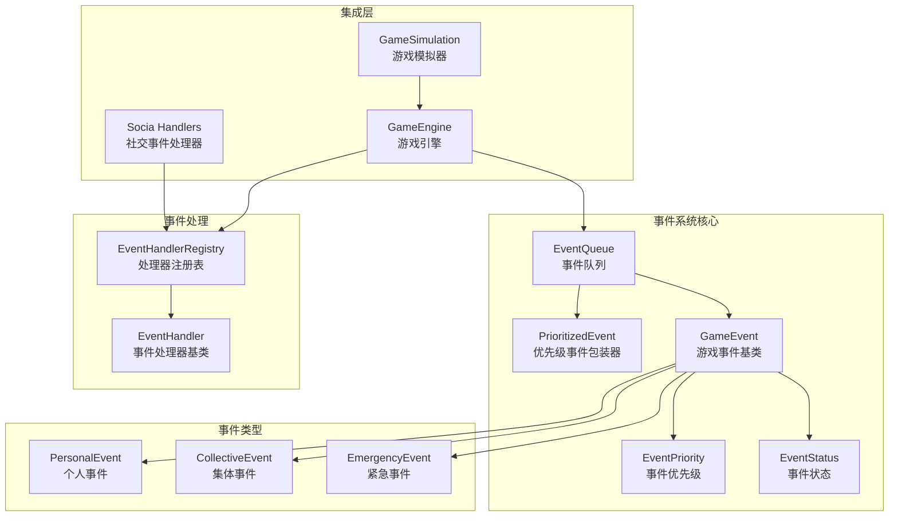
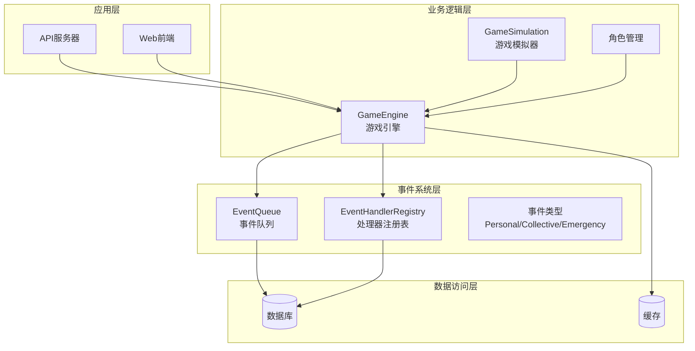
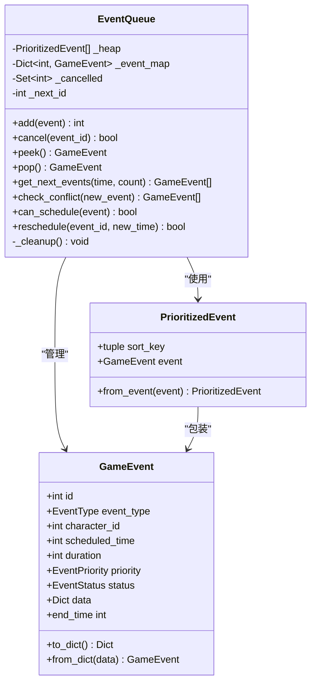
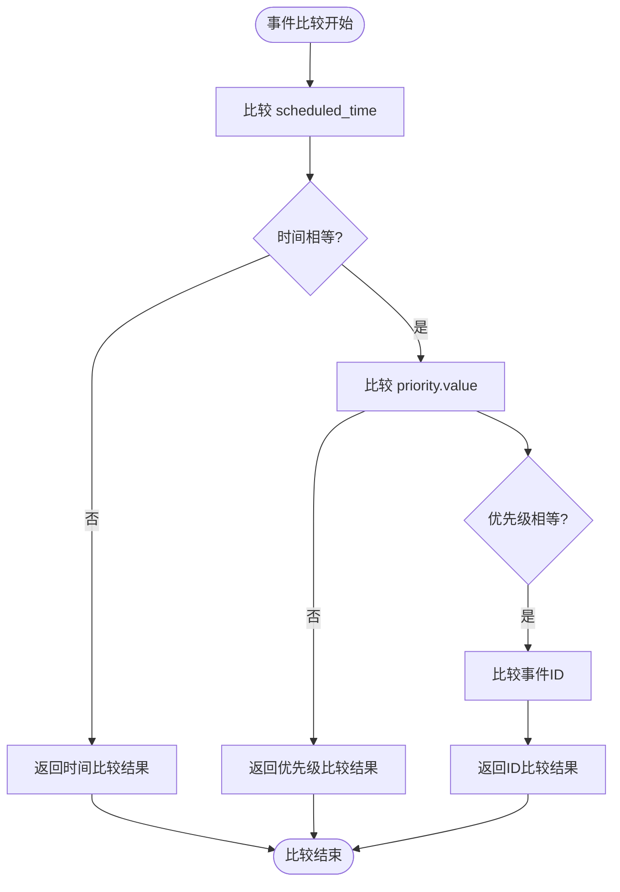
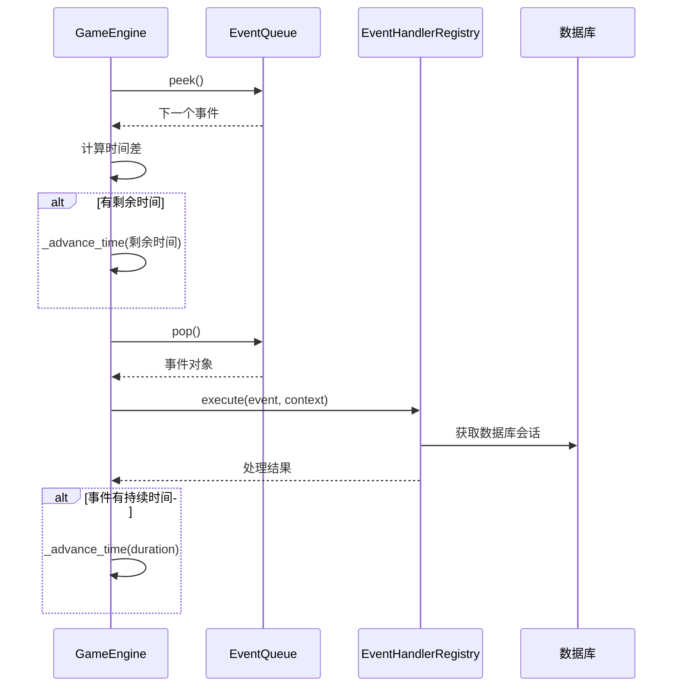
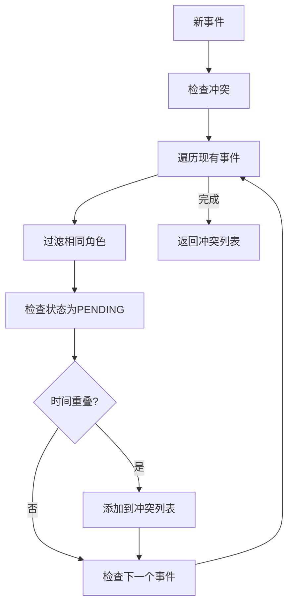
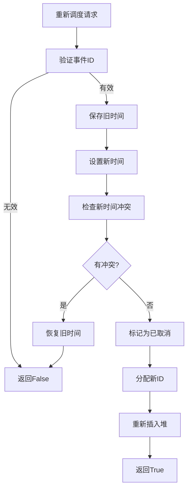
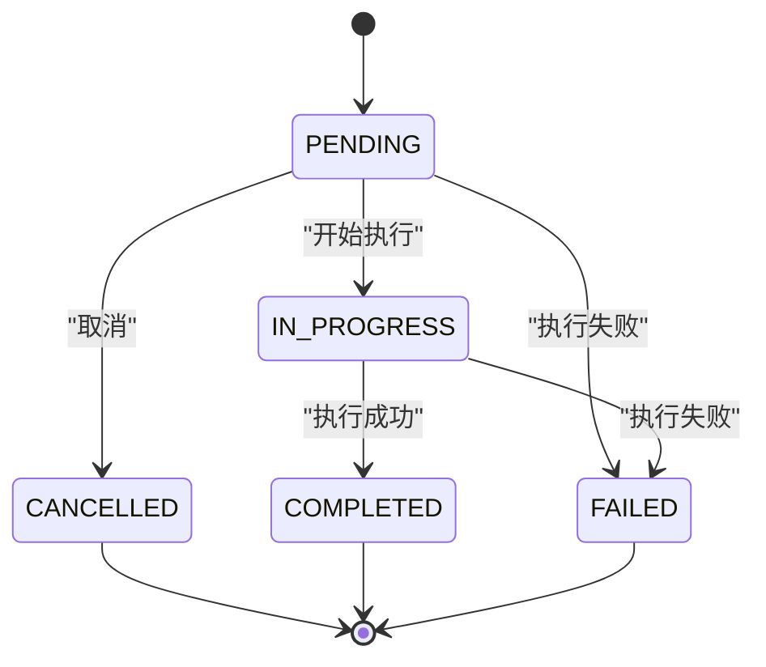
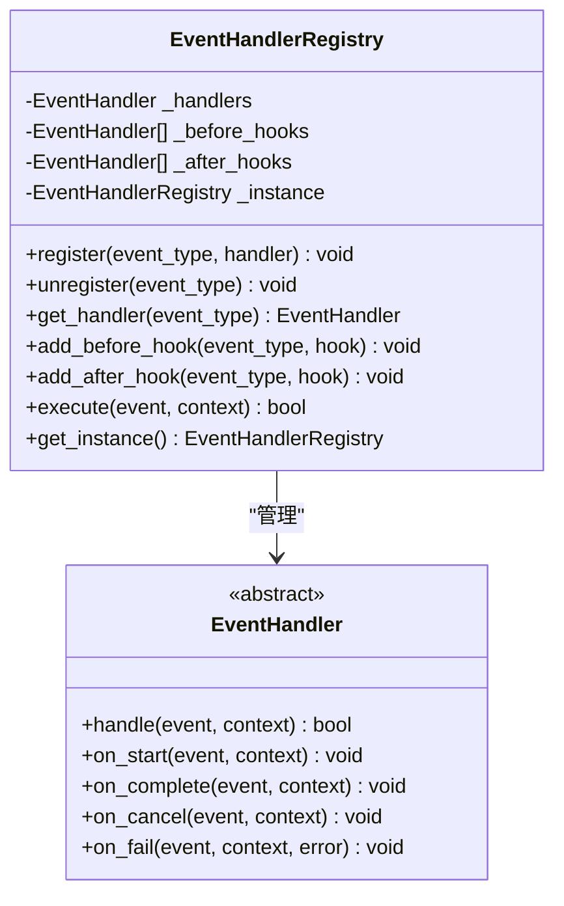
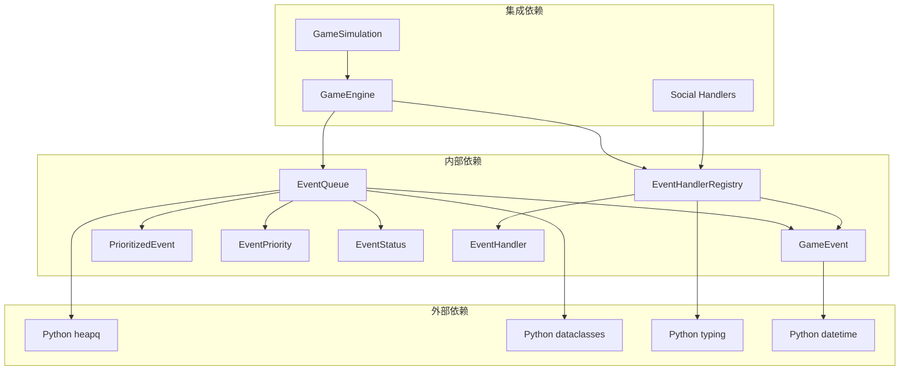

# 事件队列管理

<cite>
**本文档引用的文件**
- [event_queue.py](file://core_engine/event_system/event_queue.py)
- [events.py](file://core_engine/event_system/events.py)
- [handlers.py](file://core_engine/event_system/handlers.py)
- [engine.py](file://core_engine/engine.py)
- [simulation.py](file://core_engine/simulation.py)
- [social_handlers.py](file://core_engine/social/social_handlers.py)
- [__init__.py](file://core_engine/event_system/__init__.py)
</cite>

## 目录
1. [简介](#简介)
2. [项目结构](#项目结构)
3. [核心组件](#核心组件)
4. [架构概览](#架构概览)
5. [详细组件分析](#详细组件分析)
6. [依赖关系分析](#依赖关系分析)
7. [性能考虑](#性能考虑)
8. [故障排除指南](#故障排除指南)
9. [结论](#结论)

## 简介

事件队列管理系统是AI社区项目的核心组件之一，负责管理游戏中的各种事件调度和执行。该系统基于优先队列实现了高效的时间驱动事件调度机制，支持多种类型的事件（个人事件、集体事件、突发事件），并提供了完整的事件冲突检测和解决机制。

系统采用异步编程模型，通过事件处理器注册表实现事件的动态分发，支持事件状态管理和错误处理。整个架构设计注重可扩展性和性能优化，能够处理复杂的社交场景和角色互动。

## 项目结构

事件队列系统位于`core_engine/event_system/`目录下，包含以下核心文件：



**图表来源**
- [event_queue.py](file://core_engine/event_system/event_queue.py#L29-L244)
- [events.py](file://core_engine/event_system/events.py#L55-L356)
- [handlers.py](file://core_engine/event_system/handlers.py#L12-L156)
- [engine.py](file://core_engine/engine.py#L167-L429)

**章节来源**
- [event_queue.py](file://core_engine/event_system/event_queue.py#L1-L244)
- [events.py](file://core_engine/event_system/events.py#L1-L356)
- [handlers.py](file://core_engine/event_system/handlers.py#L1-L156)

## 核心组件

### 事件优先队列（EventQueue）

事件优先队列是系统的核心数据结构，基于Python的`heapq`模块实现。它维护一个最小堆，按照事件的计划执行时间、优先级和唯一ID进行排序。

关键特性：
- **时间排序**：按`scheduled_time`升序排列
- **优先级排序**：同一时间点按`priority.value`升序排列
- **唯一性保证**：使用事件ID确保排序稳定性
- **懒删除机制**：支持事件取消但不立即从堆中移除

### 优先级事件包装器（PrioritizedEvent）

为了实现稳定的排序，系统使用`@dataclass(order=True)`装饰器创建了一个特殊的包装器类。排序键包含三个元素：
1. `scheduled_time` - 事件计划执行时间
2. `priority.value` - 优先级数值（数值越小优先级越高）
3. `id(event)` - 事件唯一标识符

### 游戏事件基类（GameEvent）

所有事件的基础类，定义了事件的基本属性和行为：
- **标识属性**：`id`、`event_type`、`character_id`
- **时间属性**：`scheduled_time`、`duration`、`end_time`
- **状态属性**：`priority`、`status`、`data`
- **生命周期方法**：`to_dict()`、`from_dict()`

### 事件处理器系统

事件处理器采用注册表模式，支持：
- **动态注册**：通过装饰器自动注册处理器
- **钩子机制**：支持事件处理前后的钩子函数
- **状态管理**：自动管理事件状态转换
- **错误处理**：统一的异常捕获和状态设置

**章节来源**
- [event_queue.py](file://core_engine/event_system/event_queue.py#L29-L244)
- [events.py](file://core_engine/event_system/events.py#L55-L129)
- [handlers.py](file://core_engine/event_system/handlers.py#L12-L156)

## 架构概览

事件队列系统采用分层架构设计，各层职责明确：



**图表来源**
- [engine.py](file://core_engine/engine.py#L167-L429)
- [simulation.py](file://core_engine/simulation.py#L64-L529)
- [event_queue.py](file://core_engine/event_system/event_queue.py#L29-L244)

系统的工作流程：

1. **事件创建**：业务逻辑创建GameEvent实例
2. **冲突检测**：检查新事件与现有事件的时间冲突
3. **事件入队**：将事件添加到优先队列
4. **时间推进**：引擎推进游戏时间到下一个事件
5. **事件执行**：通过处理器注册表分发事件
6. **状态更新**：自动更新事件状态和统计数据

**章节来源**
- [engine.py](file://core_engine/engine.py#L288-L382)
- [event_queue.py](file://core_engine/event_system/event_queue.py#L46-L214)

## 详细组件分析

### 事件队列实现架构

#### 数据结构设计

事件队列使用双重数据结构确保高效操作：



**图表来源**
- [event_queue.py](file://core_engine/event_system/event_queue.py#L29-L244)
- [events.py](file://core_engine/event_system/events.py#L55-L129)

#### 事件入队（enqueue）操作

事件入队操作的时间复杂度为O(log n)，包含以下步骤：

1. **ID分配**：如果事件没有ID，分配自增ID
2. **映射建立**：将事件ID映射到事件对象
3. **堆插入**：使用`heapq.heappush`插入到优先队列
4. **排序键构建**：创建包含时间、优先级和ID的排序键

#### 事件出队（dequeue）操作

事件出队操作同样为O(log n)：

1. **清理阶段**：执行懒删除清理
2. **堆弹出**：使用`heapq.heappop`获取队首事件
3. **映射更新**：从事件映射中移除对应条目
4. **返回事件**：返回原始事件对象

#### 时间排序算法

系统采用复合排序键确保稳定的时间排序：



**图表来源**
- [event_queue.py](file://core_engine/event_system/event_queue.py#L215-L224)
- [events.py](file://core_engine/event_system/events.py#L86-L96)

**章节来源**
- [event_queue.py](file://core_engine/event_system/event_queue.py#L46-L116)

### 事件调度策略

#### 时间推进机制

引擎采用智能时间推进策略：



**图表来源**
- [engine.py](file://core_engine/engine.py#L288-L382)

#### 事件过滤和批量处理

系统支持多种事件过滤和批量处理模式：

1. **时间范围过滤**：`get_events_in_range(start_time, end_time)`
2. **角色过滤**：`get_character_events(character_id, start_time, end_time)`
3. **批量获取**：`get_next_events(game_time, count)`

#### 优先级冲突处理

冲突检测算法确保事件调度的正确性：



**图表来源**
- [event_queue.py](file://core_engine/event_system/event_queue.py#L154-L178)

**章节来源**
- [event_queue.py](file://core_engine/event_system/event_queue.py#L91-L183)
- [engine.py](file://core_engine/engine.py#L211-L226)

### 事件冲突检测和解决

#### 时间重叠检测

系统使用区间重叠检测算法：

对于两个事件A和B，如果满足以下条件则认为发生冲突：
- `not (A.end_time <= B.start_time or A.start_time >= B.end_time)`

这个逻辑等价于：两个区间有公共部分。

#### 优先级仲裁

当检测到冲突时，系统采用以下仲裁策略：

1. **角色特定冲突**：只检查同一角色的事件冲突
2. **状态过滤**：只考虑状态为`PENDING`的事件
3. **时间窗口**：检查事件的完整持续时间窗口

#### 重新调度机制

当需要调整事件时间时，系统提供安全的重新调度：



**图表来源**
- [event_queue.py](file://core_engine/event_system/event_queue.py#L184-L213)

**章节来源**
- [event_queue.py](file://core_engine/event_system/event_queue.py#L154-L213)

### 事件状态管理

#### 状态转换图



#### 异常处理机制

处理器基类提供完整的异常处理：

1. **处理器异常**：捕获处理器抛出的所有异常
2. **状态恢复**：将事件状态设置为`FAILED`
3. **错误传播**：将异常传递给上层调用者
4. **资源清理**：确保数据库连接等资源正确关闭

**章节来源**
- [events.py](file://core_engine/event_system/events.py#L46-L53)
- [handlers.py](file://core_engine/event_system/handlers.py#L33-L47)

### 事件处理器系统

#### 处理器注册表

处理器注册表采用单例模式，提供线程安全的注册和查找机制：



**图表来源**
- [handlers.py](file://core_engine/event_system/handlers.py#L50-L156)

#### 装饰器模式

系统使用Python装饰器简化处理器注册：

```python
@event_handler(EventType.WORK)
class WorkHandler(EventHandler):
    async def handle(self, event, context):
        # 处理工作事件
        pass
```

**章节来源**
- [handlers.py](file://core_engine/event_system/handlers.py#L12-L156)

## 依赖关系分析

### 组件耦合度

事件队列系统具有良好的内聚性和较低的耦合度：



**图表来源**
- [event_queue.py](file://core_engine/event_system/event_queue.py#L7-L10)
- [handlers.py](file://core_engine/event_system/handlers.py#L7-L9)
- [engine.py](file://core_engine/engine.py#L14-L16)

### 循环依赖检测

系统设计避免了循环依赖：
- EventQueue不依赖GameEngine
- EventHandlerRegistry不依赖具体处理器
- 所有依赖都是单向的

**章节来源**
- [__init__.py](file://core_engine/event_system/__init__.py#L3-L21)

## 性能考虑

### 时间复杂度分析

| 操作 | 时间复杂度 | 空间复杂度 | 说明 |
|------|------------|------------|------|
| 添加事件 | O(log n) | O(1) | 堆插入操作 |
| 取出事件 | O(log n) | O(1) | 堆弹出操作 |
| 查看队首 | O(log n) | O(1) | 堆顶访问 |
| 冲突检测 | O(n) | O(k) | k为冲突数量 |
| 重新调度 | O(n log n) | O(n) | 需要重建堆 |

### 内存管理策略

1. **懒删除机制**：取消的事件不立即从堆中移除，减少内存碎片
2. **事件映射**：使用字典快速查找事件，避免遍历整个堆
3. **清理过程**：定期清理已取消的事件，释放内存空间
4. **对象池**：事件对象在生命周期内复用

### 优化建议

1. **批量操作**：对于大量事件操作，考虑批量处理以减少堆操作次数
2. **预分配**：对于已知大小的事件集，预分配堆容量
3. **缓存策略**：对频繁访问的事件进行缓存
4. **并发控制**：在高并发场景下考虑使用锁机制

## 故障排除指南

### 常见问题诊断

#### 事件无法入队

**症状**：`schedule_event`返回None
**原因**：事件与现有事件发生时间冲突
**解决方案**：
1. 检查事件的`scheduled_time`和`duration`
2. 使用`check_conflict`方法验证冲突
3. 调整事件时间或优先级

#### 事件执行失败

**症状**：事件状态变为`FAILED`
**原因**：处理器异常或数据库连接问题
**解决方案**：
1. 检查处理器实现
2. 验证数据库连接
3. 查看异常日志

#### 内存泄漏

**症状**：内存使用持续增长
**原因**：取消的事件未及时清理
**解决方案**：
1. 定期调用`_cleanup`方法
2. 检查事件生命周期管理
3. 监控事件队列长度

**章节来源**
- [engine.py](file://core_engine/engine.py#L374-L381)
- [event_queue.py](file://core_engine/event_system/event_queue.py#L215-L224)

## 结论

事件队列管理系统是一个设计精良的异步事件调度框架，具有以下特点：

1. **高效性**：基于优先队列的O(log n)操作复杂度
2. **可靠性**：完善的错误处理和状态管理机制
3. **可扩展性**：插件化的事件处理器系统
4. **可维护性**：清晰的代码结构和文档

系统成功实现了复杂社交场景下的事件调度需求，为AI社区项目提供了坚实的技术基础。通过合理的架构设计和性能优化，该系统能够处理大规模的并发事件处理需求。

未来可以考虑的改进方向：
- 添加事件队列持久化支持
- 实现事件依赖关系管理
- 增加事件统计和监控功能
- 优化大规模事件处理的性能