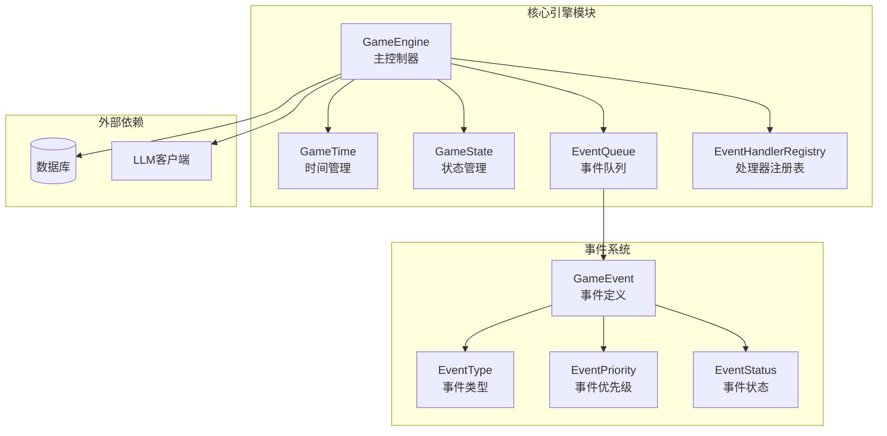
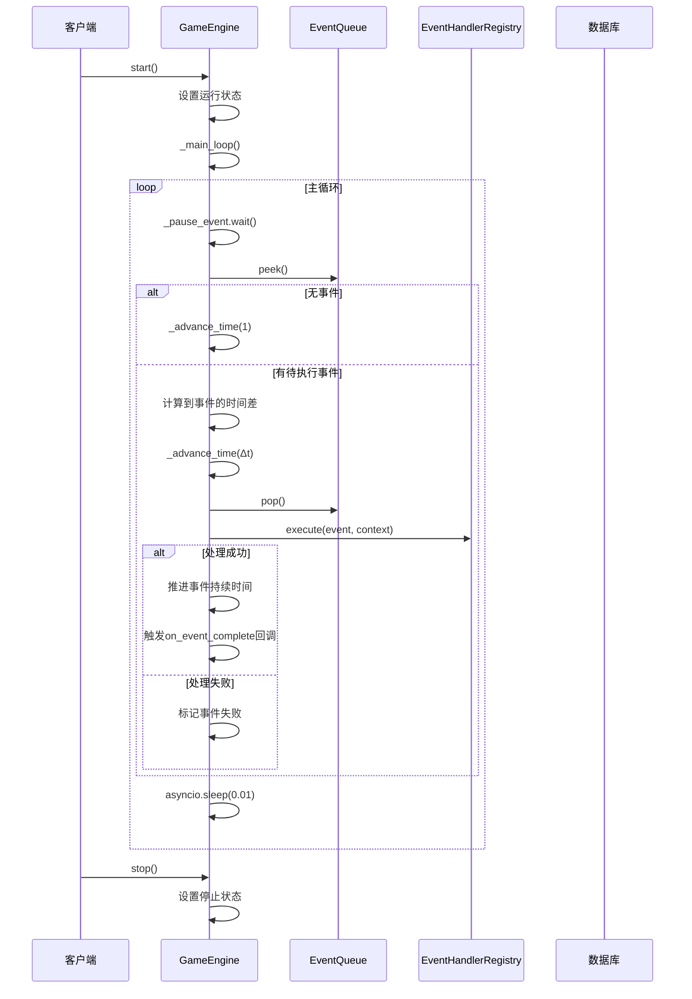
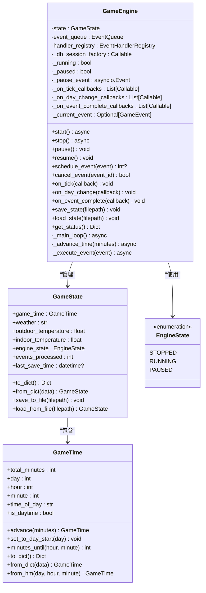
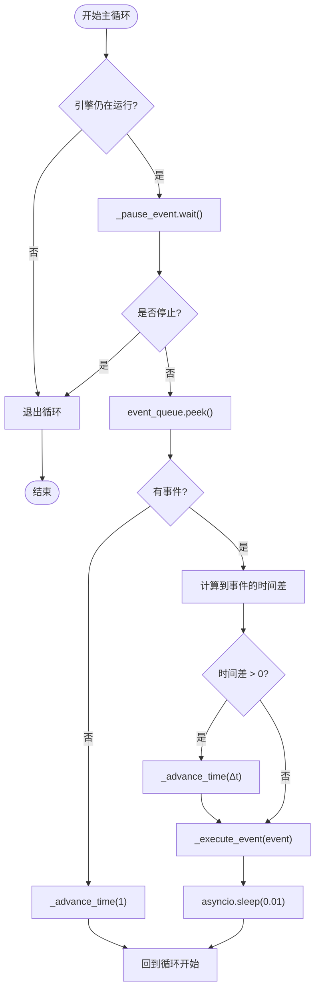
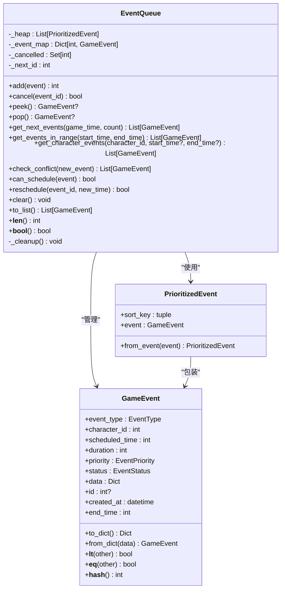
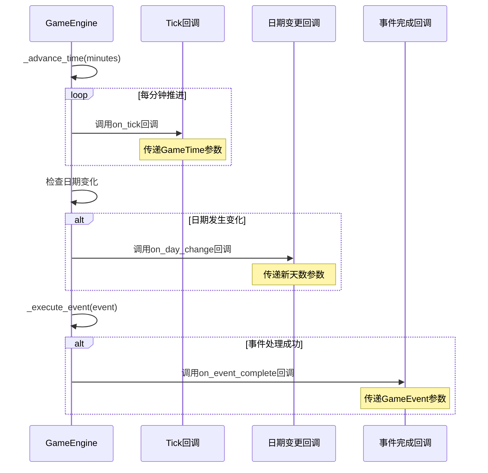
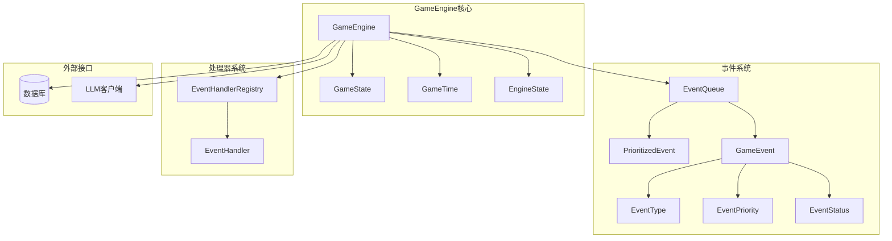
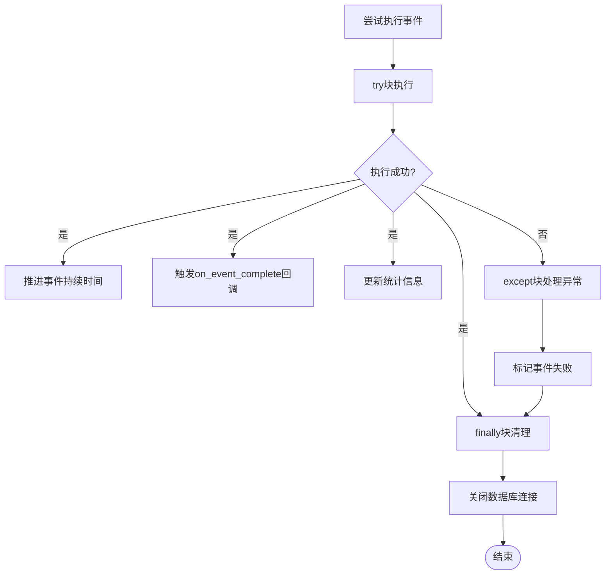

# GameEngine主控制器

<cite>
**本文引用的文件**
- [core_engine/engine.py](file://core_engine/engine.py)
- [core_engine/simulation.py](file://core_engine/simulation.py)
- [core_engine/event_system/events.py](file://core_engine/event_system/events.py)
- [core_engine/event_system/event_queue.py](file://core_engine/event_system/event_queue.py)
- [core_engine/event_system/handlers.py](file://core_engine/event_system/handlers.py)
- [run_simulation.py](file://run_simulation.py)
- [README.md](file://README.md)
</cite>

## 目录
1. [简介](#简介)
2. [项目结构](#项目结构)
3. [核心组件](#核心组件)
4. [架构概览](#架构概览)
5. [详细组件分析](#详细组件分析)
6. [依赖关系分析](#依赖关系分析)
7. [性能考虑](#性能考虑)
8. [故障排除指南](#故障排除指南)
9. [结论](#结论)
10. [附录](#附录)

## 简介
本文件为GameEngine主控制器的详细技术文档，深入解析游戏引擎的核心设计架构，包括：
- 引擎生命周期管理（start、stop、pause、resume方法）
- 事件调度机制（schedule_event、cancel_event方法）
- 状态管理（EngineState枚举）
- 主循环算法（_main_loop）的实现原理
- 回调系统的三种类型：on_tick每tick回调、on_day_change日期变更回调、on_event_complete事件完成回调的注册和触发机制
- 引擎启动、停止、暂停的具体操作示例和最佳实践
- 错误处理策略、性能优化建议和调试技巧

## 项目结构
GameEngine位于core_engine模块中，与事件系统、模拟器共同构成AI社区的仿真核心。其主要职责是：
- 管理游戏时间推进
- 调度和执行事件
- 维护引擎状态
- 提供暂停/恢复机制
- 管理回调系统

**图表来源**
- [core_engine/engine.py](file://core_engine/engine.py#L167-L429)
- [core_engine/event_system/events.py](file://core_engine/event_system/events.py#L13-L356)
- [core_engine/event_system/event_queue.py](file://core_engine/event_system/event_queue.py#L29-L244)
- [core_engine/event_system/handlers.py](file://core_engine/event_system/handlers.py#L50-L156)

**章节来源**
- [core_engine/engine.py](file://core_engine/engine.py#L1-L429)
- [README.md](file://README.md#L1-L290)

## 核心组件
GameEngine主控制器包含以下关键组件：

### 引擎状态管理
- **EngineState枚举**：定义引擎的运行状态（STOPPED、RUNNING、PAUSED）
- **GameState数据类**：封装游戏状态，支持序列化和恢复
- **GameTime数据类**：管理游戏时间，提供时间推进和格式化功能

### 事件调度系统
- **EventQueue**：基于优先队列的事件调度系统
- **EventHandlerRegistry**：事件处理器注册表，支持钩子机制
- **GameEvent**：事件基类，支持多种事件类型和优先级

### 生命周期管理
- **异步事件**：使用asyncio.Event实现暂停/恢复机制
- **运行标志**：_running和_paused标志控制引擎状态
- **回调系统**：支持三种类型的回调注册和触发

**章节来源**
- [core_engine/engine.py](file://core_engine/engine.py#L19-L165)
- [core_engine/event_system/events.py](file://core_engine/event_system/events.py#L13-L129)
- [core_engine/event_system/event_queue.py](file://core_engine/event_system/event_queue.py#L29-L90)
- [core_engine/event_system/handlers.py](file://core_engine/event_system/handlers.py#L50-L84)

## 架构概览
GameEngine采用事件驱动的时间管理模式，通过优先队列管理事件调度，结合异步编程实现高效的并发处理。

**图表来源**
- [core_engine/engine.py](file://core_engine/engine.py#L240-L319)
- [core_engine/engine.py](file://core_engine/engine.py#L320-L382)

**章节来源**
- [core_engine/engine.py](file://core_engine/engine.py#L288-L382)

## 详细组件分析

### GameEngine类分析
GameEngine是整个引擎的核心控制器，负责协调各个子系统的运作。

**图表来源**
- [core_engine/engine.py](file://core_engine/engine.py#L167-L429)
- [core_engine/engine.py](file://core_engine/engine.py#L112-L165)
- [core_engine/engine.py](file://core_engine/engine.py#L26-L110)

#### 生命周期管理方法
- **start()**：启动引擎，设置运行状态并启动主循环
- **stop()**：停止引擎，清除暂停状态并设置停止状态
- **pause()**：暂停引擎，设置暂停标志并清除异步事件
- **resume()**：恢复引擎，清除暂停标志并设置运行状态

#### 事件调度方法
- **schedule_event()**：调度新事件，进行冲突检测并添加到队列
- **cancel_event()**：取消指定事件，使用懒删除策略
- **get_character_schedule()**：获取角色的事件计划

#### 回调系统
- **on_tick()**：注册每tick回调，用于时间推进时的通知
- **on_day_change()**：注册日期变更回调，用于天数变化时的通知
- **on_event_complete()**：注册事件完成回调，用于事件执行完成时的通知

**章节来源**
- [core_engine/engine.py](file://core_engine/engine.py#L240-L287)

### 主循环算法分析
主循环是GameEngine的核心，实现了事件驱动的时间推进机制。

**图表来源**
- [core_engine/engine.py](file://core_engine/engine.py#L288-L319)

#### 主循环执行流程
1. **暂停等待**：使用asyncio.Event等待暂停结束
2. **事件检查**：检查事件队列是否有待执行事件
3. **时间推进**：如果没有事件，推进1分钟；如果有事件，推进到事件开始时间
4. **事件执行**：从队列取出事件并执行处理器
5. **回调触发**：触发相应的回调函数
6. **短暂停顿**：让出控制权给其他协程

**章节来源**
- [core_engine/engine.py](file://core_engine/engine.py#L288-L319)

### 事件队列系统分析
事件队列系统基于优先队列实现，支持复杂的事件调度需求。

**图表来源**
- [core_engine/event_system/event_queue.py](file://core_engine/event_system/event_queue.py#L29-L244)
- [core_engine/event_system/events.py](file://core_engine/event_system/events.py#L55-L129)

#### 事件调度算法
1. **优先级排序**：使用(计划时间, 优先级, 事件ID)作为排序键
2. **冲突检测**：检查新事件与现有事件的时间重叠
3. **懒删除策略**：取消事件时标记为已取消而非立即移除
4. **范围查询**：支持按时间范围和角色ID查询事件

**章节来源**
- [core_engine/event_system/event_queue.py](file://core_engine/event_system/event_queue.py#L46-L225)

### 回调系统分析
GameEngine提供了三种不同类型的回调系统，用于响应引擎的不同事件。

**图表来源**
- [core_engine/engine.py](file://core_engine/engine.py#L320-L382)

#### 回调类型详解
1. **on_tick回调**：每分钟时间推进时触发，用于实时更新UI或执行周期性任务
2. **on_day_change回调**：当日期发生变更时触发，用于执行每日统计或重置逻辑
3. **on_event_complete回调**：事件执行完成后触发，用于处理事件结果或执行后续逻辑

**章节来源**
- [core_engine/engine.py](file://core_engine/engine.py#L276-L287)
- [core_engine/engine.py](file://core_engine/engine.py#L328-L372)

## 依赖关系分析

**图表来源**
- [core_engine/engine.py](file://core_engine/engine.py#L14-L17)
- [core_engine/event_system/events.py](file://core_engine/event_system/events.py#L7-L11)
- [core_engine/event_system/event_queue.py](file://core_engine/event_system/event_queue.py#L8-L11)
- [core_engine/event_system/handlers.py](file://core_engine/event_system/handlers.py#L7-L10)

### 关键依赖关系
1. **引擎对事件系统**：GameEngine直接依赖EventQueue和EventHandlerRegistry
2. **事件系统内部耦合**：EventQueue依赖GameEvent，EventHandlerRegistry依赖EventHandler
3. **外部依赖**：通过db_session_factory注入数据库连接，支持异步数据库操作

**章节来源**
- [core_engine/engine.py](file://core_engine/engine.py#L178-L182)
- [core_engine/event_system/event_queue.py](file://core_engine/event_system/event_queue.py#L40-L45)
- [core_engine/event_system/handlers.py](file://core_engine/event_system/handlers.py#L57-L65)

## 性能考虑
基于GameEngine的设计，以下是关键的性能优化建议：

### 时间复杂度分析
- **事件调度**：O(log N)，其中N为事件数量
- **事件取消**：O(1)，使用懒删除策略
- **冲突检测**：O(N)，需要遍历所有事件
- **主循环**：O(1)每次迭代，整体O(T)直到T个事件被执行

### 内存使用优化
1. **事件池化**：对于频繁创建的事件，考虑使用对象池减少GC压力
2. **回调缓存**：避免重复注册相同的回调函数
3. **状态压缩**：定期清理历史状态数据

### 并发优化
1. **异步I/O**：利用asyncio实现非阻塞的数据库和网络操作
2. **批量处理**：对相似事件进行批处理以提高效率
3. **资源池**：数据库连接和LLM客户端使用连接池

### 调试和监控
1. **性能指标**：记录事件处理时间、队列长度、内存使用
2. **异常监控**：捕获并记录回调执行中的异常
3. **状态快照**：定期保存引擎状态用于调试

## 故障排除指南

### 常见问题诊断
1. **引擎无法启动**
   - 检查数据库连接是否正常
   - 确认事件处理器已正确注册
   - 验证权限设置

2. **事件调度异常**
   - 检查事件冲突检测逻辑
   - 验证事件时间戳的有效性
   - 确认事件优先级设置

3. **暂停/恢复失效**
   - 检查asyncio.Event的状态
   - 验证暂停标志的设置
   - 确认回调函数的执行

### 错误处理策略
GameEngine采用了多层次的错误处理机制：

**图表来源**
- [core_engine/engine.py](file://core_engine/engine.py#L357-L382)

### 调试技巧
1. **状态监控**：使用get_status()方法获取引擎状态摘要
2. **日志记录**：合理使用print语句输出关键信息
3. **断点调试**：在关键方法处设置断点进行单步调试
4. **单元测试**：为关键组件编写单元测试

**章节来源**
- [core_engine/engine.py](file://core_engine/engine.py#L357-L382)
- [core_engine/engine.py](file://core_engine/engine.py#L414-L429)

## 结论
GameEngine主控制器是一个设计精良的事件驱动引擎，具有以下特点：

1. **清晰的架构设计**：模块化设计，职责分离明确
2. **高效的事件调度**：基于优先队列的事件管理系统
3. **灵活的回调机制**：支持多种类型的回调，便于扩展
4. **完善的生命周期管理**：完整的启动、停止、暂停、恢复流程
5. **健壮的错误处理**：多层次的异常处理和恢复机制

该引擎为AI社区的仿真提供了坚实的基础，支持复杂的事件驱动模拟和实时交互。

## 附录

### API参考
- **生命周期方法**：start()、stop()、pause()、resume()
- **事件管理**：schedule_event()、cancel_event()、get_character_schedule()
- **回调注册**：on_tick()、on_day_change()、on_event_complete()
- **状态管理**：save_state()、load_state()、get_status()

### 最佳实践
1. **事件设计**：合理设置事件优先级和持续时间
2. **回调实现**：确保回调函数的异步安全性
3. **资源管理**：及时清理数据库连接和其他资源
4. **错误处理**：为每个回调函数添加适当的异常处理
5. **性能监控**：定期检查引擎性能指标

### 扩展指南
1. **自定义事件类型**：继承GameEvent并注册相应的处理器
2. **自定义处理器**：实现EventHandler接口并注册到注册表
3. **自定义回调**：根据业务需求添加新的回调类型
4. **状态持久化**：扩展GameState以支持更多的状态字段