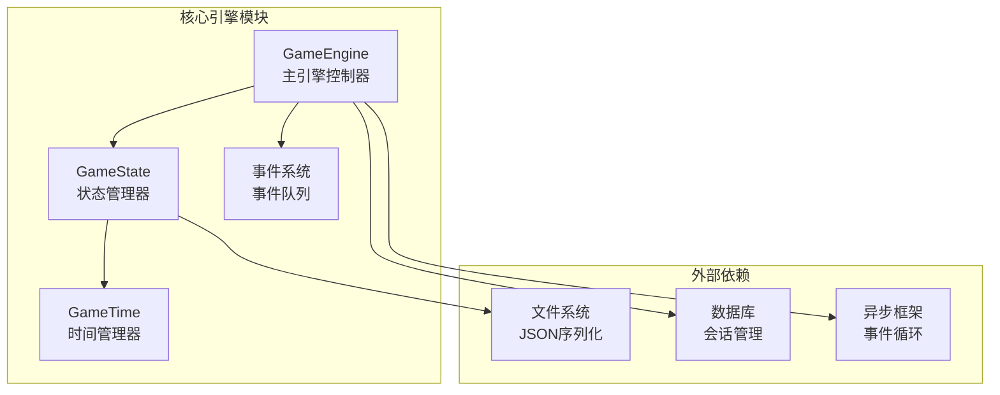
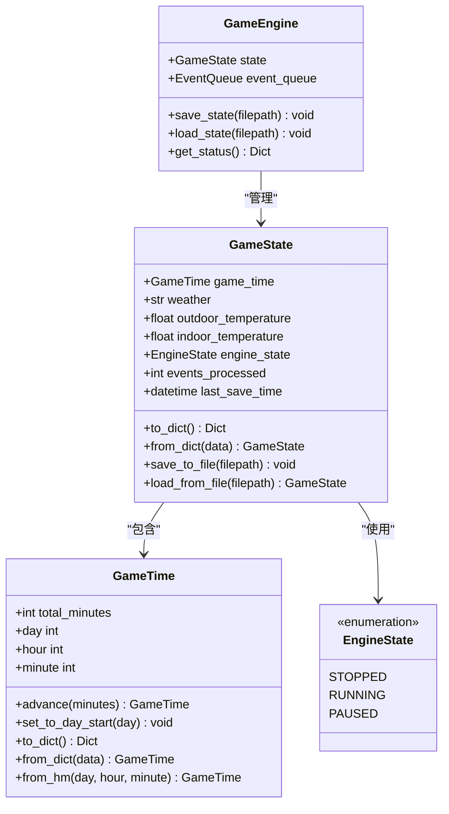
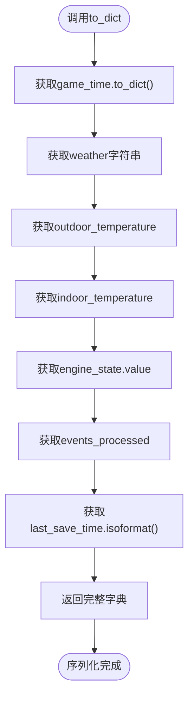
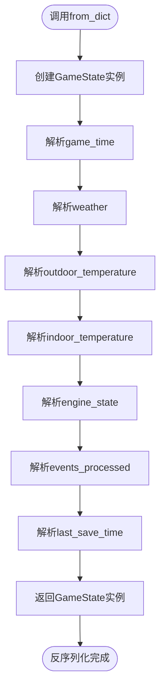
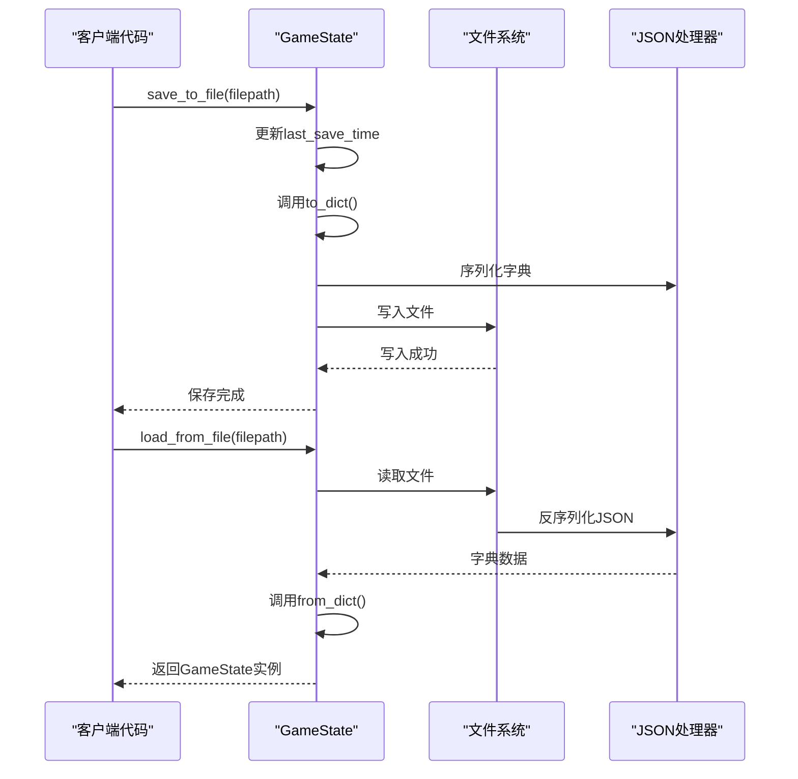
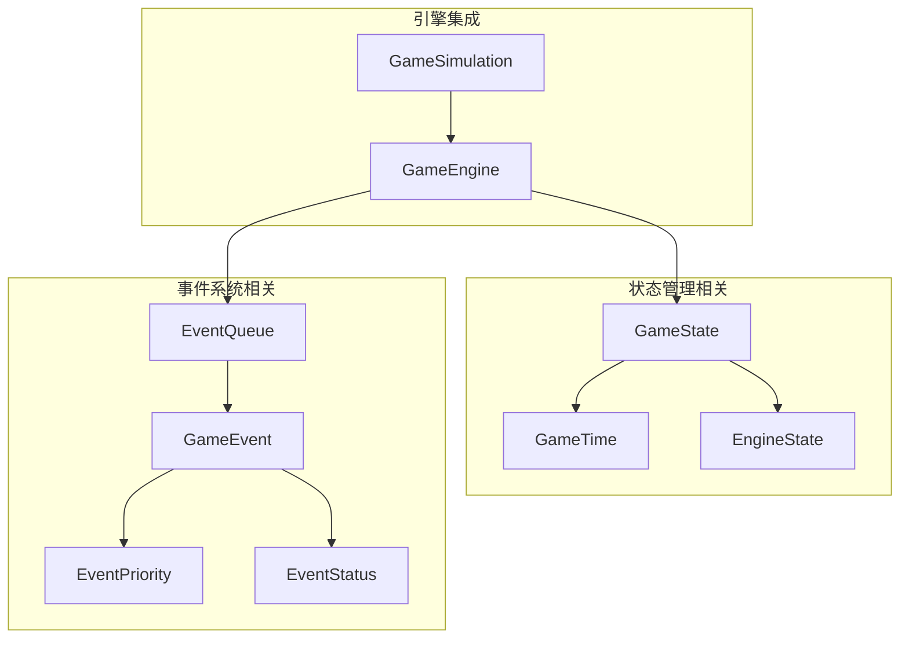

# GameState状态管理

<cite>
**本文档引用的文件**
- [engine.py](file://core_engine/engine.py)
- [simulation.py](file://core_engine/simulation.py)
- [events.py](file://core_engine/event_system/events.py)
- [event_queue.py](file://core_engine/event_system/event_queue.py)
- [run_simulation.py](file://run_simulation.py)
</cite>

## 目录
1. [简介](#简介)
2. [项目结构](#项目结构)
3. [核心组件](#核心组件)
4. [架构概览](#架构概览)
5. [详细组件分析](#详细组件分析)
6. [依赖关系分析](#依赖关系分析)
7. [性能考虑](#性能考虑)
8. [故障排除指南](#故障排除指南)
9. [结论](#结论)

## 简介

GameState状态管理系统是AI社区模拟引擎的核心组件，负责封装和管理游戏的完整状态信息。该系统提供了强大的序列化和反序列化机制，支持游戏状态的持久化存储和恢复，确保玩家可以在任何时刻保存和加载游戏进度。

系统采用现代Python设计模式，结合dataclasses、枚举类型和类型注解，实现了类型安全的状态管理。GameState类不仅管理基本的游戏状态字段，还提供了完整的统计信息追踪功能，包括事件处理计数和最后保存时间记录。

## 项目结构

AI社区项目采用模块化的架构设计，GameState状态管理系统位于核心引擎模块中，与事件系统、环境系统和角色系统紧密集成。

**图表来源**
- [engine.py](file://core_engine/engine.py#L167-L429)
- [engine.py](file://core_engine/engine.py#L112-L165)

**章节来源**
- [engine.py](file://core_engine/engine.py#L1-L429)
- [simulation.py](file://core_engine/simulation.py#L1-L529)

## 核心组件

GameState状态管理系统包含以下核心组件：

### GameState类
GameState是状态管理的核心类，使用Python的dataclass装饰器实现，提供了完整的状态封装功能。

### GameTime类
GameTime类专门负责游戏时间的管理，提供时间推进、格式化和转换功能。

### EngineState枚举
EngineState枚举定义了引擎的三种状态：停止、运行和暂停。

### 序列化接口
系统提供了完整的序列化和反序列化接口，支持JSON格式的数据持久化。

**章节来源**
- [engine.py](file://core_engine/engine.py#L112-L165)
- [engine.py](file://core_engine/engine.py#L26-L110)

## 架构概览

GameState状态管理系统采用了分层架构设计，确保了良好的模块分离和职责划分。

**图表来源**
- [engine.py](file://core_engine/engine.py#L112-L165)
- [engine.py](file://core_engine/engine.py#L26-L110)
- [engine.py](file://core_engine/engine.py#L167-L429)

## 详细组件分析

### GameState类设计架构

GameState类采用了现代Python设计模式，通过dataclass装饰器实现了自动生成的特殊方法，包括构造函数、比较方法和repr方法。

#### 状态字段设计

| 字段名称 | 类型 | 默认值 | 描述 |
|---------|------|--------|------|
| game_time | GameTime | 实例 | 游戏当前时间状态 |
| weather | str | "sunny" | 当前天气状况 |
| outdoor_temperature | float | 25.0 | 户外温度（摄氏度） |
| indoor_temperature | float | 22.0 | 室内温度（摄氏度） |
| engine_state | EngineState | EngineState.STOPPED | 引擎运行状态 |

#### 统计信息字段

| 字段名称 | 类型 | 默认值 | 描述 |
|---------|------|--------|------|
| events_processed | int | 0 | 已处理事件总数 |
| last_save_time | Optional[datetime] | None | 最后一次保存时间 |

**章节来源**
- [engine.py](file://core_engine/engine.py#L112-L128)

### 序列化和反序列化机制

GameState系统提供了完整的序列化和反序列化机制，确保状态数据的持久化和恢复。

#### to_dict序列化方法

to_dict方法将GameState对象转换为字典格式，便于JSON序列化：

**图表来源**
- [engine.py](file://core_engine/engine.py#L129-L138)

#### from_dict反序列化方法

from_dict方法从字典数据重建GameState对象：

**图表来源**
- [engine.py](file://core_engine/engine.py#L140-L151)

#### 文件操作方法

save_to_file和load_from_file方法提供了完整的文件持久化功能：

**图表来源**
- [engine.py](file://core_engine/engine.py#L153-L164)

**章节来源**
- [engine.py](file://core_engine/engine.py#L129-L164)

### 状态一致性保证

GameState系统通过多种机制确保状态的一致性：

#### 类型安全
所有字段都具有明确的类型注解，编译器和IDE可以提供更好的类型检查和智能提示。

#### 默认值管理
关键字段设置了合理的默认值，确保即使部分数据缺失也能正常恢复。

#### 枚举约束
EngineState使用Python枚举确保只有预定义的状态值才能被赋值。

#### 数据验证
from_dict方法对缺失的数据提供默认值，避免了KeyError异常。

**章节来源**
- [engine.py](file://core_engine/engine.py#L112-L151)

### 性能特性分析

GameState系统的性能特点：

#### 序列化性能
- to_dict方法使用简单的字典映射，时间复杂度为O(n)，其中n为状态字段数量
- JSON序列化使用标准库，性能稳定可靠

#### 内存效率
- dataclass自动生成的构造函数和方法避免了额外的内存开销
- 字段访问使用属性访问，无需额外的getter/setter方法

#### I/O优化
- 文件操作使用UTF-8编码，支持国际化字符
- JSON输出格式化为人类可读的缩进格式

**章节来源**
- [engine.py](file://core_engine/engine.py#L129-L164)

## 依赖关系分析

GameState状态管理系统与项目其他组件存在密切的依赖关系：

**图表来源**
- [engine.py](file://core_engine/engine.py#L112-L429)
- [events.py](file://core_engine/event_system/events.py#L55-L200)
- [event_queue.py](file://core_engine/event_system/event_queue.py#L29-L200)

**章节来源**
- [engine.py](file://core_engine/engine.py#L1-L429)
- [events.py](file://core_engine/event_system/events.py#L1-L356)
- [event_queue.py](file://core_engine/event_system/event_queue.py#L1-L244)

## 性能考虑

### 序列化性能优化

1. **增量更新策略**
   - 可以考虑实现增量序列化，只保存发生变化的状态字段
   - 对于大型游戏状态，这可以显著减少I/O操作

2. **缓存机制**
   - 在频繁保存的场景下，可以实现内存缓存避免重复序列化
   - 使用脏位标记机制跟踪状态变化

3. **异步I/O**
   - 可以考虑使用异步文件操作避免阻塞主线程
   - 对于大量数据，异步I/O可以提高整体性能

### 内存使用优化

1. **对象池模式**
   - 对于频繁创建和销毁的状态对象，可以考虑使用对象池
   - 减少垃圾回收压力，提高性能稳定性

2. **延迟加载**
   - 对于大型数据结构，可以实现延迟加载机制
   - 只在需要时才加载完整的状态数据

### 错误处理优化

1. **渐进式恢复**
   - 实现更健壮的反序列化错误处理
   - 对于损坏的数据，尝试部分恢复而不是完全失败

2. **版本兼容性**
   - 添加版本字段支持向后兼容
   - 自动迁移旧格式的数据到新格式

## 故障排除指南

### 常见问题及解决方案

#### 序列化错误
**问题描述**: JSON序列化过程中出现TypeError
**解决方案**: 
- 确保所有状态字段都是JSON可序列化的类型
- 检查自定义对象是否实现了to_dict方法

#### 反序列化失败
**问题描述**: 从文件加载状态时抛出异常
**解决方案**:
- 验证文件格式是否正确
- 检查必需字段是否存在
- 确认数据类型匹配

#### 数据完整性问题
**问题描述**: 加载的状态数据不完整
**解决方案**:
- 检查save_to_file方法是否正确执行
- 验证文件写入是否成功完成
- 确认没有并发访问导致的数据竞争

#### 性能问题
**问题描述**: 大型状态对象序列化耗时过长
**解决方案**:
- 考虑实现增量保存机制
- 优化状态数据结构，移除不必要的字段
- 使用更高效的序列化库如pickle或msgpack

**章节来源**
- [engine.py](file://core_engine/engine.py#L153-L164)
- [engine.py](file://core_engine/engine.py#L395-L412)

## 结论

GameState状态管理系统是一个设计精良、功能完整的状态管理解决方案。它通过清晰的架构设计、完善的序列化机制和健壮的错误处理，为AI社区模拟引擎提供了可靠的状态持久化能力。

系统的主要优势包括：

1. **类型安全**: 使用dataclass和类型注解确保编译时类型检查
2. **易于扩展**: 清晰的接口设计支持未来功能扩展
3. **性能稳定**: 基于标准库的实现确保了稳定的性能表现
4. **错误处理**: 完善的异常处理机制提高了系统的可靠性

对于未来的改进方向，建议考虑实现增量序列化、异步I/O操作和版本兼容性支持，以进一步提升系统的性能和用户体验。