# GameTime时间管理

<cite>
**本文档引用的文件**
- [engine.py](file://core_engine/engine.py)
- [README.md](file://README.md)
- [run_simulation.py](file://run_simulation.py)
</cite>

## 目录
1. [简介](#简介)
2. [项目结构](#项目结构)
3. [核心组件](#核心组件)
4. [架构概览](#架构概览)
5. [详细组件分析](#详细组件分析)
6. [依赖关系分析](#依赖关系分析)
7. [性能考虑](#性能考虑)
8. [故障排除指南](#故障排除指南)
9. [结论](#结论)

## 简介

GameTime是AI社区模拟系统中的核心时间管理系统，采用以分钟为最小单位的时间表示方法，实现了完整的事件驱动时间模型。该系统支持精确的时间计算、时段判断、格式化输出等功能，为整个AI社区的拟真模拟提供了可靠的时间基础。

在AI社区项目中，GameTime作为游戏引擎的核心组件，负责：
- 以分钟为单位的精确时间表示
- 天数、小时、分钟的智能提取
- 时间推进和调度功能
- 时间格式化和序列化
- 时段判断和昼夜周期管理

## 项目结构

AI社区项目采用模块化的架构设计，GameTime位于核心引擎模块中：

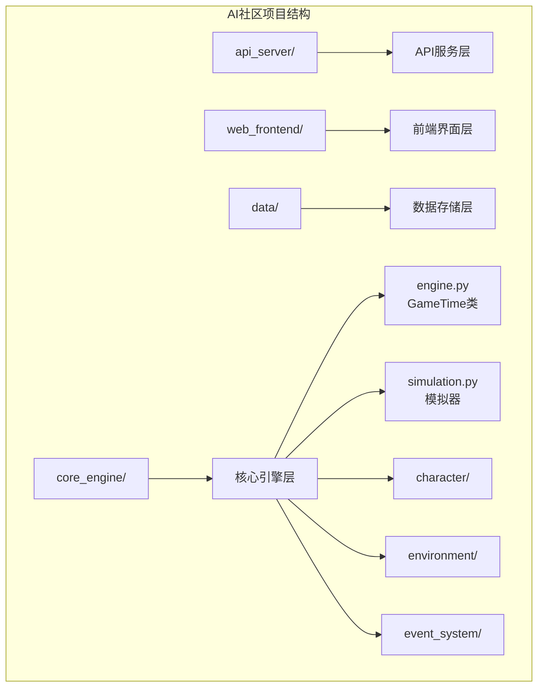

**图表来源**
- [README.md](file://README.md#L1-L35)

**章节来源**
- [README.md](file://README.md#L1-L35)

## 核心组件

GameTime类是整个时间管理系统的核心，采用了数据类装饰器和属性装饰器的设计模式：

### 主要特性

1. **分钟制时间表示**：以总分钟数存储时间，提供最高精度的时间计算
2. **智能属性提取**：通过属性装饰器自动计算天数、小时、分钟
3. **时段判断功能**：支持morning、noon、afternoon、evening、night时段判断
4. **格式化支持**：提供字符串格式化和字典序列化功能
5. **事件驱动集成**：与游戏引擎的事件调度系统无缝集成

### 设计优势

- **内存效率**：仅存储总分钟数，避免重复计算
- **计算效率**：使用整数运算，避免浮点数精度问题
- **易用性**：提供直观的属性接口和方法
- **可扩展性**：支持多种时间格式化和序列化方式

**章节来源**
- [engine.py](file://core_engine/engine.py#L26-L110)

## 架构概览

GameTime在整个AI社区系统中的位置和作用：

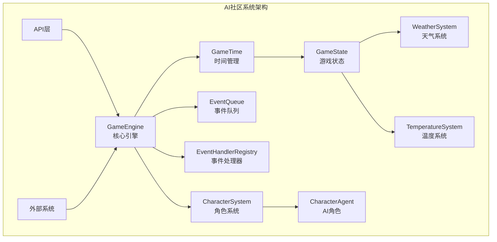

**图表来源**
- [engine.py](file://core_engine/engine.py#L167-L429)

### 时间流控制

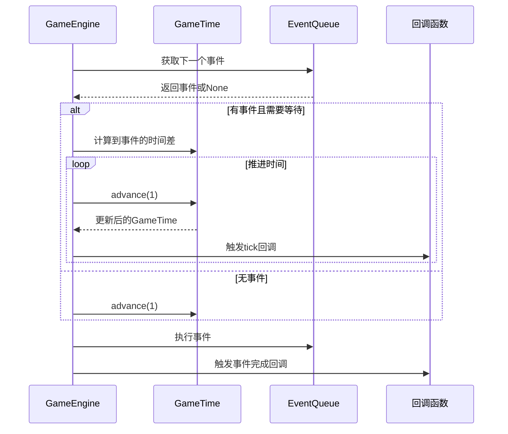

**图表来源**
- [engine.py](file://core_engine/engine.py#L288-L341)

**章节来源**
- [engine.py](file://core_engine/engine.py#L167-L429)

## 详细组件分析

### GameTime类设计

GameTime类采用了现代Python的数据类设计，结合属性装饰器实现智能的时间计算：

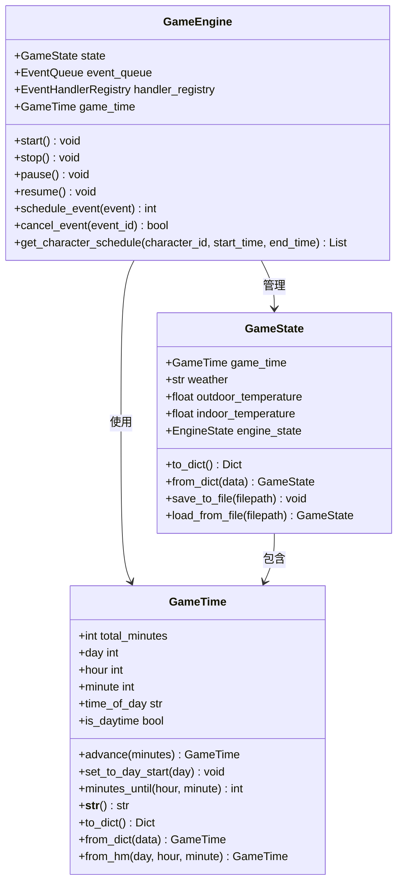

**图表来源**
- [engine.py](file://core_engine/engine.py#L26-L110)
- [engine.py](file://core_engine/engine.py#L112-L164)
- [engine.py](file://core_engine/engine.py#L167-L429)

### 时间表示方法

GameTime采用"总分钟数"的单一数值表示法，这是其设计的核心理念：

#### 天数计算逻辑
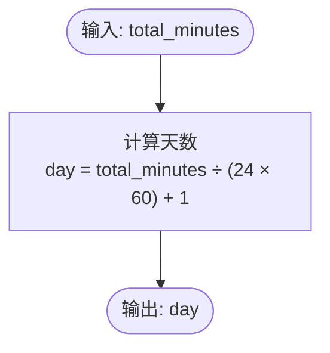

**图表来源**
- [engine.py](file://core_engine/engine.py#L35-L38)

#### 小时和分钟提取
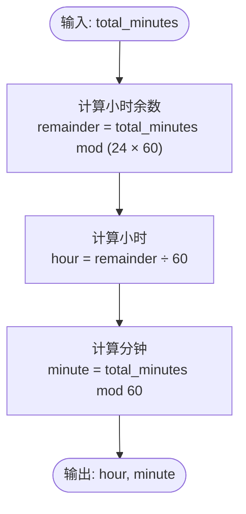

**图表来源**
- [engine.py](file://core_engine/engine.py#L40-L48)

### 时间操作方法

#### advance推进时间方法
advance方法是最常用的时间操作，支持正负值推进：

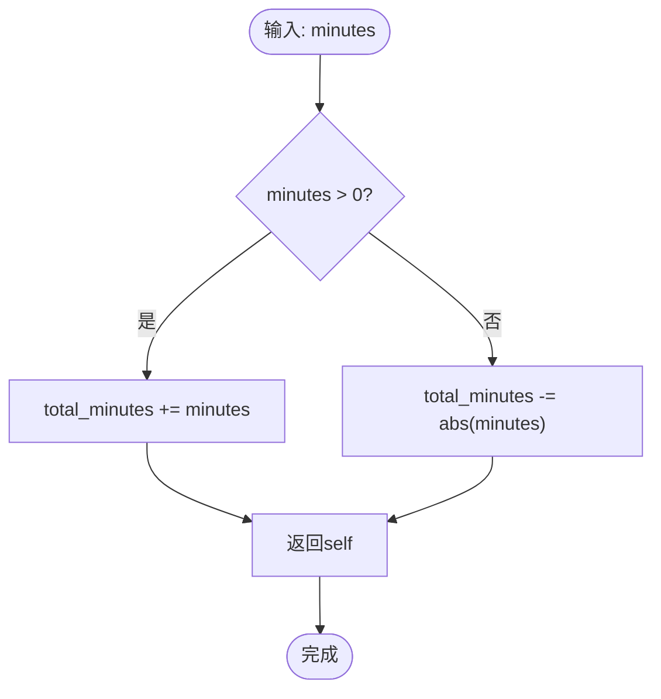

**图表来源**
- [engine.py](file://core_engine/engine.py#L70-L73)

#### set_to_day_start设置到某天开始
该方法将时间精确设置到指定天的0:00：

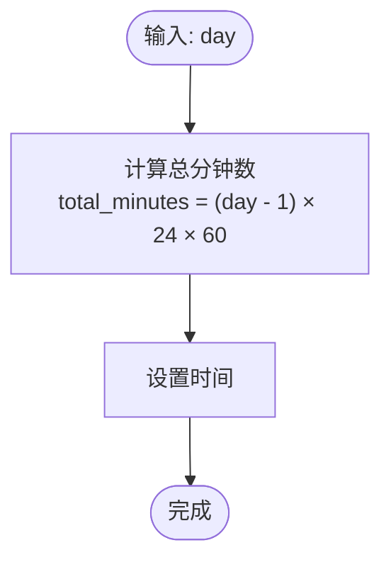

**图表来源**
- [engine.py](file://core_engine/engine.py#L75-L77)

#### minutes_until计算到指定时间的分钟数
这是GameTime的核心调度方法，支持跨天计算：

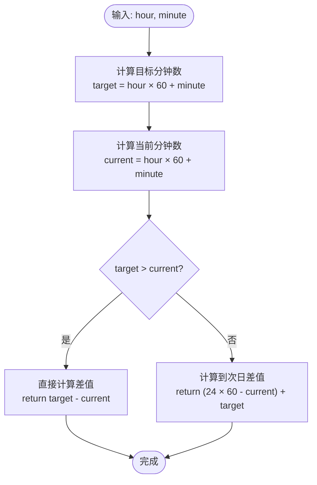

**图表来源**
- [engine.py](file://core_engine/engine.py#L79-L88)

### 时间分类功能

#### time_of_day时段判断
GameTime实现了详细的时段分类系统：

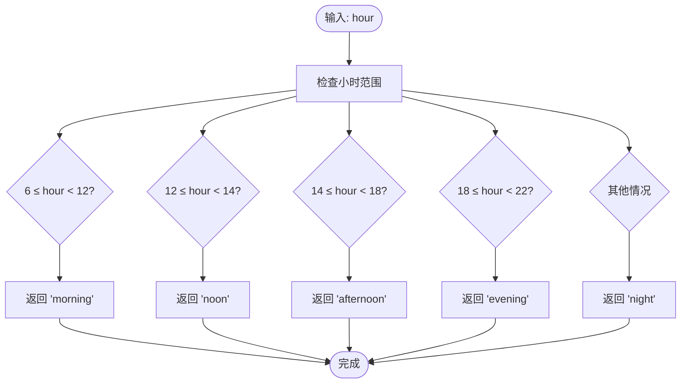

**图表来源**
- [engine.py](file://core_engine/engine.py#L50-L63)

#### is_daytime白天判断
is_daytime属性提供了简化的昼夜判断：

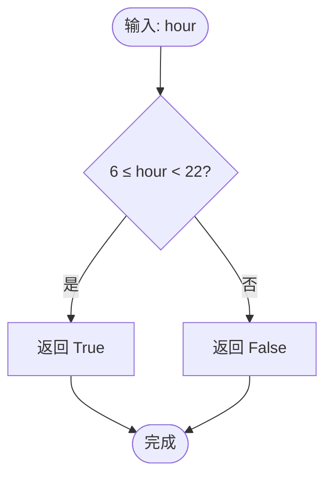

**图表来源**
- [engine.py](file://core_engine/engine.py#L65-L68)

### 时间格式化方法

#### __str__字符串格式化
提供人类可读的时间格式：

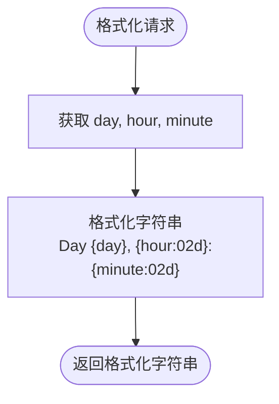

**图表来源**
- [engine.py](file://core_engine/engine.py#L90-L91)

#### to_dict和from_dict序列化
支持JSON序列化和反序列化：

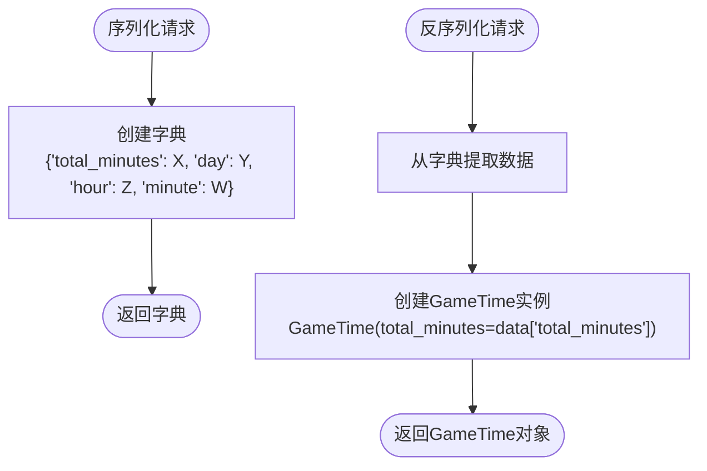

**图表来源**
- [engine.py](file://core_engine/engine.py#L93-L103)

### 实际应用场景

#### 在模拟器中的使用
在AI社区模拟器中，GameTime被广泛应用于各种场景：

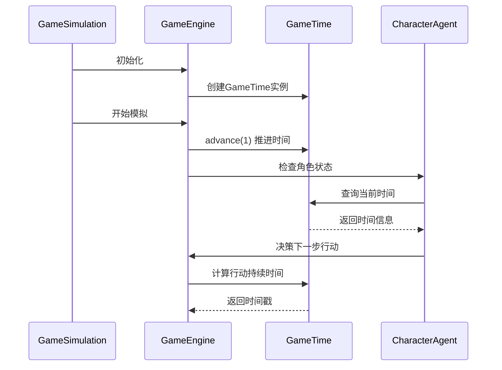

**图表来源**
- [run_simulation.py](file://run_simulation.py#L54-L182)

**章节来源**
- [engine.py](file://core_engine/engine.py#L26-L110)
- [run_simulation.py](file://run_simulation.py#L54-L182)

## 依赖关系分析

### 内部依赖关系

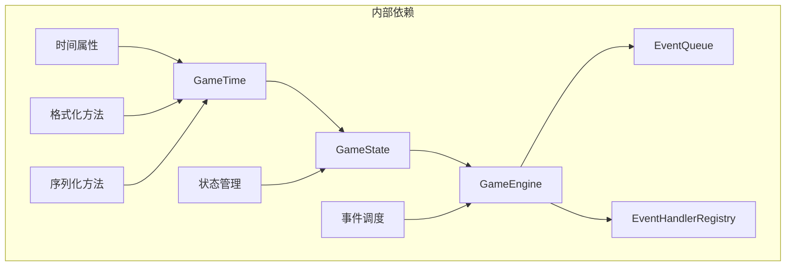

**图表来源**
- [engine.py](file://core_engine/engine.py#L112-L164)
- [engine.py](file://core_engine/engine.py#L167-L429)

### 外部依赖

GameTime类的外部依赖相对简单，主要依赖Python标准库：

- **typing**: 类型注解支持
- **dataclasses**: 数据类装饰器
- **datetime**: 时间戳处理
- **json**: JSON序列化

这些依赖为GameTime提供了必要的功能支持，同时保持了代码的简洁性和可移植性。

**章节来源**
- [engine.py](file://core_engine/engine.py#L7-L16)

## 性能考虑

### 时间复杂度分析

所有GameTime方法都具有O(1)的时间复杂度，因为它们都是基于简单的数学运算：

- **属性访问**: O(1) - 直接计算
- **advance方法**: O(1) - 单次加法运算
- **set_to_day_start**: O(1) - 单次乘法运算
- **minutes_until**: O(1) - 最多两次减法和一次加法
- **格式化方法**: O(1) - 字符串格式化

### 内存使用优化

GameTime采用了内存友好的设计：

- **单一数值存储**: 只存储total_minutes，避免重复计算
- **惰性计算**: 属性在访问时才计算，节省CPU资源
- **不可变性**: 通过数据类装饰器确保对象状态的一致性

### 边界情况处理

GameTime正确处理了各种边界情况：

- **负数时间**: advance方法支持负值，允许回退时间
- **跨天计算**: minutes_until方法正确处理跨天情况
- **零时间**: 正确处理初始状态（第1天0:00）
- **大数值**: 支持长时间跨度的计算

## 故障排除指南

### 常见问题和解决方案

#### 时间显示异常
**问题**: 时间显示格式不正确
**解决方案**: 检查__str__方法的格式化参数，确保使用正确的宽度和填充

#### 时段判断错误
**问题**: time_of_day返回意外的时段
**解决方案**: 验证hour属性的计算逻辑，检查边界条件（6:00、12:00、14:00、18:00）

#### 跨天计算错误
**问题**: minutes_until在跨天时返回错误值
**解决方案**: 确认比较逻辑，确保在target <= current时正确计算到次日的差值

#### 序列化问题
**问题**: to_dict/from_dict导致数据丢失
**解决方案**: 检查字典键名的一致性，确保所有必要字段都被序列化

### 调试技巧

1. **单元测试**: 为每个方法编写边界测试用例
2. **日志记录**: 在关键计算点添加调试输出
3. **状态检查**: 定期验证时间属性之间的逻辑关系
4. **性能监控**: 监控时间推进的性能影响

**章节来源**
- [engine.py](file://core_engine/engine.py#L70-L109)

## 结论

GameTime时间管理系统展现了优秀的软件工程实践，通过简洁而强大的设计实现了复杂的时间管理功能。其核心优势包括：

1. **设计理念清晰**: 以分钟为最小单位的统一时间表示法
2. **实现简洁高效**: 基于属性装饰器的智能计算
3. **功能完整丰富**: 支持时间推进、格式化、序列化等多种操作
4. **集成良好**: 与整个AI社区系统的无缝集成

该系统为AI社区的拟真模拟提供了坚实的基础，支持复杂的事件驱动时间模型，使得AI角色能够在逼真的时间环境中进行自主决策和行为表现。通过合理的设计和实现，GameTime不仅满足了当前的需求，也为未来的功能扩展奠定了良好的基础。