# 事件调度系统

<cite>
**本文档引用的文件**
- [core_engine/event_system/__init__.py](file://core_engine/event_system/__init__.py)
- [core_engine/event_system/event_queue.py](file://core_engine/event_system/event_queue.py)
- [core_engine/event_system/events.py](file://core_engine/event_system/events.py)
- [core_engine/event_system/handlers.py](file://core_engine/event_system/handlers.py)
- [core_engine/engine.py](file://core_engine/engine.py)
- [core_engine/social/social_scheduler.py](file://core_engine/social/social_scheduler.py)
- [core_engine/social/social_handlers.py](file://core_engine/social/social_handlers.py)
</cite>

## 目录
1. [简介](#简介)
2. [项目结构](#项目结构)
3. [核心组件](#核心组件)
4. [架构概览](#架构概览)
5. [详细组件分析](#详细组件分析)
6. [依赖关系分析](#依赖关系分析)
7. [性能考虑](#性能考虑)
8. [故障排除指南](#故障排除指南)
9. [结论](#结论)
10. [附录](#附录)

## 简介

事件调度系统是AI社区项目的核心基础设施，负责管理游戏中的各种事件调度、执行和生命周期管理。该系统采用异步事件驱动架构，支持多种事件类型、优先级管理和冲突检测机制。

系统主要包含三个核心模块：
- **GameEngine**: 游戏引擎核心，负责时间推进和事件调度协调
- **EventQueue**: 事件优先队列，基于堆实现的高效事件调度
- **EventHandlerRegistry**: 事件处理器注册机制，支持事件类型到处理器的映射

## 项目结构

事件调度系统位于 `core_engine/event_system/` 目录下，采用模块化设计：

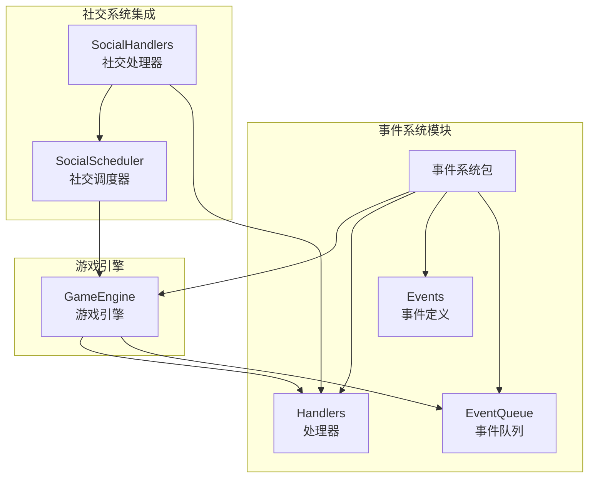

**图表来源**
- [core_engine/event_system/__init__.py](file://core_engine/event_system/__init__.py#L1-L22)
- [core_engine/engine.py](file://core_engine/engine.py#L167-L197)

**章节来源**
- [core_engine/event_system/__init__.py](file://core_engine/event_system/__init__.py#L1-L22)
- [core_engine/engine.py](file://core_engine/engine.py#L1-L50)

## 核心组件

### 事件类型体系

系统定义了完整的事件类型层次结构：

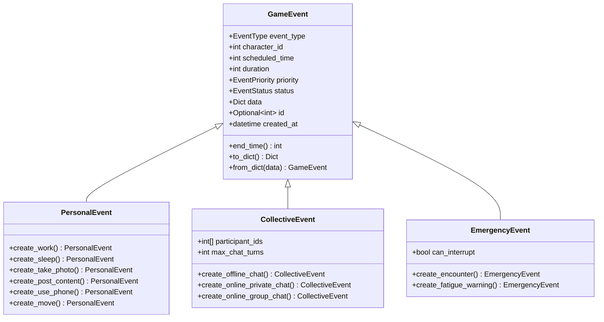

**图表来源**
- [core_engine/event_system/events.py](file://core_engine/event_system/events.py#L55-L356)

### 事件优先级系统

事件优先级采用数值越小优先级越高的设计：

| 优先级 | 数值 | 描述 | 示例 |
|--------|------|------|------|
| CRITICAL | 0 | 系统事件最高优先级 | 系统维护事件 |
| EMERGENCY | 10 | 紧急事件 | 疲劳警告、突发相遇 |
| HIGH | 20 | 高优先级 | 睡眠、重要对话 |
| NORMAL | 50 | 普通优先级 | 工作、发帖 |
| LOW | 80 | 低优先级 | 看手机、浏览 |
| BACKGROUND | 100 | 后台任务 | 系统统计 |

**章节来源**
- [core_engine/event_system/events.py](file://core_engine/event_system/events.py#L36-L44)

## 架构概览

事件调度系统采用分层架构设计，各组件职责明确：

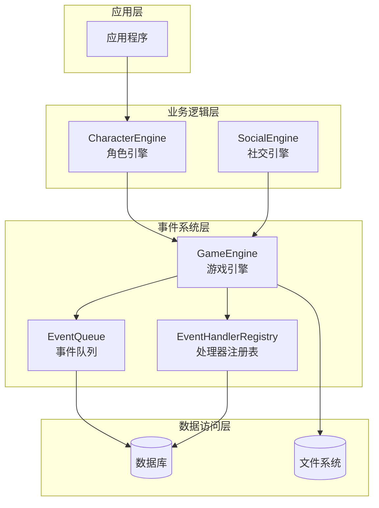

**图表来源**
- [core_engine/engine.py](file://core_engine/engine.py#L167-L197)
- [core_engine/event_system/event_queue.py](file://core_engine/event_system/event_queue.py#L29-L45)

## 详细组件分析

### GameEngine - 游戏引擎核心

GameEngine是事件调度系统的核心协调器，负责时间推进和事件执行：

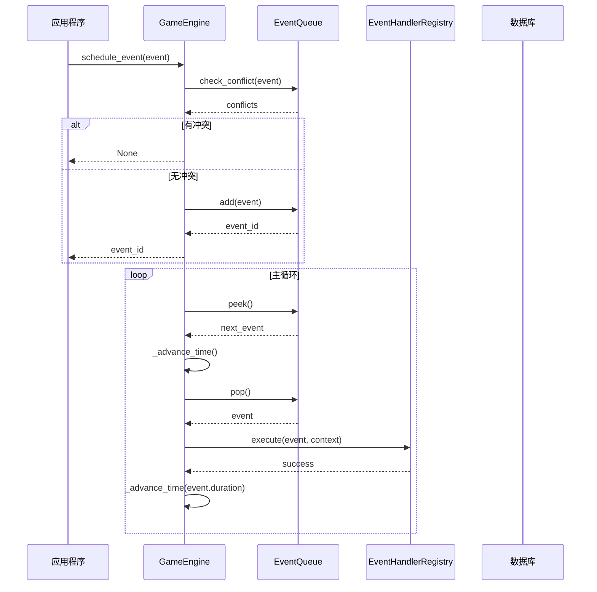

**图表来源**
- [core_engine/engine.py](file://core_engine/engine.py#L211-L382)

#### 关键功能特性

1. **异步主循环**: 基于asyncio的事件驱动架构
2. **时间推进**: 支持按分钟推进游戏时间
3. **状态管理**: 完整的引擎状态跟踪
4. **回调机制**: 支持tick、日变更、事件完成回调

**章节来源**
- [core_engine/engine.py](file://core_engine/engine.py#L167-L429)

### EventQueue - 事件优先队列

EventQueue基于二叉堆实现高效的事件调度：

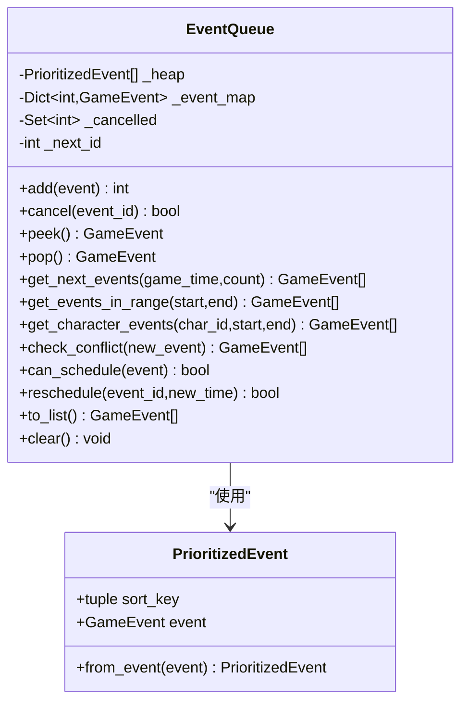

**图表来源**
- [core_engine/event_system/event_queue.py](file://core_engine/event_system/event_queue.py#L29-L244)

#### 数据结构设计

1. **堆存储**: `_heap` 使用二叉堆保持事件按时间优先级排序
2. **映射索引**: `_event_map` 提供O(1)的事件查找
3. **懒删除**: `_cancelled` 集合实现延迟删除机制
4. **ID生成**: `_next_id` 自动分配唯一事件ID

#### 冲突检测算法

冲突检测采用时间重叠判断：

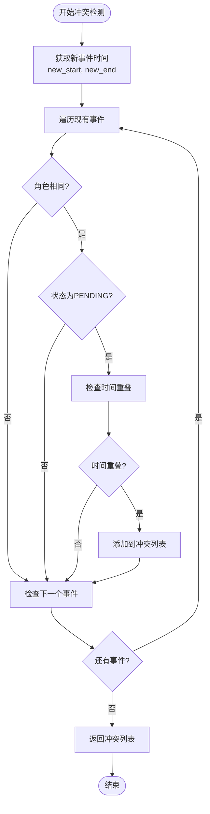

**图表来源**
- [core_engine/event_system/event_queue.py](file://core_engine/event_system/event_queue.py#L154-L178)

**章节来源**
- [core_engine/event_system/event_queue.py](file://core_engine/event_system/event_queue.py#L1-L244)

### EventHandlerRegistry - 事件处理器注册机制

处理器注册机制采用单例模式和装饰器设计：

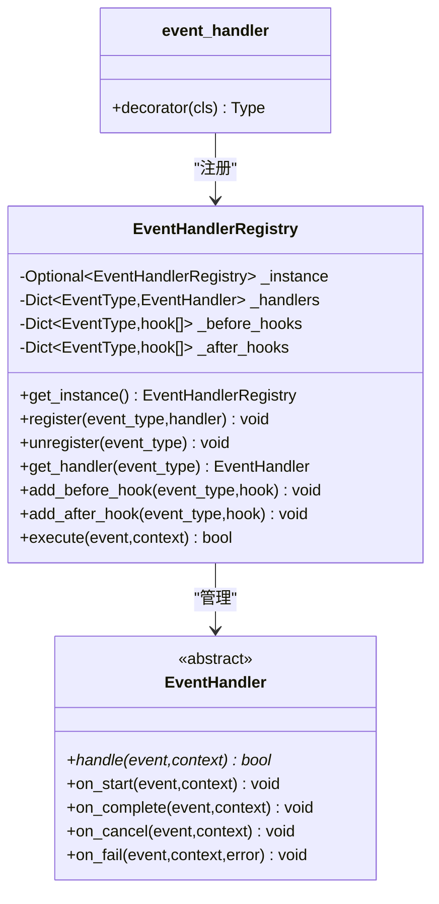

**图表来源**
- [core_engine/event_system/handlers.py](file://core_engine/event_system/handlers.py#L12-L156)

#### 处理器执行流程

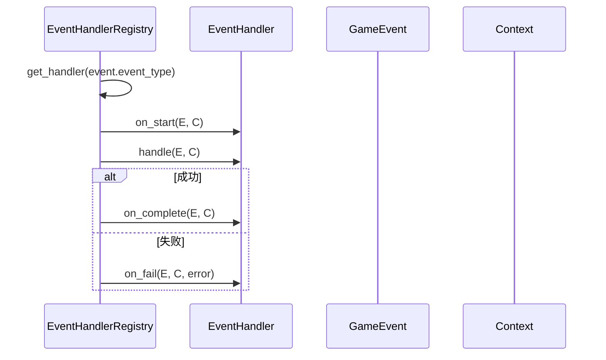

**图表来源**
- [core_engine/event_system/handlers.py](file://core_engine/event_system/handlers.py#L99-L137)

**章节来源**
- [core_engine/event_system/handlers.py](file://core_engine/event_system/handlers.py#L1-L156)

### 事件调度流程详解

#### schedule_event 调度流程

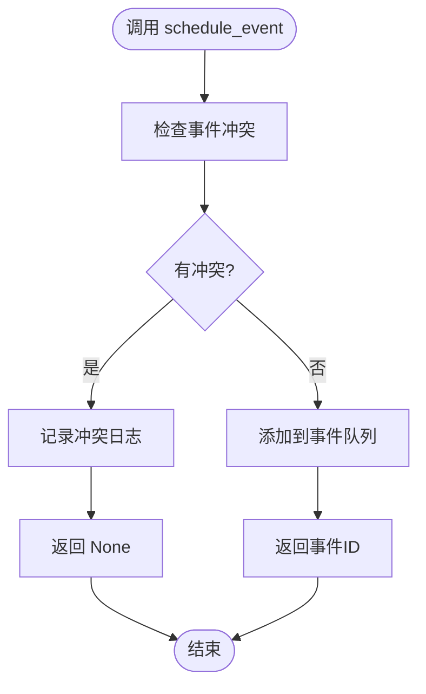

**图表来源**
- [core_engine/engine.py](file://core_engine/engine.py#L211-L226)

#### cancel_event 取消机制

取消机制采用懒删除策略：

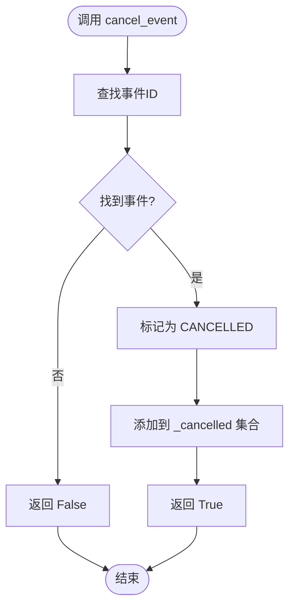

**图表来源**
- [core_engine/event_system/event_queue.py](file://core_engine/event_system/event_queue.py#L61-L71)

#### get_character_schedule 角色事件查询

角色事件查询支持时间范围过滤：

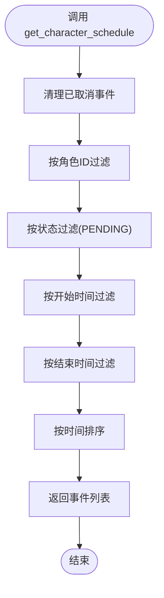

**图表来源**
- [core_engine/event_system/event_queue.py](file://core_engine/event_system/event_queue.py#L127-L152)

**章节来源**
- [core_engine/engine.py](file://core_engine/engine.py#L211-L238)
- [core_engine/event_system/event_queue.py](file://core_engine/event_system/event_queue.py#L61-L152)

## 依赖关系分析

事件调度系统的依赖关系清晰且模块化：

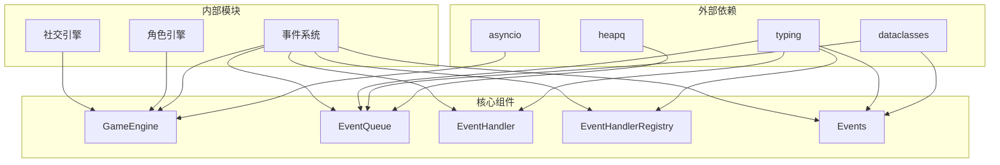

**图表来源**
- [core_engine/engine.py](file://core_engine/engine.py#L7-L16)
- [core_engine/event_system/event_queue.py](file://core_engine/event_system/event_queue.py#L7-L10)

### 组件耦合度分析

1. **低耦合设计**: 各组件通过接口交互，减少直接依赖
2. **单一职责**: 每个类都有明确的职责边界
3. **可扩展性**: 基于抽象类和接口的设计便于扩展

**章节来源**
- [core_engine/engine.py](file://core_engine/engine.py#L1-L50)
- [core_engine/event_system/__init__.py](file://core_engine/event_system/__init__.py#L1-L22)

## 性能考虑

### 时间复杂度分析

| 操作 | 事件数量 n | 时间复杂度 | 空间复杂度 |
|------|------------|------------|------------|
| 添加事件 | n | O(log n) | O(n) |
| 取出事件 | n | O(log n) | O(n) |
| 冲突检测 | n | O(n) | O(1) |
| 角色查询 | n | O(n log n) | O(k) |
| 取消事件 | n | O(1) | O(1) |

### 内存优化策略

1. **懒删除机制**: 避免频繁的堆重排操作
2. **事件池复用**: 复用事件对象减少GC压力
3. **增量清理**: 定期清理已取消事件

### 异步优化

1. **非阻塞I/O**: 所有数据库操作都是异步的
2. **并发处理**: 支持多个事件处理器并行执行
3. **资源管理**: 自动管理数据库连接和资源释放

## 故障排除指南

### 常见问题及解决方案

#### 事件冲突问题

**症状**: `schedule_event` 返回 `None`
**原因**: 新事件与现有事件存在时间冲突
**解决**: 使用 `check_conflict` 方法预检，或调整事件时间

#### 处理器未注册

**症状**: 事件执行时输出警告信息
**原因**: 对应事件类型的处理器未注册
**解决**: 使用 `@event_handler` 装饰器注册处理器

#### 内存泄漏

**症状**: 随着时间推移内存使用持续增长
**原因**: 未及时清理已取消的事件
**解决**: 确保定期调用 `EventQueue._cleanup()` 或依赖自动清理

**章节来源**
- [core_engine/engine.py](file://core_engine/engine.py#L221-L224)
- [core_engine/event_system/handlers.py](file://core_engine/event_system/handlers.py#L110-L113)

## 结论

事件调度系统采用了成熟的设计模式和最佳实践，具有以下优势：

1. **架构清晰**: 分层设计使得系统易于理解和维护
2. **性能优异**: 基于堆的事件队列提供了高效的调度性能
3. **扩展性强**: 基于接口和装饰器的设计便于功能扩展
4. **可靠性高**: 完善的状态管理和错误处理机制

系统在AI社区项目中发挥着关键作用，为复杂的社交互动和角色行为提供了可靠的时间管理和事件驱动框架。

## 附录

### 事件调度最佳实践

#### 事件冲突避免策略

1. **预检机制**: 在调度前使用 `check_conflict` 检测潜在冲突
2. **时间预留**: 为不同类型事件预留缓冲时间
3. **优先级管理**: 合理设置事件优先级避免低优先级事件阻塞

#### 性能优化技巧

1. **批量处理**: 将相似事件合并处理
2. **缓存策略**: 缓存常用查询结果
3. **异步I/O**: 充分利用异步特性提高吞吐量

#### 内存管理

1. **及时清理**: 定期清理已完成和取消的事件
2. **对象复用**: 复用事件对象减少内存分配
3. **监控告警**: 设置内存使用监控和告警机制

### 扩展性设计指南

#### 自定义事件类型实现

1. **继承基础类**: 继承 `GameEvent` 或其子类
2. **定义数据结构**: 使用 `dataclasses` 定义事件特定数据
3. **实现处理器**: 创建对应的 `EventHandler` 实现
4. **注册处理器**: 使用 `@event_handler` 装饰器注册

#### 自定义事件处理器

```python
@event_handler(CustomEventType.CUSTOM_ACTION)
class CustomEventHandler(EventHandler):
    async def handle(self, event: GameEvent, context: Dict[str, Any]) -> bool:
        # 实现自定义处理逻辑
        return True
```

#### 事件钩子机制

系统支持事件前处理和后处理钩子：

```python
registry = EventHandlerRegistry.get_instance()
registry.add_before_hook(EventType.WORK, before_hook)
registry.add_after_hook(EventType.WORK, after_hook)
```

**章节来源**
- [core_engine/event_system/handlers.py](file://core_engine/event_system/handlers.py#L140-L156)
- [core_engine/social/social_handlers.py](file://core_engine/social/social_handlers.py#L18-L206)