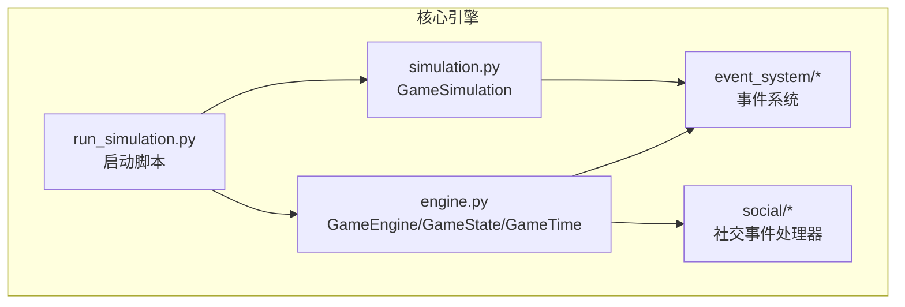
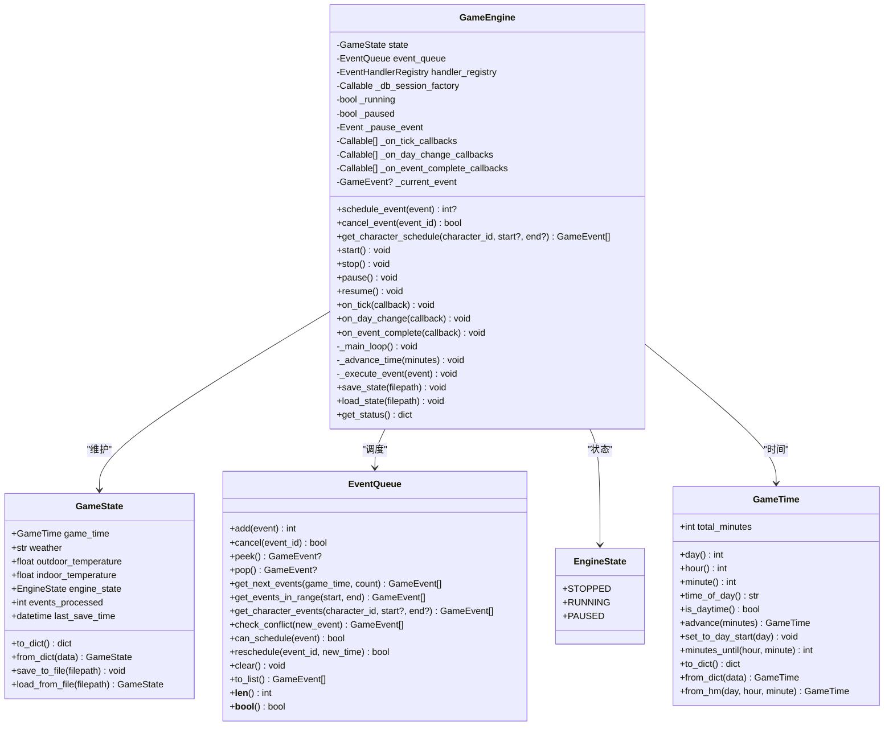
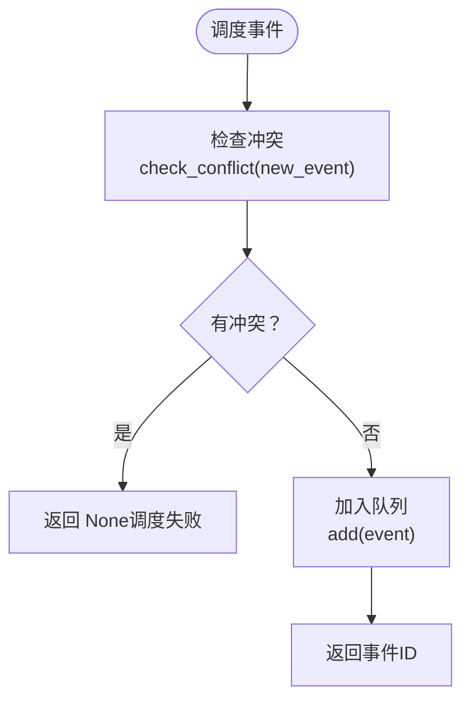
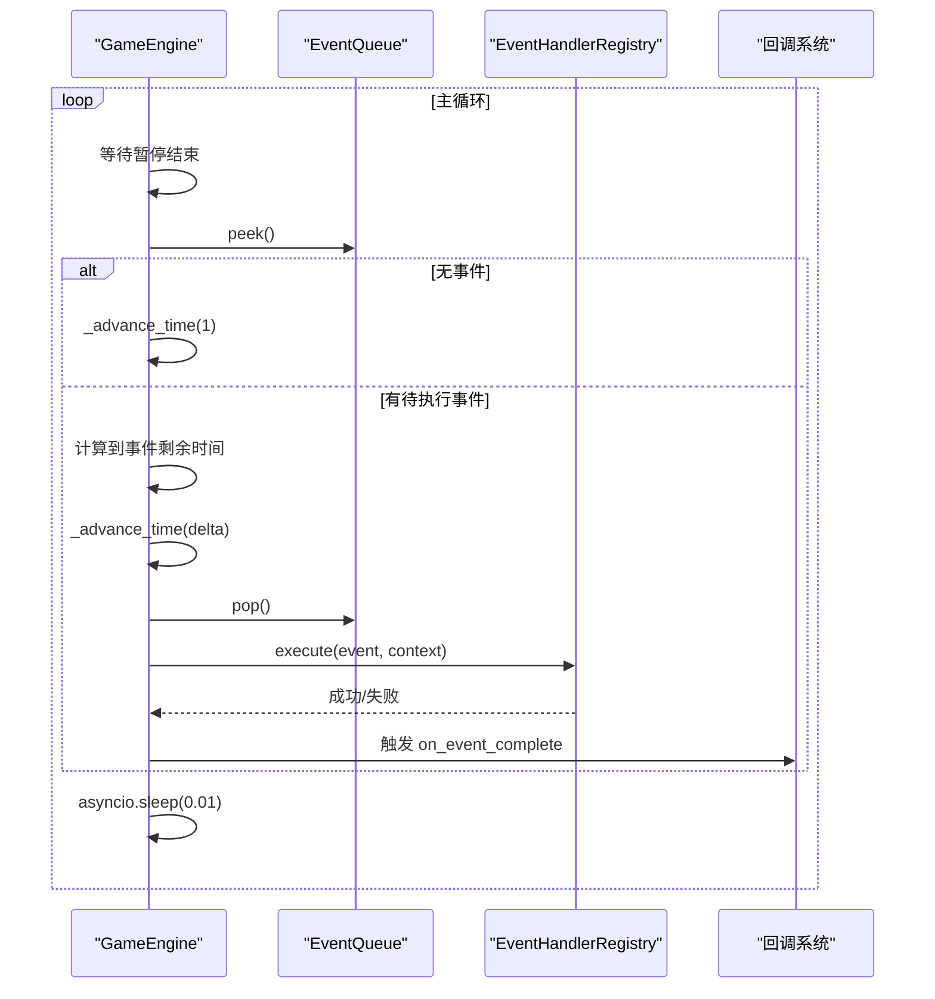
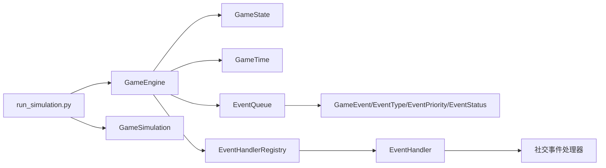

# 核心引擎

<cite>
**本文引用的文件**
- [engine.py](file://core_engine/engine.py)
- [simulation.py](file://core_engine/simulation.py)
- [events.py](file://core_engine/event_system/events.py)
- [event_queue.py](file://core_engine/event_system/event_queue.py)
- [handlers.py](file://core_engine/event_system/handlers.py)
- [social_handlers.py](file://core_engine/social/social_handlers.py)
- [run_simulation.py](file://run_simulation.py)
- [__init__.py](file://core_engine/__init__.py)
</cite>

## 目录
1. [简介](#简介)
2. [项目结构](#项目结构)
3. [核心组件](#核心组件)
4. [架构总览](#架构总览)
5. [详细组件分析](#详细组件分析)
6. [依赖关系分析](#依赖关系分析)
7. [性能考量](#性能考量)
8. [故障排查指南](#故障排查指南)
9. [结论](#结论)
10. [附录](#附录)

## 简介
本技术文档围绕游戏核心引擎进行深入解析，重点覆盖以下主题：
- GameEngine 类的设计架构与职责边界
- 引擎状态管理（EngineState 枚举）
- 时间管理系统（GameTime 类）
- 游戏状态管理（GameState 类）
- 事件调度机制（schedule_event 冲突检测、cancel_event 事件取消流程）
- 主循环算法（_main_loop）：事件队列处理、时间推进逻辑、暂停/恢复机制
- 回调系统：on_tick、on_day_change、on_event_complete 三类回调
- 引擎启动、停止、暂停的操作指南与最佳实践
- 状态保存与加载机制的实现细节
- 性能优化建议

## 项目结构
核心引擎位于 core_engine 目录，主要分为以下子模块：
- engine.py：GameEngine、GameState、GameTime 的实现
- event_system：事件系统（事件定义、事件队列、事件处理器）
- simulation.py：基于行动触发的模拟器（与 GameEngine 协同）
- social：社交事件处理器（对接事件系统）
- run_simulation.py：模拟器启动脚本与交互命令
- __init__.py：对外导出接口

图表来源
- [engine.py](file://core_engine/engine.py#L167-L429)
- [simulation.py](file://core_engine/simulation.py#L64-L529)
- [events.py](file://core_engine/event_system/events.py#L1-L356)
- [event_queue.py](file://core_engine/event_system/event_queue.py#L1-L244)
- [handlers.py](file://core_engine/event_system/handlers.py#L1-L156)
- [social_handlers.py](file://core_engine/social/social_handlers.py#L1-L253)
- [run_simulation.py](file://run_simulation.py#L1-L258)

章节来源
- [engine.py](file://core_engine/engine.py#L1-L429)
- [simulation.py](file://core_engine/simulation.py#L1-L529)
- [run_simulation.py](file://run_simulation.py#L1-L258)

## 核心组件
本节概述 GameEngine 的关键组成与职责：
- 引擎状态管理：EngineState（STOPPED/RUNNING/PAUSED）
- 时间管理：GameTime（以分钟为最小单位，提供 day/hour/minute/time_of_day/is_daytime）
- 游戏状态：GameState（包含 GameTime、天气、温度、引擎状态、统计信息）
- 事件系统：EventQueue（优先队列，支持冲突检测、取消、重新调度）
- 回调系统：on_tick、on_day_change、on_event_complete
- 数据持久化：GameState.save_to_file/load_from_file，以及事件队列的保存/加载

章节来源
- [engine.py](file://core_engine/engine.py#L19-L165)

## 架构总览
GameEngine 作为时间与事件的核心协调者，负责：
- 维护 GameState 与 GameTime
- 管理 EventQueue，并通过 EventHandlerRegistry 执行事件
- 提供启动/停止/暂停/恢复控制
- 通过回调系统向外部扩展功能
- 提供状态保存/加载能力

图表来源
- [engine.py](file://core_engine/engine.py#L19-L429)

## 详细组件分析

### GameEngine 设计与生命周期
- 状态字段：_running、_paused、_pause_event 控制运行与暂停；state.engine_state 同步状态
- 回调注册：on_tick/on_day_change/on_event_complete 将异步回调收集到列表中
- 事件执行：_execute_event 构造上下文（engine、game_time、state、db），委托 EventHandlerRegistry 执行
- 主循环：_main_loop 在暂停事件上等待，按需推进时间或执行事件，短时让出控制权

章节来源
- [engine.py](file://core_engine/engine.py#L167-L429)

### 引擎状态管理（EngineState）
- STOPPED：停止状态
- RUNNING：运行状态
- PAUSED：暂停状态
- 状态同步：start/pause/resume/stop 会更新 state.engine_state 与内部标志位

章节来源
- [engine.py](file://core_engine/engine.py#L19-L24)

### 时间管理系统（GameTime）
- 时间粒度：以分钟为最小单位，从“第1天0:00”起累计
- 属性：day、hour、minute、time_of_day、is_daytime
- 方法：advance、set_to_day_start、minutes_until、to_dict/from_dict/from_hm
- 用途：驱动事件调度与回调触发

章节来源
- [engine.py](file://core_engine/engine.py#L26-L110)

### 游戏状态管理（GameState）
- 字段：game_time、weather、outdoor_temperature、indoor_temperature、engine_state、events_processed、last_save_time
- 序列化：to_dict/from_dict，支持保存/加载
- 文件IO：save_to_file/load_from_file

章节来源
- [engine.py](file://core_engine/engine.py#L112-L165)

### 事件调度机制
- 事件类型：EventType（个人/集体/突发）、EventPriority（优先级）、EventStatus（状态）
- 事件模型：GameEvent（基础）、PersonalEvent、CollectiveEvent、EmergencyEvent
- 事件队列：EventQueue（基于堆的优先队列，支持冲突检测、取消、重新调度）
- 冲突检测：check_conflict 按角色与时间段判断重叠
- 取消流程：cancel 使用懒删除策略，标记状态为 CANCELLED 并延迟清理

图表来源
- [engine.py](file://core_engine/engine.py#L211-L227)
- [event_queue.py](file://core_engine/event_system/event_queue.py#L154-L179)

章节来源
- [events.py](file://core_engine/event_system/events.py#L13-L53)
- [event_queue.py](file://core_engine/event_system/event_queue.py#L1-L244)

### 主循环算法（_main_loop）
- 等待：暂停事件上等待，避免空转
- 事件为空：推进1分钟
- 事件存在：计算到事件开始的时间差，推进到事件开始
- 执行事件：弹出事件并调用 _execute_event
- 让出：短时让出控制权，避免阻塞

图表来源
- [engine.py](file://core_engine/engine.py#L288-L320)
- [engine.py](file://core_engine/engine.py#L343-L382)

章节来源
- [engine.py](file://core_engine/engine.py#L288-L382)

### 回调系统
- on_tick：每分钟触发一次，传入 GameTime
- on_day_change：日期变更时触发，传入新 day
- on_event_complete：事件完成后触发，传入 GameEvent
- 触发时机：_advance_time 中逐分钟触发 on_tick；日期变化时触发 on_day_change；事件完成后触发 on_event_complete

章节来源
- [engine.py](file://core_engine/engine.py#L320-L382)

### 状态保存与加载
- 引擎状态：GameState.save_to_file/load_from_file
- 事件队列：保存为独立 JSON 文件（_events.json），包含所有事件的字典表示
- 加载流程：先加载 GameState，再尝试加载事件队列并重建 EventQueue

章节来源
- [engine.py](file://core_engine/engine.py#L383-L413)

### 启动、停止、暂停操作指南与最佳实践
- 启动：start() 设置运行标志与状态，进入 _main_loop
- 停止：stop() 清理运行标志与暂停事件，设置状态为 STOPPED
- 暂停/恢复：pause()/resume() 切换 _paused 与 _pause_event，同时更新 state.engine_state
- 最佳实践：
  - 在注册回调前确保事件处理器已注册（可通过 SocialEventHandlers 或自定义处理器）
  - 使用 schedule_event 前先 check_conflict，避免冲突
  - 保存状态时注意事件队列与引擎状态的完整性
  - 在长时间运行场景中，合理设置回调数量，避免过多回调导致性能下降

章节来源
- [engine.py](file://core_engine/engine.py#L240-L275)
- [social_handlers.py](file://core_engine/social/social_handlers.py#L208-L253)

## 依赖关系分析
- GameEngine 依赖：
  - GameState/GameTime：时间与状态载体
  - EventQueue：事件调度容器
  - EventHandlerRegistry：事件处理器执行器
  - 可选数据库会话工厂：用于事件上下文注入
- 事件系统：
  - GameEvent/EventType/EventPriority/EventStatus：事件元数据
  - EventQueue：优先队列与冲突检测
  - EventHandler/EventHandlerRegistry：事件执行与钩子
- 社交事件处理器：
  - UsePhoneHandler、PostContentHandler、OnlinePrivateChatHandler、EncounterHandler：具体事件处理逻辑
- 启动脚本：
  - run_simulation.py：创建模拟器、注册回调、交互命令

图表来源
- [engine.py](file://core_engine/engine.py#L167-L429)
- [events.py](file://core_engine/event_system/events.py#L1-L356)
- [handlers.py](file://core_engine/event_system/handlers.py#L1-L156)
- [social_handlers.py](file://core_engine/social/social_handlers.py#L1-L253)
- [run_simulation.py](file://run_simulation.py#L1-L258)

章节来源
- [__init__.py](file://core_engine/__init__.py#L1-L73)

## 性能考量
- 事件队列：
  - 使用堆结构，插入/弹出为 O(log N)，冲突检测线性扫描，建议在高频调度场景中减少冲突
  - 懒删除策略降低频繁重建堆的成本
- 主循环：
  - 短时让出控制权（asyncio.sleep(0.01)）避免阻塞，适合高并发场景
- 回调：
  - 回调数量与复杂度直接影响每分钟开销，建议合并或异步化
- 时间推进：
  - _advance_time 逐分钟推进并触发回调，批量推进时可考虑批处理优化

[本节为通用性能建议，不直接分析具体文件]

## 故障排查指南
- 事件调度失败（返回 None）：
  - 检查冲突：使用 check_conflict/new_event，确认角色时间线是否存在重叠
  - 取消事件：cancel_event 后，确认事件状态变为 CANCELLED
- 事件执行异常：
  - 查看 _execute_event 中的异常捕获与事件状态更新（FAILED）
  - 确认 EventHandlerRegistry 已正确注册对应事件类型的处理器
- 回调未触发：
  - 确认 on_tick/on_day_change/on_event_complete 已注册
  - 检查主循环是否处于暂停状态（_pause_event 未 set）
- 状态保存/加载问题：
  - 确认事件队列文件存在且格式正确（_events.json）
  - 加载时若事件文件缺失，不会影响 GameState 加载，但事件队列为空

章节来源
- [engine.py](file://core_engine/engine.py#L211-L231)
- [engine.py](file://core_engine/engine.py#L343-L382)
- [event_queue.py](file://core_engine/event_system/event_queue.py#L61-L72)
- [handlers.py](file://core_engine/event_system/handlers.py#L99-L137)

## 结论
GameEngine 以清晰的状态机与时间推进为核心，结合事件队列与回调系统，提供了可扩展、可持久化的游戏引擎骨架。通过合理的冲突检测、暂停/恢复机制与事件处理器注册，能够支撑复杂的社交与剧情驱动场景。建议在实际部署中关注回调数量、事件冲突与状态持久化的一致性，以获得稳定高效的运行表现。

[本节为总结性内容，不直接分析具体文件]

## 附录
- 事件类型与处理器映射示例（来自社交事件处理器）：
  - USE_PHONE → UsePhoneHandler
  - POST_CONTENT → PostContentHandler
  - ONLINE_PRIVATE_CHAT → OnlinePrivateChatHandler
  - ENCOUNTER → EncounterHandler

章节来源
- [social_handlers.py](file://core_engine/social/social_handlers.py#L18-L146)