# 环境系统

<cite>
**本文档引用的文件**
- [world.py](file://core_engine/environment/world.py)
- [locations.py](file://core_engine/environment/locations.py)
- [engine.py](file://core_engine/engine.py)
- [simulation.py](file://core_engine/simulation.py)
- [agent.py](file://core_engine/character/agent.py)
- [perception.py](file://core_engine/character/perception.py)
- [models.py](file://api_server/models.py)
- [run_simulation.py](file://run_simulation.py)
</cite>

## 目录
1. [简介](#简介)
2. [项目结构](#项目结构)
3. [核心组件](#核心组件)
4. [架构概览](#架构概览)
5. [详细组件分析](#详细组件分析)
6. [依赖关系分析](#依赖关系分析)
7. [性能考虑](#性能考虑)
8. [故障排除指南](#故障排除指南)
9. [结论](#结论)
10. [附录](#附录)

## 简介
本文件为AI社区环境模拟系统的全面技术文档，重点介绍世界状态管理（World）、地理位置系统（Locations）和环境模拟算法。系统采用基于行动触发的模拟机制，结合时间管理、天气系统、温度调节和角色交互，为AI角色提供真实的环境体验。

## 项目结构
环境系统位于`core_engine/environment`目录下，主要包含以下核心文件：
- `world.py`: 世界状态管理，包含天气、季节、温度等环境参数
- `locations.py`: 地点管理系统，定义位置、导航路径和空间关系
- `engine.py`: 游戏引擎核心，负责时间管理和状态控制
- `simulation.py`: 模拟器整合层，协调世界、角色和事件系统

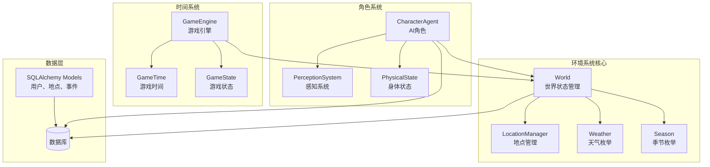

**图表来源**
- [world.py](file://core_engine/environment/world.py#L93-L342)
- [locations.py](file://core_engine/environment/locations.py#L176-L336)
- [engine.py](file://core_engine/engine.py#L167-L429)
- [simulation.py](file://core_engine/simulation.py#L64-L529)

**章节来源**
- [world.py](file://core_engine/environment/world.py#L1-L342)
- [locations.py](file://core_engine/environment/locations.py#L1-L336)
- [engine.py](file://core_engine/engine.py#L1-L429)
- [simulation.py](file://core_engine/simulation.py#L1-L529)

## 核心组件
环境系统的核心组件包括世界状态管理、地理位置系统、时间管理和模拟器整合层。

### 世界状态管理（World）
World类负责管理整个游戏世界的环境状态，包括天气、季节、温度和角色位置。

关键特性：
- **天气系统**: 支持晴天、多云、下雨、暴风雨、下雪、大雾六种天气类型
- **季节模拟**: 四季循环，每30天换季
- **温度调节**: 基于季节和天气的动态温度计算
- **角色位置跟踪**: 实时跟踪和管理角色位置信息

### 地理位置系统（Locations）
LocationManager提供完整的地点管理功能，支持多种地点类型和空间关系。

关键特性：
- **地点类型**: 公共场所、商业场所、住宅、工作场所、医疗设施、政府机构、教育机构、休闲场所
- **空间关系**: 支持点包含检测、距离计算、邻近查找
- **容量管理**: 支持地点容量限制和占用情况跟踪
- **开放时间**: 支持跨午夜的开放时间管理

### 时间管理系统（Engine）
GameEngine提供精确的时间控制和事件调度机制。

关键特性：
- **时间精度**: 以分钟为最小单位的时间管理
- **事件调度**: 基于优先队列的事件调度系统
- **状态持久化**: 支持游戏状态的保存和加载
- **暂停/恢复**: 完整的运行时控制机制

**章节来源**
- [world.py](file://core_engine/environment/world.py#L93-L342)
- [locations.py](file://core_engine/environment/locations.py#L176-L336)
- [engine.py](file://core_engine/engine.py#L167-L429)

## 架构概览
环境系统采用分层架构设计，各组件职责明确，耦合度低，便于扩展和维护。

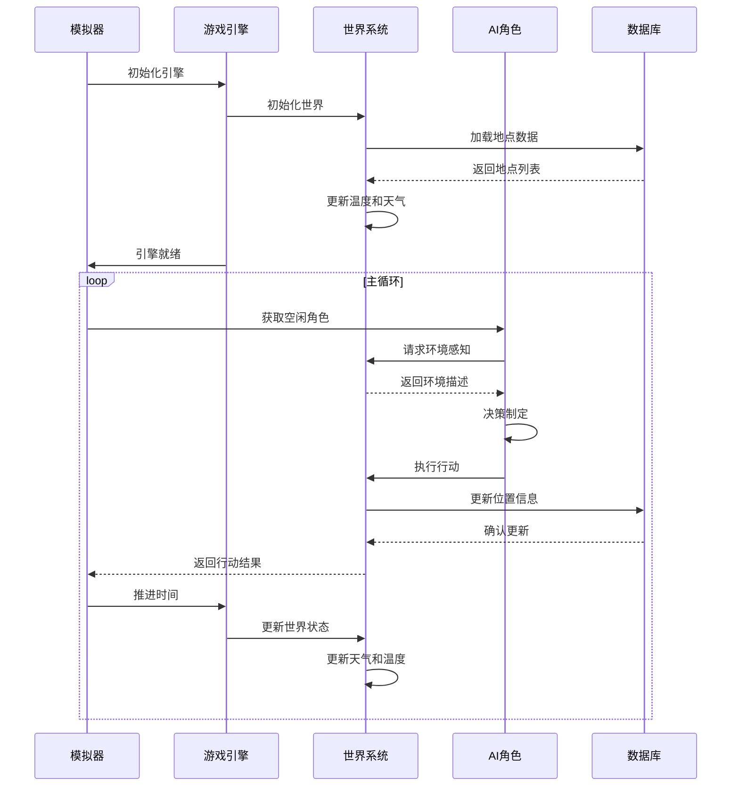

**图表来源**
- [simulation.py](file://core_engine/simulation.py#L220-L250)
- [engine.py](file://core_engine/engine.py#L288-L320)
- [world.py](file://core_engine/environment/world.py#L122-L140)

## 详细组件分析

### 世界状态管理（World）深度分析

#### 天气系统设计
天气系统采用概率驱动的随机变化机制，结合季节因素影响天气分布。

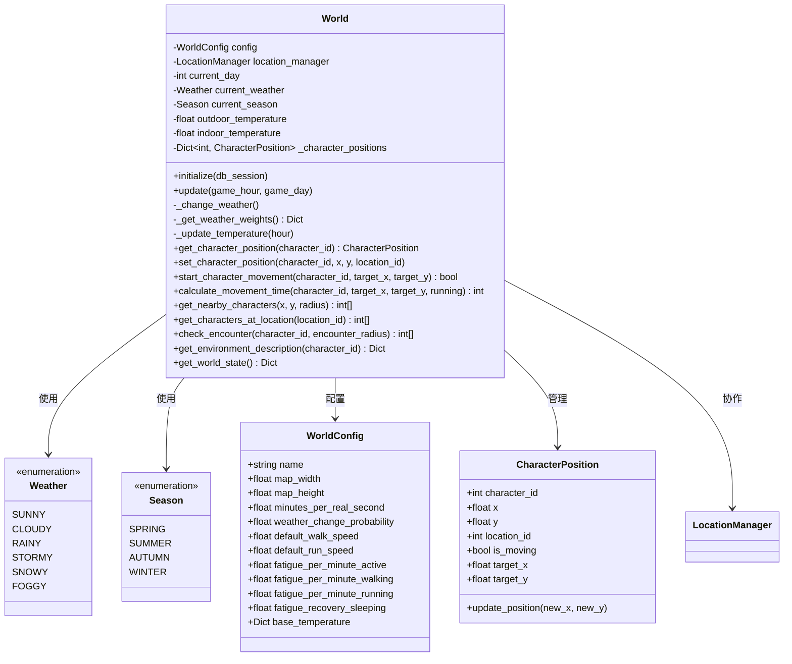

**图表来源**
- [world.py](file://core_engine/environment/world.py#L15-L342)

#### 季节变化模拟算法
季节系统采用基于天数的循环机制，每30天进行一次季节切换。

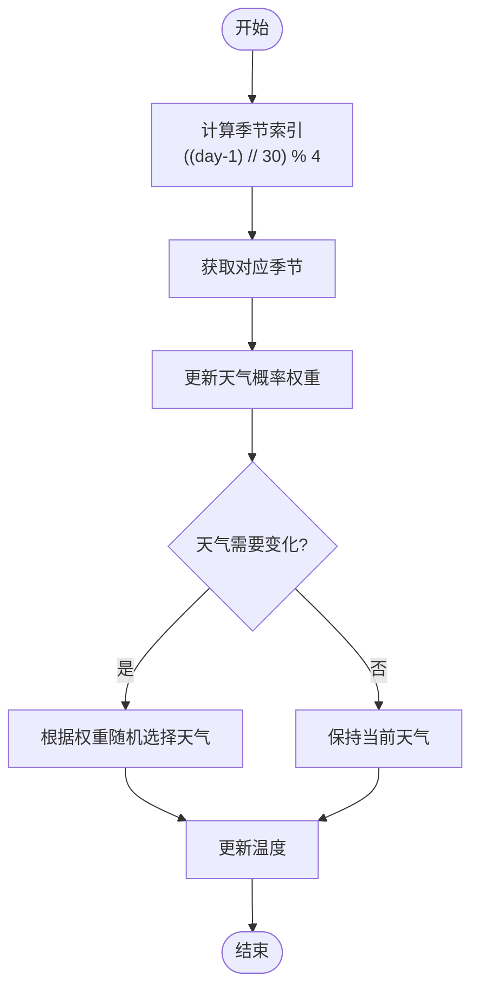

**图表来源**
- [world.py](file://core_engine/environment/world.py#L122-L175)

#### 温度调节机制
温度系统综合考虑季节基础温度、日间变化和天气影响。

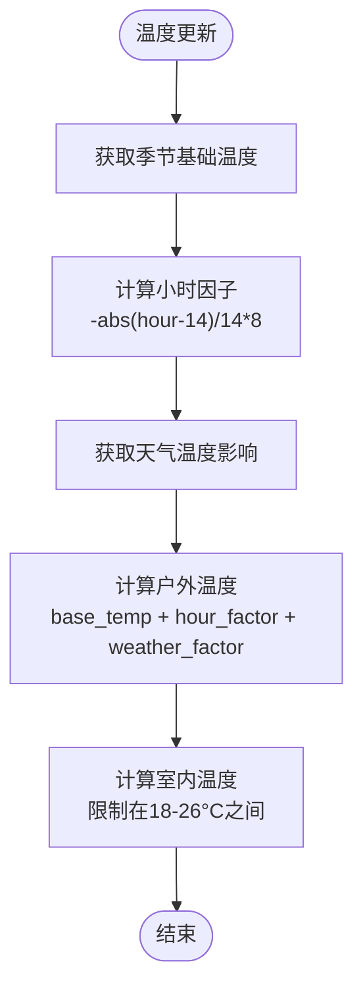

**图表来源**
- [world.py](file://core_engine/environment/world.py#L177-L195)

**章节来源**
- [world.py](file://core_engine/environment/world.py#L15-L342)

### 地理位置系统（Locations）深度分析

#### 地点类型和属性管理
Location类提供了丰富的地点属性和行为方法。

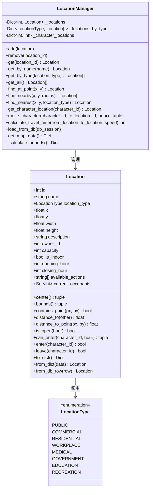

**图表来源**
- [locations.py](file://core_engine/environment/locations.py#L13-L336)

#### 空间关系和导航算法
LocationManager提供了强大的空间查询和导航功能。

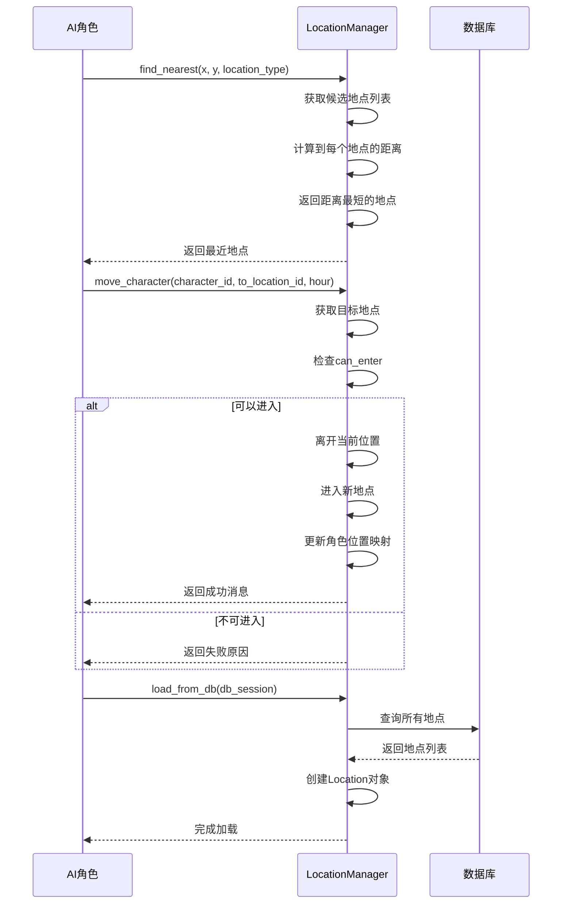

**图表来源**
- [locations.py](file://core_engine/environment/locations.py#L242-L311)

**章节来源**
- [locations.py](file://core_engine/environment/locations.py#L13-L336)

### 环境模拟算法深度分析

#### 基于行动触发的模拟机制
GameSimulation实现了独特的基于行动触发的模拟系统，避免了传统的时间片轮转。

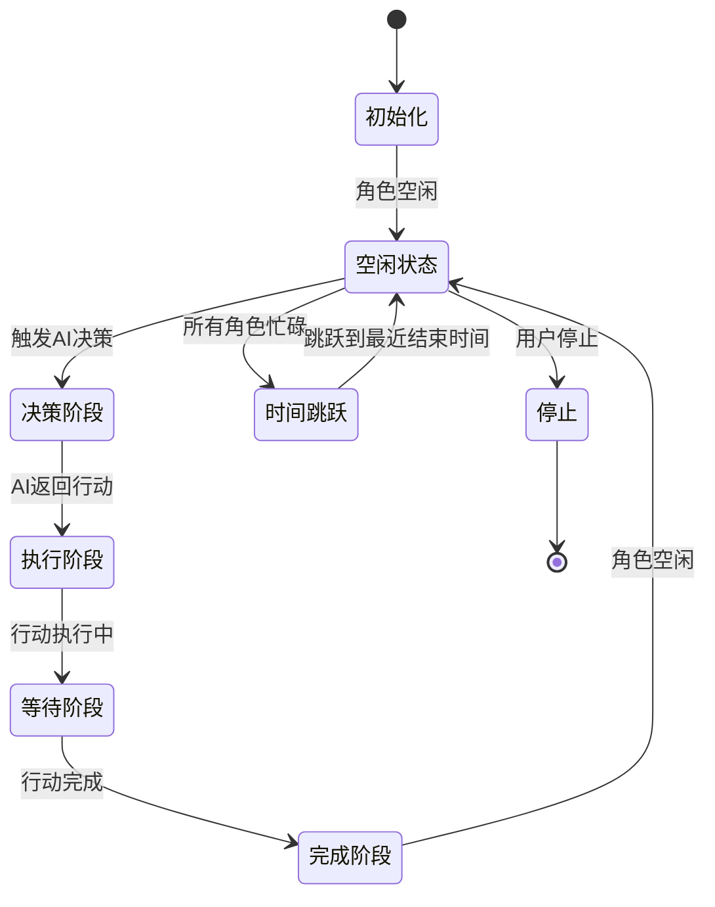

**图表来源**
- [simulation.py](file://core_engine/simulation.py#L220-L250)

#### 时间推进和事件调度
模拟器采用智能的时间推进策略，当所有角色都忙碌时自动跳到最近的行动结束时间。

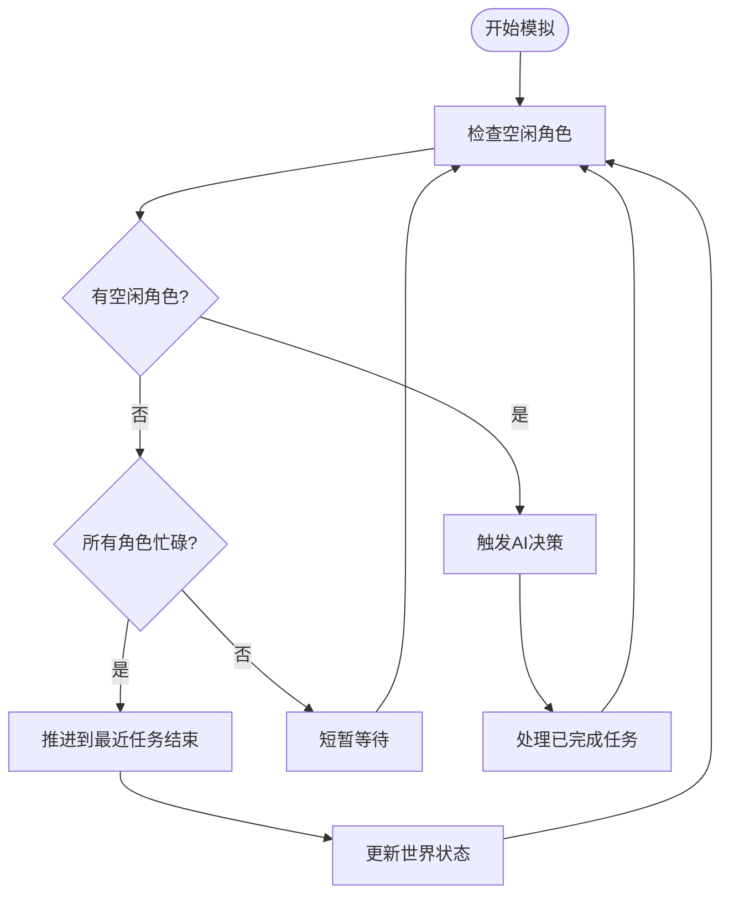

**图表来源**
- [simulation.py](file://core_engine/simulation.py#L346-L395)

**章节来源**
- [simulation.py](file://core_engine/simulation.py#L64-L529)

### 环境与角色交互机制

#### 环境感知系统
CharacterAgent通过PerceptionSystem获取详细的环境信息，包括天气、温度、位置和周围角色。

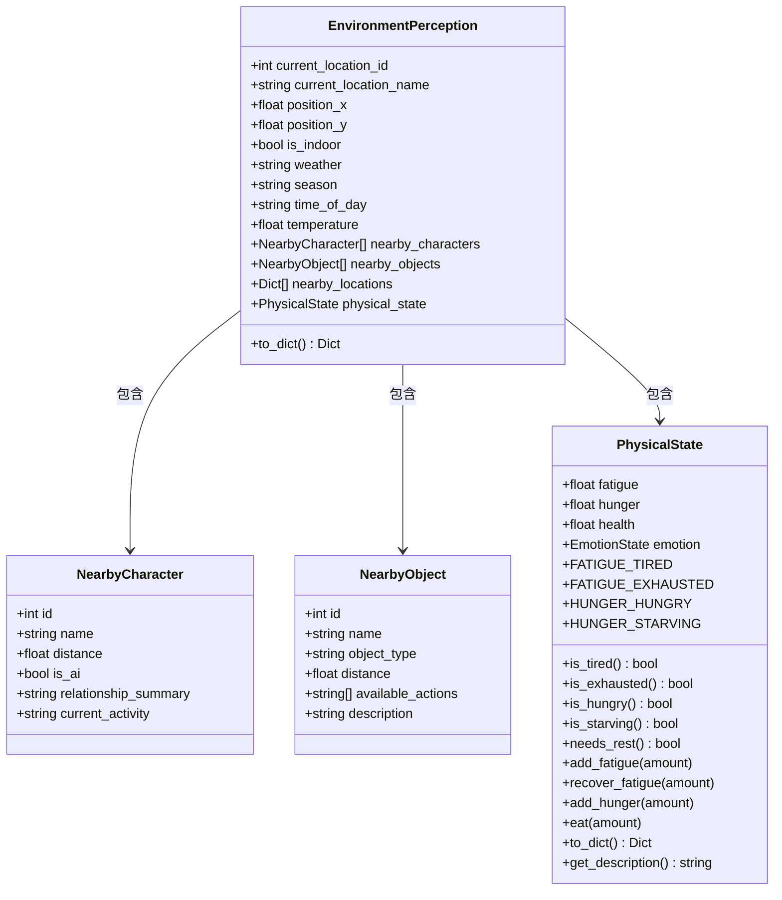

**图表来源**
- [perception.py](file://core_engine/character/perception.py#L149-L200)

#### 环境影响评估和适应性调整
角色根据环境条件调整行为策略，包括寻找遮蔽处、调节活动强度等。

**章节来源**
- [perception.py](file://core_engine/character/perception.py#L1-L200)
- [agent.py](file://core_engine/character/agent.py#L116-L200)

## 依赖关系分析

### 组件间依赖关系
环境系统各组件之间建立了清晰的依赖关系，遵循单一职责原则。

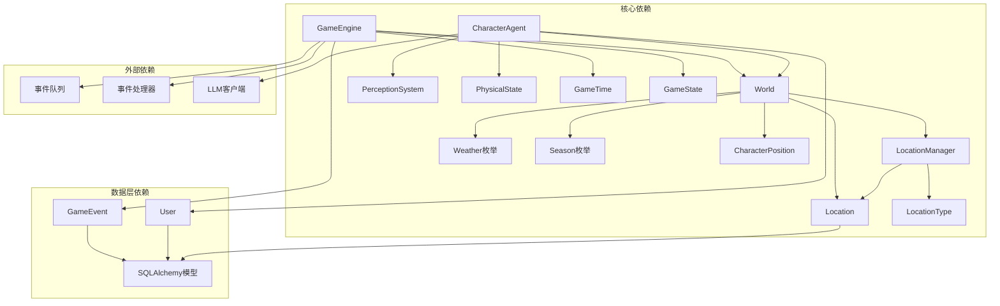

**图表来源**
- [world.py](file://core_engine/environment/world.py#L12-L12)
- [locations.py](file://core_engine/environment/locations.py#L13-L13)
- [engine.py](file://core_engine/engine.py#L14-L16)
- [models.py](file://api_server/models.py#L172-L200)

### 数据流分析
环境系统的数据流体现了从底层数据到高层应用的完整链路。

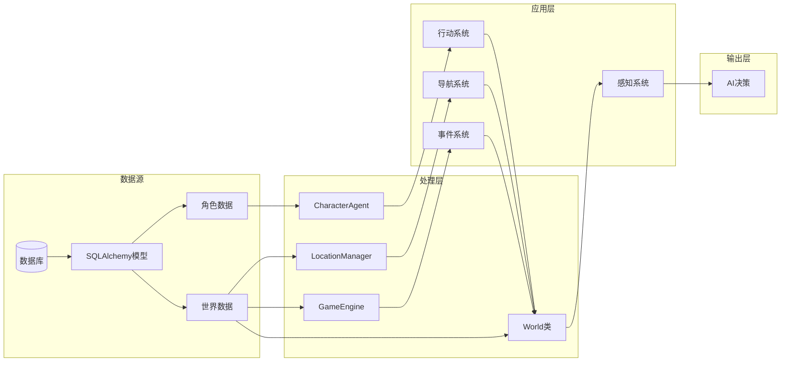

**图表来源**
- [models.py](file://api_server/models.py#L1-L200)
- [world.py](file://core_engine/environment/world.py#L114-L121)
- [simulation.py](file://core_engine/simulation.py#L129-L139)

**章节来源**
- [world.py](file://core_engine/environment/world.py#L1-L342)
- [locations.py](file://core_engine/environment/locations.py#L1-L336)
- [engine.py](file://core_engine/engine.py#L1-L429)
- [simulation.py](file://core_engine/simulation.py#L1-L529)

## 性能考虑

### 时间复杂度分析
- **天气更新**: O(1) - 基于概率的常量时间更新
- **温度计算**: O(1) - 数学公式计算，常量时间
- **角色位置查询**: O(n) - 遍历所有角色位置
- **邻近地点查找**: O(n) - 遍历所有地点计算距离
- **事件调度**: O(log n) - 基于优先队列的插入和删除

### 内存使用优化
- **位置跟踪**: 使用字典存储角色位置，O(n)空间复杂度
- **地点管理**: 使用字典和列表组合，支持快速查找和遍历
- **状态缓存**: 缓存常用计算结果，避免重复计算

### 扩展性建议
- **异步处理**: 利用asyncio实现非阻塞操作
- **批量处理**: 对大量角色的决策进行批量处理
- **缓存机制**: 实现热点数据的缓存策略
- **数据库优化**: 使用连接池和索引优化数据库访问

## 故障排除指南

### 常见问题诊断

#### 天气系统异常
**症状**: 天气变化不符合预期或过于频繁
**排查步骤**:
1. 检查`weather_change_probability`配置值
2. 验证季节权重计算逻辑
3. 确认随机数生成器状态

#### 温度计算错误
**症状**: 温度值异常或不符合季节特征
**排查步骤**:
1. 验证`base_temperature`配置
2. 检查小时因子计算公式
3. 确认天气温度影响值

#### 地点容量问题
**症状**: 无法进入地点或容量统计错误
**排查步骤**:
1. 检查地点容量配置
2. 验证`current_occupants`集合状态
3. 确认`can_enter`方法逻辑

#### 角色位置同步问题
**症状**: 角色位置与实际不符
**排查步骤**:
1. 检查`set_character_position`方法调用
2. 验证`location_manager.move_character`同步
3. 确认坐标系统一致性

**章节来源**
- [world.py](file://core_engine/environment/world.py#L141-L195)
- [locations.py](file://core_engine/environment/locations.py#L90-L118)

## 结论
AI社区环境模拟系统采用模块化设计，实现了完整的环境状态管理、地理位置系统和智能模拟机制。系统具有良好的扩展性和性能表现，为AI角色提供了真实可信的环境体验。通过合理的架构设计和算法实现，系统能够在保证功能完整性的同时，提供高效的运行性能。

## 附录

### 环境配置参数说明

#### WorldConfig配置项
- `name`: 世界名称，默认"AI社区"
- `map_width/map_height`: 地图尺寸，默认500.0
- `minutes_per_real_second`: 时间加速倍数，默认1.0
- `weather_change_probability`: 天气变化概率，默认0.1
- `default_walk_speed/default_run_speed`: 移动速度，默认5.0和10.0
- `fatigue_*`: 疲劳消耗和恢复参数
- `base_temperature`: 季节基础温度配置

#### SimulationConfig配置项
- `max_time_skip`: 最大时间跳跃，默认480分钟
- `decision_timeout`: 决策超时，默认60.0秒
- `verbose`: 详细日志开关
- `initial_day/hour/minute`: 初始时间设置

### 自定义开发指南

#### 扩展天气类型
1. 在Weather枚举中添加新的天气类型
2. 更新`_get_weather_weights`方法中的权重分配
3. 在温度影响映射中添加对应的温度变化值

#### 添加新的地点类型
1. 在LocationType枚举中定义新类型
2. 在Location类中添加相应的属性和方法
3. 更新LocationManager中的类型过滤逻辑

#### 集成新的环境变量
1. 在World类中添加新的环境变量
2. 更新`get_environment_description`方法
3. 在CharacterAgent中添加相应的感知逻辑

#### 性能优化建议
1. 使用异步I/O操作减少阻塞
2. 实现数据缓存机制
3. 优化数据库查询和索引
4. 使用连接池管理数据库连接
5. 实现批量处理和并发执行

**章节来源**
- [world.py](file://core_engine/environment/world.py#L33-L65)
- [simulation.py](file://core_engine/simulation.py#L46-L62)