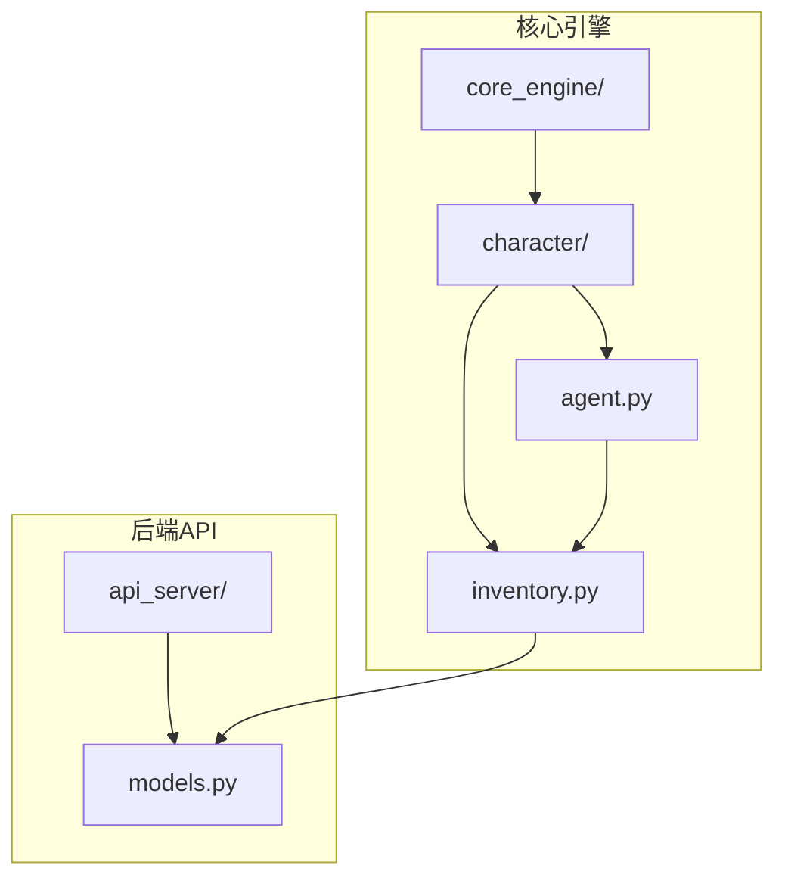
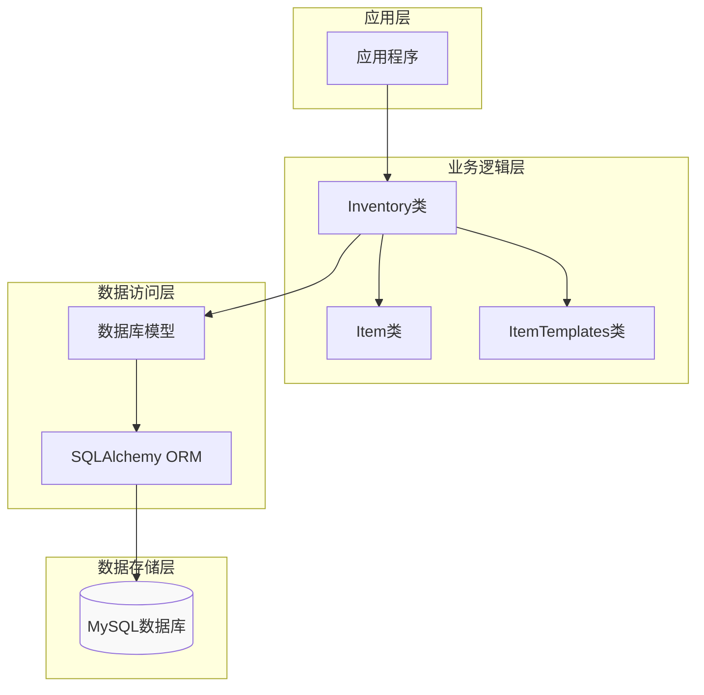
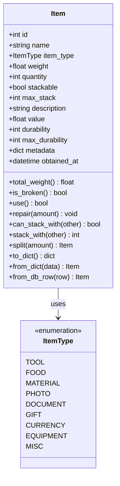
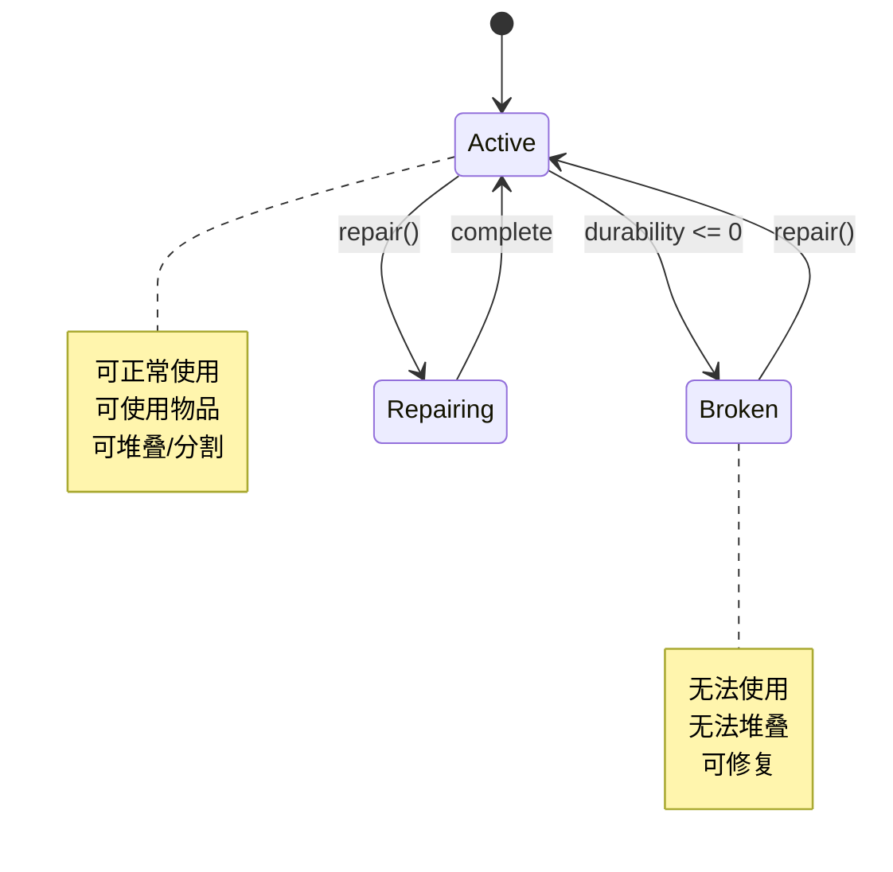
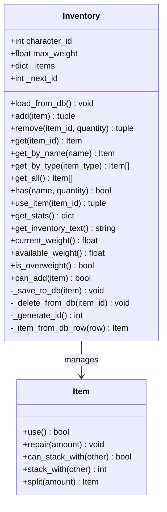
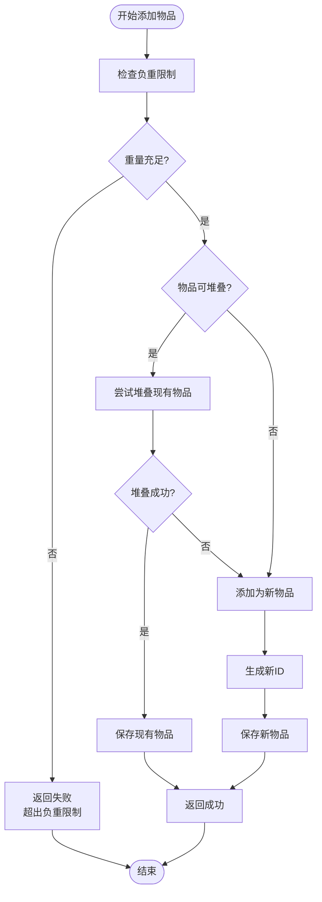
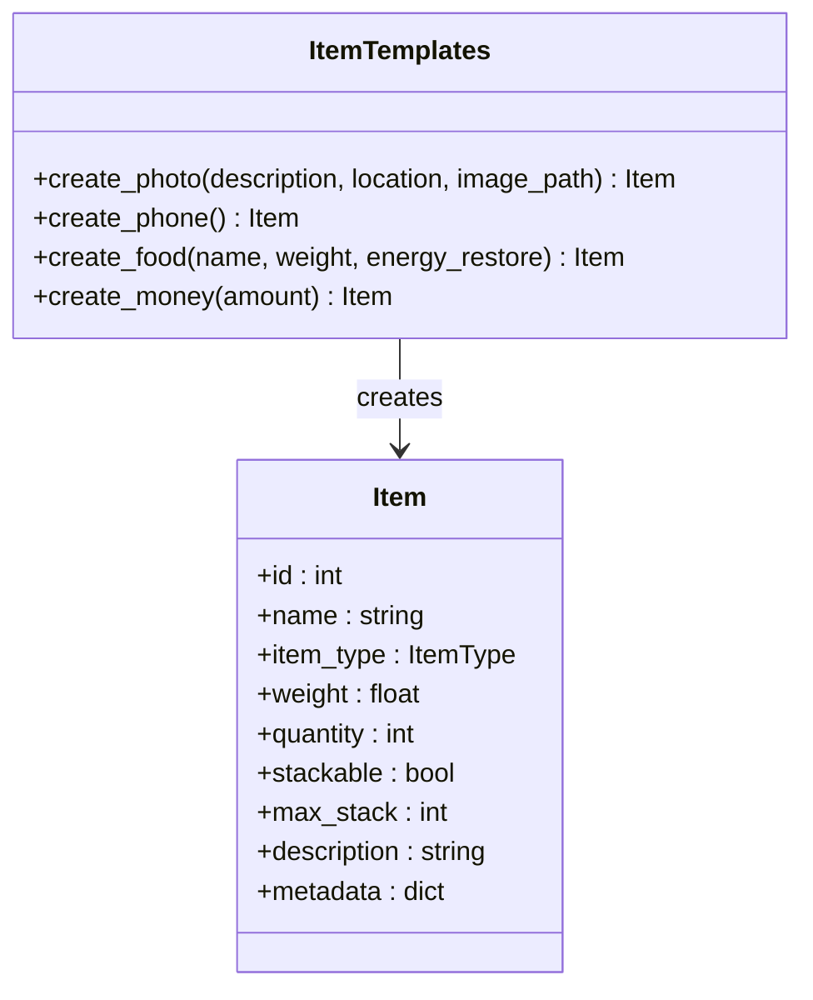
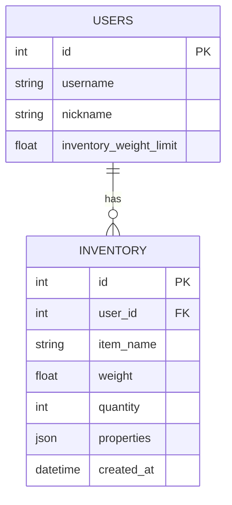
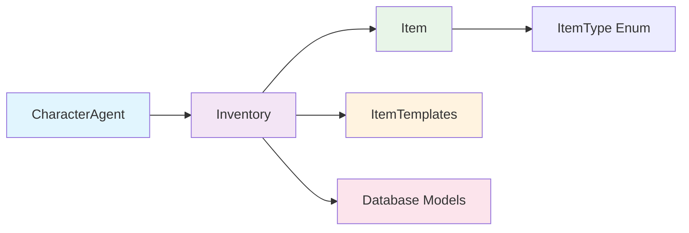

# 物品栏系统

<cite>
**本文档引用的文件**
- [inventory.py](file://core_engine/character/inventory.py)
- [models.py](file://api_server/models.py)
- [agent.py](file://core_engine/character/agent.py)
- [README.md](file://README.md)
</cite>

## 目录
1. [简介](#简介)
2. [项目结构](#项目结构)
3. [核心组件](#核心组件)
4. [架构概览](#架构概览)
5. [详细组件分析](#详细组件分析)
6. [依赖关系分析](#依赖关系分析)
7. [性能考虑](#性能考虑)
8. [故障排除指南](#故障排除指南)
9. [结论](#结论)
10. [附录](#附录)

## 简介
物品栏系统是AI社区模拟系统中的核心子系统，负责管理AI角色的物品持有、重量限制、物品分类和持久化存储。该系统基于Python的数据类和枚举类型构建，提供了完整的物品生命周期管理，包括创建、使用、堆叠、分割和持久化等功能。

## 项目结构
物品栏系统位于核心引擎的字符模块中，与数据库模型紧密集成：



**图表来源**
- [inventory.py](file://core_engine/character/inventory.py#L1-L547)
- [models.py](file://api_server/models.py#L220-L233)

**章节来源**
- [README.md](file://README.md#L1-L35)

## 核心组件
物品栏系统主要包含三个核心组件：

### 1. 物品类型系统
系统定义了九种物品类型，涵盖工具、食物、材料、照片、文档、礼物、货币、装备和杂项。

### 2. 物品类(Item)
物品类是系统的基础数据结构，包含物品的基本属性、可选属性和元数据。

### 3. 物品栏类(Inventory)
物品栏类管理角色的物品集合，提供重量限制、物品操作和持久化功能。

**章节来源**
- [inventory.py](file://core_engine/character/inventory.py#L14-L25)
- [inventory.py](file://core_engine/character/inventory.py#L27-L192)
- [inventory.py](file://core_engine/character/inventory.py#L194-L474)

## 架构概览
物品栏系统采用分层架构设计，实现了清晰的关注点分离：



**图表来源**
- [inventory.py](file://core_engine/character/inventory.py#L194-L474)
- [models.py](file://api_server/models.py#L220-L233)

## 详细组件分析

### 物品类(Item)设计

#### 数据结构设计
Item类采用Python数据类装饰器，提供了简洁而强大的数据封装能力：



**图表来源**
- [inventory.py](file://core_engine/character/inventory.py#L27-L192)

#### 属性系统设计
物品类支持多种属性组合，包括必需属性、可选属性和元数据属性：

| 属性类别 | 属性名称 | 类型 | 描述 |
|---------|----------|------|------|
| 必需属性 | id | int | 物品唯一标识符 |
| 必需属性 | name | string | 物品名称 |
| 必需属性 | item_type | ItemType | 物品类型枚举 |
| 基础属性 | weight | float | 单个物品重量 |
| 基础属性 | quantity | int | 物品数量 |
| 基础属性 | stackable | bool | 是否可堆叠 |
| 基础属性 | max_stack | int | 最大堆叠数量 |
| 描述属性 | description | string | 物品描述 |
| 价值属性 | value | float | 物品价值 |
| 耐久属性 | durability | int | 当前耐久度 |
| 耐久属性 | max_durability | int | 最大耐久度 |
| 元数据 | metadata | dict | 自定义元数据 |

**章节来源**
- [inventory.py](file://core_engine/character/inventory.py#L27-L48)

#### 物品状态管理
系统实现了完整的物品状态管理机制：



**图表来源**
- [inventory.py](file://core_engine/character/inventory.py#L55-L85)

### 物品栏类(Inventory)设计

#### 核心功能架构
Inventory类提供了完整的物品管理功能：



**图表来源**
- [inventory.py](file://core_engine/character/inventory.py#L194-L474)

#### 负重管理系统
系统实现了精确的负重计算和限制机制：



**图表来源**
- [inventory.py](file://core_engine/character/inventory.py#L324-L357)

**章节来源**
- [inventory.py](file://core_engine/character/inventory.py#L194-L357)

### 物品模板系统(ItemTemplates)

#### 预定义模板设计
系统提供了六种常用的物品模板，简化了物品创建过程：



**图表来源**
- [inventory.py](file://core_engine/character/inventory.py#L478-L547)

#### 模板使用场景
| 模板类型 | 使用场景 | 关键特性 |
|---------|----------|----------|
| create_photo | 照片收集 | 不可堆叠，包含位置和描述元数据 |
| create_phone | 角色初始装备 | 耐久度系统，支持多种操作 |
| create_food | 饥饿管理 | 可堆叠，包含能量恢复效果 |
| create_money | 经济系统 | 大量堆叠，零重量 |

**章节来源**
- [inventory.py](file://core_engine/character/inventory.py#L478-L547)

## 依赖关系分析

### 数据库集成
物品栏系统与数据库模型建立了紧密的集成关系：



**图表来源**
- [models.py](file://api_server/models.py#L35-L54)
- [models.py](file://api_server/models.py#L220-L233)

### 组件间依赖关系
系统各组件之间的依赖关系如下：



**图表来源**
- [agent.py](file://core_engine/character/agent.py#L141)
- [inventory.py](file://core_engine/character/inventory.py#L14-L25)

**章节来源**
- [agent.py](file://core_engine/character/agent.py#L141)
- [models.py](file://api_server/models.py#L220-L233)

## 性能考虑

### 时间复杂度分析
- **物品添加**: O(n) - 需要遍历现有物品进行堆叠检查
- **物品查找**: O(1) - 基于字典的直接访问
- **物品移除**: O(1) - 字典删除操作
- **统计计算**: O(n) - 需要遍历所有物品

### 内存优化策略
1. **惰性加载**: 物品栏在需要时才从数据库加载
2. **增量更新**: 只更新发生变化的物品
3. **元数据压缩**: 使用JSON存储元数据，支持动态扩展

### 扩展性设计
系统支持通过元数据扩展物品功能，无需修改核心架构。

## 故障排除指南

### 常见问题及解决方案

#### 物品栏加载失败
**症状**: 角色启动时物品栏为空
**原因**: 数据库连接问题或权限不足
**解决**: 检查数据库配置和连接状态

#### 负重限制异常
**症状**: 物品添加时报错"超出负重限制"
**原因**: 物品总重量计算错误
**解决**: 检查物品重量设置和堆叠逻辑

#### 物品持久化失败
**症状**: 物品变更未保存到数据库
**原因**: 数据库事务提交失败
**解决**: 检查数据库连接和事务状态

**章节来源**
- [inventory.py](file://core_engine/character/inventory.py#L209-L227)
- [inventory.py](file://core_engine/character/inventory.py#L261-L297)

## 结论
物品栏系统通过精心设计的数据结构和算法，实现了高效、可扩展的物品管理功能。系统的核心优势包括：

1. **模块化设计**: 清晰的职责分离和接口定义
2. **持久化集成**: 与数据库的无缝集成
3. **扩展性**: 支持通过元数据扩展功能
4. **性能优化**: 高效的数据结构和算法选择

该系统为AI社区模拟提供了坚实的基础，支持复杂的物品交互和经济系统。

## 附录

### API使用示例

#### 创建物品模板
```python
# 创建手机
phone = ItemTemplates.create_phone()

# 创建食物
apple = ItemTemplates.create_food("苹果", 0.3, 15)

# 创建货币
gold = ItemTemplates.create_money(100)
```

#### 物品栏操作
```python
# 添加物品
success, message = inventory.add(item)

# 使用物品
success, message = inventory.use_item(item_id)

# 获取物品统计
stats = inventory.get_stats()
```

#### 数据库集成
```python
# 从数据库加载
inventory.load_from_db()

# 保存物品变更
inventory._save_to_db(item)
```

**章节来源**
- [inventory.py](file://core_engine/character/inventory.py#L482-L546)
- [inventory.py](file://core_engine/character/inventory.py#L328-L439)
- [inventory.py](file://core_engine/character/inventory.py#L209-L297)