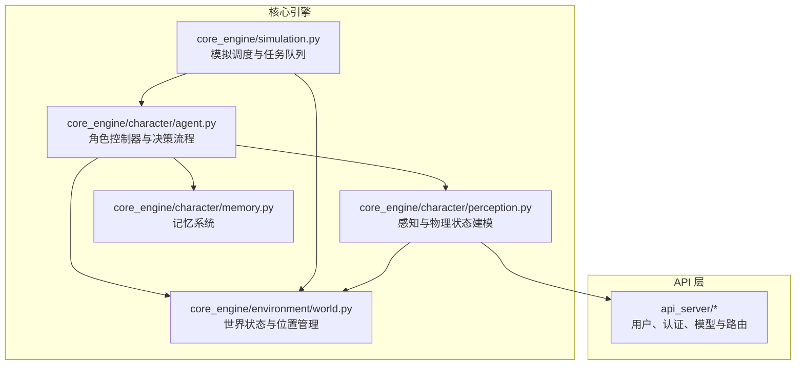
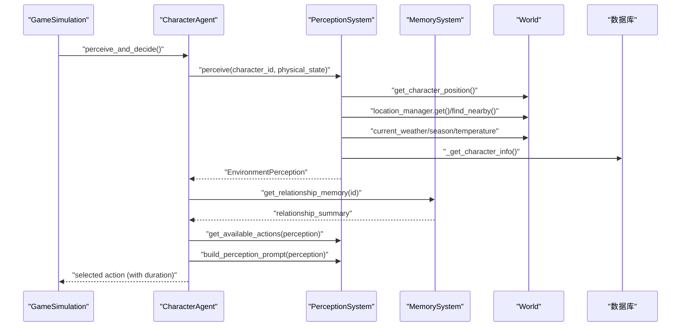
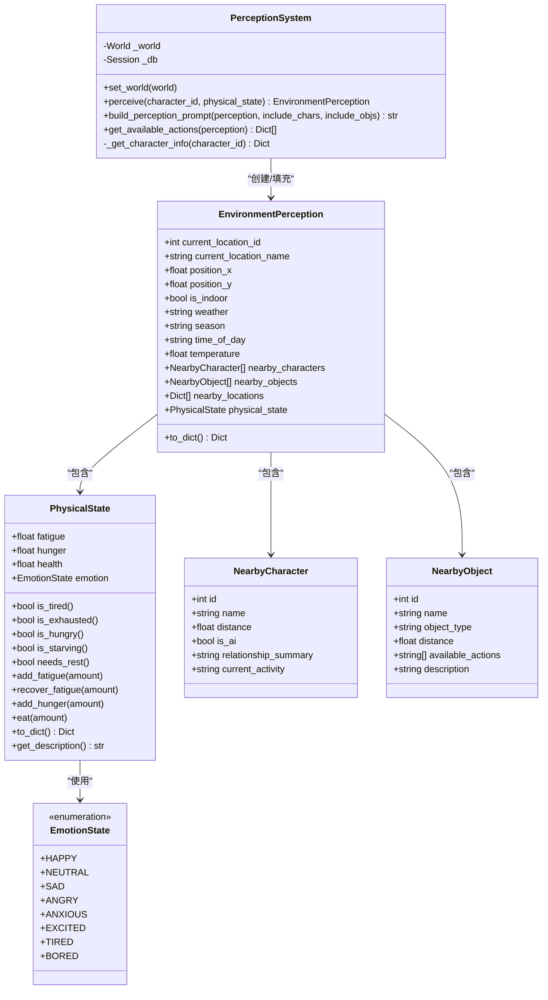
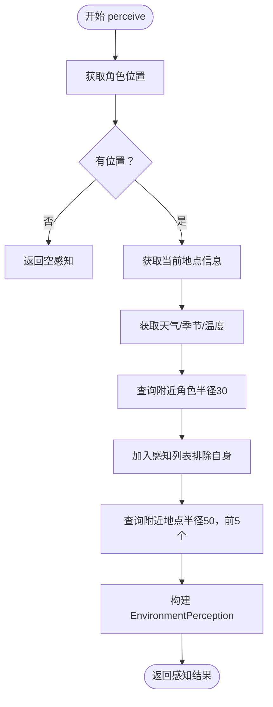
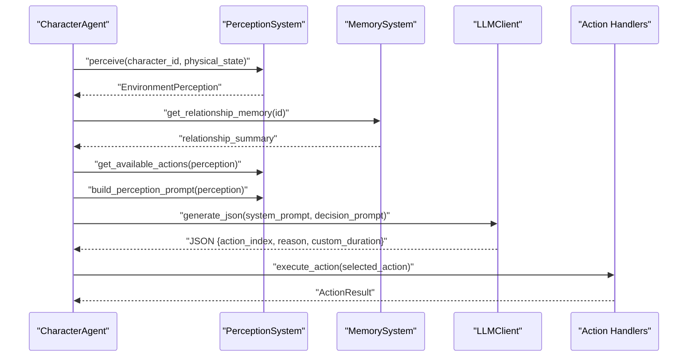
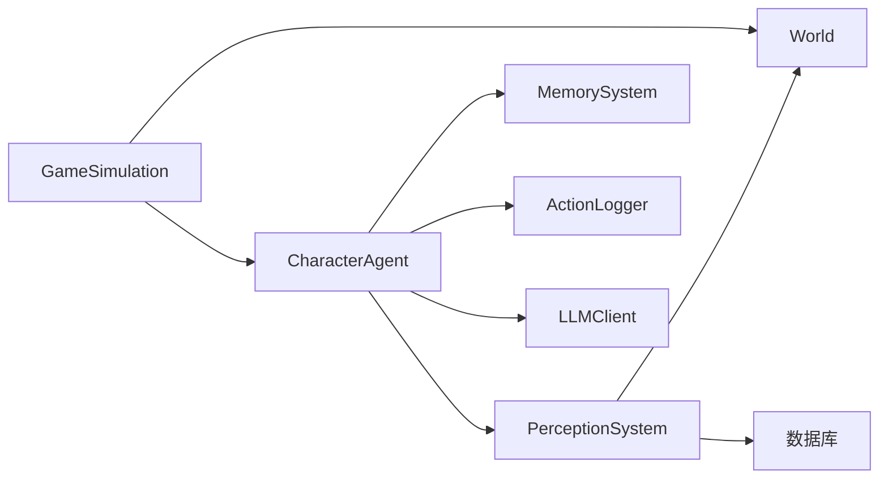

# 环境感知系统

<cite>
**本文引用的文件**
- [perception.py](file://core_engine/character/perception.py)
- [agent.py](file://core_engine/character/agent.py)
- [world.py](file://core_engine/environment/world.py)
- [simulation.py](file://core_engine/simulation.py)
- [run_simulation.py](file://run_simulation.py)
- [memory.py](file://core_engine/character/memory.py)
</cite>

## 目录
1. [简介](#简介)
2. [项目结构](#项目结构)
3. [核心组件](#核心组件)
4. [架构总览](#架构总览)
5. [详细组件分析](#详细组件分析)
6. [依赖关系分析](#依赖关系分析)
7. [性能考量](#性能考量)
8. [故障排查指南](#故障排查指南)
9. [结论](#结论)
10. [附录](#附录)

## 简介
本技术文档围绕“环境感知系统”展开，重点阐述 PerceptionSystem 类的设计与实现，涵盖环境感知（EnvironmentPerception）、物理状态（PhysicalState）以及情感状态（EmotionState）的建模方式；详解感知信息收集机制（附近角色感知、位置信息获取、环境状态分析）；说明可用行动识别算法（行动合法性检查、行动成本计算、行动优先级排序）；解释感知提示词构建（build_perception_prompt）的实现（感知信息格式化与决策输入生成）；并介绍情感状态与身体状态对感知与决策的影响机制。最后提供环境感知、行动识别与状态评估的具体代码示例路径，帮助读者快速定位实现细节。

## 项目结构
本项目采用分层架构：
- 核心引擎层（core_engine）：包含角色、环境、事件、可视化等子系统
- API 层（api_server）：提供用户、认证、社交等接口
- 前端层（web_frontend）：基于 Nuxt 的 Web 前端
- 运行入口（run_simulation.py）：模拟器启动与交互控制

与环境感知系统直接相关的模块位于 core_engine/character 与 core_engine/environment 中，分别负责角色感知与世界状态。

图表来源
- [perception.py](file://core_engine/character/perception.py#L1-L528)
- [agent.py](file://core_engine/character/agent.py#L1-L800)
- [world.py](file://core_engine/environment/world.py#L1-L342)
- [simulation.py](file://core_engine/simulation.py#L1-L200)
- [memory.py](file://core_engine/character/memory.py#L1-L200)

章节来源
- [perception.py](file://core_engine/character/perception.py#L1-L528)
- [agent.py](file://core_engine/character/agent.py#L1-L800)
- [world.py](file://core_engine/environment/world.py#L1-L342)
- [simulation.py](file://core_engine/simulation.py#L1-L200)
- [run_simulation.py](file://run_simulation.py#L1-L258)

## 核心组件
- 感知系统（PerceptionSystem）：负责收集角色周围环境信息，包括位置、天气、地点、角色与物品，并生成可用于决策的提示词
- 环境感知（EnvironmentPerception）：承载感知结果的数据结构，包含位置、环境条件、附近角色/物品/地点、身体状态等
- 物理状态（PhysicalState）：封装疲劳、饥饿、健康、情绪等状态及其阈值判断与描述
- 情绪状态（EmotionState）：枚举型情绪类别，影响身体状态与行为倾向
- 记忆系统（MemorySystem）：为感知补充关系记忆摘要，增强社交感知质量
- 世界（World）：提供角色位置、天气、季节、温度等全局环境信息

章节来源
- [perception.py](file://core_engine/character/perception.py#L12-L124)
- [perception.py](file://core_engine/character/perception.py#L148-L209)
- [perception.py](file://core_engine/character/perception.py#L211-L303)
- [agent.py](file://core_engine/character/agent.py#L116-L175)
- [world.py](file://core_engine/environment/world.py#L93-L121)

## 架构总览
感知系统在角色控制器（CharacterAgent）中被调用，通过 PerceptionSystem 收集环境信息，结合 MemorySystem 的关系记忆与 PhysicalState 的身体状态，生成决策提示词，最终由 LLM 选择行动并执行。

图表来源
- [agent.py](file://core_engine/character/agent.py#L357-L477)
- [perception.py](file://core_engine/character/perception.py#L226-L303)
- [perception.py](file://core_engine/character/perception.py#L395-L527)
- [world.py](file://core_engine/environment/world.py#L197-L286)

## 详细组件分析

### PerceptionSystem 类设计与实现
PerceptionSystem 是环境感知的核心，负责：
- 从世界（World）获取角色位置、地点信息、天气/季节/温度
- 从世界查询附近角色与地点
- 从数据库获取角色昵称与 AI 标记
- 生成 EnvironmentPerception 结果
- 构建用于决策的提示词（build_perception_prompt）
- 生成可用行动清单（get_available_actions）

图表来源
- [perception.py](file://core_engine/character/perception.py#L12-L124)
- [perception.py](file://core_engine/character/perception.py#L126-L209)
- [perception.py](file://core_engine/character/perception.py#L211-L303)
- [perception.py](file://core_engine/character/perception.py#L320-L527)

章节来源
- [perception.py](file://core_engine/character/perception.py#L211-L303)
- [perception.py](file://core_engine/character/perception.py#L320-L393)
- [perception.py](file://core_engine/character/perception.py#L395-L527)

### EnvironmentPerception 数据结构与序列化
EnvironmentPerception 是感知结果的载体，包含：
- 位置信息（坐标、地点ID、是否室内）
- 环境信息（天气、季节、时间、温度）
- 附近角色、物品、地点列表
- 身体状态（PhysicalState）

其 to_dict 方法提供统一的序列化输出，便于日志与调试。

章节来源
- [perception.py](file://core_engine/character/perception.py#L148-L209)

### PhysicalState 与 EmotionState 的状态建模
PhysicalState 提供疲劳、饥饿、健康与情绪的量化与阈值判断，并在疲劳过高时自动调整情绪（例如变为疲惫）。get_description 提供人类可读的状态描述，用于提示词构建。

章节来源
- [perception.py](file://core_engine/character/perception.py#L24-L124)

### 感知信息收集机制
PerceptionSystem 的 perceive 方法：
- 获取角色位置与当前地点名称与室内属性
- 读取天气、季节与温度（室内/室外）
- 查询附近角色（排除自身）并获取基础信息（昵称、是否AI）
- 查询附近地点（限定半径与数量），标注开放状态
- 返回完整的 EnvironmentPerception

图表来源
- [perception.py](file://core_engine/character/perception.py#L226-L303)

章节来源
- [perception.py](file://core_engine/character/perception.py#L226-L303)

### 可用行动识别算法
get_available_actions 基于 EnvironmentPerception 生成行动清单，包含：
- 基础行动：等待、观察周围
- 移动行动：前往附近开放地点（按距离估算步行时间）
- 社交行动：与附近角色交谈、打招呼
- 物品交互：遍历附近物品的可用动作
- 休息/睡觉：根据疲劳度阈值自动加入
- 室内社交：浏览帖子、发帖、查看私信、主动发私信、查看主页（基于附近角色）

行动成本计算：
- 移动行动：以步行速度约5单位/分钟估算时长
- 其他行动：固定时长（如等待、观察、对话、浏览等）

行动优先级排序：
- 代码未显式实现优先级排序，但在决策提示词中建议考虑疲劳度、最近行动与计划，最终由 LLM 在 JSON 输出中选择 action_index。

章节来源
- [perception.py](file://core_engine/character/perception.py#L395-L527)

### 感知提示词构建（build_perception_prompt）
build_perception_prompt 将 EnvironmentPerception 转换为自然语言提示词，包含：
- 身体状态描述与疲劳值
- 当前位置与室内/室外
- 环境信息（季节、天气、温度）
- 附近角色（名称、距离、关系摘要、当前活动）
- 附近地点（名称、距离、开放状态）
- 附近物品（名称、可执行动作）

该提示词作为决策输入的一部分，结合记忆、计划与最近行动历史，驱动 LLM 选择行动。

章节来源
- [perception.py](file://core_engine/character/perception.py#L320-L393)

### 情感状态与身体状态对感知的影响机制
- PhysicalState 在疲劳过高时自动调整情绪（例如疲惫），并通过 get_description 提供状态描述，影响提示词的语气与重点
- 情绪状态（EmotionState）与身体状态共同决定行动倾向（如疲劳高时自动加入休息/睡觉行动）

章节来源
- [perception.py](file://core_engine/character/perception.py#L58-L68)
- [perception.py](file://core_engine/character/perception.py#L89-L123)

### 与角色控制器（CharacterAgent）的集成
CharacterAgent 在每次决策周期中：
- 调用 PerceptionSystem.perceive 获取 EnvironmentPerception
- 从 MemorySystem 填充关系记忆摘要
- 调用 PerceptionSystem.get_available_actions 生成行动清单
- 调用 PerceptionSystem.build_perception_prompt 生成提示词
- 通过 LLM 生成 JSON 选择（action_index、reason、可选 custom_duration）
- 执行选定行动并记录日志与事件

图表来源
- [agent.py](file://core_engine/character/agent.py#L357-L477)
- [agent.py](file://core_engine/character/agent.py#L479-L521)

章节来源
- [agent.py](file://core_engine/character/agent.py#L357-L477)
- [agent.py](file://core_engine/character/agent.py#L479-L521)

### 世界状态与位置管理
World 提供：
- 角色位置查询与设置
- 天气、季节、温度随时间与季节变化
- 附近角色与地点查询
- 环境描述汇总（用于外部查询）

章节来源
- [world.py](file://core_engine/environment/world.py#L93-L121)
- [world.py](file://core_engine/environment/world.py#L197-L286)
- [world.py](file://core_engine/environment/world.py#L288-L326)

### 记忆系统对感知的影响
MemorySystem 为每个感知到的附近角色填充 relationship_summary，提升社交感知的真实性与上下文丰富度。

章节来源
- [memory.py](file://core_engine/character/memory.py#L92-L200)
- [agent.py](file://core_engine/character/agent.py#L373-L378)

## 依赖关系分析
- PerceptionSystem 依赖 World 提供位置、天气、地点信息；依赖数据库查询角色昵称与AI标记
- CharacterAgent 依赖 PerceptionSystem、MemorySystem、ActionLogger 与 LLMClient
- Simulation 调度角色决策，维护 AgentTask 堆与时间推进

图表来源
- [agent.py](file://core_engine/character/agent.py#L116-L175)
- [perception.py](file://core_engine/character/perception.py#L218-L221)
- [simulation.py](file://core_engine/simulation.py#L64-L114)

章节来源
- [agent.py](file://core_engine/character/agent.py#L116-L175)
- [perception.py](file://core_engine/character/perception.py#L218-L221)
- [simulation.py](file://core_engine/simulation.py#L64-L114)

## 性能考量
- 感知范围与查询复杂度：附近角色与地点查询受半径与数量限制（半径30/50，数量前5），降低每次感知的计算开销
- 行动成本估算：移动时间按固定速度估算，避免复杂寻路开销
- 序列化与提示词构建：to_dict 与字符串拼接为 O(n) 复杂度，适合高频调用
- I/O 优化：角色昵称查询仅在感知阶段进行，且可按需开启/关闭角色与物品信息输出

[本节为通用性能讨论，不直接分析具体文件]

## 故障排查指南
- 无法获取角色位置：确认 World 已初始化并设置角色初始位置
- 附近角色为空：检查角色半径与世界中角色分布
- 附近地点为空：检查地点管理器是否加载成功与查询半径
- 提示词异常：检查 EnvironmentPerception 字段完整性与 build_perception_prompt 参数
- 行动未执行：确认 CharacterAgent.register_action_handler 是否正确注册对应 action

章节来源
- [world.py](file://core_engine/environment/world.py#L114-L121)
- [world.py](file://core_engine/environment/world.py#L197-L220)
- [perception.py](file://core_engine/character/perception.py#L267-L303)
- [agent.py](file://core_engine/character/agent.py#L176-L179)

## 结论
环境感知系统通过 PerceptionSystem 将世界状态、角色位置与社交关系整合为统一的感知结果，并以自然语言提示词驱动 LLM 决策。PhysicalState 与 EmotionState 的引入使感知具备更贴近真实人类状态的动态特征。行动识别算法以简单而高效的成本估算与条件分支覆盖常见场景，满足实时模拟需求。未来可在以下方面进一步完善：
- 引入更精细的行动优先级排序与冲突检测
- 增强天气与环境对行动成本的动态影响
- 扩展物品交互的合法性检查与代价模型

[本节为总结性内容，不直接分析具体文件]

## 附录

### 环境感知示例（代码路径）
- 感知结果构造：[perception.py](file://core_engine/character/perception.py#L226-L303)
- 环境描述提示词：[perception.py](file://core_engine/character/perception.py#L320-L393)

### 行动识别示例（代码路径）
- 可用行动清单生成：[perception.py](file://core_engine/character/perception.py#L395-L527)

### 状态评估示例（代码路径）
- 物理状态阈值与描述：[perception.py](file://core_engine/character/perception.py#L24-L124)
- 情绪状态枚举：[perception.py](file://core_engine/character/perception.py#L12-L22)

### 决策流程示例（代码路径）
- 角色感知与决策：[agent.py](file://core_engine/character/agent.py#L357-L477)
- 行动执行与日志记录：[agent.py](file://core_engine/character/agent.py#L479-L565)

### 模拟调度示例（代码路径）
- 模拟器主循环与任务堆：[simulation.py](file://core_engine/simulation.py#L187-L336)
- 启动脚本与交互命令：[run_simulation.py](file://run_simulation.py#L54-L182)