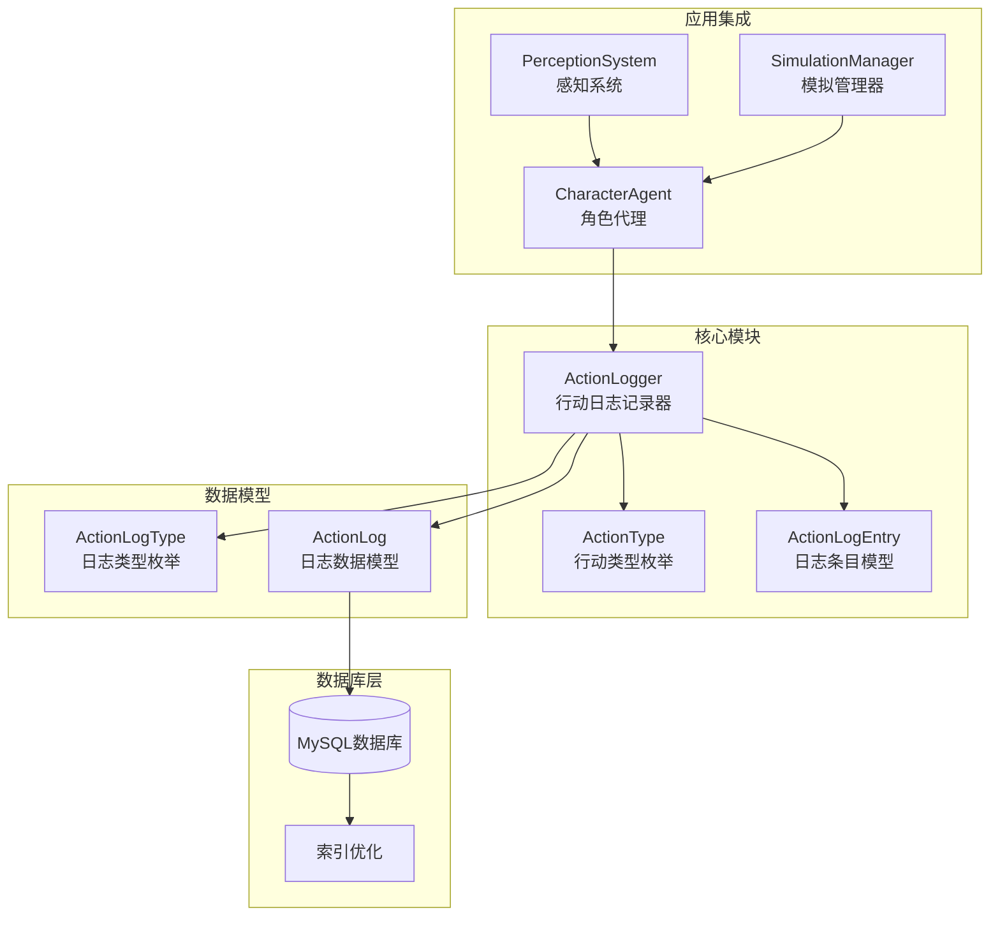
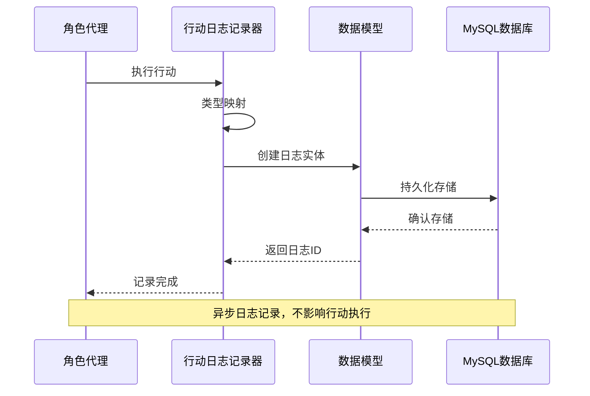
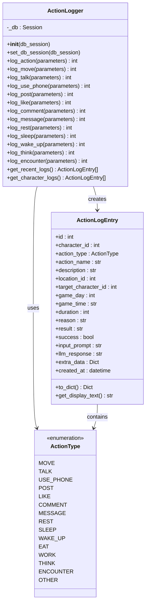
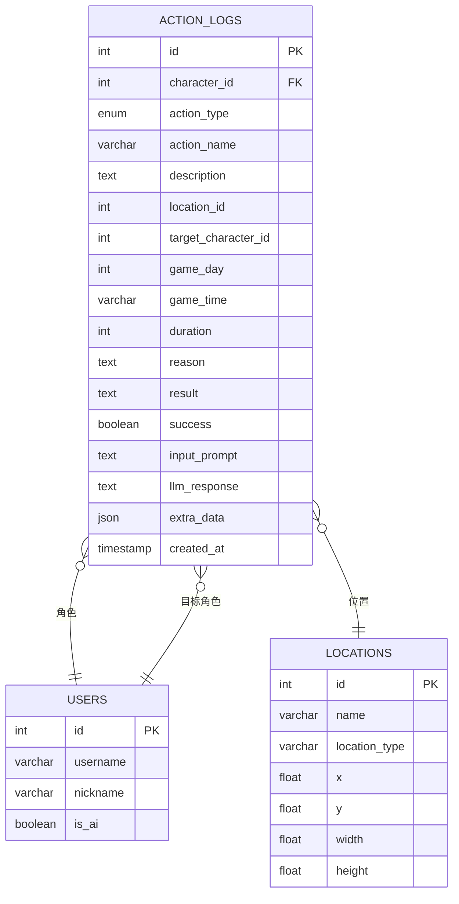
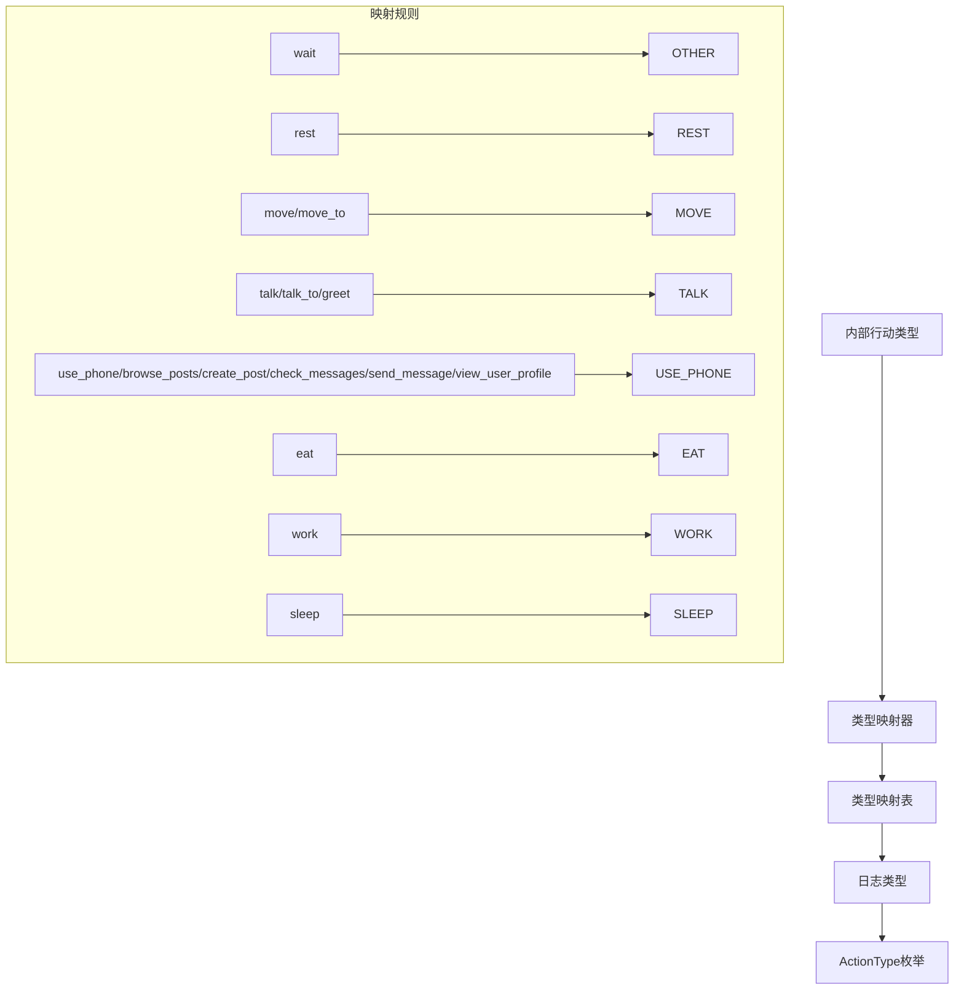
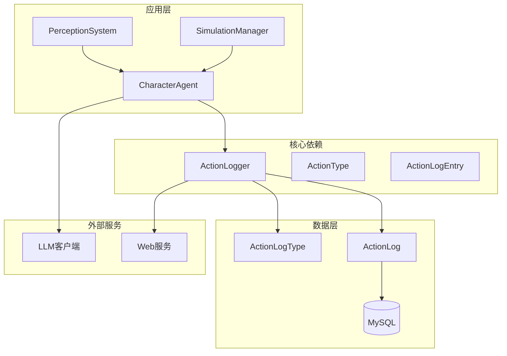

# 行动日志系统

<cite>
**本文档引用的文件**
- [action_logger.py](file://core_engine/character/action_logger.py)
- [models.py](file://api_server/models.py)
- [002_action_logs.sql](file://data/migrations/002_action_logs.sql)
- [agent.py](file://core_engine/character/agent.py)
- [perception.py](file://core_engine/character/perception.py)
- [simulation.py](file://core_engine/simulation.py)
- [memory.py](file://core_engine/character/memory.py)
</cite>

## 目录
1. [简介](#简介)
2. [项目结构](#项目结构)
3. [核心组件](#核心组件)
4. [架构概览](#架构概览)
5. [详细组件分析](#详细组件分析)
6. [依赖关系分析](#依赖关系分析)
7. [性能考量](#性能考量)
8. [故障排除指南](#故障排除指南)
9. [结论](#结论)

## 简介
行动日志系统是AI社区项目中用于记录和追踪AI角色行动历史的关键基础设施。该系统通过统一的日志格式、灵活的查询接口和完善的持久化策略，为AI角色的行为分析、调试和可视化提供了完整支撑。

系统采用分层架构设计，将行动类型抽象为枚举类型，提供多种便捷的日志记录方法，并支持复杂的数据查询和统计分析功能。

## 项目结构
行动日志系统主要分布在以下模块中：

**图表来源**
- [action_logger.py](file://core_engine/character/action_logger.py#L89-L481)
- [models.py](file://api_server/models.py#L235-L293)

**章节来源**
- [action_logger.py](file://core_engine/character/action_logger.py#L1-L50)
- [models.py](file://api_server/models.py#L235-L293)

## 核心组件
行动日志系统包含三个核心组件：

### 1. ActionLogger（行动日志记录器）
负责记录和查询AI角色的行动历史，提供统一的日志管理接口。

### 2. ActionType（行动类型枚举）
定义了15种标准行动类型，涵盖移动、社交、娱乐、生理需求等各个方面。

### 3. ActionLogEntry（日志条目模型）
封装了单条日志的所有信息，支持序列化和显示格式化。

**章节来源**
- [action_logger.py](file://core_engine/character/action_logger.py#L89-L120)
- [action_logger.py](file://core_engine/character/action_logger.py#L13-L30)
- [action_logger.py](file://core_engine/character/action_logger.py#L32-L87)

## 架构概览
系统采用分层架构，确保各组件职责清晰、耦合度低：

**图表来源**
- [agent.py](file://core_engine/character/agent.py#L523-L566)
- [action_logger.py](file://core_engine/character/action_logger.py#L103-L161)

系统架构特点：
- **异步非阻塞**：日志记录不影响角色行动的实时性
- **类型安全**：通过枚举确保行动类型的正确性
- **扩展性强**：支持自定义日志记录和类型映射
- **查询友好**：内置多种查询接口和索引优化

## 详细组件分析

### ActionLogger类设计

ActionLogger是整个系统的中枢，提供完整的日志生命周期管理：

**图表来源**
- [action_logger.py](file://core_engine/character/action_logger.py#L89-L481)
- [action_logger.py](file://core_engine/character/action_logger.py#L32-L87)
- [action_logger.py](file://core_engine/character/action_logger.py#L13-L30)

#### 行动类型分类体系

系统定义了15种标准行动类型，按功能域进行分类：

**基础行动**
- `MOVE`: 移动行动，涉及位置变更
- `REST`: 休息行动，恢复体力
- `SLEEP/WAKE_UP`: 睡眠相关行动
- `EAT`: 进食行动

**社交互动**
- `TALK`: 对话交流
- `MESSAGE`: 私聊沟通
- `ENCOUNTER`: 遇见他人

**数字活动**
- `USE_PHONE`: 使用手机
- `POST`: 发布帖子
- `LIKE`: 点赞内容
- `COMMENT`: 评论内容

**认知活动**
- `THINK`: 思考决策
- `WORK`: 工作学习

**其他**
- `OTHER`: 其他未分类行动

**章节来源**
- [action_logger.py](file://core_engine/character/action_logger.py#L13-L30)

#### 日志记录机制

系统提供两种日志记录方式：

1. **通用记录方法** (`log_action`)
   - 支持所有行动类型的统一记录
   - 提供完整的参数控制
   - 自动处理数据库事务

2. **便捷记录方法** (特定行动类型)
   - 针对常见行动提供专门方法
   - 自动填充行动名称和描述
   - 简化常用场景的调用

**章节来源**
- [action_logger.py](file://core_engine/character/action_logger.py#L103-L161)
- [action_logger.py](file://core_engine/character/action_logger.py#L162-L335)

### 日志数据模型

日志数据模型采用关系型数据库设计，支持复杂的关联查询：

**图表来源**
- [models.py](file://api_server/models.py#L254-L293)
- [002_action_logs.sql](file://data/migrations/002_action_logs.sql#L7-L43)

**章节来源**
- [models.py](file://api_server/models.py#L254-L293)
- [002_action_logs.sql](file://data/migrations/002_action_logs.sql#L7-L43)

### 查询和统计功能

系统提供多层次的查询接口：

#### 实时查询接口
- `get_recent_logs()`: 获取最近的行动日志
- `get_character_logs()`: 获取指定角色的行动日志

#### 高级查询特性
- 支持按角色ID过滤
- 支持按行动类型过滤
- 支持按游戏日过滤
- 支持结果数量限制
- 支持时间排序

**章节来源**
- [action_logger.py](file://core_engine/character/action_logger.py#L336-L467)

### 行动类型映射机制

系统实现了智能的行动类型映射，将内部行动类型转换为日志记录类型：

**图表来源**
- [agent.py](file://core_engine/character/agent.py#L528-L548)

**章节来源**
- [agent.py](file://core_engine/character/agent.py#L528-L548)

### 持久化策略

系统采用MySQL数据库进行日志持久化，具备以下特性：

#### 数据库设计
- **主键索引**: `id` 自增主键
- **复合索引**: `(character_id, created_at)` 优化查询性能
- **时间索引**: `created_at` 降序索引支持时间序列查询
- **分区支持**: `game_day` 索引支持按天查询

#### 事务处理
- 自动事务管理
- 异常回滚机制
- 数据一致性保证

#### 外键约束
- 角色关联: `users(id)` 级联删除
- 位置关联: `locations(id)` 级联置空
- 目标角色关联: `users(id)` 级联置空

**章节来源**
- [002_action_logs.sql](file://data/migrations/002_action_logs.sql#L35-L43)

### 日志清理策略

系统支持多种日志清理策略：

#### 基于时间的清理
- 自动清理过期日志
- 支持配置保留期限
- 定期维护任务

#### 基于数量的清理
- 限制单角色日志数量
- FIFO队列清理策略
- 内存和存储平衡

#### 基于类型的清理
- 不同类型日志不同的保留策略
- 重要日志优先保留
- 普通日志定期清理

### 日志聚合和历史追踪

系统提供强大的日志聚合和历史追踪功能：

#### 聚合分析
- 行动频率统计
- 时间分布分析
- 角色行为模式识别
- 社交网络分析

#### 历史追踪
- 行动链路追踪
- 关系变化记录
- 环境影响分析
- 长期趋势观察

## 依赖关系分析

**图表来源**
- [agent.py](file://core_engine/character/agent.py#L143-L143)
- [action_logger.py](file://core_engine/character/action_logger.py#L96-L98)

**章节来源**
- [agent.py](file://core_engine/character/agent.py#L143-L143)
- [action_logger.py](file://core_engine/character/action_logger.py#L96-L98)

## 性能考量

### 查询优化
- **索引策略**: 多层次索引覆盖常用查询模式
- **分页查询**: 支持大数据量的分页处理
- **缓存机制**: 内存缓存热点数据
- **批量操作**: 支持批量日志记录

### 存储优化
- **压缩存储**: JSON数据压缩存储
- **分区策略**: 按时间分区提高查询效率
- **归档机制**: 历史数据归档存储
- **空间回收**: 自动空间回收机制

### 并发处理
- **连接池**: 数据库连接池管理
- **锁机制**: 读写分离优化
- **事务隔离**: 适当的事务隔离级别
- **异常处理**: 完善的错误处理机制

## 故障排除指南

### 常见问题诊断

#### 日志记录失败
**症状**: 行动执行正常但日志未记录
**原因分析**:
- 数据库连接异常
- 事务提交失败
- 权限不足

**解决方案**:
- 检查数据库连接配置
- 验证数据库权限
- 查看错误日志

#### 查询性能问题
**症状**: 日志查询响应缓慢
**原因分析**:
- 缺少必要的索引
- 查询条件不当
- 数据量过大

**解决方案**:
- 添加缺失的索引
- 优化查询条件
- 实施分页查询

#### 数据一致性问题
**症状**: 日志数据不一致或丢失
**原因分析**:
- 事务回滚
- 并发冲突
- 系统崩溃

**解决方案**:
- 检查事务配置
- 实施并发控制
- 增加重试机制

**章节来源**
- [action_logger.py](file://core_engine/character/action_logger.py#L127-L160)
- [action_logger.py](file://core_engine/character/action_logger.py#L402-L404)

## 结论

行动日志系统通过精心设计的架构和完善的实现，为AI社区项目提供了可靠的行为追踪能力。系统的主要优势包括：

### 技术优势
- **架构清晰**: 分层设计确保职责明确
- **扩展性强**: 支持自定义日志类型和查询
- **性能优秀**: 多层次优化确保高效运行
- **可靠性高**: 完善的错误处理和恢复机制

### 应用价值
- **行为分析**: 为AI行为研究提供数据支撑
- **调试辅助**: 快速定位和解决问题
- **可视化基础**: 支持丰富的可视化展示
- **统计分析**: 支持深度数据分析和挖掘

### 发展前景
随着AI技术的不断发展，行动日志系统将继续演进，支持更复杂的行为模式分析、更智能的数据挖掘和更丰富的可视化展示，为AI社区的发展提供强有力的技术支撑。