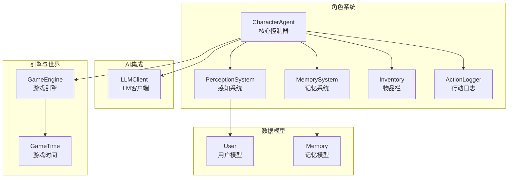
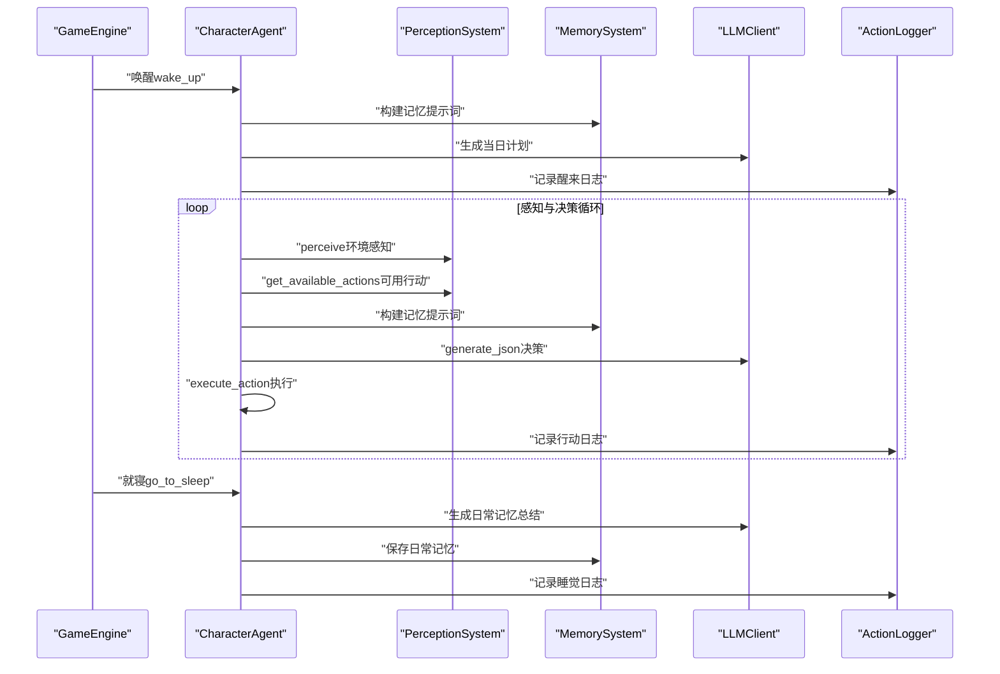
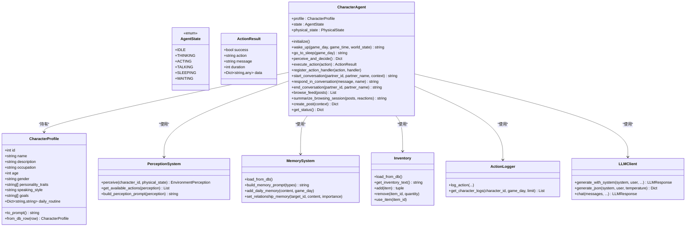
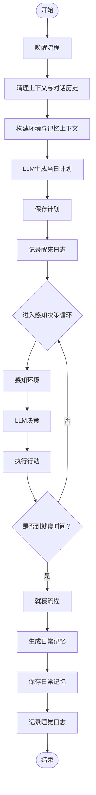
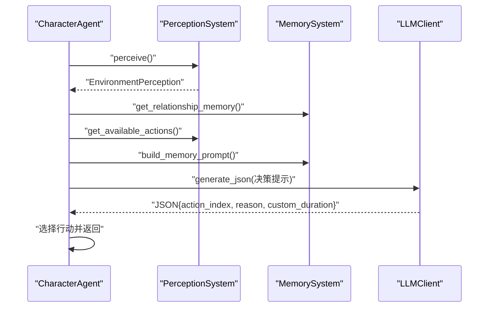
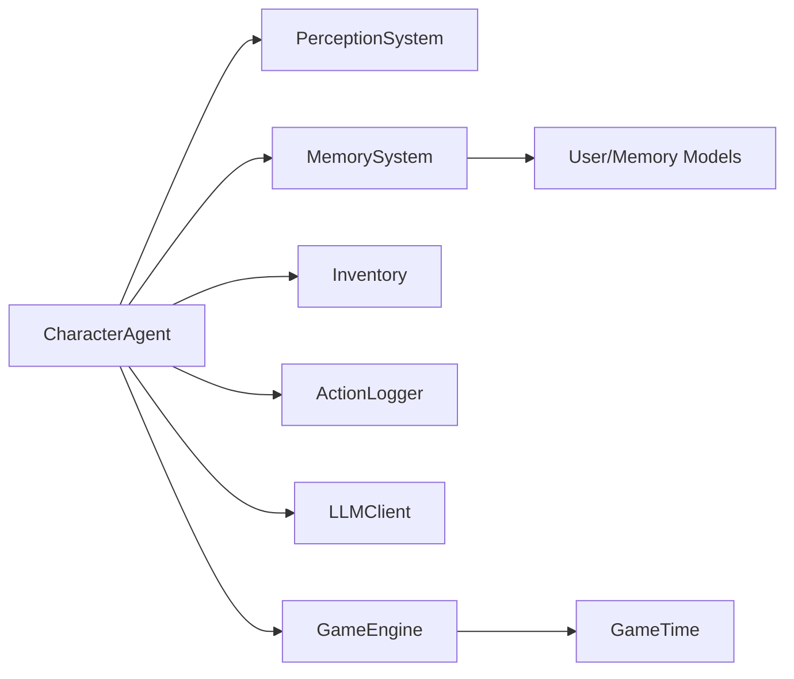

# 角色Agent核心

<cite>
**本文引用的文件**
- [agent.py](file://core_engine/character/agent.py)
- [perception.py](file://core_engine/character/perception.py)
- [memory.py](file://core_engine/character/memory.py)
- [inventory.py](file://core_engine/character/inventory.py)
- [action_logger.py](file://core_engine/character/action_logger.py)
- [llm_client.py](file://core_engine/ai_integration/llm_client.py)
- [engine.py](file://core_engine/engine.py)
- [models.py](file://api_server/models.py)
</cite>

## 目录
1. [简介](#简介)
2. [项目结构](#项目结构)
3. [核心组件](#核心组件)
4. [架构总览](#架构总览)
5. [详细组件分析](#详细组件分析)
6. [依赖关系分析](#依赖关系分析)
7. [性能考量](#性能考量)
8. [故障排查指南](#故障排查指南)
9. [结论](#结论)
10. [附录](#附录)

## 简介
本文件面向CharacterAgent核心控制器，系统化阐述其设计架构与实现细节，涵盖角色状态管理（AgentState枚举）、角色配置（CharacterProfile）、行动结果（ActionResult）的数据结构；角色初始化流程、系统提示词构建机制；每日流程管理（wake_up、go_to_sleep）；感知与决策循环（perceive_and_decide）的实现；行动执行机制（execute_action）与默认行动处理器；以及角色创建、状态切换与行为模拟的实践路径。文档同时提供关键流程的时序图与类图，帮助读者快速理解并高效使用该模块。

## 项目结构
- 核心角色系统位于 core_engine/character，包含：
  - agent.py：CharacterAgent核心控制器
  - perception.py：感知系统（环境感知、物理状态、可用行动）
  - memory.py：记忆系统（多种记忆类型与持久化）
  - inventory.py：物品栏系统（物品模板、堆叠、耐久）
  - action_logger.py：行动日志系统（记录与查询）
- AI集成位于 core_engine/ai_integration，包含：
  - llm_client.py：LLM客户端（OpenAI兼容接口）
- 引擎与世界状态位于 core_engine/engine.py
- 数据模型位于 api_server/models.py

图表来源
- [agent.py](file://core_engine/character/agent.py#L116-L170)
- [perception.py](file://core_engine/character/perception.py#L211-L304)
- [memory.py](file://core_engine/character/memory.py#L92-L167)
- [inventory.py](file://core_engine/character/inventory.py#L194-L227)
- [action_logger.py](file://core_engine/character/action_logger.py#L89-L120)
- [llm_client.py](file://core_engine/ai_integration/llm_client.py#L54-L105)
- [engine.py](file://core_engine/engine.py#L167-L206)
- [models.py](file://api_server/models.py#L35-L78)

章节来源
- [agent.py](file://core_engine/character/agent.py#L1-L120)
- [perception.py](file://core_engine/character/perception.py#L1-L50)
- [memory.py](file://core_engine/character/memory.py#L1-L50)
- [inventory.py](file://core_engine/character/inventory.py#L1-L50)
- [action_logger.py](file://core_engine/character/action_logger.py#L1-L50)
- [llm_client.py](file://core_engine/ai_integration/llm_client.py#L1-L50)
- [engine.py](file://core_engine/engine.py#L1-L50)
- [models.py](file://api_server/models.py#L1-L50)

## 核心组件
- AgentState：角色状态枚举，涵盖空闲、思考、执行、对话、睡眠、等待等状态，用于统一的状态流转与UI反馈。
- CharacterProfile：角色设定数据结构，包含基础信息、性格、说话风格、目标、日常作息等，并提供提示词转换能力。
- ActionResult：行动结果数据结构，包含成功标志、行动名、消息、耗时（分钟）、扩展数据等。
- CharacterAgent：核心控制器，整合感知、记忆、物品、日志、LLM与世界交互，负责每日流程、感知决策与行动执行。
- PerceptionSystem：环境感知与可用行动生成，结合物理状态、位置、天气、地点、角色与物品信息。
- MemorySystem：多类型记忆管理（共同、日常、重要、知识、关系），支持加载、保存、检索与上下文构建。
- Inventory：物品栏管理，支持堆叠、耐久、重量限制与物品模板。
- ActionLogger：行动日志记录与查询，支持按角色、类型、日期筛选。
- LLMClient：OpenAI兼容接口的异步LLM客户端，支持普通对话、流式输出与JSON解析。
- GameEngine/GameTime：时间推进与事件调度，驱动角色每日流程与行动时长。

章节来源
- [agent.py](file://core_engine/character/agent.py#L21-L114)
- [perception.py](file://core_engine/character/perception.py#L12-L22)
- [memory.py](file://core_engine/character/memory.py#L14-L52)
- [inventory.py](file://core_engine/character/inventory.py#L14-L50)
- [action_logger.py](file://core_engine/character/action_logger.py#L13-L30)
- [llm_client.py](file://core_engine/ai_integration/llm_client.py#L14-L53)
- [engine.py](file://core_engine/engine.py#L19-L110)

## 架构总览
CharacterAgent通过子系统协作实现“感知—决策—执行”的闭环：
- 初始化阶段：加载记忆与物品，确保拥有手机等基础道具。
- 每日流程：唤醒时生成当日计划，睡前汇总日常记忆。
- 感知与决策：基于感知系统与记忆构建提示词，调用LLM生成JSON格式的行动选择。
- 行动执行：优先调用注册的处理器，否则走默认处理器；记录日志与事件，消耗疲劳度。
- 对话系统：支持开启、回复与结束对话，自动更新关系记忆。
- 社交网络行为：浏览、点赞、评论、发帖等，生成浏览体验总结。

图表来源
- [agent.py](file://core_engine/character/agent.py#L181-L195)
- [agent.py](file://core_engine/character/agent.py#L225-L289)
- [agent.py](file://core_engine/character/agent.py#L358-L477)
- [agent.py](file://core_engine/character/agent.py#L479-L521)
- [agent.py](file://core_engine/character/agent.py#L311-L354)
- [perception.py](file://core_engine/character/perception.py#L226-L303)
- [memory.py](file://core_engine/character/memory.py#L464-L491)
- [llm_client.py](file://core_engine/ai_integration/llm_client.py#L253-L300)
- [action_logger.py](file://core_engine/character/action_logger.py#L103-L161)

## 详细组件分析

### 类与数据结构概览

图表来源
- [agent.py](file://core_engine/character/agent.py#L21-L114)
- [agent.py](file://core_engine/character/agent.py#L116-L170)
- [perception.py](file://core_engine/character/perception.py#L211-L304)
- [memory.py](file://core_engine/character/memory.py#L92-L167)
- [inventory.py](file://core_engine/character/inventory.py#L194-L227)
- [action_logger.py](file://core_engine/character/action_logger.py#L89-L120)
- [llm_client.py](file://core_engine/ai_integration/llm_client.py#L54-L105)

章节来源
- [agent.py](file://core_engine/character/agent.py#L21-L114)
- [perception.py](file://core_engine/character/perception.py#L211-L304)
- [memory.py](file://core_engine/character/memory.py#L92-L167)
- [inventory.py](file://core_engine/character/inventory.py#L194-L227)
- [action_logger.py](file://core_engine/character/action_logger.py#L89-L120)
- [llm_client.py](file://core_engine/ai_integration/llm_client.py#L54-L105)

### 角色状态管理（AgentState）
- 状态枚举：IDLE、THINKING、ACTING、TALKING、SLEEPING、WAITING。
- 控制要点：在关键流程（唤醒、思考、执行、对话、睡眠）前后切换状态，便于UI与事件调度感知。

章节来源
- [agent.py](file://core_engine/character/agent.py#L21-L29)

### 角色配置（CharacterProfile）
- 字段：id、name、description、occupation、age、gender、personality_traits、speaking_style、goals、daily_routine。
- 提示词构建：to_prompt()将角色设定格式化为系统提示词片段。
- 数据来源：from_db_row()从数据库User行解析角色设定，兼容多种字段形态。

章节来源
- [agent.py](file://core_engine/character/agent.py#L31-L103)
- [models.py](file://api_server/models.py#L35-L61)

### 行动结果（ActionResult）
- 字段：success、action、message、duration（分钟）、data。
- 用途：封装执行结果，便于日志记录与UI展示。

章节来源
- [agent.py](file://core_engine/character/agent.py#L106-L114)

### 初始化流程
- 加载记忆与物品栏。
- 确保拥有手机（若缺失则创建并加入）。
- 输出初始化完成日志。

章节来源
- [agent.py](file://core_engine/character/agent.py#L181-L195)
- [inventory.py](file://core_engine/character/inventory.py#L499-L514)

### 系统提示词构建机制
- _build_system_prompt(context)：组合角色设定、记忆片段与行为准则，形成系统提示词主体。
- 记忆提示词：build_memory_prompt()按类型拼接共同、重要、日常、知识与关系记忆。
- 上下文注入：在不同流程中注入环境、事件、计划与物品栏信息，增强LLM决策质量。

章节来源
- [agent.py](file://core_engine/character/agent.py#L196-L222)
- [memory.py](file://core_engine/character/memory.py#L464-L491)

### 每日流程管理
- 唤醒（wake_up）：清理上下文，恢复身体状态，构建环境与记忆上下文，调用LLM生成当日计划，记录醒来日志。
- 就寝（go_to_sleep）：汇总当日事件，生成日常记忆，保存至记忆系统，记录睡觉日志。

图表来源
- [agent.py](file://core_engine/character/agent.py#L225-L289)
- [agent.py](file://core_engine/character/agent.py#L311-L354)

章节来源
- [agent.py](file://core_engine/character/agent.py#L225-L289)
- [agent.py](file://core_engine/character/agent.py#L311-L354)

### 感知与决策循环（perceive_and_decide）
- 环境感知：PerceptionSystem.perceive()获取位置、天气、温度、附近角色与地点。
- 关系记忆填充：从MemorySystem获取关系摘要，丰富感知上下文。
- 可用行动识别：get_available_actions()根据环境与状态生成行动清单（含预估时长）。
- 决策提示词：整合最近行动、今日计划、今日事件、物品栏与可用行动，构建决策提示。
- LLM决策：generate_json()要求返回JSON，包含action_index、reason与可选custom_duration。
- 默认回退：当无有效选择时返回等待行动。

图表来源
- [agent.py](file://core_engine/character/agent.py#L358-L477)
- [perception.py](file://core_engine/character/perception.py#L395-L527)
- [memory.py](file://core_engine/character/memory.py#L464-L491)
- [llm_client.py](file://core_engine/ai_integration/llm_client.py#L253-L300)

章节来源
- [agent.py](file://core_engine/character/agent.py#L358-L477)
- [perception.py](file://core_engine/character/perception.py#L395-L527)

### 行动执行机制（execute_action）与默认处理器
- 注册处理器优先：若action_type已注册处理器，则调用异步处理器。
- 默认处理器：未注册时走_default_action_handler()，覆盖常见行动（等待、休息、观察、移动、浏览、发帖、查看私信、使用手机、主动发私信、查看他人主页等）。
- 日志记录：_log_action_result()映射行动类型到ActionType并记录。
- 疲劳消耗：根据行动时长按比例消耗疲劳度。

章节来源
- [agent.py](file://core_engine/character/agent.py#L479-L521)
- [agent.py](file://core_engine/character/agent.py#L574-L827)
- [action_logger.py](file://core_engine/character/action_logger.py#L523-L565)

### 对话系统
- 开始对话：start_conversation()构建关系记忆上下文，生成开场白。
- 对话回复：respond_in_conversation()将历史消息传入LLM生成回复。
- 结束对话：end_conversation()总结对话，更新关系记忆，记录事件。

章节来源
- [agent.py](file://core_engine/character/agent.py#L831-L957)

### 社交网络行为
- 浏览帖子：browse_feed()逐条生成反应（点赞/评论），返回反应列表。
- 总结浏览体验：summarize_browsing_session()生成1-2句总结，用于记录与后续决策。
- 发帖：create_post()生成符合角色性格的帖子内容。

章节来源
- [agent.py](file://core_engine/character/agent.py#L961-L1144)

### 角色创建、状态切换与行为模拟（实践路径）
- 角色创建与初始化
  - 通过AgentManager.create_agent()从数据库加载User并创建CharacterAgent，随后调用initialize()完成记忆与物品加载。
  - 示例路径：[AgentManager.create_agent](file://core_engine/character/agent.py#L1198-L1228)，[initialize](file://core_engine/character/agent.py#L181-L195)
- 状态切换
  - 在唤醒、思考、执行、对话、睡眠、等待之间切换，便于UI与事件系统感知。
  - 示例路径：[AgentState定义](file://core_engine/character/agent.py#L21-L29)
- 行为模拟
  - 调用perceive_and_decide()获取行动，再execute_action()执行。
  - 示例路径：[perceive_and_decide](file://core_engine/character/agent.py#L358-L477)，[execute_action](file://core_engine/character/agent.py#L479-L521)

章节来源
- [agent.py](file://core_engine/character/agent.py#L1198-L1228)
- [agent.py](file://core_engine/character/agent.py#L181-L195)
- [agent.py](file://core_engine/character/agent.py#L358-L477)
- [agent.py](file://core_engine/character/agent.py#L479-L521)

## 依赖关系分析
- CharacterAgent依赖：
  - PerceptionSystem：环境感知与可用行动生成
  - MemorySystem：记忆加载与提示词构建
  - Inventory：物品栏与物品模板
  - ActionLogger：行动日志记录
  - LLMClient：提示词构建与LLM调用
  - GameEngine/GameTime：时间推进与事件调度
  - api_server.models：数据库模型（User、Memory等）

图表来源
- [agent.py](file://core_engine/character/agent.py#L139-L144)
- [engine.py](file://core_engine/engine.py#L167-L206)
- [models.py](file://api_server/models.py#L35-L78)

章节来源
- [agent.py](file://core_engine/character/agent.py#L139-L144)
- [engine.py](file://core_engine/engine.py#L167-L206)
- [models.py](file://api_server/models.py#L35-L78)

## 性能考量
- LLM调用开销：每次感知决策与对话均涉及网络请求，建议合理设置temperature与max_tokens，避免过长响应。
- JSON解析：generate_json()对LLM输出进行严格解析，失败时返回None，需在调用侧做好容错。
- 疲劳与行动时长：执行行动会按duration消耗疲劳，避免过度连续行动导致角色状态恶化。
- 数据库访问：记忆与物品加载/保存涉及数据库IO，建议批量操作与事务提交，减少锁竞争。
- 并发与异步：LLMClient采用异步HTTP会话，注意连接池与超时配置，防止阻塞。

## 故障排查指南
- LLM连接失败
  - 症状：check_connection()返回False或generate_*报错。
  - 排查：确认本地LLM服务地址与端口配置，检查网络连通性。
  - 参考：[LLMClient.check_connection](file://core_engine/ai_integration/llm_client.py#L80-L92)
- JSON解析失败
  - 症状：generate_json()返回None，打印解析错误。
  - 排查：检查LLM输出是否包含JSON块标记，或是否严格遵循JSON格式要求。
  - 参考：[LLMClient.generate_json](file://core_engine/ai_integration/llm_client.py#L253-L299)
- 记忆/物品加载异常
  - 症状：加载失败或数据不一致。
  - 排查：确认数据库连接与模型字段映射，检查MemoryType与数据库字段差异（如relationship/relation）。
  - 参考：[MemorySystem.load_from_db](file://core_engine/character/memory.py#L119-L167)，[models.MemoryType](file://api_server/models.py#L8-L14)
- 行动日志记录失败
  - 症状：日志未写入或抛出异常。
  - 排查：检查数据库会话状态与事务提交，确认ActionLog表结构。
  - 参考：[ActionLogger.log_action](file://core_engine/character/action_logger.py#L103-L161)

章节来源
- [llm_client.py](file://core_engine/ai_integration/llm_client.py#L80-L92)
- [llm_client.py](file://core_engine/ai_integration/llm_client.py#L253-L299)
- [memory.py](file://core_engine/character/memory.py#L119-L167)
- [models.py](file://api_server/models.py#L8-L14)
- [action_logger.py](file://core_engine/character/action_logger.py#L103-L161)

## 结论
CharacterAgent通过清晰的职责划分与模块化设计，实现了从感知、记忆、社交到执行的完整闭环。其状态机、提示词构建、行动日志与默认处理器共同保证了行为的可控性与可观测性。建议在实际部署中关注LLM连接稳定性、JSON解析一致性与数据库性能，以获得更稳定的运行效果。

## 附录
- 术语
  - AgentState：角色状态枚举
  - CharacterProfile：角色设定数据结构
  - ActionResult：行动结果数据结构
  - PerceptionSystem：环境感知与可用行动生成
  - MemorySystem：记忆系统
  - Inventory：物品栏系统
  - ActionLogger：行动日志系统
  - LLMClient：LLM客户端
  - GameEngine/GameTime：时间推进与事件调度