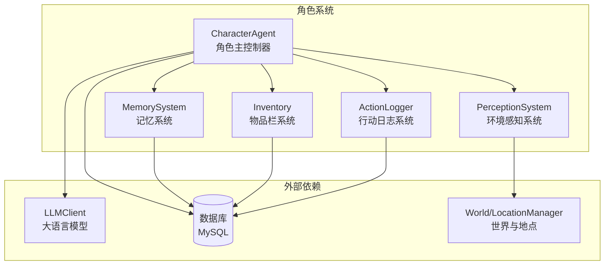
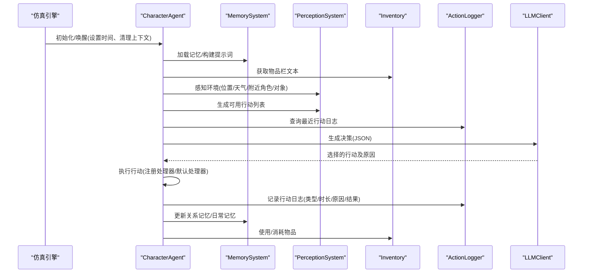
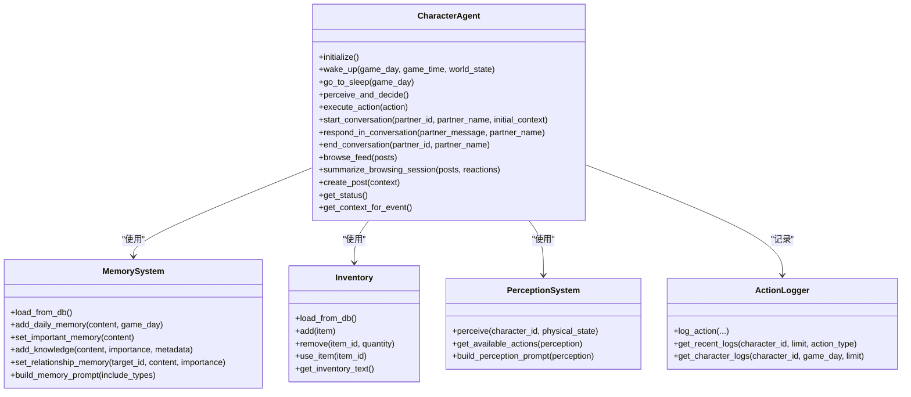
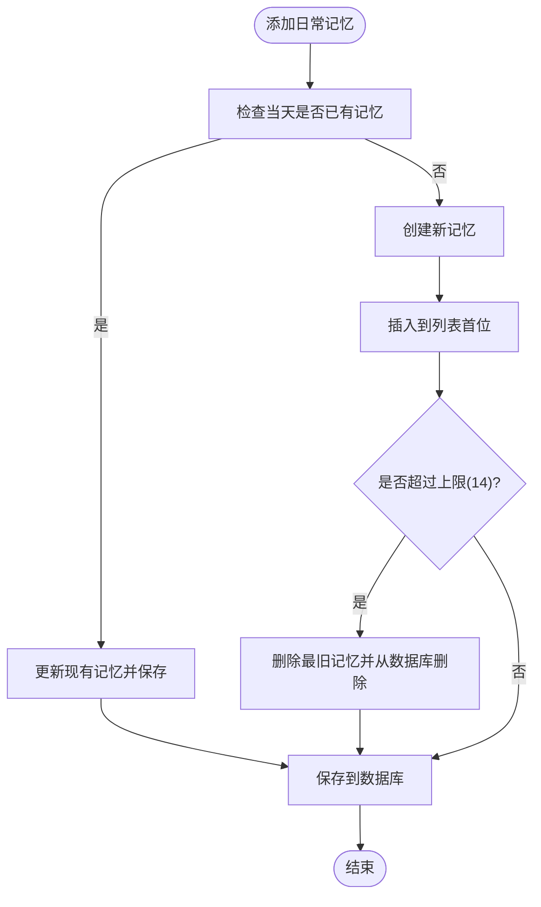
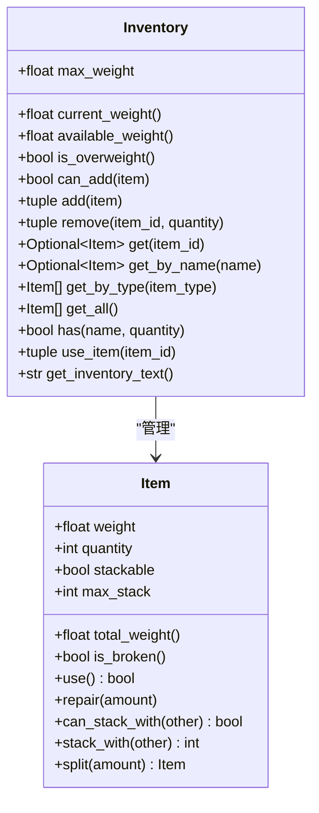
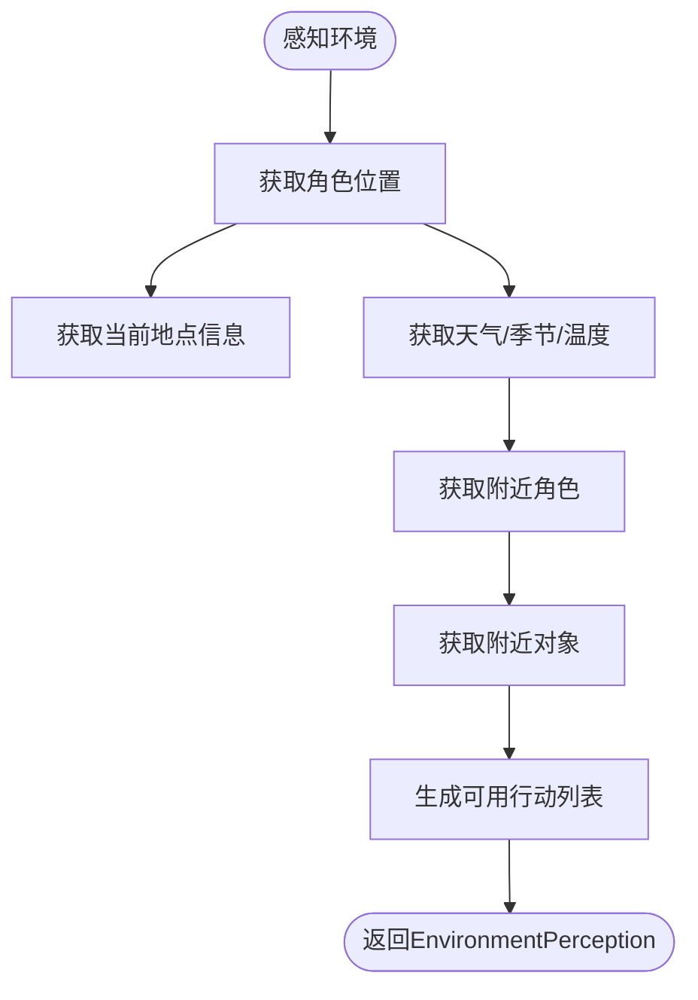
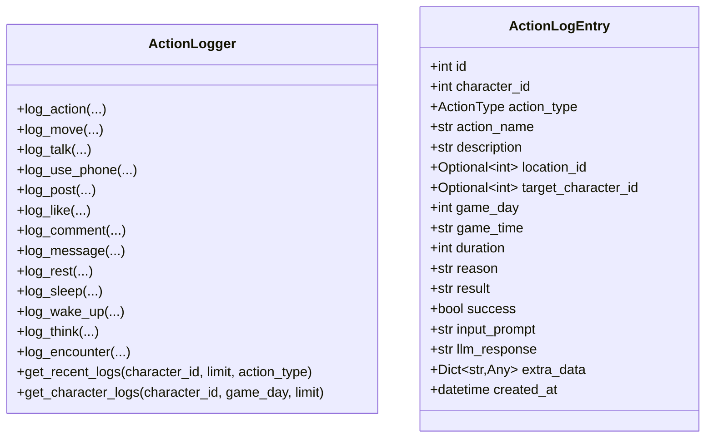
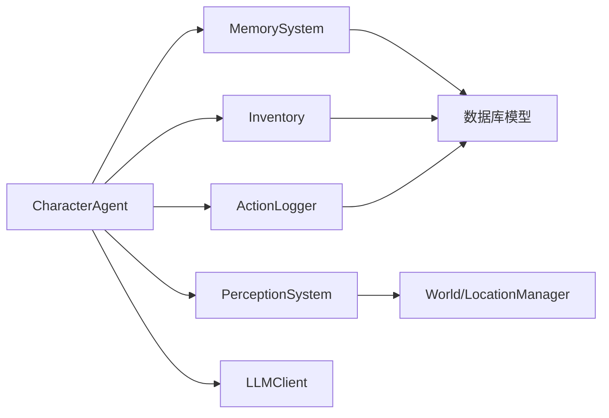

# 角色系统

<cite>
**本文引用的文件**
- [agent.py](file://core_engine/character/agent.py)
- [memory.py](file://core_engine/character/memory.py)
- [inventory.py](file://core_engine/character/inventory.py)
- [perception.py](file://core_engine/character/perception.py)
- [action_logger.py](file://core_engine/character/action_logger.py)
- [config.py](file://shared/config.py)
- [models.py](file://api_server/models.py)
- [001_init.sql](file://data/migrations/001_init.sql)
- [002_action_logs.sql](file://data/migrations/002_action_logs.sql)
</cite>

## 目录
1. [简介](#简介)
2. [项目结构](#项目结构)
3. [核心组件](#核心组件)
4. [架构总览](#架构总览)
5. [详细组件分析](#详细组件分析)
6. [依赖关系分析](#依赖关系分析)
7. [性能考量](#性能考量)
8. [故障排查指南](#故障排查指南)
9. [结论](#结论)
10. [附录](#附录)

## 简介
本文件面向AI角色系统，围绕CharacterAgent类展开，系统性阐述其状态管理、行为决策流程与行动执行机制；同时深入解析记忆系统（MemorySystem）的多类型记忆与持久化策略、物品栏系统（Inventory）的物品管理与负重计算、环境感知系统（PerceptionSystem）的环境信息采集与可用行动识别、以及行动日志系统（ActionLogger）的记录与历史追踪。最后提供角色创建、行为模拟与交互的实践示例路径，帮助开发者快速理解与扩展该系统。

## 项目结构
角色系统位于core_engine/character目录，采用“按功能域划分”的模块化组织方式：
- agent.py：角色主控制器，整合记忆、感知、决策、对话、社交等能力
- memory.py：记忆系统，支持共同记忆、日常记忆、重要记忆、知识记忆、关系记忆
- inventory.py：物品栏系统，支持物品增删改查、堆叠、耐久、负重
- perception.py：环境感知系统，负责物理状态、位置、天气、附近角色与对象
- action_logger.py：行动日志系统，记录每次行动的类型、描述、时长、原因、结果等

此外，数据库模型与迁移脚本位于api_server/models.py与data/migrations目录，支撑角色、记忆、物品、日志等数据持久化。

图表来源
- [agent.py](file://core_engine/character/agent.py#L116-L170)
- [memory.py](file://core_engine/character/memory.py#L92-L118)
- [inventory.py](file://core_engine/character/inventory.py#L194-L208)
- [perception.py](file://core_engine/character/perception.py#L211-L225)
- [action_logger.py](file://core_engine/character/action_logger.py#L89-L98)

章节来源
- [agent.py](file://core_engine/character/agent.py#L116-L170)
- [memory.py](file://core_engine/character/memory.py#L92-L118)
- [inventory.py](file://core_engine/character/inventory.py#L194-L208)
- [perception.py](file://core_engine/character/perception.py#L211-L225)
- [action_logger.py](file://core_engine/character/action_logger.py#L89-L98)

## 核心组件
- CharacterAgent：角色主控制器，负责状态机、每日流程、感知-决策-执行循环、对话与社交行为、注册自定义行动处理器。
- MemorySystem：多类型记忆管理，支持加载/保存、限制控制、检索与提示词构建。
- Inventory：物品栏管理，支持堆叠、耐久、负重、使用逻辑。
- PerceptionSystem：环境感知，提供位置、天气、附近角色与对象、可用行动集合。
- ActionLogger：行动日志记录，支持类型分类、查询与展示。

章节来源
- [agent.py](file://core_engine/character/agent.py#L116-L170)
- [memory.py](file://core_engine/character/memory.py#L92-L118)
- [inventory.py](file://core_engine/character/inventory.py#L194-L208)
- [perception.py](file://core_engine/character/perception.py#L211-L225)
- [action_logger.py](file://core_engine/character/action_logger.py#L89-L98)

## 架构总览
角色系统以CharacterAgent为核心，通过子系统协作完成从感知到决策再到执行的闭环。Agent在每日流程中唤醒、制定计划、睡眠时总结日常记忆；在运行时周期性感知环境、结合记忆与物品栏、基于可用行动与最近日志进行决策，最终执行行动并记录日志。

图表来源
- [agent.py](file://core_engine/character/agent.py#L225-L289)
- [agent.py](file://core_engine/character/agent.py#L358-L477)
- [agent.py](file://core_engine/character/agent.py#L479-L521)
- [memory.py](file://core_engine/character/memory.py#L446-L491)
- [perception.py](file://core_engine/character/perception.py#L395-L527)
- [action_logger.py](file://core_engine/character/action_logger.py#L103-L160)

## 详细组件分析

### CharacterAgent 类设计与流程
- 状态管理：AgentState枚举涵盖空闲、思考、执行、对话、睡眠、等待等状态，贯穿每日流程与行动执行。
- 角色档案：CharacterProfile封装角色设定（姓名、年龄、职业、个性、说话风格、目标、日常作息），支持从数据库行解析与提示词构建。
- 每日流程：
  - 醒来：清理上下文、恢复疲劳、构建环境上下文、生成当日计划、记录醒来日志。
  - 睡觉：汇总当日事件、生成日常记忆、记录睡觉日志。
- 决策流程：
  - 环境感知：调用PerceptionSystem获取位置、天气、附近角色与对象、物理状态。
  - 填充关系记忆摘要：从MemorySystem获取关系记忆并注入感知结果。
  - 可用行动：调用PerceptionSystem生成可用行动列表（含移动、对话、使用手机、社交等）。
  - 决策输入：拼装最近行动日志、今日计划、今日事件、物品栏、可用行动等，调用LLM生成JSON格式的行动选择。
- 行动执行：
  - 注册处理器优先：若注册了对应action的处理器，则调用；否则走默认处理器。
  - 默认处理器覆盖常见行动：等待、休息、观察、移动、浏览帖子、发帖、查看私信、使用手机、主动发私信、查看他人主页等。
  - 记录日志：映射行动类型到ActionLogger，记录时长、原因、结果、输入输出等。
  - 疲劳消耗：根据行动时长按比例消耗疲劳值。
- 对话系统：
  - 开始对话：清理历史、构建关系记忆上下文，生成开场白。
  - 对话回复：追加历史消息，调用LLM生成回复。
  - 结束对话：总结对话内容，必要时更新关系记忆。
- 社交网络行为：
  - 浏览Feed：对每条帖子决定点赞/评论，汇总反应。
  - 总结浏览体验：生成1-2句总结，用于today_events与日志记录。
  - 发帖：根据上下文生成帖子内容。
- 状态查询：提供get_status与get_context_for_event，便于事件处理与监控。

图表来源
- [agent.py](file://core_engine/character/agent.py#L116-L170)
- [memory.py](file://core_engine/character/memory.py#L92-L118)
- [inventory.py](file://core_engine/character/inventory.py#L194-L208)
- [perception.py](file://core_engine/character/perception.py#L211-L225)
- [action_logger.py](file://core_engine/character/action_logger.py#L89-L98)

章节来源
- [agent.py](file://core_engine/character/agent.py#L116-L170)
- [agent.py](file://core_engine/character/agent.py#L225-L289)
- [agent.py](file://core_engine/character/agent.py#L358-L477)
- [agent.py](file://core_engine/character/agent.py#L479-L521)
- [agent.py](file://core_engine/character/agent.py#L829-L958)
- [agent.py](file://core_engine/character/agent.py#L959-L1144)

### 记忆系统（MemorySystem）
- 记忆类型：COMMON（共同记忆）、DAILY（日常记忆，最多14条）、IMPORTANT（重要记忆，最长1000字符）、KNOWLEDGE（知识记忆，最多50条）、RELATIONSHIP（关系记忆，每目标仅一条）。
- 数据结构：Memory数据类包含类型、内容、角色ID、目标ID、时间、重要度、元数据等；MemorySystem内部以列表/字典缓存各类型记忆。
- 加载与持久化：从数据库加载时适配字段差异（如memory_type的“relation”与“relationship”），保存时转换为数据库字段；删除时同步清理。
- 限制策略：
  - 日常记忆：超过上限自动删除最旧条目。
  - 重要记忆：长度限制，超出则截断。
  - 知识记忆：超过上限按重要度淘汰最低者。
  - 关系记忆：同一目标仅保留一条。
- 提示词构建：build_memory_prompt按需组合COMMON、IMPORTANT、DAILY、KNOWLEDGE等片段，供LLM决策使用；get_daily_memory_text用于每日总结。

图表来源
- [memory.py](file://core_engine/character/memory.py#L265-L297)

章节来源
- [memory.py](file://core_engine/character/memory.py#L14-L66)
- [memory.py](file://core_engine/character/memory.py#L92-L118)
- [memory.py](file://core_engine/character/memory.py#L119-L250)
- [memory.py](file://core_engine/character/memory.py#L265-L346)
- [memory.py](file://core_engine/character/memory.py#L365-L424)
- [memory.py](file://core_engine/character/memory.py#L446-L491)

### 物品栏系统（Inventory）
- 物品类型：TOOL、FOOD、MATERIAL、PHOTO、DOCUMENT、GIFT、CURRENCY、EQUIPMENT、MISC。
- 物品属性：名称、类型、重量、数量、堆叠性、最大堆叠、描述、价值、耐久度、元数据、获得时间。
- 负重与可用空间：current_weight、available_weight、is_overweight；can_add用于判断是否可添加。
- 堆叠与分割：支持同类同型物品堆叠、分割物品；使用物品时按类型处理消耗与耐久。
- 持久化：从数据库加载时解析properties JSON，保存时序列化为JSON；删除时同步清理。
- 常用模板：ItemTemplates提供照片、手机、食物、货币等常用模板。

图表来源
- [inventory.py](file://core_engine/character/inventory.py#L27-L171)
- [inventory.py](file://core_engine/character/inventory.py#L194-L208)
- [inventory.py](file://core_engine/character/inventory.py#L309-L357)
- [inventory.py](file://core_engine/character/inventory.py#L416-L439)
- [inventory.py](file://core_engine/character/inventory.py#L478-L547)

章节来源
- [inventory.py](file://core_engine/character/inventory.py#L14-L66)
- [inventory.py](file://core_engine/character/inventory.py#L194-L208)
- [inventory.py](file://core_engine/character/inventory.py#L209-L308)
- [inventory.py](file://core_engine/character/inventory.py#L309-L357)
- [inventory.py](file://core_engine/character/inventory.py#L359-L439)
- [inventory.py](file://core_engine/character/inventory.py#L441-L473)
- [inventory.py](file://core_engine/character/inventory.py#L478-L547)

### 环境感知系统（PerceptionSystem）
- 物理状态：PhysicalState包含疲劳、饥饿、健康、情绪，提供阈值与描述；随行动变化。
- 环境感知：EnvironmentPerception包含位置、天气、季节、温度、附近角色、附近对象、附近地点、物理状态。
- 感知流程：从世界获取位置与周边角色/地点，填充天气与温度；构建感知文本与可用行动列表。
- 可用行动：基础行动（等待、观察）、移动（按距离估算步行时长）、社交（对话、打招呼）、物品交互、休息/睡觉（依据疲劳度）、室内社交（浏览、发帖、查看私信、主动发私信、查看主页）。

图表来源
- [perception.py](file://core_engine/character/perception.py#L226-L303)
- [perception.py](file://core_engine/character/perception.py#L395-L527)

章节来源
- [perception.py](file://core_engine/character/perception.py#L24-L124)
- [perception.py](file://core_engine/character/perception.py#L126-L209)
- [perception.py](file://core_engine/character/perception.py#L211-L303)
- [perception.py](file://core_engine/character/perception.py#L320-L393)
- [perception.py](file://core_engine/character/perception.py#L395-L527)

### 行动日志系统（ActionLogger）
- 行动类型：MOVE、TALK、USE_PHONE、POST、LIKE、COMMENT、MESSAGE、REST、SLEEP、WAKE_UP、EAT、WORK、THINK、ENCOUNTER、OTHER。
- 日志条目：ActionLogEntry包含角色ID、行动类型、名称、描述、地点ID、目标角色ID、游戏天/时间、时长、原因、结果、成功与否、输入输出Prompt、额外数据、创建时间等。
- 记录接口：log_action通用记录；log_move、log_talk、log_use_phone、log_post、log_like、log_comment、log_message、log_rest、log_sleep、log_wake_up、log_think、log_encounter等便捷方法。
- 查询接口：get_recent_logs按时间倒序获取；get_character_logs按角色与游戏日筛选。

图表来源
- [action_logger.py](file://core_engine/character/action_logger.py#L89-L98)
- [action_logger.py](file://core_engine/character/action_logger.py#L103-L160)
- [action_logger.py](file://core_engine/character/action_logger.py#L336-L466)

章节来源
- [action_logger.py](file://core_engine/character/action_logger.py#L13-L30)
- [action_logger.py](file://core_engine/character/action_logger.py#L32-L87)
- [action_logger.py](file://core_engine/character/action_logger.py#L89-L98)
- [action_logger.py](file://core_engine/character/action_logger.py#L103-L160)
- [action_logger.py](file://core_engine/character/action_logger.py#L336-L466)

## 依赖关系分析
- 组件耦合：
  - CharacterAgent高度内聚，依赖MemorySystem、Inventory、PerceptionSystem、ActionLogger与LLMClient。
  - PerceptionSystem依赖World/LocationManager与数据库（查询用户信息）。
  - MemorySystem、Inventory、ActionLogger均依赖数据库模型与会话。
- 外部依赖：
  - LLMClient：用于生成系统提示词、JSON决策、对话回复、浏览总结等。
  - 数据库：users、memories、inventory、action_logs、locations等表支撑角色、记忆、物品、日志、地点等数据。
- 循环依赖：未发现直接循环依赖；各模块职责清晰，通过接口与数据类传递信息。

图表来源
- [agent.py](file://core_engine/character/agent.py#L116-L170)
- [perception.py](file://core_engine/character/perception.py#L211-L225)
- [models.py](file://api_server/models.py#L63-L77)
- [models.py](file://api_server/models.py#L220-L232)
- [models.py](file://api_server/models.py#L254-L292)

章节来源
- [agent.py](file://core_engine/character/agent.py#L116-L170)
- [perception.py](file://core_engine/character/perception.py#L211-L225)
- [models.py](file://api_server/models.py#L63-L77)
- [models.py](file://api_server/models.py#L220-L232)
- [models.py](file://api_server/models.py#L254-L292)

## 性能考量
- 记忆系统：
  - 日常记忆与知识记忆设置上限，避免无限增长导致查询与序列化开销上升。
  - 重要记忆长度限制，防止单条过大影响提示词构建与LLM成本。
- 物品栏系统：
  - 堆叠与分割减少物品数量，降低数据库写入与查询压力。
  - 负重限制避免过度物品占用资源。
- 感知系统：
  - 限制附近角色/地点/对象的数量与距离估算，减少不必要的数据库查询。
- 日志系统：
  - 按角色与时间索引优化查询；限制返回条数避免大量数据传输。
- LLM调用：
  - 控制提示词长度与JSON输出，合理设置温度与token上限，平衡质量与成本。

## 故障排查指南
- 数据库连接问题：
  - 检查配置文件与环境变量，确认数据库URL正确；确保数据库服务运行且账号权限足够。
- 记忆/物品/日志加载失败：
  - 确认数据库表存在且字段一致；检查迁移脚本是否执行；关注字段映射（如memory_type的“relation”与“relationship”差异）。
- 行动日志记录异常：
  - 捕获异常并回滚事务；检查字段类型与长度限制；确认外键关联有效。
- 物品栏超重：
  - 检查max_weight与当前重量计算；确认堆叠逻辑与分割逻辑正常。
- 感知结果异常：
  - 检查世界位置与地点管理器是否正确；确认天气/季节/温度来源；核对附近角色/对象查询范围。

章节来源
- [config.py](file://shared/config.py#L40-L46)
- [001_init.sql](file://data/migrations/001_init.sql#L30-L43)
- [002_action_logs.sql](file://data/migrations/002_action_logs.sql#L7-L43)
- [action_logger.py](file://core_engine/character/action_logger.py#L127-L160)

## 结论
该角色系统以CharacterAgent为核心，通过记忆、感知、物品、日志四大子系统协同，实现了从环境感知到决策执行再到历史追踪的完整闭环。系统具备良好的模块化与可扩展性，支持注册自定义行动处理器、灵活的社交行为与对话流程、完善的记忆与物品持久化策略。建议在生产环境中进一步完善错误处理、性能监控与数据一致性校验，持续优化LLM提示词与行动策略以提升角色行为的真实感与连贯性。

## 附录

### 角色创建与初始化
- 通过AgentManager创建或获取Agent，从数据库加载角色档案并初始化子系统。
- 初始化时加载记忆与物品栏，确保角色拥有手机等基础物品。

章节来源
- [agent.py](file://core_engine/character/agent.py#L1175-L1228)

### 行为模拟与交互示例
- 每日流程：调用wakeup生成计划，go_to_sleep生成日常记忆并记录日志。
- 决策与执行：perceive_and_decide生成可用行动，execute_action执行并记录日志。
- 对话：start_conversation、respond_in_conversation、end_conversation形成完整对话链路。
- 社交：browse_feed、summarize_browsing_session、create_post完成社交行为闭环。

章节来源
- [agent.py](file://core_engine/character/agent.py#L225-L289)
- [agent.py](file://core_engine/character/agent.py#L358-L477)
- [agent.py](file://core_engine/character/agent.py#L479-L521)
- [agent.py](file://core_engine/character/agent.py#L829-L958)
- [agent.py](file://core_engine/character/agent.py#L959-L1144)