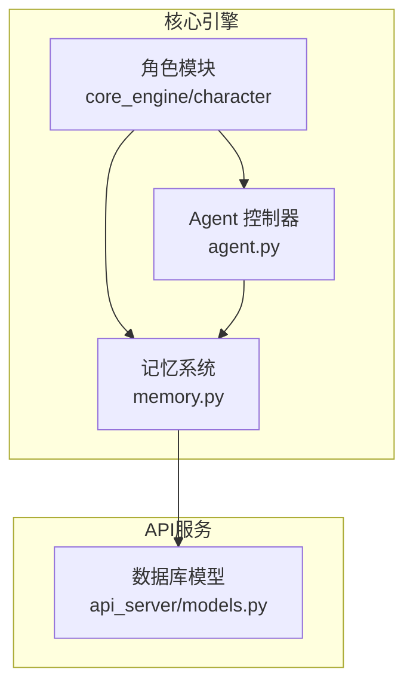
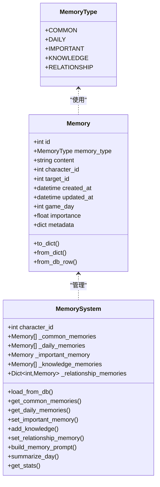
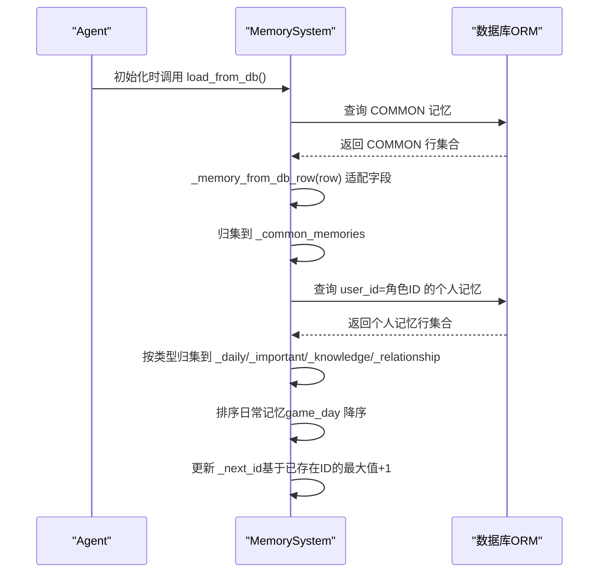
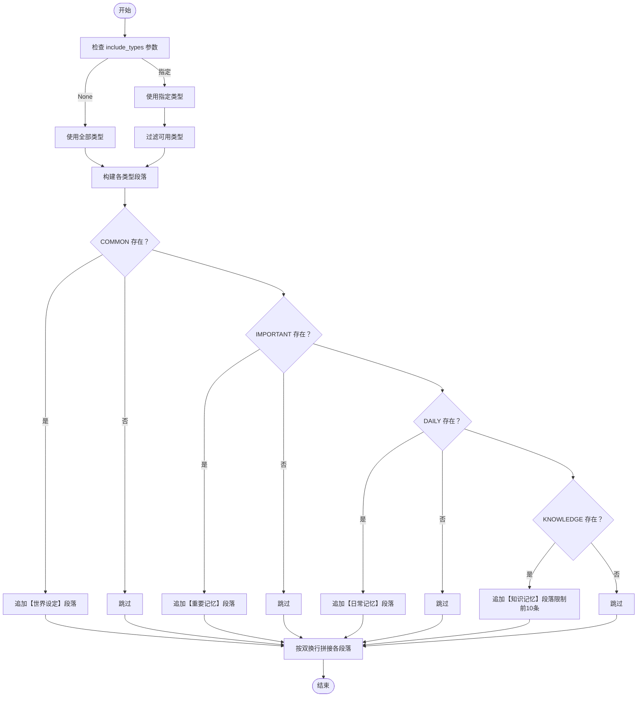
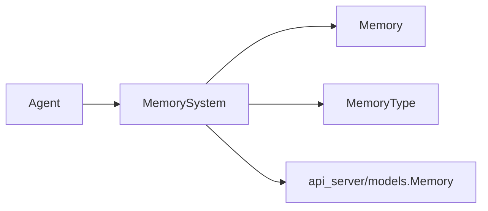

# 记忆系统

<cite>
**本文档引用的文件**
- [memory.py](file://core_engine/character/memory.py)
- [models.py](file://api_server/models.py)
- [__init__.py](file://core_engine/character/__init__.py)
- [agent.py](file://core_engine/character/agent.py)
- [test_social.py](file://test_social.py)
</cite>

## 目录
1. [简介](#简介)
2. [项目结构](#项目结构)
3. [核心组件](#核心组件)
4. [架构总览](#架构总览)
5. [详细组件分析](#详细组件分析)
6. [依赖分析](#依赖分析)
7. [性能考虑](#性能考虑)
8. [故障排查指南](#故障排查指南)
9. [结论](#结论)
10. [附录](#附录)

## 简介
本文件面向“记忆系统”的技术文档，聚焦于 MemorySystem 类的设计与实现，涵盖记忆类型（MemoryType 枚举）的分类与存储策略，以及短期记忆、长期记忆、日常记忆、关系记忆的管理机制。文档还详细说明了记忆持久化策略、检索算法、更新机制、提示词构建（build_memory_prompt）、加载与保存流程、清理与过期处理，并提供创建、查询与管理的具体使用示例路径。

## 项目结构
记忆系统位于核心引擎的角色模块中，与数据库模型紧密耦合，通过 SQLAlchemy ORM 映射到数据库表。Agent 初始化时会加载该角色的记忆，以便在后续推理与行动中使用。

图表来源
- [memory.py](file://core_engine/character/memory.py#L92-L118)
- [models.py](file://api_server/models.py#L63-L78)
- [agent.py](file://core_engine/character/agent.py#L140-L184)

章节来源
- [memory.py](file://core_engine/character/memory.py#L1-L525)
- [models.py](file://api_server/models.py#L1-L293)
- [__init__.py](file://core_engine/character/__init__.py#L1-L18)
- [agent.py](file://core_engine/character/agent.py#L1-L200)

## 核心组件
- MemoryType：定义记忆类型的枚举，包括 COMMON、DAILY、IMPORTANT、KNOWLEDGE、RELATIONSHIP。
- Memory：记忆单元的数据结构，包含类型、内容、所属角色、目标角色、时间戳、重要度与元数据。
- MemorySystem：记忆系统主类，负责加载、保存、检索、更新与统计各类记忆，并提供提示词构建与每日总结能力。

章节来源
- [memory.py](file://core_engine/character/memory.py#L14-L90)
- [memory.py](file://core_engine/character/memory.py#L92-L525)

## 架构总览
记忆系统采用“内存缓存 + 数据库持久化”的双层架构：
- 内存缓存：以列表、字典等结构在进程内维护各类记忆，便于快速读写与排序。
- 数据库持久化：通过 ORM 将记忆映射到 memories 表，支持跨会话恢复与共享记忆（COMMON）。

图表来源
- [memory.py](file://core_engine/character/memory.py#L14-L90)
- [memory.py](file://core_engine/character/memory.py#L92-L525)

## 详细组件分析

### MemoryType 枚举与存储策略
- COMMON：共享记忆，所有 AI 角色共享的世界设定。数据库中通过 user_id 特殊值或 NULL 表示。
- DAILY：每日记忆，按游戏天数排序，最多保留固定数量，超出则删除最旧项。
- IMPORTANT：重要记忆，单条长文本，限制最大长度，适合存放关键背景信息。
- KNOWLEDGE：知识记忆，可带重要度与元数据，超过上限时按重要度淘汰。
- RELATIONSHIP：关系记忆，针对特定目标角色的一条记忆，每个目标仅保留一条。

章节来源
- [memory.py](file://core_engine/character/memory.py#L14-L21)
- [models.py](file://api_server/models.py#L8-L14)

### Memory 数据结构
- 字段设计：包含基础标识、类型、内容、角色归属、目标角色、时间戳、重要度与元数据。
- 序列化：提供 to_dict/from_dict/from_db_row，支持内存与数据库之间的转换。
- 兼容性：数据库字段与内存字段存在差异（如 user_id/target_user_id、updated_at/metadata），系统在加载/保存时进行适配。

章节来源
- [memory.py](file://core_engine/character/memory.py#L23-L90)

### MemorySystem 主要能力

#### 加载与保存
- load_from_db：从数据库加载 COMMON 与个人记忆，按类型归集到内存缓存，并按游戏天数排序日常记忆，同步 ID 计数器。
- _save_to_db/_delete_from_db：保存或删除记忆，处理数据库字段差异（如 memory_type 的 relation/relationship 映射、importance 的 1-10 到 0-1 转换）。

图表来源
- [memory.py](file://core_engine/character/memory.py#L119-L167)
- [memory.py](file://core_engine/character/memory.py#L168-L198)
- [memory.py](file://core_engine/character/memory.py#L206-L249)

章节来源
- [memory.py](file://core_engine/character/memory.py#L119-L167)
- [memory.py](file://core_engine/character/memory.py#L168-L198)
- [memory.py](file://core_engine/character/memory.py#L206-L249)

#### 日常记忆（DAILY）
- 添加：若当日已有记忆则更新，否则新建并插入到最前；超出上限时删除最旧项并同步删除数据库记录。
- 查询：按最近天数优先返回，支持限制数量。
- 文本化：按“第N天”格式拼接输出。

章节来源
- [memory.py](file://core_engine/character/memory.py#L265-L311)

#### 重要记忆（IMPORTANT）
- 设置：若超出长度限制则截断；支持追加内容但受长度限制。
- 查询：提供文本与对象访问接口。

章节来源
- [memory.py](file://core_engine/character/memory.py#L315-L362)

#### 知识记忆（KNOWLEDGE）
- 添加：支持指定重要度与元数据；超过上限时按重要度升序淘汰最低者。
- 搜索：按关键词大小写不敏感匹配内容。

章节来源
- [memory.py](file://core_engine/character/memory.py#L365-L397)

#### 关系记忆（RELATIONSHIP）
- 设置：每个目标角色仅保留一条关系记忆；更新时同时更新重要度。
- 查询：按目标角色 ID 获取或返回全部关系记忆。
- 文本化：可选包含目标名称的格式化输出。

章节来源
- [memory.py](file://core_engine/character/memory.py#L400-L443)

#### 提示词构建（build_memory_prompt）
- 功能：根据传入的记忆类型集合，将各类记忆文本按固定标题格式拼接，形成统一的提示词块。
- 过滤与排序：COMMON/DAILY/IMPORTANT/KNOWLEDGE 分别按是否存在与数量限制进行过滤与排序；RELATIONSHIP 按字典值拼接。
- 使用场景：用于 LLM 推理时作为上下文输入的一部分。

图表来源
- [memory.py](file://core_engine/character/memory.py#L464-L491)

章节来源
- [memory.py](file://core_engine/character/memory.py#L464-L491)

#### 统计与上下文
- get_all_memories_for_context：将各类记忆文本汇总为字典，便于构建完整上下文。
- get_stats：返回当前角色记忆的统计信息（数量、长度等）。

章节来源
- [memory.py](file://core_engine/character/memory.py#L446-L462)
- [memory.py](file://core_engine/character/memory.py#L514-L525)

#### 每日总结
- summarize_day：将当天事件列表简化为一条日常记忆摘要，便于自动记录。

章节来源
- [memory.py](file://core_engine/character/memory.py#L493-L512)

## 依赖分析
- 内部依赖
  - MemorySystem 依赖 MemoryType/Memory 数据结构。
  - Agent 初始化时注入 MemorySystem，用于加载与使用记忆。
- 外部依赖
  - 数据库 ORM：通过 api_server/models.py 中的 Memory 模型与数据库表映射。
  - LLM 客户端：Agent 使用 LLM 生成日常总结等文本（在外部模块中）。

图表来源
- [agent.py](file://core_engine/character/agent.py#L140-L184)
- [memory.py](file://core_engine/character/memory.py#L92-L118)
- [models.py](file://api_server/models.py#L63-L78)

章节来源
- [agent.py](file://core_engine/character/agent.py#L116-L195)
- [memory.py](file://core_engine/character/memory.py#L92-L118)
- [models.py](file://api_server/models.py#L63-L78)

## 性能考虑
- 内存缓存命中：日常记忆按 game_day 排序，查询与更新均在内存中进行，避免频繁数据库 IO。
- 批量操作：批量加载时一次性查询并归集，减少多次往返。
- 上限控制：DAILY/IMPORTANT/KNOWLEDGE/RELATIONSHIP 均有明确上限，防止无限增长导致内存与存储压力。
- 字段适配：在 _memory_from_db_row 与 _save_to_db 中进行字段映射与类型转换，避免重复转换开销。

## 故障排查指南
- 加载失败
  - 症状：初始化后记忆为空。
  - 排查：确认 db_session 是否正确传入；检查数据库连接与表结构。
- 字段不一致
  - 症状：memory_type 为 relation 或 importance 范围异常。
  - 排查：检查 _memory_from_db_row 与 _save_to_db 的映射逻辑；确认数据库迁移是否完成。
- 记忆丢失
  - 症状：新增记忆未持久化。
  - 排查：确认 _save_to_db 是否被调用；检查事务提交与异常捕获。
- 重复关系记忆
  - 症状：同一目标出现多条关系记忆。
  - 排查：确认 set_relationship_memory 的键冲突逻辑是否生效。

章节来源
- [memory.py](file://core_engine/character/memory.py#L168-L198)
- [memory.py](file://core_engine/character/memory.py#L206-L249)
- [memory.py](file://core_engine/character/memory.py#L400-L424)

## 结论
记忆系统通过清晰的类型划分与严格的上限控制，实现了短期、长期、关系与共享记忆的统一管理。其“内存缓存 + 数据库持久化”的架构兼顾性能与可靠性，配合提示词构建与统计接口，为 Agent 的推理与行动提供了稳定的上下文支撑。

## 附录

### 使用示例（代码片段路径）
- 创建与初始化
  - Agent 初始化时加载记忆：[agent.py](file://core_engine/character/agent.py#L181-L195)
- 日常记忆
  - 添加日常记忆：[memory.py](file://core_engine/character/memory.py#L265-L297)
  - 获取日常记忆文本：[memory.py](file://core_engine/character/memory.py#L303-L311)
- 重要记忆
  - 设置重要记忆：[memory.py](file://core_engine/character/memory.py#L315-L337)
  - 追加内容：[memory.py](file://core_engine/character/memory.py#L347-L361)
- 知识记忆
  - 添加知识记忆：[memory.py](file://core_engine/character/memory.py#L365-L386)
  - 搜索知识：[memory.py](file://core_engine/character/memory.py#L392-L397)
- 关系记忆
  - 设置关系记忆：[memory.py](file://core_engine/character/memory.py#L400-L424)
  - 获取关系文本：[memory.py](file://core_engine/character/memory.py#L434-L443)
- 提示词构建
  - 构建记忆提示词：[memory.py](file://core_engine/character/memory.py#L464-L491)
- 统计与上下文
  - 获取上下文字典：[memory.py](file://core_engine/character/memory.py#L446-L462)
  - 获取统计信息：[memory.py](file://core_engine/character/memory.py#L514-L525)

### 数据库模型参考
- 记忆表结构（memories）：[models.py](file://api_server/models.py#L63-L78)
- 记忆类型枚举（MemoryType）：[models.py](file://api_server/models.py#L8-L14)