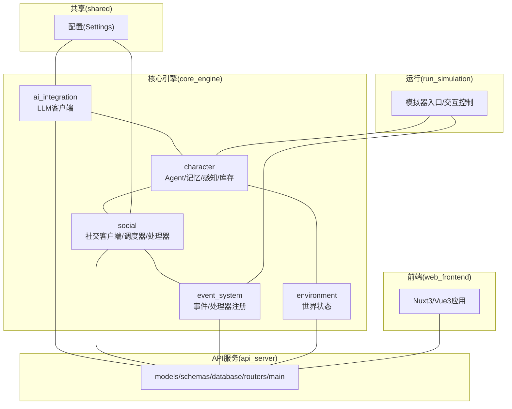
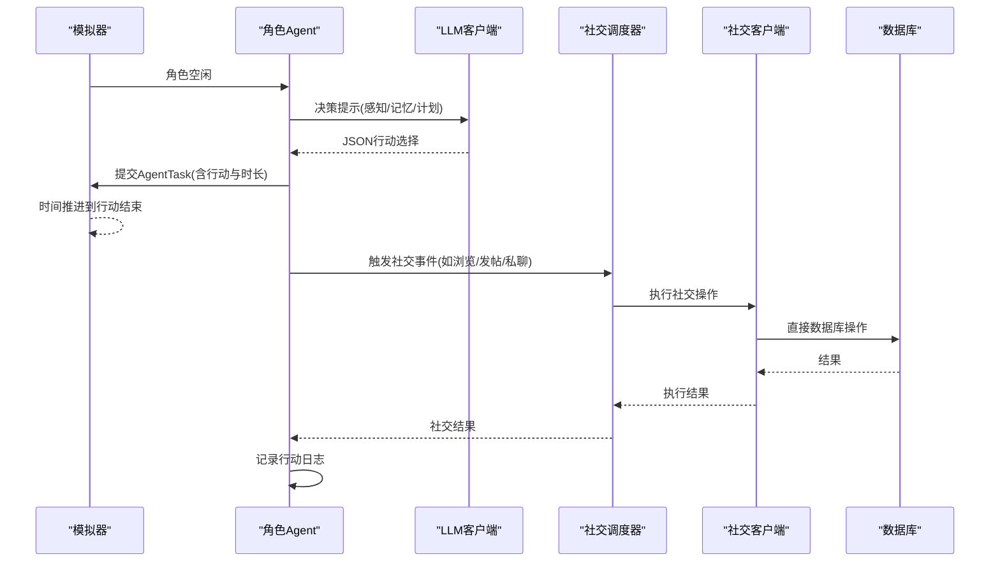
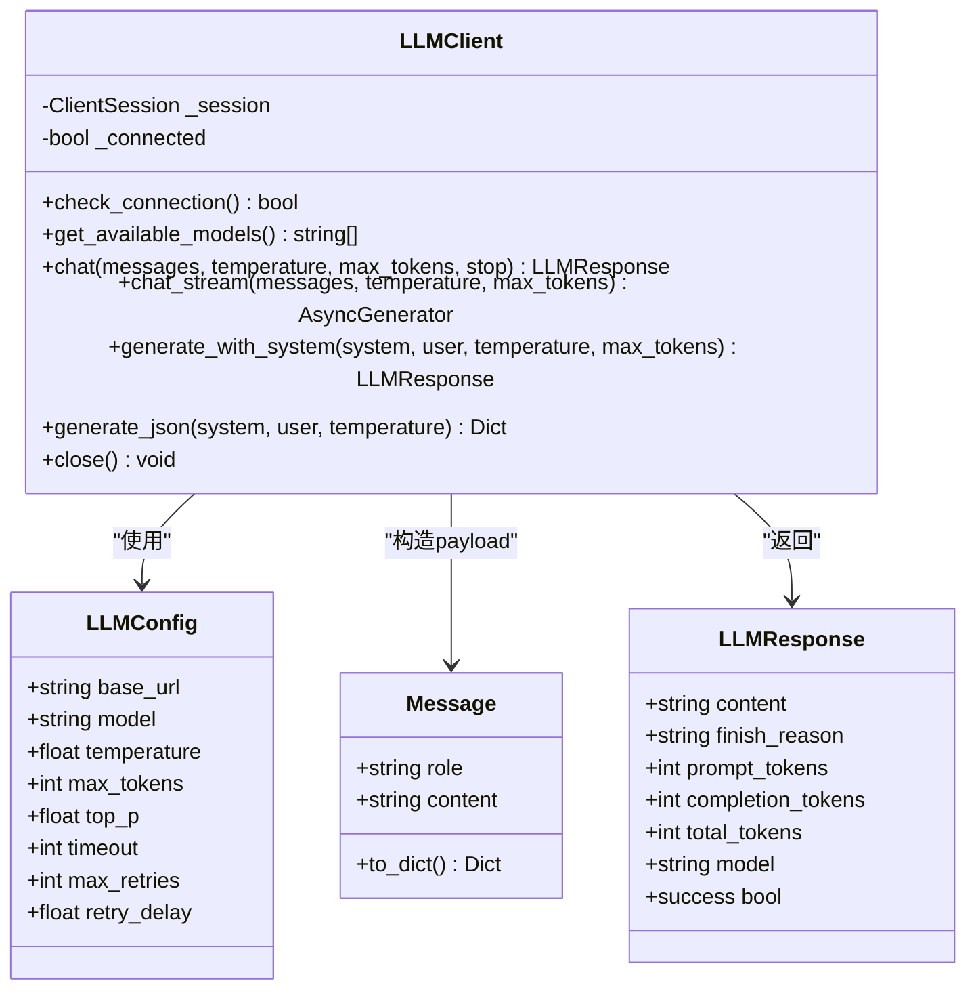
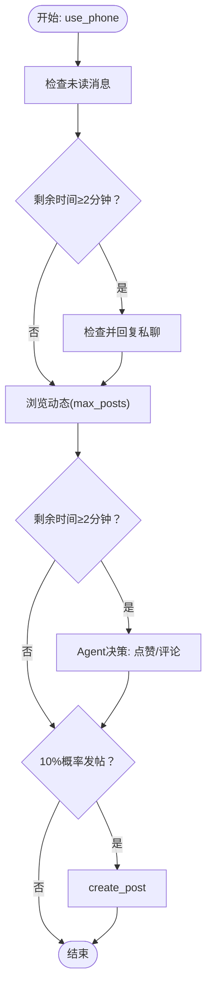
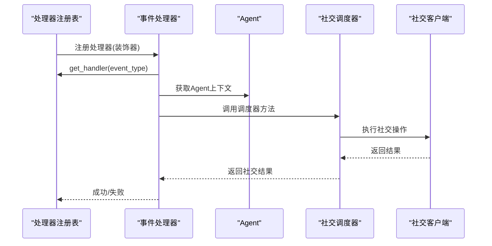
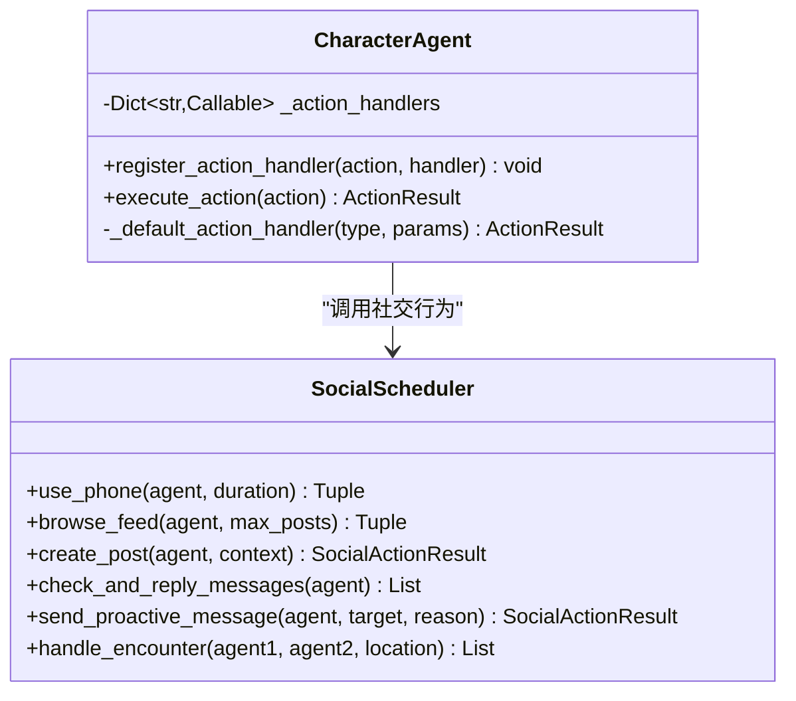
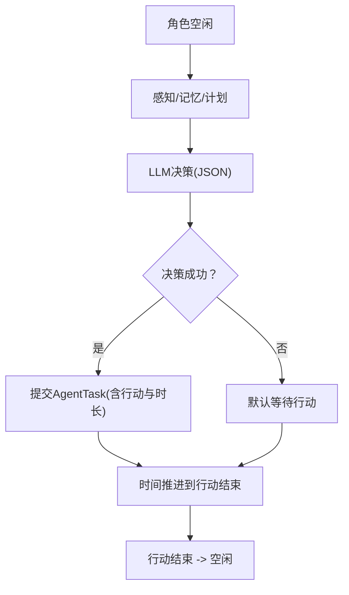
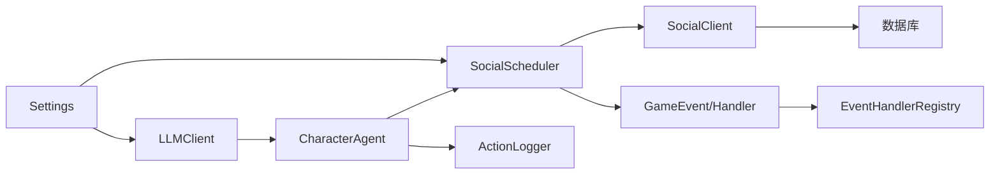

# AI集成系统

<cite>
**本文档引用的文件**
- [README.md](file://README.md)
- [run_simulation.py](file://run_simulation.py)
- [core_engine/ai_integration/llm_client.py](file://core_engine/ai_integration/llm_client.py)
- [core_engine/character/agent.py](file://core_engine/character/agent.py)
- [core_engine/character/action_logger.py](file://core_engine/character/action_logger.py)
- [core_engine/social/social_client.py](file://core_engine/social/social_client.py)
- [core_engine/social/social_scheduler.py](file://core_engine/social/social_scheduler.py)
- [core_engine/social/social_handlers.py](file://core_engine/social/social_handlers.py)
- [core_engine/event_system/events.py](file://core_engine/event_system/events.py)
- [core_engine/event_system/handlers.py](file://core_engine/event_system/handlers.py)
- [shared/config.py](file://shared/config.py)
</cite>

## 目录
1. [简介](#简介)
2. [项目结构](#项目结构)
3. [核心组件](#核心组件)
4. [架构总览](#架构总览)
5. [详细组件分析](#详细组件分析)
6. [依赖关系分析](#依赖关系分析)
7. [性能考量](#性能考量)
8. [故障排查指南](#故障排查指南)
9. [结论](#结论)
10. [附录](#附录)

## 简介
本系统是一个本地化的拟真AI社区模拟平台，结合事件驱动的时间模型与LLM决策，使AI角色能够在“线下”社区与“线上”社交网络中自主行动、交流与创作。系统围绕以下目标展开：
- LLM客户端：提供OpenAI兼容接口、流式响应、JSON输出与自动重试机制
- 社交API客户端：提供高效直接的数据库访问，支持发帖、点赞、评论、私聊与用户信息查询
- 社交行为调度器：协调AI角色的社交行为，如浏览动态、发帖、回复私聊、线下相遇
- AI行为扩展机制：通过注册自定义行动处理器，实现行为的可插拔扩展
- LLM服务配置：支持本地LM Studio服务连接、模型参数与性能调优
- 决策流程控制：超时处理、结果缓存与状态同步
- 日志与监控：完整的行动日志记录、查询与可视化
- 扩展开发指南：新增AI行为的实现与集成方法

## 项目结构
系统采用分层设计，核心引擎位于core_engine，包含AI集成、角色系统、社交功能、事件系统与环境系统；API服务位于api_server；前端位于web_frontend；共享配置位于shared。

**图表来源**
- [README.md](file://README.md#L5-L35)
- [run_simulation.py](file://run_simulation.py#L17-L24)

**章节来源**
- [README.md](file://README.md#L5-L35)

## 核心组件
- LLM客户端：提供OpenAI兼容接口、连接检测、模型列表查询、聊天、流式聊天、JSON生成与全局单例管理
- 社交客户端：直接数据库访问，提供发帖、点赞/取消、评论、私聊、用户信息等操作
- 社交调度器：协调AI角色的社交行为，包括浏览动态、发帖、回复私聊、主动私聊与线下相遇
- 事件系统：定义事件类型、优先级与状态，提供处理器注册与执行机制
- Agent：角色核心，负责感知、决策、行动执行与日志记录，支持自定义行动处理器注册
- 行动日志：记录每一步行动，支持查询与可视化
- 配置：集中管理数据库、JWT、文件存储与AI相关参数

**章节来源**
- [core_engine/ai_integration/llm_client.py](file://core_engine/ai_integration/llm_client.py#L14-L317)
- [core_engine/social/social_client.py](file://core_engine/social/social_client.py#L102-L598)
- [core_engine/social/social_scheduler.py](file://core_engine/social/social_scheduler.py#L47-L735)
- [core_engine/event_system/events.py](file://core_engine/event_system/events.py#L13-L129)
- [core_engine/event_system/handlers.py](file://core_engine/event_system/handlers.py#L50-L156)
- [core_engine/character/agent.py](file://core_engine/character/agent.py#L116-L521)
- [core_engine/character/action_logger.py](file://core_engine/character/action_logger.py#L89-L481)
- [shared/config.py](file://shared/config.py#L6-L52)

## 架构总览
系统采用事件驱动的时间模型：角色空闲时由AI决策下一步行动，行动包含时长，所有角色忙碌时时间跳跃到最近的行动结束点。社交行为通过事件处理器触发，Agent通过LLM进行决策，社交行为由调度器协调，最终通过社交客户端执行数据库操作。

**图表来源**
- [core_engine/character/agent.py](file://core_engine/character/agent.py#L358-L477)
- [core_engine/social/social_scheduler.py](file://core_engine/social/social_scheduler.py#L69-L108)
- [core_engine/social/social_client.py](file://core_engine/social/social_client.py#L138-L237)
- [core_engine/character/action_logger.py](file://core_engine/character/action_logger.py#L103-L161)

## 详细组件分析

### LLM客户端与OpenAI兼容接口
- OpenAI兼容接口：支持/chat/completions与/models端点，可连接LM Studio等本地服务
- 配置项：base_url、model、temperature、max_tokens、top_p、timeout、重试次数与延迟
- 功能特性：
  - 连接检测与模型列表查询
  - chat：标准聊天请求，支持温度与最大token覆盖
  - chat_stream：SSE流式响应，逐片段输出
  - generate_with_system：便捷的系统提示词+用户输入组合
  - generate_json：强制JSON输出并解析，支持代码块包裹的JSON提取
  - 全局单例：get_llm_client，支持动态更新配置
- 错误与重试：统一异常捕获、超时处理与指数退避重试

**图表来源**
- [core_engine/ai_integration/llm_client.py](file://core_engine/ai_integration/llm_client.py#L14-L317)

**章节来源**
- [core_engine/ai_integration/llm_client.py](file://core_engine/ai_integration/llm_client.py#L14-L317)

### 社交API客户端与行为调度器
- 社交客户端：
  - 直接数据库访问，避免HTTP开销，提供高效操作
  - 帖子：获取最新/用户帖子、计数、详情、创建、点赞/取消、评论与历史
  - 私聊：未读消息、聊天历史、发送消息、标记已读
  - 用户：获取用户信息、全量用户、仅AI角色
- 社交调度器：
  - use_phone：综合手机使用（检查私聊、浏览动态、可能发帖）
  - browse_feed：浏览动态并决策点赞/评论，汇总浏览体验
  - create_post：AI生成内容并发布
  - check_and_reply_messages：检查并回复私聊
  - send_proactive_message：主动发起私聊
  - handle_encounter：线下相遇对话，支持双AI角色或多角色场景
  - 配置：通过shared.config读取AI浏览评论数量限制

**图表来源**
- [core_engine/social/social_scheduler.py](file://core_engine/social/social_scheduler.py#L69-L108)
- [core_engine/social/social_scheduler.py](file://core_engine/social/social_scheduler.py#L110-L224)
- [core_engine/social/social_scheduler.py](file://core_engine/social/social_scheduler.py#L226-L270)

**章节来源**
- [core_engine/social/social_client.py](file://core_engine/social/social_client.py#L102-L598)
- [core_engine/social/social_scheduler.py](file://core_engine/social/social_scheduler.py#L47-L735)
- [shared/config.py](file://shared/config.py#L38-L38)

### 事件系统与社交事件处理器
- 事件类型：个人事件（工作、等待、睡眠、拍照、发帖、看手机）、集体事件（线下群聊、网络群聊、网络私聊）、突发事件（相遇、疲劳警告、视觉/声音事件）
- 事件处理器注册：通过装饰器注册，统一由EventHandlerRegistry执行，支持前置/后置钩子
- 社交事件处理器：
  - UsePhoneHandler：综合手机使用，记录浏览总结与其它行为
  - PostContentHandler：主动发帖
  - OnlinePrivateChatHandler：私聊（回复/主动发起）
  - EncounterHandler：线下相遇（双AI或多角色）

**图表来源**
- [core_engine/event_system/handlers.py](file://core_engine/event_system/handlers.py#L50-L156)
- [core_engine/social/social_handlers.py](file://core_engine/social/social_handlers.py#L18-L146)
- [core_engine/social/social_scheduler.py](file://core_engine/social/social_scheduler.py#L399-L480)

**章节来源**
- [core_engine/event_system/events.py](file://core_engine/event_system/events.py#L13-L129)
- [core_engine/event_system/handlers.py](file://core_engine/event_system/handlers.py#L50-L156)
- [core_engine/social/social_handlers.py](file://core_engine/social/social_handlers.py#L18-L253)

### AI行为扩展机制与自定义行动处理器
- Agent支持注册自定义行动处理器：register_action_handler(action, handler)，在execute_action中优先匹配
- 默认处理器：内置多种行动类型（等待、休息、观察、移动、浏览、发帖、检查私聊、使用手机、主动私聊、查看主页等）
- 扩展方式：在Agent初始化后注册新的action类型与处理器，即可无缝接入决策与执行流程

**图表来源**
- [core_engine/character/agent.py](file://core_engine/character/agent.py#L176-L179)
- [core_engine/character/agent.py](file://core_engine/character/agent.py#L479-L521)
- [core_engine/social/social_scheduler.py](file://core_engine/social/social_scheduler.py#L69-L735)

**章节来源**
- [core_engine/character/agent.py](file://core_engine/character/agent.py#L176-L179)
- [core_engine/character/agent.py](file://core_engine/character/agent.py#L479-L521)
- [core_engine/social/social_scheduler.py](file://core_engine/social/social_scheduler.py#L69-L735)

### LLM服务配置与性能调优
- LLM配置：base_url、model、temperature、max_tokens、top_p、timeout、重试次数与延迟
- 全局单例：get_llm_client，支持动态更新配置
- 性能建议：
  - 合理设置temperature与top_p以平衡创造性与稳定性
  - 控制max_tokens避免超时与资源浪费
  - 使用流式响应提升用户体验
  - 适当增加重试次数与延迟，提高鲁棒性
- LLM连接测试：提供独立测试入口，便于快速验证服务可用性

**章节来源**
- [core_engine/ai_integration/llm_client.py](file://core_engine/ai_integration/llm_client.py#L14-L317)
- [README.md](file://README.md#L82-L98)

### AI决策流程控制与状态同步
- 决策超时：通过SimulationConfig.decision_timeout控制AI决策超时
- 时间推进：基于AgentTask堆，时间跳跃到最近任务结束点，限制最大跳跃
- 状态同步：Agent维护状态（空闲/思考/执行/对话/睡眠/等待），并在行动前后更新
- 行动日志：记录输入提示、LLM响应、结果与额外数据，支持查询与可视化

**图表来源**
- [core_engine/character/agent.py](file://core_engine/character/agent.py#L358-L477)
- [run_simulation.py](file://run_simulation.py#L60-L67)
- [run_simulation.py](file://run_simulation.py#L346-L371)

**章节来源**
- [core_engine/character/agent.py](file://core_engine/character/agent.py#L358-L477)
- [run_simulation.py](file://run_simulation.py#L60-L67)
- [run_simulation.py](file://run_simulation.py#L346-L371)

### 日志记录、监控指标与调试工具
- 行动日志：ActionLogger记录行动类型、描述、时长、原因、结果、输入提示、LLM响应与额外数据
- 查询接口：支持按角色、类型、日期范围查询，返回可展示的条目
- 调试工具：模拟器提供交互式命令（start/stop/pause/resume/step/status/quit），便于调试与观测

**章节来源**
- [core_engine/character/action_logger.py](file://core_engine/character/action_logger.py#L89-L481)
- [run_simulation.py](file://run_simulation.py#L111-L182)

## 依赖关系分析

**图表来源**
- [core_engine/ai_integration/llm_client.py](file://core_engine/ai_integration/llm_client.py#L306-L317)
- [core_engine/character/agent.py](file://core_engine/character/agent.py#L116-L144)
- [core_engine/social/social_scheduler.py](file://core_engine/social/social_scheduler.py#L58-L66)
- [core_engine/social/social_client.py](file://core_engine/social/social_client.py#L114-L135)
- [core_engine/event_system/handlers.py](file://core_engine/event_system/handlers.py#L50-L84)
- [shared/config.py](file://shared/config.py#L6-L52)

**章节来源**
- [core_engine/ai_integration/llm_client.py](file://core_engine/ai_integration/llm_client.py#L306-L317)
- [core_engine/character/agent.py](file://core_engine/character/agent.py#L116-L144)
- [core_engine/social/social_scheduler.py](file://core_engine/social/social_scheduler.py#L58-L66)
- [core_engine/social/social_client.py](file://core_engine/social/social_client.py#L114-L135)
- [core_engine/event_system/handlers.py](file://core_engine/event_system/handlers.py#L50-L84)
- [shared/config.py](file://shared/config.py#L6-L52)

## 性能考量
- 异步I/O：LLM客户端使用aiohttp异步HTTP，减少阻塞
- 直接数据库访问：社交客户端绕过HTTP，直接使用SQLAlchemy，降低网络开销
- 流式响应：chat_stream支持增量输出，改善交互体验
- 重试与超时：统一的超时与重试策略，提升稳定性
- 时间跳跃：基于任务堆的时间推进，避免轮询，提高效率

## 故障排查指南
- LLM连接失败：
  - 确认LM Studio已启动并加载模型
  - 检查端口与base_url配置
  - 运行测试脚本验证连接
- 数据库连接失败：
  - 确认MySQL服务运行
  - 检查用户名、密码与数据库名
  - 初始化数据库
- 没有AI角色：
  - 在数据库中创建is_ai=True的用户记录
- 事件处理器未注册：
  - 确保处理器模块被导入，或显式调用注册方法

**章节来源**
- [README.md](file://README.md#L271-L286)
- [core_engine/ai_integration/llm_client.py](file://core_engine/ai_integration/llm_client.py#L319-L346)

## 结论
本系统通过LLM驱动的Agent与事件驱动的模拟器，实现了AI角色在“线下”与“线上”的拟真行为。LLM客户端提供稳定的OpenAI兼容接口与流式响应能力；社交客户端与调度器协同实现丰富的社交行为；事件系统与处理器机制保证了行为的可扩展与可维护；行动日志与调试工具为系统可观测性提供了坚实基础。通过合理的配置与性能调优，系统可在本地高效运行并支持进一步的功能扩展。

## 附录
- 快速启动与测试：参见README中的快速开始与测试命令
- 模拟器交互：支持start/stop/pause/resume/step/status/quit命令
- 扩展开发：通过register_action_handler注册自定义行动处理器，或实现新的社交行为并接入事件处理器

**章节来源**
- [README.md](file://README.md#L44-L156)
- [run_simulation.py](file://run_simulation.py#L111-L182)
- [core_engine/character/agent.py](file://core_engine/character/agent.py#L176-L179)