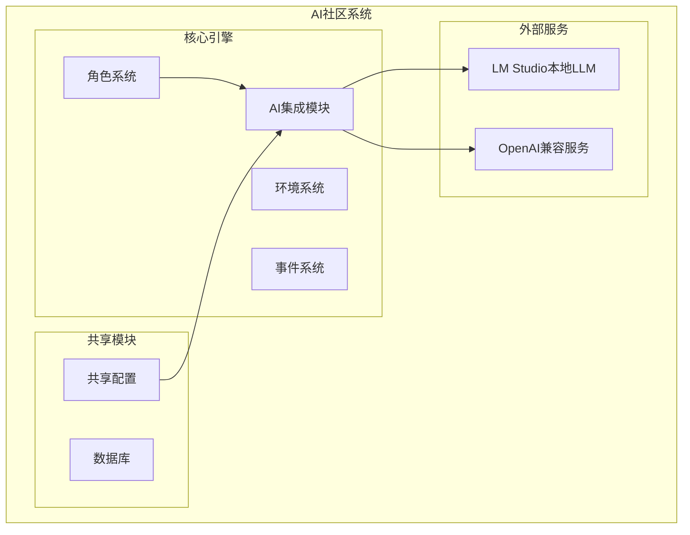
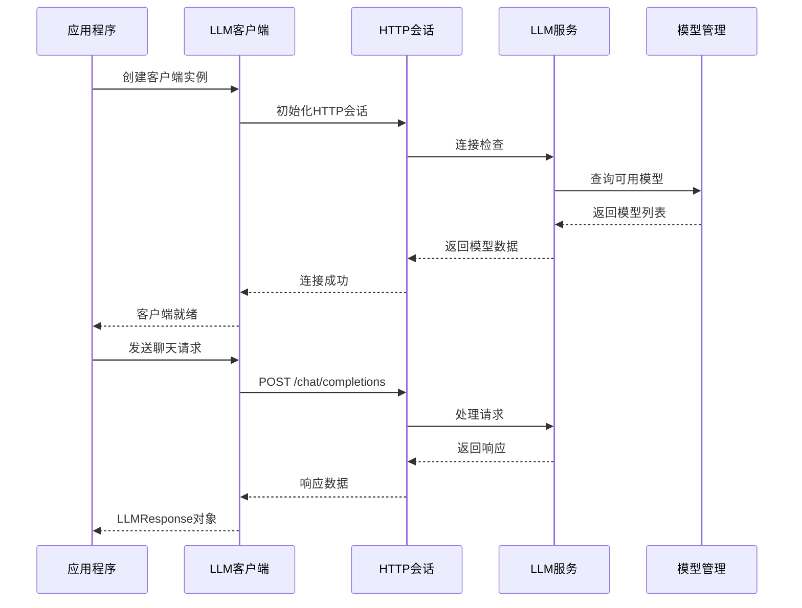
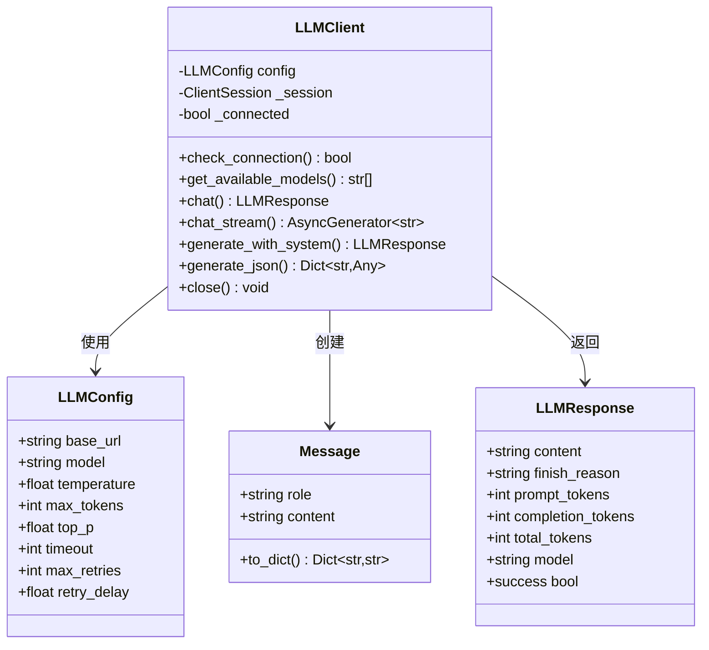
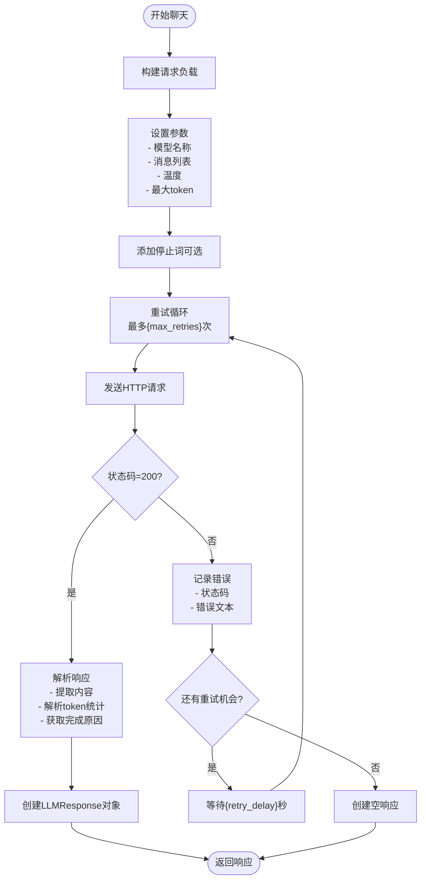
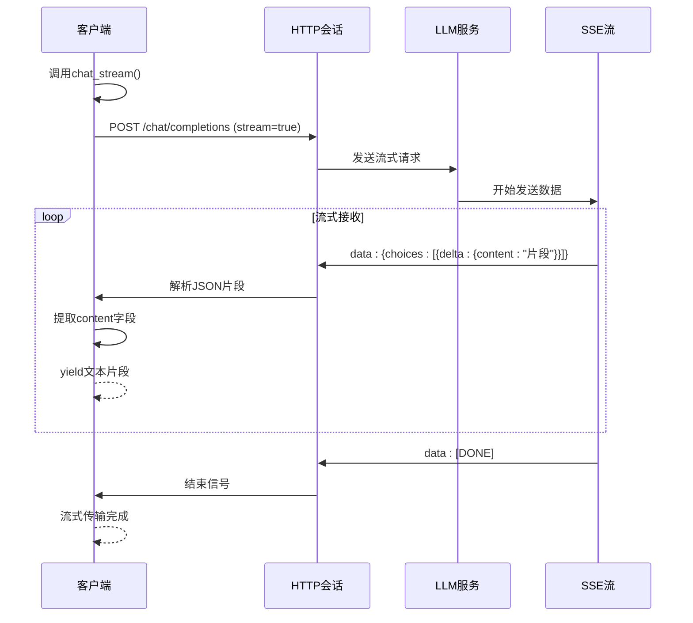
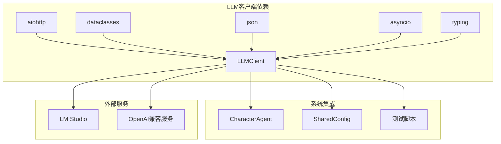

# LLM客户端

<cite>
**本文档引用的文件**
- [llm_client.py](file://core_engine/ai_integration/llm_client.py)
- [README.md](file://README.md)
- [config.py](file://shared/config.py)
- [agent.py](file://core_engine/character/agent.py)
- [run_simulation.py](file://run_simulation.py)
- [.env.template](file://.env.template)
- [requirements.txt](file://requirements.txt)
</cite>

## 目录
1. [简介](#简介)
2. [项目结构](#项目结构)
3. [核心组件](#核心组件)
4. [架构概览](#架构概览)
5. [详细组件分析](#详细组件分析)
6. [依赖关系分析](#依赖关系分析)
7. [性能考虑](#性能考虑)
8. [故障排除指南](#故障排除指南)
9. [结论](#结论)
10. [附录](#附录)

## 简介

LLM客户端是AI社区模拟系统的核心组件，负责与本地LLM服务（如LM Studio）进行通信。该客户端实现了完整的OpenAI兼容接口，支持同步和异步操作，提供连接检查、模型管理、聊天对话、流式响应等多种功能。通过全局单例模式，确保在整个应用中只有一个LLM客户端实例，从而优化资源使用和性能。

## 项目结构

LLM客户端位于核心引擎的AI集成模块中，与整个AI社区系统的其他组件紧密集成：



**图表来源**
- [llm_client.py](file://core_engine/ai_integration/llm_client.py#L1-L351)
- [agent.py](file://core_engine/character/agent.py#L1-L1271)

**章节来源**
- [llm_client.py](file://core_engine/ai_integration/llm_client.py#L1-L351)
- [README.md](file://README.md#L1-L290)

## 核心组件

LLM客户端系统包含四个核心组件，每个组件都有明确的职责和功能：

### LLMConfig配置类
负责管理LLM服务的连接参数和行为配置，包括基础URL、模型名称、温度参数、最大token数等关键设置。

### Message消息类
封装聊天对话中的消息数据结构，支持角色标识和内容存储，并提供字典转换功能。

### LLMResponse响应类
封装LLM服务的响应数据，包含生成内容、完成原因、token使用统计等信息。

### LLMClient客户端类
提供完整的LLM服务接口，包括连接管理、模型查询、聊天对话、流式响应等功能。

**章节来源**
- [llm_client.py](file://core_engine/ai_integration/llm_client.py#L14-L52)

## 架构概览

LLM客户端采用异步架构设计，使用aiohttp库实现非阻塞的HTTP通信。整个系统遵循事件驱动的设计原则，与AI社区的模拟引擎无缝集成。



**图表来源**
- [llm_client.py](file://core_engine/ai_integration/llm_client.py#L80-L171)

## 详细组件分析

### LLMConfig配置类详解

LLMConfig类提供了完整的LLM服务配置管理功能，包含以下关键参数：

#### 基础连接参数
- **base_url**: LLM服务的基础URL，默认指向本地LM Studio服务 `http://127.0.0.1:1234/v1`
- **model**: 默认使用的模型名称，推荐使用 `qwen3-vl-8b` 模型

#### 生成参数
- **temperature**: 控制生成随机性的温度参数，默认0.7，范围通常在0.0-2.0之间
- **max_tokens**: 单次生成的最大token数，默认2048
- **top_p**: 核采样的概率质量阈值，默认0.9

#### 超时和重试配置
- **timeout**: 请求超时时间，默认120秒
- **max_retries**: 最大重试次数，默认3次
- **retry_delay**: 重试间隔时间，默认1.0秒



**图表来源**
- [llm_client.py](file://core_engine/ai_integration/llm_client.py#L14-L52)

**章节来源**
- [llm_client.py](file://core_engine/ai_integration/llm_client.py#L14-L27)

### Message和LLMResponse数据结构

#### Message消息类
Message类设计简洁而实用，支持三种标准角色：
- **system**: 系统提示词，用于设置模型的行为和约束
- **user**: 用户输入，代表用户的原始请求
- **assistant**: 助手响应，代表模型的输出

Message类提供了to_dict()方法，将消息对象转换为OpenAI兼容的字典格式，便于API调用。

#### LLMResponse响应类
LLMResponse类封装了完整的响应信息：
- **content**: 生成的文本内容
- **finish_reason**: 完成原因（如stop、length、content_filter等）
- **token统计**: 包括prompt_tokens、completion_tokens、total_tokens
- **model信息**: 响应使用的具体模型名称

**章节来源**
- [llm_client.py](file://core_engine/ai_integration/llm_client.py#L29-L52)

### LLMClient核心功能详解

#### 连接管理
LLMClient实现了智能的连接管理机制：
- **延迟初始化**: 仅在首次使用时创建HTTP会话
- **连接状态跟踪**: 维护_connected标志位
- **会话复用**: 在整个生命周期内复用同一个会话
- **优雅关闭**: 提供close()方法清理资源

#### 模型获取功能
- **get_available_models()**: 查询LLM服务可用的模型列表
- **OpenAI兼容**: 通过/models端点获取模型信息
- **错误处理**: 网络异常时返回空列表

#### 聊天对话功能
chat()方法提供了完整的同步聊天功能：
- **消息格式**: 接受Message对象列表
- **参数覆盖**: 支持临时覆盖配置参数
- **重试机制**: 自动处理网络异常和超时
- **响应解析**: 解析JSON响应并创建LLMResponse对象



**图表来源**
- [llm_client.py](file://core_engine/ai_integration/llm_client.py#L106-L171)

**章节来源**
- [llm_client.py](file://core_engine/ai_integration/llm_client.py#L54-L171)

### 流式响应实现

chat_stream()方法实现了SSE（Server-Sent Events）流式传输：
- **流式参数**: 设置stream=True启用流式响应
- **逐行解析**: 逐行读取并解析SSE数据
- **增量输出**: 实时产生文本片段
- **错误处理**: 网络异常时优雅退出



**图表来源**
- [llm_client.py](file://core_engine/ai_integration/llm_client.py#L172-L227)

**章节来源**
- [llm_client.py](file://core_engine/ai_integration/llm_client.py#L172-L227)

### 特殊用途方法

#### generate_with_system方法
专门用于处理系统提示词和用户输入的组合：
- **系统提示词**: 设置模型行为和约束
- **用户输入**: 实际的用户请求
- **参数传递**: 支持温度和最大token覆盖

#### generate_json方法
提供JSON格式响应生成功能：
- **JSON格式要求**: 自动添加JSON格式约束
- **内容提取**: 处理包含代码块标记的响应
- **解析错误**: 捕获并报告JSON解析异常

**章节来源**
- [llm_client.py](file://core_engine/ai_integration/llm_client.py#L228-L299)

### 全局单例模式

LLM客户端实现了全局单例模式，确保应用中只有一个客户端实例：

```mermaid
flowchart TD
GetClient[调用get_llm_client()] --> CheckInstance{"检查全局实例"}
CheckInstance --> |不存在| CreateNew["创建新客户端实例"]
CheckInstance --> |已存在| CheckConfig{"检查配置参数"}
CheckConfig --> |提供新配置| UpdateConfig["更新现有实例配置"]
CheckConfig --> |无配置参数| ReturnExisting["返回现有实例"]
CreateNew --> StoreGlobal["存储到全局变量"]
StoreGlobal --> ReturnExisting
UpdateConfig --> ReturnExisting
```

**图表来源**
- [llm_client.py](file://core_engine/ai_integration/llm_client.py#L302-L317)

**章节来源**
- [llm_client.py](file://core_engine/ai_integration/llm_client.py#L302-L317)

## 依赖关系分析

LLM客户端的依赖关系相对简单且清晰：



**图表来源**
- [llm_client.py](file://core_engine/ai_integration/llm_client.py#L7-L11)
- [requirements.txt](file://requirements.txt#L24-L26)

**章节来源**
- [llm_client.py](file://core_engine/ai_integration/llm_client.py#L7-L11)
- [requirements.txt](file://requirements.txt#L1-L32)

## 性能考虑

### 异步I/O优化
- **非阻塞操作**: 使用aiohttp实现完全异步的HTTP通信
- **连接复用**: 单个会话在生命周期内复用，减少连接开销
- **流式处理**: chat_stream()方法支持实时流式响应，降低延迟

### 资源管理
- **内存优化**: 使用dataclass减少内存占用
- **连接池**: aiohttp自动管理连接池
- **及时清理**: 提供close()方法确保资源释放

### 缓存策略
- **模型列表缓存**: 可以考虑缓存模型信息减少查询开销
- **会话状态**: 维护连接状态避免不必要的重新连接

## 故障排除指南

### 连接问题诊断

#### 常见连接错误
1. **LM Studio未启动**: 确保本地服务正在运行
2. **端口冲突**: 检查1234端口是否被占用
3. **网络配置**: 验证base_url配置正确

#### 连接测试方法
使用内置的测试脚本验证连接：
```bash
python -m core_engine.ai_integration.llm_client
```

#### 错误处理最佳实践
- **重试机制**: 自动重试网络异常，避免单点故障
- **超时控制**: 合理设置超时时间，防止长时间阻塞
- **降级策略**: 连接失败时提供合理的默认行为

**章节来源**
- [llm_client.py](file://core_engine/ai_integration/llm_client.py#L319-L346)
- [README.md](file://README.md#L271-L276)

### 参数调优建议

#### 温度参数调优
- **创造性任务**: 0.7-1.0，增加创意和多样性
- **事实性任务**: 0.3-0.5，提高准确性
- **对话任务**: 0.7，平衡创造性和一致性

#### 最大token设置
- **简短回复**: 200-500
- **中等长度**: 500-1500
- **长文档**: 1500+

#### 重试策略
- **指数退避**: 递增等待时间
- **最大重试**: 避免无限重试
- **超时设置**: 平衡响应速度和成功率

## 结论

LLM客户端是一个设计精良、功能完整的异步客户端库，专门为AI社区模拟系统量身定制。其核心优势包括：

1. **完整的OpenAI兼容性**: 支持标准的聊天接口和流式响应
2. **健壮的错误处理**: 内置重试机制和超时控制
3. **高效的资源管理**: 单例模式和连接复用优化性能
4. **灵活的配置选项**: 支持动态参数覆盖和环境配置
5. **清晰的API设计**: 简洁易用的数据结构和方法接口

通过与角色系统的深度集成，LLM客户端为AI社区模拟提供了强大的语言理解和生成能力，是整个系统的核心基础设施。

## 附录

### 使用示例和最佳实践

#### 基本连接测试
```python
from core_engine.ai_integration.llm_client import get_llm_client

# 获取全局客户端实例
client = get_llm_client()

# 测试连接
if await client.check_connection():
    print("LLM服务连接成功")
    models = await client.get_available_models()
    print(f"可用模型: {models}")
else:
    print("LLM服务连接失败")

await client.close()
```

#### 聊天对话示例
```python
from core_engine.ai_integration.llm_client import Message

messages = [
    Message(role="system", content="你是友好的助手"),
    Message(role="user", content="请介绍自己")
]

response = await client.chat(messages, temperature=0.7)
if response.success:
    print(f"回复: {response.content}")
    print(f"Token使用: {response.total_tokens}")
```

#### 流式响应示例
```python
async for chunk in client.chat_stream(messages):
    print(chunk, end="", flush=True)
```

#### JSON生成示例
```python
json_data = await client.generate_json(
    "你是一个JSON生成器",
    "请生成一个包含姓名和年龄的对象",
    temperature=0.3
)
if json_data:
    print(f"解析的JSON: {json_data}")
```

### 配置文件参考

#### 环境变量配置
```env
# LLM服务配置
OPENAI_API_BASE=http://localhost:1234/v1
OPENAI_API_KEY=not-needed
```

#### 模型配置建议
- **LM Studio**: `qwen3-vl-8b` 或其他本地模型
- **OpenAI兼容**: 标准的OpenAI模型名称
- **自定义服务**: 根据实际部署的服务调整base_url

**章节来源**
- [.env.template](file://.env.template#L24-L26)
- [README.md](file://README.md#L89-L98)