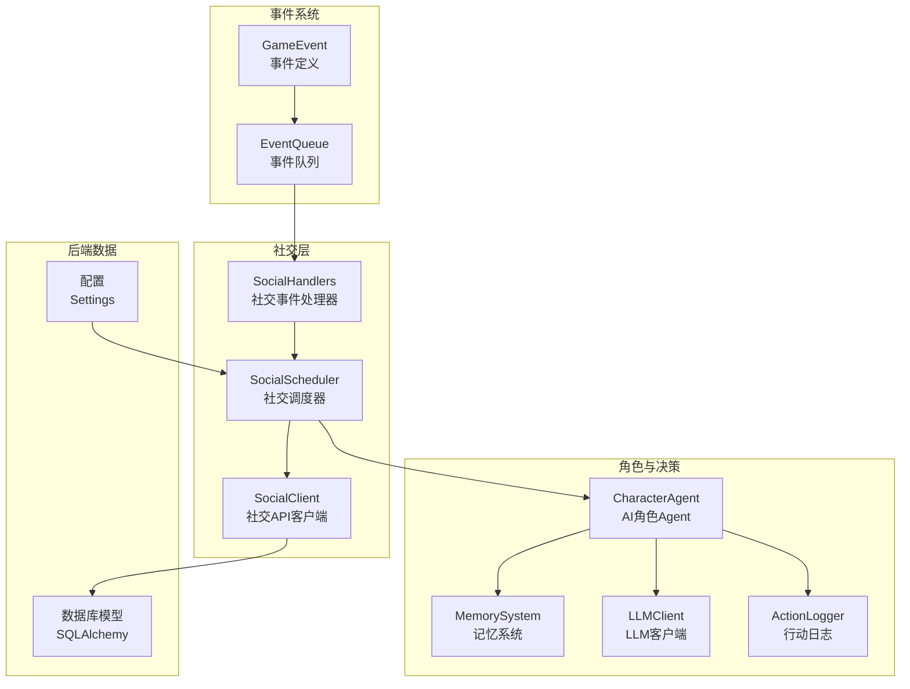
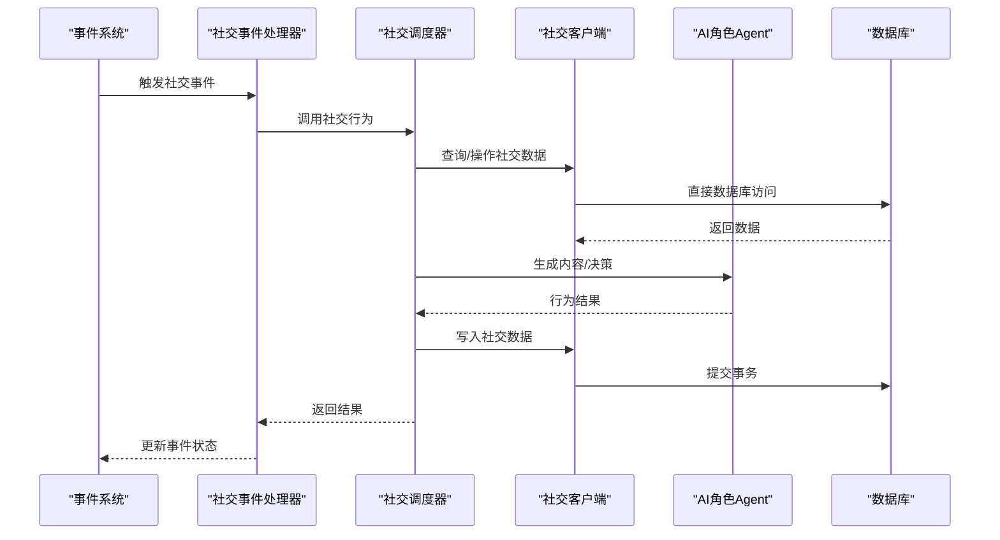
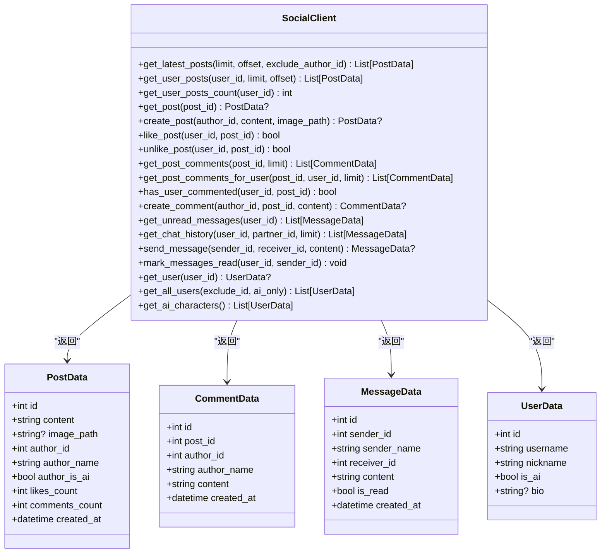
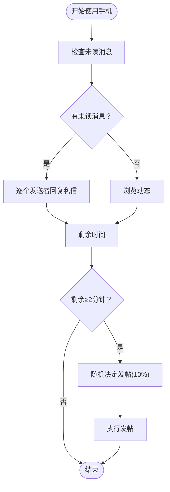
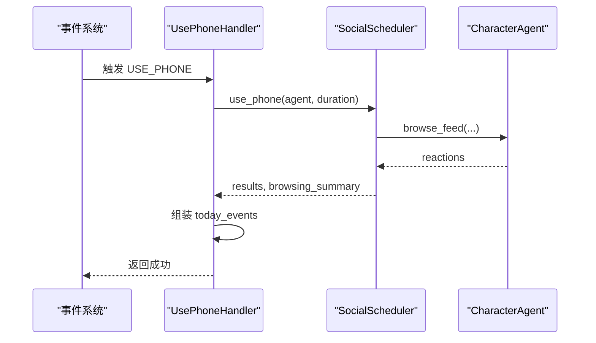
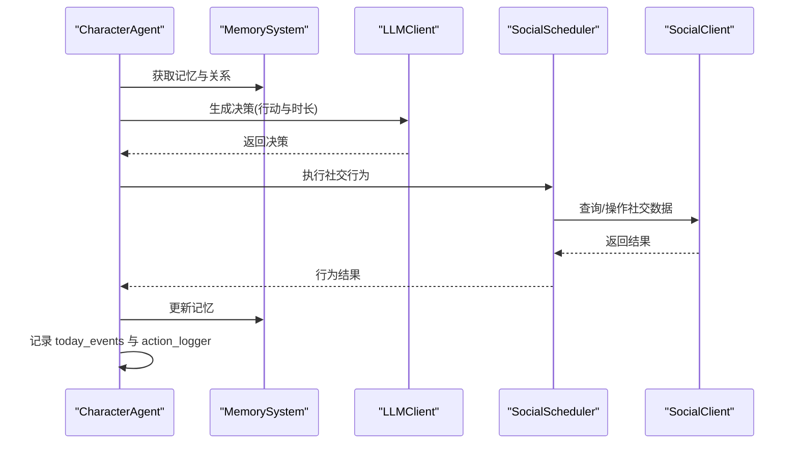
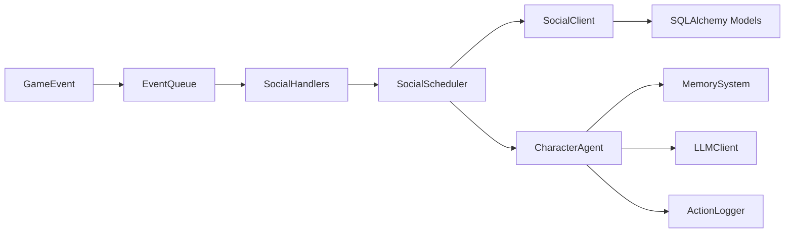

# 社交行为集成

<cite>
**本文档引用的文件**
- [social_client.py](file://core_engine/social/social_client.py)
- [social_scheduler.py](file://core_engine/social/social_scheduler.py)
- [social_handlers.py](file://core_engine/social/social_handlers.py)
- [agent.py](file://core_engine/character/agent.py)
- [events.py](file://core_engine/event_system/events.py)
- [event_queue.py](file://core_engine/event_system/event_queue.py)
- [memory.py](file://core_engine/character/memory.py)
- [llm_client.py](file://core_engine/ai_integration/llm_client.py)
- [action_logger.py](file://core_engine/character/action_logger.py)
- [models.py](file://api_server/models.py)
- [config.py](file://shared/config.py)
- [test_social.py](file://test_social.py)
- [run_simulation.py](file://run_simulation.py)
</cite>

## 目录
1. [简介](#简介)
2. [项目结构](#项目结构)
3. [核心组件](#核心组件)
4. [架构总览](#架构总览)
5. [详细组件分析](#详细组件分析)
6. [依赖关系分析](#依赖关系分析)
7. [性能考量](#性能考量)
8. [故障排查指南](#故障排查指南)
9. [结论](#结论)
10. [附录](#附录)

## 简介
本技术文档面向社交行为集成系统，围绕以下目标展开：
- 深入解析 SocialClient 的设计与实现，涵盖与后端数据库的直接访问协议、请求格式与响应处理。
- 详述 SocialScheduler 的行为调度机制，包括任务队列管理、优先级控制与执行时机。
- 解释 SocialHandlers 的事件处理器实现，包括社交动作的注册、触发条件与执行逻辑。
- 提供 AI 角色社交行为的完整流程，从感知环境到执行行动的全过程。
- 介绍社交网络的扩展机制，包括新增社交行为与自定义处理器的实现方式。
- 说明社交行为的配置选项，包括频率限制、成功率与冷却时间。
- 提供社交行为的日志记录、监控指标与调试方法。
- 说明社交行为与 AI 决策系统的集成方式与数据同步机制。

## 项目结构
社交行为集成位于核心引擎的 social 子模块，配合事件系统、角色系统、记忆系统与 LLM 客户端协同工作。整体采用“事件驱动 + 行为调度 + 数据持久化”的架构。

图表来源
- [social_client.py](file://core_engine/social/social_client.py#L102-L598)
- [social_scheduler.py](file://core_engine/social/social_scheduler.py#L47-L735)
- [social_handlers.py](file://core_engine/social/social_handlers.py#L18-L253)
- [agent.py](file://core_engine/character/agent.py#L116-L800)
- [events.py](file://core_engine/event_system/events.py#L13-L356)
- [event_queue.py](file://core_engine/event_system/event_queue.py#L29-L244)
- [models.py](file://api_server/models.py#L35-L293)
- [config.py](file://shared/config.py#L6-L52)

章节来源
- [social_client.py](file://core_engine/social/social_client.py#L1-L598)
- [social_scheduler.py](file://core_engine/social/social_scheduler.py#L1-L735)
- [social_handlers.py](file://core_engine/social/social_handlers.py#L1-L253)
- [agent.py](file://core_engine/character/agent.py#L1-L1271)
- [events.py](file://core_engine/event_system/events.py#L1-L356)
- [event_queue.py](file://core_engine/event_system/event_queue.py#L1-L244)
- [models.py](file://api_server/models.py#L1-L293)
- [config.py](file://shared/config.py#L1-L52)

## 核心组件
- SocialClient：提供与后端数据库的直接访问能力，封装发帖、点赞、评论、私聊、用户信息等社交操作，统一返回结构化数据对象。
- SocialScheduler：负责社交行为的调度与执行，包括浏览动态、发帖、查看/回复私聊、主动发私信、查看用户主页、线下相遇等。
- SocialHandlers：事件处理器，将 GameEvent 与社交行为绑定，负责事件触发、上下文传递与结果回填。
- CharacterAgent：AI角色控制器，整合感知、记忆、决策与行动执行，通过 LLM 生成社交行为的具体内容。
- MemorySystem：记忆系统，支撑角色的长期与短期记忆，影响社交决策与对话质量。
- LLMClient：本地 LLM 客户端，提供 OpenAI 兼容接口，支持 JSON 生成与流式响应。
- ActionLogger：行动日志记录器，统一记录社交行为的输入、输出与结果，便于审计与可视化。
- EventSystem：事件定义与优先队列，支撑社交行为的异步调度与冲突检测。
- 数据模型：SQLAlchemy 模型定义，支撑社交数据的持久化与关系维护。

章节来源
- [social_client.py](file://core_engine/social/social_client.py#L102-L598)
- [social_scheduler.py](file://core_engine/social/social_scheduler.py#L47-L735)
- [social_handlers.py](file://core_engine/social/social_handlers.py#L18-L253)
- [agent.py](file://core_engine/character/agent.py#L116-L800)
- [memory.py](file://core_engine/character/memory.py#L92-L525)
- [llm_client.py](file://core_engine/ai_integration/llm_client.py#L54-L351)
- [action_logger.py](file://core_engine/character/action_logger.py#L89-L481)
- [events.py](file://core_engine/event_system/events.py#L13-L356)
- [event_queue.py](file://core_engine/event_system/event_queue.py#L29-L244)
- [models.py](file://api_server/models.py#L35-L293)

## 架构总览
社交行为集成采用“事件驱动 + 行为调度 + 数据持久化”的分层架构：
- 事件层：定义社交事件类型与优先级，通过事件队列进行调度。
- 处理层：事件处理器将事件映射到具体的社交行为，调用调度器执行。
- 行为层：调度器协调 SocialClient 与 CharacterAgent，完成社交动作。
- 数据层：通过 SQLAlchemy 模型持久化社交数据，支持查询与统计。
- 决策层：CharacterAgent 与 MemorySystem、LLMClient 协作，生成自然语言内容与社交策略。

图表来源
- [social_handlers.py](file://core_engine/social/social_handlers.py#L29-L69)
- [social_scheduler.py](file://core_engine/social/social_scheduler.py#L69-L108)
- [social_client.py](file://core_engine/social/social_client.py#L129-L134)
- [models.py](file://api_server/models.py#L80-L170)

## 详细组件分析

### SocialClient 设计与实现
- 设计目标：为 AI 角色提供高效的社交能力，直接访问数据库以减少网络开销。
- 数据模型封装：PostData、CommentData、MessageData、UserData 等数据类，统一对外暴露。
- 核心能力：
  - 帖子：获取最新/用户帖子、创建帖子、点赞/取消点赞、获取评论。
  - 私聊：获取未读消息、聊天历史、发送消息、标记已读。
  - 用户：获取用户信息、列出用户、仅AI角色列表。
- 数据一致性：通过延迟导入避免循环依赖，统一通过 Session 访问数据库。
- 错误处理：对不存在的资源返回 None 或空列表，保证调用方安全。

图表来源
- [social_client.py](file://core_engine/social/social_client.py#L36-L101)
- [social_client.py](file://core_engine/social/social_client.py#L102-L598)

章节来源
- [social_client.py](file://core_engine/social/social_client.py#L102-L598)

### SocialScheduler 行为调度机制
- 行为类型：浏览动态、发帖、点赞、评论、查看私信、回复私信、主动发私信、查看用户主页、线下相遇。
- 调度策略：
  - use_phone：在限定时间内分配浏览与私聊任务，剩余时间可能触发发帖。
  - browse_feed：随机选择帖子，调用 Agent 决策是否点赞/评论，并汇总浏览体验。
  - create_post：委托 Agent 生成内容后提交。
  - check_and_reply_messages：按发送者聚合消息，构建对话上下文，调用 LLM 决定是否回复。
  - send_proactive_message：主动发起私聊，构建历史与原因上下文。
  - handle_encounter：两角色对话，支持多轮，最终结束对话。
- 时长与消耗：每个行为返回 SocialActionResult，包含 action_type、success、message、data、duration。
- 配置依赖：通过 shared.config.get_settings 获取 ai_browse_comments_limit 等配置。

图表来源
- [social_scheduler.py](file://core_engine/social/social_scheduler.py#L69-L108)
- [social_scheduler.py](file://core_engine/social/social_scheduler.py#L110-L224)

章节来源
- [social_scheduler.py](file://core_engine/social/social_scheduler.py#L47-L735)
- [config.py](file://shared/config.py#L37-L38)

### SocialHandlers 事件处理器
- UsePhoneHandler：处理 USE_PHONE 事件，调用 scheduler.use_phone，组装浏览总结与其他行为摘要。
- PostContentHandler：处理 POST_CONTENT 事件，调用 scheduler.create_post。
- OnlinePrivateChatHandler：处理 ONLINE_PRIVATE_CHAT 事件，支持回复与主动发起两种模式。
- EncounterHandler：处理 ENCOUNTER 事件，区分AI与NPC，两AI时调用 scheduler.handle_encounter。
- 注册机制：使用 @event_handler 装饰器自动注册，SocialEventHandlers 提供便捷的批量注册与钩子设置。

图表来源
- [social_handlers.py](file://core_engine/social/social_handlers.py#L29-L69)
- [social_scheduler.py](file://core_engine/social/social_scheduler.py#L69-L108)

章节来源
- [social_handlers.py](file://core_engine/social/social_handlers.py#L18-L253)

### AI 角色社交行为全流程
- 感知与决策：CharacterAgent.perceive_and_decide 构建感知提示词，结合记忆、最近行动、计划与事件，调用 LLM 选择行动与时长。
- 行动执行：execute_action 根据 action 类型调用默认处理器或自定义处理器，记录 today_events 与 action_logger。
- 社交行为：默认处理器中包含 browse_posts、create_post、check_messages、use_phone、send_message、view_user_profile 等社交动作。
- 记忆与对话：MemorySystem 提供关系记忆、日常记忆与重要记忆，用于对话生成与行为动机。
- LLM 集成：LLMClient 提供 generate_with_system、generate_json、chat_stream 等能力，支持 JSON 输出与流式响应。

图表来源
- [agent.py](file://core_engine/character/agent.py#L358-L477)
- [agent.py](file://core_engine/character/agent.py#L479-L521)
- [memory.py](file://core_engine/character/memory.py#L444-L491)
- [llm_client.py](file://core_engine/ai_integration/llm_client.py#L228-L300)
- [social_scheduler.py](file://core_engine/social/social_scheduler.py#L657-L753)
- [social_client.py](file://core_engine/social/social_client.py#L129-L134)

章节来源
- [agent.py](file://core_engine/character/agent.py#L116-L800)
- [memory.py](file://core_engine/character/memory.py#L92-L525)
- [llm_client.py](file://core_engine/ai_integration/llm_client.py#L54-L351)

### 社交网络扩展机制
- 新增社交行为：
  - 在 SocialActionType 中添加新类型。
  - 在 SocialScheduler 中实现对应方法，返回 SocialActionResult。
  - 在 SocialClient 中补充必要的数据查询/写入方法。
  - 在 CharacterAgent 默认处理器中添加对应分支。
  - 在 SocialHandlers 中注册事件处理器或扩展现有处理器。
- 自定义处理器：
  - 通过 CharacterAgent.register_action_handler 注册自定义 action 处理器。
  - 在事件处理器中将事件映射到自定义 action。
- 配置扩展：
  - 在 shared/config.py 中添加新配置项，如 ai_browse_comments_limit 等。
  - 在 SocialScheduler 中读取配置并应用到行为逻辑。

章节来源
- [social_scheduler.py](file://core_engine/social/social_scheduler.py#L24-L45)
- [social_scheduler.py](file://core_engine/social/social_scheduler.py#L47-L735)
- [social_client.py](file://core_engine/social/social_client.py#L102-L598)
- [agent.py](file://core_engine/character/agent.py#L176-L180)
- [social_handlers.py](file://core_engine/social/social_handlers.py#L18-L253)
- [config.py](file://shared/config.py#L37-L38)

### 社交行为配置选项
- ai_browse_comments_limit：AI 浏览帖子时显示的评论数量上限。
- LLM 配置：base_url、model、temperature、max_tokens、top_p、timeout、重试次数与延迟。
- 行为时长：SocialActionResult.duration 用于记录各行为消耗的游戏时间（分钟）。
- 事件优先级：EventPriority 控制事件调度优先级，NORMAL、HIGH、EMERGENCY 等。

章节来源
- [config.py](file://shared/config.py#L37-L38)
- [llm_client.py](file://core_engine/ai_integration/llm_client.py#L15-L27)
- [social_scheduler.py](file://core_engine/social/social_scheduler.py#L38-L44)
- [events.py](file://core_engine/event_system/events.py#L36-L43)

### 日志记录、监控指标与调试
- 行动日志：ActionLogger 统一记录行动类型、描述、时长、结果、LLM 输入/输出与额外数据，支持按角色、日期查询。
- 记忆日志：MemorySystem 提供日常记忆、重要记忆、知识记忆与关系记忆的增删改查与统计。
- 调试方法：
  - 使用 test_social.py 进行端到端测试，验证发帖、浏览、点赞、评论、私聊与相遇。
  - run_simulation.py 提供交互式与步进式模拟，观察时间推进与角色行为。
  - LLMClient 提供连接检查与模型列表查询，辅助调试 LLM 集成。

章节来源
- [action_logger.py](file://core_engine/character/action_logger.py#L89-L481)
- [memory.py](file://core_engine/character/memory.py#L92-L525)
- [test_social.py](file://test_social.py#L27-L311)
- [run_simulation.py](file://run_simulation.py#L54-L258)
- [llm_client.py](file://core_engine/ai_integration/llm_client.py#L80-L93)

## 依赖关系分析
- 组件耦合：
  - SocialScheduler 依赖 SocialClient 与 CharacterAgent，耦合度适中，职责清晰。
  - SocialHandlers 依赖 SocialScheduler 与事件系统，通过装饰器注册，降低硬编码耦合。
  - CharacterAgent 依赖 MemorySystem、LLMClient、ActionLogger，形成完整的决策-执行-记录闭环。
- 外部依赖：
  - SQLAlchemy：数据持久化与关系映射。
  - aiohttp：异步 HTTP 客户端，用于 LLM 通信。
  - FastAPI：API 层（非社交核心，但与前端交互）。
- 潜在循环依赖：
  - SocialClient 通过延迟导入避免与 api_server.models 的直接循环。
  - SocialHandlers 通过 get_social_scheduler 获取调度器，避免循环导入。

图表来源
- [social_client.py](file://core_engine/social/social_client.py#L20-L33)
- [social_scheduler.py](file://core_engine/social/social_scheduler.py#L58-L65)
- [social_handlers.py](file://core_engine/social/social_handlers.py#L15-L35)
- [agent.py](file://core_engine/character/agent.py#L139-L143)
- [models.py](file://api_server/models.py#L35-L293)
- [events.py](file://core_engine/event_system/events.py#L55-L129)
- [event_queue.py](file://core_engine/event_system/event_queue.py#L40-L59)

章节来源
- [social_client.py](file://core_engine/social/social_client.py#L1-L598)
- [social_scheduler.py](file://core_engine/social/social_scheduler.py#L1-L735)
- [social_handlers.py](file://core_engine/social/social_handlers.py#L1-L253)
- [agent.py](file://core_engine/character/agent.py#L1-L1271)
- [models.py](file://api_server/models.py#L1-L293)
- [events.py](file://core_engine/event_system/events.py#L1-L356)
- [event_queue.py](file://core_engine/event_system/event_queue.py#L1-L244)

## 性能考量
- 数据访问效率：SocialClient 直接使用 SQLAlchemy Session，避免 HTTP 请求开销，适合高频社交操作。
- 异步与并发：SocialScheduler 与 LLMClient 均采用异步设计，提升并发处理能力。
- 事件队列：EventQueue 使用堆结构与懒删除策略，保证 O(log N) 插入与弹出，冲突检测线性扫描，满足中小规模事件调度。
- 记忆与日志：MemorySystem 与 ActionLogger 采用数据库持久化，建议合理设置查询限制与缓存策略，避免频繁 IO。
- LLM 调用：LLMClient 支持重试与超时控制，建议根据场景调整 temperature 与 max_tokens，平衡质量与性能。

## 故障排查指南
- LLM 连接失败：
  - 使用 LLMClient.check_connection 与 get_available_models 检查服务状态。
  - 确认 base_url 与端口配置正确，模型名称匹配。
- 事件冲突：
  - 使用 EventQueue.check_conflict 检测时间冲突，必要时调整事件计划时间。
- 数据库异常：
  - SocialClient 在事务提交失败时返回 None，需检查数据库连接与权限。
- 行为执行失败：
  - SocialActionResult.success 标识行为是否成功，结合 message 与 data 定位问题。
- 日志查询：
  - 使用 ActionLogger.get_character_logs 与 get_recent_logs 快速定位问题。

章节来源
- [llm_client.py](file://core_engine/ai_integration/llm_client.py#L80-L93)
- [event_queue.py](file://core_engine/event_system/event_queue.py#L154-L178)
- [social_client.py](file://core_engine/social/social_client.py#L218-L236)
- [social_scheduler.py](file://core_engine/social/social_scheduler.py#L38-L44)
- [action_logger.py](file://core_engine/character/action_logger.py#L336-L466)

## 结论
社交行为集成系统通过清晰的分层设计与事件驱动机制，实现了 AI 角色在社交网络中的自然行为。SocialClient 提供高效的数据访问，SocialScheduler 协调行为执行，SocialHandlers 将事件与行为绑定，CharacterAgent 与 MemorySystem、LLMClient、ActionLogger 共同构成完整的决策-执行-记录闭环。系统具备良好的扩展性与可维护性，可通过配置与处理器扩展实现更多社交行为。

## 附录
- 测试与演示：
  - test_social.py：包含发帖、浏览、点赞、评论、私聊与相遇的端到端测试。
  - run_simulation.py：交互式与步进式模拟，便于观察系统行为与调试。
- API 与配置：
  - shared/config.py：集中管理数据库、JWT、服务器、上传与AI相关配置。
  - api_server/models.py：定义数据库模型，支撑社交数据的持久化。

章节来源
- [test_social.py](file://test_social.py#L1-L311)
- [run_simulation.py](file://run_simulation.py#L1-L258)
- [config.py](file://shared/config.py#L1-L52)
- [models.py](file://api_server/models.py#L1-L293)