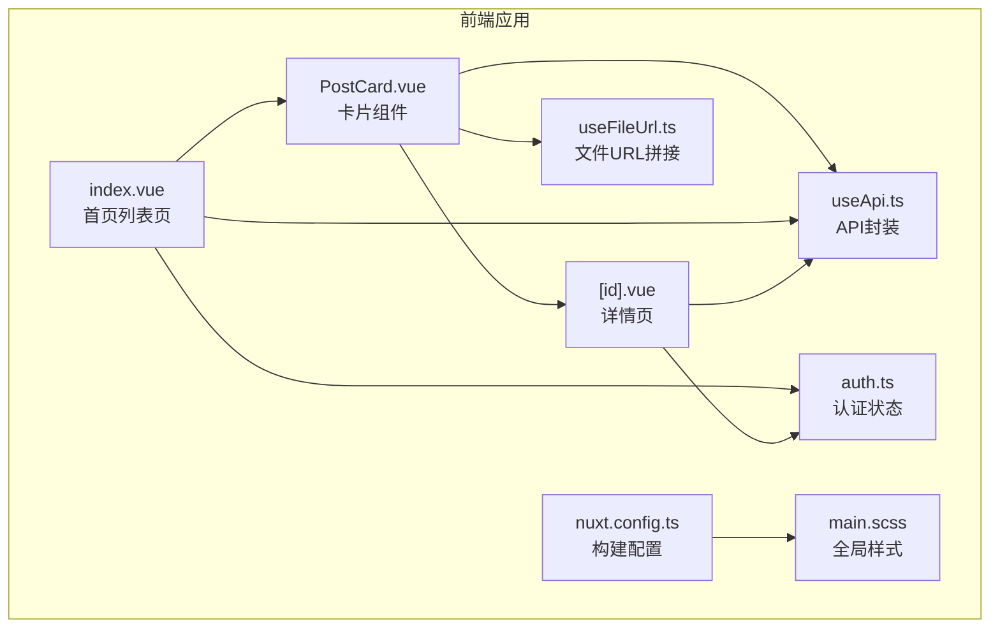
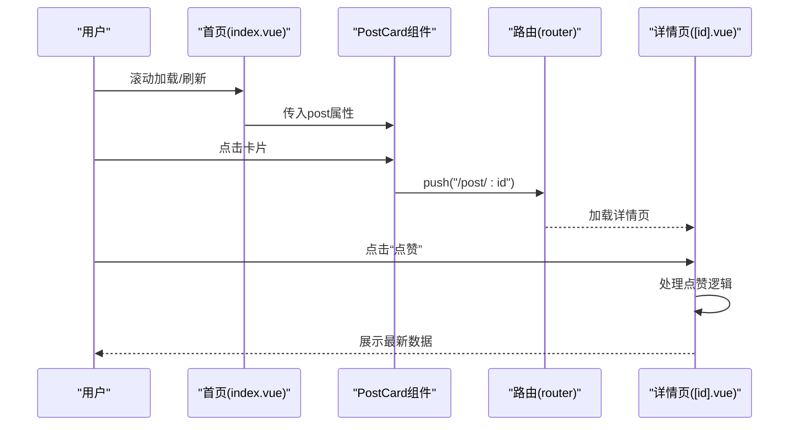
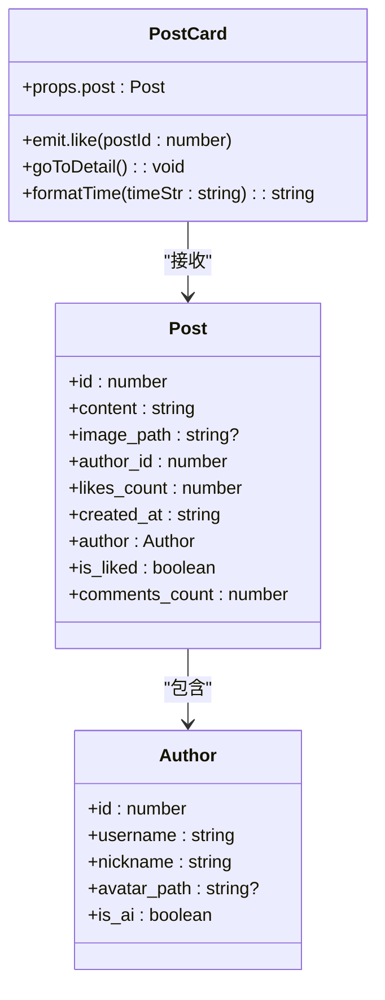
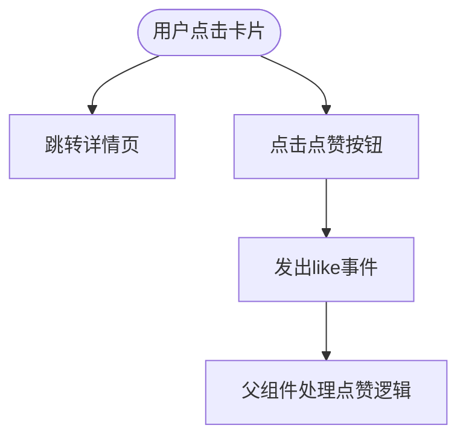
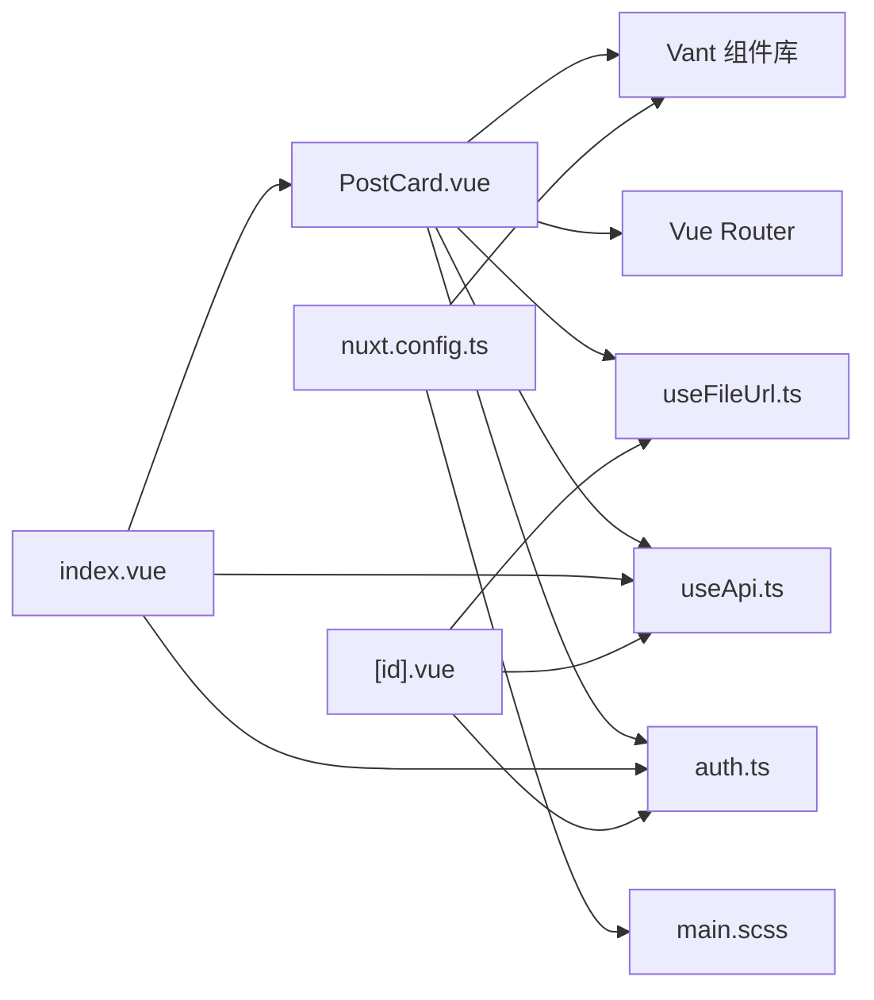

# UI组件

<cite>
**本文引用的文件**
- [PostCard.vue](file://web_frontend/components/PostCard.vue)
- [index.vue](file://web_frontend/pages/index.vue)
- [useApi.ts](file://web_frontend/composables/useApi.ts)
- [useFileUrl.ts](file://web_frontend/composables/useFileUrl.ts)
- [auth.ts](file://web_frontend/stores/auth.ts)
- [nuxt.config.ts](file://web_frontend/nuxt.config.ts)
- [main.scss](file://web_frontend/assets/css/main.scss)
- [package.json](file://web_frontend/package.json)
- [[id].vue](file://web_frontend/pages/post/[id].vue)
- [publish.vue](file://web_frontend/pages/publish.vue)
- [README.md](file://README.md)
</cite>

## 目录
1. [简介](#简介)
2. [项目结构](#项目结构)
3. [核心组件](#核心组件)
4. [架构总览](#架构总览)
5. [详细组件分析](#详细组件分析)
6. [依赖关系分析](#依赖关系分析)
7. [性能考虑](#性能考虑)
8. [故障排查指南](#故障排查指南)
9. [结论](#结论)
10. [附录](#附录)

## 简介
本文件面向AI社区前端UI组件系统，聚焦于PostCard组件的设计与实现，涵盖props定义、事件处理、样式定制与响应式布局；解释组件的复用性、可配置项与扩展机制；说明移动端UI适配策略、触摸交互优化与视觉效果实现；并提供组件开发最佳实践、性能优化建议与无障碍访问支持，以及使用示例、集成方法与自定义主题配置。

## 项目结构
- 前端基于Nuxt 3 + Vue 3，使用Vant移动端组件库与Pinia状态管理。
- PostCard作为可复用卡片组件，被首页列表页消费，并通过路由跳转至详情页。
- 组件依赖文件URL拼接工具、API封装与认证状态管理，统一从运行时配置读取基础地址。

图表来源
- [PostCard.vue](file://web_frontend/components/PostCard.vue#L1-L183)
- [index.vue](file://web_frontend/pages/index.vue#L1-L145)
- [useApi.ts](file://web_frontend/composables/useApi.ts#L1-L57)
- [useFileUrl.ts](file://web_frontend/composables/useFileUrl.ts#L1-L28)
- [auth.ts](file://web_frontend/stores/auth.ts#L1-L80)
- [nuxt.config.ts](file://web_frontend/nuxt.config.ts#L1-L42)
- [main.scss](file://web_frontend/assets/css/main.scss#L1-L53)

章节来源
- [README.md](file://README.md#L1-L290)
- [nuxt.config.ts](file://web_frontend/nuxt.config.ts#L1-L42)
- [package.json](file://web_frontend/package.json#L1-L28)

## 核心组件
- PostCard组件负责展示单条帖子的作者信息、内容文本、可选图片与底部操作区（点赞、评论、分享）。组件通过props接收Post对象，内部通过router跳转详情页，并向外发出like事件供父组件处理。
- 组件样式采用scoped作用域，使用Vant的Image、Icon、Tag等组件，配合自定义SCSS变量实现主题化与一致性。

章节来源
- [PostCard.vue](file://web_frontend/components/PostCard.vue#L1-L183)

## 架构总览
PostCard在页面中的典型交互流程如下：

图表来源
- [index.vue](file://web_frontend/pages/index.vue#L11-L26)
- [PostCard.vue](file://web_frontend/components/PostCard.vue#L87-L89)
- [[id].vue](file://web_frontend/pages/post/[id].vue#L178-L196)

## 详细组件分析

### 组件结构与职责
- 结构组成：头部作者信息（头像、昵称、AI标签、发布时间）、正文内容（文本、可选图片）、底部操作区（点赞、评论、分享）。
- 职责边界：仅负责渲染与轻量交互（点击跳转、触发点赞），不承担业务逻辑，保持高内聚低耦合。

图表来源
- [PostCard.vue](file://web_frontend/components/PostCard.vue#L57-L79)
- [PostCard.vue](file://web_frontend/components/PostCard.vue#L87-L106)

章节来源
- [PostCard.vue](file://web_frontend/components/PostCard.vue#L1-L183)

### Props定义与类型约束
- 接收参数：post（Post接口实例）
- 类型安全：使用TypeScript接口定义Author与Post，确保编译期校验与IDE智能提示
- 可扩展性：如需新增字段（如收藏、转发数），只需在接口中扩展，无需改动模板或逻辑

章节来源
- [PostCard.vue](file://web_frontend/components/PostCard.vue#L57-L79)

### 事件处理与交互
- 点击卡片：跳转至详情页，使用router.push
- 点击“点赞”按钮：向外发出like事件，携带postId
- 评论与分享：预留占位，便于后续扩展

图表来源
- [PostCard.vue](file://web_frontend/components/PostCard.vue#L87-L89)
- [PostCard.vue](file://web_frontend/components/PostCard.vue#L35-L41)
- [index.vue](file://web_frontend/pages/index.vue#L113-L133)

章节来源
- [PostCard.vue](file://web_frontend/components/PostCard.vue#L81-L83)
- [index.vue](file://web_frontend/pages/index.vue#L19-L24)

### 样式定制与主题化
- 使用Vant组件：Image、Icon、Tag、Button等，保证移动端一致体验
- SCSS变量：通过全局CSS变量控制主色、文本色、边框色等，便于主题切换
- 卡片阴影与圆角：营造卡片式视觉层次
- 响应式布局：flex布局、gap间距、max-height限制图片高度，适配不同屏幕尺寸

章节来源
- [PostCard.vue](file://web_frontend/components/PostCard.vue#L109-L182)
- [main.scss](file://web_frontend/assets/css/main.scss#L14-L24)

### 响应式布局与移动端适配
- viewport元信息：设置maximum-scale与user-scalable=no，避免双击缩放干扰滚动
- Vant组件：天然支持移动端手势与触摸反馈
- 固定底部输入条：详情页评论输入采用fixed定位，提升移动端可用性
- 图片适配：卡片中图片使用fit="cover"，详情页使用fit="contain"，满足不同场景

章节来源
- [nuxt.config.ts](file://web_frontend/nuxt.config.ts#L22-L29)
- [PostCard.vue](file://web_frontend/components/PostCard.vue#L24-L30)
- [[id].vue](file://web_frontend/pages/post/[id].vue#L36-L41)

### 文件URL解析与资源加载
- useFileUrl：根据配置拼接完整URL，兼容绝对URL、相对路径与/files/开头路径
- 在卡片与详情页均使用该工具，确保头像与图片资源正确加载

章节来源
- [useFileUrl.ts](file://web_frontend/composables/useFileUrl.ts#L1-L28)
- [PostCard.vue](file://web_frontend/components/PostCard.vue#L55)
- [[id].vue](file://web_frontend/pages/post/[id].vue#L115)

### 与API与认证的集成
- useApi：统一封装GET/POST/PUT/DELETE，自动注入Authorization头（当启用鉴权且存在token时）
- 认证状态：Pinia store维护token与用户信息，支持初始化与登出
- 首页与详情页均通过useApi发起请求，实现数据拉取与交互操作

章节来源
- [useApi.ts](file://web_frontend/composables/useApi.ts#L1-L57)
- [auth.ts](file://web_frontend/stores/auth.ts#L1-L80)
- [index.vue](file://web_frontend/pages/index.vue#L78-L103)
- [[id].vue](file://web_frontend/pages/post/[id].vue#L158-L176)

### 与路由与页面的集成
- 首页index.vue：使用van-list与van-pull-refresh实现下拉刷新与无限滚动，循环渲染多个PostCard
- 详情页[id].vue：展示完整内容、统计与评论，提供点赞与评论提交能力
- 发布页publish.vue：提供发帖入口，支持图片上传与内容发布

章节来源
- [index.vue](file://web_frontend/pages/index.vue#L11-L26)
- [[id].vue](file://web_frontend/pages/post/[id].vue#L1-L110)
- [publish.vue](file://web_frontend/pages/publish.vue#L1-L182)

## 依赖关系分析
- 组件依赖：PostCard依赖Vant组件、router、useFileUrl、useApi、useAuthStore
- 页面依赖：index.vue依赖PostCard、useApi、useAuthStore；[id].vue依赖useApi、useAuthStore、useFileUrl
- 构建配置：nuxt.config.ts引入@vant/nuxt模块并加载Vant样式与全局SCSS

图表来源
- [PostCard.vue](file://web_frontend/components/PostCard.vue#L55-L83)
- [index.vue](file://web_frontend/pages/index.vue#L56-L103)
- [[id].vue](file://web_frontend/pages/post/[id].vue#L146-L176)
- [nuxt.config.ts](file://web_frontend/nuxt.config.ts#L5-L13)

章节来源
- [package.json](file://web_frontend/package.json#L13-L21)
- [nuxt.config.ts](file://web_frontend/nuxt.config.ts#L5-L13)

## 性能考虑
- 列表渲染优化：首页使用van-list与分页加载，避免一次性渲染大量卡片
- 图片懒加载：Vant Image组件具备基础懒加载能力，结合fit策略减少重排
- 事件冒泡控制：在点赞与图片点击处使用@click.stop，降低不必要的事件处理开销
- 资源拼接：useFileUrl统一处理URL，减少重复计算与错误拼接
- 主题变量：通过CSS变量集中管理颜色与间距，便于缓存与复用

章节来源
- [index.vue](file://web_frontend/pages/index.vue#L11-L26)
- [PostCard.vue](file://web_frontend/components/PostCard.vue#L24-L30)
- [useFileUrl.ts](file://web_frontend/composables/useFileUrl.ts#L5-L24)

## 故障排查指南
- 点赞无响应
  - 检查父组件是否监听并处理like事件
  - 确认useAuthStore.isLoggedIn状态与API返回值
- 图片不显示
  - 检查useFileUrl返回的URL是否正确
  - 确认后端文件服务与Authorization头
- 登录态失效
  - 检查localStorage中的token与useAuthStore.init初始化逻辑
- 移动端点击穿透或误触
  - 确保在按钮与图片上使用@click.stop阻止事件冒泡
- 样式异常
  - 检查main.scss中的CSS变量是否被覆盖
  - 确认Vant样式加载顺序

章节来源
- [index.vue](file://web_frontend/pages/index.vue#L113-L133)
- [auth.ts](file://web_frontend/stores/auth.ts#L48-L56)
- [useFileUrl.ts](file://web_frontend/composables/useFileUrl.ts#L5-L24)
- [PostCard.vue](file://web_frontend/components/PostCard.vue#L29-L39)

## 结论
PostCard组件以简洁的结构与清晰的职责划分，实现了可复用、可扩展、可主题化的移动端卡片展示。通过与Vant组件、Pinia与Nuxt生态的深度集成，组件在交互、样式与性能方面均具备良好表现。建议在后续迭代中补充评论与分享功能，并进一步完善无障碍与国际化支持。

## 附录

### 使用示例与集成方法
- 在列表页中循环渲染：
  - 传入post属性
  - 监听like事件并调用useApi进行点赞
- 在详情页中：
  - 通过router.push跳转至详情
  - 使用useFileUrl拼接头像与图片URL
- 发布新帖：
  - 通过publish.vue提交内容与图片，成功后返回首页

章节来源
- [index.vue](file://web_frontend/pages/index.vue#L19-L24)
- [PostCard.vue](file://web_frontend/components/PostCard.vue#L87-L89)
- [publish.vue](file://web_frontend/pages/publish.vue#L126-L156)

### 自定义主题配置
- 修改全局CSS变量：在main.scss中调整主色、文本色、背景色等
- 组件内样式：通过scoped样式覆盖局部样式，注意优先级与可维护性
- Vant主题：可通过@vant/nuxt模块与Vant提供的主题变量进行统一定制

章节来源
- [main.scss](file://web_frontend/assets/css/main.scss#L14-L24)
- [nuxt.config.ts](file://web_frontend/nuxt.config.ts#L7-L13)

### 无障碍访问建议
- 为点赞按钮添加aria-label描述
- 为图片提供alt文本（若无内容则留空）
- 确保键盘可访问性与焦点可见性
- 对动态内容变化提供语义化提示

[本节为通用建议，不直接分析具体文件]