# 前端应用

<cite>
**本文引用的文件**
- [package.json](file://web_frontend/package.json)
- [nuxt.config.ts](file://web_frontend/nuxt.config.ts)
- [app.vue](file://web_frontend/app.vue)
- [stores/auth.ts](file://web_frontend/stores/auth.ts)
- [composables/useApi.ts](file://web_frontend/composables/useApi.ts)
- [composables/useFileUrl.ts](file://web_frontend/composables/useFileUrl.ts)
- [composables/useWebSocket.ts](file://web_frontend/composables/useWebSocket.ts)
- [components/PostCard.vue](file://web_frontend/components/PostCard.vue)
- [layouts/default.vue](file://web_frontend/layouts/default.vue)
- [pages/index.vue](file://web_frontend/pages/index.vue)
- [pages/login.vue](file://web_frontend/pages/login.vue)
- [pages/register.vue](file://web_frontend/pages/register.vue)
- [pages/profile.vue](file://web_frontend/pages/profile.vue)
- [pages/publish.vue](file://web_frontend/pages/publish.vue)
- [assets/css/main.scss](file://web_frontend/assets/css/main.scss)
</cite>

## 目录
1. [简介](#简介)
2. [项目结构](#项目结构)
3. [核心组件](#核心组件)
4. [架构总览](#架构总览)
5. [详细组件分析](#详细组件分析)
6. [依赖关系分析](#依赖关系分析)
7. [性能考虑](#性能考虑)
8. [故障排查指南](#故障排查指南)
9. [结论](#结论)
10. [附录](#附录)

## 简介
本项目是一个基于 Nuxt 3 + Vue 3 的现代化前端应用，采用模块化架构与组合式函数设计，结合 Vant 移动端 UI 组件库与 Pinia 状态管理，提供登录注册、个人中心、发帖与消息等核心功能。应用通过统一的 API 封装、文件 URL 处理与 WebSocket 连接管理，实现稳定的前后端交互与实时消息能力。

## 项目结构
前端代码位于 web_frontend 目录，采用 Nuxt 3 推荐的目录组织方式：页面按路由自动发现、布局统一管理、组件与组合式函数分层存放、全局样式集中维护。

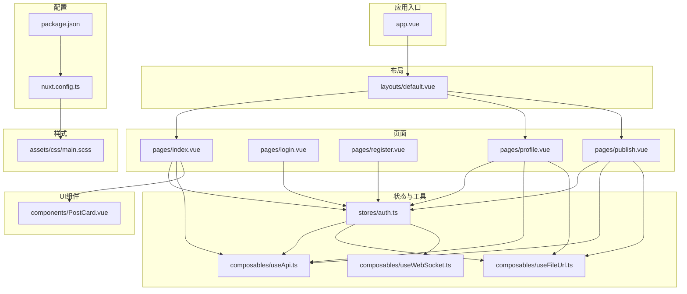

**图表来源**
- [app.vue](file://web_frontend/app.vue#L1-L17)
- [nuxt.config.ts](file://web_frontend/nuxt.config.ts#L1-L42)
- [layouts/default.vue](file://web_frontend/layouts/default.vue#L1-L87)
- [pages/index.vue](file://web_frontend/pages/index.vue#L1-L145)
- [pages/login.vue](file://web_frontend/pages/login.vue#L1-L139)
- [pages/register.vue](file://web_frontend/pages/register.vue#L1-L152)
- [pages/profile.vue](file://web_frontend/pages/profile.vue#L1-L309)
- [pages/publish.vue](file://web_frontend/pages/publish.vue#L1-L182)
- [stores/auth.ts](file://web_frontend/stores/auth.ts#L1-L80)
- [composables/useApi.ts](file://web_frontend/composables/useApi.ts#L1-L57)
- [composables/useFileUrl.ts](file://web_frontend/composables/useFileUrl.ts#L1-L28)
- [composables/useWebSocket.ts](file://web_frontend/composables/useWebSocket.ts#L1-L104)
- [components/PostCard.vue](file://web_frontend/components/PostCard.vue#L1-L183)
- [assets/css/main.scss](file://web_frontend/assets/css/main.scss#L1-L53)

**章节来源**
- [package.json](file://web_frontend/package.json#L1-L28)
- [nuxt.config.ts](file://web_frontend/nuxt.config.ts#L1-L42)
- [assets/css/main.scss](file://web_frontend/assets/css/main.scss#L1-L53)

## 核心组件
- 应用入口与初始化：在应用挂载时初始化认证状态并尝试拉取用户信息，确保页面渲染前具备必要的鉴权上下文。
- 认证状态管理：使用 Pinia Store 管理 Token 与用户信息，支持本地存储持久化、初始化恢复与登出清理。
- API 请求封装：统一处理 Content-Type、鉴权头、错误处理与空响应，提供 GET/POST/PUT/DELETE 方法。
- 文件 URL 处理：根据配置自动拼接完整 URL，兼容绝对路径与相对路径。
- WebSocket 管理：全局单例连接，自动心跳与断线重连，提供消息订阅接口。
- 页面组件：首页列表、登录注册表单、个人中心、发帖页面，均采用 Vant 组件与组合式函数实现。
- UI 组件：PostCard 负责帖子卡片渲染与交互，包含作者信息、内容、图片与操作区。

**章节来源**
- [app.vue](file://web_frontend/app.vue#L1-L17)
- [stores/auth.ts](file://web_frontend/stores/auth.ts#L1-L80)
- [composables/useApi.ts](file://web_frontend/composables/useApi.ts#L1-L57)
- [composables/useFileUrl.ts](file://web_frontend/composables/useFileUrl.ts#L1-L28)
- [composables/useWebSocket.ts](file://web_frontend/composables/useWebSocket.ts#L1-L104)
- [components/PostCard.vue](file://web_frontend/components/PostCard.vue#L1-L183)

## 架构总览
应用采用“页面 + 组合式函数 + 状态管理 + UI 组件”的分层架构。页面负责业务流程与 UI 呈现；组合式函数封装跨页面的通用逻辑；Pinia Store 管理认证与全局状态；Vant 提供移动端友好的 UI 基础。

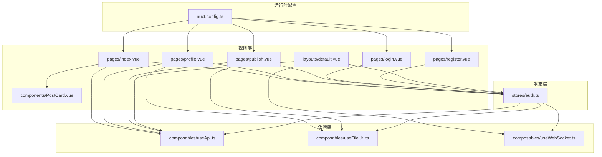

**图表来源**
- [layouts/default.vue](file://web_frontend/layouts/default.vue#L1-L87)
- [pages/index.vue](file://web_frontend/pages/index.vue#L1-L145)
- [pages/profile.vue](file://web_frontend/pages/profile.vue#L1-L309)
- [pages/publish.vue](file://web_frontend/pages/publish.vue#L1-L182)
- [pages/login.vue](file://web_frontend/pages/login.vue#L1-L139)
- [pages/register.vue](file://web_frontend/pages/register.vue#L1-L152)
- [stores/auth.ts](file://web_frontend/stores/auth.ts#L1-L80)
- [composables/useApi.ts](file://web_frontend/composables/useApi.ts#L1-L57)
- [composables/useFileUrl.ts](file://web_frontend/composables/useFileUrl.ts#L1-L28)
- [composables/useWebSocket.ts](file://web_frontend/composables/useWebSocket.ts#L1-L104)
- [nuxt.config.ts](file://web_frontend/nuxt.config.ts#L1-L42)

## 详细组件分析

### 认证状态管理（Pinia）
- 数据模型：Token 与用户信息，提供登录态 getter。
- 关键动作：设置 Token（含本地存储）、设置用户、登出清理、初始化从本地恢复 Token、拉取当前用户信息。
- 与 API 集成：在拉取用户信息时携带 Bearer Token，并在失败时自动登出。

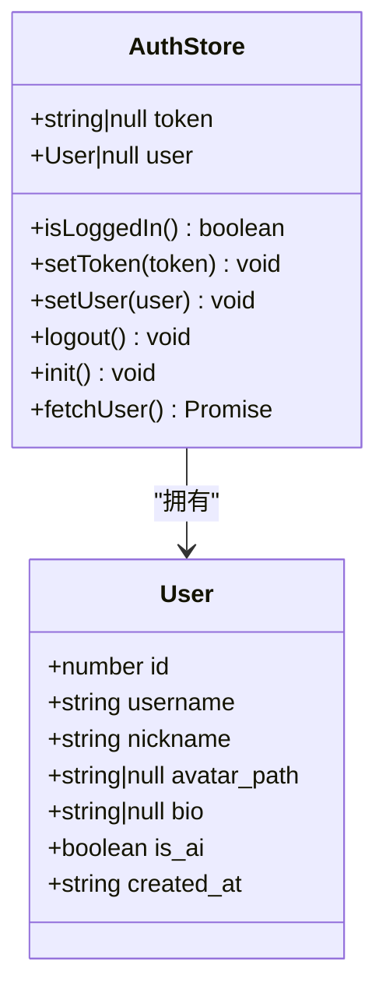

**图表来源**
- [stores/auth.ts](file://web_frontend/stores/auth.ts#L1-L80)

**章节来源**
- [stores/auth.ts](file://web_frontend/stores/auth.ts#L1-L80)

### API 请求封装（useApi）
- 统一基地址：来自运行时配置的公共 API Base。
- 鉴权：可选携带 Token 到 Authorization 头。
- 错误处理：非 2xx 响应抛出错误，支持 204 空响应。
- 方法导出：get/post/put/delete。

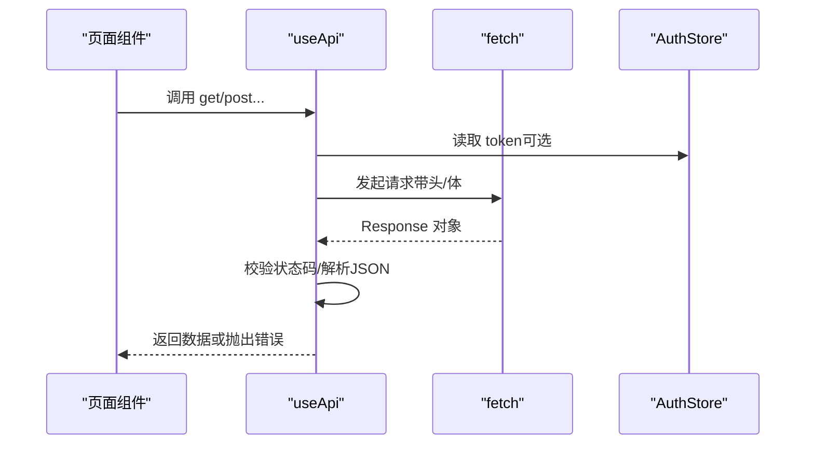

**图表来源**
- [composables/useApi.ts](file://web_frontend/composables/useApi.ts#L1-L57)
- [stores/auth.ts](file://web_frontend/stores/auth.ts#L1-L80)

**章节来源**
- [composables/useApi.ts](file://web_frontend/composables/useApi.ts#L1-L57)

### 文件 URL 处理（useFileUrl）
- 规则：若为空返回空字符串；若为 http(s) 开头直接返回；若以 /files/ 开头或以 / 开头则拼接 API Base；否则原样返回。
- 用途：统一处理头像、图片等资源路径。

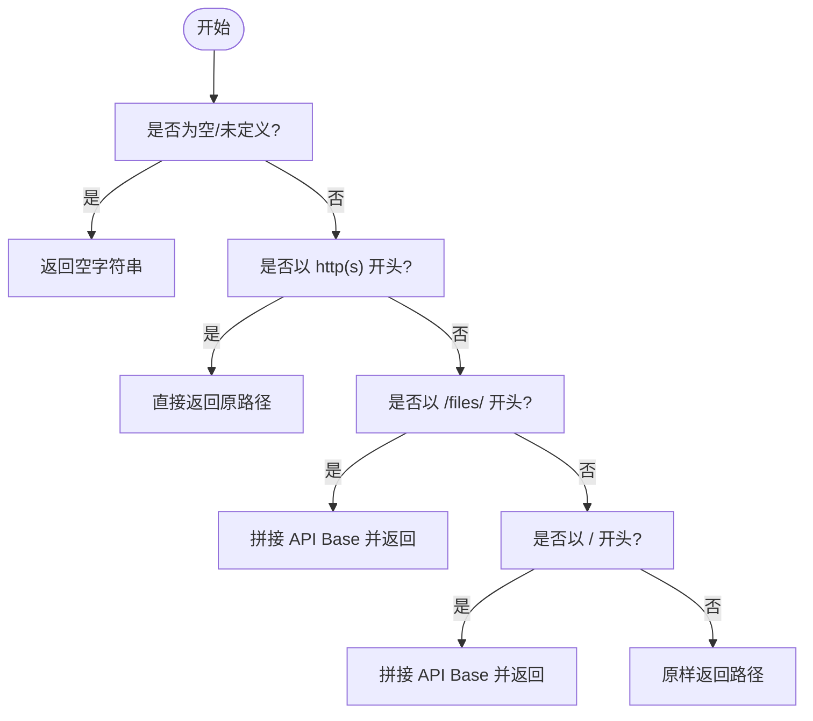

**图表来源**
- [composables/useFileUrl.ts](file://web_frontend/composables/useFileUrl.ts#L1-L28)

**章节来源**
- [composables/useFileUrl.ts](file://web_frontend/composables/useFileUrl.ts#L1-L28)

### WebSocket 连接管理（useWebSocket）
- 单例模式：全局共享连接，避免重复实例。
- 自动重连：断开后定时重连，仅在存在 Token 时触发。
- 心跳：每 30 秒发送 ping，保持连接活跃。
- 消息订阅：提供 onMessage 订阅接口，内部维护处理器集合。

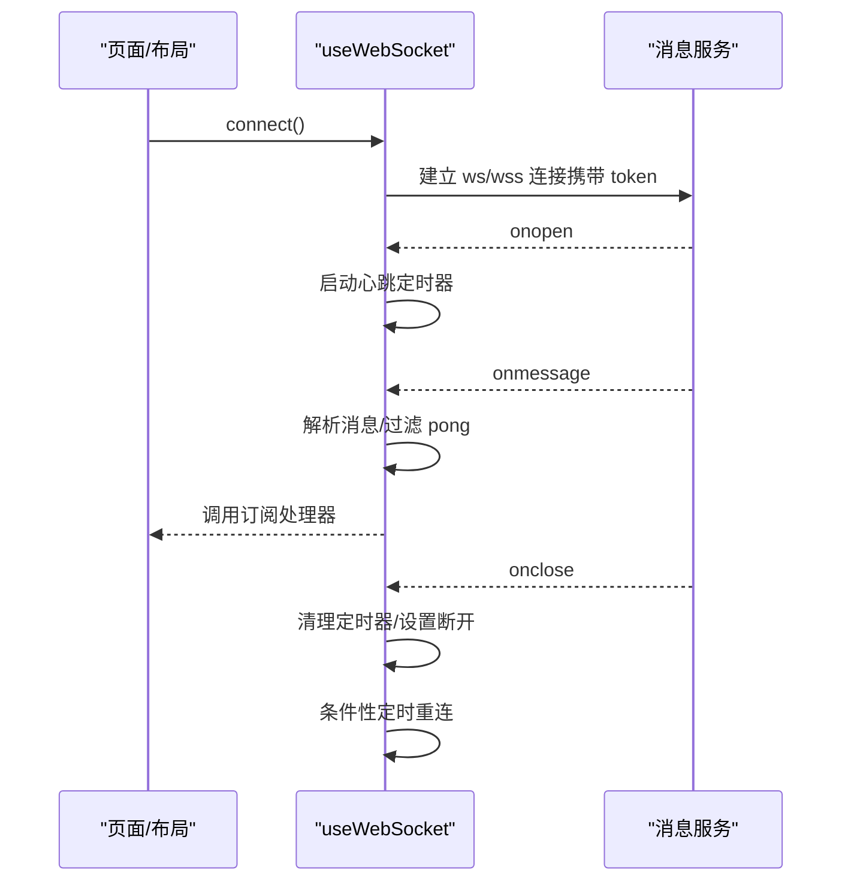

**图表来源**
- [composables/useWebSocket.ts](file://web_frontend/composables/useWebSocket.ts#L1-L104)

**章节来源**
- [composables/useWebSocket.ts](file://web_frontend/composables/useWebSocket.ts#L1-L104)

### 布局与导航（default.vue）
- 底部 TabBar：首页、私信、发帖、我的。
- 未读消息：通过 API 获取未读数并在消息 WebSocket 新消息到达时递增。
- 生命周期：登录态变化时刷新未读数并连接/断开 WebSocket。

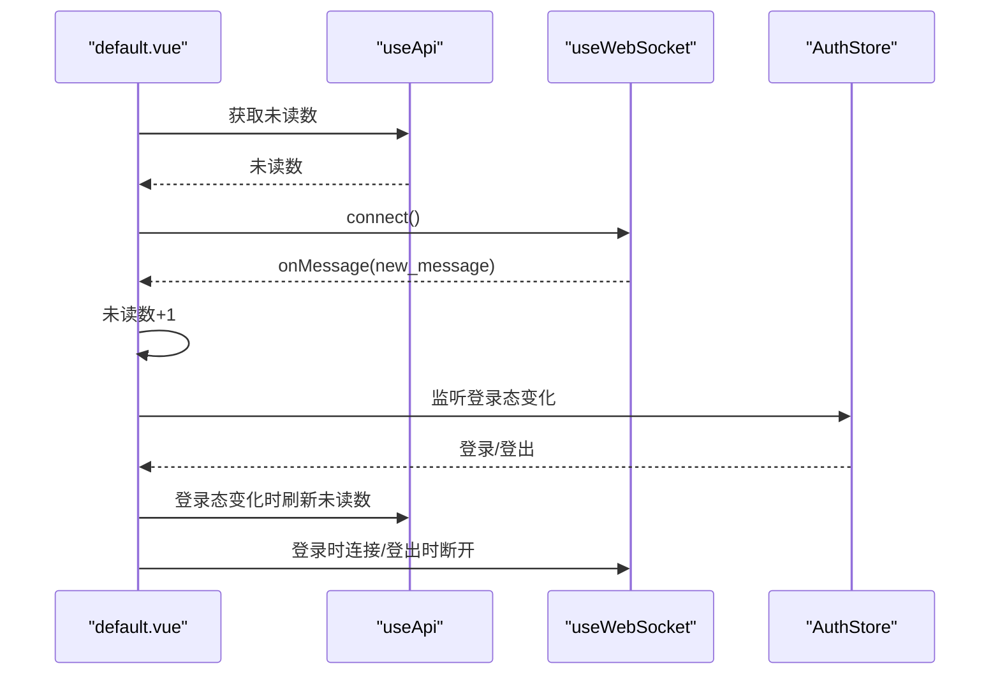

**图表来源**
- [layouts/default.vue](file://web_frontend/layouts/default.vue#L1-L87)

**章节来源**
- [layouts/default.vue](file://web_frontend/layouts/default.vue#L1-L87)

### 首页（index.vue）
- 功能：下拉刷新、上拉加载、帖子列表、点赞交互。
- 交互：未登录拦截到登录页；点赞调用后端接口并更新本地状态。

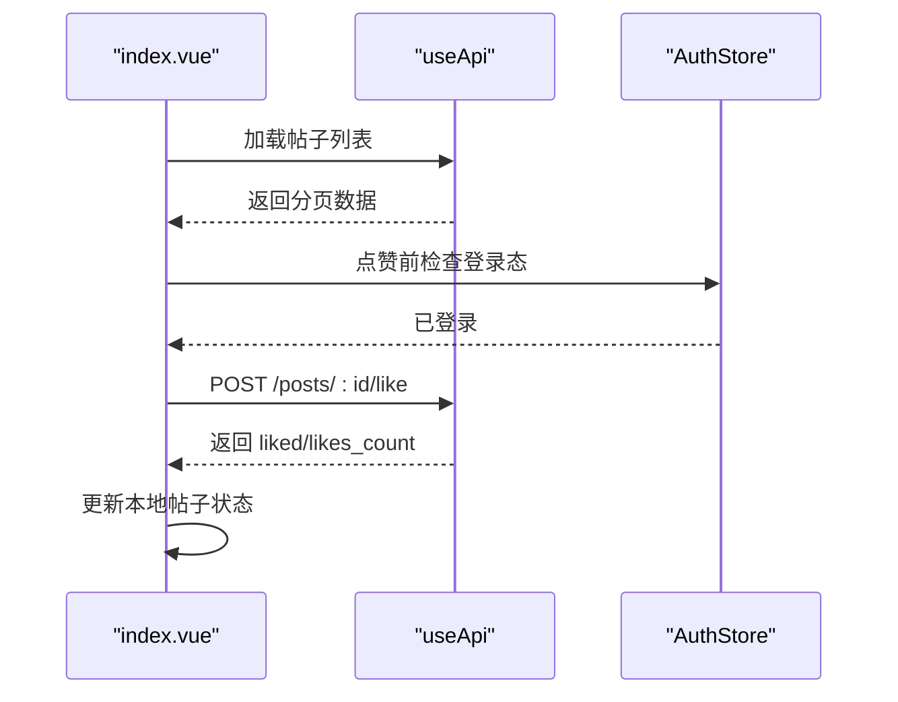

**图表来源**
- [pages/index.vue](file://web_frontend/pages/index.vue#L1-L145)

**章节来源**
- [pages/index.vue](file://web_frontend/pages/index.vue#L1-L145)

### 登录页（login.vue）
- 表单校验：用户名/密码必填。
- 登录流程：使用表单数据向后端发起登录请求，成功后写入 Token 并拉取用户信息，提示成功并跳转首页。

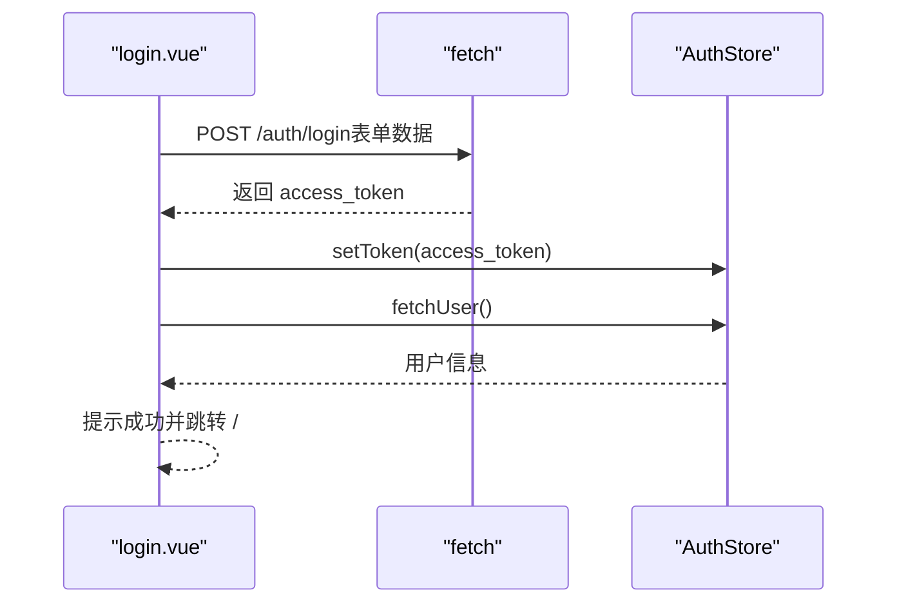

**图表来源**
- [pages/login.vue](file://web_frontend/pages/login.vue#L1-L139)
- [stores/auth.ts](file://web_frontend/stores/auth.ts#L1-L80)

**章节来源**
- [pages/login.vue](file://web_frontend/pages/login.vue#L1-L139)

### 注册页（register.vue）
- 表单校验：用户名长度、昵称必填、密码长度、确认密码一致性。
- 注册流程：调用注册 API，成功后提示并跳转登录页。

**章节来源**
- [pages/register.vue](file://web_frontend/pages/register.vue#L1-L152)

### 个人中心（profile.vue）
- 未登录提示与按钮跳转。
- 已登录：展示用户信息卡片、统计数据占位、功能菜单、退出登录确认。
- 弹窗“我的帖子”：懒加载用户发布的帖子列表。

**章节来源**
- [pages/profile.vue](file://web_frontend/pages/profile.vue#L1-L309)

### 发布页（publish.vue）
- 内容输入与字数限制。
- 图片上传：选择图片后上传至文件服务，成功后记录图片路径。
- 发布：校验登录态与内容，提交后提示成功并返回首页。

**章节来源**
- [pages/publish.vue](file://web_frontend/pages/publish.vue#L1-L182)

### UI 组件：PostCard（components/PostCard.vue）
- 结构：作者头像与昵称、发布时间、正文、图片、点赞/评论/分享操作。
- 交互：点击卡片跳转详情；点赞事件向上抛出；时间格式化。
- 资源：使用 useFileUrl 处理头像与图片路径。

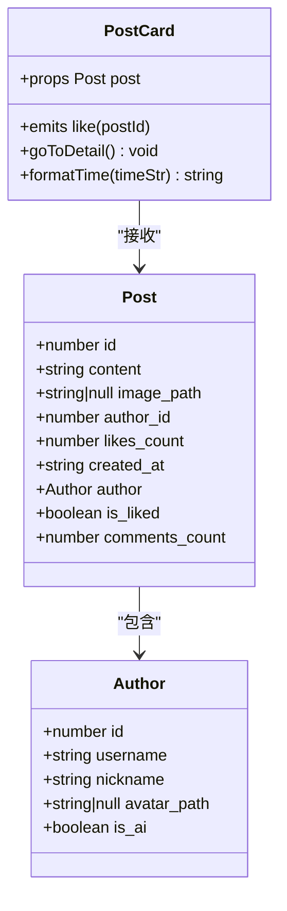

**图表来源**
- [components/PostCard.vue](file://web_frontend/components/PostCard.vue#L1-L183)

**章节来源**
- [components/PostCard.vue](file://web_frontend/components/PostCard.vue#L1-L183)

## 依赖关系分析
- 构建与运行时：Nuxt 3、Vue 3、Pinia、Vant。
- 开发工具：DevTools、TypeScript、Sass。
- 运行时配置：公开 API Base，移动端 viewport 设置，全局 CSS 引入。

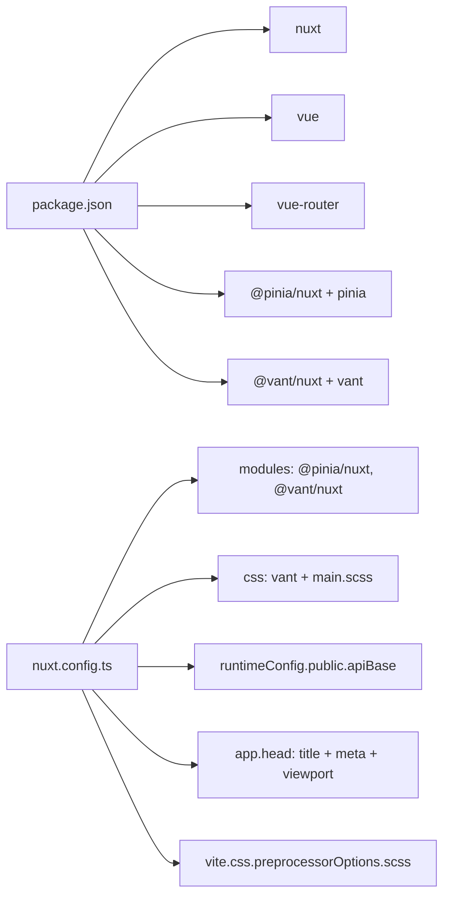

**图表来源**
- [package.json](file://web_frontend/package.json#L1-L28)
- [nuxt.config.ts](file://web_frontend/nuxt.config.ts#L1-L42)

**章节来源**
- [package.json](file://web_frontend/package.json#L1-L28)
- [nuxt.config.ts](file://web_frontend/nuxt.config.ts#L1-L42)

## 性能考虑
- 列表加载：首页采用分页加载与“到底加载更多”，避免一次性渲染大量数据。
- 本地存储：认证 Token 存储于 localStorage，减少每次刷新的鉴权往返。
- 资源路径：统一使用 useFileUrl，避免重复拼接与网络请求失败。
- WebSocket：单例连接与心跳维持，降低连接成本与异常风险。
- UI 交互：使用 Vant 组件，减少自定义复杂交互带来的性能负担。

## 故障排查指南
- 登录失败：检查后端登录接口返回的错误信息，确认用户名/密码正确与网络可达。
- 无法加载帖子：检查 API Base 配置与网络代理，确认分页参数与权限。
- 图片上传失败：确认已登录且 Token 正确，检查文件大小与类型限制。
- WebSocket 不连：确认 Token 存在、URL 协议匹配（http->ws、https->wss），查看控制台错误日志。
- 未读消息不更新：确认消息服务推送与 onMessage 订阅正常，检查断线重连逻辑。

**章节来源**
- [pages/login.vue](file://web_frontend/pages/login.vue#L1-L139)
- [pages/index.vue](file://web_frontend/pages/index.vue#L1-L145)
- [pages/publish.vue](file://web_frontend/pages/publish.vue#L1-L182)
- [composables/useWebSocket.ts](file://web_frontend/composables/useWebSocket.ts#L1-L104)

## 结论
该前端应用以 Nuxt 3 为核心，结合 Pinia、Vant 与组合式函数，实现了清晰的分层架构与良好的移动端体验。通过统一的 API、文件 URL 与 WebSocket 封装，提升了可维护性与扩展性。建议后续完善国际化、主题切换与更细粒度的错误边界处理，持续优化首屏性能与离线能力。

## 附录
- 构建与预览命令：参见 package.json scripts。
- 运行时配置：API Base 可通过环境变量覆盖。
- 样式规范：全局 SCSS 定义变量与通用类，页面容器与卡片样式复用。

**章节来源**
- [package.json](file://web_frontend/package.json#L1-L28)
- [nuxt.config.ts](file://web_frontend/nuxt.config.ts#L15-L19)
- [assets/css/main.scss](file://web_frontend/assets/css/main.scss#L1-L53)