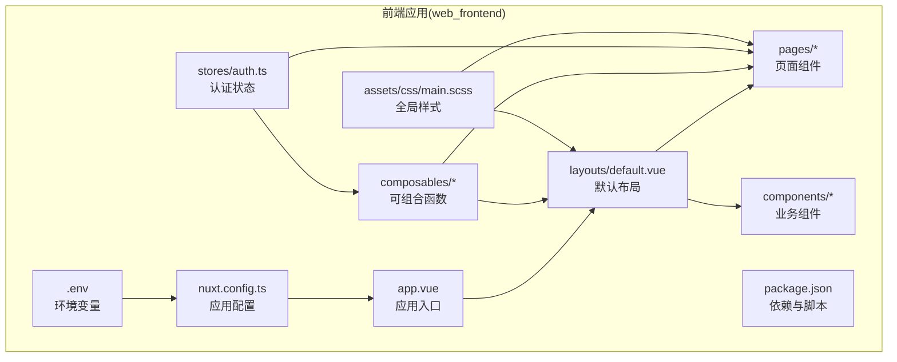
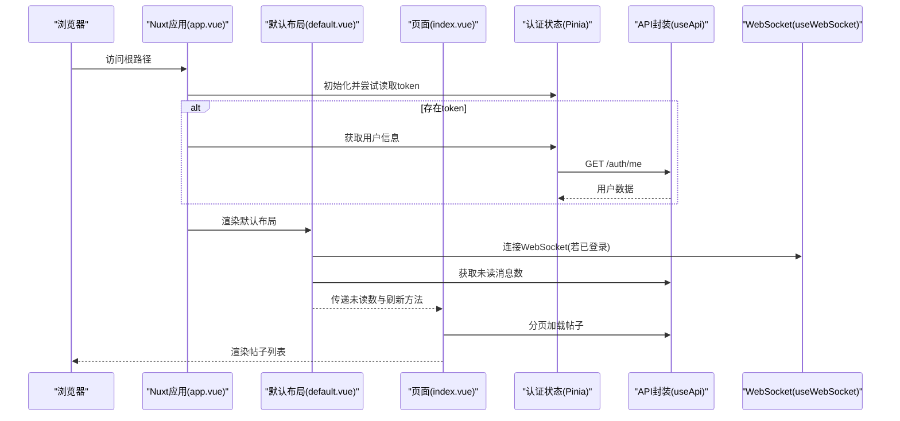
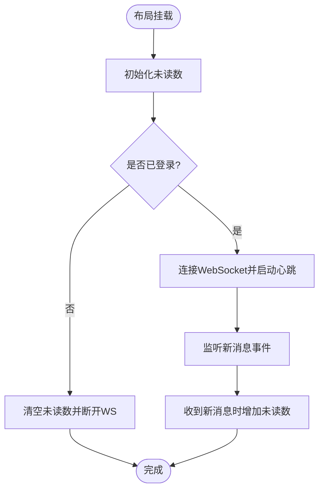
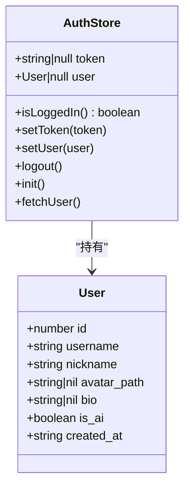
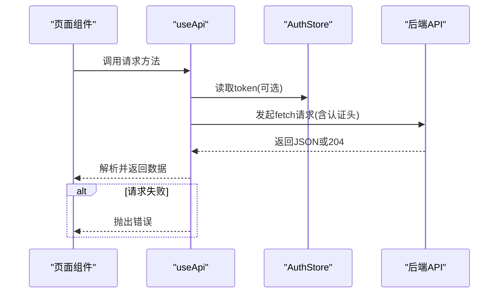
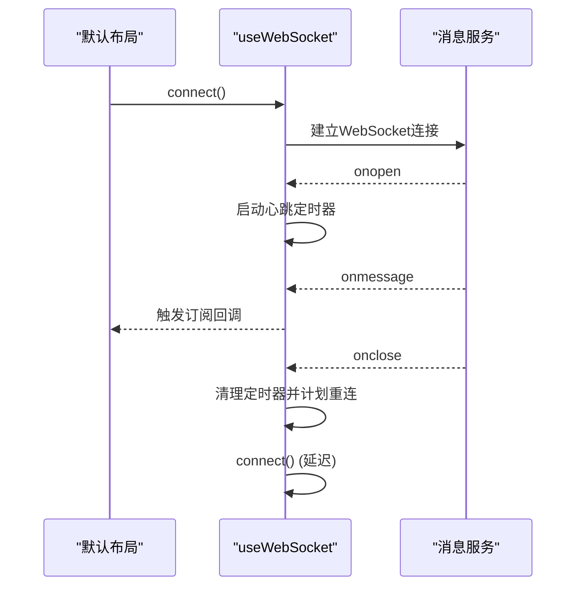
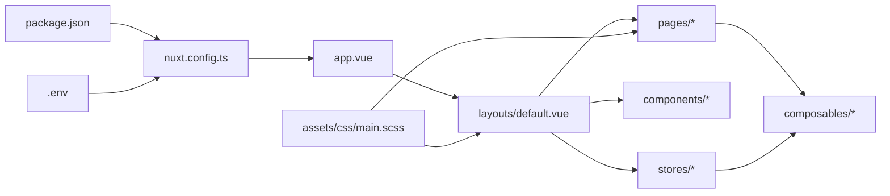

# 应用架构

<cite>
**本文引用的文件**
- [nuxt.config.ts](file://web_frontend/nuxt.config.ts)
- [package.json](file://web_frontend/package.json)
- [app.vue](file://web_frontend/app.vue)
- [default.vue](file://web_frontend/layouts/default.vue)
- [auth.ts](file://web_frontend/stores/auth.ts)
- [main.scss](file://web_frontend/assets/css/main.scss)
- [useApi.ts](file://web_frontend/composables/useApi.ts)
- [useWebSocket.ts](file://web_frontend/composables/useWebSocket.ts)
- [index.vue](file://web_frontend/pages/index.vue)
- [.env](file://web_frontend/.env)
- [login.vue](file://web_frontend/pages/login.vue)
- [PostCard.vue](file://web_frontend/components/PostCard.vue)
- [messages/index.vue](file://web_frontend/pages/messages/index.vue)
- [profile.vue](file://web_frontend/pages/profile.vue)
- [useFileUrl.ts](file://web_frontend/composables/useFileUrl.ts)
- [tsconfig.json](file://web_frontend/tsconfig.json)
</cite>

## 目录
1. [简介](#简介)
2. [项目结构](#项目结构)
3. [核心组件](#核心组件)
4. [架构总览](#架构总览)
5. [详细组件分析](#详细组件分析)
6. [依赖关系分析](#依赖关系分析)
7. [性能考量](#性能考量)
8. [故障排查指南](#故障排查指南)
9. [结论](#结论)
10. [附录](#附录)

## 简介
本文件面向AI社区前端应用，系统性阐述基于 Nuxt 3 + Vue 3 的现代前端架构设计与实现要点。重点覆盖应用配置文件结构与职责、模块化集成（Pinia 状态管理、Vant 移动端组件库）、运行时配置与 CSS 导入策略、构建与开发工具设置、应用入口与头部元数据、布局系统设计理念（默认布局、响应式与移动端适配），并提供架构决策的技术背景、性能优化建议与最佳实践。

## 项目结构
前端工程位于 web_frontend 目录，采用 Nuxt 3 推荐的目录组织方式：页面 pages、布局 layouts、组件 components、状态 stores、可组合函数 composables、静态资源 assets、以及根级配置文件。整体结构清晰、职责分明，便于扩展与维护。

图表来源
- [nuxt.config.ts](file://web_frontend/nuxt.config.ts#L1-L42)
- [package.json](file://web_frontend/package.json#L1-L28)
- [app.vue](file://web_frontend/app.vue#L1-L17)
- [default.vue](file://web_frontend/layouts/default.vue#L1-L87)
- [main.scss](file://web_frontend/assets/css/main.scss#L1-L53)
- [auth.ts](file://web_frontend/stores/auth.ts#L1-L80)
- [useApi.ts](file://web_frontend/composables/useApi.ts#L1-L57)
- [useWebSocket.ts](file://web_frontend/composables/useWebSocket.ts#L1-L104)
- [index.vue](file://web_frontend/pages/index.vue#L1-L145)
- [.env](file://web_frontend/.env#L1-L2)

章节来源
- [nuxt.config.ts](file://web_frontend/nuxt.config.ts#L1-L42)
- [package.json](file://web_frontend/package.json#L1-L28)
- [app.vue](file://web_frontend/app.vue#L1-L17)
- [default.vue](file://web_frontend/layouts/default.vue#L1-L87)
- [main.scss](file://web_frontend/assets/css/main.scss#L1-L53)
- [auth.ts](file://web_frontend/stores/auth.ts#L1-L80)
- [useApi.ts](file://web_frontend/composables/useApi.ts#L1-L57)
- [useWebSocket.ts](file://web_frontend/composables/useWebSocket.ts#L1-L104)
- [index.vue](file://web_frontend/pages/index.vue#L1-L145)
- [.env](file://web_frontend/.env#L1-L2)

## 核心组件
- 应用配置与模块集成：通过 nuxt.config.ts 配置 Pinia 与 Vant 模块、CSS 导入顺序、运行时配置与开发工具等。
- 状态管理：使用 Pinia 定义认证状态仓库，集中管理 token、用户信息与登录态。
- 可组合函数：封装 API 请求、WebSocket 连接、文件 URL 处理等横切能力。
- 页面与布局：默认布局统一底部导航与未读消息提醒；页面组件负责具体业务逻辑。
- 入口与元数据：app.vue 负责初始化认证状态；nuxt.config.ts 设置标题与 viewport 等 head 元数据。

章节来源
- [nuxt.config.ts](file://web_frontend/nuxt.config.ts#L1-L42)
- [auth.ts](file://web_frontend/stores/auth.ts#L1-L80)
- [useApi.ts](file://web_frontend/composables/useApi.ts#L1-L57)
- [useWebSocket.ts](file://web_frontend/composables/useWebSocket.ts#L1-L104)
- [app.vue](file://web_frontend/app.vue#L1-L17)
- [default.vue](file://web_frontend/layouts/default.vue#L1-L87)

## 架构总览
下图展示从入口到页面、布局与状态管理的整体交互流程，体现 Nuxt 3 的约定式路由与组件化架构优势。

图表来源
- [app.vue](file://web_frontend/app.vue#L1-L17)
- [default.vue](file://web_frontend/layouts/default.vue#L1-L87)
- [index.vue](file://web_frontend/pages/index.vue#L1-L145)
- [auth.ts](file://web_frontend/stores/auth.ts#L1-L80)
- [useApi.ts](file://web_frontend/composables/useApi.ts#L1-L57)
- [useWebSocket.ts](file://web_frontend/composables/useWebSocket.ts#L1-L104)

## 详细组件分析

### 应用配置与模块系统
- 模块集成：启用 @pinia/nuxt 与 @vant/nuxt，自动注入 Pinia 与 Vant 组件生态。
- CSS 导入策略：优先加载 Vant 样式，再加载自定义 SCSS，保证主题变量与组件样式正确覆盖。
- 运行时配置：通过 runtimeConfig.public 暴露 API 基础地址，支持环境变量覆盖。
- 开发工具：开启 DevTools，提升调试效率。
- 头部与元数据：设置标题、字符集、viewport 与描述，移动端友好。

章节来源
- [nuxt.config.ts](file://web_frontend/nuxt.config.ts#L1-L42)
- [package.json](file://web_frontend/package.json#L1-L28)

### 应用入口与初始化
- app.vue 作为应用根组件，负责在挂载阶段初始化认证状态，并在存在 token 时拉取用户信息，确保页面渲染前具备必要的登录态。

章节来源
- [app.vue](file://web_frontend/app.vue#L1-L17)

### 默认布局与底部导航
- 设计理念：统一承载页面内容与底部 TabBar，提供全局未读消息提醒与 WebSocket 事件处理。
- 响应式与移动端适配：使用 Vant Tabbar 的 route 模式与 fixed、placeholder 属性，结合全局 SCSS 变量与容器样式，确保在不同设备上的一致体验。
- 未读消息与实时通信：在 mounted 中拉取未读数并建立 WebSocket 连接；监听登录状态变化与路由切换，动态刷新未读数；通过 provide/inject 将刷新方法暴露给子组件。

图表来源
- [default.vue](file://web_frontend/layouts/default.vue#L1-L87)

章节来源
- [default.vue](file://web_frontend/layouts/default.vue#L1-L87)

### 认证状态管理（Pinia）
- 数据模型：包含 token 与用户信息，提供 isLoggedIn getter 与 setToken、setUser、logout、init、fetchUser 等 actions。
- 本地持久化：在客户端使用 localStorage 存储 token，避免刷新丢失。
- 错误处理：获取用户信息失败时自动登出，保证状态一致性。

图表来源
- [auth.ts](file://web_frontend/stores/auth.ts#L1-L80)

章节来源
- [auth.ts](file://web_frontend/stores/auth.ts#L1-L80)

### API 请求封装（可组合函数）
- 统一基座：基于 useRuntimeConfig.public.apiBase 构造请求地址。
- 认证头：根据选项自动附加 Bearer Token。
- 错误处理：对非 2xx 响应抛出可读错误，204 特殊处理返回 null。
- 方法别名：提供 get/post/put/delete 简化调用。

图表来源
- [useApi.ts](file://web_frontend/composables/useApi.ts#L1-L57)
- [auth.ts](file://web_frontend/stores/auth.ts#L1-L80)

章节来源
- [useApi.ts](file://web_frontend/composables/useApi.ts#L1-L57)

### WebSocket 封装（全局单例）
- 单例模式：通过闭包变量与共享状态确保全局仅有一个连接实例。
- 自动重连：断线后定时重连，避免因网络波动导致长期不可用。
- 心跳机制：每 30 秒发送 ping，维持连接活性。
- 事件分发：提供 onMessage 订阅接口，解耦消息处理逻辑。

图表来源
- [useWebSocket.ts](file://web_frontend/composables/useWebSocket.ts#L1-L104)
- [default.vue](file://web_frontend/layouts/default.vue#L1-L87)

章节来源
- [useWebSocket.ts](file://web_frontend/composables/useWebSocket.ts#L1-L104)

### 文件 URL 处理
- 适配多类型路径：对 http(s) 开头、/files/ 开头与其它相对路径进行统一拼接，确保图片等资源可被正确访问。
- 与运行时配置联动：基于 runtimeConfig.public.apiBase 动态拼接完整 URL。

章节来源
- [useFileUrl.ts](file://web_frontend/composables/useFileUrl.ts#L1-L28)

### 页面组件与业务逻辑
- 首页（帖子流）：实现下拉刷新与无限滚动，按页加载帖子；对点赞操作进行鉴权与状态更新。
- 登录页：使用表单校验与 OAuth2 规范的表单数据提交，成功后写入 token 并跳转首页。
- 私信列表：展示会话与最后一条消息预览，结合 WebSocket 实时刷新。
- 个人中心：展示用户信息与统计数据，提供我的帖子弹窗列表与退出登录功能。

章节来源
- [index.vue](file://web_frontend/pages/index.vue#L1-L145)
- [login.vue](file://web_frontend/pages/login.vue#L1-L139)
- [messages/index.vue](file://web_frontend/pages/messages/index.vue#L1-L198)
- [profile.vue](file://web_frontend/pages/profile.vue#L1-L309)

### 布局系统与移动端适配
- 统一容器：全局 SCSS 提供 page-container 与卡片样式，保证页面间距与阴影一致。
- 底部导航：Vant Tabbar 固定在底部，结合 badge 显示未读数，路由模式与图标配合良好。
- 响应式原则：通过 viewport 控制缩放与触摸缩放限制，结合组件的 fixed/placeholder 属性，确保在移动设备上的可用性。

章节来源
- [default.vue](file://web_frontend/layouts/default.vue#L1-L87)
- [main.scss](file://web_frontend/assets/css/main.scss#L1-L53)
- [nuxt.config.ts](file://web_frontend/nuxt.config.ts#L21-L30)

## 依赖关系分析
- 应用层依赖：pages 依赖 composables 与 stores；layouts 依赖 composables 与 stores；components 依赖 composables 与 useFileUrl。
- 配置层依赖：nuxt.config.ts 决定模块注入与运行时配置；package.json 确定版本与脚本。
- 环境层：.env 通过 NUXT_PUBLIC_* 注入到 public runtimeConfig。

图表来源
- [package.json](file://web_frontend/package.json#L1-L28)
- [nuxt.config.ts](file://web_frontend/nuxt.config.ts#L1-L42)
- [app.vue](file://web_frontend/app.vue#L1-L17)
- [default.vue](file://web_frontend/layouts/default.vue#L1-L87)
- [main.scss](file://web_frontend/assets/css/main.scss#L1-L53)
- [.env](file://web_frontend/.env#L1-L2)

章节来源
- [package.json](file://web_frontend/package.json#L1-L28)
- [nuxt.config.ts](file://web_frontend/nuxt.config.ts#L1-L42)
- [app.vue](file://web_frontend/app.vue#L1-L17)
- [default.vue](file://web_frontend/layouts/default.vue#L1-L87)
- [main.scss](file://web_frontend/assets/css/main.scss#L1-L53)
- [.env](file://web_frontend/.env#L1-L2)

## 性能考量
- 请求与缓存：useApi 对 204 做特殊处理，减少不必要的解析；可结合业务场景引入本地缓存策略。
- WebSocket：心跳与自动重连降低断线风险；建议在高并发场景下限制订阅数量与消息频率。
- 图片与资源：useFileUrl 统一拼接完整 URL，避免重复请求；建议对图片添加懒加载与尺寸控制。
- 样式体积：全局 SCSS 提供变量与通用类，减少重复样式；按需引入 Vant 组件以减小打包体积。
- 构建优化：利用 Nuxt 3 的代码分割与 Tree Shaking；生产构建时开启压缩与资源内联策略。

## 故障排查指南
- 登录失败：检查 .env 中 API 基础地址是否正确；确认后端 OAuth2 端点与请求头格式。
- 未显示未读数：确认已登录且 WebSocket 已连接；检查布局中的未读数拉取与刷新逻辑。
- 图片不显示：验证 useFileUrl 的路径规则与 runtimeConfig.public.apiBase 是否匹配。
- 页面空白：检查 TypeScript 配置是否与 Nuxt 生成的 tsconfig 对齐；核对组件类型声明与 props。

章节来源
- [login.vue](file://web_frontend/pages/login.vue#L68-L100)
- [default.vue](file://web_frontend/layouts/default.vue#L23-L75)
- [useFileUrl.ts](file://web_frontend/composables/useFileUrl.ts#L1-L28)
- [tsconfig.json](file://web_frontend/tsconfig.json#L1-L4)

## 结论
该前端架构以 Nuxt 3 为核心，结合 Pinia 与 Vant，实现了清晰的模块化与组件化设计。通过统一的运行时配置、可组合函数与布局系统，既满足了移动端的交互需求，又为后续扩展提供了良好的基础。建议持续关注 WebSocket 与 API 的稳定性、样式与资源的优化，以及 TypeScript 类型体系的完善。

## 附录
- 开发命令：dev/build/generate/preview/postinstall 均已在 package.json 中配置。
- 环境变量：通过 .env 设置 NUXT_PUBLIC_API_BASE，可在部署时覆盖默认值。

章节来源
- [package.json](file://web_frontend/package.json#L6-L12)
- [.env](file://web_frontend/.env#L1-L2)