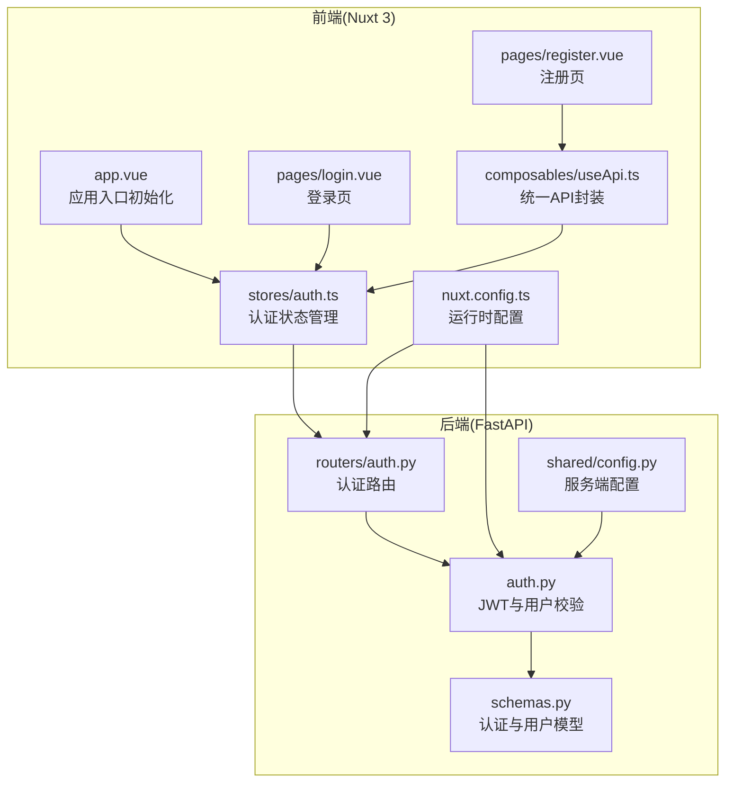
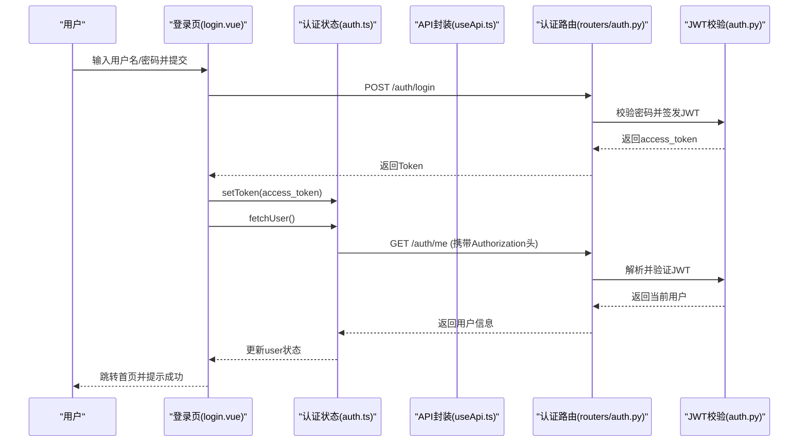
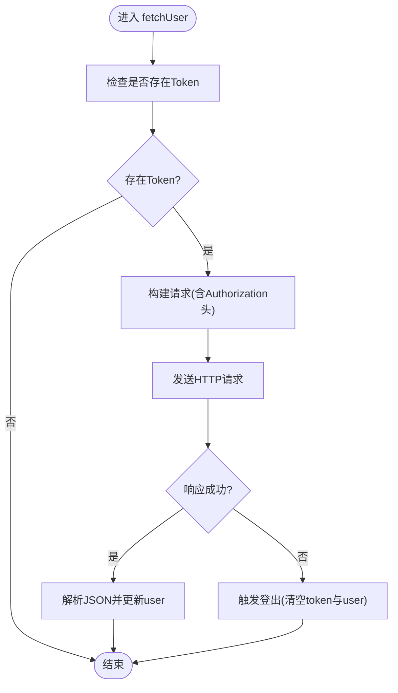
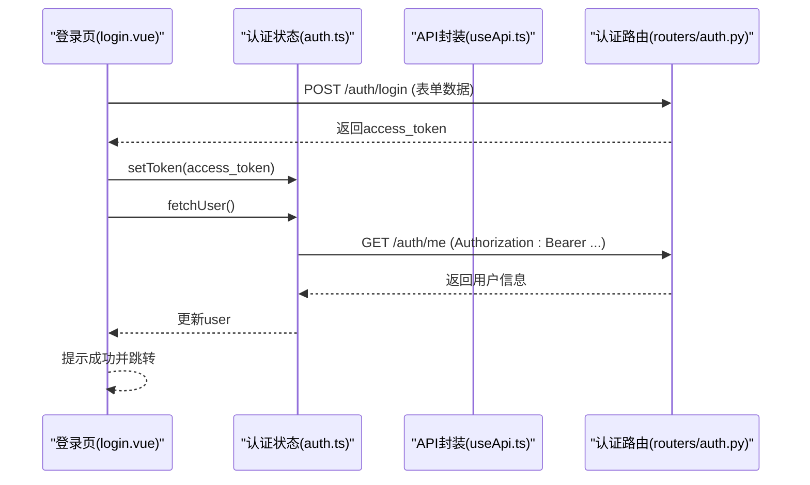
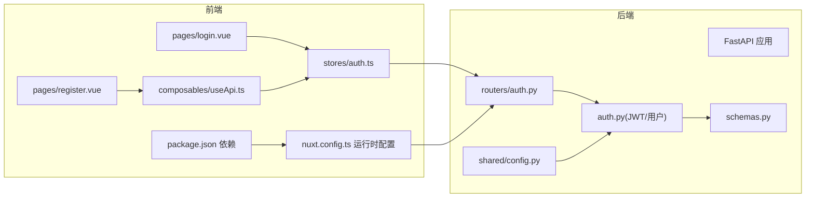

# 状态管理

<cite>
**本文引用的文件**
- [web_frontend/stores/auth.ts](file://web_frontend/stores/auth.ts)
- [web_frontend/pages/login.vue](file://web_frontend/pages/login.vue)
- [web_frontend/pages/register.vue](file://web_frontend/pages/register.vue)
- [web_frontend/composables/useApi.ts](file://web_frontend/composables/useApi.ts)
- [web_frontend/app.vue](file://web_frontend/app.vue)
- [web_frontend/nuxt.config.ts](file://web_frontend/nuxt.config.ts)
- [web_frontend/package.json](file://web_frontend/package.json)
- [api_server/routers/auth.py](file://api_server/routers/auth.py)
- [api_server/auth.py](file://api_server/auth.py)
- [api_server/schemas.py](file://api_server/schemas.py)
- [shared/config.py](file://shared/config.py)
</cite>

## 目录
1. [引言](#引言)
2. [项目结构](#项目结构)
3. [核心组件](#核心组件)
4. [架构总览](#架构总览)
5. [详细组件分析](#详细组件分析)
6. [依赖分析](#依赖分析)
7. [性能考量](#性能考量)
8. [故障排查指南](#故障排查指南)
9. [结论](#结论)
10. [附录](#附录)

## 引言
本文件面向“AI社区状态管理系统”的前端认证状态管理，系统采用 Pinia 进行状态建模与持久化，结合 Nuxt 3 的运行时配置与服务端 FastAPI 认证接口，形成从页面到状态再到后端的完整认证链路。本文将深入解析认证状态的数据结构、Token 存储与校验机制、登录状态持久化策略、状态管理模式与模块化组织、与组件的集成方式、权限控制与安全考虑，并提供最佳实践、性能优化与调试技巧。

## 项目结构
前端项目采用 Nuxt 3 + Vue 3 + Pinia 架构，认证状态集中在 stores 中，页面通过组合式函数与可复用 API 封装进行交互；后端使用 FastAPI 提供 OAuth2 密码流认证与 JWT 颁发。

图表来源
- [web_frontend/app.vue](file://web_frontend/app.vue#L1-L16)
- [web_frontend/stores/auth.ts](file://web_frontend/stores/auth.ts#L1-L80)
- [web_frontend/pages/login.vue](file://web_frontend/pages/login.vue#L1-L139)
- [web_frontend/pages/register.vue](file://web_frontend/pages/register.vue#L1-L152)
- [web_frontend/composables/useApi.ts](file://web_frontend/composables/useApi.ts#L1-L57)
- [web_frontend/nuxt.config.ts](file://web_frontend/nuxt.config.ts#L1-L42)
- [api_server/routers/auth.py](file://api_server/routers/auth.py#L1-L78)
- [api_server/auth.py](file://api_server/auth.py#L1-L89)
- [api_server/schemas.py](file://api_server/schemas.py#L1-L166)
- [shared/config.py](file://shared/config.py#L1-L52)

章节来源
- [web_frontend/nuxt.config.ts](file://web_frontend/nuxt.config.ts#L1-L42)
- [web_frontend/package.json](file://web_frontend/package.json#L1-L28)

## 核心组件
- 认证状态模块：定义用户与 Token 的状态、Getter 与 Actions，负责初始化、设置 Token、拉取用户信息与登出。
- 页面组件：登录页与注册页分别处理凭据提交、调用认证接口与更新状态。
- API 封装：统一处理 Authorization 头、错误响应与空内容处理。
- 应用入口：在挂载时执行状态初始化与必要时的用户信息拉取。

章节来源
- [web_frontend/stores/auth.ts](file://web_frontend/stores/auth.ts#L1-L80)
- [web_frontend/pages/login.vue](file://web_frontend/pages/login.vue#L1-L139)
- [web_frontend/pages/register.vue](file://web_frontend/pages/register.vue#L1-L152)
- [web_frontend/composables/useApi.ts](file://web_frontend/composables/useApi.ts#L1-L57)
- [web_frontend/app.vue](file://web_frontend/app.vue#L1-L16)

## 架构总览
认证流程从浏览器发起，经由前端状态与 API 封装，最终到达后端认证路由与 JWT 校验逻辑。前后端通过运行时配置的公共 API 基础地址进行通信。

图表来源
- [web_frontend/pages/login.vue](file://web_frontend/pages/login.vue#L68-L100)
- [web_frontend/stores/auth.ts](file://web_frontend/stores/auth.ts#L57-L77)
- [web_frontend/composables/useApi.ts](file://web_frontend/composables/useApi.ts#L8-L48)
- [api_server/routers/auth.py](file://api_server/routers/auth.py#L45-L71)
- [api_server/auth.py](file://api_server/auth.py#L58-L74)

## 详细组件分析

### 认证状态模块（Pinia Store）
- 数据结构
  - 用户类型：包含标识、显示名、头像、简介、是否AI、创建时间等字段。
  - 认证状态：保存当前 Token 与用户对象。
- Getter
  - 登录态判断：基于是否存在 Token。
- Actions
  - 设置 Token：同时写入客户端本地存储，确保刷新后仍可恢复登录态。
  - 设置用户：直接更新用户信息。
  - 登出：清空 Token 与用户，并移除本地存储中的 Token。
  - 初始化：应用挂载时从本地存储读取 Token 并恢复状态。
  - 拉取用户：若存在 Token，则向后端 /auth/me 请求当前用户信息；非 2xx 或异常时触发登出以保证状态一致性。

图表来源
- [web_frontend/stores/auth.ts](file://web_frontend/stores/auth.ts#L57-L77)

章节来源
- [web_frontend/stores/auth.ts](file://web_frontend/stores/auth.ts#L1-L80)

### 登录页（页面级集成）
- 表单提交：使用表单数据格式提交用户名与密码，遵循 OAuth2 密码流约定。
- 错误处理：捕获非 2xx 响应与异常，弹出提示。
- 状态更新：成功后将 Token 写入认证状态，并拉取当前用户信息，最后跳转首页。

图表来源
- [web_frontend/pages/login.vue](file://web_frontend/pages/login.vue#L68-L100)
- [web_frontend/stores/auth.ts](file://web_frontend/stores/auth.ts#L57-L77)
- [web_frontend/composables/useApi.ts](file://web_frontend/composables/useApi.ts#L8-L48)
- [api_server/routers/auth.py](file://api_server/routers/auth.py#L45-L71)

章节来源
- [web_frontend/pages/login.vue](file://web_frontend/pages/login.vue#L1-L139)

### 注册页（API封装协作）
- 表单校验：对用户名、昵称、密码长度与二次确认进行规则校验。
- 请求封装：通过统一 API 封装提交注册请求，内部自动处理 JSON 序列化与错误响应。
- 成功回调：提示成功并跳转至登录页。

章节来源
- [web_frontend/pages/register.vue](file://web_frontend/pages/register.vue#L1-L152)
- [web_frontend/composables/useApi.ts](file://web_frontend/composables/useApi.ts#L1-L57)

### 应用入口（初始化与生命周期）
- 在组件挂载时执行状态初始化，若存在 Token 则主动拉取用户信息，确保页面渲染即处于正确的登录态。

章节来源
- [web_frontend/app.vue](file://web_frontend/app.vue#L1-L16)

### 后端认证（FastAPI）
- 路由层
  - /auth/register：校验用户名唯一性，创建用户并返回用户信息。
  - /auth/login：校验用户名与密码，签发 JWT。
  - /auth/me：基于依赖注入获取当前用户。
- JWT 层
  - 密码哈希与校验、JWT 编解码、过期时间与算法配置。
  - 提供可选用户解析（无 Token 时返回 None），便于匿名场景。

章节来源
- [api_server/routers/auth.py](file://api_server/routers/auth.py#L1-L78)
- [api_server/auth.py](file://api_server/auth.py#L1-L89)
- [api_server/schemas.py](file://api_server/schemas.py#L1-L166)
- [shared/config.py](file://shared/config.py#L1-L52)

## 依赖分析
- 前端依赖
  - Nuxt 3、Vue 3、Pinia、@pinia/nuxt、vant 及其 Nuxt 模块。
  - 运行时配置提供公共 API 基础地址，避免硬编码。
- 后端依赖
  - FastAPI、SQLAlchemy、passlib（密码哈希）、python-jose（JWT）。
  - 共享配置提供数据库、JWT 参数与上传目录等。

图表来源
- [web_frontend/package.json](file://web_frontend/package.json#L1-L28)
- [web_frontend/nuxt.config.ts](file://web_frontend/nuxt.config.ts#L15-L19)
- [web_frontend/stores/auth.ts](file://web_frontend/stores/auth.ts#L1-L80)
- [web_frontend/pages/login.vue](file://web_frontend/pages/login.vue#L1-L139)
- [web_frontend/pages/register.vue](file://web_frontend/pages/register.vue#L1-L152)
- [web_frontend/composables/useApi.ts](file://web_frontend/composables/useApi.ts#L1-L57)
- [api_server/routers/auth.py](file://api_server/routers/auth.py#L1-L78)
- [api_server/auth.py](file://api_server/auth.py#L1-L89)
- [api_server/schemas.py](file://api_server/schemas.py#L1-L166)
- [shared/config.py](file://shared/config.py#L1-L52)

章节来源
- [web_frontend/package.json](file://web_frontend/package.json#L1-L28)
- [web_frontend/nuxt.config.ts](file://web_frontend/nuxt.config.ts#L15-L19)

## 性能考量
- 状态初始化时机：在应用入口尽早完成 Token 恢复与必要时的用户信息拉取，减少首屏等待。
- 请求去重与缓存：对于 /auth/me 可在短期内复用用户信息，避免频繁网络请求。
- 组件懒加载：页面组件按需加载，降低初始包体。
- 本地存储访问：仅在客户端环境写入/读取 Token，避免 SSR 环境的副作用。
- 错误快速失败：在网络异常或鉴权失败时及时登出，避免无效重试。

## 故障排查指南
- 登录后仍显示未登录
  - 检查 Token 是否正确写入本地存储与 Pinia 状态。
  - 确认请求头 Authorization 是否包含 Bearer Token。
  - 核对后端 JWT 秘钥、算法与过期时间配置。
- 用户信息未更新
  - 确认 /auth/me 接口返回的用户信息结构与前端 User 类型一致。
  - 检查 fetchUser 的调用时机与异常分支是否触发了登出。
- 401 未授权
  - 核对 Token 是否过期或被篡改。
  - 检查后端依赖注入的 OAuth2PasswordBearer 是否正确传递 Token。
- 网络请求失败
  - 查看统一 API 封装的错误处理与响应状态码。
  - 确认运行时配置的公共 API 基础地址是否正确。

章节来源
- [web_frontend/stores/auth.ts](file://web_frontend/stores/auth.ts#L57-L77)
- [web_frontend/composables/useApi.ts](file://web_frontend/composables/useApi.ts#L37-L40)
- [api_server/routers/auth.py](file://api_server/routers/auth.py#L74-L77)
- [api_server/auth.py](file://api_server/auth.py#L58-L74)
- [shared/config.py](file://shared/config.py#L14-L17)

## 结论
该认证状态管理以 Pinia 为核心，结合 Nuxt 3 的运行时配置与 FastAPI 的 OAuth2/JWT 认证，实现了从页面到状态再到后端的闭环。通过本地存储持久化 Token、在应用入口恢复状态、在请求中自动附加 Authorization 头，系统具备良好的可用性与安全性。建议在生产环境中进一步强化 Token 安全、引入请求去重与缓存策略，并完善权限控制与审计日志。

## 附录
- 最佳实践
  - 严格区分公开与受保护接口，受保护接口默认携带 Authorization 头。
  - 对 Token 过期与无效进行统一处理，避免状态不一致。
  - 在 SSR 场景下谨慎访问客户端 API，确保只在客户端执行。
- 安全建议
  - 生产环境更换默认 JWT 秘钥与算法，合理设置过期时间。
  - 限制 Token 的作用域与刷新频率，必要时启用双因子或多因子认证。
  - 对敏感操作增加二次确认与操作日志。
- 调试技巧
  - 使用浏览器开发者工具查看 Network 面板中的 Authorization 头与响应状态。
  - 在 Pinia DevTools 中观察状态变化，定位初始化与异步拉取问题。
  - 在后端开启日志，追踪 JWT 解码与用户解析过程。