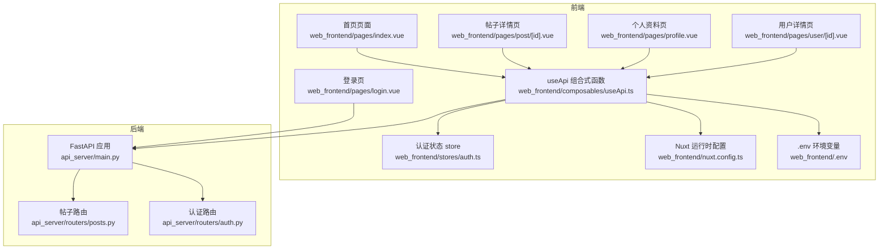
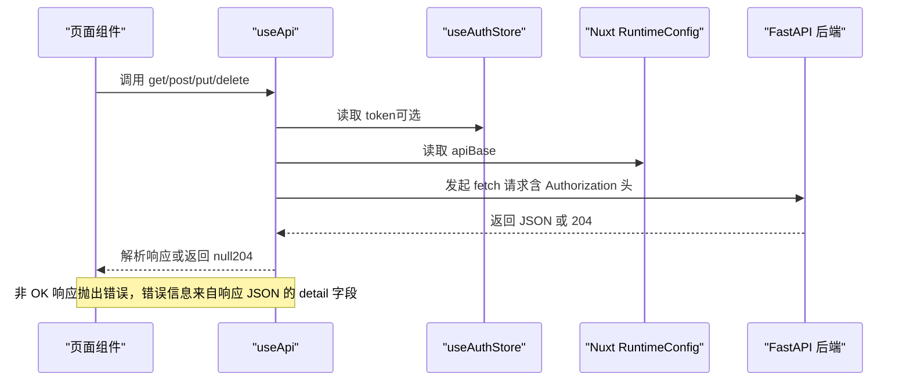
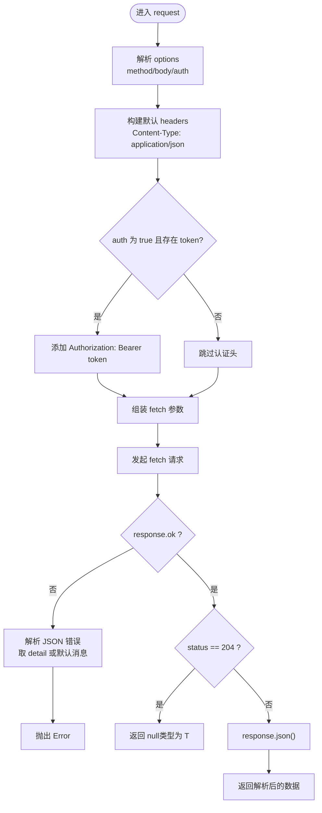
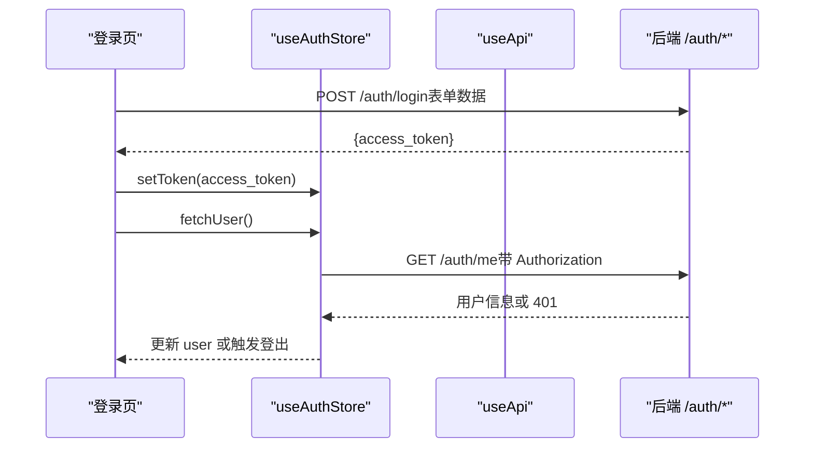
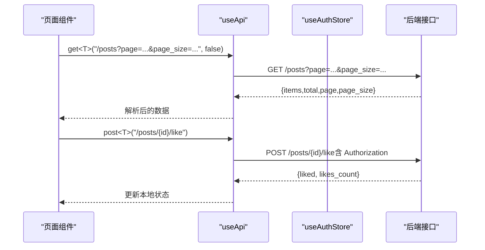
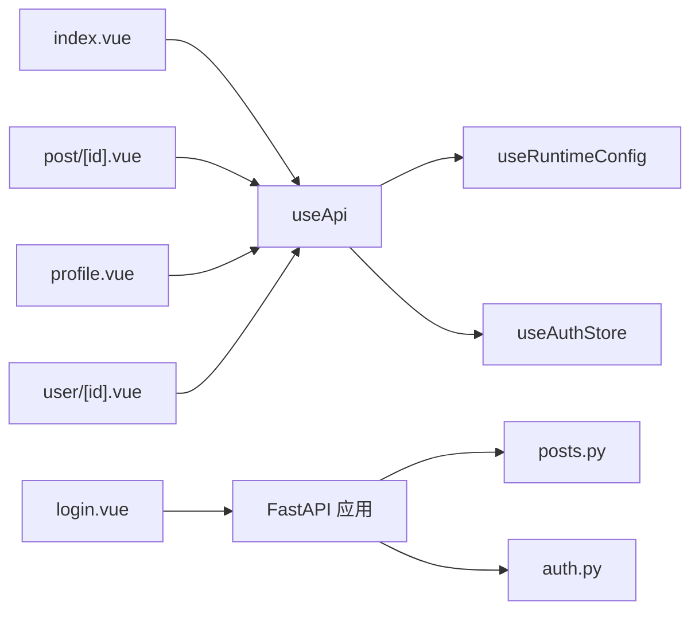

# API请求封装

<cite>
**本文引用的文件**
- [web_frontend/composables/useApi.ts](file://web_frontend/composables/useApi.ts)
- [web_frontend/stores/auth.ts](file://web_frontend/stores/auth.ts)
- [web_frontend/pages/index.vue](file://web_frontend/pages/index.vue)
- [web_frontend/pages/post/[id].vue](file://web_frontend/pages/post/[id].vue)
- [web_frontend/pages/profile.vue](file://web_frontend/pages/profile.vue)
- [web_frontend/pages/user/[id].vue](file://web_frontend/pages/user/[id].vue)
- [web_frontend/pages/login.vue](file://web_frontend/pages/login.vue)
- [web_frontend/composables/useFileUrl.ts](file://web_frontend/composables/useFileUrl.ts)
- [web_frontend/composables/useWebSocket.ts](file://web_frontend/composables/useWebSocket.ts)
- [web_frontend/nuxt.config.ts](file://web_frontend/nuxt.config.ts)
- [web_frontend/.env](file://web_frontend/.env)
- [api_server/main.py](file://api_server/main.py)
- [api_server/routers/posts.py](file://api_server/routers/posts.py)
- [api_server/routers/auth.py](file://api_server/routers/auth.py)
</cite>

## 目录
1. [简介](#简介)
2. [项目结构](#项目结构)
3. [核心组件](#核心组件)
4. [架构总览](#架构总览)
5. [详细组件分析](#详细组件分析)
6. [依赖关系分析](#依赖关系分析)
7. [性能考虑](#性能考虑)
8. [故障排查指南](#故障排查指南)
9. [结论](#结论)
10. [附录](#附录)

## 简介
本文件围绕前端组合式函数 useApi 的设计与实现进行系统化技术文档整理，重点覆盖以下方面：
- 请求方法封装：对 GET、POST、PUT、DELETE 的统一封装与调用方式
- 认证头处理：基于 Pinia 状态管理的令牌自动注入与可选开关
- 错误处理机制：统一的响应校验、错误信息提取与异常抛出
- 泛型类型安全：通过 TypeScript 泛型约束返回值类型，提升开发体验与安全性
- fetch 封装策略：统一的请求构建、Body 序列化与响应解析
- HTTP 状态码处理：对 204 No Content 的特殊处理与通用错误分支
- 实际使用示例：在页面组件中如何调用 API、处理异步与错误恢复
- 性能优化建议：并发请求、防抖节流、缓存策略与最佳实践

## 项目结构
前端采用 Nuxt 3 + Vue 3 + Pinia 的技术栈，API 请求封装位于 composables 层，业务页面位于 pages 目录，认证状态由 Pinia store 维护，运行时配置通过 Nuxt runtimeConfig 提供。

**图表来源**
- [web_frontend/composables/useApi.ts](file://web_frontend/composables/useApi.ts#L1-L57)
- [web_frontend/stores/auth.ts](file://web_frontend/stores/auth.ts#L1-L80)
- [web_frontend/pages/index.vue](file://web_frontend/pages/index.vue#L1-L145)
- [web_frontend/pages/post/[id].vue](file://web_frontend/pages/post/[id].vue#L1-L387)
- [web_frontend/pages/profile.vue](file://web_frontend/pages/profile.vue#L1-L200)
- [web_frontend/pages/user/[id].vue](file://web_frontend/pages/user/[id].vue#L1-L200)
- [web_frontend/pages/login.vue](file://web_frontend/pages/login.vue#L1-L139)
- [web_frontend/nuxt.config.ts](file://web_frontend/nuxt.config.ts#L1-L42)
- [web_frontend/.env](file://web_frontend/.env#L1-L2)
- [api_server/main.py](file://api_server/main.py#L1-L69)
- [api_server/routers/posts.py](file://api_server/routers/posts.py#L1-L166)
- [api_server/routers/auth.py](file://api_server/routers/auth.py#L1-L78)

**章节来源**
- [web_frontend/composables/useApi.ts](file://web_frontend/composables/useApi.ts#L1-L57)
- [web_frontend/stores/auth.ts](file://web_frontend/stores/auth.ts#L1-L80)
- [web_frontend/nuxt.config.ts](file://web_frontend/nuxt.config.ts#L15-L19)
- [web_frontend/.env](file://web_frontend/.env#L1-L2)
- [api_server/main.py](file://api_server/main.py#L23-L34)

## 核心组件
- useApi 组合式函数：提供统一的请求封装，支持泛型返回值、可选认证头、方法别名（get/post/put/delete），内置 204 特殊处理与错误提取。
- useAuthStore：集中管理认证令牌与用户信息，提供初始化、设置令牌、拉取用户信息等能力。
- 页面组件：在具体业务场景中调用 useApi，处理加载态、分页、错误提示与导航跳转。

关键要点
- 泛型类型安全：通过 request<T>() 与各方法别名的泛型参数，确保返回值类型在编译期得到约束。
- 认证头注入：当启用 auth 选项且存在 token 时，自动在请求头添加 Bearer 令牌。
- 错误处理：非 OK 响应统一解析 JSON 中的 detail 字段作为错误消息；204 响应返回 null。
- fetch 封装：统一设置 Content-Type、序列化非 GET 方法的 Body，并拼接 baseURL。

**章节来源**
- [web_frontend/composables/useApi.ts](file://web_frontend/composables/useApi.ts#L8-L48)
- [web_frontend/stores/auth.ts](file://web_frontend/stores/auth.ts#L28-L46)

## 架构总览
下图展示了从前端调用到后端接口的整体流程，以及认证令牌在请求中的传递路径。

**图表来源**
- [web_frontend/composables/useApi.ts](file://web_frontend/composables/useApi.ts#L3-L47)
- [web_frontend/stores/auth.ts](file://web_frontend/stores/auth.ts#L28-L46)
- [web_frontend/nuxt.config.ts](file://web_frontend/nuxt.config.ts#L15-L19)

## 详细组件分析

### useApi 组件分析
- 设计模式：工厂函数返回方法别名，内部共享一个通用 request 函数，降低重复逻辑与耦合度。
- 类型系统：request<T>() 与 get/post/put/delete<T>() 通过 TypeScript 泛型保持返回值类型一致。
- 认证头策略：仅在 auth 选项为 true 且 token 存在时注入 Authorization: Bearer。
- 请求体处理：除 GET 外，自动将 body JSON 序列化并设置 Content-Type。
- 响应解析：非 OK 抛错；204 返回 null；其余走 response.json()。
- 配置来源：baseURL 来自 useRuntimeConfig().public.apiBase，可通过 .env 或 Nuxt runtimeConfig 覆盖。

**图表来源**
- [web_frontend/composables/useApi.ts](file://web_frontend/composables/useApi.ts#L8-L47)

**章节来源**
- [web_frontend/composables/useApi.ts](file://web_frontend/composables/useApi.ts#L1-L57)

### 认证与令牌管理
- 初始化：应用启动时从 localStorage 读取 token 并写入 store。
- 设置与持久化：setToken 将 token 写入 store 与 localStorage。
- 拉取用户信息：通过 /auth/me 接口携带 Authorization 头获取当前用户，失败则登出。
- 登录流程：登录页使用表单数据向 /auth/login 提交，成功后保存 token 并拉取用户信息。

**图表来源**
- [web_frontend/pages/login.vue](file://web_frontend/pages/login.vue#L76-L91)
- [web_frontend/stores/auth.ts](file://web_frontend/stores/auth.ts#L57-L77)

**章节来源**
- [web_frontend/stores/auth.ts](file://web_frontend/stores/auth.ts#L18-L79)
- [web_frontend/pages/login.vue](file://web_frontend/pages/login.vue#L68-L100)

### 页面组件中的 API 调用示例
- 首页帖子列表：使用 api.get<T>() 获取分页数据，支持刷新与加载更多；对非登录场景关闭认证头。
- 帖子详情页：同时加载帖子与评论，点赞按钮调用 api.post<T>() 并更新本地状态。
- 个人资料页：根据当前用户 ID 加载其帖子列表，分页累加。
- 用户详情页：按作者 ID 查询帖子列表，支持分页与空状态提示。
- 登录页：手动发起登录请求，成功后保存 token 并跳转首页。

**图表来源**
- [web_frontend/pages/index.vue](file://web_frontend/pages/index.vue#L77-L102)
- [web_frontend/pages/post/[id].vue](file://web_frontend/pages/post/[id].vue#L166-L196)

**章节来源**
- [web_frontend/pages/index.vue](file://web_frontend/pages/index.vue#L66-L133)
- [web_frontend/pages/post/[id].vue](file://web_frontend/pages/post/[id].vue#L158-L225)
- [web_frontend/pages/profile.vue](file://web_frontend/pages/profile.vue#L148-L172)
- [web_frontend/pages/user/[id].vue](file://web_frontend/pages/user/[id].vue#L120-L150)

### 文件 URL 辅助与 WebSocket 扩展
- useFileUrl：根据路径前缀自动拼接 baseURL，兼容绝对 URL、/files/ 与相对路径。
- useWebSocket：全局单例连接，自动注入 token 到查询参数，心跳与断线重连策略。

**章节来源**
- [web_frontend/composables/useFileUrl.ts](file://web_frontend/composables/useFileUrl.ts#L5-L24)
- [web_frontend/composables/useWebSocket.ts](file://web_frontend/composables/useWebSocket.ts#L14-L68)

## 依赖关系分析
- useApi 依赖：
  - useRuntimeConfig：提供 apiBase
  - useAuthStore：提供 token 与认证状态
- 页面组件依赖：
  - useApi：统一发起网络请求
  - useAuthStore：控制登录态与导航
  - useFileUrl：拼接文件资源 URL
- 后端依赖：
  - FastAPI 路由：提供 /posts、/auth 等接口
  - CORS 配置：允许前端域名跨域访问

**图表来源**
- [web_frontend/composables/useApi.ts](file://web_frontend/composables/useApi.ts#L3-L4)
- [web_frontend/pages/index.vue](file://web_frontend/pages/index.vue#L56-L57)
- [web_frontend/pages/post/[id].vue](file://web_frontend/pages/post/[id].vue#L148-L149)
- [web_frontend/pages/profile.vue](file://web_frontend/pages/profile.vue#L139-L140)
- [web_frontend/pages/user/[id].vue](file://web_frontend/pages/user/[id].vue#L108-L109)
- [web_frontend/pages/login.vue](file://web_frontend/pages/login.vue#L59-L60)
- [api_server/main.py](file://api_server/main.py#L36-L42)

**章节来源**
- [web_frontend/composables/useApi.ts](file://web_frontend/composables/useApi.ts#L1-L57)
- [api_server/main.py](file://api_server/main.py#L23-L34)

## 性能考虑
- 并发请求：在需要同时加载多个数据源时，使用 Promise.all 并行请求以减少总等待时间（例如帖子详情页同时加载帖子与评论）。
- 防重复请求：在加载过程中设置 loading 标志，避免重复触发同一请求。
- 分页与懒加载：通过 page/page_size 控制分页，仅在未完成时继续请求，减少一次性数据量。
- 缓存策略：对于只读列表数据，可在组件内维护内存缓存并在刷新时清空；对于高频读取的静态资源，结合 CDN 与合理的缓存头。
- 心跳与长连接：WebSocket 已内置心跳与断线重连，注意在组件卸载时清理定时器与连接，防止内存泄漏。
- 错误快速反馈：对常见错误（如 401、403、404）进行分类处理，避免无意义的重试与阻塞 UI。

**章节来源**
- [web_frontend/pages/post/[id].vue](file://web_frontend/pages/post/[id].vue#L248-L252)
- [web_frontend/composables/useWebSocket.ts](file://web_frontend/composables/useWebSocket.ts#L78-L87)

## 故障排查指南
- 无法获取错误详情：确认后端响应 JSON 包含 detail 字段；若后端未返回，前端会回退为“请求失败”。
- 401 未授权：检查 useAuthStore 是否正确保存 token，确认请求头 Authorization 是否存在；登录页需确保 /auth/login 成功返回 access_token。
- 404 资源不存在：核对 URL 路径与后端路由定义，确认参数（如帖子 ID、用户 ID）有效。
- 204 无内容：前端已正确处理返回 null，若业务侧期望数组/对象，请检查后端是否应返回 200 并携带数据。
- CORS 跨域问题：确认 Nuxt runtimeConfig.public.apiBase 与后端允许的前端域名一致，后端已配置 CORSMiddleware。
- 环境变量未生效：检查 .env 中的 NUXT_PUBLIC_API_BASE 是否与 nuxt.config.ts runtimeConfig.public.apiBase 一致。

**章节来源**
- [web_frontend/composables/useApi.ts](file://web_frontend/composables/useApi.ts#L37-L40)
- [web_frontend/stores/auth.ts](file://web_frontend/stores/auth.ts#L57-L77)
- [web_frontend/nuxt.config.ts](file://web_frontend/nuxt.config.ts#L15-L19)
- [web_frontend/.env](file://web_frontend/.env#L1-L2)
- [api_server/main.py](file://api_server/main.py#L24-L34)

## 结论
useApi 通过统一的请求封装、严格的类型约束与完善的错误处理，显著提升了前端与后端交互的一致性与可靠性。配合 Pinia 认证状态管理与页面级的并发加载策略，能够满足复杂业务场景下的数据获取需求。建议在后续迭代中引入更细粒度的缓存与重试策略，并完善日志埋点以便于问题定位。

## 附录

### API 方法别名一览
- get<T>(url, auth?): GET 请求，auth 默认 true
- post<T>(url, body?, auth?): POST 请求，auth 默认 true
- put<T>(url, body?, auth?): PUT 请求，auth 默认 true
- delete<T>(url, auth?): DELETE 请求，auth 默认 true

**章节来源**
- [web_frontend/composables/useApi.ts](file://web_frontend/composables/useApi.ts#L50-L55)

### 后端接口参考（与前端调用对应）
- 列表接口：GET /posts?page&page_size&author_id
- 详情接口：GET /posts/{post_id}
- 点赞接口：POST /posts/{post_id}/like
- 删除接口：DELETE /posts/{post_id}（204）
- 登录接口：POST /auth/login
- 当前用户：GET /auth/me

**章节来源**
- [api_server/routers/posts.py](file://api_server/routers/posts.py#L45-L69)
- [api_server/routers/posts.py](file://api_server/routers/posts.py#L91-L104)
- [api_server/routers/posts.py](file://api_server/routers/posts.py#L131-L166)
- [api_server/routers/auth.py](file://api_server/routers/auth.py#L45-L77)