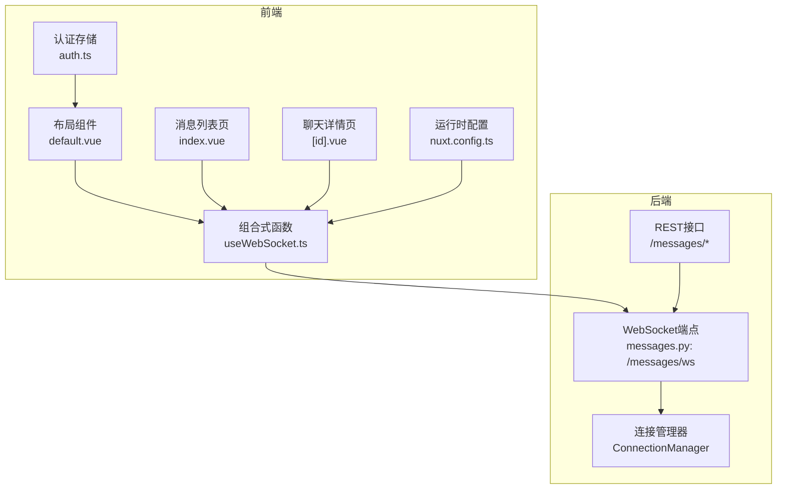
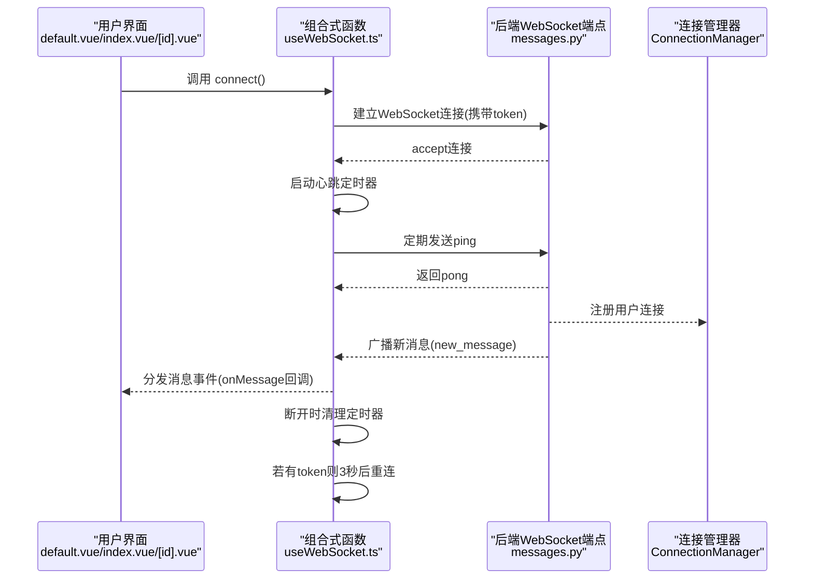
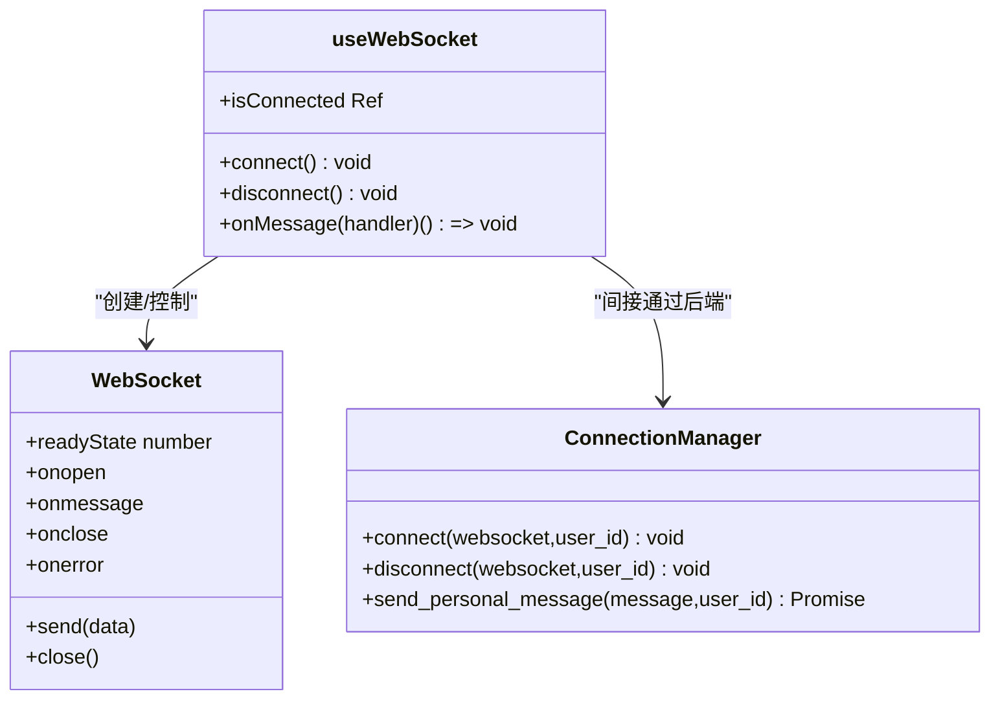
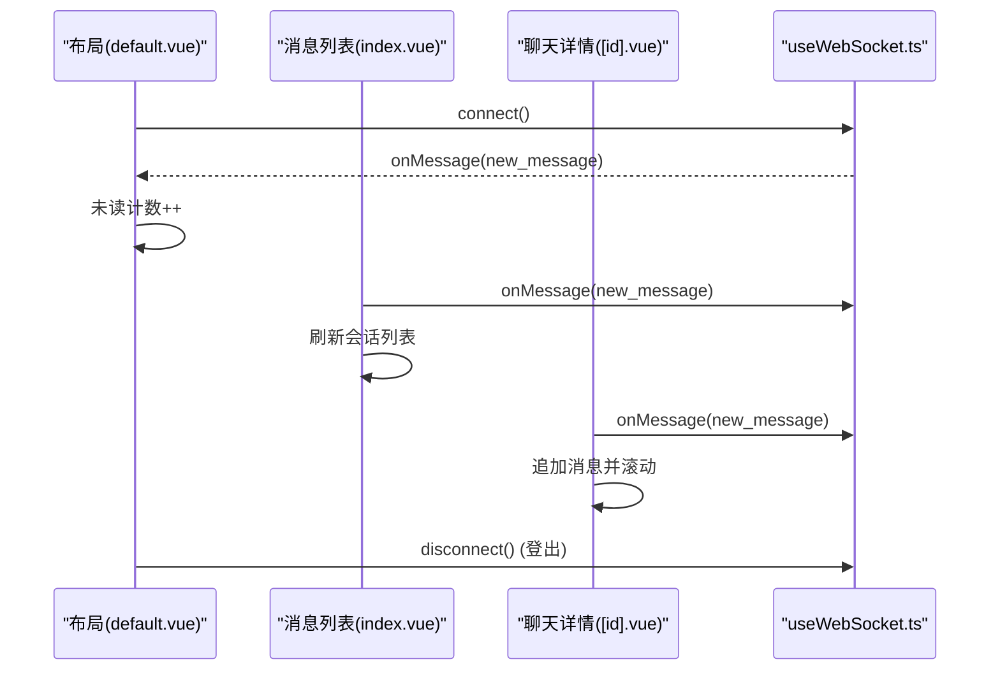
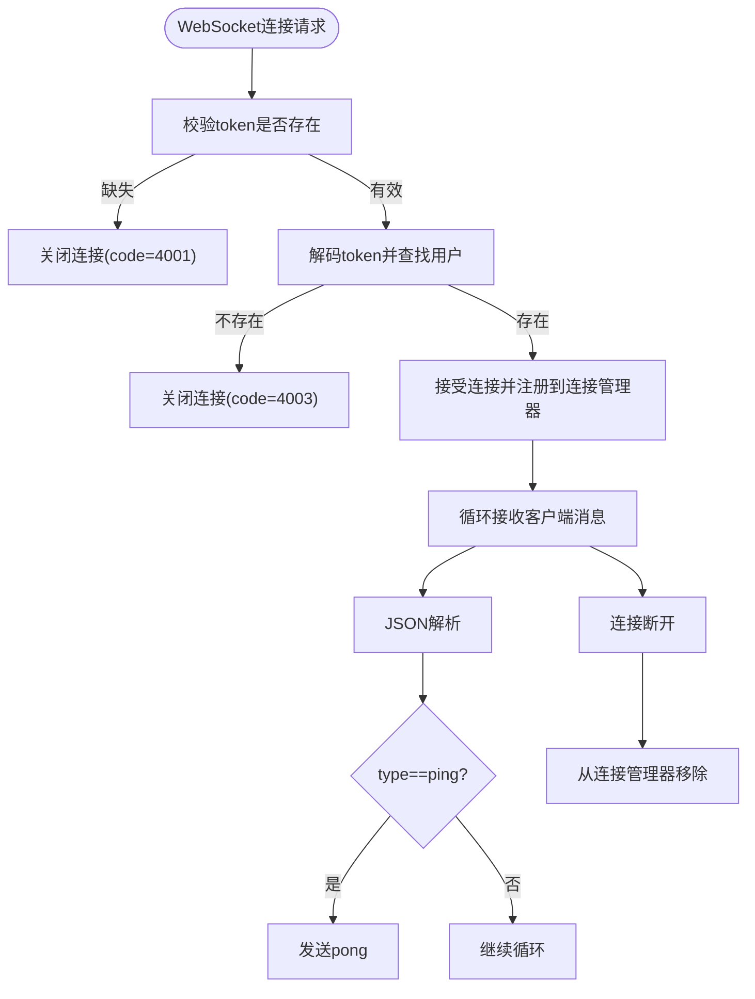
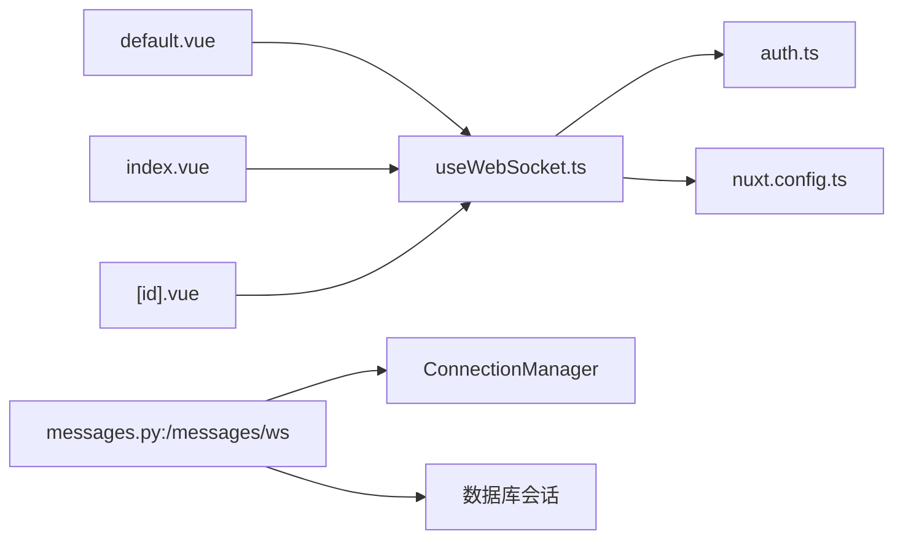

# WebSocket连接管理

<cite>
**本文引用的文件**
- [useWebSocket.ts](file://web_frontend/composables/useWebSocket.ts)
- [default.vue](file://web_frontend/layouts/default.vue)
- [index.vue](file://web_frontend/pages/messages/index.vue)
- [id.vue](file://web_frontend/pages/messages/[id].vue)
- [auth.ts](file://web_frontend/stores/auth.ts)
- [messages.py](file://api_server/routers/messages.py)
- [nuxt.config.ts](file://web_frontend/nuxt.config.ts)
- [.env](file://web_frontend/.env)
</cite>

## 目录
1. [简介](#简介)
2. [项目结构](#项目结构)
3. [核心组件](#核心组件)
4. [架构总览](#架构总览)
5. [详细组件分析](#详细组件分析)
6. [依赖关系分析](#依赖关系分析)
7. [性能考量](#性能考量)
8. [故障排除指南](#故障排除指南)
9. [结论](#结论)
10. [附录](#附录)

## 简介
本技术文档围绕前端组合式函数 useWebSocket 的完整生命周期进行深入解析，覆盖连接建立、状态跟踪、自动重连、心跳检测、消息处理、事件监听与错误处理等关键能力，并结合后端 FastAPI WebSocket 端点与连接管理器，给出在聊天应用、实时通知与数据同步场景下的最佳实践与排障建议。文档同时提供可视化图示帮助理解系统交互流程。

## 项目结构
本项目采用前后端分离架构：
- 前端基于 Nuxt.js + Vue 3 + Pinia，使用自定义组合式函数封装 WebSocket。
- 后端基于 FastAPI，提供 REST API 与 WebSocket 端点，配合连接管理器实现多连接与消息广播。

图表来源
- [default.vue](file://web_frontend/layouts/default.vue#L37-L75)
- [index.vue](file://web_frontend/pages/messages/index.vue#L117-L130)
- [id.vue](file://web_frontend/pages/messages/[id].vue#L197-L219)
- [useWebSocket.ts](file://web_frontend/composables/useWebSocket.ts#L10-L103)
- [messages.py](file://api_server/routers/messages.py#L263-L300)
- [auth.ts](file://web_frontend/stores/auth.ts#L18-L79)
- [nuxt.config.ts](file://web_frontend/nuxt.config.ts#L15-L19)

章节来源
- [useWebSocket.ts](file://web_frontend/composables/useWebSocket.ts#L1-L104)
- [default.vue](file://web_frontend/layouts/default.vue#L1-L87)
- [index.vue](file://web_frontend/pages/messages/index.vue#L1-L198)
- [id.vue](file://web_frontend/pages/messages/[id].vue#L1-L317)
- [messages.py](file://api_server/routers/messages.py#L1-L300)
- [auth.ts](file://web_frontend/stores/auth.ts#L1-L80)
- [nuxt.config.ts](file://web_frontend/nuxt.config.ts#L1-L42)
- [.env](file://web_frontend/.env#L1-L2)

## 核心组件
- useWebSocket 组合式函数：全局单例的 WebSocket 封装，负责连接、断开、心跳、消息分发与自动重连。
- 布局层管理：在登录态变化时自动连接/断开 WebSocket，并监听新消息更新未读计数。
- 页面层消费：消息列表页与聊天详情页订阅消息事件，实现实时刷新与滚动定位。
- 认证存储：提供 token 与登录状态，驱动 WebSocket 连接建立与断开。
- 后端 WebSocket 端点与连接管理器：验证 token、接受连接、维护用户到连接的映射、处理心跳与消息推送。

章节来源
- [useWebSocket.ts](file://web_frontend/composables/useWebSocket.ts#L10-L103)
- [default.vue](file://web_frontend/layouts/default.vue#L37-L75)
- [index.vue](file://web_frontend/pages/messages/index.vue#L117-L130)
- [id.vue](file://web_frontend/pages/messages/[id].vue#L197-L219)
- [auth.ts](file://web_frontend/stores/auth.ts#L18-L79)
- [messages.py](file://api_server/routers/messages.py#L17-L50)

## 架构总览
下图展示了从前端到后端的完整交互路径，包括连接建立、心跳维持、消息分发与断线重连。

图表来源
- [useWebSocket.ts](file://web_frontend/composables/useWebSocket.ts#L14-L68)
- [messages.py](file://api_server/routers/messages.py#L263-L300)
- [default.vue](file://web_frontend/layouts/default.vue#L44-L75)

## 详细组件分析

### 组件A：useWebSocket 组合式函数
- 设计要点
  - 全局单例：内部维护唯一 WebSocket 实例，避免重复连接。
  - 状态管理：使用响应式 ref 跟踪连接状态；使用 Set 存储消息处理器，支持多处订阅。
  - 生命周期：connect/connectivity/cleanup/onMessage/disconnect 提供完整的控制面。
  - 心跳与重连：每30秒发送一次 ping；断开后若存在 token 则延迟3秒重连。
  - 错误处理：捕获构造与解析异常，记录日志并继续运行。

图表来源
- [useWebSocket.ts](file://web_frontend/composables/useWebSocket.ts#L10-L103)
- [messages.py](file://api_server/routers/messages.py#L17-L50)

章节来源
- [useWebSocket.ts](file://web_frontend/composables/useWebSocket.ts#L1-L104)

### 组件B：布局层与页面层集成
- 布局层职责
  - 登录态监听：登录成功后主动连接 WebSocket；登出时断开并清空未读计数。
  - 未读计数：订阅新消息事件，收到 new_message 时递增未读数。
  - 路由联动：进入消息页时延时刷新未读数，保证状态一致。
- 页面层职责
  - 消息列表页：订阅新消息，刷新会话列表。
  - 聊天详情页：订阅新消息，追加消息并滚动到底部；发送消息后标记已读。

图表来源
- [default.vue](file://web_frontend/layouts/default.vue#L37-L75)
- [index.vue](file://web_frontend/pages/messages/index.vue#L117-L130)
- [id.vue](file://web_frontend/pages/messages/[id].vue#L197-L219)
- [useWebSocket.ts](file://web_frontend/composables/useWebSocket.ts#L89-L95)

章节来源
- [default.vue](file://web_frontend/layouts/default.vue#L1-L87)
- [index.vue](file://web_frontend/pages/messages/index.vue#L1-L198)
- [id.vue](file://web_frontend/pages/messages/[id].vue#L1-L317)

### 组件C：后端 WebSocket 端点与连接管理器
- 端点校验
  - 从查询参数提取 token，解码并验证用户存在性。
  - 成功后接入连接管理器，接受客户端心跳消息并回送 pong。
- 连接管理
  - 用户 ID -> 多连接映射，支持同一用户多设备在线。
  - 发送个人消息时遍历该用户所有连接，清理断开连接。
- 消息推送
  - 发送消息成功后，通过 manager.send_personal_message 推送给接收者。

图表来源
- [messages.py](file://api_server/routers/messages.py#L263-L300)
- [messages.py](file://api_server/routers/messages.py#L17-L50)

章节来源
- [messages.py](file://api_server/routers/messages.py#L1-L300)

### 组件D：认证与运行时配置
- 认证存储
  - 提供 token 与用户信息，暴露登录态 getter 与持久化逻辑。
- 运行时配置
  - 通过 runtimeConfig.public.apiBase 动态注入 API 基础地址，useWebSocket 会将其转换为 ws/wss URL。
- 环境变量
  - 前端 .env 中设置默认 API 基础地址，便于开发调试。

章节来源
- [auth.ts](file://web_frontend/stores/auth.ts#L1-L80)
- [nuxt.config.ts](file://web_frontend/nuxt.config.ts#L15-L19)
- [.env](file://web_frontend/.env#L1-L2)

## 依赖关系分析
- 前端依赖链
  - useWebSocket 依赖认证存储与运行时配置，向后端发起 WebSocket 请求。
  - 布局与页面依赖 useWebSocket 提供的消息事件，实现 UI 更新。
- 后端依赖链
  - WebSocket 端点依赖连接管理器与数据库会话，完成用户校验与消息广播。
- 耦合与内聚
  - 前端组合式函数内聚于连接生命周期管理，耦合度低，便于复用。
  - 后端连接管理器集中处理连接与消息分发，职责清晰。

图表来源
- [useWebSocket.ts](file://web_frontend/composables/useWebSocket.ts#L10-L12)
- [auth.ts](file://web_frontend/stores/auth.ts#L18-L26)
- [nuxt.config.ts](file://web_frontend/nuxt.config.ts#L15-L19)
- [default.vue](file://web_frontend/layouts/default.vue#L37-L38)
- [index.vue](file://web_frontend/pages/messages/index.vue#L117-L118)
- [id.vue](file://web_frontend/pages/messages/[id].vue#L197-L198)
- [messages.py](file://api_server/routers/messages.py#L263-L300)
- [messages.py](file://api_server/routers/messages.py#L17-L50)

章节来源
- [useWebSocket.ts](file://web_frontend/composables/useWebSocket.ts#L1-L104)
- [default.vue](file://web_frontend/layouts/default.vue#L1-L87)
- [index.vue](file://web_frontend/pages/messages/index.vue#L1-L198)
- [id.vue](file://web_frontend/pages/messages/[id].vue#L1-L317)
- [messages.py](file://api_server/routers/messages.py#L1-L300)

## 性能考量
- 心跳频率与资源占用
  - 心跳间隔为30秒，发送 ping，服务端回送 pong，避免频繁网络开销。
- 连接池与并发
  - 后端按用户 ID 维护连接列表，支持多设备同时在线；发送消息时遍历该列表，注意大规模并发时的清理成本。
- 内存与定时器
  - 断开连接时需清理 ping 与重连定时器，防止内存泄漏与重复触发。
- 前端渲染优化
  - 聊天详情页在新增消息后使用 nextTick 滚动到底部，避免不必要的重绘。
- 网络与安全
  - URL 从 http/https 自动转换为 ws/wss，确保在 HTTPS 环境下使用 wss。

章节来源
- [useWebSocket.ts](file://web_frontend/composables/useWebSocket.ts#L31-L37)
- [messages.py](file://api_server/routers/messages.py#L286-L299)
- [id.vue](file://web_frontend/pages/messages/[id].vue#L157-L161)

## 故障排除指南
- 无法连接 WebSocket
  - 检查 token 是否存在与有效；确认后端端点是否正确接入连接管理器。
  - 查看浏览器控制台与后端日志，关注 4001/4002/4003 关闭原因。
- 心跳失效
  - 确认前端定时器是否被清理；检查 onclose 与 cleanup 是否正确执行。
- 消息未到达
  - 确认发送端是否调用 manager.send_personal_message；检查接收端是否订阅 onMessage。
- 断线未重连
  - 确认 authStore.token 是否存在；检查 connect 条件判断与重连定时器。
- 性能问题
  - 大量连接时，关注连接清理与消息广播的耗时；必要时降低心跳频率或优化 UI 渲染。

章节来源
- [useWebSocket.ts](file://web_frontend/composables/useWebSocket.ts#L51-L67)
- [messages.py](file://api_server/routers/messages.py#L263-L300)
- [default.vue](file://web_frontend/layouts/default.vue#L66-L75)

## 结论
本实现以组合式函数为核心，将 WebSocket 连接生命周期、心跳与重连、消息分发与清理等复杂逻辑封装在单一模块中，前端页面仅需订阅事件即可获得实时体验。后端通过连接管理器实现了用户级多连接与消息广播，具备良好的扩展性与可维护性。建议在生产环境中进一步完善断线重试策略、消息去重与幂等处理，并加入更细粒度的监控与告警。

## 附录
- 实际使用示例
  - 聊天应用：在布局层建立连接，在消息列表与聊天详情页订阅 new_message 事件，实现消息实时刷新与滚动定位。
  - 实时通知：在布局层订阅 new_message，更新底部导航徽标未读数。
  - 数据同步：在需要强一致性的场景，可在 onMessage 中触发本地数据更新与缓存一致性检查。
- 最佳实践
  - 在组件卸载时返回的取消订阅函数，避免内存泄漏。
  - 对消息进行类型校验与去噪，过滤心跳响应。
  - 在高并发场景下，考虑限流与批量推送策略。
  - 使用 HTTPS 与 wss，确保 token 与消息传输安全。
- 调试技巧
  - 打开浏览器开发者工具 Network 面板观察 WebSocket 协议与帧内容。
  - 在后端开启日志，追踪连接建立、断开与消息广播过程。
  - 使用浏览器插件或代理工具抓包，验证心跳与消息格式。