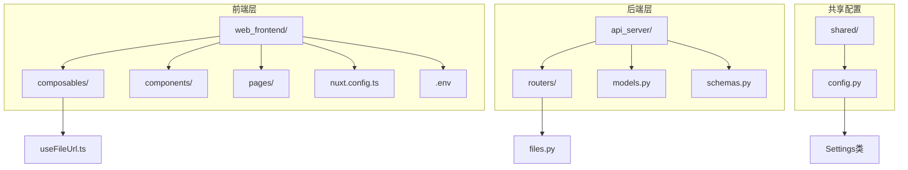
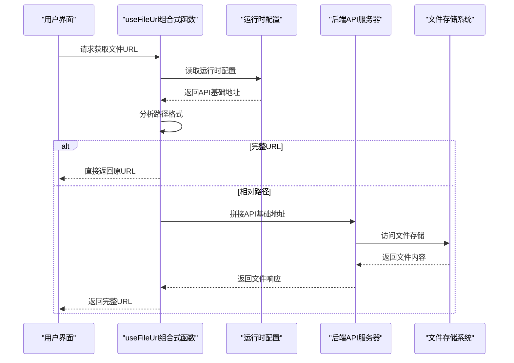
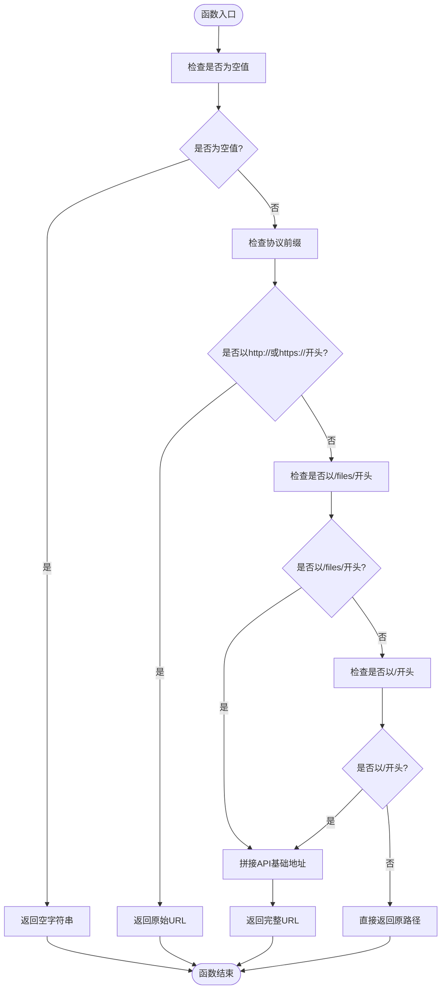
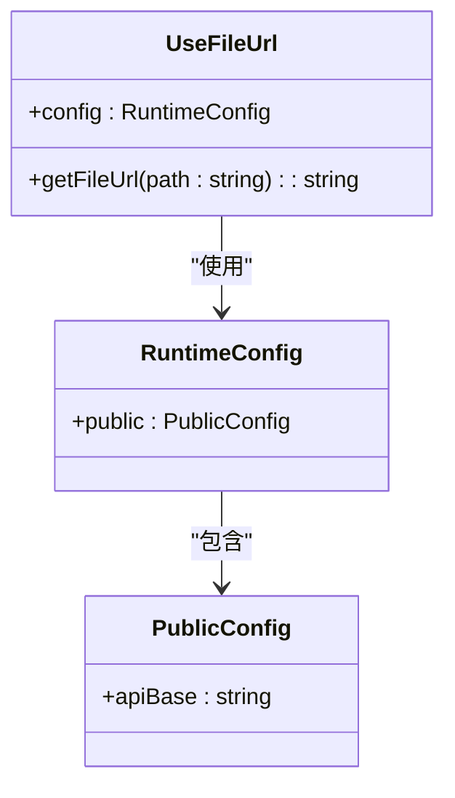
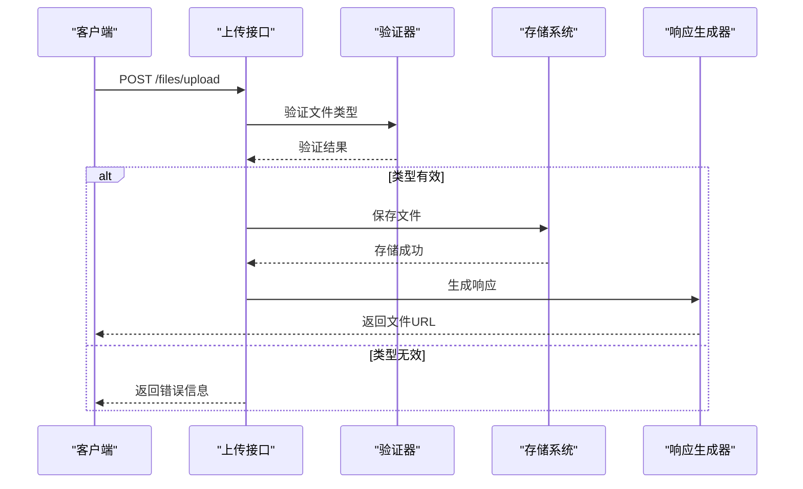
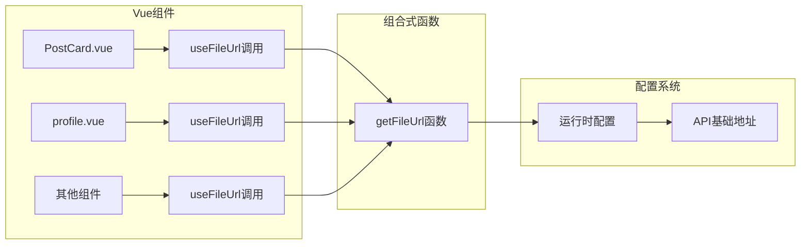
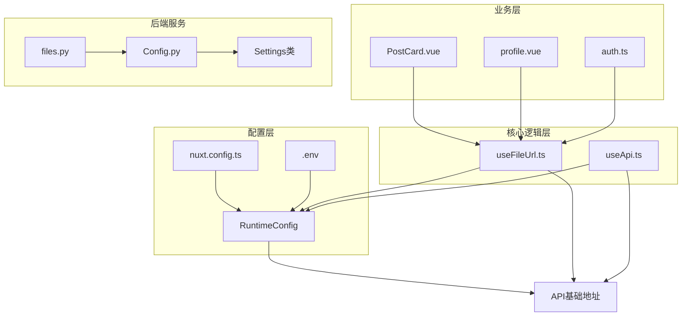

# 文件URL处理

<cite>
**本文档引用的文件**
- [useFileUrl.ts](file://web_frontend/composables/useFileUrl.ts)
- [nuxt.config.ts](file://web_frontend/nuxt.config.ts)
- [files.py](file://api_server/routers/files.py)
- [config.py](file://shared/config.py)
- [.env](file://web_frontend/.env)
- [PostCard.vue](file://web_frontend/components/PostCard.vue)
- [profile.vue](file://web_frontend/pages/profile.vue)
- [useApi.ts](file://web_frontend/composables/useApi.ts)
- [auth.ts](file://web_frontend/stores/auth.ts)
</cite>

## 目录
1. [简介](#简介)
2. [项目结构](#项目结构)
3. [核心组件](#核心组件)
4. [架构概览](#架构概览)
5. [详细组件分析](#详细组件分析)
6. [依赖关系分析](#依赖关系分析)
7. [性能考虑](#性能考虑)
8. [故障排除指南](#故障排除指南)
9. [结论](#结论)
10. [附录](#附录)

## 简介
本文件详细介绍了useFileUrl组合式函数的设计与实现，这是一个专门用于处理文件URL生成和处理的核心工具。该函数负责将各种格式的文件路径转换为可访问的完整URL，支持静态资源路径拼接、CDN域名配置以及文件访问权限处理。

在AI社区项目中，useFileUrl承担着连接前端界面与后端文件服务的重要桥梁作用，确保用户能够正确显示头像、帖子图片等各类媒体资源。该函数通过智能判断路径格式，自动添加必要的API基础地址，实现了对不同部署环境的灵活适配。

## 项目结构
AI社区项目采用前后端分离架构，文件URL处理功能主要分布在以下位置：



**图表来源**
- [useFileUrl.ts](file://web_frontend/composables/useFileUrl.ts#L1-L28)
- [nuxt.config.ts](file://web_frontend/nuxt.config.ts#L1-L42)
- [files.py](file://api_server/routers/files.py#L1-L138)
- [config.py](file://shared/config.py#L1-L52)

**章节来源**
- [useFileUrl.ts](file://web_frontend/composables/useFileUrl.ts#L1-L28)
- [nuxt.config.ts](file://web_frontend/nuxt.config.ts#L15-L19)

## 核心组件
useFileUrl组合式函数是整个文件URL处理系统的核心，其设计简洁而高效，具备以下关键特性：

### 主要功能特性
- **智能路径解析**：自动识别并处理不同格式的文件路径
- **动态URL生成**：根据运行时配置动态生成完整URL
- **多格式支持**：兼容绝对URL、相对路径和特殊文件路径格式
- **环境适配**：支持开发、测试和生产环境的不同配置

### 核心实现逻辑
函数采用条件判断的方式处理不同类型的输入路径，确保每种情况都能得到正确的URL格式。

**章节来源**
- [useFileUrl.ts](file://web_frontend/composables/useFileUrl.ts#L5-L24)

## 架构概览
文件URL处理系统采用分层架构设计，从前端到后端形成完整的数据流：



**图表来源**
- [useFileUrl.ts](file://web_frontend/composables/useFileUrl.ts#L3-L24)
- [nuxt.config.ts](file://web_frontend/nuxt.config.ts#L15-L19)
- [files.py](file://api_server/routers/files.py#L122-L137)

## 详细组件分析

### useFileUrl组合式函数详解

#### 函数签名与参数
```typescript
const getFileUrl = (path: string | null | undefined): string
```

该函数接受三种可能的输入类型：
- 字符串：表示文件路径或URL
- null：表示空值，返回空字符串
- undefined：表示未定义，返回空字符串

#### 路径处理策略
函数采用分层判断策略处理不同类型的路径：



**图表来源**
- [useFileUrl.ts](file://web_frontend/composables/useFileUrl.ts#L5-L24)

#### 配置集成机制
函数通过`useRuntimeConfig()`获取运行时配置，确保在不同环境中都能正确工作：



**图表来源**
- [useFileUrl.ts](file://web_frontend/composables/useFileUrl.ts#L3-L3)
- [nuxt.config.ts](file://web_frontend/nuxt.config.ts#L15-L19)

**章节来源**
- [useFileUrl.ts](file://web_frontend/composables/useFileUrl.ts#L1-L28)

### 后端文件服务集成

#### 文件上传处理流程
后端API提供了完整的文件上传和访问服务：



**图表来源**
- [files.py](file://api_server/routers/files.py#L41-L81)

#### 支持的文件类型
后端明确支持以下图片格式：
- JPG/JPEG
- PNG
- GIF
- WEBP

同时设置了合理的文件大小限制：
- 图片文件：最大10MB
- 头像文件：最大2MB

**章节来源**
- [files.py](file://api_server/routers/files.py#L17-L19)
- [files.py](file://api_server/routers/files.py#L41-L81)

### 前端集成应用

#### 在组件中的使用模式
多个Vue组件通过useFileUrl实现统一的文件URL处理：



**图表来源**
- [PostCard.vue](file://web_frontend/components/PostCard.vue#L55-L55)
- [profile.vue](file://web_frontend/pages/profile.vue#L115-L115)

#### 实际应用场景
1. **头像显示**：在用户资料页面显示用户头像
2. **帖子图片**：在帖子详情中显示关联的图片
3. **评论列表**：在评论区域显示评论者的头像

**章节来源**
- [PostCard.vue](file://web_frontend/components/PostCard.vue#L24-L30)
- [profile.vue](file://web_frontend/pages/profile.vue#L18-L24)

## 依赖关系分析

### 组件间依赖关系


**图表来源**
- [nuxt.config.ts](file://web_frontend/nuxt.config.ts#L15-L19)
- [useFileUrl.ts](file://web_frontend/composables/useFileUrl.ts#L3-L3)
- [useApi.ts](file://web_frontend/composables/useApi.ts#L3-L6)

### 外部依赖关系
系统依赖于以下外部库和框架：
- **Nuxt.js**：提供运行时配置管理
- **FastAPI**：后端API框架
- **Vant UI**：移动端UI组件库
- **Pinia**：状态管理库

**章节来源**
- [nuxt.config.ts](file://web_frontend/nuxt.config.ts#L5-L8)
- [files.py](file://api_server/routers/files.py#L1-L12)

## 性能考虑

### URL生成优化策略
1. **缓存机制**：useFileUrl函数简单直接，避免不必要的计算开销
2. **条件判断优化**：采用短路求值，减少不必要的字符串操作
3. **配置复用**：运行时配置在应用启动时加载，避免重复获取

### 文件访问性能
1. **CDN支持**：通过配置API基础地址，可以轻松集成CDN加速
2. **懒加载**：Vue组件支持图片懒加载，提升页面渲染性能
3. **文件大小控制**：后端限制文件大小，防止大文件影响性能

### 内存使用优化
1. **流式处理**：文件上传使用异步IO，避免内存溢出
2. **及时释放**：文件处理完成后及时释放资源
3. **合理缓存**：对于频繁访问的头像等小文件，建议使用浏览器缓存

## 故障排除指南

### 常见问题及解决方案

#### 1. 文件URL无法显示
**症状**：图片显示为占位符或空白
**可能原因**：
- API基础地址配置错误
- 文件路径格式不正确
- 权限不足导致访问被拒绝

**解决步骤**：
1. 检查`.env`文件中的`NUXT_PUBLIC_API_BASE`配置
2. 验证文件路径是否以`/files/`开头
3. 确认用户具有访问相应文件的权限

#### 2. 上传文件失败
**症状**：文件上传时报错
**可能原因**：
- 文件类型不在允许列表中
- 文件大小超过限制
- 服务器磁盘空间不足

**解决步骤**：
1. 检查文件扩展名是否在允许列表内
2. 确认文件大小不超过限制
3. 验证服务器存储空间

#### 3. CORS跨域问题
**症状**：浏览器控制台出现跨域错误
**解决方案**：
在后端API中配置适当的CORS头信息，允许前端域名访问。

**章节来源**
- [files.py](file://api_server/routers/files.py#L49-L65)
- [config.py](file://shared/config.py#L26-L28)

## 结论
useFileUrl组合式函数为AI社区项目提供了一个简洁、高效且灵活的文件URL处理解决方案。通过智能的路径解析和动态配置集成，该函数能够适应不同的部署环境和使用场景。

该系统的成功之处在于：
1. **设计简洁**：函数逻辑清晰，易于理解和维护
2. **配置灵活**：通过运行时配置支持多环境部署
3. **扩展性强**：为未来的CDN集成和高级功能预留了空间
4. **安全性考虑**：后端实现了文件类型验证和大小限制

未来可以在现有基础上进一步增强的功能包括：
- 添加CDN域名配置选项
- 实现图片懒加载支持
- 增加临时URL生成功能
- 提供文件类型检测和MIME类型处理

## 附录

### 配置参考
- **API基础地址**：默认值为`http://localhost:8000`
- **文件上传目录**：`D:/projects/AISocialMediaFiles`
- **允许的文件类型**：`.jpg`, `.jpeg`, `.png`, `.gif`, `.webp`
- **文件大小限制**：图片10MB，头像2MB

### 使用示例路径
- [头像显示示例](file://web_frontend/pages/profile.vue#L18-L24)
- [帖子图片显示示例](file://web_frontend/components/PostCard.vue#L24-L30)
- [URL生成函数实现](file://web_frontend/composables/useFileUrl.ts#L5-L24)