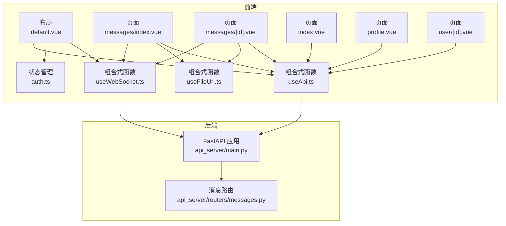
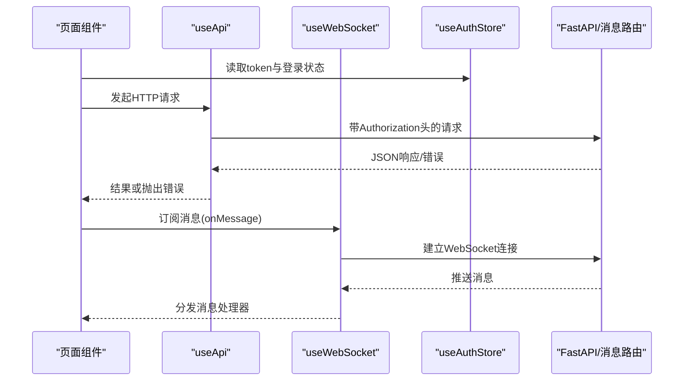
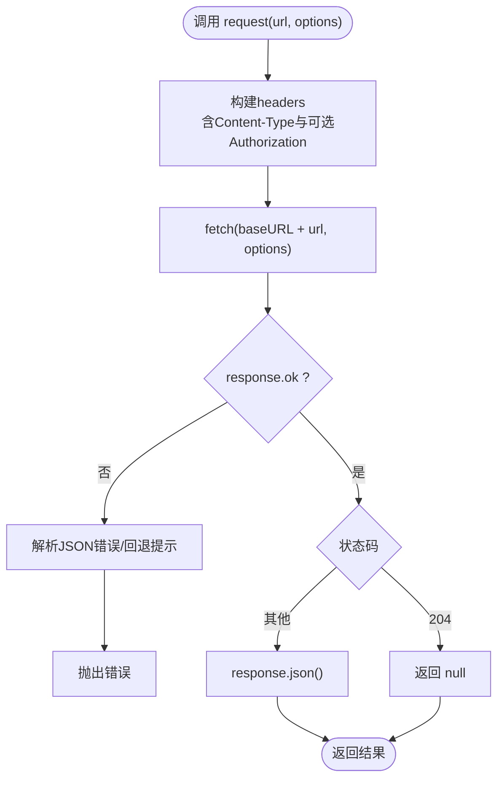
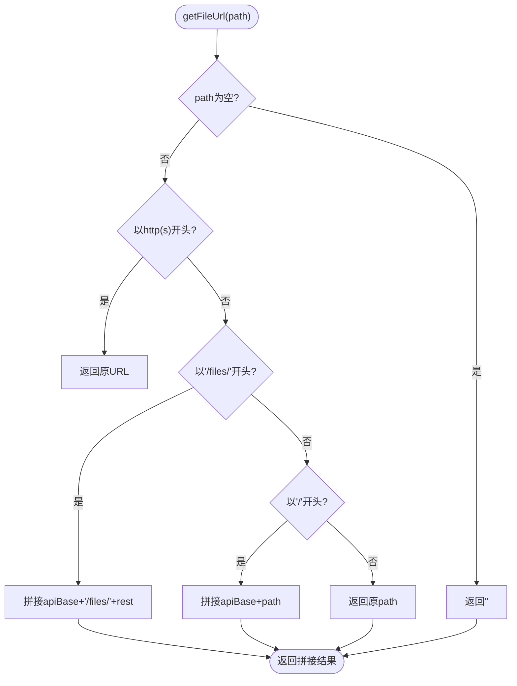
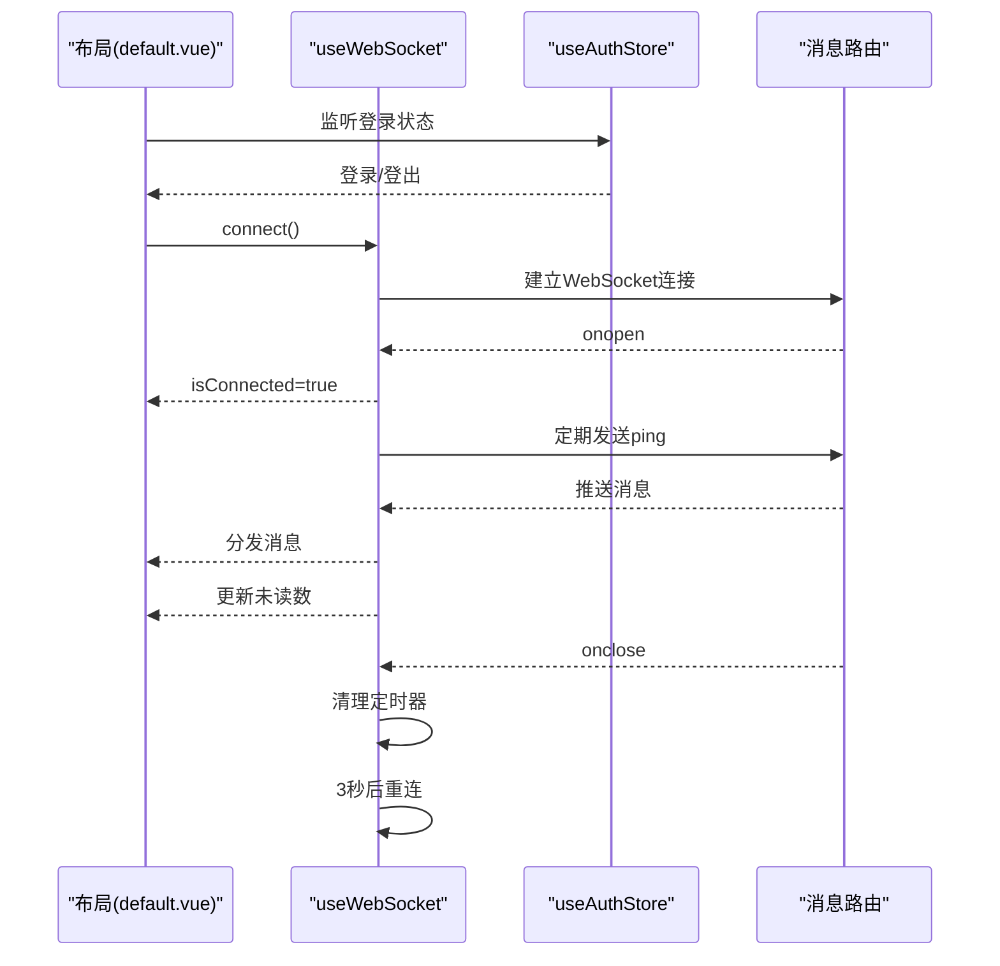
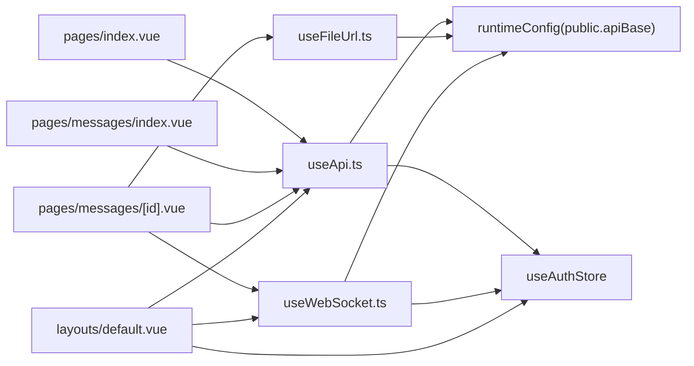

# 组合式函数

<cite>
**本文引用的文件**
- [web_frontend/composables/useApi.ts](file://web_frontend/composables/useApi.ts)
- [web_frontend/composables/useFileUrl.ts](file://web_frontend/composables/useFileUrl.ts)
- [web_frontend/composables/useWebSocket.ts](file://web_frontend/composables/useWebSocket.ts)
- [web_frontend/stores/auth.ts](file://web_frontend/stores/auth.ts)
- [web_frontend/layouts/default.vue](file://web_frontend/layouts/default.vue)
- [web_frontend/pages/messages/index.vue](file://web_frontend/pages/messages/index.vue)
- [web_frontend/pages/messages/[id].vue](file://web_frontend/pages/messages/[id].vue)
- [web_frontend/pages/index.vue](file://web_frontend/pages/index.vue)
- [web_frontend/pages/profile.vue](file://web_frontend/pages/profile.vue)
- [web_frontend/pages/user/[id].vue](file://web_frontend/pages/user/[id].vue)
- [web_frontend/nuxt.config.ts](file://web_frontend/nuxt.config.ts)
- [api_server/routers/messages.py](file://api_server/routers/messages.py)
- [api_server/main.py](file://api_server/main.py)
- [README.md](file://README.md)
</cite>

## 目录
1. [简介](#简介)
2. [项目结构](#项目结构)
3. [核心组件](#核心组件)
4. [架构总览](#架构总览)
5. [组件详解](#组件详解)
6. [依赖关系分析](#依赖关系分析)
7. [性能考量](#性能考量)
8. [故障排查指南](#故障排查指南)
9. [结论](#结论)
10. [附录](#附录)

## 简介
本文件面向AI社区前端的组合式函数系统，围绕三大核心组合式函数 useApi、useFileUrl 和 useWebSocket 提供从设计模式、数据流、错误处理到性能与测试策略的全景式技术文档。文档同时结合后端消息路由与布局层的集成方式，给出可操作的使用示例、最佳实践与常见问题解决方案。

## 项目结构
前端采用 Nuxt 3 + Vue 3 + Pinia 架构，核心逻辑集中在 composables 目录；消息系统通过全局布局层统一管理 WebSocket 连接，并在页面中按需消费消息与文件资源。

图示来源
- [web_frontend/layouts/default.vue](file://web_frontend/layouts/default.vue#L15-L79)
- [web_frontend/pages/messages/index.vue](file://web_frontend/pages/messages/index.vue#L51-L130)
- [web_frontend/pages/messages/[id].vue](file://web_frontend/pages/messages/[id].vue#L65-L200)
- [web_frontend/pages/index.vue](file://web_frontend/pages/index.vue#L56-L103)
- [web_frontend/pages/profile.vue](file://web_frontend/pages/profile.vue#L137-L172)
- [web_frontend/pages/user/[id].vue](file://web_frontend/pages/user/[id].vue#L106-L150)
- [web_frontend/composables/useApi.ts](file://web_frontend/composables/useApi.ts#L1-L57)
- [web_frontend/composables/useFileUrl.ts](file://web_frontend/composables/useFileUrl.ts#L1-L28)
- [web_frontend/composables/useWebSocket.ts](file://web_frontend/composables/useWebSocket.ts#L1-L104)
- [web_frontend/stores/auth.ts](file://web_frontend/stores/auth.ts#L1-L80)
- [api_server/main.py](file://api_server/main.py#L1-L69)
- [api_server/routers/messages.py](file://api_server/routers/messages.py#L1-L200)

章节来源
- [README.md](file://README.md#L1-L35)
- [web_frontend/nuxt.config.ts](file://web_frontend/nuxt.config.ts#L15-L19)

## 核心组件
- useApi：统一的HTTP请求封装，内置鉴权头注入、错误解析与状态码处理，暴露 get/post/put/delete 方法。
- useFileUrl：统一的文件URL生成器，支持绝对URL、相对路径与API Base拼接，适配头像等资源展示。
- useWebSocket：全局单例WebSocket管理器，负责连接、心跳、消息分发与断线重连，提供 onMessage 订阅接口。

章节来源
- [web_frontend/composables/useApi.ts](file://web_frontend/composables/useApi.ts#L1-L57)
- [web_frontend/composables/useFileUrl.ts](file://web_frontend/composables/useFileUrl.ts#L1-L28)
- [web_frontend/composables/useWebSocket.ts](file://web_frontend/composables/useWebSocket.ts#L1-L104)

## 架构总览
前端通过 useApi 与后端REST API交互；通过 useFileUrl 解析资源URL；通过 useWebSocket 与后端消息系统建立实时通信。布局层负责连接生命周期与未读数联动，页面按需消费数据与消息。

图示来源
- [web_frontend/composables/useApi.ts](file://web_frontend/composables/useApi.ts#L8-L48)
- [web_frontend/composables/useWebSocket.ts](file://web_frontend/composables/useWebSocket.ts#L14-L68)
- [web_frontend/stores/auth.ts](file://web_frontend/stores/auth.ts#L28-L56)
- [api_server/routers/messages.py](file://api_server/routers/messages.py#L17-L48)

## 组件详解

### useApi：API请求封装
- 设计要点
  - 基于运行时配置注入API Base URL，避免硬编码。
  - 默认JSON Content-Type与可选鉴权头（Bearer Token），支持GET/POST/PUT/DELETE。
  - 对非200响应进行错误解析并抛出可读错误信息；对204返回null。
  - 通过泛型约束保证返回类型安全。
- 错误处理
  - 非OK响应尝试解析JSON中的detail字段作为错误提示；若解析失败则回退为通用提示。
- 缓存策略
  - 当前实现未内置缓存；建议在页面级或store级引入基于URL与参数的简单LRU缓存以减少重复请求。
- 使用示例
  - 首页加载：参见 [web_frontend/pages/index.vue](file://web_frontend/pages/index.vue#L77-L102)
  - 个人主页加载：参见 [web_frontend/pages/profile.vue](file://web_frontend/pages/profile.vue#L151-L171)
  - 用户详情加载：参见 [web_frontend/pages/user/[id].vue](file://web_frontend/pages/user/[id].vue#L120-L126)

图示来源
- [web_frontend/composables/useApi.ts](file://web_frontend/composables/useApi.ts#L8-L48)

章节来源
- [web_frontend/composables/useApi.ts](file://web_frontend/composables/useApi.ts#L1-L57)
- [web_frontend/pages/index.vue](file://web_frontend/pages/index.vue#L77-L102)
- [web_frontend/pages/profile.vue](file://web_frontend/pages/profile.vue#L151-L171)
- [web_frontend/pages/user/[id].vue](file://web_frontend/pages/user/[id].vue#L120-L126)

### useFileUrl：文件URL处理
- 实现原理
  - 若传入为空，返回空字符串。
  - 已为http(s)协议的URL直接返回。
  - 以/files/开头或以/开头的相对路径，拼接运行时配置中的API Base。
  - 其他相对路径原样返回（如CDN直链）。
- 图片优化与CDN集成
  - 可在后端路由/files/*下接入CDN或静态文件服务；前端仅负责URL拼接。
  - 建议在后端对头像等常用资源启用压缩与格式优化（如WebP）。
- 使用示例
  - 私信会话列表头像：参见 [web_frontend/pages/messages/index.vue](file://web_frontend/pages/messages/index.vue#L20-L27)
  - 聊天界面头像：参见 [web_frontend/pages/messages/[id].vue](file://web_frontend/pages/messages/[id].vue#L22-L41)

图示来源
- [web_frontend/composables/useFileUrl.ts](file://web_frontend/composables/useFileUrl.ts#L5-L24)

章节来源
- [web_frontend/composables/useFileUrl.ts](file://web_frontend/composables/useFileUrl.ts#L1-L28)
- [web_frontend/pages/messages/index.vue](file://web_frontend/pages/messages/index.vue#L20-L27)
- [web_frontend/pages/messages/[id].vue](file://web_frontend/pages/messages/[id].vue#L22-L41)

### useWebSocket：WebSocket连接管理
- 连接管理
  - 全局单例：内部维护ws实例、心跳定时器与重连定时器，避免重复连接。
  - 条件连接：仅当存在token且未处于CONNECTING/OPEN状态时创建连接。
  - URL构建：将HTTP Base替换为ws/wss协议，并附加token查询参数。
- 心跳与断线重连
  - 心跳：每30秒发送一次ping；收到pong消息时不触发业务回调。
  - 断线：onclose清理定时器并按3秒间隔重连，直至成功。
- 消息分发
  - onMessage统一解析JSON，过滤pong后分发给所有订阅者（Set集合）。
  - onMessage返回取消订阅函数，便于组件卸载时清理。
- 与布局层集成
  - 布局层在登录态变化时控制连接/断开，并在消息到达时更新未读数。
  - 页面通过ws.onMessage订阅新消息，实现消息实时推送。

图示来源
- [web_frontend/composables/useWebSocket.ts](file://web_frontend/composables/useWebSocket.ts#L14-L68)
- [web_frontend/layouts/default.vue](file://web_frontend/layouts/default.vue#L40-L75)
- [api_server/routers/messages.py](file://api_server/routers/messages.py#L17-L48)

章节来源
- [web_frontend/composables/useWebSocket.ts](file://web_frontend/composables/useWebSocket.ts#L1-L104)
- [web_frontend/layouts/default.vue](file://web_frontend/layouts/default.vue#L15-L79)
- [web_frontend/pages/messages/index.vue](file://web_frontend/pages/messages/index.vue#L117-L130)
- [web_frontend/pages/messages/[id].vue](file://web_frontend/pages/messages/[id].vue#L197-L219)
- [api_server/routers/messages.py](file://api_server/routers/messages.py#L17-L48)

## 依赖关系分析
- 组合式函数依赖
  - useApi 依赖运行时配置与鉴权store，用于注入Authorization头与构造URL。
  - useFileUrl 依赖运行时配置，用于拼接API Base。
  - useWebSocket 依赖运行时配置与鉴权store，用于构建带token的ws地址。
- 页面与布局
  - 多个页面共享useApi与useFileUrl，布局层统一管理useWebSocket。
- 后端路由
  - 消息路由提供WebSocket连接管理器，支持一对一消息推送与多连接广播清理。

图示来源
- [web_frontend/composables/useApi.ts](file://web_frontend/composables/useApi.ts#L3-L6)
- [web_frontend/composables/useFileUrl.ts](file://web_frontend/composables/useFileUrl.ts#L3-L3)
- [web_frontend/composables/useWebSocket.ts](file://web_frontend/composables/useWebSocket.ts#L11-L12)
- [web_frontend/layouts/default.vue](file://web_frontend/layouts/default.vue#L19-L21)
- [web_frontend/pages/messages/[id].vue](file://web_frontend/pages/messages/[id].vue#L88-L90)

章节来源
- [web_frontend/nuxt.config.ts](file://web_frontend/nuxt.config.ts#L15-L19)
- [web_frontend/stores/auth.ts](file://web_frontend/stores/auth.ts#L18-L26)
- [web_frontend/pages/index.vue](file://web_frontend/pages/index.vue#L56-L57)
- [web_frontend/pages/messages/index.vue](file://web_frontend/pages/messages/index.vue#L73-L75)
- [web_frontend/pages/messages/[id].vue](file://web_frontend/pages/messages/[id].vue#L88-L90)
- [web_frontend/layouts/default.vue](file://web_frontend/layouts/default.vue#L19-L21)

## 性能考量
- 请求去抖与并发控制
  - 在高频操作（如滚动加载）中，建议对请求进行防抖/节流，避免重复请求。
- 缓存策略
  - 对热点接口（如帖子列表、用户资料）引入轻量LRU缓存，命中则直接返回，未命中再走useApi。
- 资源优化
  - useFileUrl配合后端CDN与图片压缩，减少首屏渲染时间。
- WebSocket
  - 心跳周期与重连间隔已内置，注意在组件卸载时及时取消订阅与清理定时器，避免内存泄漏。

## 故障排查指南
- API请求失败
  - 确认运行时配置中的public.apiBase正确指向后端地址。
  - 检查鉴权store中token是否存在，必要时重新登录。
  - 查看后端错误响应体中的detail字段定位具体问题。
- 文件URL无效
  - 确认传入路径符合预期（绝对URL、/files/开头或/开头），否则将按原样返回。
  - 检查后端/files路由是否正确映射至静态文件目录。
- WebSocket无法连接
  - 确认token有效且布局层已触发connect。
  - 检查后端消息路由是否正常，关注ConnectionManager的连接/断开逻辑。
  - 关注浏览器控制台的onerror与onclose日志，定位网络或认证问题。

章节来源
- [web_frontend/composables/useApi.ts](file://web_frontend/composables/useApi.ts#L37-L40)
- [web_frontend/composables/useFileUrl.ts](file://web_frontend/composables/useFileUrl.ts#L5-L24)
- [web_frontend/composables/useWebSocket.ts](file://web_frontend/composables/useWebSocket.ts#L14-L18)
- [web_frontend/layouts/default.vue](file://web_frontend/layouts/default.vue#L44-L54)
- [api_server/routers/messages.py](file://api_server/routers/messages.py#L17-L48)

## 结论
本组合式函数体系以简洁、可复用为目标，将HTTP请求、文件URL与WebSocket连接抽象为统一接口，配合Pinia状态管理与Nuxt运行时配置，形成前后端协同的高效开发范式。建议在现有基础上补充缓存与监控埋点，持续提升用户体验与系统稳定性。

## 附录

### 开发规范
- 组合式函数命名与导出保持一致风格，返回对象方法语义清晰。
- 所有HTTP请求必须通过useApi，避免直接使用fetch。
- 文件资源优先通过useFileUrl生成URL，避免硬编码路径。
- WebSocket订阅需在组件卸载时返回的取消函数，防止内存泄漏。

### 测试策略
- 单元测试
  - useApi：模拟response.ok与非200场景，覆盖错误解析分支。
  - useFileUrl：覆盖空值、绝对URL、/files/与/开头路径的拼接逻辑。
  - useWebSocket：模拟onopen/onmessage/onclose/onerror，验证心跳与重连流程。
- 集成测试
  - 布局层登录/登出切换与未读数联动。
  - 页面间消息订阅与消息推送一致性。

### 实际使用示例路径
- 首页加载帖子列表：[web_frontend/pages/index.vue](file://web_frontend/pages/index.vue#L77-L102)
- 个人主页加载帖子：[web_frontend/pages/profile.vue](file://web_frontend/pages/profile.vue#L151-L171)
- 用户详情加载：[web_frontend/pages/user/[id].vue](file://web_frontend/pages/user/[id].vue#L120-L126)
- 私信会话列表：[web_frontend/pages/messages/index.vue](file://web_frontend/pages/messages/index.vue#L86-L96)
- 私信聊天界面：[web_frontend/pages/messages/[id].vue](file://web_frontend/pages/messages/[id].vue#L107-L143)
- 布局层WebSocket与未读数：[web_frontend/layouts/default.vue](file://web_frontend/layouts/default.vue#L22-L75)