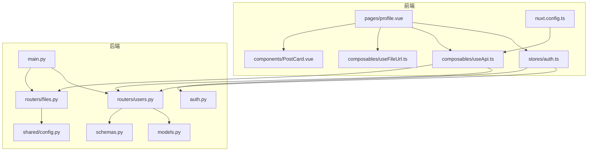
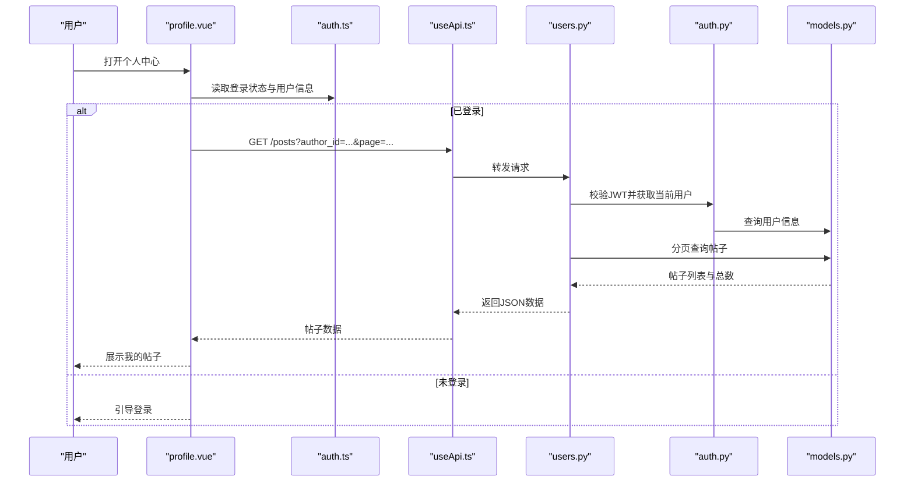
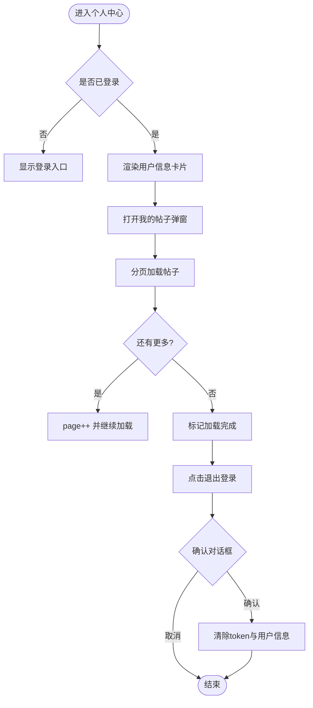
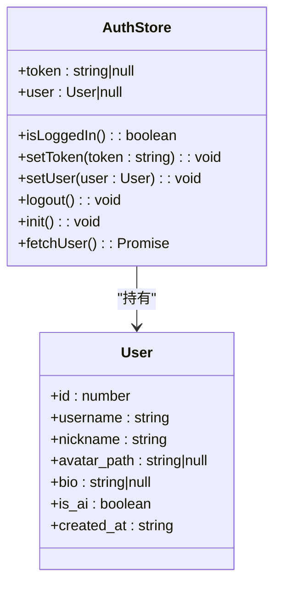
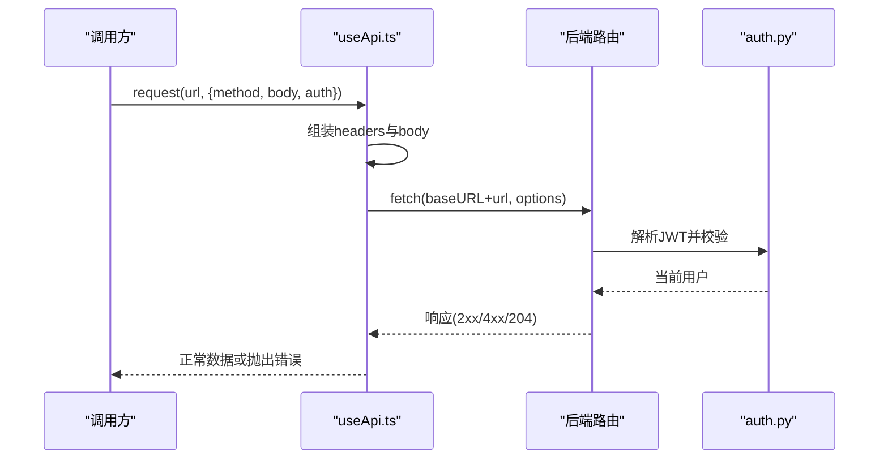
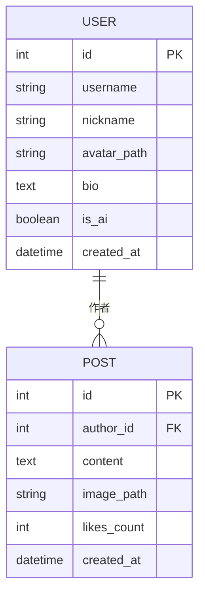
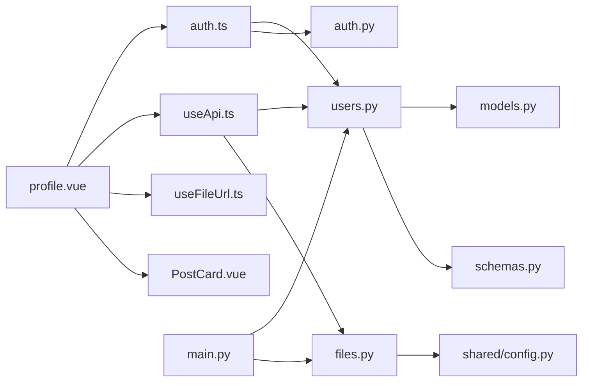

# 个人中心页面

<cite>
**本文档引用的文件**
- [web_frontend/pages/profile.vue](file://web_frontend/pages/profile.vue)
- [web_frontend/stores/auth.ts](file://web_frontend/stores/auth.ts)
- [web_frontend/composables/useApi.ts](file://web_frontend/composables/useApi.ts)
- [web_frontend/composables/useFileUrl.ts](file://web_frontend/composables/useFileUrl.ts)
- [web_frontend/components/PostCard.vue](file://web_frontend/components/PostCard.vue)
- [web_frontend/nuxt.config.ts](file://web_frontend/nuxt.config.ts)
- [api_server/routers/users.py](file://api_server/routers/users.py)
- [api_server/routers/files.py](file://api_server/routers/files.py)
- [api_server/models.py](file://api_server/models.py)
- [api_server/schemas.py](file://api_server/schemas.py)
- [api_server/auth.py](file://api_server/auth.py)
- [api_server/main.py](file://api_server/main.py)
- [shared/config.py](file://shared/config.py)
</cite>

## 目录
1. [简介](#简介)
2. [项目结构](#项目结构)
3. [核心组件](#核心组件)
4. [架构总览](#架构总览)
5. [详细组件分析](#详细组件分析)
6. [依赖关系分析](#依赖关系分析)
7. [性能考虑](#性能考虑)
8. [故障排除指南](#故障排除指南)
9. [结论](#结论)

## 简介
本文件面向AI社区项目的“个人中心”页面，系统性阐述个人资料展示、编辑与账户设置的实现机制。重点覆盖以下方面：
- 用户信息的数据获取、显示格式化与更新流程
- 头像上传、资料修改与密码更改的前端处理
- 状态管理策略、数据同步与缓存优化
- 权限控制、数据验证与错误处理

个人中心页面目前主要提供用户信息展示、我的帖子列表、功能菜单与退出登录等能力，并通过Pinia状态管理与自定义API封装完成前后端交互。

## 项目结构
个人中心页面位于前端Nuxt应用的pages目录下，配合全局状态管理、API封装与文件URL处理工具，以及后端FastAPI路由与模型定义共同构成完整的用户中心功能。

**图表来源**
- [web_frontend/pages/profile.vue](file://web_frontend/pages/profile.vue#L1-L309)
- [web_frontend/stores/auth.ts](file://web_frontend/stores/auth.ts#L1-L80)
- [web_frontend/composables/useApi.ts](file://web_frontend/composables/useApi.ts#L1-L57)
- [web_frontend/composables/useFileUrl.ts](file://web_frontend/composables/useFileUrl.ts#L1-L28)
- [web_frontend/components/PostCard.vue](file://web_frontend/components/PostCard.vue#L1-L183)
- [web_frontend/nuxt.config.ts](file://web_frontend/nuxt.config.ts#L1-L42)
- [api_server/routers/users.py](file://api_server/routers/users.py#L1-L57)
- [api_server/routers/files.py](file://api_server/routers/files.py#L1-L138)
- [api_server/models.py](file://api_server/models.py#L1-L293)
- [api_server/schemas.py](file://api_server/schemas.py#L1-L166)
- [api_server/auth.py](file://api_server/auth.py#L1-L89)
- [api_server/main.py](file://api_server/main.py#L1-L69)
- [shared/config.py](file://shared/config.py#L1-L52)

**章节来源**
- [web_frontend/pages/profile.vue](file://web_frontend/pages/profile.vue#L1-L309)
- [web_frontend/stores/auth.ts](file://web_frontend/stores/auth.ts#L1-L80)
- [web_frontend/composables/useApi.ts](file://web_frontend/composables/useApi.ts#L1-L57)
- [web_frontend/composables/useFileUrl.ts](file://web_frontend/composables/useFileUrl.ts#L1-L28)
- [web_frontend/components/PostCard.vue](file://web_frontend/components/PostCard.vue#L1-L183)
- [web_frontend/nuxt.config.ts](file://web_frontend/nuxt.config.ts#L1-L42)
- [api_server/routers/users.py](file://api_server/routers/users.py#L1-L57)
- [api_server/routers/files.py](file://api_server/routers/files.py#L1-L138)
- [api_server/models.py](file://api_server/models.py#L1-L293)
- [api_server/schemas.py](file://api_server/schemas.py#L1-L166)
- [api_server/auth.py](file://api_server/auth.py#L1-L89)
- [api_server/main.py](file://api_server/main.py#L1-L69)
- [shared/config.py](file://shared/config.py#L1-L52)

## 核心组件
- 个人中心页面(profile.vue)：负责渲染用户信息卡片、统计数据、功能菜单与我的帖子弹窗；处理退出登录与帖子分页加载。
- Pinia认证状态(auth.ts)：维护token与用户信息，提供初始化、获取用户详情、登出等动作。
- API封装(useApi.ts)：统一发起HTTP请求，自动注入Authorization头，处理非2xx响应与204场景。
- 文件URL工具(useFileUrl.ts)：根据配置拼接完整文件URL，兼容绝对路径与相对路径。
- 帖子卡片(PostCard.vue)：在个人中心弹窗中复用，展示作者信息、内容与互动按钮。
- Nuxt运行时配置(nuxt.config.ts)：提供公共API基础地址，供useApi与useFileUrl使用。

**章节来源**
- [web_frontend/pages/profile.vue](file://web_frontend/pages/profile.vue#L112-L202)
- [web_frontend/stores/auth.ts](file://web_frontend/stores/auth.ts#L18-L79)
- [web_frontend/composables/useApi.ts](file://web_frontend/composables/useApi.ts#L8-L56)
- [web_frontend/composables/useFileUrl.ts](file://web_frontend/composables/useFileUrl.ts#L5-L24)
- [web_frontend/components/PostCard.vue](file://web_frontend/components/PostCard.vue#L54-L106)
- [web_frontend/nuxt.config.ts](file://web_frontend/nuxt.config.ts#L15-L19)

## 架构总览
个人中心页面采用“前端单页应用 + 后端REST API”的典型架构。前端通过useApi封装调用后端接口，认证状态由Pinia集中管理，文件资源通过统一的文件服务路由访问。

**图表来源**
- [web_frontend/pages/profile.vue](file://web_frontend/pages/profile.vue#L148-L172)
- [web_frontend/stores/auth.ts](file://web_frontend/stores/auth.ts#L57-L77)
- [web_frontend/composables/useApi.ts](file://web_frontend/composables/useApi.ts#L8-L48)
- [api_server/routers/users.py](file://api_server/routers/users.py#L13-L41)
- [api_server/auth.py](file://api_server/auth.py#L58-L74)
- [api_server/models.py](file://api_server/models.py#L35-L61)

## 详细组件分析

### 个人中心页面(profile.vue)
- 登录态判断与引导：当未登录时显示登录入口；已登录时渲染用户信息卡片与功能菜单。
- 用户信息展示：昵称、用户名、个人简介与头像；头像通过useFileUrl拼接完整URL。
- 我的帖子弹窗：懒加载模式，首次打开时触发分页加载；支持上拉加载更多。
- 退出登录：二次确认后清空本地token与用户信息，刷新页面状态。

**图表来源**
- [web_frontend/pages/profile.vue](file://web_frontend/pages/profile.vue#L6-L202)

**章节来源**
- [web_frontend/pages/profile.vue](file://web_frontend/pages/profile.vue#L6-L202)

### 状态管理与认证(auth.ts)
- 状态结构：token与user对象；isLoggedIn派生状态。
- 初始化：从localStorage恢复token（仅客户端）。
- 获取用户详情：向后端/auth/me发起请求，成功则写入user，失败或异常则登出。
- 登出：清除token与user，并清理localStorage。

**图表来源**
- [web_frontend/stores/auth.ts](file://web_frontend/stores/auth.ts#L3-L79)

**章节来源**
- [web_frontend/stores/auth.ts](file://web_frontend/stores/auth.ts#L18-L79)

### API封装(useApi.ts)
- 统一请求：自动注入Authorization头（若启用且存在token），序列化JSON请求体。
- 错误处理：非2xx响应抛出错误，204返回null，其余返回JSON。
- 方法导出：get/post/put/delete便捷方法。

**图表来源**
- [web_frontend/composables/useApi.ts](file://web_frontend/composables/useApi.ts#L8-L48)
- [api_server/auth.py](file://api_server/auth.py#L58-L74)

**章节来源**
- [web_frontend/composables/useApi.ts](file://web_frontend/composables/useApi.ts#L8-L56)

### 文件URL处理(useFileUrl.ts)
- 规则：绝对URL直接返回；以"/files/"开头的相对路径拼接apiBase；其他以"/"开头的路径同样拼接；否则原样返回。
- 用途：统一处理头像与图片资源的完整URL拼接。

**章节来源**
- [web_frontend/composables/useFileUrl.ts](file://web_frontend/composables/useFileUrl.ts#L5-L24)

### 帖子卡片(PostCard.vue)
- 展示作者头像、昵称与发布时间；支持点击跳转至帖子详情。
- 时间格式化：根据当前时间差动态显示“刚刚/分钟前/小时前/天前”。

**章节来源**
- [web_frontend/components/PostCard.vue](file://web_frontend/components/PostCard.vue#L54-L106)

### 后端路由与模型(users.py, files.py, models.py, schemas.py)
- 用户路由
  - GET /users/{user_id}：按ID获取用户信息（404处理）。
  - PUT /users/me：更新当前用户信息（昵称、头像路径、个人简介）。
  - GET /users：分页获取用户列表（可按is_ai过滤）。
- 文件路由
  - POST /files/upload：上传普通图片，限制类型与大小。
  - POST /files/upload/avatar：上传头像，限制更严格。
  - GET /files/images/{filename}、/files/avatars/{filename}：提供静态文件访问。
- 模型与Schema
  - User模型包含id、username、nickname、avatar_path、bio、is_ai、created_at等字段。
  - UserUpdate/UserResponse/UserBrief等Pydantic模型用于请求与响应校验。
- 认证中间件
  - 通过OAuth2PasswordBearer与JWT解码获取当前用户，未登录或无效token时拒绝访问。

**图表来源**
- [api_server/models.py](file://api_server/models.py#L35-L61)
- [api_server/models.py](file://api_server/models.py#L80-L93)

**章节来源**
- [api_server/routers/users.py](file://api_server/routers/users.py#L13-L56)
- [api_server/routers/files.py](file://api_server/routers/files.py#L41-L137)
- [api_server/models.py](file://api_server/models.py#L35-L61)
- [api_server/schemas.py](file://api_server/schemas.py#L42-L56)
- [api_server/auth.py](file://api_server/auth.py#L58-L74)

## 依赖关系分析
- 前端依赖
  - profile.vue依赖auth.ts、useApi.ts、useFileUrl.ts与PostCard.vue。
  - useApi.ts依赖runtimeConfig与auth.ts的token。
  - nuxt.config.ts提供公共API基础地址。
- 后端依赖
  - users.py依赖auth.get_current_user进行权限控制，依赖models与schemas进行数据持久化与校验。
  - files.py依赖shared.config配置上传目录与URL前缀。
  - main.py注册CORS与所有路由。

**图表来源**
- [web_frontend/pages/profile.vue](file://web_frontend/pages/profile.vue#L137-L139)
- [web_frontend/stores/auth.ts](file://web_frontend/stores/auth.ts#L57-L77)
- [web_frontend/composables/useApi.ts](file://web_frontend/composables/useApi.ts#L3-L4)
- [api_server/routers/users.py](file://api_server/routers/users.py#L1-L57)
- [api_server/routers/files.py](file://api_server/routers/files.py#L1-L138)
- [api_server/models.py](file://api_server/models.py#L1-L293)
- [api_server/schemas.py](file://api_server/schemas.py#L1-L166)
- [api_server/auth.py](file://api_server/auth.py#L1-L89)
- [api_server/main.py](file://api_server/main.py#L10-L42)
- [shared/config.py](file://shared/config.py#L26-L28)

**章节来源**
- [web_frontend/pages/profile.vue](file://web_frontend/pages/profile.vue#L137-L139)
- [web_frontend/stores/auth.ts](file://web_frontend/stores/auth.ts#L57-L77)
- [web_frontend/composables/useApi.ts](file://web_frontend/composables/useApi.ts#L3-L4)
- [api_server/routers/users.py](file://api_server/routers/users.py#L1-L57)
- [api_server/routers/files.py](file://api_server/routers/files.py#L1-L138)
- [api_server/models.py](file://api_server/models.py#L1-L293)
- [api_server/schemas.py](file://api_server/schemas.py#L1-L166)
- [api_server/auth.py](file://api_server/auth.py#L1-L89)
- [api_server/main.py](file://api_server/main.py#L10-L42)
- [shared/config.py](file://shared/config.py#L26-L28)

## 性能考虑
- 帖子列表懒加载：通过分页参数与finished标志避免一次性加载全部数据，提升首屏性能。
- URL拼接优化：useFileUrl统一处理路径拼接，减少重复逻辑与错误。
- 缓存策略建议：
  - 利用浏览器缓存与CDN加速静态资源（头像、图片）。
  - 在前端对用户信息与帖子列表设置合理的缓存失效策略（如基于created_at的时间戳）。
  - 对频繁访问的用户统计信息可在后端增加Redis缓存层。
- 网络优化：
  - 合理设置CORS与跨域头，减少预检请求。
  - 对大图采用懒加载与缩略图策略。

[本节为通用性能建议，无需特定文件引用]

## 故障排除指南
- 未登录访问
  - 现象：个人中心显示登录入口。
  - 处理：引导用户前往登录页，登录后再访问。
- 获取用户信息失败
  - 现象：auth.ts在fetchUser时捕获异常并登出。
  - 处理：检查JWT有效性与网络连通性，确认后端路由可用。
- 请求失败
  - 现象：useApi.ts在非2xx响应时抛出错误。
  - 处理：查看后端返回的detail字段，修正请求参数或权限问题。
- 文件上传失败
  - 现象：files.py对文件类型与大小进行严格校验。
  - 处理：确保扩展名为允许类型，大小不超过限制；检查上传目录权限与磁盘空间。
- 退出登录无效
  - 现象：点击退出后仍显示登录态。
  - 处理：确认localStorage中token已被清除，刷新页面后重试。

**章节来源**
- [web_frontend/stores/auth.ts](file://web_frontend/stores/auth.ts#L73-L76)
- [web_frontend/composables/useApi.ts](file://web_frontend/composables/useApi.ts#L37-L40)
- [api_server/routers/files.py](file://api_server/routers/files.py#L49-L65)
- [api_server/routers/files.py](file://api_server/routers/files.py#L92-L105)

## 结论
个人中心页面通过清晰的前端组件划分与后端REST接口协作，实现了用户信息展示、帖子列表加载与退出登录等核心功能。状态管理与API封装保证了交互的一致性与可维护性；文件URL工具与后端文件路由提供了稳定的资源访问能力。后续可在缓存、权限细化与表单校验等方面进一步增强用户体验与安全性。