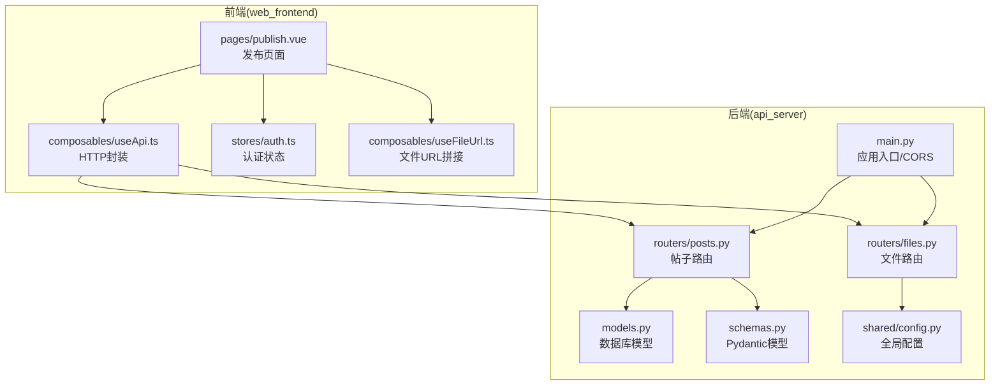
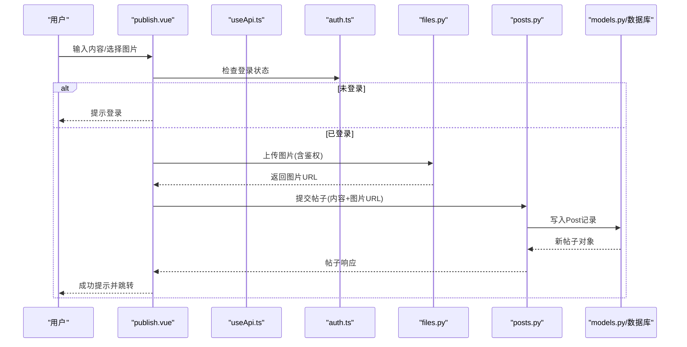
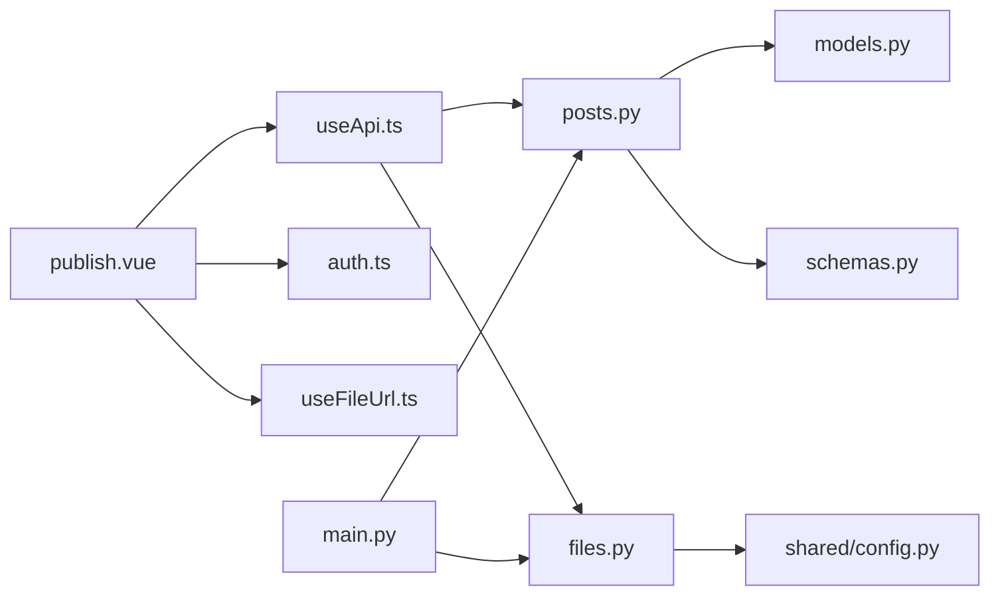

# 发布内容页面

<cite>
**本文引用的文件**
- [publish.vue](file://web_frontend/pages/publish.vue)
- [useApi.ts](file://web_frontend/composables/useApi.ts)
- [auth.ts](file://web_frontend/stores/auth.ts)
- [useFileUrl.ts](file://web_frontend/composables/useFileUrl.ts)
- [posts.py](file://api_server/routers/posts.py)
- [files.py](file://api_server/routers/files.py)
- [models.py](file://api_server/models.py)
- [schemas.py](file://api_server/schemas.py)
- [main.py](file://api_server/main.py)
- [config.py](file://shared/config.py)
- [README.md](file://README.md)
</cite>

## 目录
1. [简介](#简介)
2. [项目结构](#项目结构)
3. [核心组件](#核心组件)
4. [架构总览](#架构总览)
5. [详细组件分析](#详细组件分析)
6. [依赖关系分析](#依赖关系分析)
7. [性能考虑](#性能考虑)
8. [故障排查指南](#故障排查指南)
9. [结论](#结论)

## 简介
本文件面向AI社区“发布内容”页面，系统性阐述从表单设计、内容编辑、媒体上传到提交流程的完整实现。重点覆盖：
- 富文本编辑器集成现状与替代方案
- 图片选择与预览机制
- 表单验证规则与内容格式化
- 文件上传处理、进度显示与错误恢复
- 内容安全检查、字符限制与实时预览
- 前后端协作流程与错误处理

## 项目结构
发布内容页面位于前端Nuxt应用中，后端通过FastAPI提供REST接口。整体采用前后端分离架构，前端负责用户交互与状态管理，后端负责业务逻辑与数据持久化。

图表来源
- [publish.vue](file://web_frontend/pages/publish.vue#L1-L182)
- [useApi.ts](file://web_frontend/composables/useApi.ts#L1-L57)
- [auth.ts](file://web_frontend/stores/auth.ts#L1-L80)
- [useFileUrl.ts](file://web_frontend/composables/useFileUrl.ts#L1-L28)
- [posts.py](file://api_server/routers/posts.py#L1-L166)
- [files.py](file://api_server/routers/files.py#L1-L138)
- [models.py](file://api_server/models.py#L1-L293)
- [schemas.py](file://api_server/schemas.py#L1-L166)
- [main.py](file://api_server/main.py#L1-L69)
- [config.py](file://shared/config.py#L1-L52)

章节来源
- [publish.vue](file://web_frontend/pages/publish.vue#L1-L182)
- [posts.py](file://api_server/routers/posts.py#L1-L166)
- [files.py](file://api_server/routers/files.py#L1-L138)
- [main.py](file://api_server/main.py#L1-L69)

## 核心组件
- 发布页面组件：负责表单输入、图片上传、提交控制与提示反馈。
- API封装：统一处理鉴权、错误与响应解析。
- 认证状态：维护登录态与用户信息。
- 文件URL工具：统一拼接静态资源访问地址。
- 帖子路由：接收前端提交，写入数据库并返回响应。
- 文件路由：校验类型与大小，保存至磁盘并返回可访问URL。
- 数据模型与Schema：定义数据库结构与请求/响应数据结构。
- 全局配置：上传目录、URL前缀等运行时参数。

章节来源
- [publish.vue](file://web_frontend/pages/publish.vue#L59-L156)
- [useApi.ts](file://web_frontend/composables/useApi.ts#L8-L48)
- [auth.ts](file://web_frontend/stores/auth.ts#L18-L79)
- [useFileUrl.ts](file://web_frontend/composables/useFileUrl.ts#L5-L24)
- [posts.py](file://api_server/routers/posts.py#L72-L88)
- [files.py](file://api_server/routers/files.py#L41-L81)
- [models.py](file://api_server/models.py#L80-L94)
- [schemas.py](file://api_server/schemas.py#L68-L90)
- [config.py](file://shared/config.py#L26-L28)

## 架构总览
发布流程从用户在前端页面输入内容与选择图片开始，经过鉴权与校验，上传图片到后端，再提交帖子信息，最终写入数据库并返回结果。

图表来源
- [publish.vue](file://web_frontend/pages/publish.vue#L82-L156)
- [useApi.ts](file://web_frontend/composables/useApi.ts#L8-L48)
- [auth.ts](file://web_frontend/stores/auth.ts#L24-L26)
- [files.py](file://api_server/routers/files.py#L41-L81)
- [posts.py](file://api_server/routers/posts.py#L72-L88)
- [models.py](file://api_server/models.py#L80-L94)

## 详细组件分析

### 发布页面(publish.vue)
- 表单设计
  - 文本域：支持多行输入、字数限制与实时字数展示。
  - 图片上传：基于上传组件，限制单张图片，支持删除。
  - 提交按钮：禁用条件为内容为空或正在上传；加载状态避免重复提交。
- 验证与格式化
  - 前端字数限制与必填校验；提交前再次确认登录态与上传状态。
  - 内容自动去除首尾空白。
- 上传与预览
  - 选择图片后构建FormData并发起上传请求，显示加载提示。
  - 成功后保存图片URL，失败则清空预览并提示错误。
- 提交流程
  - 通过API封装发送POST请求，成功后提示并导航至首页。
  - 错误时统一提示，避免崩溃。

章节来源
- [publish.vue](file://web_frontend/pages/publish.vue#L23-L56)
- [publish.vue](file://web_frontend/pages/publish.vue#L82-L124)
- [publish.vue](file://web_frontend/pages/publish.vue#L126-L156)

### API封装(useApi.ts)
- 统一请求方法：GET/POST/PUT/DELETE，支持可选鉴权头。
- 自动JSON序列化与反序列化。
- 错误处理：非2xx响应抛出异常，204特殊处理。
- 基础URL来自运行时配置，便于跨环境切换。

章节来源
- [useApi.ts](file://web_frontend/composables/useApi.ts#L8-L48)

### 认证状态(auth.ts)
- 状态管理：token与用户信息，支持初始化、设置、登出与拉取用户信息。
- 登录态判断：通过token是否存在判定。
- 本地持久化：浏览器端localStorage缓存token。

章节来源
- [auth.ts](file://web_frontend/stores/auth.ts#L18-L79)

### 文件URL工具(useFileUrl.ts)
- URL拼接策略：完整URL直接返回；以/files开头或以/开头的相对路径拼接API基础地址；其他情况原样返回。
- 作用于图片预览与帖子详情中的图片展示。

章节来源
- [useFileUrl.ts](file://web_frontend/composables/useFileUrl.ts#L5-L24)

### 帖子路由(posts.py)
- 创建帖子：接收内容与图片路径，写入数据库并返回标准化响应。
- 响应转换：聚合作者信息、点赞状态与评论计数。
- 权限控制：依赖认证中间件，仅登录用户可创建。

章节来源
- [posts.py](file://api_server/routers/posts.py#L72-L88)
- [posts.py](file://api_server/routers/posts.py#L14-L42)

### 文件路由(files.py)
- 图片上传：校验扩展名与大小，生成唯一文件名，异步写入磁盘，返回可访问URL。
- 头像上传：独立接口，更严格的大小限制。
- 文件访问：提供图片与头像的静态文件访问接口。

章节来源
- [files.py](file://api_server/routers/files.py#L41-L81)
- [files.py](file://api_server/routers/files.py#L84-L119)
- [files.py](file://api_server/routers/files.py#L122-L137)

### 数据模型与Schema(models.py/schemas.py)
- Post模型：包含作者ID、内容、图片路径与时间戳等字段。
- PostCreate/PostResponse：定义请求与响应的数据结构，约束长度与可空性。
- 字段约束：内容最大长度与图片路径可空，满足前端限制与后端安全需求。

章节来源
- [models.py](file://api_server/models.py#L80-L94)
- [schemas.py](file://api_server/schemas.py#L70-L90)

### 应用入口与CORS(main.py)
- 注册路由：包括帖子、文件、认证等模块。
- CORS配置：允许前端开发服务器域名访问，保障跨域请求。

章节来源
- [main.py](file://api_server/main.py#L36-L42)

### 全局配置(shared/config.py)
- 上传目录与URL前缀：决定文件存储位置与对外访问路径。
- 数据库与JWT配置：支撑认证与持久化。

章节来源
- [config.py](file://shared/config.py#L26-L28)

## 依赖关系分析

图表来源
- [publish.vue](file://web_frontend/pages/publish.vue#L63-L66)
- [useApi.ts](file://web_frontend/composables/useApi.ts#L3)
- [auth.ts](file://web_frontend/stores/auth.ts#L65)
- [useFileUrl.ts](file://web_frontend/composables/useFileUrl.ts#L3)
- [posts.py](file://api_server/routers/posts.py#L7)
- [files.py](file://api_server/routers/files.py#L10)
- [models.py](file://api_server/models.py#L4)
- [schemas.py](file://api_server/schemas.py#L1)
- [config.py](file://shared/config.py#L10)
- [main.py](file://api_server/main.py#L11)

## 性能考虑
- 前端
  - 单图上传：避免并发上传导致的资源竞争，减少内存占用。
  - 加载提示：提升用户感知，降低重复点击概率。
- 后端
  - 异步文件写入：使用异步文件库，避免阻塞请求线程。
  - 文件大小限制：防止大文件占用过多带宽与存储空间。
- 数据层
  - 字段长度限制：减少数据库存储压力与查询开销。
  - 唯一文件名：避免同名冲突与路径遍历风险。

[本节为通用建议，无需特定文件来源]

## 故障排查指南
- 无法上传图片
  - 检查文件类型与大小是否符合后端限制。
  - 确认上传目录存在且具备写权限。
  - 查看后端错误响应与日志。
- 提交失败
  - 确认已登录且token有效。
  - 检查网络请求与CORS配置。
  - 查看后端异常堆栈与数据库连接状态。
- 图片不显示
  - 确认返回的URL可访问。
  - 检查静态文件服务与URL前缀配置。

章节来源
- [files.py](file://api_server/routers/files.py#L49-L65)
- [files.py](file://api_server/routers/files.py#L22-L31)
- [main.py](file://api_server/main.py#L23-L34)
- [config.py](file://shared/config.py#L26-L28)

## 结论
发布内容页面实现了简洁高效的发帖体验：前端提供直观的输入与上传控件，后端进行严格的安全与格式校验，并通过统一的API封装与配置管理保证了系统的可维护性与可扩展性。后续可考虑引入富文本编辑器、多图上传与上传进度条等增强功能，进一步提升用户体验。