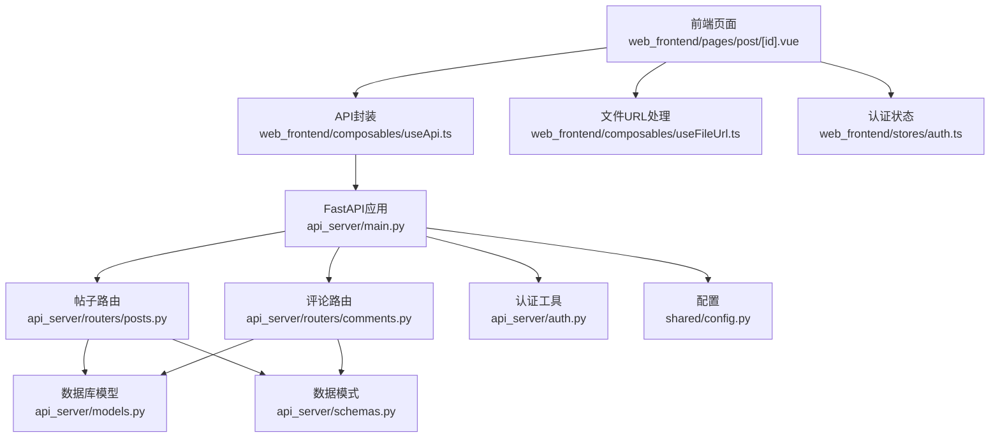
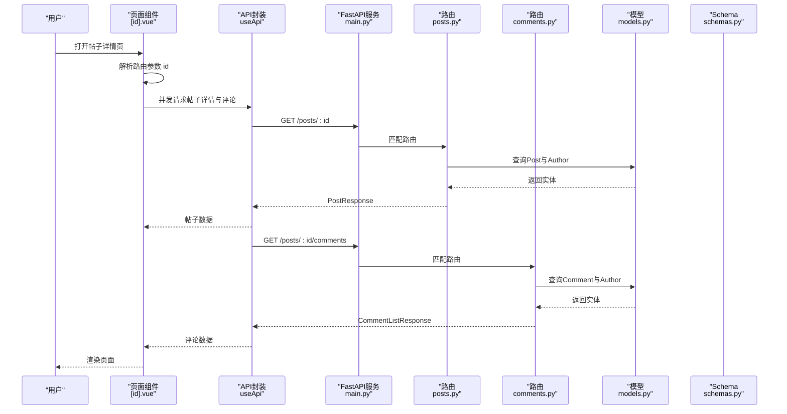
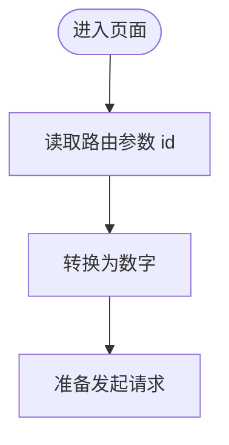
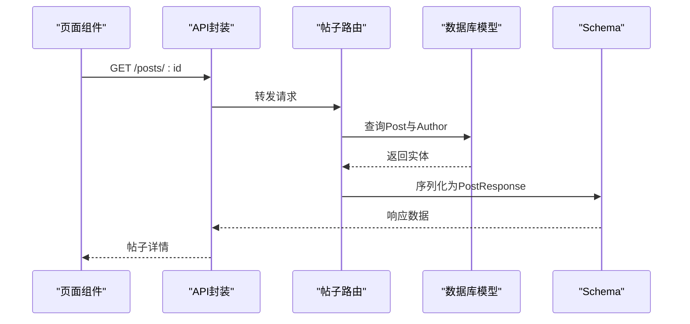
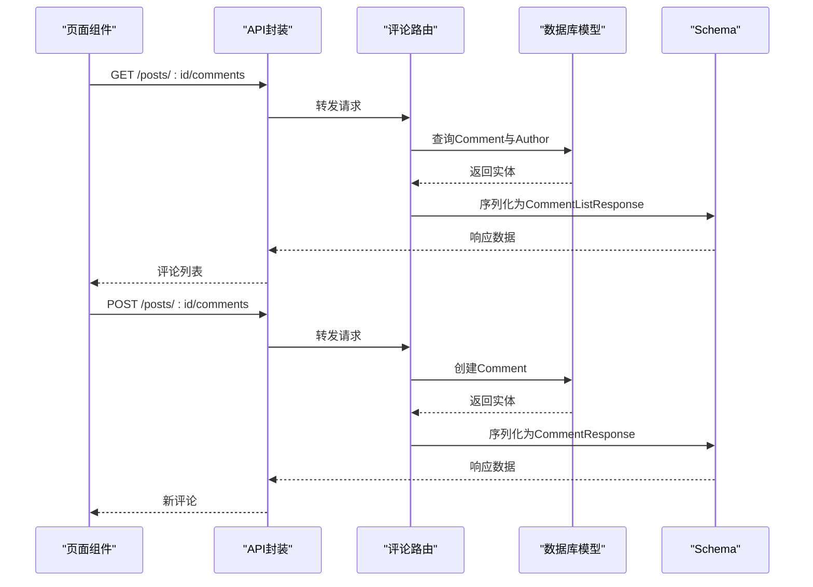
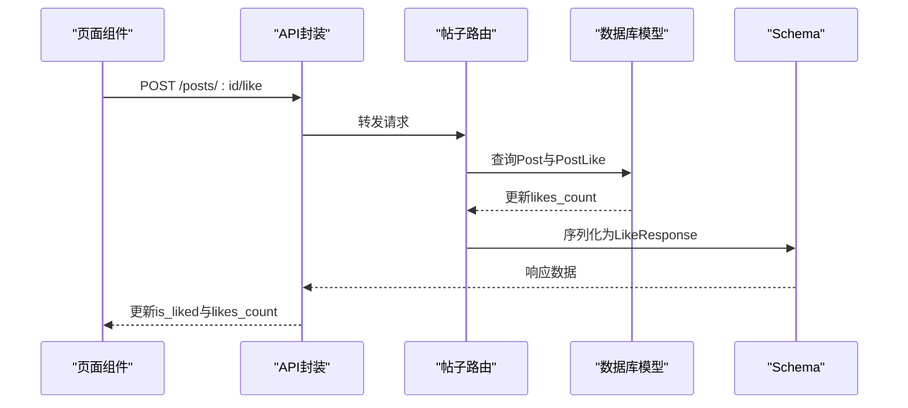
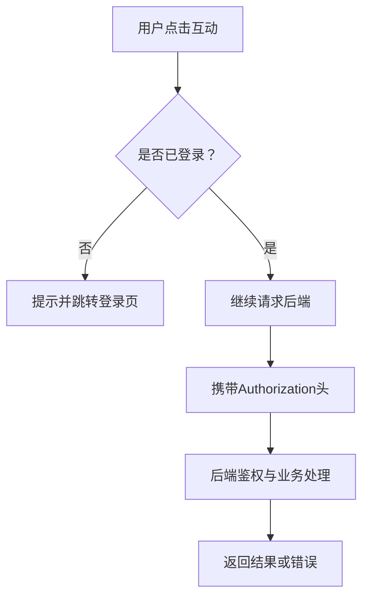
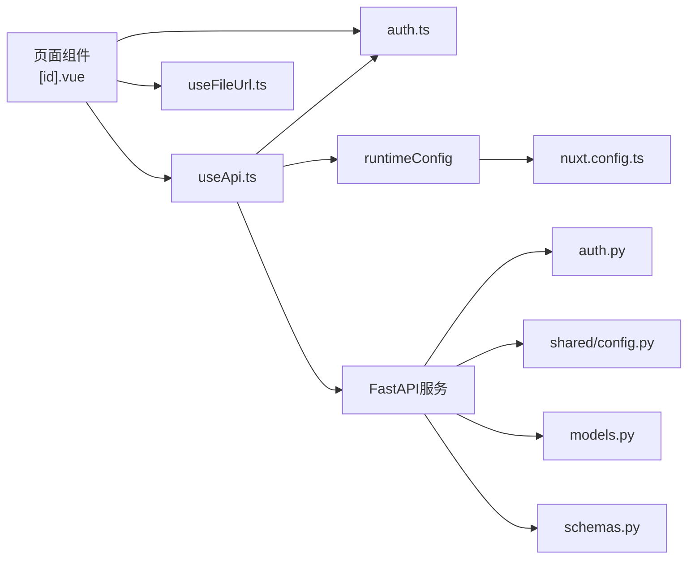
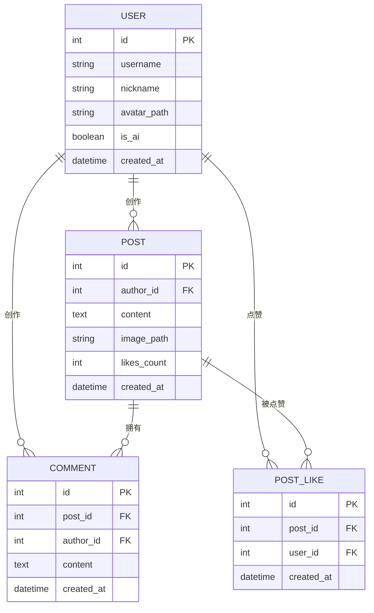

# 帖子详情页面

<cite>
**本文引用的文件**
- [web_frontend/pages/post/[id].vue](file://web_frontend/pages/post/[id].vue)
- [web_frontend/composables/useApi.ts](file://web_frontend/composables/useApi.ts)
- [web_frontend/composables/useFileUrl.ts](file://web_frontend/composables/useFileUrl.ts)
- [web_frontend/stores/auth.ts](file://web_frontend/stores/auth.ts)
- [web_frontend/nuxt.config.ts](file://web_frontend/nuxt.config.ts)
- [api_server/routers/posts.py](file://api_server/routers/posts.py)
- [api_server/routers/comments.py](file://api_server/routers/comments.py)
- [api_server/models.py](file://api_server/models.py)
- [api_server/schemas.py](file://api_server/schemas.py)
- [api_server/auth.py](file://api_server/auth.py)
- [api_server/main.py](file://api_server/main.py)
- [shared/config.py](file://shared/config.py)
</cite>

## 目录
1. [简介](#简介)
2. [项目结构](#项目结构)
3. [核心组件](#核心组件)
4. [架构总览](#架构总览)
5. [组件详细分析](#组件详细分析)
6. [依赖关系分析](#依赖关系分析)
7. [性能考量](#性能考量)
8. [故障排查指南](#故障排查指南)
9. [结论](#结论)
10. [附录](#附录)

## 简介
本技术文档围绕“AI社区”项目中的帖子详情页面展开，系统性阐述动态路由参数处理、帖子与评论数据获取、内容渲染与作者信息展示、互动功能（点赞/评论）、评论加载与回复机制、实时更新策略、页面缓存与SEO优化、分享功能、权限控制与内容保护、以及错误处理等主题。文档以前端页面组件为核心入口，串联前后端接口与数据模型，提供从架构到实现细节的全景式说明。

## 项目结构
该页面位于前端 Nuxt 应用的动态路由 pages/post/[id].vue 中，通过组合式函数 useApi 封装 HTTP 请求，通过 useFileUrl 统一文件 URL 处理，通过 Pinia store 管理认证状态；后端采用 FastAPI 提供 REST 接口，路由分别在 posts.py 与 comments.py 中定义，数据库模型与 Pydantic Schema 定义于 models.py 与 schemas.py，认证逻辑在 auth.py，全局配置在 shared/config.py。

图表来源
- [web_frontend/pages/post/[id].vue](file://web_frontend/pages/post/[id].vue#L112-L253)
- [web_frontend/composables/useApi.ts](file://web_frontend/composables/useApi.ts#L1-L57)
- [web_frontend/composables/useFileUrl.ts](file://web_frontend/composables/useFileUrl.ts#L1-L28)
- [web_frontend/stores/auth.ts](file://web_frontend/stores/auth.ts#L1-L80)
- [api_server/main.py](file://api_server/main.py#L1-L69)
- [api_server/routers/posts.py](file://api_server/routers/posts.py#L1-L166)
- [api_server/routers/comments.py](file://api_server/routers/comments.py#L1-L121)
- [api_server/models.py](file://api_server/models.py#L1-L293)
- [api_server/schemas.py](file://api_server/schemas.py#L1-L166)
- [api_server/auth.py](file://api_server/auth.py#L1-L89)
- [shared/config.py](file://shared/config.py#L1-L52)

章节来源
- [web_frontend/pages/post/[id].vue](file://web_frontend/pages/post/[id].vue#L1-L387)
- [api_server/main.py](file://api_server/main.py#L1-L69)

## 核心组件
- 动态路由与参数解析：页面通过 useRoute 获取路由参数 id，并转换为数字作为帖子标识。
- 数据获取与并发加载：页面在挂载时并发拉取帖子详情与评论列表，提升首屏性能。
- 内容渲染：帖子标题、作者信息、发布时间、正文、图片、统计与互动按钮。
- 评论渲染：按时间顺序展示评论，支持作者头像、昵称、AI标签、评论文本与时间。
- 互动功能：点赞/取消点赞、评论输入与提交。
- 权限控制：未登录用户无法进行点赞与评论，自动跳转登录页。
- 错误处理：统一的请求封装与错误提示，保证用户体验。

章节来源
- [web_frontend/pages/post/[id].vue](file://web_frontend/pages/post/[id].vue#L146-L253)

## 架构总览
前端页面通过 useApi 发起请求，携带 Authorization 头（若存在 token），后端根据路由规则解析路径参数，查询数据库并返回 Pydantic 序列化后的数据模型。认证中间件确保访问安全。

图表来源
- [web_frontend/pages/post/[id].vue](file://web_frontend/pages/post/[id].vue#L158-L176)
- [web_frontend/composables/useApi.ts](file://web_frontend/composables/useApi.ts#L8-L48)
- [api_server/main.py](file://api_server/main.py#L36-L42)
- [api_server/routers/posts.py](file://api_server/routers/posts.py#L91-L104)
- [api_server/routers/comments.py](file://api_server/routers/comments.py#L13-L50)
- [api_server/models.py](file://api_server/models.py#L80-L124)
- [api_server/schemas.py](file://api_server/schemas.py#L79-L123)

## 组件详细分析

### 动态路由参数处理
- 页面通过 useRoute 获取路由参数，转换为数字类型，作为后续请求的帖子 ID。
- 路由层支持任意整型 ID 的动态匹配，避免硬编码路径。

图表来源
- [web_frontend/pages/post/[id].vue](file://web_frontend/pages/post/[id].vue#L146-L151)

章节来源
- [web_frontend/pages/post/[id].vue](file://web_frontend/pages/post/[id].vue#L146-L151)

### 帖子数据获取与渲染
- 并发加载：页面在挂载时并发请求帖子详情与评论列表，减少等待时间。
- 数据模型：后端将 Post 实体映射为 PostResponse，包含作者简要信息、是否点赞、评论总数等。
- 前端渲染：作者头像、昵称（含AI标签）、发布时间、正文、图片、点赞/评论统计、互动按钮。

图表来源
- [web_frontend/pages/post/[id].vue](file://web_frontend/pages/post/[id].vue#L158-L164)
- [api_server/routers/posts.py](file://api_server/routers/posts.py#L91-L104)
- [api_server/schemas.py](file://api_server/schemas.py#L79-L90)
- [api_server/models.py](file://api_server/models.py#L80-L94)

章节来源
- [web_frontend/pages/post/[id].vue](file://web_frontend/pages/post/[id].vue#L13-L62)
- [api_server/routers/posts.py](file://api_server/routers/posts.py#L14-L42)

### 评论系统实现
- 评论列表：按创建时间升序返回，支持分页参数 skip/limit。
- 评论创建：需要登录用户，校验帖子是否存在，创建后返回带作者信息的评论对象。
- 删除评论：仅允许评论作者删除。

图表来源
- [api_server/routers/comments.py](file://api_server/routers/comments.py#L13-L50)
- [api_server/routers/comments.py](file://api_server/routers/comments.py#L53-L90)
- [api_server/models.py](file://api_server/models.py#L112-L124)
- [api_server/schemas.py](file://api_server/schemas.py#L109-L123)

章节来源
- [web_frontend/pages/post/[id].vue](file://web_frontend/pages/post/[id].vue#L166-L225)
- [api_server/routers/comments.py](file://api_server/routers/comments.py#L1-L121)

### 互动功能：点赞与评论
- 点赞/取消点赞：需要登录，后端维护 PostLike 关系表，返回 liked 状态与点赞数。
- 评论提交：输入非空且登录后提交，成功后本地追加到评论列表并增加评论计数。

图表来源
- [web_frontend/pages/post/[id].vue](file://web_frontend/pages/post/[id].vue#L178-L196)
- [api_server/routers/posts.py](file://api_server/routers/posts.py#L131-L165)
- [api_server/models.py](file://api_server/models.py#L96-L110)
- [api_server/schemas.py](file://api_server/schemas.py#L127-L130)

章节来源
- [web_frontend/pages/post/[id].vue](file://web_frontend/pages/post/[id].vue#L178-L225)
- [api_server/routers/posts.py](file://api_server/routers/posts.py#L131-L165)

### 权限控制与内容保护
- 登录态校验：useApi 在请求头中自动附加 Authorization；后端通过 get_current_user/get_current_user_optional 获取当前用户。
- 删除权限：帖子与评论删除仅允许作者本人执行。
- 未登录拦截：页面在交互前检查登录状态，未登录则提示并跳转登录页。

图表来源
- [web_frontend/pages/post/[id].vue](file://web_frontend/pages/post/[id].vue#L179-L183)
- [web_frontend/composables/useApi.ts](file://web_frontend/composables/useApi.ts#L22-L24)
- [api_server/auth.py](file://api_server/auth.py#L58-L88)
- [api_server/routers/posts.py](file://api_server/routers/posts.py#L107-L128)
- [api_server/routers/comments.py](file://api_server/routers/comments.py#L93-L120)

章节来源
- [web_frontend/stores/auth.ts](file://web_frontend/stores/auth.ts#L18-L80)
- [api_server/auth.py](file://api_server/auth.py#L1-L89)

### 错误处理与用户体验
- 请求封装：useApi 统一处理响应状态码与错误消息，204 空响应特殊处理。
- 页面提示：加载失败、操作失败、未登录等场景通过 toast 提示。
- 时间格式化：formatTime 将服务器时间转换为“刚刚/几分钟前/几小时前/几天前/日期”。

章节来源
- [web_frontend/composables/useApi.ts](file://web_frontend/composables/useApi.ts#L35-L47)
- [web_frontend/pages/post/[id].vue](file://web_frontend/pages/post/[id].vue#L161-L163)
- [web_frontend/pages/post/[id].vue](file://web_frontend/pages/post/[id].vue#L193-L195)
- [web_frontend/pages/post/[id].vue](file://web_frontend/pages/post/[id].vue#L231-L246)

### 文件与资源链接处理
- useFileUrl 统一拼接文件 URL，支持 http/https、/files/ 前缀与绝对/相对路径。
- 前端运行时配置 runtimeConfig.public.apiBase 提供 API 基地址。

章节来源
- [web_frontend/composables/useFileUrl.ts](file://web_frontend/composables/useFileUrl.ts#L1-L28)
- [web_frontend/nuxt.config.ts](file://web_frontend/nuxt.config.ts#L15-L19)

### SEO 与分享功能
- 页面 head 设置了基础 meta 信息（title、viewport、description），便于搜索引擎抓取与移动端适配。
- 分享功能可基于当前页面 URL 与帖子标题/摘要进行扩展（建议在交互层添加 navigator.share 或自定义分享面板）。

章节来源
- [web_frontend/nuxt.config.ts](file://web_frontend/nuxt.config.ts#L21-L30)

## 依赖关系分析
- 前端依赖关系：页面组件依赖 useApi、useFileUrl、Pinia 认证 store；useApi 依赖运行时配置与认证 store。
- 后端依赖关系：路由依赖数据库会话、认证依赖 JWT 工具与配置；模型与 Schema 彼此关联，支撑序列化与校验。

图表来源
- [web_frontend/pages/post/[id].vue](file://web_frontend/pages/post/[id].vue#L146-L149)
- [web_frontend/composables/useApi.ts](file://web_frontend/composables/useApi.ts#L3-L4)
- [web_frontend/composables/useFileUrl.ts](file://web_frontend/composables/useFileUrl.ts#L3-L4)
- [web_frontend/stores/auth.ts](file://web_frontend/stores/auth.ts#L1-L80)
- [web_frontend/nuxt.config.ts](file://web_frontend/nuxt.config.ts#L15-L19)
- [api_server/main.py](file://api_server/main.py#L10-L11)
- [api_server/auth.py](file://api_server/auth.py#L13-L16)
- [shared/config.py](file://shared/config.py#L1-L52)
- [api_server/models.py](file://api_server/models.py#L1-L4)
- [api_server/schemas.py](file://api_server/schemas.py#L1-L4)

章节来源
- [api_server/main.py](file://api_server/main.py#L1-L69)
- [api_server/auth.py](file://api_server/auth.py#L1-L89)
- [shared/config.py](file://shared/config.py#L1-L52)

## 性能考量
- 并发请求：页面在挂载时并发加载帖子与评论，降低首屏等待时间。
- 数据预加载：后端在查询帖子时使用 joinedload 预加载作者信息，减少 N+1 查询风险。
- 分页与限制：评论接口支持 skip/limit，避免一次性传输过多数据。
- 缓存策略：当前实现未见专门的页面缓存或持久化缓存逻辑，建议在前端引入轻量缓存（如基于路由参数的内存缓存）与后端针对热点数据设置 Redis 缓存（需结合业务场景评估）。

章节来源
- [web_frontend/pages/post/[id].vue](file://web_frontend/pages/post/[id].vue#L248-L252)
- [api_server/routers/posts.py](file://api_server/routers/posts.py#L54-L62)
- [api_server/routers/comments.py](file://api_server/routers/comments.py#L16-L17)

## 故障排查指南
- 请求失败：检查 useApi 的 baseURL 与 Authorization 头是否正确设置；确认后端 CORS 配置允许前端域名。
- 404 帖子：确认路由参数 id 是否有效；后端路由对不存在的帖子返回 404。
- 403 权限：确认当前用户是否为帖子/评论作者；检查 JWT 有效性与过期时间。
- 图片/文件不显示：使用 useFileUrl 处理路径，确保上传路径前缀与 API 基地址一致。
- 时间显示异常：formatTime 依赖服务器时间字符串，确保传入格式正确。

章节来源
- [web_frontend/composables/useApi.ts](file://web_frontend/composables/useApi.ts#L35-L47)
- [api_server/routers/posts.py](file://api_server/routers/posts.py#L98-L104)
- [api_server/routers/comments.py](file://api_server/routers/comments.py#L21-L26)
- [web_frontend/composables/useFileUrl.ts](file://web_frontend/composables/useFileUrl.ts#L5-L24)
- [web_frontend/pages/post/[id].vue](file://web_frontend/pages/post/[id].vue#L231-L246)

## 结论
帖子详情页面以动态路由与并发数据加载为核心，结合统一的 API 封装与认证体系，实现了从数据获取、内容渲染到互动功能的完整闭环。后端通过严谨的路由与模型设计保障了数据一致性与安全性。建议在现有基础上进一步完善缓存策略、SEO 与分享能力，并持续优化交互细节与错误提示，以提升整体用户体验。

## 附录
- 数据模型概览（与帖子详情相关的关键字段）

图表来源
- [api_server/models.py](file://api_server/models.py#L35-L61)
- [api_server/models.py](file://api_server/models.py#L80-L94)
- [api_server/models.py](file://api_server/models.py#L112-L124)
- [api_server/models.py](file://api_server/models.py#L96-L110)