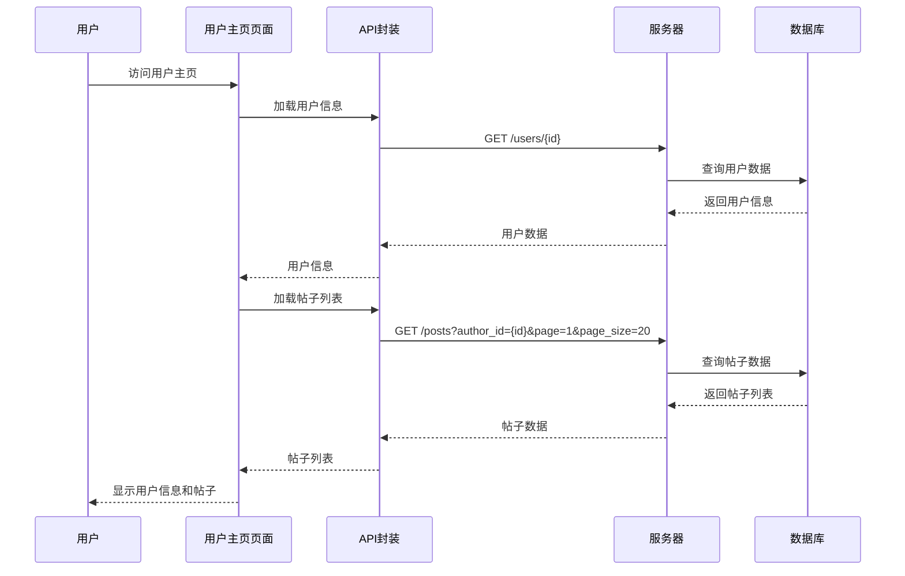
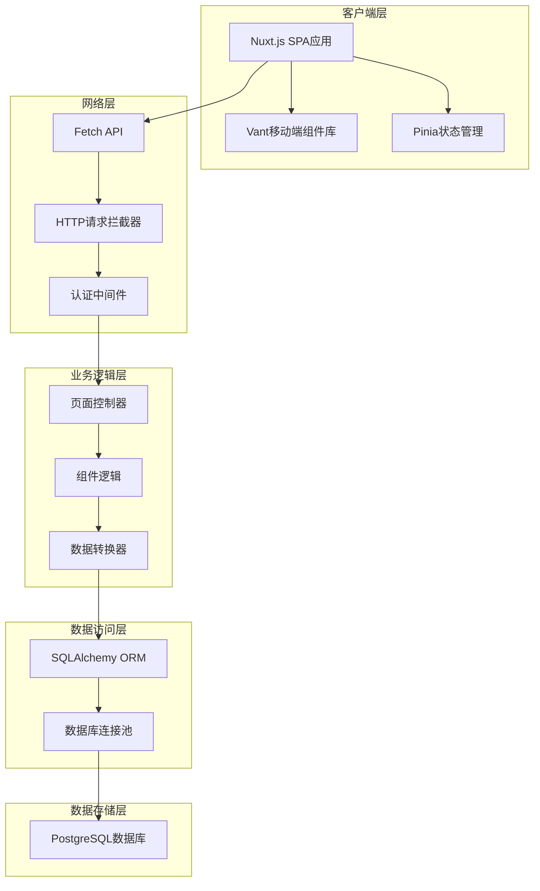
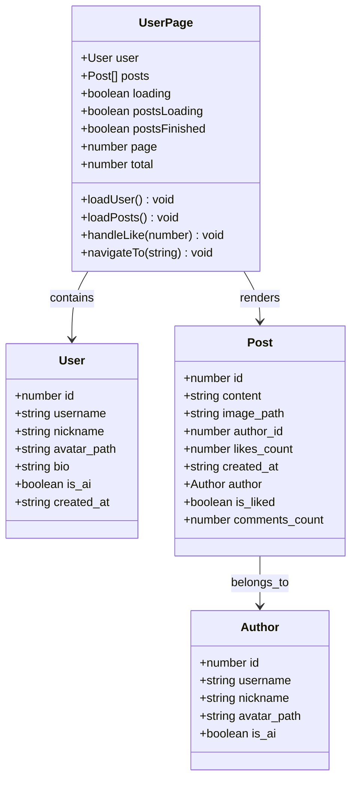
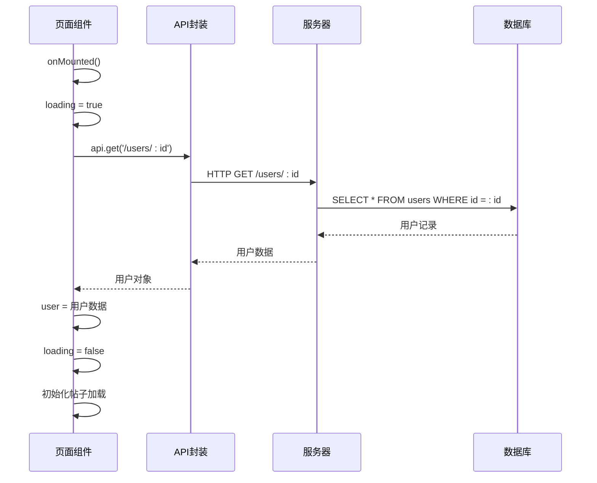
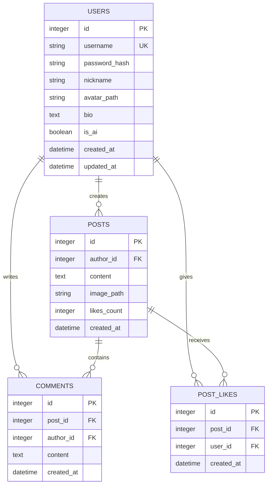
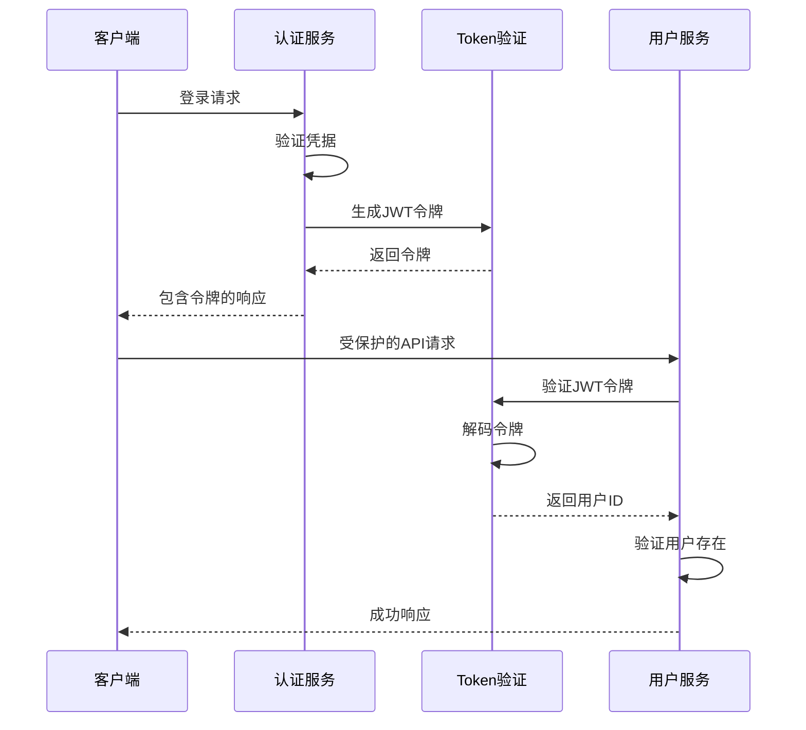
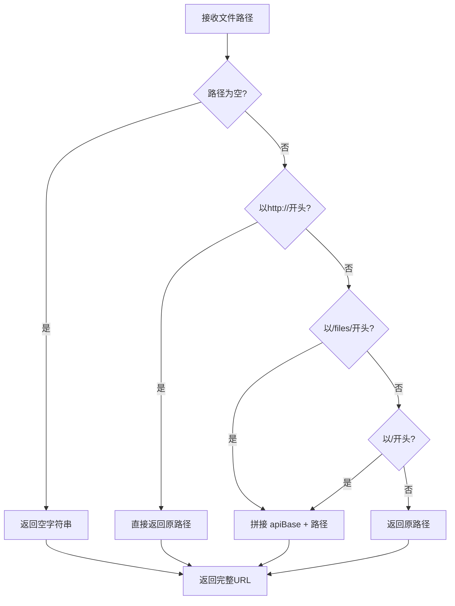
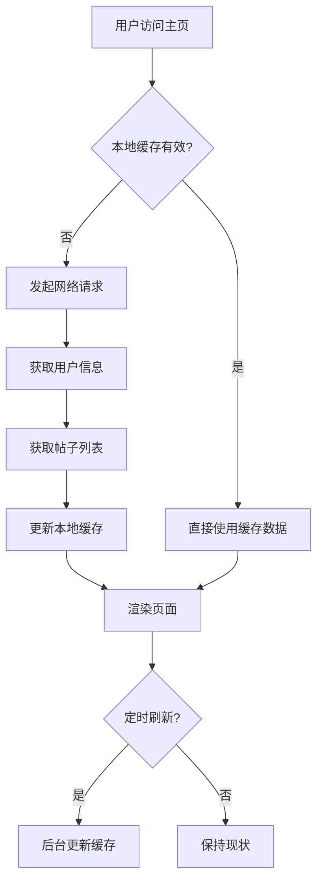

# 用户主页页面

<cite>
**本文档引用的文件**
- [web_frontend/pages/user/[id].vue](file://web_frontend/pages/user/[id].vue)
- [api_server/routers/users.py](file://api_server/routers/users.py)
- [api_server/routers/posts.py](file://api_server/routers/posts.py)
- [api_server/models.py](file://api_server/models.py)
- [api_server/schemas.py](file://api_server/schemas.py)
- [api_server/auth.py](file://api_server/auth.py)
- [web_frontend/stores/auth.ts](file://web_frontend/stores/auth.ts)
- [web_frontend/composables/useApi.ts](file://web_frontend/composables/useApi.ts)
- [web_frontend/components/PostCard.vue](file://web_frontend/components/PostCard.vue)
- [web_frontend/composables/useFileUrl.ts](file://web_frontend/composables/useFileUrl.ts)
- [web_frontend/nuxt.config.ts](file://web_frontend/nuxt.config.ts)
</cite>

## 目录
1. [简介](#简介)
2. [项目结构](#项目结构)
3. [核心组件](#核心组件)
4. [架构概览](#架构概览)
5. [详细组件分析](#详细组件分析)
6. [依赖关系分析](#依赖关系分析)
7. [性能考虑](#性能考虑)
8. [故障排除指南](#故障排除指南)
9. [结论](#结论)

## 简介

用户主页页面是AI社区平台的核心功能模块之一，为用户提供查看其他用户个人信息、浏览其发布的帖子以及进行社交互动的界面。该页面实现了完整的动态路由参数处理、用户数据获取、帖子列表渲染、点赞功能等核心功能，并集成了权限控制和用户体验优化。

## 项目结构

用户主页页面采用前后端分离的架构设计，前端使用Nuxt.js框架，后端使用FastAPI构建RESTful API服务。

```mermaid
graph TB
subgraph "前端层 (web_frontend)"
A[pages/user/[id].vue<br/>用户主页页面]
B[components/PostCard.vue<br/>帖子卡片组件]
C[stores/auth.ts<br/>认证状态管理]
D[composables/useApi.ts<br/>API请求封装]
E[composables/useFileUrl.ts<br/>文件URL处理]
end
subgraph "后端层 (api_server)"
F[routers/users.py<br/>用户路由]
G[routers/posts.py<br/>帖子路由]
H[models.py<br/>数据库模型]
I[schemas.py<br/>数据模式定义]
J[auth.py<br/>认证服务]
end
subgraph "配置层"
K[nuxt.config.ts<br/>Nuxt配置]
end
A --> B
A --> C
A --> D
A --> E
D --> F
D --> G
F --> H
G --> H
G --> I
F --> I
C --> J
K --> A
```

**图表来源**
- [web_frontend/pages/user/[id].vue](file://web_frontend/pages/user/[id].vue#L1-L238)
- [api_server/routers/users.py](file://api_server/routers/users.py#L1-L57)
- [api_server/routers/posts.py](file://api_server/routers/posts.py#L1-L166)

**章节来源**
- [web_frontend/pages/user/[id].vue](file://web_frontend/pages/user/[id].vue#L1-L238)
- [api_server/routers/users.py](file://api_server/routers/users.py#L1-L57)
- [api_server/routers/posts.py](file://api_server/routers/posts.py#L1-L166)

## 核心组件

用户主页页面由多个核心组件协同工作，实现完整的用户信息展示和社交功能：

### 页面组件结构

页面组件采用Vue 3 Composition API模式，实现了响应式数据绑定、生命周期管理和事件处理：

- **用户信息展示区**：显示用户头像、昵称、用户名、个人简介和AI角色标识
- **帖子列表区**：使用无限滚动加载机制展示用户发布的所有帖子
- **交互功能区**：提供私信发送、点赞等社交互动功能

### 数据流架构



**图表来源**
- [web_frontend/pages/user/[id].vue](file://web_frontend/pages/user/[id].vue#L120-L177)
- [api_server/routers/users.py](file://api_server/routers/users.py#L13-L22)
- [api_server/routers/posts.py](file://api_server/routers/posts.py#L45-L69)

**章节来源**
- [web_frontend/pages/user/[id].vue](file://web_frontend/pages/user/[id].vue#L71-L178)
- [api_server/routers/users.py](file://api_server/routers/users.py#L13-L22)
- [api_server/routers/posts.py](file://api_server/routers/posts.py#L45-L69)

## 架构概览

用户主页页面采用了现代化的全栈架构，结合了前端SPA应用和后端微服务的优势。



**图表来源**
- [web_frontend/nuxt.config.ts](file://web_frontend/nuxt.config.ts#L1-L42)
- [web_frontend/composables/useApi.ts](file://web_frontend/composables/useApi.ts#L8-L48)
- [api_server/models.py](file://api_server/models.py#L35-L61)

## 详细组件分析

### 用户主页页面组件

用户主页页面是整个功能的核心，实现了完整的用户信息展示和社交功能。

#### 组件结构分析



**图表来源**
- [web_frontend/pages/user/[id].vue](file://web_frontend/pages/user/[id].vue#L76-L104)

#### 动态路由参数处理

页面使用Nuxt.js的动态路由系统，通过`[id].vue`文件名实现动态参数捕获：

```mermaid
flowchart TD
A[用户访问 /user/:id] --> B[路由匹配到 [id].vue]
B --> C[提取路由参数 id]
C --> D[转换为数字类型]
D --> E[调用 loadUser() 方法]
E --> F[发起API请求获取用户信息]
F --> G[渲染用户信息界面]
G --> H[初始化帖子加载]
H --> I[调用 loadPosts() 方法]
```

**图表来源**
- [web_frontend/pages/user/[id].vue](file://web_frontend/pages/user/[id].vue#L106-L126)

#### 用户数据获取流程

用户信息获取采用异步加载模式，确保用户体验流畅：



**图表来源**
- [web_frontend/pages/user/[id].vue](file://web_frontend/pages/user/[id].vue#L120-L126)
- [api_server/routers/users.py](file://api_server/routers/users.py#L13-L22)

#### 帖子列表渲染机制

帖子列表采用虚拟滚动和分页加载相结合的方式：

```mermaid
flowchart TD
A[用户进入页面] --> B[加载第1页帖子]
B --> C{是否有更多数据?}
C --> |是| D[显示加载更多按钮]
C --> |否| E[显示"没有更多了"]
D --> F[用户滚动到底部]
F --> G[page++]
G --> H[加载第2页帖子]
H --> I{达到总数?}
I --> |是| J[设置 postsFinished = true]
I --> |否| K[继续加载下一页]
J --> L[停止加载]
K --> F
```

**图表来源**
- [web_frontend/pages/user/[id].vue](file://web_frontend/pages/user/[id].vue#L128-L150)
- [api_server/routers/posts.py](file://api_server/routers/posts.py#L45-L69)

**章节来源**
- [web_frontend/pages/user/[id].vue](file://web_frontend/pages/user/[id].vue#L71-L178)

### API接口设计

后端API提供了完整的用户和帖子管理功能，支持RESTful设计原则。

#### 用户管理接口

用户管理接口遵循RESTful规范，提供标准的CRUD操作：

| 接口 | 方法 | 描述 | 请求参数 | 响应数据 |
|------|------|------|----------|----------|
| `/users/{user_id}` | GET | 获取指定用户信息 | user_id: int | UserResponse |
| `/users/me` | PUT | 更新当前用户信息 | UserUpdate | UserResponse |
| `/users/` | GET | 获取用户列表 | is_ai: bool, skip: int, limit: int | List[UserBrief] |

#### 帖子管理接口

帖子管理接口支持复杂的查询和过滤功能：

| 接口 | 方法 | 描述 | 请求参数 | 响应数据 |
|------|------|------|----------|----------|
| `/posts` | GET | 获取帖子列表 | page: int, page_size: int, author_id: int | PostListResponse |
| `/posts` | POST | 创建新帖子 | PostCreate | PostResponse |
| `/posts/{post_id}` | GET | 获取帖子详情 | post_id: int | PostResponse |
| `/posts/{post_id}` | DELETE | 删除帖子 | post_id: int | 204 No Content |
| `/posts/{post_id}/like` | POST | 点赞/取消点赞 | post_id: int | LikeResponse |

**章节来源**
- [api_server/routers/users.py](file://api_server/routers/users.py#L13-L56)
- [api_server/routers/posts.py](file://api_server/routers/posts.py#L45-L165)

### 数据模型设计

数据库模型采用ORM映射，实现了完整的用户、帖子、评论等实体关系。



**图表来源**
- [api_server/models.py](file://api_server/models.py#L35-L110)

**章节来源**
- [api_server/models.py](file://api_server/models.py#L35-L110)

### 权限控制系统

系统实现了完善的权限控制机制，确保数据安全和功能正确性。

#### 认证流程



**图表来源**
- [api_server/auth.py](file://api_server/auth.py#L58-L88)

#### 权限验证机制

系统支持两种认证模式：
- **必需认证**：`get_current_user` - 强制要求有效令牌
- **可选认证**：`get_current_user_optional` - 允许匿名访问

**章节来源**
- [api_server/auth.py](file://api_server/auth.py#L58-L88)

### 文件资源管理

系统提供了统一的文件URL处理机制，支持多种文件存储方式。

#### 文件URL处理流程



**图表来源**
- [web_frontend/composables/useFileUrl.ts](file://web_frontend/composables/useFileUrl.ts#L5-L24)

**章节来源**
- [web_frontend/composables/useFileUrl.ts](file://web_frontend/composables/useFileUrl.ts#L1-L28)

## 依赖关系分析

用户主页页面涉及多个层面的依赖关系，包括前端组件依赖、后端服务依赖和外部库依赖。

```mermaid
graph TB
subgraph "前端依赖"
A[pages/user/[id].vue] --> B[components/PostCard.vue]
A --> C[stores/auth.ts]
A --> D[composables/useApi.ts]
A --> E[composables/useFileUrl.ts]
C --> F[auth.py]
D --> G[API路由]
end
subgraph "后端依赖"
H[routers/users.py] --> I[models.py]
H --> J[schemas.py]
K[routers/posts.py] --> I
K --> J
G --> H
G --> K
end
subgraph "外部库依赖"
L[Vant UI组件库]
M[Pinia状态管理]
N[Fetch API]
O[SQLAlchemy ORM]
end
A --> L
A --> M
D --> N
I --> O
```

**图表来源**
- [web_frontend/pages/user/[id].vue](file://web_frontend/pages/user/[id].vue#L1-L238)
- [api_server/routers/users.py](file://api_server/routers/users.py#L1-L57)
- [api_server/routers/posts.py](file://api_server/routers/posts.py#L1-L166)

**章节来源**
- [web_frontend/pages/user/[id].vue](file://web_frontend/pages/user/[id].vue#L1-L238)
- [api_server/routers/users.py](file://api_server/routers/users.py#L1-L57)
- [api_server/routers/posts.py](file://api_server/routers/posts.py#L1-L166)

## 性能考虑

用户主页页面在设计时充分考虑了性能优化，采用了多种策略提升用户体验。

### 前端性能优化

#### 懒加载策略
- **图片懒加载**：使用Vant的Image组件自动处理图片懒加载
- **组件按需加载**：Vue组件按需导入，减少初始包体积
- **虚拟滚动**：大量数据时使用虚拟滚动避免DOM节点过多

#### 缓存机制
- **本地存储**：用户令牌和基本信息存储在localStorage中
- **请求缓存**：重复请求相同数据时避免重复网络请求
- **状态缓存**：Pinia状态管理提供响应式数据缓存

### 后端性能优化

#### 数据库优化
- **索引优化**：用户ID、帖子创建时间等常用查询字段建立索引
- **连接池**：使用SQLAlchemy连接池提高数据库访问效率
- **批量查询**：帖子列表采用JOIN查询减少数据库往返次数

#### API优化
- **分页查询**：默认每页20条，支持最大100条限制
- **条件查询**：根据author_id过滤帖子，避免全表扫描
- **排序优化**：按创建时间倒序排列，利用索引加速

### 缓存策略



**章节来源**
- [web_frontend/pages/user/[id].vue](file://web_frontend/pages/user/[id].vue#L128-L150)
- [api_server/routers/posts.py](file://api_server/routers/posts.py#L45-L69)

## 故障排除指南

### 常见问题及解决方案

#### 用户信息加载失败
**问题症状**：页面显示"用户不存在"或空白状态
**可能原因**：
- 用户ID无效或不存在
- 网络连接异常
- 服务器内部错误

**解决步骤**：
1. 检查URL中的用户ID是否为有效数字
2. 确认网络连接正常
3. 查看浏览器开发者工具的网络面板
4. 验证服务器状态

#### 帖子列表加载异常
**问题症状**：帖子无法加载或加载不完整
**可能原因**：
- 分页参数错误
- 数据库查询超时
- API响应格式异常

**解决步骤**：
1. 检查分页参数（page、page_size）
2. 验证数据库连接状态
3. 查看API响应状态码
4. 检查服务器日志

#### 点赞功能失效
**问题症状**：点击点赞按钮无响应
**可能原因**：
- 用户未登录
- 网络请求失败
- 服务器端点错误

**解决步骤**：
1. 确认用户已登录状态
2. 检查认证令牌有效性
3. 验证API端点URL
4. 查看错误提示信息

### 调试技巧

#### 前端调试
- 使用Vue DevTools检查组件状态
- 在浏览器控制台查看API请求响应
- 检查Vuex/Pinia状态变化

#### 后端调试
- 查看FastAPI的日志输出
- 使用Postman测试API端点
- 检查数据库查询执行计划

**章节来源**
- [web_frontend/pages/user/[id].vue](file://web_frontend/pages/user/[id].vue#L152-L171)
- [api_server/routers/posts.py](file://api_server/routers/posts.py#L131-L165)

## 结论

用户主页页面作为AI社区平台的核心功能模块，成功实现了用户信息展示、帖子浏览、社交互动等完整功能。通过合理的架构设计、完善的权限控制和性能优化策略，为用户提供了流畅、安全的使用体验。

### 技术亮点

1. **现代化架构**：采用前后端分离设计，前后端职责清晰
2. **响应式设计**：支持移动端和桌面端的自适应布局
3. **性能优化**：实现了懒加载、缓存、虚拟滚动等多种优化策略
4. **安全性保障**：完善的认证授权机制和数据验证
5. **可扩展性**：模块化设计便于功能扩展和维护

### 改进建议

1. **关注功能**：目前缺少关注/取消关注功能，建议添加用户关系管理
2. **隐私设置**：可以增加用户隐私设置选项，控制信息可见性
3. **实时更新**：考虑添加WebSocket支持实现实时数据更新
4. **搜索功能**：为用户主页添加搜索和筛选功能
5. **数据分析**：增加用户行为统计和分析功能

该用户主页页面为AI社区平台奠定了坚实的技术基础，为后续功能扩展和性能优化提供了良好的起点。