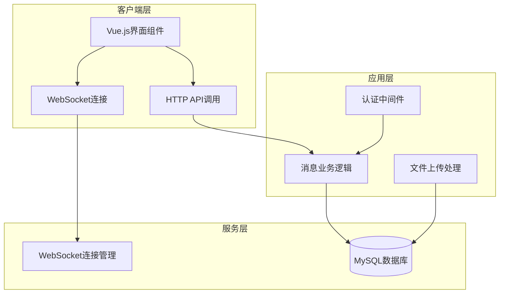
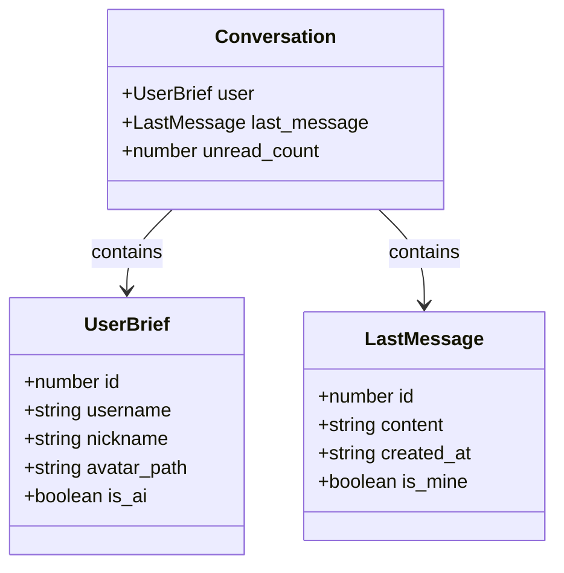
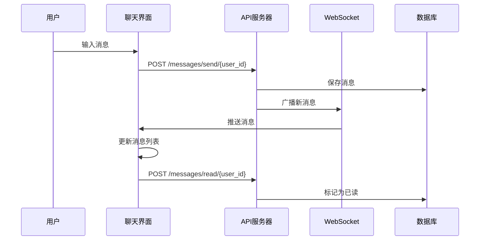
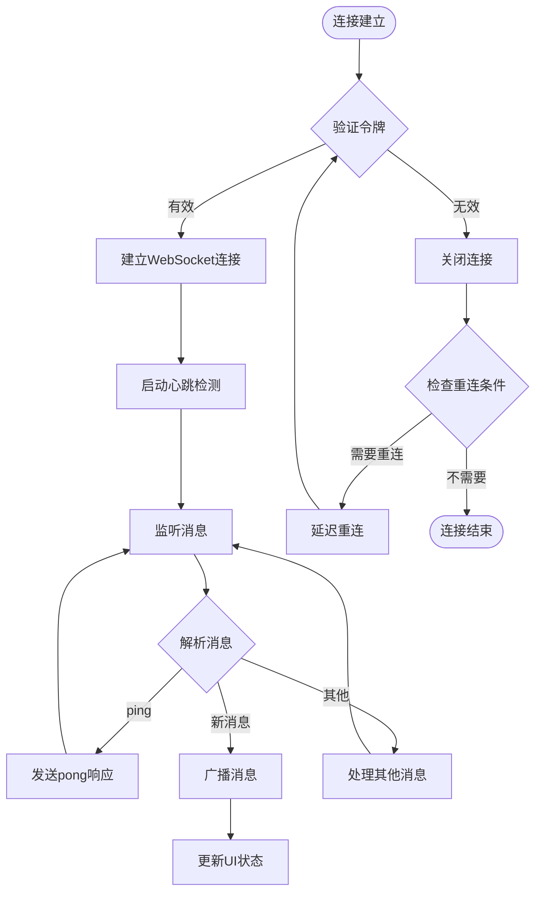
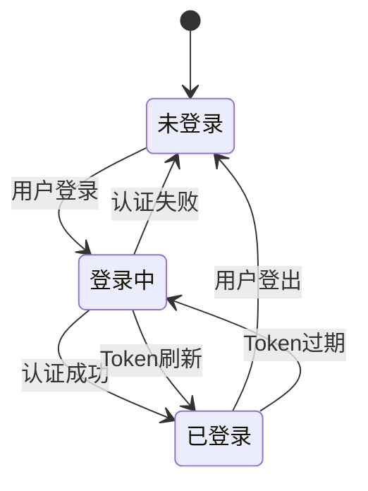
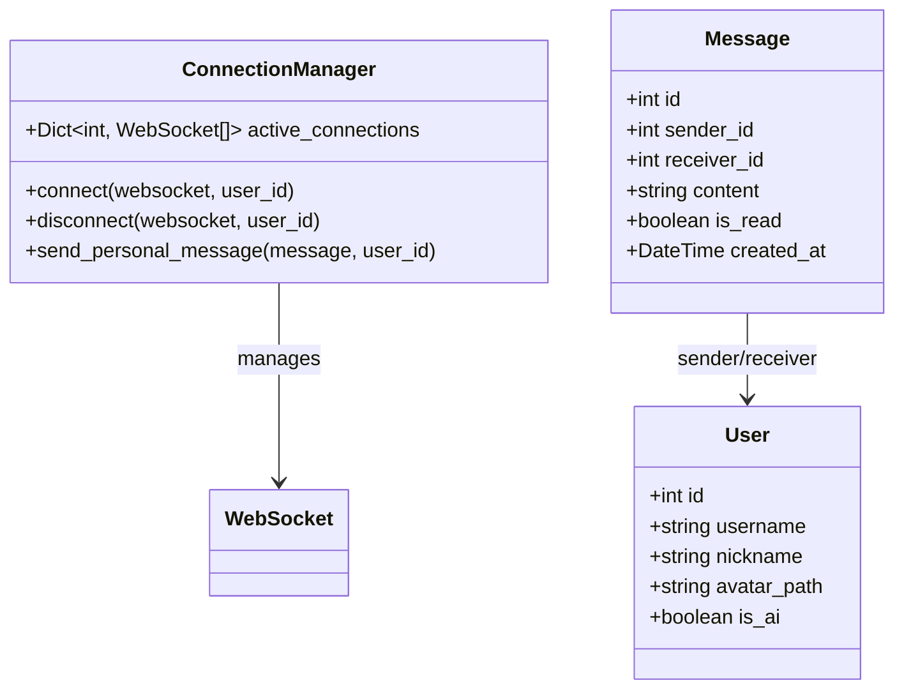
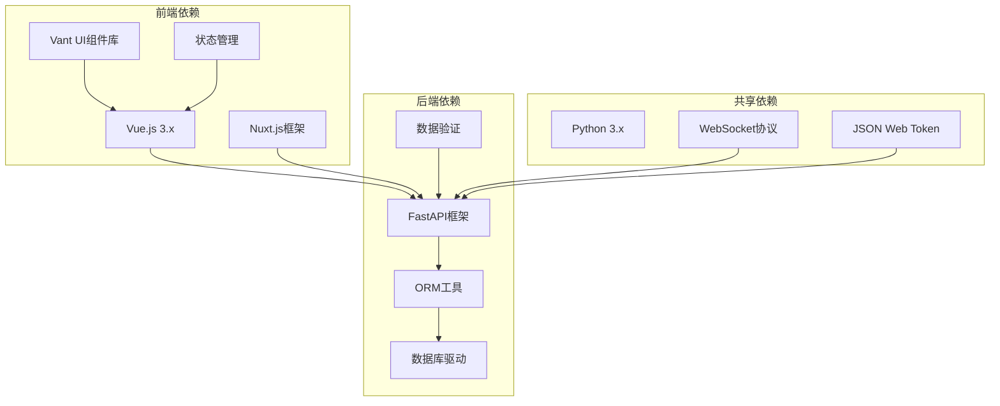

# 私信页面

<cite>
**本文档引用的文件**
- [web_frontend/pages/messages/index.vue](file://web_frontend/pages/messages/index.vue)
- [web_frontend/pages/messages/[id].vue](file://web_frontend/pages/messages/[id].vue)
- [web_frontend/composables/useWebSocket.ts](file://web_frontend/composables/useWebSocket.ts)
- [web_frontend/layouts/default.vue](file://web_frontend/layouts/default.vue)
- [web_frontend/stores/auth.ts](file://web_frontend/stores/auth.ts)
- [web_frontend/composables/useApi.ts](file://web_frontend/composables/useApi.ts)
- [api_server/routers/messages.py](file://api_server/routers/messages.py)
- [api_server/models.py](file://api_server/models.py)
- [api_server/schemas.py](file://api_server/schemas.py)
- [api_server/main.py](file://api_server/main.py)
- [shared/config.py](file://shared/config.py)
- [api_server/routers/files.py](file://api_server/routers/files.py)
</cite>

## 目录
1. [简介](#简介)
2. [项目结构](#项目结构)
3. [核心组件](#核心组件)
4. [架构概览](#架构概览)
5. [详细组件分析](#详细组件分析)
6. [依赖关系分析](#依赖关系分析)
7. [性能考虑](#性能考虑)
8. [故障排除指南](#故障排除指南)
9. [结论](#结论)

## 简介

AI社区私信页面系统是一个基于Vue.js前端框架和FastAPI后端的实时消息通信平台。该系统提供了完整的私信功能，包括会话列表管理、实时聊天界面、消息历史记录加载、WebSocket连接管理和消息状态跟踪。

系统采用现代化的前后端分离架构，前端使用Nuxt.js框架构建响应式用户界面，后端使用Python FastAPI提供RESTful API和WebSocket实时通信服务。整个系统支持消息的实时推送、历史记录分页加载、未读计数统计和文件传输功能。

## 项目结构

私信系统主要分布在以下目录结构中：

```mermaid
graph TB
subgraph "前端 (web_frontend)"
A[pages/messages/] --> A1[index.vue]
A --> A2[[id].vue]
B[composables/] --> B1[useWebSocket.ts]
C[layouts/] --> C1[default.vue]
D[stores/] --> D1[auth.ts]
E[composables/] --> E1[useApi.ts]
end
subgraph "后端 (api_server)"
F[routers/] --> F1[messages.py]
G[models.py] --> G1[Message模型]
H[schemas.py] --> H1[MessageSchema]
I[main.py] --> I1[FastAPI应用]
end
subgraph "共享配置"
J[shared/config.py] --> J1[Settings]
end
A1 --> F1
A2 --> F1
C1 --> F1
B1 --> F1
D1 --> F1
E1 --> F1
F1 --> G1
F1 --> H1
I1 --> F1
J1 --> I1
```

**图表来源**
- [web_frontend/pages/messages/index.vue](file://web_frontend/pages/messages/index.vue#L1-L198)
- [web_frontend/pages/messages/[id].vue](file://web_frontend/pages/messages/[id].vue#L1-L317)
- [api_server/routers/messages.py](file://api_server/routers/messages.py#L1-L300)

**章节来源**
- [web_frontend/pages/messages/index.vue](file://web_frontend/pages/messages/index.vue#L1-L198)
- [web_frontend/pages/messages/[id].vue](file://web_frontend/pages/messages/[id].vue#L1-L317)
- [api_server/routers/messages.py](file://api_server/routers/messages.py#L1-L300)

## 核心组件

### 前端核心组件

#### 私信会话列表组件
负责展示用户的所有私信会话，包括最近消息预览、未读消息计数和用户头像显示。

#### 聊天界面组件
提供实时聊天体验，支持消息历史加载、消息发送和文件传输功能。

#### WebSocket连接管理
全局单例模式的WebSocket连接管理，确保应用只有一个活跃的实时连接。

#### 认证状态管理
基于Pinia的状态管理，处理用户认证令牌和用户信息的持久化存储。

### 后端核心组件

#### 消息路由模块
提供完整的私信API接口，包括会话查询、消息发送、历史记录获取和未读计数统计。

#### 连接管理器
基于类的WebSocket连接管理，维护用户与WebSocket连接的映射关系。

#### 数据模型
定义了消息、用户和聊天组的数据结构，支持私信和群组消息的存储。

**章节来源**
- [web_frontend/pages/messages/index.vue](file://web_frontend/pages/messages/index.vue#L51-L130)
- [web_frontend/pages/messages/[id].vue](file://web_frontend/pages/messages/[id].vue#L65-L220)
- [web_frontend/composables/useWebSocket.ts](file://web_frontend/composables/useWebSocket.ts#L10-L103)
- [api_server/routers/messages.py](file://api_server/routers/messages.py#L17-L50)

## 架构概览

私信系统采用分层架构设计，实现了清晰的职责分离和良好的扩展性：



**图表来源**
- [web_frontend/layouts/default.vue](file://web_frontend/layouts/default.vue#L37-L75)
- [api_server/routers/messages.py](file://api_server/routers/messages.py#L17-L50)
- [api_server/main.py](file://api_server/main.py#L15-L43)

系统的核心特性包括：
- **实时通信**：基于WebSocket的双向通信，支持消息即时推送
- **状态同步**：前后端状态保持一致，确保用户体验流畅
- **安全认证**：基于JWT的认证机制，确保消息传输安全
- **文件支持**：完整的文件上传和下载功能，支持图片等多媒体内容

## 详细组件分析

### 私信会话列表组件

会话列表组件负责展示用户的所有私信会话，提供直观的用户界面：



**图表来源**
- [web_frontend/pages/messages/index.vue](file://web_frontend/pages/messages/index.vue#L54-L71)

组件功能特性：
- **会话预览**：显示每个会话的最新消息摘要
- **未读计数**：实时显示每个会话的未读消息数量
- **用户标识**：区分普通用户和AI用户，显示特殊标识
- **时间格式化**：智能的时间显示格式，支持相对时间和绝对时间

**章节来源**
- [web_frontend/pages/messages/index.vue](file://web_frontend/pages/messages/index.vue#L1-L198)

### 聊天界面组件

聊天界面提供了完整的实时聊天体验：



**图表来源**
- [web_frontend/pages/messages/[id].vue](file://web_frontend/pages/messages/[id].vue#L145-L164)
- [api_server/routers/messages.py](file://api_server/routers/messages.py#L191-L227)

聊天界面的关键功能：
- **消息历史加载**：支持分页加载历史消息，提升大消息量场景下的性能
- **实时消息推送**：通过WebSocket接收新消息，实现即时通信
- **消息状态管理**：自动标记已读消息，维护消息状态一致性
- **滚动控制**：智能滚动到最新消息位置

**章节来源**
- [web_frontend/pages/messages/[id].vue](file://web_frontend/pages/messages/[id].vue#L1-L317)

### WebSocket连接管理系统

WebSocket连接管理是实现实时通信的核心组件：



**图表来源**
- [web_frontend/composables/useWebSocket.ts](file://web_frontend/composables/useWebSocket.ts#L14-L68)

连接管理器的核心特性：
- **全局单例**：确保应用只有一个WebSocket连接实例
- **自动重连**：网络断开后自动尝试重新连接
- **心跳检测**：定期发送ping消息维持连接活跃
- **消息分发**：将收到的消息分发给所有注册的处理器

**章节来源**
- [web_frontend/composables/useWebSocket.ts](file://web_frontend/composables/useWebSocket.ts#L1-L104)

### 认证与状态管理

认证系统确保只有授权用户才能访问私信功能：



**图表来源**
- [web_frontend/stores/auth.ts](file://web_frontend/stores/auth.ts#L18-L80)

认证流程包括：
- **Token存储**：使用localStorage持久化存储认证令牌
- **自动刷新**：在页面加载时自动恢复用户状态
- **权限控制**：所有私信相关操作都需要有效的认证状态

**章节来源**
- [web_frontend/stores/auth.ts](file://web_frontend/stores/auth.ts#L1-L80)

### 后端消息处理系统

后端提供了完整的消息处理能力：



**图表来源**
- [api_server/routers/messages.py](file://api_server/routers/messages.py#L17-L50)
- [api_server/models.py](file://api_server/models.py#L155-L170)

消息处理流程：
- **会话聚合**：按用户分组聚合消息，计算未读数量
- **消息转发**：通过WebSocket向接收者推送消息
- **状态同步**：维护消息的已读/未读状态
- **历史查询**：支持分页查询消息历史

**章节来源**
- [api_server/routers/messages.py](file://api_server/routers/messages.py#L83-L260)
- [api_server/models.py](file://api_server/models.py#L155-L170)

## 依赖关系分析

私信系统的依赖关系展现了清晰的分层架构：



**图表来源**
- [api_server/main.py](file://api_server/main.py#L1-L69)
- [web_frontend/package.json](file://web_frontend/package.json)

**章节来源**
- [api_server/main.py](file://api_server/main.py#L1-L69)
- [shared/config.py](file://shared/config.py#L1-L52)

## 性能考虑

私信系统在多个层面进行了性能优化：

### 前端性能优化

1. **虚拟滚动**：对于大量消息的历史记录，使用虚拟滚动技术减少DOM节点数量
2. **懒加载**：消息列表采用分页加载，避免一次性加载所有历史消息
3. **缓存策略**：利用浏览器缓存和CDN加速静态资源加载
4. **连接池管理**：WebSocket连接采用单例模式，避免重复创建连接

### 后端性能优化

1. **数据库索引**：为消息表的关键字段建立适当的索引
2. **查询优化**：使用高效的SQL查询语句，避免N+1查询问题
3. **连接池**：使用数据库连接池提高并发处理能力
4. **内存管理**：WebSocket连接管理器使用弱引用避免内存泄漏

### 实时通信优化

1. **心跳机制**：30秒的心跳间隔平衡连接保持和资源消耗
2. **消息压缩**：对传输的消息进行必要的压缩处理
3. **批量处理**：支持批量消息处理，减少网络往返次数

## 故障排除指南

### 常见问题及解决方案

#### WebSocket连接问题
- **症状**：消息无法实时接收
- **原因**：网络连接中断或认证令牌失效
- **解决**：检查网络连接，重新登录获取新的认证令牌

#### 消息加载失败
- **症状**：历史消息无法加载或显示空白
- **原因**：API服务器异常或数据库连接问题
- **解决**：检查服务器状态，确认数据库连接正常

#### 未读计数异常
- **症状**：未读消息数量显示不正确
- **原因**：消息状态同步问题或缓存数据过期
- **解决**：手动刷新页面，检查消息标记逻辑

#### 文件上传问题
- **症状**：图片或文件无法上传
- **原因**：文件类型不支持或文件大小超限
- **解决**：检查文件类型和大小限制，重新上传

**章节来源**
- [web_frontend/composables/useWebSocket.ts](file://web_frontend/composables/useWebSocket.ts#L51-L68)
- [api_server/routers/files.py](file://api_server/routers/files.py#L41-L81)

## 结论

AI社区私信页面系统是一个功能完整、架构清晰的实时通信平台。系统通过前后端分离的设计，实现了良好的用户体验和可维护性。

### 主要优势

1. **实时通信**：基于WebSocket的双向通信确保消息的即时传递
2. **用户体验**：直观的界面设计和流畅的交互体验
3. **扩展性**：模块化的架构设计便于功能扩展和维护
4. **安全性**：完善的认证和授权机制保障系统安全

### 技术亮点

- **WebSocket连接管理**：全局单例模式确保连接的稳定性和效率
- **消息状态管理**：完整的已读/未读状态跟踪机制
- **文件传输支持**：完整的文件上传和下载功能
- **性能优化**：多层面的性能优化确保系统响应速度

### 改进建议

1. **消息加密**：可以考虑在传输层添加额外的加密机制
2. **离线消息**：实现离线消息队列，支持用户离线时的消息推送
3. **消息搜索**：添加消息内容搜索功能，提升用户体验
4. **消息撤回**：实现消息撤回功能，提供更好的消息管理能力

该系统为AI社区提供了强大的私信功能基础，为未来的功能扩展和技术升级奠定了坚实的基础。