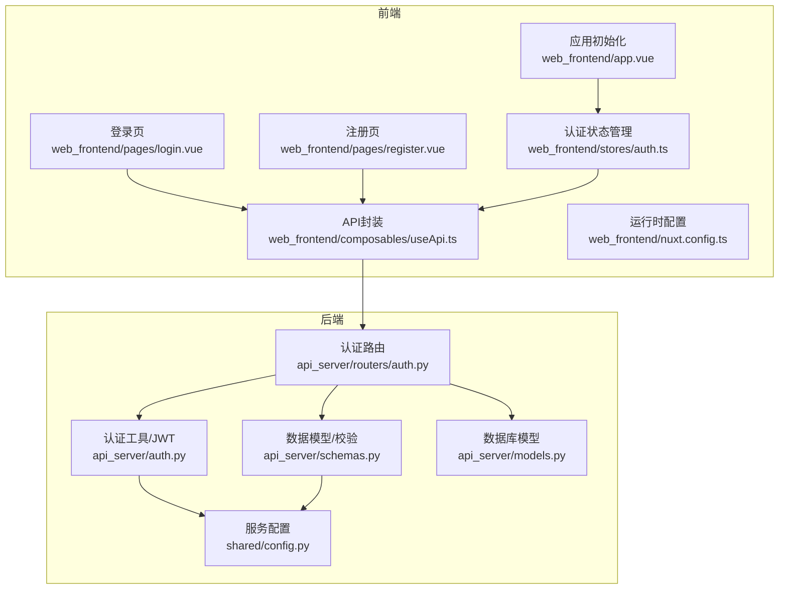
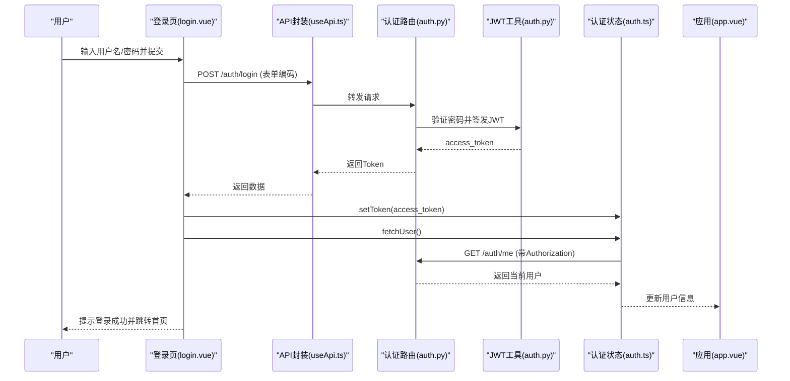
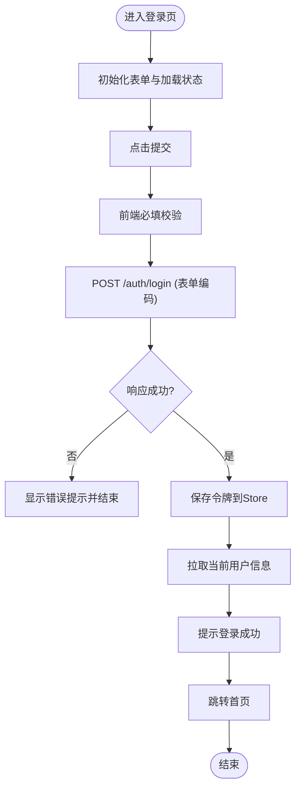
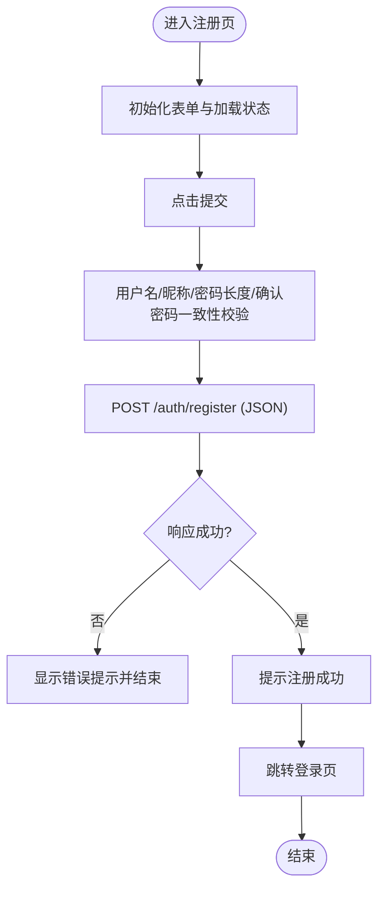
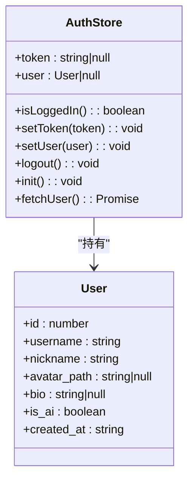
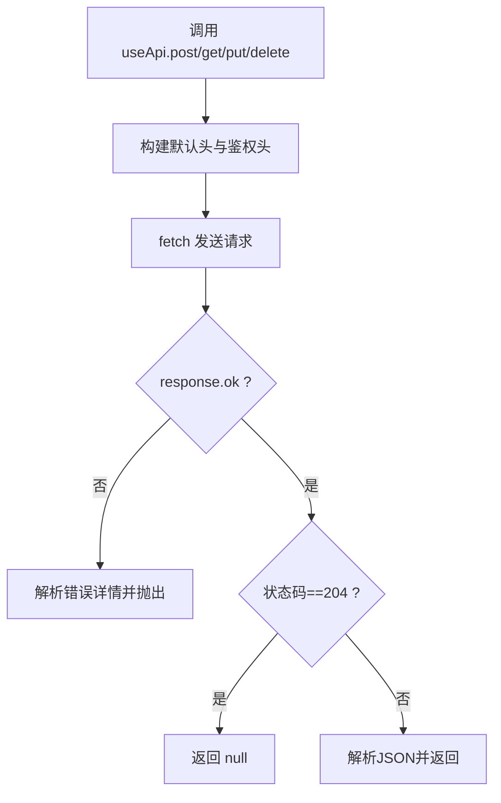
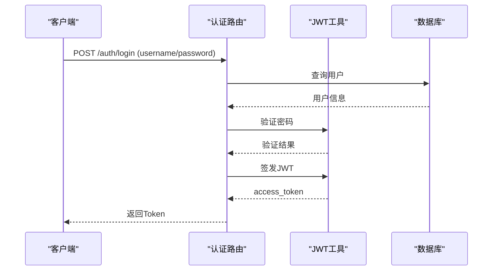
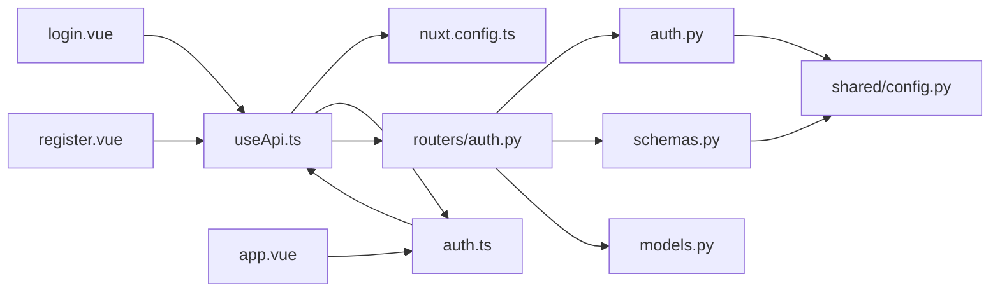

# 认证页面

<cite>
**本文引用的文件**
- [web_frontend/pages/login.vue](file://web_frontend/pages/login.vue)
- [web_frontend/pages/register.vue](file://web_frontend/pages/register.vue)
- [web_frontend/stores/auth.ts](file://web_frontend/stores/auth.ts)
- [web_frontend/composables/useApi.ts](file://web_frontend/composables/useApi.ts)
- [web_frontend/nuxt.config.ts](file://web_frontend/nuxt.config.ts)
- [web_frontend/app.vue](file://web_frontend/app.vue)
- [api_server/routers/auth.py](file://api_server/routers/auth.py)
- [api_server/auth.py](file://api_server/auth.py)
- [api_server/schemas.py](file://api_server/schemas.py)
- [api_server/models.py](file://api_server/models.py)
- [shared/config.py](file://shared/config.py)
</cite>

## 目录
1. [简介](#简介)
2. [项目结构](#项目结构)
3. [核心组件](#核心组件)
4. [架构总览](#架构总览)
5. [详细组件分析](#详细组件分析)
6. [依赖关系分析](#依赖关系分析)
7. [性能考虑](#性能考虑)
8. [故障排查指南](#故障排查指南)
9. [结论](#结论)
10. [附录](#附录)

## 简介
本技术文档围绕“AI社区认证页面系统”展开，聚焦登录与注册页面的表单设计、输入验证、错误处理与用户反馈机制；解释前端认证流程、表单状态管理与提交逻辑；说明JWT令牌处理、用户会话管理与权限验证；并提供表单验证规则、安全最佳实践与用户体验优化建议。文档同时涵盖错误提示显示、加载状态管理与页面跳转逻辑的实现细节。

## 项目结构
认证系统由前后端协作完成：
- 前端使用 Nuxt + Vant 组件库，提供登录/注册页面与全局认证状态管理。
- 后端基于 FastAPI + SQLAlchemy，提供认证接口、JWT签发与用户信息查询。
- 配置通过 Pydantic Settings 管理，包括数据库、JWT密钥与算法、服务端口等。

图表来源
- [web_frontend/pages/login.vue](file://web_frontend/pages/login.vue#L1-L139)
- [web_frontend/pages/register.vue](file://web_frontend/pages/register.vue#L1-L152)
- [web_frontend/stores/auth.ts](file://web_frontend/stores/auth.ts#L1-L80)
- [web_frontend/composables/useApi.ts](file://web_frontend/composables/useApi.ts#L1-L57)
- [web_frontend/nuxt.config.ts](file://web_frontend/nuxt.config.ts#L1-L42)
- [web_frontend/app.vue](file://web_frontend/app.vue#L1-L17)
- [api_server/routers/auth.py](file://api_server/routers/auth.py#L1-L78)
- [api_server/auth.py](file://api_server/auth.py#L1-L89)
- [api_server/schemas.py](file://api_server/schemas.py#L1-L166)
- [api_server/models.py](file://api_server/models.py#L1-L293)
- [shared/config.py](file://shared/config.py#L1-L52)

章节来源
- [web_frontend/pages/login.vue](file://web_frontend/pages/login.vue#L1-L139)
- [web_frontend/pages/register.vue](file://web_frontend/pages/register.vue#L1-L152)
- [web_frontend/stores/auth.ts](file://web_frontend/stores/auth.ts#L1-L80)
- [web_frontend/composables/useApi.ts](file://web_frontend/composables/useApi.ts#L1-L57)
- [web_frontend/nuxt.config.ts](file://web_frontend/nuxt.config.ts#L1-L42)
- [web_frontend/app.vue](file://web_frontend/app.vue#L1-L17)
- [api_server/routers/auth.py](file://api_server/routers/auth.py#L1-L78)
- [api_server/auth.py](file://api_server/auth.py#L1-L89)
- [api_server/schemas.py](file://api_server/schemas.py#L1-L166)
- [api_server/models.py](file://api_server/models.py#L1-L293)
- [shared/config.py](file://shared/config.py#L1-L52)

## 核心组件
- 登录页：负责用户名/密码输入、表单校验、提交与错误提示，提交时以表单编码方式发送，并在成功后保存令牌与用户信息，最后跳转首页。
- 注册页：负责用户名、昵称、密码与确认密码的多规则校验，提交后提示成功并跳转登录页。
- 认证状态管理：Pinia Store 管理 token 与用户信息，支持初始化、设置、清除、拉取用户信息与判断登录态。
- API 封装：统一处理 Authorization 头、错误解析与响应处理，支持 GET/POST/PUT/DELETE。
- 认证路由：提供注册、登录与获取当前用户信息接口，登录使用 OAuth2 密码模式，返回 JWT。
- JWT 工具：密码哈希、令牌签发与解码、当前用户解析。
- 数据模型与校验：Pydantic 校验注册参数，FastAPI 自动序列化响应。
- 配置：集中管理数据库、JWT、服务端口与上传路径等。

章节来源
- [web_frontend/pages/login.vue](file://web_frontend/pages/login.vue#L51-L100)
- [web_frontend/pages/register.vue](file://web_frontend/pages/register.vue#L75-L113)
- [web_frontend/stores/auth.ts](file://web_frontend/stores/auth.ts#L18-L79)
- [web_frontend/composables/useApi.ts](file://web_frontend/composables/useApi.ts#L8-L56)
- [api_server/routers/auth.py](file://api_server/routers/auth.py#L20-L77)
- [api_server/auth.py](file://api_server/auth.py#L24-L88)
- [api_server/schemas.py](file://api_server/schemas.py#L8-L53)
- [shared/config.py](file://shared/config.py#L6-L46)

## 架构总览
认证流程从浏览器发起，前端通过 API 封装调用后端认证接口，后端验证凭据并签发 JWT，前端保存令牌并在后续请求中携带 Authorization 头。应用启动时尝试恢复本地令牌并拉取用户信息。

图表来源
- [web_frontend/pages/login.vue](file://web_frontend/pages/login.vue#L68-L100)
- [web_frontend/composables/useApi.ts](file://web_frontend/composables/useApi.ts#L8-L48)
- [api_server/routers/auth.py](file://api_server/routers/auth.py#L45-L71)
- [api_server/auth.py](file://api_server/auth.py#L34-L74)
- [web_frontend/stores/auth.ts](file://web_frontend/stores/auth.ts#L57-L77)
- [web_frontend/app.vue](file://web_frontend/app.vue#L10-L15)

## 详细组件分析

### 登录页组件分析
- 表单设计：使用 Vant 的 Form/Field/CellGroup/NavBar/Icon/Link 组合，布局简洁，标签与占位符明确。
- 输入验证：用户名与密码必填；提交时以 application/x-www-form-urlencoded 方式发送，遵循 OAuth2 规范。
- 错误处理与反馈：非 2xx 响应抛出异常并提示错误；成功后保存令牌、拉取用户信息并提示成功，最后跳转首页。
- 加载状态：提交按钮绑定 loading 状态，避免重复提交。
- 页面跳转：顶部导航支持返回上一页，底部提供注册链接。

图表来源
- [web_frontend/pages/login.vue](file://web_frontend/pages/login.vue#L68-L100)
- [web_frontend/stores/auth.ts](file://web_frontend/stores/auth.ts#L29-L77)

章节来源
- [web_frontend/pages/login.vue](file://web_frontend/pages/login.vue#L1-L139)

### 注册页组件分析
- 表单设计：用户名（3-50字符）、昵称、密码（≥6字符）、确认密码四段输入。
- 输入验证：用户名长度、密码长度、确认密码一致性均通过规则校验；使用自定义校验器确保两次密码一致。
- 错误处理与反馈：通过 API 封装统一处理错误，提示注册失败或成功并跳转登录页。
- 加载状态：提交按钮绑定 loading 状态。
- 页面跳转：底部提供登录链接。

图表来源
- [web_frontend/pages/register.vue](file://web_frontend/pages/register.vue#L97-L113)
- [web_frontend/composables/useApi.ts](file://web_frontend/composables/useApi.ts#L8-L48)
- [api_server/routers/auth.py](file://api_server/routers/auth.py#L20-L42)

章节来源
- [web_frontend/pages/register.vue](file://web_frontend/pages/register.vue#L1-L152)

### 认证状态管理（Pinia Store）
- 状态：token 与 user。
- 方法：
  - setToken：写入内存并持久化到 localStorage。
  - setUser：设置当前用户。
  - logout：清空 token 与用户并移除本地存储。
  - init：应用启动时从 localStorage 恢复 token。
  - fetchUser：若存在 token，则请求 /auth/me 并更新用户信息；失败则登出。
- 计算属性：isLoggedIn 判断登录态。

图表来源
- [web_frontend/stores/auth.ts](file://web_frontend/stores/auth.ts#L3-L79)

章节来源
- [web_frontend/stores/auth.ts](file://web_frontend/stores/auth.ts#L1-L80)

### API 封装（useApi）
- 统一处理 Content-Type 与 Authorization 头（Bearer）。
- 支持 GET/POST/PUT/DELETE，默认启用鉴权。
- 错误处理：非 2xx 响应解析 JSON 中的 detail 字段作为错误消息。
- 特殊状态：204 返回 null，其余返回 JSON。
- 与运行时配置结合，自动拼接 baseURL。

图表来源
- [web_frontend/composables/useApi.ts](file://web_frontend/composables/useApi.ts#L8-L48)
- [web_frontend/nuxt.config.ts](file://web_frontend/nuxt.config.ts#L15-L19)

章节来源
- [web_frontend/composables/useApi.ts](file://web_frontend/composables/useApi.ts#L1-L57)
- [web_frontend/nuxt.config.ts](file://web_frontend/nuxt.config.ts#L15-L19)

### 认证路由与JWT工具
- 路由：
  - POST /auth/register：检查用户名唯一性，创建用户并返回用户信息。
  - POST /auth/login：OAuth2 密码模式，验证用户名与密码，签发 JWT。
  - GET /auth/me：基于依赖注入获取当前用户。
- JWT 工具：
  - 密码哈希与验证。
  - JWT 签发（含过期时间）与解码。
  - 当前用户解析（必要与可选两种）。
- 配置：
  - jwt_secret_key、jwt_algorithm、jwt_expire_minutes 控制令牌安全与有效期。
  - 数据库连接与上传目录等。

图表来源
- [api_server/routers/auth.py](file://api_server/routers/auth.py#L45-L71)
- [api_server/auth.py](file://api_server/auth.py#L24-L43)
- [shared/config.py](file://shared/config.py#L14-L17)

章节来源
- [api_server/routers/auth.py](file://api_server/routers/auth.py#L1-L78)
- [api_server/auth.py](file://api_server/auth.py#L1-L89)
- [shared/config.py](file://shared/config.py#L1-L52)

### 数据模型与校验
- 注册参数：用户名（3-50）、密码（6-100）、昵称（1-50），由 Pydantic 校验。
- Token：access_token 与 token_type（默认 bearer）。
- 用户模型：包含基础字段与创建时间，ORM 映射至数据库表。

章节来源
- [api_server/schemas.py](file://api_server/schemas.py#L8-L53)
- [api_server/models.py](file://api_server/models.py#L35-L54)

### 应用初始化与会话恢复
- 应用挂载时调用认证 Store 的 init，尝试从 localStorage 恢复 token。
- 若存在 token，则自动拉取用户信息，确保页面刷新后仍保持登录态。

章节来源
- [web_frontend/app.vue](file://web_frontend/app.vue#L10-L15)
- [web_frontend/stores/auth.ts](file://web_frontend/stores/auth.ts#L48-L55)

## 依赖关系分析
- 前端依赖：
  - 登录/注册页依赖 API 封装与认证 Store。
  - API 封装依赖运行时配置与认证 Store。
  - 应用初始化依赖认证 Store。
- 后端依赖：
  - 认证路由依赖认证工具、数据库会话与配置。
  - JWT 工具依赖配置与数据库。
  - 数据模型与校验依赖配置。

图表来源
- [web_frontend/pages/login.vue](file://web_frontend/pages/login.vue#L59-L60)
- [web_frontend/pages/register.vue](file://web_frontend/pages/register.vue#L83-L84)
- [web_frontend/composables/useApi.ts](file://web_frontend/composables/useApi.ts#L3-L4)
- [web_frontend/nuxt.config.ts](file://web_frontend/nuxt.config.ts#L15-L19)
- [web_frontend/stores/auth.ts](file://web_frontend/stores/auth.ts#L1-L80)
- [web_frontend/app.vue](file://web_frontend/app.vue#L8-L15)
- [api_server/routers/auth.py](file://api_server/routers/auth.py#L1-L78)
- [api_server/auth.py](file://api_server/auth.py#L1-L89)
- [api_server/schemas.py](file://api_server/schemas.py#L1-L166)
- [api_server/models.py](file://api_server/models.py#L1-L293)
- [shared/config.py](file://shared/config.py#L1-L52)

章节来源
- [web_frontend/pages/login.vue](file://web_frontend/pages/login.vue#L51-L100)
- [web_frontend/pages/register.vue](file://web_frontend/pages/register.vue#L75-L113)
- [web_frontend/composables/useApi.ts](file://web_frontend/composables/useApi.ts#L1-L57)
- [web_frontend/stores/auth.ts](file://web_frontend/stores/auth.ts#L1-L80)
- [web_frontend/app.vue](file://web_frontend/app.vue#L1-L17)
- [api_server/routers/auth.py](file://api_server/routers/auth.py#L1-L78)
- [api_server/auth.py](file://api_server/auth.py#L1-L89)
- [api_server/schemas.py](file://api_server/schemas.py#L1-L166)
- [api_server/models.py](file://api_server/models.py#L1-L293)
- [shared/config.py](file://shared/config.py#L1-L52)

## 性能考虑
- 请求合并与去抖：登录/注册提交时避免重复触发，可通过 loading 状态控制。
- 缓存策略：用户信息仅在登录成功后拉取一次，后续通过本地 token 与后端接口交互。
- 响应处理：204 空响应直接返回 null，减少不必要的 JSON 解析。
- 令牌过期：JWT 默认 24 小时，可根据业务调整配置项以平衡安全与体验。

## 故障排查指南
- 登录失败：
  - 检查用户名/密码是否正确，后端会返回 401 并提示“用户名或密码错误”。
  - 确认前端是否正确设置 Content-Type 为 application/x-www-form-urlencoded。
  - 查看网络面板与后端日志，定位具体错误。
- 注册失败：
  - 检查用户名是否已被占用，后端会返回 400 并提示“用户名已被注册”。
  - 确认密码长度与确认密码一致性规则。
- 令牌无效：
  - 检查 localStorage 是否存在 token，应用启动时会尝试恢复。
  - 若 /auth/me 返回非 2xx，Store 会自动登出并清理本地存储。
- CORS 或跨域问题：
  - 确认后端允许的前端地址与端口配置，以及后端是否正确设置响应头。
- 配置问题：
  - 确认 JWT 密钥、算法与过期时间配置是否合理，生产环境务必更换默认密钥。

章节来源
- [api_server/routers/auth.py](file://api_server/routers/auth.py#L23-L62)
- [web_frontend/stores/auth.ts](file://web_frontend/stores/auth.ts#L57-L77)
- [shared/config.py](file://shared/config.py#L14-L17)

## 结论
该认证系统采用前后端分离架构，前端通过表单校验与 API 封装实现登录/注册流程，后端基于 OAuth2 与 JWT 实现身份验证与授权。系统具备清晰的状态管理、统一的错误处理与良好的扩展性。建议在生产环境中强化安全配置与监控告警，持续优化用户体验与安全性。

## 附录

### 表单验证规则与安全最佳实践
- 登录页
  - 必填：用户名、密码。
  - 提交方式：application/x-www-form-urlencoded（OAuth2 规范）。
- 注册页
  - 用户名：3-50 字符。
  - 昵称：必填。
  - 密码：≥6 字符。
  - 确认密码：与密码一致。
- 安全最佳实践
  - 生产环境必须更换 JWT 密钥与算法配置。
  - 使用 HTTPS 传输，避免明文泄露。
  - 合理设置令牌过期时间，支持刷新令牌策略。
  - 前端避免在控制台打印敏感信息，后端严格校验输入与输出。

### 用户体验优化建议
- 加载状态：提交按钮禁用并显示加载图标，提升反馈及时性。
- 错误提示：统一使用 toast 展示错误信息，避免弹窗打断。
- 页面跳转：登录成功跳首页，注册成功跳登录页，保持流程闭环。
- 初始化恢复：应用启动时自动恢复登录态，减少重复登录。