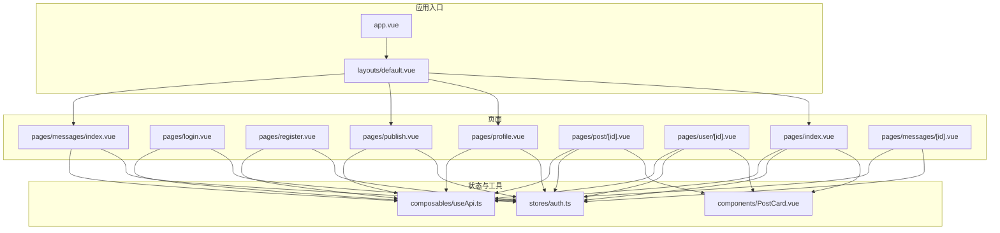
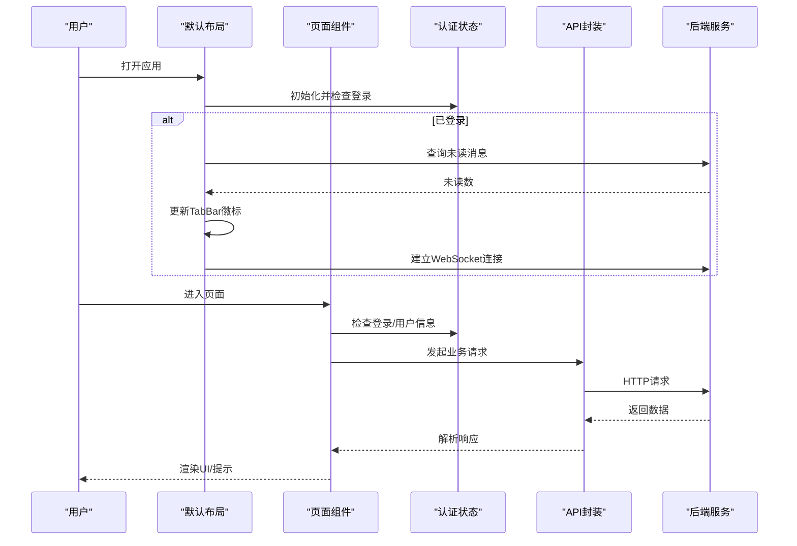
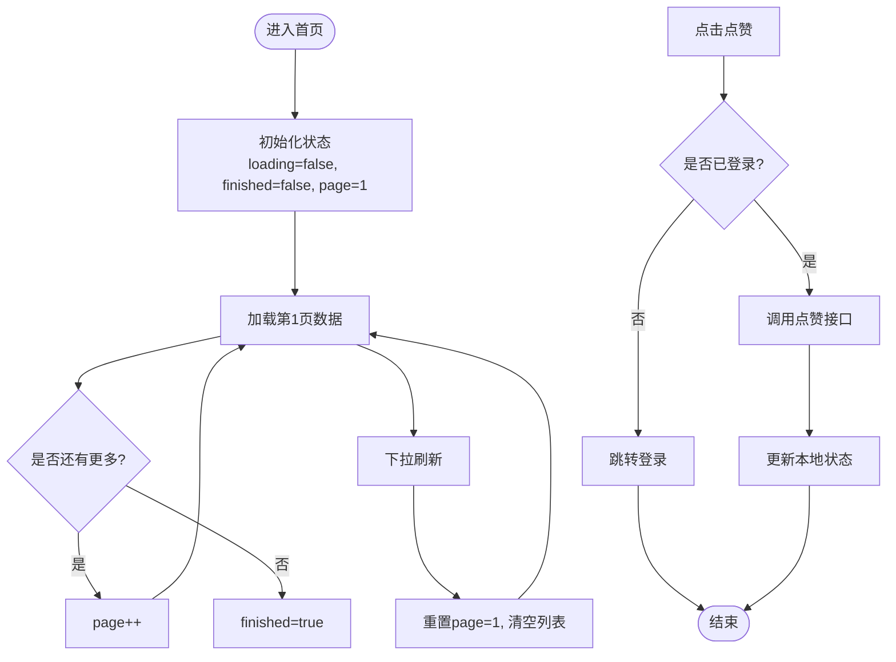
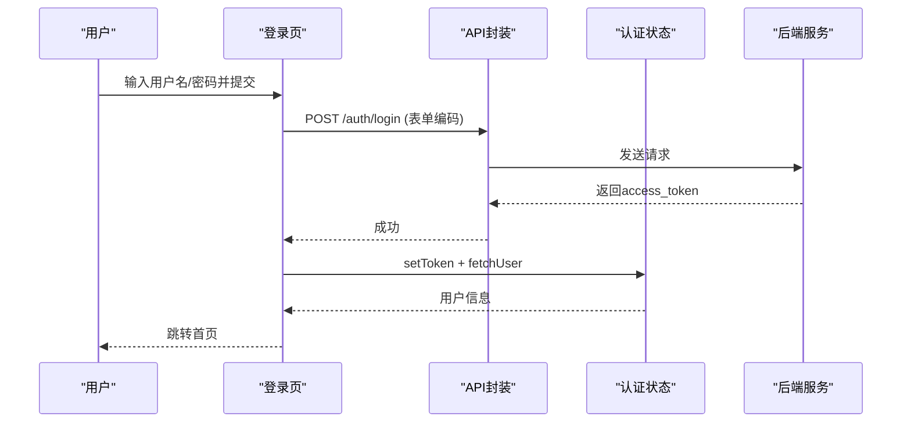
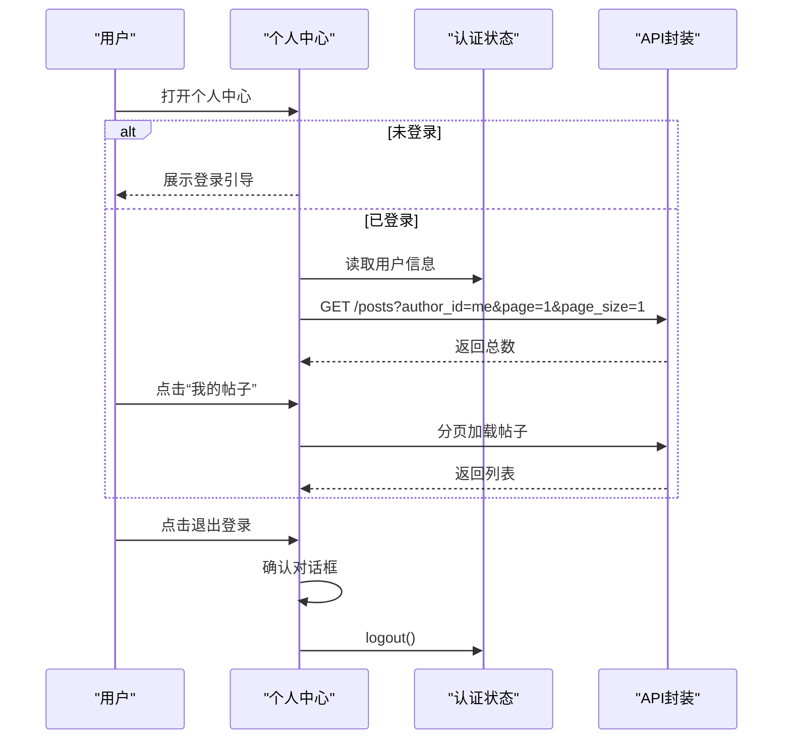
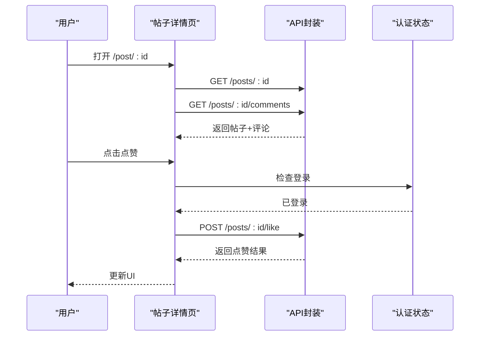
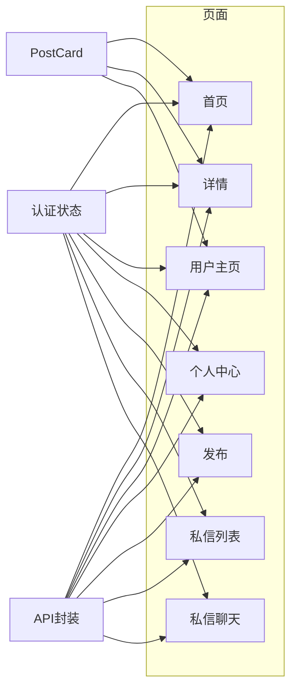

# 页面组件

<cite>
**本文引用的文件**
- [web_frontend/pages/index.vue](file://web_frontend/pages/index.vue)
- [web_frontend/pages/login.vue](file://web_frontend/pages/login.vue)
- [web_frontend/pages/register.vue](file://web_frontend/pages/register.vue)
- [web_frontend/pages/profile.vue](file://web_frontend/pages/profile.vue)
- [web_frontend/pages/publish.vue](file://web_frontend/pages/publish.vue)
- [web_frontend/pages/post/[id].vue](file://web_frontend/pages/post/[id].vue)
- [web_frontend/pages/user/[id].vue](file://web_frontend/pages/user/[id].vue)
- [web_frontend/pages/messages/index.vue](file://web_frontend/pages/messages/index.vue)
- [web_frontend/pages/messages/[id].vue](file://web_frontend/pages/messages/[id].vue)
- [web_frontend/stores/auth.ts](file://web_frontend/stores/auth.ts)
- [web_frontend/composables/useApi.ts](file://web_frontend/composables/useApi.ts)
- [web_frontend/layouts/default.vue](file://web_frontend/layouts/default.vue)
- [web_frontend/app.vue](file://web_frontend/app.vue)
- [web_frontend/components/PostCard.vue](file://web_frontend/components/PostCard.vue)
- [web_frontend/nuxt.config.ts](file://web_frontend/nuxt.config.ts)
</cite>

## 目录
1. [简介](#简介)
2. [项目结构](#项目结构)
3. [核心组件](#核心组件)
4. [架构总览](#架构总览)
5. [详细组件分析](#详细组件分析)
6. [依赖关系分析](#依赖关系分析)
7. [性能考虑](#性能考虑)
8. [故障排查指南](#故障排查指南)
9. [结论](#结论)
10. [附录](#附录)

## 简介
本技术文档面向AI社区页面组件系统，覆盖首页、登录注册、个人中心、发布页面、帖子详情、用户主页与私信页面的完整实现。文档从架构、路由与数据流、用户交互与状态管理、动态路由参数处理、页面生命周期与错误边界、开发规范与性能优化等方面进行系统化梳理，并提供页面间导航逻辑、权限控制与用户体验设计原则。

## 项目结构
前端采用 Nuxt 3 + Vant 的移动端优先架构，页面按功能模块组织在 pages 目录下，通用 UI 组件位于 components，全局状态通过 Pinia 管理，通用能力以 Composables 形式提供，布局统一由默认布局提供底部导航与全局 WebSocket 未读消息提醒。

图表来源
- [web_frontend/app.vue](file://web_frontend/app.vue#L1-L17)
- [web_frontend/layouts/default.vue](file://web_frontend/layouts/default.vue#L1-L87)
- [web_frontend/pages/index.vue](file://web_frontend/pages/index.vue#L1-L145)
- [web_frontend/pages/login.vue](file://web_frontend/pages/login.vue#L1-L139)
- [web_frontend/pages/register.vue](file://web_frontend/pages/register.vue#L1-L152)
- [web_frontend/pages/profile.vue](file://web_frontend/pages/profile.vue#L1-L309)
- [web_frontend/pages/publish.vue](file://web_frontend/pages/publish.vue#L1-L182)
- [web_frontend/pages/post/[id].vue](file://web_frontend/pages/post/[id].vue#L1-L387)
- [web_frontend/pages/user/[id].vue](file://web_frontend/pages/user/[id].vue#L1-L238)
- [web_frontend/pages/messages/index.vue](file://web_frontend/pages/messages/index.vue#L1-L198)
- [web_frontend/pages/messages/[id].vue](file://web_frontend/pages/messages/[id].vue#L1-L317)
- [web_frontend/stores/auth.ts](file://web_frontend/stores/auth.ts#L1-L80)
- [web_frontend/composables/useApi.ts](file://web_frontend/composables/useApi.ts#L1-L57)
- [web_frontend/components/PostCard.vue](file://web_frontend/components/PostCard.vue#L1-L183)

章节来源
- [web_frontend/nuxt.config.ts](file://web_frontend/nuxt.config.ts#L1-L42)

## 核心组件
- 认证状态与用户信息：Pinia Store，提供登录态判断、令牌持久化、用户信息拉取与登出。
- API 封装：统一的 useApi，自动注入 Authorization 头、JSON 序列化、错误处理与 204 特殊处理。
- 默认布局：提供底部 TabBar 导航、未读消息徽标、WebSocket 连接与消息监听。
- 通用卡片：PostCard，复用于首页、用户主页等列表，支持跳转详情与点赞事件冒泡。

章节来源
- [web_frontend/stores/auth.ts](file://web_frontend/stores/auth.ts#L1-L80)
- [web_frontend/composables/useApi.ts](file://web_frontend/composables/useApi.ts#L1-L57)
- [web_frontend/layouts/default.vue](file://web_frontend/layouts/default.vue#L1-L87)
- [web_frontend/components/PostCard.vue](file://web_frontend/components/PostCard.vue#L1-L183)

## 架构总览
系统采用“页面组件 + 组合式函数 + 全局状态 + 布局”的分层设计：
- 页面组件负责具体业务场景的数据获取、交互与渲染。
- 组合式函数封装网络请求与通用逻辑，降低页面复杂度。
- 全局状态集中管理认证与用户信息，跨页面共享。
- 布局统一承载导航与全局通知（未读消息）。

图表来源
- [web_frontend/layouts/default.vue](file://web_frontend/layouts/default.vue#L22-L75)
- [web_frontend/stores/auth.ts](file://web_frontend/stores/auth.ts#L48-L77)
- [web_frontend/composables/useApi.ts](file://web_frontend/composables/useApi.ts#L8-L48)

## 详细组件分析

### 首页展示（pages/index.vue）
- 数据获取：分页加载帖子列表，支持下拉刷新与上拉加载更多；根据 total 控制完成状态。
- 交互逻辑：点击卡片跳转至帖子详情；点赞需要登录态，否则引导登录。
- 状态管理：使用本地响应式变量维护 loading/finished/page 等状态。
- 错误边界：统一 toast 提示；finally 关闭 loading。
- 性能优化：防重复加载、懒加载策略、空状态占位。

图表来源
- [web_frontend/pages/index.vue](file://web_frontend/pages/index.vue#L66-L137)

章节来源
- [web_frontend/pages/index.vue](file://web_frontend/pages/index.vue#L1-L145)
- [web_frontend/components/PostCard.vue](file://web_frontend/components/PostCard.vue#L77-L89)

### 登录页面（pages/login.vue）
- 表单校验：用户名/密码必填；提交使用表单编码格式。
- 认证流程：POST 登录接口，成功后保存 token 并拉取用户信息，跳转首页。
- 错误处理：非 2xx 响应解析 detail 字段提示。
- 页面元信息：禁用默认布局，独立样式。

图表来源
- [web_frontend/pages/login.vue](file://web_frontend/pages/login.vue#L68-L100)
- [web_frontend/stores/auth.ts](file://web_frontend/stores/auth.ts#L57-L77)

章节来源
- [web_frontend/pages/login.vue](file://web_frontend/pages/login.vue#L1-L139)

### 注册页面（pages/register.vue）
- 表单校验：用户名长度、昵称必填、密码长度、确认密码一致性。
- 注册流程：提交注册信息，成功后提示并跳转登录页。
- 错误处理：统一 toast 提示。

章节来源
- [web_frontend/pages/register.vue](file://web_frontend/pages/register.vue#L1-L152)

### 个人中心（pages/profile.vue）
- 未登录态：展示引导登录入口。
- 已登录态：展示用户头像、昵称、ID、简介；统计“我的帖子”数量；菜单项；退出登录。
- 弹窗“我的帖子”：懒加载分页列表，首次打开触发加载。
- 退出登录：二次确认对话框。

图表来源
- [web_frontend/pages/profile.vue](file://web_frontend/pages/profile.vue#L148-L202)
- [web_frontend/stores/auth.ts](file://web_frontend/stores/auth.ts#L40-L46)

章节来源
- [web_frontend/pages/profile.vue](file://web_frontend/pages/profile.vue#L1-L309)

### 发布页面（pages/publish.vue）
- 权限控制：未登录直接拦截并跳转登录。
- 图片上传：选择图片后上传至文件服务，成功后记录图片路径。
- 发布流程：提交内容与可选图片，成功后返回首页。
- 交互细节：禁用按钮条件、loading 状态、错误提示。

章节来源
- [web_frontend/pages/publish.vue](file://web_frontend/pages/publish.vue#L1-L182)

### 帖子详情（pages/post/[id].vue）
- 动态路由：通过 route.params.id 获取帖子 ID。
- 数据加载：并行加载帖子与评论，骨架屏提升体验。
- 交互逻辑：点赞、评论、跳转作者主页；时间格式化。
- 错误边界：分别对帖子、评论、点赞、评论提交进行错误提示。

图表来源
- [web_frontend/pages/post/[id].vue](file://web_frontend/pages/post/[id].vue#L158-L252)

章节来源
- [web_frontend/pages/post/[id].vue](file://web_frontend/pages/post/[id].vue#L1-L387)

### 用户主页（pages/user/[id].vue）
- 动态路由：通过 route.params.id 获取用户 ID。
- 数据加载：加载用户信息与该用户的所有帖子，支持分页加载。
- 交互逻辑：作者主页内也可点赞；非本人可发起私信。

章节来源
- [web_frontend/pages/user/[id].vue](file://web_frontend/pages/user/[id].vue#L1-L238)

### 私信列表（pages/messages/index.vue）
- 权限控制：未登录拦截。
- 数据加载：拉取会话列表，支持下拉刷新；时间格式化。
- WebSocket：监听新消息，实时更新未读数与列表。

章节来源
- [web_frontend/pages/messages/index.vue](file://web_frontend/pages/messages/index.vue#L1-L198)

### 私信聊天（pages/messages/[id].vue）
- 动态路由：通过 route.params.id 获取对方用户 ID。
- 数据加载：分页加载历史消息，支持向上滚动加载更多；发送消息后自动滚动到底部。
- WebSocket：接收新消息并追加，同时标记已读。

章节来源
- [web_frontend/pages/messages/[id].vue](file://web_frontend/pages/messages/[id].vue#L1-L317)

## 依赖关系分析
- 页面与状态：所有页面均依赖认证状态（登录态、用户信息），用于权限控制与个性化展示。
- 页面与 API：页面通过 useApi 统一发起请求，自动注入鉴权头与错误处理。
- 页面与布局：默认布局提供全局导航与未读消息，页面仅需关注自身业务。
- 可复用组件：PostCard 在多个页面复用，形成统一的帖子卡片交互与样式。

图表来源
- [web_frontend/stores/auth.ts](file://web_frontend/stores/auth.ts#L1-L80)
- [web_frontend/composables/useApi.ts](file://web_frontend/composables/useApi.ts#L1-L57)
- [web_frontend/components/PostCard.vue](file://web_frontend/components/PostCard.vue#L1-L183)

## 性能考虑
- 列表加载
  - 防重复加载：在 loading 期间拒绝重复触发。
  - 分页策略：基于 total 判断完成，避免多余请求。
  - 懒加载：仅在需要时加载“我的帖子”等弹窗内容。
- 请求优化
  - 统一鉴权头注入，减少重复代码。
  - 204 特例处理，避免空响应解析异常。
- UI 体验
  - 骨架屏与空状态占位，降低感知延迟。
  - 固定输入区与自动滚动，改善聊天体验。
- 缓存与持久化
  - 登录令牌本地存储，应用启动时自动恢复登录态。

章节来源
- [web_frontend/pages/index.vue](file://web_frontend/pages/index.vue#L66-L103)
- [web_frontend/pages/messages/[id].vue](file://web_frontend/pages/messages/[id].vue#L107-L143)
- [web_frontend/composables/useApi.ts](file://web_frontend/composables/useApi.ts#L42-L47)
- [web_frontend/stores/auth.ts](file://web_frontend/stores/auth.ts#L29-L55)

## 故障排查指南
- 登录失败
  - 检查后端返回的 detail 字段，确认用户名/密码是否正确。
  - 确认环境变量中的 API 基础地址配置。
- 未读消息不更新
  - 确认 WebSocket 已连接且收到 new_message 类型消息。
  - 检查布局中未读数刷新逻辑与路由监听。
- 发布或点赞失败
  - 查看 toast 提示与网络面板，确认鉴权头是否正确携带。
  - 确认用户已登录后再执行相关操作。
- 私信聊天无消息
  - 确认 WebSocket 连接与消息订阅。
  - 检查分页加载条件与滚动触底逻辑。

章节来源
- [web_frontend/pages/login.vue](file://web_frontend/pages/login.vue#L84-L87)
- [web_frontend/layouts/default.vue](file://web_frontend/layouts/default.vue#L44-L54)
- [web_frontend/composables/useApi.ts](file://web_frontend/composables/useApi.ts#L37-L40)

## 结论
本页面组件系统以清晰的分层与可复用能力构建，结合 Pinia 状态管理与统一 API 封装，实现了从首页到私信的完整社交功能闭环。通过动态路由、权限控制与 WebSocket 实时通信，提供了良好的用户体验。建议后续在错误日志上报、缓存策略与图片懒加载方面进一步完善。

## 附录
- 开发规范
  - 页面组件保持单一职责，复杂逻辑下沉至 Composables 或 Store。
  - 所有网络请求统一通过 useApi，避免分散的 fetch 写法。
  - 动态路由参数务必做类型转换与边界校验。
  - 交互反馈使用统一 toast，错误信息尽量友好。
- 用户体验设计原则
  - 首屏骨架屏与空状态占位。
  - 下拉刷新与上拉加载的明确反馈。
  - 登录态缺失时的即时引导与最小路径回到首页。
  - 私信聊天的自动滚动与已读标记。