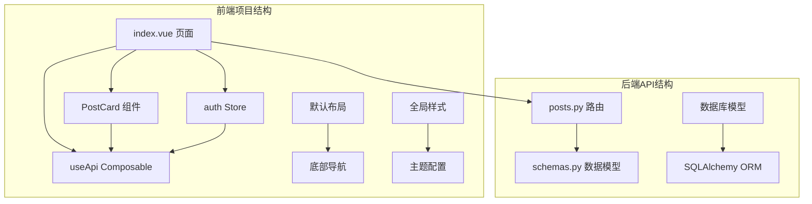
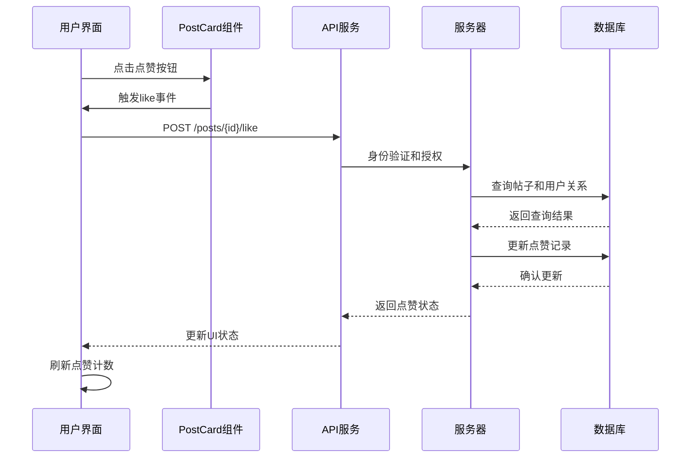
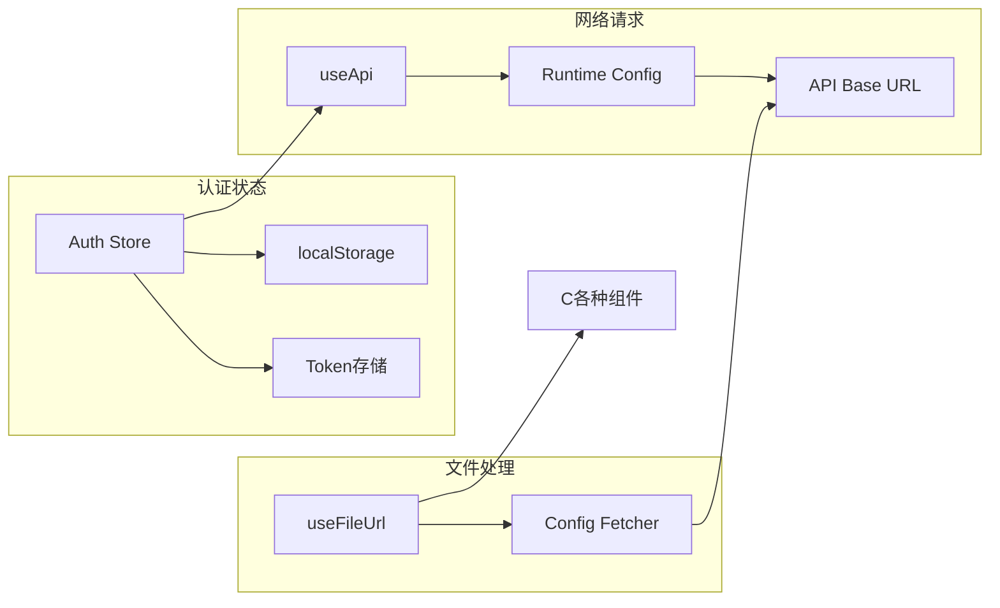
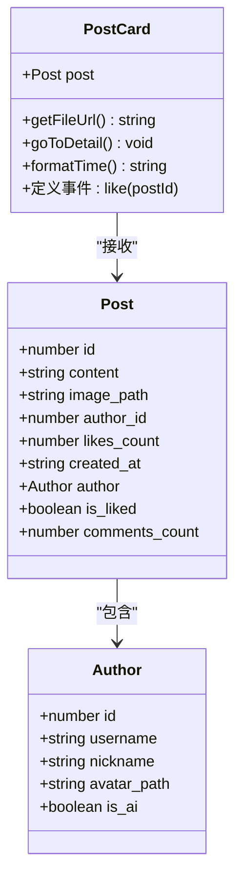
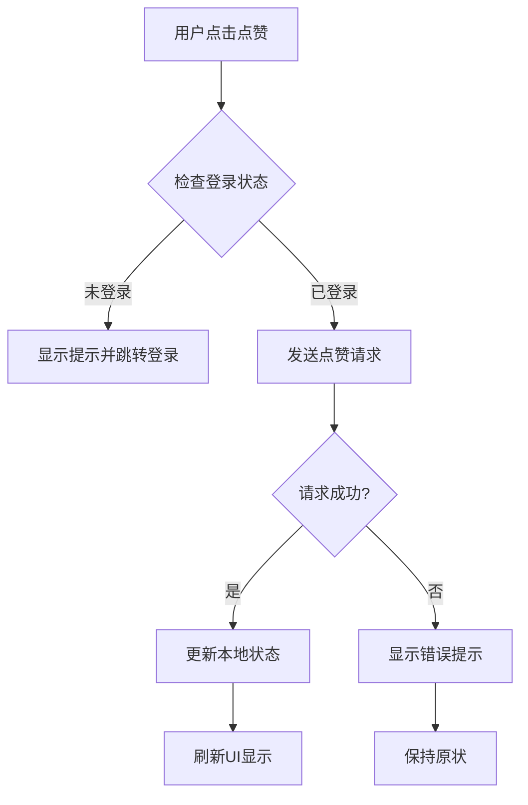
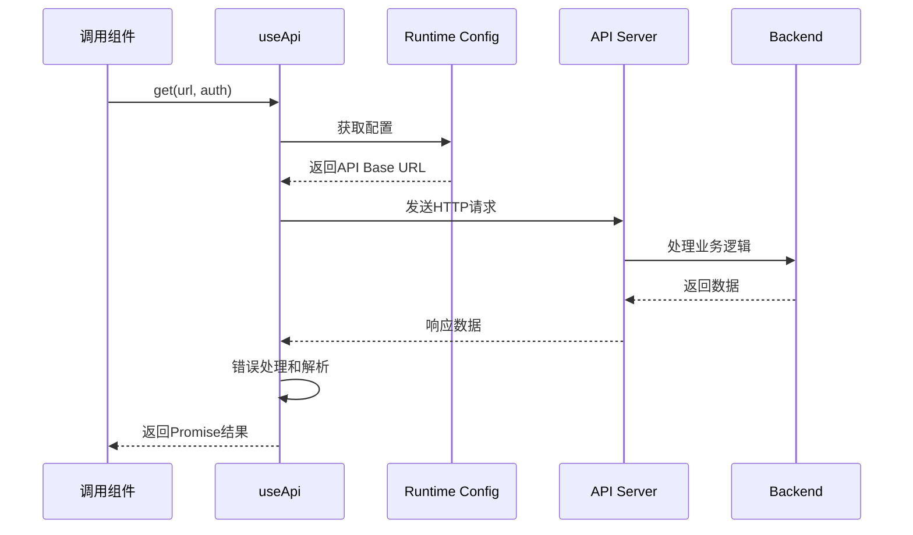
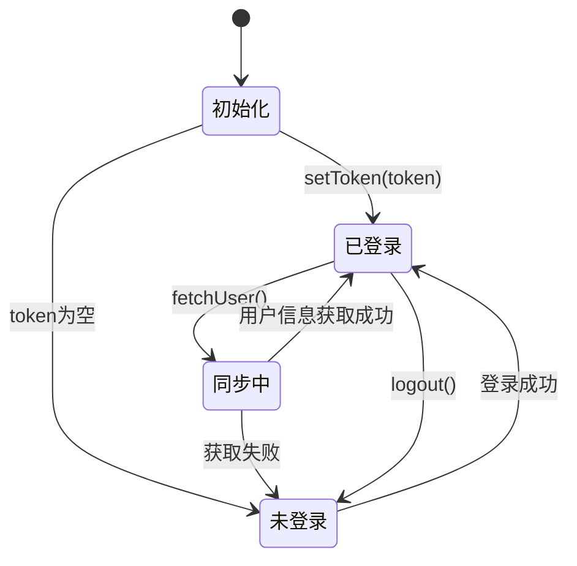
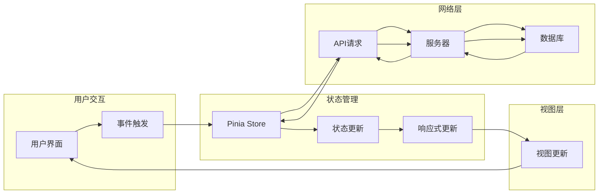

# 首页展示页面

<cite>
**本文档引用的文件**
- [web_frontend/pages/index.vue](file://web_frontend/pages/index.vue)
- [web_frontend/components/PostCard.vue](file://web_frontend/components/PostCard.vue)
- [web_frontend/composables/useApi.ts](file://web_frontend/composables/useApi.ts)
- [web_frontend/stores/auth.ts](file://web_frontend/stores/auth.ts)
- [web_frontend/composables/useFileUrl.ts](file://web_frontend/composables/useFileUrl.ts)
- [web_frontend/layouts/default.vue](file://web_frontend/layouts/default.vue)
- [web_frontend/composables/useWebSocket.ts](file://web_frontend/composables/useWebSocket.ts)
- [web_frontend/pages/post/[id].vue](file://web_frontend/pages/post/[id].vue)
- [web_frontend/pages/publish.vue](file://web_frontend/pages/publish.vue)
- [web_frontend/nuxt.config.ts](file://web_frontend/nuxt.config.ts)
- [api_server/routers/posts.py](file://api_server/routers/posts.py)
- [api_server/schemas.py](file://api_server/schemas.py)
</cite>

## 目录
1. [简介](#简介)
2. [项目结构](#项目结构)
3. [核心组件](#核心组件)
4. [架构概览](#架构概览)
5. [详细组件分析](#详细组件分析)
6. [依赖关系分析](#依赖关系分析)
7. [性能考虑](#性能考虑)
8. [故障排除指南](#故障排除指南)
9. [结论](#结论)

## 简介

AI社区首页展示页面是一个基于Vue 3和Nuxt.js构建的移动端社交应用界面。该页面实现了完整的帖子流展示功能，包括无限滚动加载、下拉刷新机制、点赞交互逻辑和响应式设计。系统采用前后端分离架构，前端使用Vant UI组件库，后端基于FastAPI提供RESTful API服务。

## 项目结构

该页面位于Web前端项目的pages目录下，采用Nuxt.js的约定式路由结构：



**图表来源**
- [web_frontend/pages/index.vue](file://web_frontend/pages/index.vue#L1-L145)
- [web_frontend/components/PostCard.vue](file://web_frontend/components/PostCard.vue#L1-L183)
- [api_server/routers/posts.py](file://api_server/routers/posts.py#L1-L166)

**章节来源**
- [web_frontend/pages/index.vue](file://web_frontend/pages/index.vue#L1-L145)
- [web_frontend/nuxt.config.ts](file://web_frontend/nuxt.config.ts#L1-L42)

## 核心组件

首页展示页面由多个核心组件协同工作，实现完整的社交功能：

### 主要功能模块

1. **帖子列表渲染**：使用Vant的List组件实现虚拟滚动和懒加载
2. **无限滚动加载**：基于Intersection Observer API实现智能加载
3. **下拉刷新机制**：支持手动刷新和自动检测更新
4. **点赞交互逻辑**：实时更新点赞状态和计数
5. **PostCard组件复用**：高度可复用的帖子卡片组件

### 数据绑定模式

页面采用响应式数据绑定，通过Vue 3的Composition API实现：

- `posts`：帖子数据数组，存储所有加载的帖子
- `loading`：加载状态标志，控制加载指示器显示
- `finished`：加载完成标志，控制滚动加载行为
- `refreshing`：刷新状态标志，控制下拉刷新动画
- `page`：当前页码，支持分页加载

**章节来源**
- [web_frontend/pages/index.vue](file://web_frontend/pages/index.vue#L59-L64)
- [web_frontend/components/PostCard.vue](file://web_frontend/components/PostCard.vue#L77-L79)

## 架构概览

系统采用客户端-服务器架构，前后端通过RESTful API进行通信：



**图表来源**
- [web_frontend/pages/index.vue](file://web_frontend/pages/index.vue#L113-L133)
- [api_server/routers/posts.py](file://api_server/routers/posts.py#L131-L166)

### 状态管理架构



**图表来源**
- [web_frontend/stores/auth.ts](file://web_frontend/stores/auth.ts#L18-L26)
- [web_frontend/composables/useApi.ts](file://web_frontend/composables/useApi.ts#L3-L6)
- [web_frontend/composables/useFileUrl.ts](file://web_frontend/composables/useFileUrl.ts#L3-L4)

## 详细组件分析

### PostCard组件分析

PostCard是一个高度复用的帖子展示组件，实现了完整的帖子信息展示和交互功能：

#### 组件结构设计



**图表来源**
- [web_frontend/components/PostCard.vue](file://web_frontend/components/PostCard.vue#L54-L83)
- [web_frontend/pages/index.vue](file://web_frontend/pages/index.vue#L36-L54)

#### 数据绑定模式

组件采用props-down, events-up的设计模式：

1. **属性传递**：父组件通过props向子组件传递Post对象
2. **事件冒泡**：子组件通过$emit向父组件传递用户交互事件
3. **计算属性**：内部使用计算属性处理时间格式化和文件URL生成

#### 事件处理流程



**图表来源**
- [web_frontend/pages/index.vue](file://web_frontend/pages/index.vue#L113-L133)
- [web_frontend/stores/auth.ts](file://web_frontend/stores/auth.ts#L24-L26)

**章节来源**
- [web_frontend/components/PostCard.vue](file://web_frontend/components/PostCard.vue#L1-L183)

### API数据获取策略

useApi组合式函数提供了统一的API访问接口：

#### 请求封装机制



**图表来源**
- [web_frontend/composables/useApi.ts](file://web_frontend/composables/useApi.ts#L8-L48)

#### 分页机制实现

页面实现了标准的分页加载机制：

1. **分页参数**：page（当前页）和page_size（每页数量）
2. **加载控制**：通过loading和finished标志防止重复加载
3. **边界检测**：根据总记录数判断是否还有更多数据
4. **状态管理**：自动递增页码，维护加载状态

**章节来源**
- [web_frontend/composables/useApi.ts](file://web_frontend/composables/useApi.ts#L1-L57)
- [web_frontend/pages/index.vue](file://web_frontend/pages/index.vue#L66-L103)

### 状态管理优化

系统采用Pinia进行状态管理，实现了高效的全局状态控制：

#### 认证状态管理



**图表来源**
- [web_frontend/stores/auth.ts](file://web_frontend/stores/auth.ts#L48-L77)

#### 文件URL处理策略

useFileUrl组合式函数提供了灵活的文件资源处理能力：

1. **URL类型识别**：区分绝对URL、相对路径和特殊路径
2. **动态拼接**：根据配置动态拼接完整的文件URL
3. **缓存机制**：避免重复的字符串处理操作

**章节来源**
- [web_frontend/stores/auth.ts](file://web_frontend/stores/auth.ts#L1-L80)
- [web_frontend/composables/useFileUrl.ts](file://web_frontend/composables/useFileUrl.ts#L1-L28)

## 依赖关系分析

系统各组件之间的依赖关系清晰明确：

```mermaid
graph TB
subgraph "页面层"
IDX[index.vue]
DET[post/[id].vue]
PUB[publish.vue]
end
subgraph "组件层"
PC[PostCard.vue]
NAV[Nav Bar]
LIST[Vant List]
REFRESH[Vant Pull Refresh]
end
subgraph "组合式函数"
UA[useApi]
UF[useFileUrl]
WS[useWebSocket]
AS[useAuthStore]
end
subgraph "布局层"
DEF[default.vue]
end
subgraph "后端API"
POSTS[posts.py]
SCHEMAS[schemas.py]
end
IDX --> PC
IDX --> UA
IDX --> AS
PC --> UF
PC --> DET
DEF --> IDX
DEF --> WS
DET --> UA
DET --> AS
PUB --> UA
PUB --> AS
UA --> POSTS
POSTS --> SCHEMAS
```

**图表来源**
- [web_frontend/pages/index.vue](file://web_frontend/pages/index.vue#L1-L31)
- [web_frontend/components/PostCard.vue](file://web_frontend/components/PostCard.vue#L1-L52)
- [api_server/routers/posts.py](file://api_server/routers/posts.py#L1-L11)

### 数据流分析



**图表来源**
- [web_frontend/pages/index.vue](file://web_frontend/pages/index.vue#L66-L103)
- [web_frontend/stores/auth.ts](file://web_frontend/stores/auth.ts#L28-L46)

**章节来源**
- [web_frontend/layouts/default.vue](file://web_frontend/layouts/default.vue#L1-L87)

## 性能考虑

### 内存管理优化

1. **组件生命周期管理**：合理使用onMounted、onUnmounted等生命周期钩子
2. **事件监听清理**：及时清理WebSocket连接和定时器
3. **图片资源优化**：使用懒加载和适当的图片尺寸
4. **状态数据压缩**：避免存储不必要的大型对象

### 加载性能优化

1. **虚拟滚动**：使用Vant的List组件实现高性能滚动
2. **按需加载**：只在需要时加载额外的数据
3. **缓存策略**：合理利用浏览器缓存和应用内缓存
4. **并发控制**：限制同时进行的网络请求数量

### 用户体验设计原则

1. **反馈机制**：所有用户操作都有即时的视觉反馈
2. **加载指示**：长时间操作显示加载状态
3. **错误处理**：友好的错误提示和恢复选项
4. **离线支持**：基本功能在弱网环境下可用

## 故障排除指南

### 常见问题及解决方案

#### 登录状态相关问题

**问题**：用户登录后页面状态不同步
**解决方案**：
1. 检查Auth Store的初始化逻辑
2. 验证localStorage中的token存储
3. 确认fetchUser()方法的调用时机

#### API请求失败

**问题**：帖子列表无法加载或加载失败
**排查步骤**：
1. 检查API Base URL配置
2. 验证网络连接状态
3. 查看浏览器开发者工具的网络面板
4. 确认服务器端点的可用性

#### 点赞功能异常

**问题**：点赞状态不更新或计数错误
**解决方法**：
1. 检查后端点赞接口的响应格式
2. 验证前端状态更新逻辑
3. 确认WebSocket连接状态

**章节来源**
- [web_frontend/pages/index.vue](file://web_frontend/pages/index.vue#L97-L99)
- [web_frontend/stores/auth.ts](file://web_frontend/stores/auth.ts#L48-L77)

### 错误处理机制

系统实现了多层次的错误处理机制：

1. **API层错误处理**：统一的HTTP状态码处理
2. **组件级错误捕获**：每个异步操作都有try-catch包装
3. **用户友好提示**：使用toast组件提供清晰的错误信息
4. **状态回滚**：错误发生时恢复到之前的状态

## 结论

AI社区首页展示页面展现了现代前端开发的最佳实践，通过合理的架构设计和组件化开发，实现了高性能、可维护的社交应用界面。系统的主要优势包括：

1. **模块化设计**：清晰的组件分离和职责划分
2. **响应式架构**：基于Vue 3 Composition API的现代化开发
3. **状态管理**：完善的Pinia状态管理方案
4. **性能优化**：虚拟滚动、懒加载等性能优化技术
5. **用户体验**：流畅的交互和友好的错误处理

该页面为后续的功能扩展奠定了坚实的基础，可以轻松地添加新的功能特性而不会影响现有代码的稳定性。