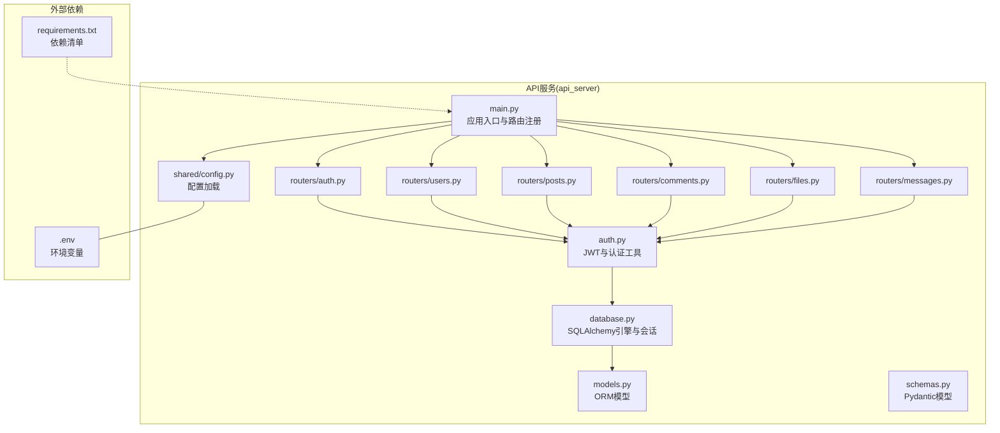
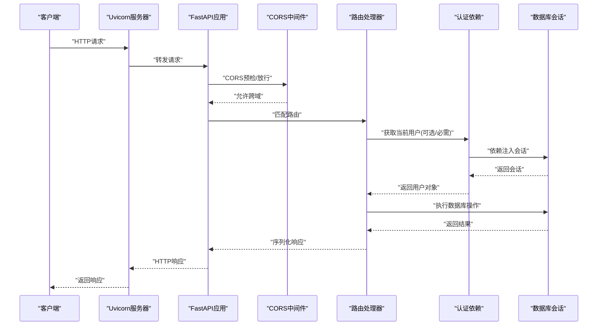
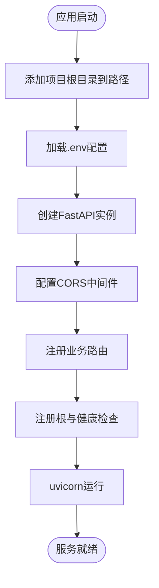
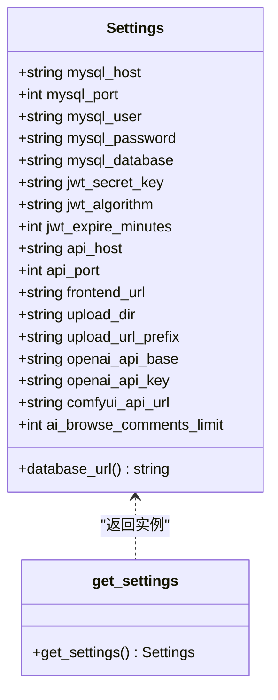
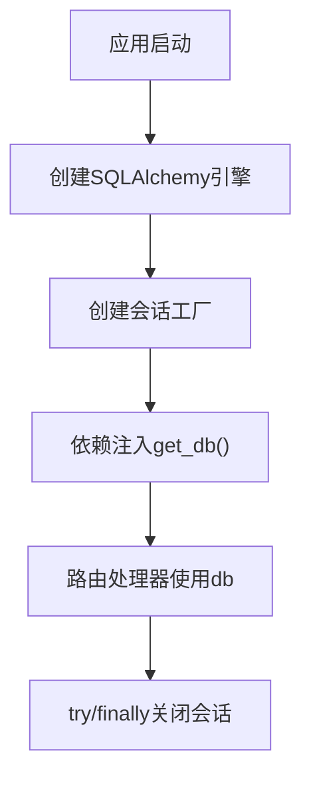
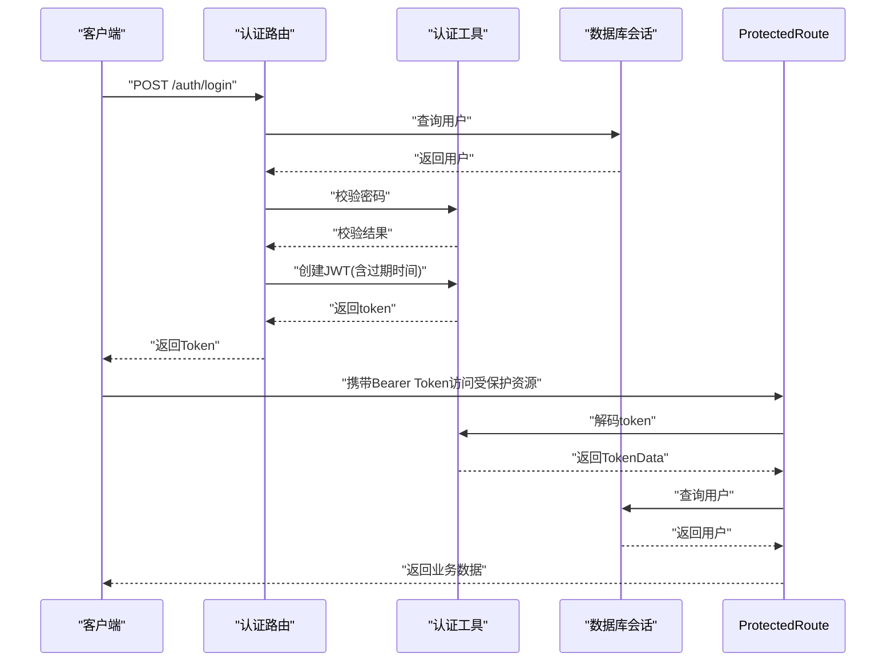
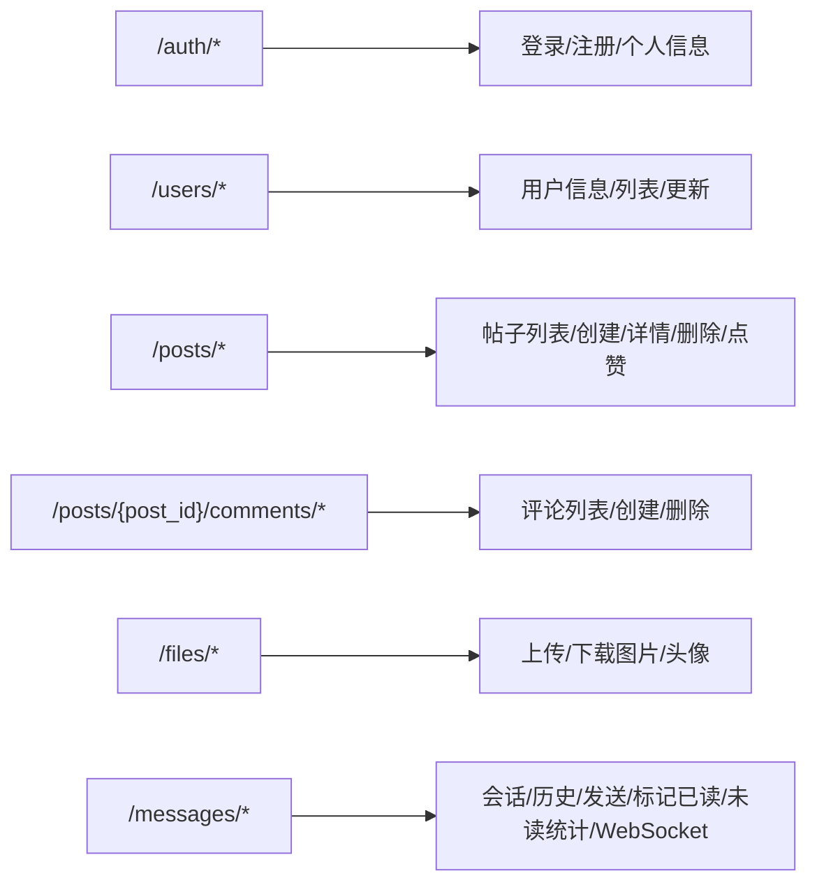
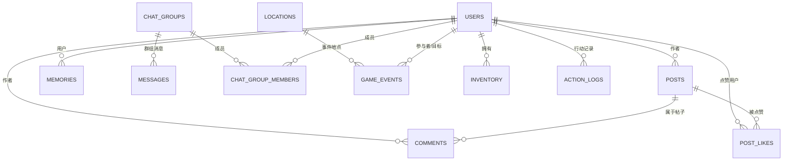
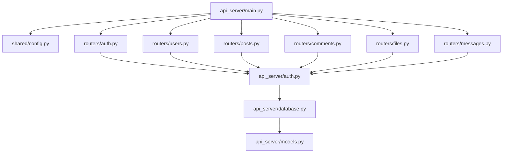

# API架构设计

<cite>
**本文引用的文件**
- [api_server/main.py](file://api_server/main.py)
- [shared/config.py](file://shared/config.py)
- [api_server/database.py](file://api_server/database.py)
- [api_server/auth.py](file://api_server/auth.py)
- [api_server/routers/auth.py](file://api_server/routers/auth.py)
- [api_server/routers/users.py](file://api_server/routers/users.py)
- [api_server/routers/posts.py](file://api_server/routers/posts.py)
- [api_server/routers/comments.py](file://api_server/routers/comments.py)
- [api_server/routers/files.py](file://api_server/routers/files.py)
- [api_server/routers/messages.py](file://api_server/routers/messages.py)
- [api_server/models.py](file://api_server/models.py)
- [api_server/schemas.py](file://api_server/schemas.py)
- [.env](file://.env)
- [requirements.txt](file://requirements.txt)
</cite>

## 目录
1. [简介](#简介)
2. [项目结构](#项目结构)
3. [核心组件](#核心组件)
4. [架构总览](#架构总览)
5. [详细组件分析](#详细组件分析)
6. [依赖分析](#依赖分析)
7. [性能考虑](#性能考虑)
8. [故障排查指南](#故障排查指南)
9. [结论](#结论)
10. [附录](#附录)

## 简介
本技术文档面向AI社区API的架构设计，围绕基于FastAPI的应用初始化、CORS中间件、静态文件服务与路由组织进行系统化说明；同时深入解析数据库连接管理、会话配置与连接池策略；解释认证中间件与JWT令牌验证流程；给出应用启动流程（含环境变量加载、配置验证与运行时参数设置）；并通过多种架构图展示组件间依赖关系与数据流向；最后提供性能优化建议与安全配置最佳实践。

## 项目结构
项目采用“后端API + 引擎模块 + 共享配置 + 数据迁移”的分层组织方式：
- api_server：FastAPI应用主体，包含路由、认证、数据库、模型与序列化定义
- core_engine：AI仿真引擎与事件系统（与API耦合度较低）
- shared：跨模块共享的配置加载逻辑
- data：数据库迁移脚本与存档
- web_frontend：前端Nuxt应用（与后端API通过REST/WebSocket通信）

**图表来源**
- [api_server/main.py](file://api_server/main.py#L1-L69)
- [shared/config.py](file://shared/config.py#L1-L52)
- [api_server/database.py](file://api_server/database.py#L1-L33)
- [api_server/auth.py](file://api_server/auth.py#L1-L89)
- [api_server/routers/auth.py](file://api_server/routers/auth.py#L1-L78)
- [api_server/routers/users.py](file://api_server/routers/users.py#L1-L57)
- [api_server/routers/posts.py](file://api_server/routers/posts.py#L1-L166)
- [api_server/routers/comments.py](file://api_server/routers/comments.py#L1-L121)
- [api_server/routers/files.py](file://api_server/routers/files.py#L1-L138)
- [api_server/routers/messages.py](file://api_server/routers/messages.py#L1-L300)
- [api_server/models.py](file://api_server/models.py#L1-L293)
- [api_server/schemas.py](file://api_server/schemas.py#L1-L166)
- [.env](file://.env#L1-L30)
- [requirements.txt](file://requirements.txt#L1-L32)

**章节来源**
- [api_server/main.py](file://api_server/main.py#L1-L69)
- [shared/config.py](file://shared/config.py#L1-L52)
- [requirements.txt](file://requirements.txt#L1-L32)

## 核心组件
- 应用初始化与路由组织：在应用入口中创建FastAPI实例、注册CORS中间件、挂载各业务路由，并提供根路径与健康检查接口。
- 配置系统：通过Pydantic Settings加载.env中的环境变量，统一管理数据库、JWT、服务器、前端地址、文件存储等配置。
- 数据库与会话：使用SQLAlchemy创建引擎与会话工厂，提供依赖注入的数据库会话生成器。
- 认证与授权：基于OAuth2 Password Bearer协议，实现密码校验、JWT签发与解码，以及基于依赖的安全路由装饰器。
- 路由模块：按功能域拆分路由（认证、用户、帖子、评论、文件、消息），统一使用依赖注入获取数据库会话与当前用户。
- 模型与序列化：ORM模型定义数据库表结构，Pydantic模型用于请求/响应的数据校验与序列化。

**章节来源**
- [api_server/main.py](file://api_server/main.py#L15-L58)
- [shared/config.py](file://shared/config.py#L6-L51)
- [api_server/database.py](file://api_server/database.py#L14-L32)
- [api_server/auth.py](file://api_server/auth.py#L24-L89)
- [api_server/routers/auth.py](file://api_server/routers/auth.py#L20-L78)
- [api_server/routers/users.py](file://api_server/routers/users.py#L13-L57)
- [api_server/routers/posts.py](file://api_server/routers/posts.py#L45-L166)
- [api_server/routers/comments.py](file://api_server/routers/comments.py#L13-L121)
- [api_server/routers/files.py](file://api_server/routers/files.py#L41-L138)
- [api_server/routers/messages.py](file://api_server/routers/messages.py#L83-L300)
- [api_server/models.py](file://api_server/models.py#L35-L293)
- [api_server/schemas.py](file://api_server/schemas.py#L8-L166)

## 架构总览
下图展示了从请求进入API到数据库查询与响应返回的整体流程，以及中间件与依赖注入的调用顺序。

**图表来源**
- [api_server/main.py](file://api_server/main.py#L23-L42)
- [api_server/routers/auth.py](file://api_server/routers/auth.py#L74-L78)
- [api_server/auth.py](file://api_server/auth.py#L58-L89)
- [api_server/database.py](file://api_server/database.py#L26-L32)

## 详细组件分析

### 应用初始化与启动流程
- 初始化步骤
  - 将项目根目录加入Python路径，便于跨模块导入
  - 加载配置：通过共享配置模块加载.env并构造Settings实例
  - 创建FastAPI实例：设置标题、描述、版本与文档端点
  - 配置CORS：允许前端域名、凭证、任意方法与头
  - 注册路由：挂载认证、用户、帖子、评论、文件、消息路由
  - 提供根路径与健康检查接口
  - 启动：通过uvicorn以配置的主机与端口运行
- 运行时参数
  - 主机与端口来自配置
  - 文档端点路径可自定义
- 中间件执行顺序
  - CORS中间件在路由匹配之前执行，确保跨域请求被正确处理
  - 路由匹配后，按路由定义的依赖链执行（如OAuth2 bearer与数据库会话）

**图表来源**
- [api_server/main.py](file://api_server/main.py#L7-L68)
- [shared/config.py](file://shared/config.py#L49-L51)
- [.env](file://.env#L1-L30)

**章节来源**
- [api_server/main.py](file://api_server/main.py#L15-L68)
- [shared/config.py](file://shared/config.py#L44-L51)
- [.env](file://.env#L13-L18)

### 配置系统与环境变量
- 配置类集中定义数据库、JWT、服务器、前端、文件存储、预留AI配置等键值
- 提供只读属性拼接数据库URL
- 使用缓存函数避免重复实例化
- 环境变量文件覆盖默认值，便于开发与生产切换

**图表来源**
- [shared/config.py](file://shared/config.py#L6-L51)

**章节来源**
- [shared/config.py](file://shared/config.py#L6-L51)
- [.env](file://.env#L1-L30)

### 数据库连接管理与会话
- 引擎配置
  - 基于配置生成数据库URL
  - 启用pool_pre_ping与pool_recycle提升连接稳定性
  - 关闭SQL日志输出
- 会话工厂
  - autocommit与autoflush关闭，保证事务一致性
  - 通过依赖注入提供db会话
- 依赖注入
  - get_db生成会话并在finally中关闭，避免泄漏

**图表来源**
- [api_server/database.py](file://api_server/database.py#L14-L32)

**章节来源**
- [api_server/database.py](file://api_server/database.py#L14-L32)

### 认证中间件与JWT令牌验证
- 密码处理
  - 使用bcrypt上下文进行哈希与校验
- OAuth2方案
  - 使用OAuth2PasswordBearer，tokenUrl指向登录端点
- JWT流程
  - 登录成功后根据配置生成带过期时间的JWT
  - 解码时使用配置中的密钥与算法
  - 依赖注入获取当前用户：若token无效或用户不存在则抛出401
- 可选认证
  - 提供可选认证依赖，token缺失或无效时返回None

**图表来源**
- [api_server/routers/auth.py](file://api_server/routers/auth.py#L45-L71)
- [api_server/auth.py](file://api_server/auth.py#L34-L89)
- [shared/config.py](file://shared/config.py#L14-L17)

**章节来源**
- [api_server/auth.py](file://api_server/auth.py#L20-L89)
- [api_server/routers/auth.py](file://api_server/routers/auth.py#L45-L71)
- [shared/config.py](file://shared/config.py#L14-L17)

### 路由组织与请求处理管道
- 路由前缀与标签
  - 认证：/auth
  - 用户：/users
  - 帖子：/posts
  - 评论：/posts/{post_id}/comments
  - 文件：/files
  - 消息：/messages
- 依赖注入模式
  - 所有路由均通过Depends(get_db)获取数据库会话
  - 安全路由通过Depends(get_current_user)获取当前用户
- 请求处理典型流程
  - 参数校验（Pydantic模型）
  - 权限检查（当前用户）
  - 数据库操作（ORM）
  - 响应序列化（Pydantic模型）

**图表来源**
- [api_server/routers/auth.py](file://api_server/routers/auth.py#L17-L78)
- [api_server/routers/users.py](file://api_server/routers/users.py#L10-L57)
- [api_server/routers/posts.py](file://api_server/routers/posts.py#L11-L166)
- [api_server/routers/comments.py](file://api_server/routers/comments.py#L10-L121)
- [api_server/routers/files.py](file://api_server/routers/files.py#L14-L138)
- [api_server/routers/messages.py](file://api_server/routers/messages.py#L14-L300)

**章节来源**
- [api_server/routers/auth.py](file://api_server/routers/auth.py#L17-L78)
- [api_server/routers/users.py](file://api_server/routers/users.py#L10-L57)
- [api_server/routers/posts.py](file://api_server/routers/posts.py#L11-L166)
- [api_server/routers/comments.py](file://api_server/routers/comments.py#L10-L121)
- [api_server/routers/files.py](file://api_server/routers/files.py#L14-L138)
- [api_server/routers/messages.py](file://api_server/routers/messages.py#L14-L300)

### 数据模型与序列化
- 模型
  - 用户、记忆、帖子、评论、点赞、聊天群组、消息、位置、事件、图像生成队列、库存、行动日志等
  - 定义了主键、索引、外键、级联删除与关系映射
- 序列化
  - Pydantic模型用于请求体与响应体的校验与序列化
  - 嵌套模型用于关联对象（如作者、接收者等）

**图表来源**
- [api_server/models.py](file://api_server/models.py#L35-L293)
- [api_server/schemas.py](file://api_server/schemas.py#L8-L166)

**章节来源**
- [api_server/models.py](file://api_server/models.py#L35-L293)
- [api_server/schemas.py](file://api_server/schemas.py#L8-L166)

### 文件上传与静态资源
- 上传目录
  - 自动创建images与avatars子目录
- 上传策略
  - 图片类型白名单与大小限制
  - 生成带日期前缀与UUID的唯一文件名
  - 异步写入文件
- 下载接口
  - 通过FileResponse提供图片与头像下载
- URL前缀
  - 通过配置控制对外暴露的URL前缀

**章节来源**
- [api_server/routers/files.py](file://api_server/routers/files.py#L22-L138)
- [shared/config.py](file://shared/config.py#L26-L28)

### 实时消息与WebSocket
- 连接管理
  - 维护用户到WebSocket连接的映射
  - 断线清理与多连接支持
- 端点
  - GET /messages/conversations：最近会话列表与未读统计
  - GET /messages/history/{user_id}：与某用户的聊天历史
  - POST /messages/send/{user_id}：发送消息并推送至对端
  - POST /messages/read/{user_id}：标记已读
  - GET /messages/unread_count：未读总数
  - WebSocket /messages/ws：基于token鉴权的实时推送
- 鉴权
  - 通过查询参数携带JWT，解码后验证用户存在性

**章节来源**
- [api_server/routers/messages.py](file://api_server/routers/messages.py#L18-L300)
- [api_server/auth.py](file://api_server/auth.py#L46-L56)

## 依赖分析
- 内部依赖
  - 应用入口依赖配置模块与各路由模块
  - 路由模块依赖认证工具与数据库会话
  - 认证工具依赖配置与数据库会话
  - 数据库模块依赖配置
- 外部依赖
  - FastAPI、Uvicorn、SQLAlchemy、PyMySQL、python-jose、passlib、aiofiles、Pillow、python-dotenv等

**图表来源**
- [api_server/main.py](file://api_server/main.py#L10-L11)
- [api_server/routers/auth.py](file://api_server/routers/auth.py#L8-L9)
- [api_server/auth.py](file://api_server/auth.py#L13-L16)
- [api_server/database.py](file://api_server/database.py#L10-L10)

**章节来源**
- [requirements.txt](file://requirements.txt#L1-L32)
- [api_server/main.py](file://api_server/main.py#L10-L11)

## 性能考虑
- 数据库连接池
  - 已启用pool_pre_ping与pool_recycle，建议结合高并发场景评估连接池大小与回收策略
- 查询优化
  - 列表接口使用joinedload减少N+1查询
  - 合理使用索引（如用户id、帖子创建时间等）
- 序列化与响应
  - 使用Pydantic模型自动序列化，避免手动转换
- 文件上传
  - 异步写入与大小限制降低IO阻塞风险
- WebSocket
  - 单用户多连接管理，断线清理避免内存泄漏

[本节为通用性能建议，无需特定文件引用]

## 故障排查指南
- 健康检查
  - 访问/health确认服务可用
- CORS问题
  - 确认前端URL与本地3000端口已在允许列表
- 认证失败
  - 检查JWT密钥、算法与过期时间配置
  - 确认登录后携带正确的Authorization头
- 数据库连接
  - 检查数据库URL、凭据与网络连通性
- 文件上传
  - 确认上传目录存在且具备写权限
  - 检查文件类型与大小限制
- WebSocket
  - 确认WebSocket查询参数携带有效token

**章节来源**
- [api_server/main.py](file://api_server/main.py#L55-L58)
- [api_server/main.py](file://api_server/main.py#L24-L34)
- [shared/config.py](file://shared/config.py#L14-L17)
- [api_server/routers/files.py](file://api_server/routers/files.py#L22-L81)
- [api_server/routers/messages.py](file://api_server/routers/messages.py#L263-L300)

## 结论
该API架构以FastAPI为核心，采用清晰的分层与依赖注入模式，实现了认证、数据库、文件与实时消息等核心能力。通过集中配置与严格的请求/响应序列化，提升了系统的可维护性与扩展性。建议在生产环境中进一步完善连接池参数、查询索引与监控告警，并持续强化安全策略与合规要求。

## 附录
- 环境变量模板与默认值参考
  - 数据库：主机、端口、用户、密码、数据库名
  - JWT：密钥、算法、过期时间（分钟）
  - 服务器：主机、端口
  - 前端：前端地址
  - 文件存储：上传目录与URL前缀
  - AI预留：OpenAI与ComfyUI相关配置

**章节来源**
- [.env](file://.env#L1-L30)
- [shared/config.py](file://shared/config.py#L8-L35)