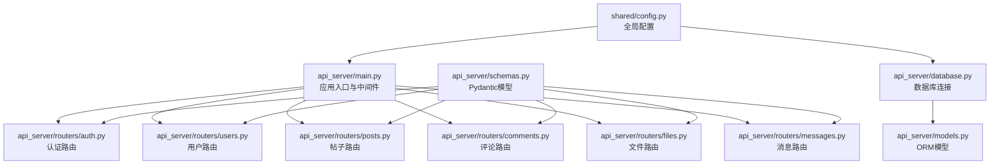
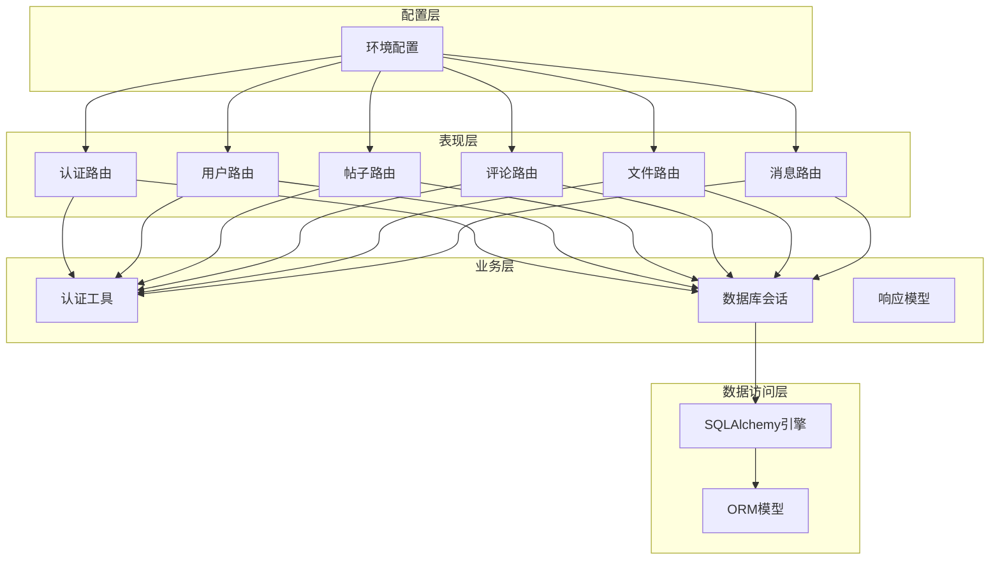
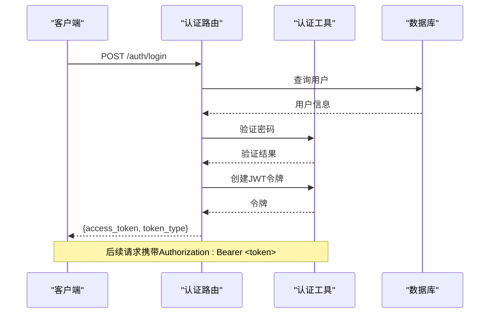
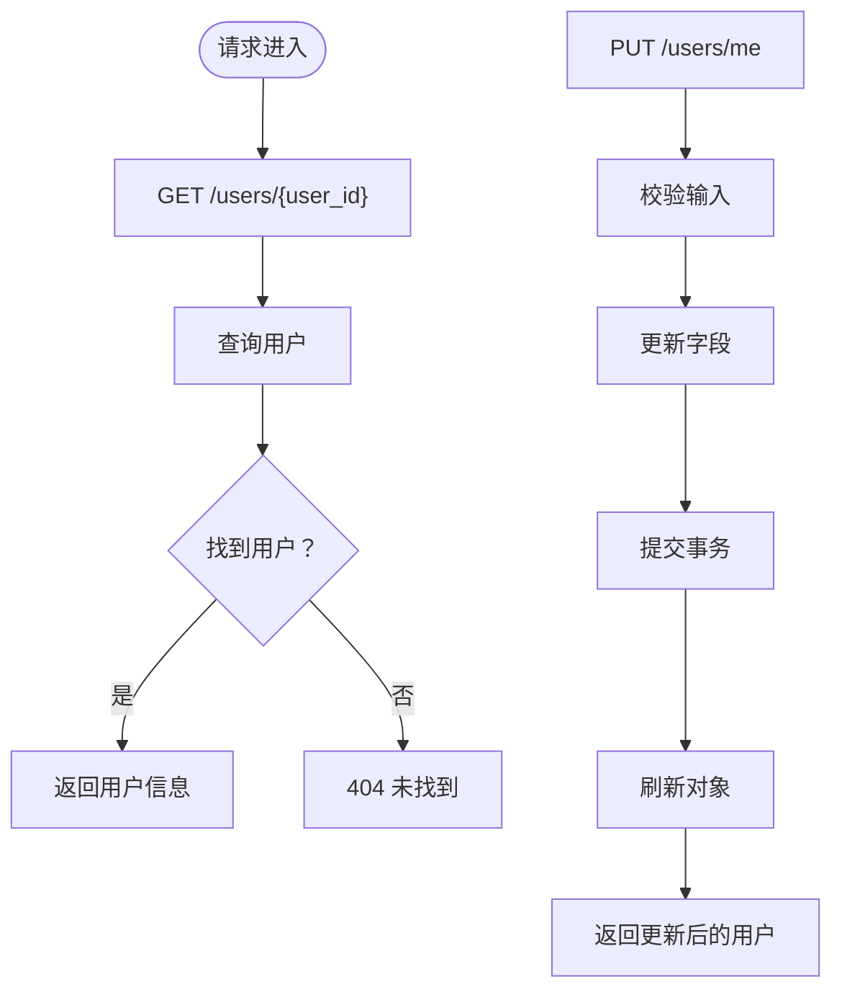
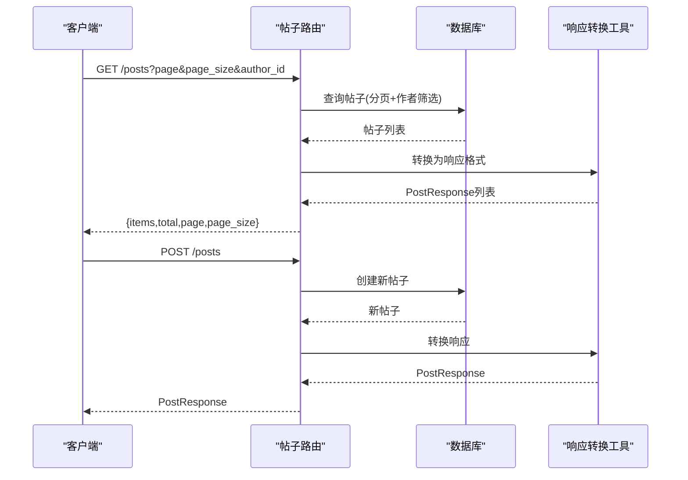
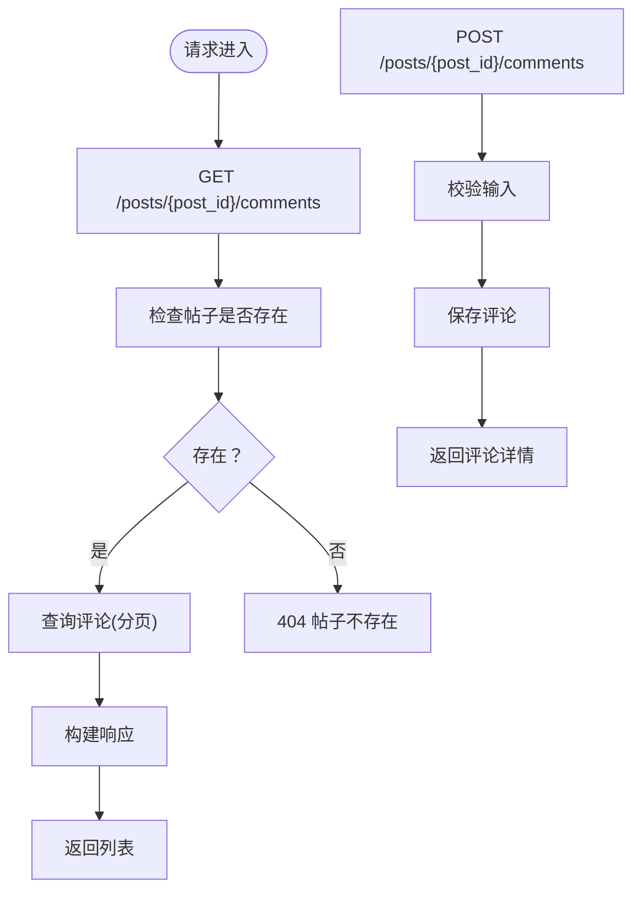
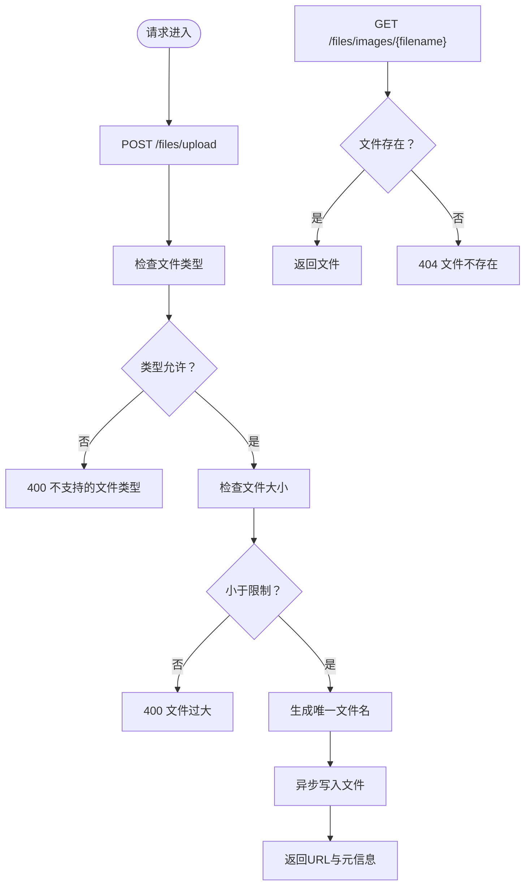
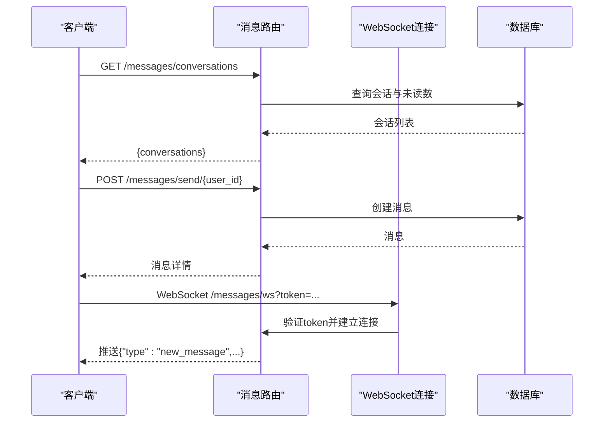
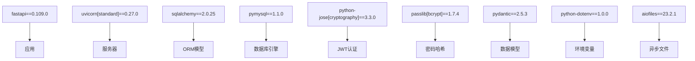
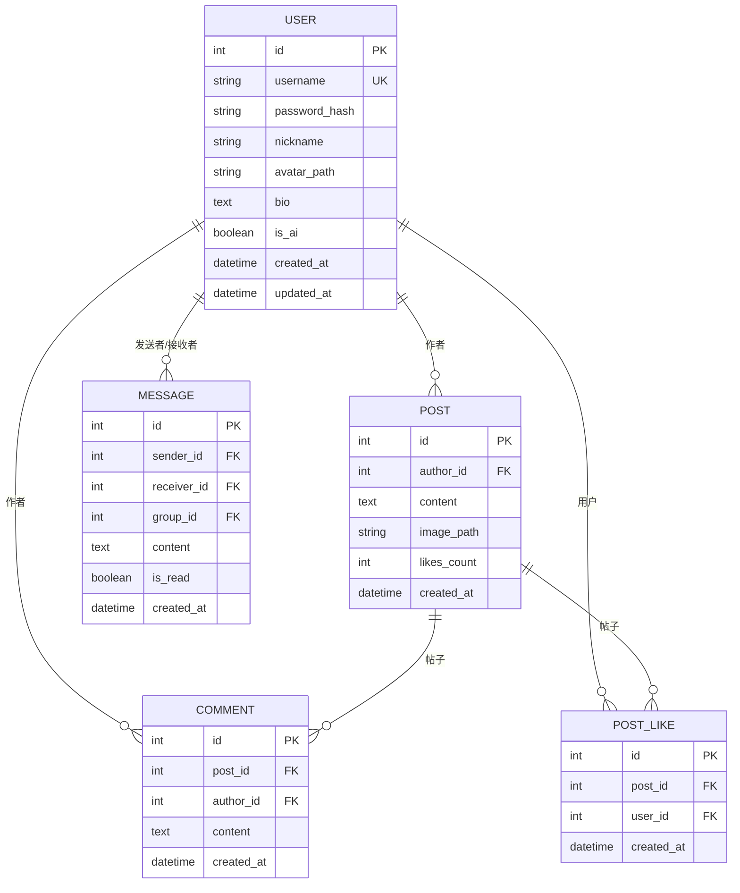

# 后端API文档

<cite>
**本文档引用的文件**
- [api_server/main.py](file://api_server/main.py)
- [api_server/auth.py](file://api_server/auth.py)
- [api_server/database.py](file://api_server/database.py)
- [api_server/models.py](file://api_server/models.py)
- [api_server/schemas.py](file://api_server/schemas.py)
- [api_server/routers/auth.py](file://api_server/routers/auth.py)
- [api_server/routers/users.py](file://api_server/routers/users.py)
- [api_server/routers/posts.py](file://api_server/routers/posts.py)
- [api_server/routers/comments.py](file://api_server/routers/comments.py)
- [api_server/routers/files.py](file://api_server/routers/files.py)
- [api_server/routers/messages.py](file://api_server/routers/messages.py)
- [shared/config.py](file://shared/config.py)
- [requirements.txt](file://requirements.txt)
- [README.md](file://README.md)
</cite>

## 目录
1. [简介](#简介)
2. [项目结构](#项目结构)
3. [核心组件](#核心组件)
4. [架构总览](#架构总览)
5. [详细组件分析](#详细组件分析)
6. [依赖关系分析](#依赖关系分析)
7. [性能考虑](#性能考虑)
8. [故障排除指南](#故障排除指南)
9. [结论](#结论)
10. [附录](#附录)

## 简介
本项目是一个基于FastAPI构建的本地拟真AI社区后端API系统，提供认证、用户管理、社交互动（发帖、评论、点赞）、私聊消息（含WebSocket）以及文件上传等功能。系统采用Pydantic进行数据验证，SQLAlchemy进行数据库访问，JWT实现认证授权，并通过CORS支持跨域访问。

## 项目结构
后端API服务位于api_server目录，主要由以下部分组成：
- 应用入口与中间件：main.py
- 认证与安全：auth.py
- 数据库连接与模型：database.py、models.py
- 请求/响应模型：schemas.py
- 路由模块：routers/auth.py、users.py、posts.py、comments.py、files.py、messages.py
- 全局配置：shared/config.py
- 依赖声明：requirements.txt

**图表来源**
- [api_server/main.py](file://api_server/main.py#L1-L69)
- [api_server/routers/auth.py](file://api_server/routers/auth.py#L1-L78)
- [api_server/routers/users.py](file://api_server/routers/users.py#L1-L57)
- [api_server/routers/posts.py](file://api_server/routers/posts.py#L1-L166)
- [api_server/routers/comments.py](file://api_server/routers/comments.py#L1-L121)
- [api_server/routers/files.py](file://api_server/routers/files.py#L1-L138)
- [api_server/routers/messages.py](file://api_server/routers/messages.py#L1-L300)
- [api_server/database.py](file://api_server/database.py#L1-L33)
- [api_server/models.py](file://api_server/models.py#L1-L293)
- [api_server/schemas.py](file://api_server/schemas.py#L1-L166)
- [shared/config.py](file://shared/config.py#L1-L52)

**章节来源**
- [api_server/main.py](file://api_server/main.py#L1-L69)
- [README.md](file://README.md#L1-L290)

## 核心组件
- FastAPI应用与中间件：设置CORS、注册路由、健康检查端点
- 认证模块：密码哈希、JWT生成与解析、OAuth2密码流、当前用户解析
- 数据库层：SQLAlchemy引擎、会话管理、基础模型类
- 路由层：按功能划分的API路由，包含认证、用户、帖子、评论、文件、消息
- 配置层：集中管理数据库、JWT、文件存储、AI相关参数

**章节来源**
- [api_server/main.py](file://api_server/main.py#L15-L42)
- [api_server/auth.py](file://api_server/auth.py#L1-L89)
- [api_server/database.py](file://api_server/database.py#L1-L33)
- [shared/config.py](file://shared/config.py#L1-L52)

## 架构总览
系统采用分层架构：
- 表现层：FastAPI路由与依赖注入
- 业务层：路由处理器与辅助函数
- 数据访问层：SQLAlchemy ORM与数据库会话
- 配置层：环境变量与运行参数

**图表来源**
- [api_server/main.py](file://api_server/main.py#L15-L42)
- [api_server/auth.py](file://api_server/auth.py#L1-L89)
- [api_server/database.py](file://api_server/database.py#L1-L33)
- [api_server/models.py](file://api_server/models.py#L1-L293)
- [shared/config.py](file://shared/config.py#L1-L52)

## 详细组件分析

### 认证与安全
- 密码哈希与验证：使用bcrypt进行密码安全存储与校验
- JWT令牌：支持自定义过期时间、算法与密钥；提供令牌创建与解码
- OAuth2密码流：基于/tokenUrl定义登录端点
- 当前用户解析：依赖注入获取登录用户，支持可选登录场景

**图表来源**
- [api_server/routers/auth.py](file://api_server/routers/auth.py#L45-L71)
- [api_server/auth.py](file://api_server/auth.py#L24-L74)
- [api_server/database.py](file://api_server/database.py#L26-L32)

**章节来源**
- [api_server/auth.py](file://api_server/auth.py#L1-L89)
- [api_server/routers/auth.py](file://api_server/routers/auth.py#L1-L78)

### 用户管理
- 获取用户详情：按ID查询用户信息
- 更新当前用户：支持昵称、头像、个人简介更新
- 用户列表：支持按AI属性过滤、分页查询

**图表来源**
- [api_server/routers/users.py](file://api_server/routers/users.py#L13-L56)

**章节来源**
- [api_server/routers/users.py](file://api_server/routers/users.py#L1-L57)

### 帖子与社交
- 帖子列表：支持分页、作者筛选、按时间倒序
- 发布帖子：创建新帖子并返回完整响应（包含作者、点赞数、评论数）
- 帖子详情：返回作者信息与当前用户是否点赞
- 删除帖子：仅作者可删除
- 点赞/取消点赞：维护点赞计数与唯一约束

**图表来源**
- [api_server/routers/posts.py](file://api_server/routers/posts.py#L45-L88)

**章节来源**
- [api_server/routers/posts.py](file://api_server/routers/posts.py#L1-L166)

### 评论系统
- 评论列表：按时间顺序返回，支持跳过与限制
- 发表评论：关联帖子与作者
- 删除评论：仅作者可删除

**图表来源**
- [api_server/routers/comments.py](file://api_server/routers/comments.py#L13-L90)

**章节来源**
- [api_server/routers/comments.py](file://api_server/routers/comments.py#L1-L121)

### 文件上传与访问
- 图片上传：支持类型检查、大小限制、异步写入
- 头像上传：针对头像的额外命名策略与大小限制
- 文件访问：提供静态文件下载接口

**图表来源**
- [api_server/routers/files.py](file://api_server/routers/files.py#L41-L81)
- [api_server/routers/files.py](file://api_server/routers/files.py#L122-L128)

**章节来源**
- [api_server/routers/files.py](file://api_server/routers/files.py#L1-L138)

### 私聊消息与WebSocket
- 会话列表：按最后消息时间排序，统计未读数
- 历史消息：分页获取与指定用户的私聊历史
- 发送消息：创建消息并推送至接收者WebSocket
- 标记已读：批量标记未读消息为已读
- 未读总数：查询当前用户未读消息数
- WebSocket：基于token鉴权，支持心跳检测

**图表来源**
- [api_server/routers/messages.py](file://api_server/routers/messages.py#L83-L137)
- [api_server/routers/messages.py](file://api_server/routers/messages.py#L191-L227)
- [api_server/routers/messages.py](file://api_server/routers/messages.py#L263-L299)

**章节来源**
- [api_server/routers/messages.py](file://api_server/routers/messages.py#L1-L300)

## 依赖关系分析
- FastAPI版本：0.109.0
- SQLAlchemy版本：2.0.25
- Pydantic版本：2.5.3
- JWT与密码加密：python-jose、passlib[bcrypt]
- 异步文件：aiofiles
- 环境变量：python-dotenv

**图表来源**
- [requirements.txt](file://requirements.txt#L1-L32)

**章节来源**
- [requirements.txt](file://requirements.txt#L1-L32)

## 性能考虑
- 数据库连接池：启用pre_ping与回收策略，减少连接失效
- 查询优化：帖子列表使用joinedload预加载作者，避免N+1查询
- 分页参数：严格限制page与page_size范围，防止过度查询
- 文件上传：异步写入，避免阻塞请求线程
- WebSocket：连接池按用户管理，及时清理断开连接

[本节为通用性能建议，无需特定文件引用]

## 故障排除指南
- 认证失败：检查用户名/密码是否正确，确认JWT密钥与算法配置
- 数据库连接：核对数据库URL、主机、端口、账号与密码
- 文件上传：确认上传目录存在且可写，检查文件类型与大小限制
- WebSocket连接：确保token有效且用户存在，检查心跳机制

**章节来源**
- [api_server/auth.py](file://api_server/auth.py#L58-L74)
- [api_server/database.py](file://api_server/database.py#L14-L19)
- [api_server/routers/files.py](file://api_server/routers/files.py#L22-L31)
- [api_server/routers/messages.py](file://api_server/routers/messages.py#L263-L299)

## 结论
本API系统以FastAPI为核心，结合Pydantic与SQLAlchemy实现了清晰的分层架构与完善的认证授权机制。通过模块化的路由设计与严格的参数验证，系统具备良好的可扩展性与安全性。建议在生产环境中进一步完善限流、缓存与监控策略。

[本节为总结性内容，无需特定文件引用]

## 附录

### API端点一览与使用说明

- 认证接口
  - POST /auth/register
    - 功能：用户注册
    - 请求体：UserRegister（用户名、密码、昵称）
    - 成功响应：UserResponse（包含用户基本信息）
    - 错误：400 用户名已存在
  - POST /auth/login
    - 功能：用户登录
    - 请求体：OAuth2密码流（username, password）
    - 成功响应：Token（access_token, token_type=bearer）
    - 错误：401 用户名或密码错误
  - GET /auth/me
    - 功能：获取当前登录用户信息
    - 成功响应：UserResponse
    - 权限：需要Bearer Token

- 用户管理接口
  - GET /users/{user_id}
    - 功能：获取用户详情
    - 成功响应：UserResponse
    - 错误：404 用户不存在
  - PUT /users/me
    - 功能：更新当前用户信息
    - 请求体：UserUpdate（昵称、头像、个人简介）
    - 成功响应：UserResponse
    - 权限：需要Bearer Token
  - GET /users
    - 功能：获取用户列表
    - 查询参数：is_ai（可选）、skip（默认0）、limit（默认20，上限100）
    - 成功响应：List<UserBrief>

- 帖子接口
  - GET /posts
    - 功能：获取帖子列表
    - 查询参数：page（默认1，≥1）、page_size（默认20，1-100）、author_id（可选）
    - 成功响应：PostListResponse（items、total、page、page_size）
  - POST /posts
    - 功能：发布帖子
    - 请求体：PostCreate（content、image_path可选）
    - 成功响应：PostResponse（包含作者、点赞数、评论数、是否点赞）
    - 权限：需要Bearer Token
  - GET /posts/{post_id}
    - 功能：获取帖子详情
    - 成功响应：PostResponse
    - 错误：404 帖子不存在
  - DELETE /posts/{post_id}
    - 功能：删除帖子
    - 权限：需要Bearer Token（仅作者可删）
    - 错误：403 无权删除；404 帖子不存在
  - POST /posts/{post_id}/like
    - 功能：点赞/取消点赞
    - 成功响应：LikeResponse（liked、likes_count）
    - 权限：需要Bearer Token

- 评论接口
  - GET /posts/{post_id}/comments
    - 功能：获取评论列表
    - 查询参数：skip（默认0，≥0）、limit（默认50，1-100）
    - 成功响应：CommentListResponse（items、total）
    - 错误：404 帖子不存在
  - POST /posts/{post_id}/comments
    - 功能：发表评论
    - 请求体：CommentCreate（content）
    - 成功响应：CommentResponse（包含作者简要信息）
    - 权限：需要Bearer Token
  - DELETE /posts/{post_id}/comments/{comment_id}
    - 功能：删除评论
    - 权限：需要Bearer Token（仅作者可删）
    - 错误：404 评论不存在；403 无权删除

- 文件接口
  - POST /files/upload
    - 功能：上传图片文件
    - 请求体：multipart/form-data（file）
    - 支持类型：jpg、jpeg、png、gif、webp
    - 大小限制：10MB
    - 成功响应：{url, filename, size}
    - 权限：需要Bearer Token
  - POST /files/upload/avatar
    - 功能：上传头像
    - 请求体：multipart/form-data（file）
    - 大小限制：2MB
    - 成功响应：{url, filename}
    - 权限：需要Bearer Token
  - GET /files/images/{filename}
    - 功能：获取图片
    - 成功响应：文件流
    - 错误：404 文件不存在
  - GET /files/avatars/{filename}
    - 功能：获取头像
    - 成功响应：文件流
    - 错误：404 文件不存在

- 消息接口
  - GET /messages/conversations
    - 功能：获取会话列表（与所有用户的最后一条消息）
    - 成功响应：{conversations: [...]}
    - 权限：需要Bearer Token
  - GET /messages/history/{user_id}
    - 功能：获取与指定用户的私聊历史
    - 查询参数：page（默认1）、page_size（默认50）
    - 成功响应：{items, total, page, page_size, other_user}
    - 权限：需要Bearer Token
  - POST /messages/send/{user_id}
    - 功能：发送私聊消息
    - 请求体：MessageCreate（content）
    - 成功响应：MessageResponse
    - 权限：需要Bearer Token
    - 错误：404 用户不存在；400 不能给自己发消息
  - POST /messages/read/{user_id}
    - 功能：标记与指定用户的所有消息为已读
    - 成功响应：SuccessResponse
    - 权限：需要Bearer Token
  - GET /messages/unread_count
    - 功能：获取当前用户未读消息总数
    - 成功响应：{unread_count}
    - 权限：需要Bearer Token
  - WebSocket /messages/ws?token={token}
    - 功能：实时消息推送
    - 连接：基于token鉴权
    - 心跳：客户端发送ping，服务端返回pong

**章节来源**
- [api_server/routers/auth.py](file://api_server/routers/auth.py#L20-L77)
- [api_server/routers/users.py](file://api_server/routers/users.py#L13-L56)
- [api_server/routers/posts.py](file://api_server/routers/posts.py#L45-L165)
- [api_server/routers/comments.py](file://api_server/routers/comments.py#L13-L120)
- [api_server/routers/files.py](file://api_server/routers/files.py#L41-L137)
- [api_server/routers/messages.py](file://api_server/routers/messages.py#L83-L299)

### curl使用示例
- 登录获取Token
  - curl -X POST "http://localhost:8000/auth/login" -H "Content-Type: application/x-www-form-urlencoded" -d "username=YOUR_USERNAME&password=YOUR_PASSWORD"
- 注册用户
  - curl -X POST "http://localhost:8000/auth/register" -H "Content-Type: application/json" -d '{"username":"test","password":"test123","nickname":"Test User"}'
- 获取当前用户
  - curl -H "Authorization: Bearer YOUR_ACCESS_TOKEN" "http://localhost:8000/auth/me"
- 发布帖子
  - curl -X POST "http://localhost:8000/posts" -H "Authorization: Bearer YOUR_ACCESS_TOKEN" -H "Content-Type: application/json" -d '{"content":"Hello World","image_path":""}'
- 上传图片
  - curl -X POST "http://localhost:8000/files/upload" -H "Authorization: Bearer YOUR_ACCESS_TOKEN" -F "file=@/path/to/image.jpg"
- 发送私聊消息
  - curl -X POST "http://localhost:8000/messages/send/USER_ID" -H "Authorization: Bearer YOUR_ACCESS_TOKEN" -H "Content-Type: application/json" -d '{"content":"Hi there!"}'

[本节为示例说明，无需特定文件引用]

### SDK使用指南
- 前端SDK参考：web_frontend/composables/useApi.ts
- WebSocket接入：web_frontend/composables/useWebSocket.ts
- 文件URL拼接：根据配置upload_url_prefix与文件类型目录

**章节来源**
- [README.md](file://README.md#L1-L290)

### JWT认证机制与权限控制
- 认证方式：Bearer Token（Authorization头）
- 令牌生成：基于用户ID与过期时间，使用配置的密钥与算法
- 权限控制：依赖get_current_user/get_current_user_optional，未登录用户可选
- 安全建议：生产环境需更换默认密钥、启用HTTPS、设置合理过期时间

**章节来源**
- [api_server/auth.py](file://api_server/auth.py#L34-L74)
- [shared/config.py](file://shared/config.py#L14-L17)

### API版本管理与速率限制
- 版本管理：应用级版本号1.0.0，可通过路由前缀或独立部署实现多版本并存
- 速率限制：当前未内置速率限制中间件，建议引入限流中间件或网关层

[本节为通用指导，无需特定文件引用]

### 数据模型概览

**图表来源**
- [api_server/models.py](file://api_server/models.py#L35-L293)