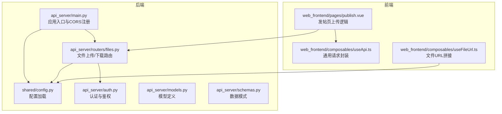
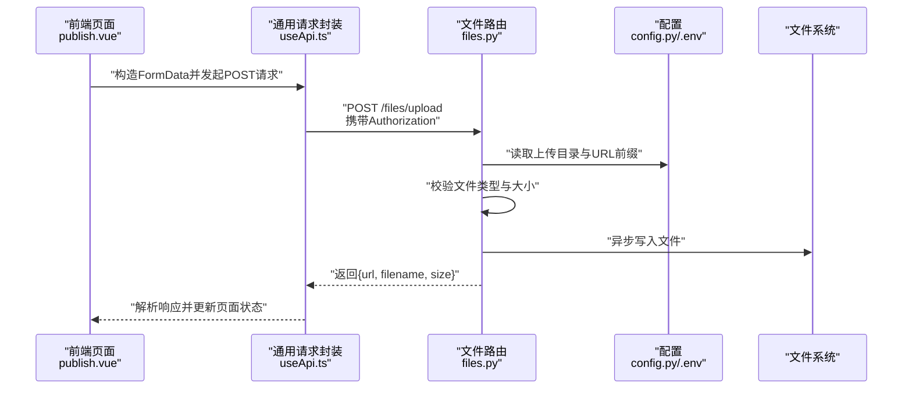
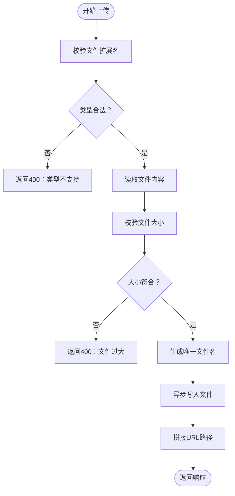
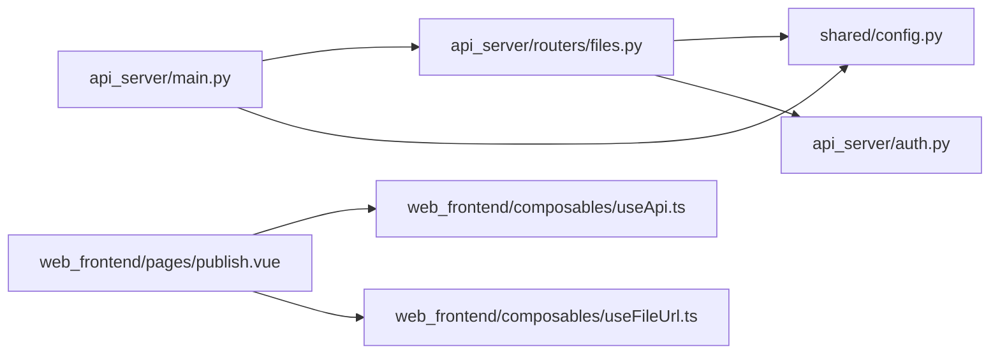

# 文件上传API

<cite>
**本文引用的文件**
- [api_server/routers/files.py](file://api_server/routers/files.py)
- [api_server/main.py](file://api_server/main.py)
- [shared/config.py](file://shared/config.py)
- [.env](file://.env)
- [.env.template](file://.env.template)
- [api_server/auth.py](file://api_server/auth.py)
- [api_server/models.py](file://api_server/models.py)
- [api_server/schemas.py](file://api_server/schemas.py)
- [web_frontend/pages/publish.vue](file://web_frontend/pages/publish.vue)
- [web_frontend/composables/useApi.ts](file://web_frontend/composables/useApi.ts)
- [web_frontend/composables/useFileUrl.ts](file://web_frontend/composables/useFileUrl.ts)
- [requirements.txt](file://requirements.txt)
</cite>

## 目录
1. [简介](#简介)
2. [项目结构](#项目结构)
3. [核心组件](#核心组件)
4. [架构总览](#架构总览)
5. [详细组件分析](#详细组件分析)
6. [依赖关系分析](#依赖关系分析)
7. [性能与扩展性](#性能与扩展性)
8. [故障排查指南](#故障排查指南)
9. [结论](#结论)
10. [附录：API参考与最佳实践](#附录api参考与最佳实践)

## 简介
本文件上传API为AI社区提供图片与头像的上传、存储与访问能力。后端基于FastAPI，采用multipart/form-data格式接收文件，进行类型与大小校验，异步写入本地磁盘，并返回可访问的URL路径。前端通过Vant组件与自定义请求封装完成文件选择、上传与展示。

## 项目结构
- 后端服务入口与路由注册位于应用主文件，文件模块在路由中被统一纳入。
- 文件上传路由集中于文件路由器，负责上传、头像上传与文件下载。
- 配置由共享配置模块提供，支持从环境变量加载。
- 前端页面与组合式函数负责调用后端接口与拼接文件URL。

图表来源
- [api_server/main.py](file://api_server/main.py#L1-L69)
- [api_server/routers/files.py](file://api_server/routers/files.py#L1-L138)
- [shared/config.py](file://shared/config.py#L1-L52)
- [api_server/auth.py](file://api_server/auth.py#L1-L89)
- [web_frontend/pages/publish.vue](file://web_frontend/pages/publish.vue#L1-L182)
- [web_frontend/composables/useApi.ts](file://web_frontend/composables/useApi.ts#L1-L57)
- [web_frontend/composables/useFileUrl.ts](file://web_frontend/composables/useFileUrl.ts#L1-L28)

章节来源
- [api_server/main.py](file://api_server/main.py#L1-L69)
- [api_server/routers/files.py](file://api_server/routers/files.py#L1-L138)
- [shared/config.py](file://shared/config.py#L1-L52)

## 核心组件
- 文件上传路由
  - 支持图片上传与头像上传两个端点，均需登录态。
  - 图片上传：/files/upload；头像上传：/files/upload/avatar。
  - 均返回包含URL、文件名与大小等信息的响应。
- 文件下载路由
  - 图片下载：/files/images/{filename}
  - 头像下载：/files/avatars/{filename}
- 存储策略
  - 本地存储：按配置的上传目录与URL前缀组织文件。
  - 目录结构：images、avatars子目录。
- 安全与鉴权
  - 通过依赖注入获取当前用户，要求Bearer Token。
  - 文件类型白名单与大小限制。
- URL生成
  - 基于配置的URL前缀与子目录生成可访问路径。

章节来源
- [api_server/routers/files.py](file://api_server/routers/files.py#L41-L137)
- [shared/config.py](file://shared/config.py#L26-L28)

## 架构总览
下图展示了从浏览器到后端的典型请求流程，以及后端内部的处理步骤。

图表来源
- [web_frontend/pages/publish.vue](file://web_frontend/pages/publish.vue#L82-L120)
- [web_frontend/composables/useApi.ts](file://web_frontend/composables/useApi.ts#L8-L48)
- [api_server/routers/files.py](file://api_server/routers/files.py#L41-L81)
- [shared/config.py](file://shared/config.py#L26-L28)
- [.env](file://.env#L20-L22)

## 详细组件分析

### 路由与端点定义
- 图片上传
  - 方法：POST
  - 路径：/files/upload
  - 请求体：multipart/form-data，字段名为file
  - 鉴权：需要Bearer Token
  - 响应：包含url、filename、size
- 头像上传
  - 方法：POST
  - 路径：/files/upload/avatar
  - 请求体：multipart/form-data，字段名为file
  - 鉴权：需要Bearer Token
  - 响应：包含url、filename
- 图片下载
  - 方法：GET
  - 路径：/files/images/{filename}
  - 响应：文件流
- 头像下载
  - 方法：GET
  - 路径：/files/avatars/{filename}
  - 响应：文件流

章节来源
- [api_server/routers/files.py](file://api_server/routers/files.py#L41-L137)

### 请求格式与参数
- multipart/form-data
  - 字段名：file
  - 内容类型：二进制文件流
- 鉴权头
  - Authorization: Bearer <token>
- 前端示例
  - 前端使用FormData.append('file', file.file)，并携带Authorization头。

章节来源
- [web_frontend/pages/publish.vue](file://web_frontend/pages/publish.vue#L93-L102)

### 文件处理与存储策略
- 类型与大小校验
  - 支持类型：.jpg、.jpeg、.png、.gif、.webp
  - 图片上传最大：10MB
  - 头像上传最大：2MB
- 目录结构
  - 顶层目录：由配置决定
  - 子目录：images、avatars
- 文件命名
  - 图片：日期前缀+UUID片段+原扩展名
  - 头像：avatar_{用户ID}_随机片段+扩展名
- 写入方式
  - 异步文件写入，避免阻塞

图表来源
- [api_server/routers/files.py](file://api_server/routers/files.py#L41-L81)

章节来源
- [api_server/routers/files.py](file://api_server/routers/files.py#L17-L19)
- [api_server/routers/files.py](file://api_server/routers/files.py#L33-L38)
- [api_server/routers/files.py](file://api_server/routers/files.py#L41-L81)

### URL生成与访问控制
- URL组成
  - 基于配置的URL前缀与子目录生成
  - 示例：{upload_url_prefix}/images/{filename}
- 访问控制
  - 上传端点需要登录态
  - 下载端点为公开访问（无鉴权），但仅限已上传文件
- 前端URL拼接
  - useFileUrl会根据路径前缀自动拼接完整URL

章节来源
- [api_server/routers/files.py](file://api_server/routers/files.py#L74-L75)
- [api_server/routers/files.py](file://api_server/routers/files.py#L122-L137)
- [web_frontend/composables/useFileUrl.ts](file://web_frontend/composables/useFileUrl.ts#L5-L24)

### 错误处理与异常
- 常见错误
  - 400：文件类型不支持或文件过大
  - 404：下载时文件不存在
  - 401：鉴权失败或未提供有效Token
- 前端错误提示
  - 统一通过useApi封装的错误处理抛出友好提示

章节来源
- [api_server/routers/files.py](file://api_server/routers/files.py#L52-L65)
- [api_server/routers/files.py](file://api_server/routers/files.py#L126-L127)
- [api_server/auth.py](file://api_server/auth.py#L63-L74)
- [web_frontend/composables/useApi.ts](file://web_frontend/composables/useApi.ts#L37-L40)

### 扩展与集成建议
- 云存储集成
  - 可替换文件写入逻辑以对接对象存储（如S3、OSS）
  - 保持URL前缀与目录结构不变，便于迁移
- 多媒体处理
  - 可在写入后增加缩略图生成、压缩等处理
  - 建议引入图像处理库（如Pillow）并异步执行
- 批量上传与进度跟踪
  - 前端可逐个文件循环上传
  - 进度可通过FormData与XMLHttpRequest的progress事件实现（前端自行扩展）

章节来源
- [requirements.txt](file://requirements.txt#L28-L28)

## 依赖关系分析
- 应用入口依赖路由模块与配置模块
- 文件路由依赖配置、认证与模型
- 前端页面依赖通用请求封装与URL拼接工具

图表来源
- [api_server/main.py](file://api_server/main.py#L11-L42)
- [api_server/routers/files.py](file://api_server/routers/files.py#L1-L15)
- [shared/config.py](file://shared/config.py#L1-L52)
- [api_server/auth.py](file://api_server/auth.py#L1-L18)
- [web_frontend/pages/publish.vue](file://web_frontend/pages/publish.vue#L64-L66)
- [web_frontend/composables/useApi.ts](file://web_frontend/composables/useApi.ts#L3-L6)
- [web_frontend/composables/useFileUrl.ts](file://web_frontend/composables/useFileUrl.ts#L3-L4)

章节来源
- [api_server/main.py](file://api_server/main.py#L11-L42)
- [api_server/routers/files.py](file://api_server/routers/files.py#L1-L15)
- [shared/config.py](file://shared/config.py#L1-L52)
- [api_server/auth.py](file://api_server/auth.py#L1-L18)
- [web_frontend/pages/publish.vue](file://web_frontend/pages/publish.vue#L64-L66)
- [web_frontend/composables/useApi.ts](file://web_frontend/composables/useApi.ts#L3-L6)
- [web_frontend/composables/useFileUrl.ts](file://web_frontend/composables/useFileUrl.ts#L3-L4)

## 性能与扩展性
- 异步写入
  - 使用异步文件写入避免阻塞请求线程
- 并发与资源
  - 上传端点为IO密集型，建议配合反向代理与并发配置优化吞吐
- 存储扩展
  - 本地存储适合开发与小规模场景；生产建议迁移到对象存储并启用CDN
- 缓存与CDN
  - 下载端点可结合CDN缓存静态资源，降低服务器压力

[本节为通用指导，无需列出章节来源]

## 故障排查指南
- 上传失败（400）
  - 检查文件类型是否在允许列表内
  - 检查文件大小是否超过限制
- 下载失败（404）
  - 确认文件名正确且文件存在于对应目录
- 鉴权失败（401）
  - 确认Authorization头是否携带有效Token
- URL无法访问
  - 检查配置中的上传目录与URL前缀是否一致
  - 确认静态文件服务已正确映射

章节来源
- [api_server/routers/files.py](file://api_server/routers/files.py#L52-L65)
- [api_server/routers/files.py](file://api_server/routers/files.py#L126-L127)
- [api_server/auth.py](file://api_server/auth.py#L63-L74)
- [shared/config.py](file://shared/config.py#L26-L28)
- [.env](file://.env#L20-L22)

## 结论
该文件上传API提供了简洁可靠的图片与头像上传能力，具备基础的安全校验与清晰的URL生成机制。通过配置化与模块化设计，易于扩展至云存储与多媒体处理场景。前端集成简单，可快速落地到实际业务中。

[本节为总结性内容，无需列出章节来源]

## 附录：API参考与最佳实践

### API参考
- 图片上传
  - 方法：POST
  - 路径：/files/upload
  - 请求头：Authorization: Bearer <token>
  - 请求体：multipart/form-data，字段名：file
  - 成功响应：包含url、filename、size
- 头像上传
  - 方法：POST
  - 路径：/files/upload/avatar
  - 请求头：Authorization: Bearer <token>
  - 请求体：multipart/form-data，字段名：file
  - 成功响应：包含url、filename
- 图片下载
  - 方法：GET
  - 路径：/files/images/{filename}
- 头像下载
  - 方法：GET
  - 路径：/files/avatars/{filename}

章节来源
- [api_server/routers/files.py](file://api_server/routers/files.py#L41-L137)

### 配置项
- 上传目录：UPLOAD_DIR
- URL前缀：UPLOAD_URL_PREFIX
- 前端地址：FRONTEND_URL
- JWT密钥与算法：JWT_SECRET_KEY、JWT_ALGORITHM
- 服务器监听：API_HOST、API_PORT

章节来源
- [.env](file://.env#L20-L22)
- [.env](file://.env#L17-L18)
- [.env](file://.env#L8-L11)
- [.env](file://.env#L13-L15)
- [shared/config.py](file://shared/config.py#L26-L28)
- [shared/config.py](file://shared/config.py#L23-L24)
- [shared/config.py](file://shared/config.py#L14-L17)
- [shared/config.py](file://shared/config.py#L20-L21)

### 最佳实践
- 前端
  - 使用FormData传递文件，携带Authorization头
  - 在上传期间禁用提交按钮，避免重复提交
  - 对上传进度与错误进行友好提示
- 后端
  - 严格校验文件类型与大小
  - 使用异步写入提升并发性能
  - 保持URL前缀与目录结构稳定，便于迁移
- 安全
  - 仅对上传端点进行鉴权
  - 下载端点为公开访问，注意文件命名与目录隔离
- 扩展
  - 引入对象存储与CDN
  - 增加缩略图与压缩处理
  - 支持批量上传与断点续传（前端与后端协同）

章节来源
- [web_frontend/pages/publish.vue](file://web_frontend/pages/publish.vue#L82-L120)
- [web_frontend/composables/useApi.ts](file://web_frontend/composables/useApi.ts#L8-L48)
- [api_server/routers/files.py](file://api_server/routers/files.py#L41-L81)
- [requirements.txt](file://requirements.txt#L28-L28)