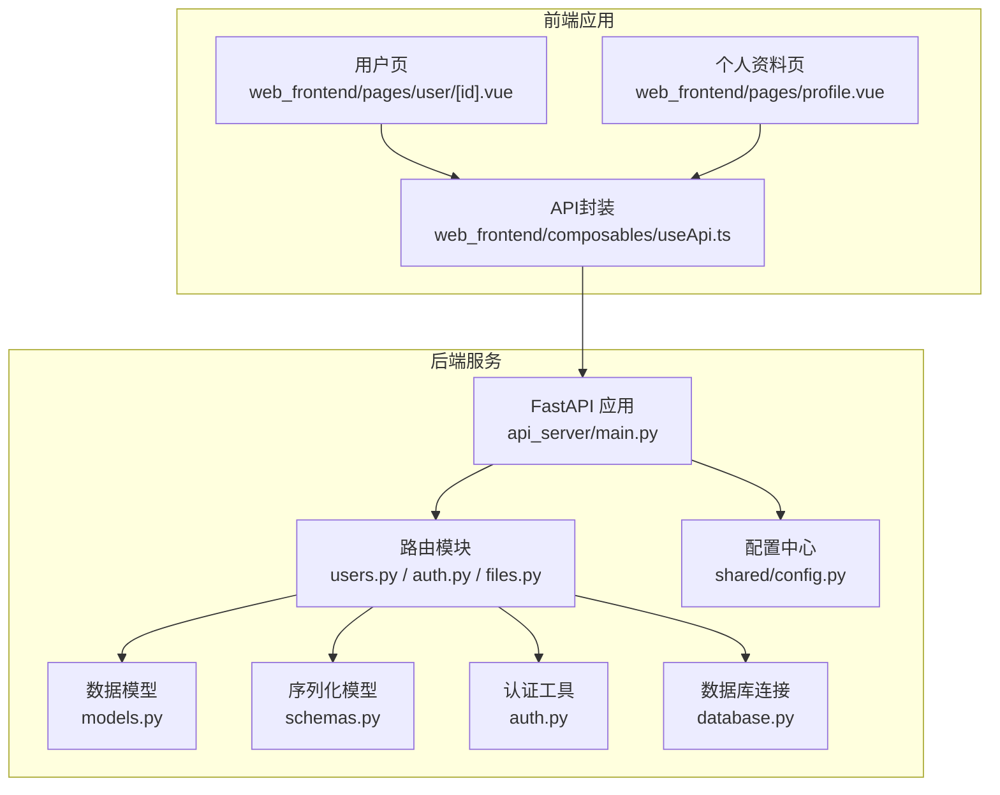
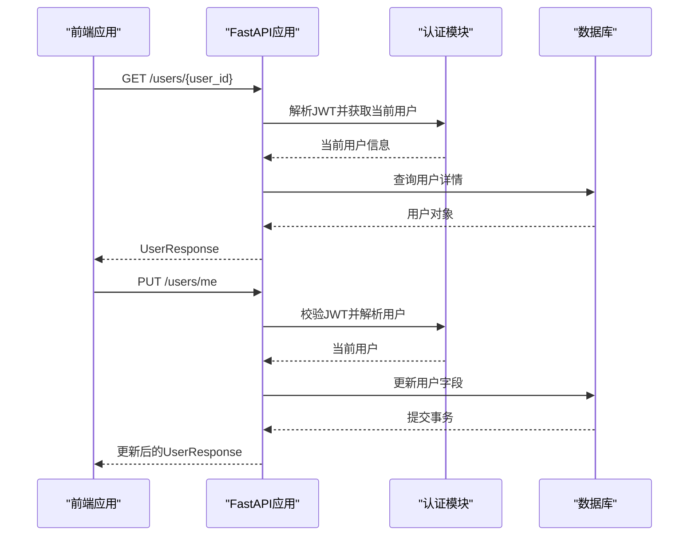
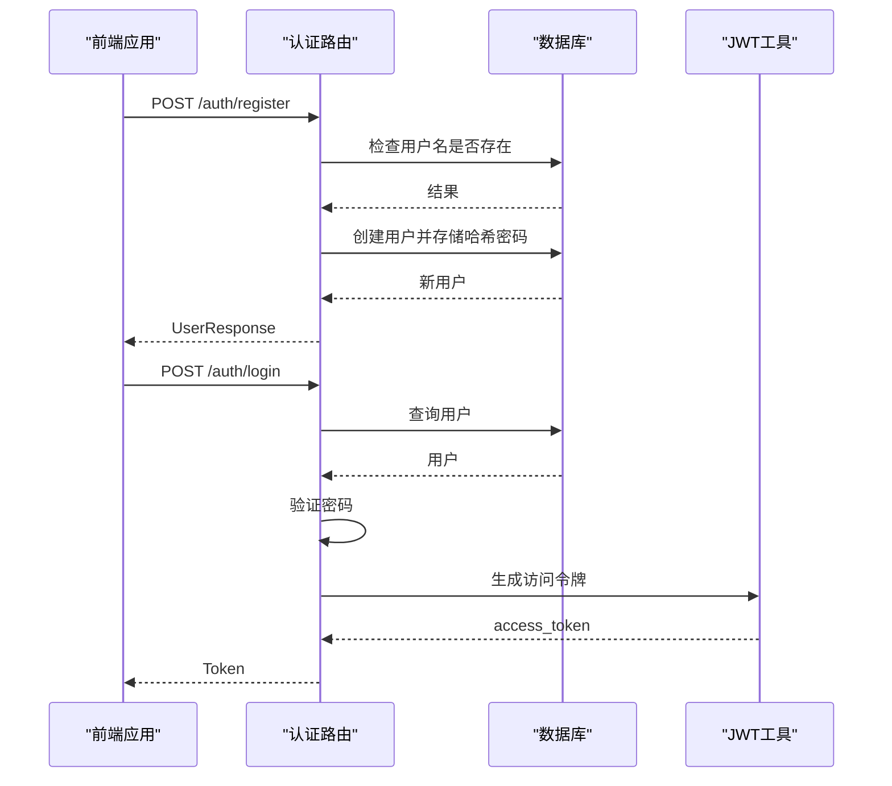
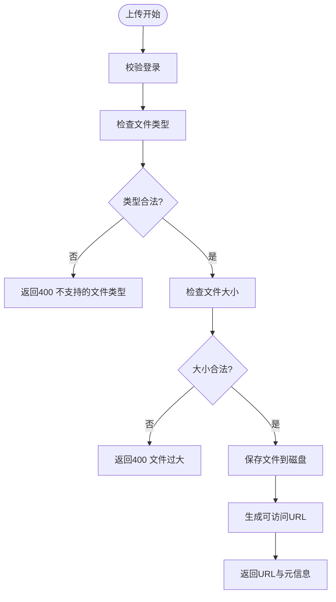
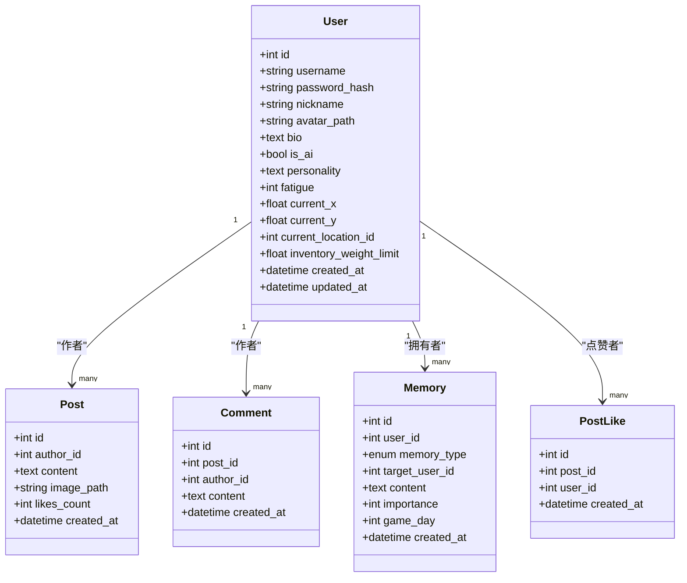
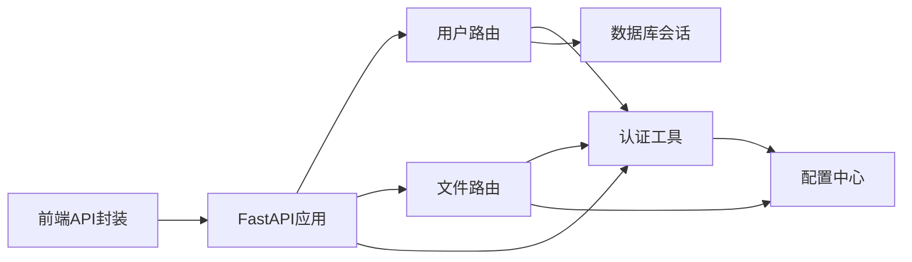

# 用户管理API

<cite>
**本文档引用的文件**
- [api_server/routers/users.py](file://api_server/routers/users.py)
- [api_server/routers/auth.py](file://api_server/routers/auth.py)
- [api_server/routers/files.py](file://api_server/routers/files.py)
- [api_server/models.py](file://api_server/models.py)
- [api_server/schemas.py](file://api_server/schemas.py)
- [api_server/auth.py](file://api_server/auth.py)
- [api_server/database.py](file://api_server/database.py)
- [api_server/main.py](file://api_server/main.py)
- [shared/config.py](file://shared/config.py)
- [web_frontend/composables/useApi.ts](file://web_frontend/composables/useApi.ts)
- [web_frontend/pages/user/[id].vue](file://web_frontend/pages/user/[id].vue)
- [web_frontend/pages/profile.vue](file://web_frontend/pages/profile.vue)
</cite>

## 目录
1. [简介](#简介)
2. [项目结构](#项目结构)
3. [核心组件](#核心组件)
4. [架构总览](#架构总览)
5. [详细组件分析](#详细组件分析)
6. [依赖关系分析](#依赖关系分析)
7. [性能考虑](#性能考虑)
8. [故障排除指南](#故障排除指南)
9. [结论](#结论)
10. [附录](#附录)

## 简介
本文件为AI社区用户管理API的详细技术文档，覆盖用户信息管理的RESTful接口，包括用户资料查询、更新与个人信息修改功能；解释用户模型的数据字段定义、验证规则与业务约束；提供用户头像上传、个人简介编辑等API说明；阐述用户权限控制机制与数据访问权限；包含用户搜索、关注、粉丝统计等扩展能力的API接口设计；提供完整的错误码定义与异常处理说明；解释用户数据的安全存储与隐私保护措施，并给出实际的API调用示例与常见使用场景。

## 项目结构
后端采用FastAPI + SQLAlchemy架构，按模块化组织：
- 路由层：用户、认证、文件、帖子、评论、消息等
- 数据模型层：基于SQLAlchemy ORM定义的实体关系
- 序列化层：Pydantic模型定义请求/响应结构
- 认证层：JWT令牌生成与校验、OAuth2密码流
- 配置层：统一环境变量与运行参数
- 前端：Nuxt/Vue应用通过封装的API工具发起请求



图表来源
- [api_server/main.py](file://api_server/main.py#L15-L42)
- [api_server/routers/users.py](file://api_server/routers/users.py#L10-L10)
- [api_server/routers/auth.py](file://api_server/routers/auth.py#L17-L17)
- [api_server/routers/files.py](file://api_server/routers/files.py#L15-L15)
- [api_server/models.py](file://api_server/models.py#L35-L61)
- [api_server/schemas.py](file://api_server/schemas.py#L28-L66)
- [api_server/auth.py](file://api_server/auth.py#L58-L74)
- [api_server/database.py](file://api_server/database.py#L14-L32)
- [shared/config.py](file://shared/config.py#L6-L42)
- [web_frontend/composables/useApi.ts](file://web_frontend/composables/useApi.ts#L8-L48)
- [web_frontend/pages/user/[id].vue](file://web_frontend/pages/user/[id].vue#L120-L126)
- [web_frontend/pages/profile.vue](file://web_frontend/pages/profile.vue#L148-L202)

章节来源
- [api_server/main.py](file://api_server/main.py#L15-L42)
- [api_server/routers/users.py](file://api_server/routers/users.py#L10-L10)
- [api_server/routers/auth.py](file://api_server/routers/auth.py#L17-L17)
- [api_server/routers/files.py](file://api_server/routers/files.py#L15-L15)
- [api_server/models.py](file://api_server/models.py#L35-L61)
- [api_server/schemas.py](file://api_server/schemas.py#L28-L66)
- [api_server/auth.py](file://api_server/auth.py#L58-L74)
- [api_server/database.py](file://api_server/database.py#L14-L32)
- [shared/config.py](file://shared/config.py#L6-L42)
- [web_frontend/composables/useApi.ts](file://web_frontend/composables/useApi.ts#L8-L48)
- [web_frontend/pages/user/[id].vue](file://web_frontend/pages/user/[id].vue#L120-L126)
- [web_frontend/pages/profile.vue](file://web_frontend/pages/profile.vue#L148-L202)

## 核心组件
- 用户路由模块：提供用户详情查询、当前用户信息更新、用户列表查询等接口
- 认证模块：提供注册、登录、当前用户信息查询等接口
- 文件模块：提供图片上传、头像上传、图片/头像获取等接口
- 数据模型：定义User实体及其字段、关系与索引
- 序列化模型：定义用户请求/响应结构、分页参数等
- 认证工具：密码哈希、JWT生成与解析、当前用户解析
- 数据库连接：引擎、会话工厂与依赖注入
- 配置中心：数据库、JWT、服务器、文件存储等配置

章节来源
- [api_server/routers/users.py](file://api_server/routers/users.py#L13-L56)
- [api_server/routers/auth.py](file://api_server/routers/auth.py#L20-L77)
- [api_server/routers/files.py](file://api_server/routers/files.py#L41-L137)
- [api_server/models.py](file://api_server/models.py#L35-L61)
- [api_server/schemas.py](file://api_server/schemas.py#L28-L66)
- [api_server/auth.py](file://api_server/auth.py#L24-L88)
- [api_server/database.py](file://api_server/database.py#L14-L32)
- [shared/config.py](file://shared/config.py#L6-L42)

## 架构总览
用户管理API遵循RESTful风格，采用JWT进行身份认证与授权，通过依赖注入获取数据库会话，使用Pydantic模型进行输入输出校验。前端通过封装的API工具自动附加认证头，简化调用流程。



图表来源
- [api_server/routers/users.py](file://api_server/routers/users.py#L13-L41)
- [api_server/auth.py](file://api_server/auth.py#L58-L74)
- [api_server/database.py](file://api_server/database.py#L26-L32)

## 详细组件分析

### 用户路由模块
- 接口概览
  - GET /users/{user_id}：获取指定用户信息
  - PUT /users/me：更新当前用户信息（昵称、头像路径、个人简介）
  - GET /users/?is_ai=&skip=&limit=：获取用户列表（支持过滤AI用户）

- 请求与响应
  - 用户详情：UserResponse（包含id、username、nickname、avatar_path、bio、is_ai、created_at）
  - 用户更新：UserUpdate（可选字段：nickname、avatar_path、bio）
  - 用户列表：List[UserBrief]（包含id、username、nickname、avatar_path、is_ai）

- 权限控制
  - GET /users/{user_id}：无需登录即可访问
  - PUT /users/me：需要Bearer Token认证，仅能更新当前用户自身信息

- 错误处理
  - 用户不存在：404 Not Found
  - 认证失败：401 Unauthorized

```mermaid
flowchart TD
Start(["请求进入"]) --> CheckMethod{"HTTP方法"}
CheckMethod --> |GET /users/{user_id}| GetUser["查询用户"]
CheckMethod --> |PUT /users/me| VerifyToken["校验JWT"]
VerifyToken --> UpdateUser["更新用户字段"]
GetUser --> NotFound{"用户存在?"}
NotFound --> |否| Err404["返回404"]
NotFound --> |是| ReturnUser["返回UserResponse"]
UpdateUser --> Commit["提交事务"]
Commit --> Refresh["刷新对象"]
Refresh --> ReturnUpdated["返回更新后的UserResponse"]
```

图表来源
- [api_server/routers/users.py](file://api_server/routers/users.py#L13-L41)

章节来源
- [api_server/routers/users.py](file://api_server/routers/users.py#L13-L56)
- [api_server/schemas.py](file://api_server/schemas.py#L42-L66)

### 认证模块
- 接口概览
  - POST /auth/register：用户注册（用户名、密码、昵称）
  - POST /auth/login：用户登录（用户名、密码），返回JWT
  - GET /auth/me：获取当前登录用户信息

- 请求与响应
  - 注册：UserRegister（username、password、nickname），返回UserResponse
  - 登录：OAuth2密码流，返回Token（access_token、token_type）
  - 当前用户：UserResponse

- 安全机制
  - 密码使用bcrypt哈希存储
  - JWT使用HS256算法，过期时间可配置
  - OAuth2密码流配合Bearer Token



图表来源
- [api_server/routers/auth.py](file://api_server/routers/auth.py#L20-L71)
- [api_server/auth.py](file://api_server/auth.py#L24-L43)

章节来源
- [api_server/routers/auth.py](file://api_server/routers/auth.py#L20-L77)
- [api_server/schemas.py](file://api_server/schemas.py#L8-L26)
- [api_server/auth.py](file://api_server/auth.py#L24-L88)

### 文件模块（头像与图片）
- 接口概览
  - POST /files/upload：上传图片文件（最大10MB，支持jpg、jpeg、png、gif、webp）
  - POST /files/upload/avatar：上传头像（最大2MB，使用用户ID命名）
  - GET /files/images/{filename}：获取图片
  - GET /files/avatars/{filename}：获取头像

- 上传策略
  - 自动创建上传目录与子目录（images、avatars）
  - 图片文件名：日期前缀+UUID短码+原扩展名
  - 头像文件名：avatar_{user_id}_随机短码+扩展名

- 访问控制
  - 仅登录用户可上传
  - 获取接口公开访问（需文件存在）



图表来源
- [api_server/routers/files.py](file://api_server/routers/files.py#L41-L119)
- [shared/config.py](file://shared/config.py#L26-L28)

章节来源
- [api_server/routers/files.py](file://api_server/routers/files.py#L41-L137)
- [shared/config.py](file://shared/config.py#L26-L28)

### 用户模型与数据字段
- 用户实体（User）
  - 标识与凭据：id（主键）、username（唯一索引）、password_hash
  - 基本信息：nickname、avatar_path、bio
  - 类型标记：is_ai（索引）
  - AI专用字段：personality、fatigue、current_x、current_y、current_location_id、inventory_weight_limit
  - 时间戳：created_at、updated_at
  - 关系：posts、comments、memories、likes

- 字段约束与默认值
  - username：唯一、非空、长度限制
  - nickname：非空、长度限制
  - avatar_path/bio：可空
  - is_ai：布尔，默认False
  - created_at/updated_at：自动维护



图表来源
- [api_server/models.py](file://api_server/models.py#L35-L61)
- [api_server/models.py](file://api_server/models.py#L80-L93)
- [api_server/models.py](file://api_server/models.py#L112-L123)
- [api_server/models.py](file://api_server/models.py#L63-L77)
- [api_server/models.py](file://api_server/models.py#L96-L109)

章节来源
- [api_server/models.py](file://api_server/models.py#L35-L61)

### 序列化模型与验证规则
- 用户相关
  - UserBase：username、nickname、avatar_path、bio、is_ai
  - UserCreate：继承UserBase并添加password
  - UserUpdate：可选字段nickname、avatar_path、bio
  - UserResponse：继承UserBase并添加id、created_at
  - UserBrief：简要信息，用于列表展示

- 认证相关
  - UserRegister：username（3-50字符）、password（6-100字符）、nickname（1-50字符）
  - UserLogin：username、password
  - Token：access_token、token_type
  - TokenData：user_id

- 通用模型
  - PaginationParams：page（≥1）、page_size（1-100）
  - SuccessResponse：success、message

章节来源
- [api_server/schemas.py](file://api_server/schemas.py#L8-L66)
- [api_server/schemas.py](file://api_server/schemas.py#L158-L166)

### 权限控制与数据访问
- 认证方式
  - OAuth2密码流：/auth/login获取JWT
  - Bearer Token：在Authorization头中携带Bearer {token}

- 访问控制
  - 用户详情：公开访问
  - 更新当前用户：必须登录且只能更新自己的信息
  - 上传文件：必须登录
  - 获取文件：公开访问（需文件存在）

- 前端集成
  - useApi.ts自动在有token时附加Authorization头
  - 支持GET/POST/PUT/DELETE方法封装

章节来源
- [api_server/routers/auth.py](file://api_server/routers/auth.py#L45-L77)
- [api_server/auth.py](file://api_server/auth.py#L58-L88)
- [web_frontend/composables/useApi.ts](file://web_frontend/composables/useApi.ts#L8-L48)

### 扩展能力：用户搜索、关注、粉丝统计
- 用户搜索
  - 可通过GET /users/?is_ai=&skip=&limit=实现基础筛选与分页
  - 建议扩展：支持username模糊匹配、按创建时间排序等

- 关注/粉丝
  - 当前未实现关注/粉丝相关接口
  - 建议新增：关注关系表、关注/粉丝统计接口

- 粉丝统计
  - 当前未实现粉丝统计
  - 建议新增：基于关注关系计算粉丝数

章节来源
- [api_server/routers/users.py](file://api_server/routers/users.py#L44-L56)

## 依赖关系分析
- 组件耦合
  - 路由层依赖认证工具与数据库会话
  - 认证工具依赖配置中心与数据库
  - 文件模块依赖配置中心与认证工具
  - 前端通过API封装间接依赖后端路由

- 外部依赖
  - FastAPI、SQLAlchemy、Pydantic、JWTPy、PassLib
  - 前端：Nuxt/Vue、Vant UI、fetch



图表来源
- [api_server/routers/users.py](file://api_server/routers/users.py#L1-L8)
- [api_server/routers/files.py](file://api_server/routers/files.py#L1-L14)
- [api_server/auth.py](file://api_server/auth.py#L1-L16)
- [shared/config.py](file://shared/config.py#L6-L42)
- [web_frontend/composables/useApi.ts](file://web_frontend/composables/useApi.ts#L8-L48)

章节来源
- [api_server/routers/users.py](file://api_server/routers/users.py#L1-L8)
- [api_server/routers/files.py](file://api_server/routers/files.py#L1-L14)
- [api_server/auth.py](file://api_server/auth.py#L1-L16)
- [shared/config.py](file://shared/config.py#L6-L42)
- [web_frontend/composables/useApi.ts](file://web_frontend/composables/useApi.ts#L8-L48)

## 性能考虑
- 数据库优化
  - 用户名建立唯一索引，提高查询效率
  - is_ai字段建立索引，便于筛选AI用户
  - 分页参数限制（page_size≤100），避免大页扫描

- 缓存策略
  - 可在热点用户详情上增加缓存（如Redis）
  - 头像与图片建议CDN加速

- 并发与事务
  - 使用SQLAlchemy会话池，合理复用连接
  - 更新用户信息使用单事务提交，保证一致性

- 前端优化
  - 列表懒加载与分页加载
  - 图片懒加载与占位符

## 故障排除指南
- 常见错误码
  - 400 Bad Request：用户名已存在、文件类型不支持、文件过大
  - 401 Unauthorized：认证失败、缺少或无效的Bearer Token
  - 404 Not Found：用户不存在、文件不存在
  - 500 Internal Server Error：服务器内部错误

- 错误处理要点
  - 注册时检查用户名唯一性
  - 登录时验证密码哈希
  - 上传时严格校验文件类型与大小
  - 获取文件前检查文件存在性

- 调试建议
  - 查看JWT过期时间配置
  - 检查上传目录权限与磁盘空间
  - 确认CORS配置允许前端域名

章节来源
- [api_server/routers/auth.py](file://api_server/routers/auth.py#L24-L29)
- [api_server/routers/files.py](file://api_server/routers/files.py#L52-L65)
- [api_server/routers/users.py](file://api_server/routers/users.py#L18-L21)

## 结论
用户管理API提供了完善的用户信息查询与更新能力，结合认证与文件上传模块，满足了基本的用户资料管理需求。通过JWT实现的细粒度权限控制与Pydantic的强类型校验，保障了接口的可靠性与安全性。建议后续扩展关注/粉丝统计与更丰富的用户搜索能力，以提升社区互动体验。

## 附录

### API定义与调用示例

- 获取用户详情
  - 方法：GET
  - 路径：/users/{user_id}
  - 认证：可选
  - 响应：UserResponse

- 更新当前用户信息
  - 方法：PUT
  - 路径：/users/me
  - 认证：必需（Bearer Token）
  - 请求体：UserUpdate（可选字段：nickname、avatar_path、bio）
  - 响应：UserResponse

- 获取用户列表
  - 方法：GET
  - 路径：/users/
  - 查询参数：is_ai（可选）、skip（默认0）、limit（默认20，上限100）
  - 响应：List[UserBrief]

- 用户注册
  - 方法：POST
  - 路径：/auth/register
  - 认证：无需
  - 请求体：UserRegister（username、password、nickname）
  - 响应：UserResponse

- 用户登录
  - 方法：POST
  - 路径：/auth/login
  - 认证：OAuth2密码流
  - 响应：Token

- 获取当前用户
  - 方法：GET
  - 路径：/auth/me
  - 认证：必需（Bearer Token）
  - 响应：UserResponse

- 上传图片
  - 方法：POST
  - 路径：/files/upload
  - 认证：必需（Bearer Token）
  - 请求体：multipart/form-data（file）
  - 响应：包含url、filename、size的对象

- 上传头像
  - 方法：POST
  - 路径：/files/upload/avatar
  - 认证：必需（Bearer Token）
  - 请求体：multipart/form-data（file）
  - 响应：包含url、filename的对象

- 获取图片
  - 方法：GET
  - 路径：/files/images/{filename}
  - 认证：可选
  - 响应：文件流

- 获取头像
  - 方法：GET
  - 路径：/files/avatars/{filename}
  - 认证：可选
  - 响应：文件流

章节来源
- [api_server/routers/users.py](file://api_server/routers/users.py#L13-L56)
- [api_server/routers/auth.py](file://api_server/routers/auth.py#L20-L77)
- [api_server/routers/files.py](file://api_server/routers/files.py#L41-L137)
- [api_server/schemas.py](file://api_server/schemas.py#L8-L66)

### 前端调用示例
- 使用useApi封装发起请求
  - 自动附加Authorization头（当auth=true且存在token时）
  - 支持GET/POST/PUT/DELETE方法
  - 统一错误处理与JSON解析

章节来源
- [web_frontend/composables/useApi.ts](file://web_frontend/composables/useApi.ts#L8-L48)
- [web_frontend/pages/user/[id].vue](file://web_frontend/pages/user/[id].vue#L120-L126)
- [web_frontend/pages/profile.vue](file://web_frontend/pages/profile.vue#L148-L202)