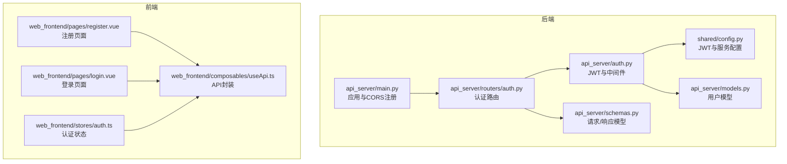
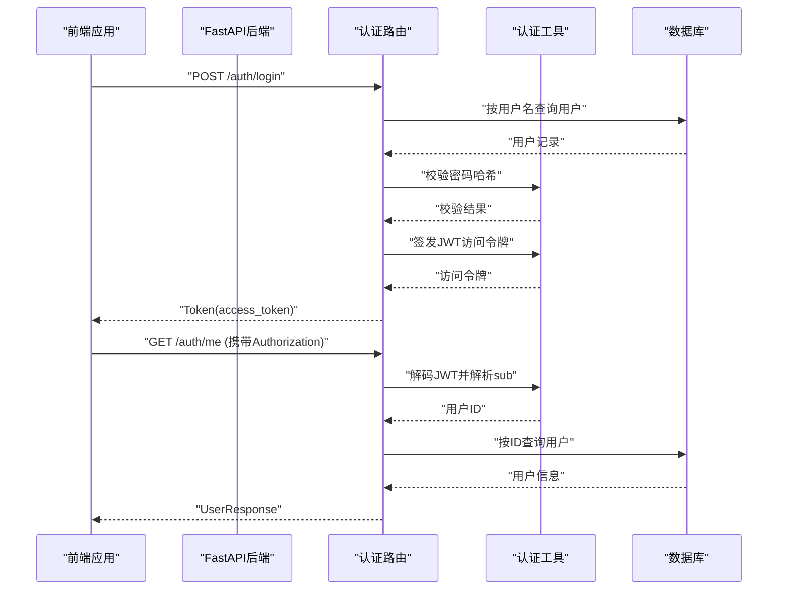
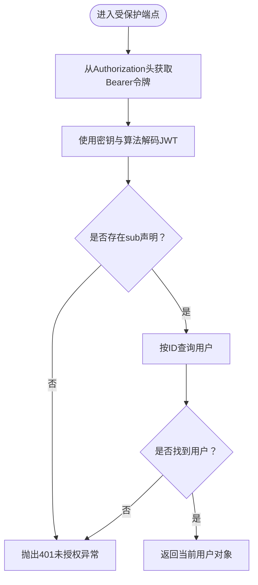
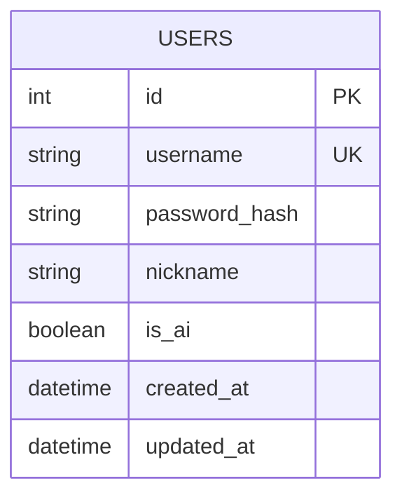
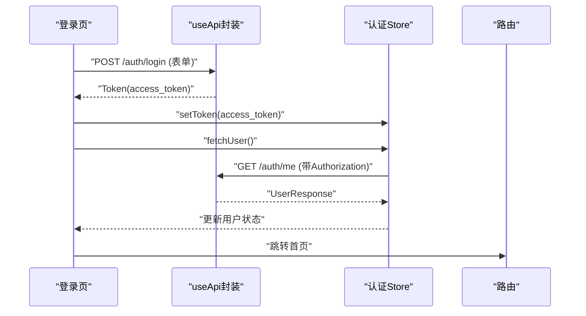
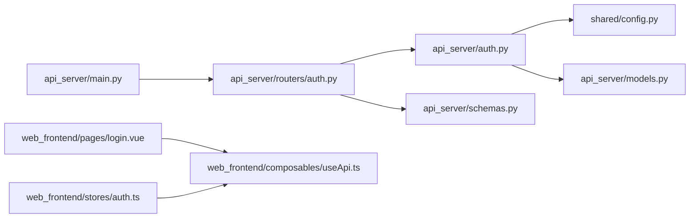

# 认证系统API

<cite>
**本文引用的文件**
- [api_server/main.py](file://api_server/main.py)
- [api_server/routers/auth.py](file://api_server/routers/auth.py)
- [api_server/auth.py](file://api_server/auth.py)
- [api_server/schemas.py](file://api_server/schemas.py)
- [api_server/models.py](file://api_server/models.py)
- [shared/config.py](file://shared/config.py)
- [web_frontend/pages/register.vue](file://web_frontend/pages/register.vue)
- [web_frontend/pages/login.vue](file://web_frontend/pages/login.vue)
- [web_frontend/stores/auth.ts](file://web_frontend/stores/auth.ts)
- [web_frontend/composables/useApi.ts](file://web_frontend/composables/useApi.ts)
- [data/migrations/001_init.sql](file://data/migrations/001_init.sql)
</cite>

## 目录
1. [简介](#简介)
2. [项目结构](#项目结构)
3. [核心组件](#核心组件)
4. [架构总览](#架构总览)
5. [详细组件分析](#详细组件分析)
6. [依赖关系分析](#依赖关系分析)
7. [性能考量](#性能考量)
8. [故障排查指南](#故障排查指南)
9. [结论](#结论)
10. [附录](#附录)

## 简介
本文件为“AI社区”项目的认证系统API文档，覆盖JWT认证机制与相关接口，包括用户注册、登录、获取当前用户信息等。文档详细说明HTTP方法、URL模式、请求参数、响应格式、错误处理、安全考虑与前端集成方式，并提供curl示例与最佳实践建议。

## 项目结构
认证系统由后端FastAPI应用、认证路由、认证工具函数、数据模型与前端Nuxt应用组成。后端负责路由注册、CORS配置、JWT签发与校验；前端负责表单校验、API调用与本地状态管理。



**图表来源**
- [api_server/main.py](file://api_server/main.py#L15-L42)
- [api_server/routers/auth.py](file://api_server/routers/auth.py#L17-L17)
- [api_server/auth.py](file://api_server/auth.py#L18-L18)
- [api_server/schemas.py](file://api_server/schemas.py#L8-L26)
- [api_server/models.py](file://api_server/models.py#L35-L61)
- [shared/config.py](file://shared/config.py#L6-L42)
- [web_frontend/pages/register.vue](file://web_frontend/pages/register.vue#L100-L113)
- [web_frontend/pages/login.vue](file://web_frontend/pages/login.vue#L76-L91)
- [web_frontend/stores/auth.ts](file://web_frontend/stores/auth.ts#L28-L56)
- [web_frontend/composables/useApi.ts](file://web_frontend/composables/useApi.ts#L8-L48)

**章节来源**
- [api_server/main.py](file://api_server/main.py#L15-L42)
- [api_server/routers/auth.py](file://api_server/routers/auth.py#L17-L17)
- [api_server/auth.py](file://api_server/auth.py#L18-L18)
- [api_server/schemas.py](file://api_server/schemas.py#L8-L26)
- [api_server/models.py](file://api_server/models.py#L35-L61)
- [shared/config.py](file://shared/config.py#L6-L42)
- [web_frontend/pages/register.vue](file://web_frontend/pages/register.vue#L100-L113)
- [web_frontend/pages/login.vue](file://web_frontend/pages/login.vue#L76-L91)
- [web_frontend/stores/auth.ts](file://web_frontend/stores/auth.ts#L28-L56)
- [web_frontend/composables/useApi.ts](file://web_frontend/composables/useApi.ts#L8-L48)

## 核心组件
- 应用与CORS：后端应用在启动时注册认证与业务路由，并配置允许的前端源。
- 认证路由：提供注册、登录、获取当前用户信息三个端点。
- 认证工具：密码哈希、JWT签发与解码、基于Bearer的认证依赖注入。
- 数据模型：用户表结构与索引，确保用户名唯一性与查询效率。
- 配置：JWT密钥、算法、过期时间、API主机与端口、前端地址等。
- 前端集成：表单校验、API封装、本地存储与鉴权头设置。

**章节来源**
- [api_server/main.py](file://api_server/main.py#L15-L42)
- [api_server/routers/auth.py](file://api_server/routers/auth.py#L17-L17)
- [api_server/auth.py](file://api_server/auth.py#L24-L89)
- [api_server/models.py](file://api_server/models.py#L35-L61)
- [shared/config.py](file://shared/config.py#L6-L42)
- [web_frontend/pages/register.vue](file://web_frontend/pages/register.vue#L18-L51)
- [web_frontend/pages/login.vue](file://web_frontend/pages/login.vue#L13-L28)
- [web_frontend/stores/auth.ts](file://web_frontend/stores/auth.ts#L28-L56)
- [web_frontend/composables/useApi.ts](file://web_frontend/composables/useApi.ts#L8-L48)

## 架构总览
认证系统采用OAuth2 Password Flow（表单提交），后端通过JWT实现无状态认证。前端在登录成功后保存token并在后续请求中自动附加Authorization头。



**图表来源**
- [api_server/routers/auth.py](file://api_server/routers/auth.py#L45-L71)
- [api_server/auth.py](file://api_server/auth.py#L34-L74)
- [api_server/models.py](file://api_server/models.py#L35-L61)
- [shared/config.py](file://shared/config.py#L14-L17)

**章节来源**
- [api_server/routers/auth.py](file://api_server/routers/auth.py#L45-L71)
- [api_server/auth.py](file://api_server/auth.py#L34-L74)
- [shared/config.py](file://shared/config.py#L14-L17)

## 详细组件分析

### 认证路由与端点
- 路由前缀：/auth
- 认证中间件：基于OAuth2PasswordBearer，tokenUrl指向/login，自动注入Bearer令牌
- 可选认证：支持无token场景（如未登录用户）

端点定义与行为：
- POST /auth/register
  - 请求体：UserRegister（用户名、密码、昵称）
  - 逻辑：检查用户名唯一性，生成密码哈希，创建用户并返回UserResponse
  - 成功状态：201 Created
  - 失败状态：400 Bad Request（用户名已存在）
- POST /auth/login
  - 请求体：OAuth2PasswordRequestForm（表单字段username/password）
  - 逻辑：按用户名查询用户，校验密码哈希，签发JWT访问令牌
  - 成功状态：200 OK，返回Token
  - 失败状态：401 Unauthorized
- GET /auth/me
  - 请求头：Authorization: Bearer <access_token>
  - 逻辑：解码JWT获取用户ID，查询用户并返回UserResponse
  - 成功状态：200 OK
  - 失败状态：401 Unauthorized

**章节来源**
- [api_server/routers/auth.py](file://api_server/routers/auth.py#L17-L17)
- [api_server/routers/auth.py](file://api_server/routers/auth.py#L20-L42)
- [api_server/routers/auth.py](file://api_server/routers/auth.py#L45-L71)
- [api_server/routers/auth.py](file://api_server/routers/auth.py#L74-L77)
- [api_server/auth.py](file://api_server/auth.py#L58-L89)

### JWT认证机制
- 密钥与算法：从配置读取jwt_secret_key与jwt_algorithm
- 过期时间：默认24小时（jwt_expire_minutes）
- 令牌结构：包含标准声明（如exp），主体标识（sub）存储用户ID
- 解码流程：使用密钥与算法解码，提取sub并转换为整数用户ID
- 中间件：get_current_user与get_current_user_optional分别强制与可选获取当前用户



**图表来源**
- [api_server/auth.py](file://api_server/auth.py#L46-L74)
- [shared/config.py](file://shared/config.py#L14-L17)

**章节来源**
- [api_server/auth.py](file://api_server/auth.py#L34-L56)
- [api_server/auth.py](file://api_server/auth.py#L58-L89)
- [shared/config.py](file://shared/config.py#L14-L17)

### 数据模型与数据库
- 用户表（users）：包含id、username（唯一）、password_hash、nickname、is_ai等字段
- 索引：username建立唯一索引，便于快速查找与去重
- 外键：部分表关联users，保证级联删除与一致性



**图表来源**
- [api_server/models.py](file://api_server/models.py#L35-L61)
- [data/migrations/001_init.sql](file://data/migrations/001_init.sql#L7-L27)

**章节来源**
- [api_server/models.py](file://api_server/models.py#L35-L61)
- [data/migrations/001_init.sql](file://data/migrations/001_init.sql#L7-L27)

### 前端集成与API封装
- useApi封装：统一fetch请求，自动拼接baseURL，按需添加Authorization头
- 登录流程：构造表单数据，POST /auth/login，保存access_token并拉取用户信息
- 注册流程：前端表单校验后，POST /auth/register
- 认证状态：Pinia Store保存token与用户信息，支持初始化与登出清理



**图表来源**
- [web_frontend/pages/login.vue](file://web_frontend/pages/login.vue#L76-L91)
- [web_frontend/composables/useApi.ts](file://web_frontend/composables/useApi.ts#L8-L48)
- [web_frontend/stores/auth.ts](file://web_frontend/stores/auth.ts#L57-L77)

**章节来源**
- [web_frontend/pages/login.vue](file://web_frontend/pages/login.vue#L76-L91)
- [web_frontend/pages/register.vue](file://web_frontend/pages/register.vue#L100-L113)
- [web_frontend/composables/useApi.ts](file://web_frontend/composables/useApi.ts#L8-L48)
- [web_frontend/stores/auth.ts](file://web_frontend/stores/auth.ts#L28-L77)

## 依赖关系分析
- 后端依赖链：main注册路由 → routers/auth使用auth工具与schemas → auth工具依赖配置与数据库模型
- 前端依赖链：页面使用useApi与认证Store → Store调用useApi → useApi发起fetch请求
- 配置依赖：JWT密钥、算法、过期时间、API主机端口、前端地址均来自配置



**图表来源**
- [api_server/main.py](file://api_server/main.py#L37-L42)
- [api_server/routers/auth.py](file://api_server/routers/auth.py#L1-L17)
- [api_server/auth.py](file://api_server/auth.py#L13-L18)
- [shared/config.py](file://shared/config.py#L6-L42)
- [api_server/models.py](file://api_server/models.py#L35-L61)
- [web_frontend/pages/login.vue](file://web_frontend/pages/login.vue#L76-L91)
- [web_frontend/composables/useApi.ts](file://web_frontend/composables/useApi.ts#L8-L48)
- [web_frontend/stores/auth.ts](file://web_frontend/stores/auth.ts#L28-L56)

**章节来源**
- [api_server/main.py](file://api_server/main.py#L37-L42)
- [api_server/routers/auth.py](file://api_server/routers/auth.py#L1-L17)
- [api_server/auth.py](file://api_server/auth.py#L13-L18)
- [shared/config.py](file://shared/config.py#L6-L42)
- [api_server/models.py](file://api_server/models.py#L35-L61)
- [web_frontend/pages/login.vue](file://web_frontend/pages/login.vue#L76-L91)
- [web_frontend/composables/useApi.ts](file://web_frontend/composables/useApi.ts#L8-L48)
- [web_frontend/stores/auth.ts](file://web_frontend/stores/auth.ts#L28-L56)

## 性能考量
- 密码哈希：使用bcrypt上下文，避免在高频登录场景下重复计算
- JWT过期：默认24小时，可根据业务调整以平衡安全性与用户体验
- 查询优化：用户名建立唯一索引，登录与查询用户时可快速定位
- CORS：仅允许指定前端源，减少跨域风险与无效请求

[本节为通用指导，无需列出具体文件来源]

## 故障排查指南
常见问题与处理：
- 400 Bad Request：注册时用户名已存在
  - 排查：确认用户名唯一性，避免重复注册
- 401 Unauthorized：登录凭据错误或令牌无效
  - 排查：核对用户名/密码；确认Authorization头格式；检查JWT是否过期
- 404 Not Found：路由不存在或CORS未正确配置
  - 排查：确认前端baseURL与后端docs_url一致；检查CORS允许的origins
- 前端无法获取用户信息：Authorization头缺失或token被清除
  - 排查：确认useApi自动附加Authorization；检查localStorage中的token

**章节来源**
- [api_server/routers/auth.py](file://api_server/routers/auth.py#L24-L29)
- [api_server/routers/auth.py](file://api_server/routers/auth.py#L51-L62)
- [api_server/auth.py](file://api_server/auth.py#L63-L74)
- [web_frontend/composables/useApi.ts](file://web_frontend/composables/useApi.ts#L22-L24)
- [web_frontend/stores/auth.ts](file://web_frontend/stores/auth.ts#L40-L56)

## 结论
本认证系统基于OAuth2 Password Flow与JWT实现了无状态认证，具备清晰的路由划分、完善的错误处理与前后端协同。通过合理的配置与前端封装，可满足本地化部署的AI社区用户管理需求。

[本节为总结性内容，无需列出具体文件来源]

## 附录

### API定义与示例

- 注册
  - 方法与路径：POST /auth/register
  - 请求体：UserRegister
    - 字段：username（3-50字符）、password（≥6字符）、nickname（1-50字符）
  - 成功响应：201 Created，UserResponse
  - 错误响应：400 Bad Request（用户名已存在）
  - curl示例：
    ```bash
    curl -X POST "${API_BASE}/auth/register" \
      -H "Content-Type: application/json" \
      -d '{"username":"test","password":"passw0rd","nickname":"Test"}'
    ```

- 登录
  - 方法与路径：POST /auth/login
  - 请求体：application/x-www-form-urlencoded
    - 字段：username、password
  - 成功响应：200 OK，Token（access_token、token_type）
  - 错误响应：401 Unauthorized
  - curl示例：
    ```bash
    curl -X POST "${API_BASE}/auth/login" \
      -H "Content-Type: application/x-www-form-urlencoded" \
      -d "username=test&password=passw0rd"
    ```

- 获取当前用户
  - 方法与路径：GET /auth/me
  - 请求头：Authorization: Bearer <access_token>
  - 成功响应：200 OK，UserResponse
  - 错误响应：401 Unauthorized
  - curl示例：
    ```bash
    curl -X GET "${API_BASE}/auth/me" \
      -H "Authorization: Bearer ${ACCESS_TOKEN}"
    ```

**章节来源**
- [api_server/routers/auth.py](file://api_server/routers/auth.py#L20-L42)
- [api_server/routers/auth.py](file://api_server/routers/auth.py#L45-L71)
- [api_server/routers/auth.py](file://api_server/routers/auth.py#L74-L77)
- [api_server/schemas.py](file://api_server/schemas.py#L8-L26)
- [api_server/schemas.py](file://api_server/schemas.py#L19-L22)
- [api_server/schemas.py](file://api_server/schemas.py#L48-L53)

### 安全考虑与最佳实践
- 密钥管理：生产环境必须更换默认jwt_secret_key，妥善保管
- 传输安全：启用HTTPS，防止令牌在传输中泄露
- 令牌过期：根据业务调整jwt_expire_minutes，短令牌+刷新机制更安全
- 防暴力破解：可在网关或应用层增加速率限制与账户锁定策略
- 前端存储：token存于内存与localStorage，注意XSS防护；退出登录时清理
- CORS：严格限定allowed_origins，避免通配符导致跨站风险

**章节来源**
- [shared/config.py](file://shared/config.py#L14-L17)
- [api_server/main.py](file://api_server/main.py#L24-L34)
- [web_frontend/stores/auth.ts](file://web_frontend/stores/auth.ts#L28-L56)