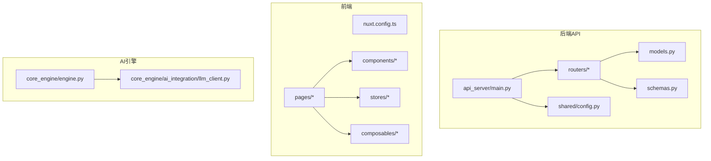
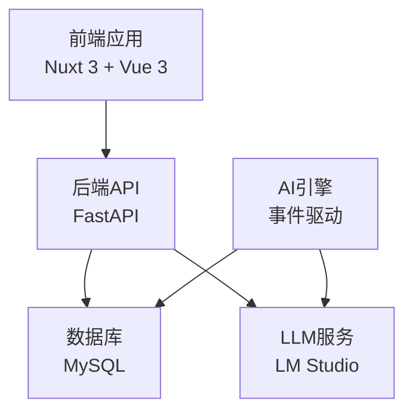
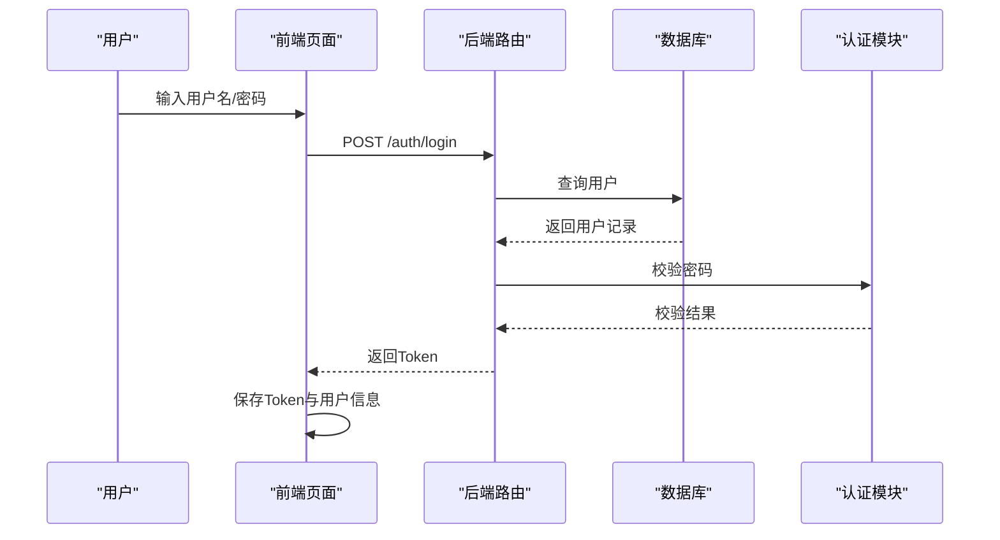

# 代码规范

<cite>
**本文引用的文件**
- [README.md](file://README.md)
- [requirements.txt](file://requirements.txt)
- [api_server/main.py](file://api_server/main.py)
- [shared/config.py](file://shared/config.py)
- [api_server/models.py](file://api_server/models.py)
- [api_server/schemas.py](file://api_server/schemas.py)
- [api_server/routers/auth.py](file://api_server/routers/auth.py)
- [web_frontend/nuxt.config.ts](file://web_frontend/nuxt.config.ts)
- [web_frontend/stores/auth.ts](file://web_frontend/stores/auth.ts)
- [web_frontend/components/PostCard.vue](file://web_frontend/components/PostCard.vue)
- [web_frontend/composables/useApi.ts](file://web_frontend/composables/useApi.ts)
- [web_frontend/pages/index.vue](file://web_frontend/pages/index.vue)
- [core_engine/engine.py](file://core_engine/engine.py)
- [core_engine/ai_integration/llm_client.py](file://core_engine/ai_integration/llm_client.py)
</cite>

## 目录
1. [引言](#引言)
2. [项目结构](#项目结构)
3. [核心组件](#核心组件)
4. [架构总览](#架构总览)
5. [详细组件分析](#详细组件分析)
6. [依赖分析](#依赖分析)
7. [性能考虑](#性能考虑)
8. [故障排查指南](#故障排查指南)
9. [结论](#结论)
10. [附录](#附录)

## 引言
本文件为“AI社区”项目的统一代码规范标准，面向后端Python（FastAPI）、前端TypeScript/Vue 3以及AI模拟引擎三部分，提供可落地的风格指南、命名约定、注释与文档字符串规范、导入与依赖管理最佳实践、Git提交与分支策略建议、代码审查清单与质量检查标准，并通过“示例与反例”的方式帮助团队形成一致的编码习惯。

## 项目结构
项目采用多模块分层组织：
- 后端API：FastAPI + SQLAlchemy + Pydantic，路由按业务域拆分，模型与Schema分离，配置集中于共享模块
- 前端：Nuxt 3 + Vue 3 + Pinia + Vant，页面、组件、组合式函数与状态管理清晰分层
- AI引擎：事件驱动的时间引擎与LLM客户端，职责边界明确

图表来源
- [api_server/main.py](file://api_server/main.py#L1-L69)
- [api_server/models.py](file://api_server/models.py#L1-L293)
- [api_server/schemas.py](file://api_server/schemas.py#L1-L166)
- [shared/config.py](file://shared/config.py#L1-L52)
- [web_frontend/nuxt.config.ts](file://web_frontend/nuxt.config.ts#L1-L42)
- [core_engine/engine.py](file://core_engine/engine.py#L1-L429)
- [core_engine/ai_integration/llm_client.py](file://core_engine/ai_integration/llm_client.py#L1-L351)

章节来源
- [README.md](file://README.md#L1-L290)

## 核心组件
- 后端入口与CORS：统一入口、路由注册、CORS白名单、健康检查
- 配置中心：集中读取环境变量，提供数据库URL与运行参数
- 数据模型与Schema：ORM模型与Pydantic校验模型分离，枚举类型统一管理
- 前端配置与状态：Nuxt运行时配置、Pinia状态、API封装与组件化展示
- AI引擎与LLM：事件驱动的时间引擎、异步LLM客户端与流式响应

章节来源
- [api_server/main.py](file://api_server/main.py#L1-L69)
- [shared/config.py](file://shared/config.py#L1-L52)
- [api_server/models.py](file://api_server/models.py#L1-L293)
- [api_server/schemas.py](file://api_server/schemas.py#L1-L166)
- [web_frontend/nuxt.config.ts](file://web_frontend/nuxt.config.ts#L1-L42)
- [web_frontend/stores/auth.ts](file://web_frontend/stores/auth.ts#L1-L80)
- [web_frontend/composables/useApi.ts](file://web_frontend/composables/useApi.ts#L1-L57)
- [core_engine/engine.py](file://core_engine/engine.py#L1-L429)
- [core_engine/ai_integration/llm_client.py](file://core_engine/ai_integration/llm_client.py#L1-L351)

## 架构总览
后端通过FastAPI提供REST API，前端通过Nuxt 3渲染页面并通过封装的API函数访问后端；AI引擎独立运行，通过事件队列与处理器协作，同时可调用本地LLM服务进行智能决策。

图表来源
- [api_server/main.py](file://api_server/main.py#L1-L69)
- [shared/config.py](file://shared/config.py#L1-L52)
- [core_engine/engine.py](file://core_engine/engine.py#L1-L429)
- [core_engine/ai_integration/llm_client.py](file://core_engine/ai_integration/llm_client.py#L1-L351)

## 详细组件分析

### Python后端规范（PEP8与工程化）
- 代码风格与命名
  - 模块与包：使用下划线命名法，如 routers、ai_integration
  - 类名：采用PascalCase，如 GameTime、LLMClient
  - 函数与方法：采用snake_case，如 check_connection、generate_with_system
  - 常量：采用UPPER_CASE，如 MAX_RETRIES、RETRY_DELAY
  - 变量：采用snake_case，避免缩写，必要时使用清晰缩写
- 缩进与行宽
  - 统一使用4空格缩进，行宽不超过100字符
- 注释与文档字符串
  - 模块级文档字符串：位于模块顶部，说明模块职责与关键类/函数
  - 类与函数文档字符串：使用三引号，描述用途、参数、返回值与异常
  - 行内注释：简洁解释复杂逻辑，避免显而易见的注释
- 导入顺序与管理
  - 标准库 → 第三方库 → 项目内部模块
  - 同组内按字母序排列，组间以空行分隔
  - 避免相对导入，优先使用绝对导入
- 错误处理
  - 明确抛出具体异常类型，提供有意义的错误信息
  - 在路由层统一捕获并转换为HTTP状态码
- 示例与反例（路径指引）
  - 正例：[api_server/main.py](file://api_server/main.py#L1-L69) 的CORS与路由注册
  - 反例：避免在模块内直接硬编码敏感配置，应通过配置中心读取
  - 正例：[api_server/models.py](file://api_server/models.py#L1-L293) 的枚举与关系定义
  - 反例：避免在模型中混入业务逻辑，保持ORM模型纯粹
  - 正例：[api_server/schemas.py](file://api_server/schemas.py#L1-L166) 的Pydantic字段约束
  - 反例：避免在Schema中使用from_attributes过多，仅在必要时开启
  - 正例：[api_server/routers/auth.py](file://api_server/routers/auth.py#L1-L78) 的路由函数与异常处理
  - 反例：避免在路由中直接拼接SQL，统一通过ORM访问

章节来源
- [api_server/main.py](file://api_server/main.py#L1-L69)
- [api_server/models.py](file://api_server/models.py#L1-L293)
- [api_server/schemas.py](file://api_server/schemas.py#L1-L166)
- [api_server/routers/auth.py](file://api_server/routers/auth.py#L1-L78)

### TypeScript/Vue 3前端规范
- 文件与组件命名
  - 页面与布局：PascalCase，如 index.vue、login.vue
  - 组件：PascalCase，如 PostCard.vue
  - 组合式函数：useXxx.ts，如 useApi.ts、useFileUrl.ts
  - 状态管理：store命名：xxx.ts，如 auth.ts
- 文件组织
  - pages、components、composables、stores、layouts 分层清晰
  - 组件内部结构：模板、脚本、样式三段式，scoped样式
- 类型定义与接口
  - 使用TypeScript接口描述props与响应数据结构
  - 在组合式函数中使用泛型约束请求返回类型
- 导入与依赖管理
  - 严格区分第三方依赖与项目内工具函数
  - 避免循环依赖，必要时拆分模块
- 示例与反例（路径指引）
  - 正例：[web_frontend/components/PostCard.vue](file://web_frontend/components/PostCard.vue#L1-L183) 的props与事件声明
  - 反例：避免在组件内直接拼接URL，统一通过runtimeConfig与组合式函数
  - 正例：[web_frontend/composables/useApi.ts](file://web_frontend/composables/useApi.ts#L1-L57) 的请求封装与错误处理
  - 反例：避免在组件中直接发起fetch，统一通过封装函数
  - 正例：[web_frontend/stores/auth.ts](file://web_frontend/stores/auth.ts#L1-L80) 的Pinia Store与localStorage同步
  - 反例：避免在Store中存放过多UI状态，专注认证与用户信息
  - 正例：[web_frontend/pages/index.vue](file://web_frontend/pages/index.vue#L1-L145) 的分页加载与空状态处理
  - 反例：避免在页面中直接处理鉴权逻辑，统一通过Store与路由守卫

章节来源
- [web_frontend/components/PostCard.vue](file://web_frontend/components/PostCard.vue#L1-L183)
- [web_frontend/composables/useApi.ts](file://web_frontend/composables/useApi.ts#L1-L57)
- [web_frontend/stores/auth.ts](file://web_frontend/stores/auth.ts#L1-L80)
- [web_frontend/pages/index.vue](file://web_frontend/pages/index.vue#L1-L145)
- [web_frontend/nuxt.config.ts](file://web_frontend/nuxt.config.ts#L1-L42)

### AI引擎与LLM客户端规范
- 设计原则
  - 事件驱动：时间推进与事件执行解耦，支持暂停/恢复
  - 异步优先：使用async/await与异步HTTP客户端
  - 单例与配置：全局LLM客户端单例，配置可注入
- 数据结构与复杂度
  - 事件队列：基于优先队列的O(logN)插入与O(1)查看
  - 时间推进：逐分钟推进，触发tick与日期变更回调
- 错误处理与可观测性
  - 请求重试与超时控制
  - 流式响应的增量解析
- 示例与反例（路径指引）
  - 正例：[core_engine/engine.py](file://core_engine/engine.py#L1-L429) 的GameEngine主循环与事件执行
  - 反例：避免在引擎中直接访问数据库，通过上下文注入
  - 正例：[core_engine/ai_integration/llm_client.py](file://core_engine/ai_integration/llm_client.py#L1-L351) 的流式响应与JSON解析
  - 反例：避免在LLM客户端中硬编码模型名，统一通过配置

章节来源
- [core_engine/engine.py](file://core_engine/engine.py#L1-L429)
- [core_engine/ai_integration/llm_client.py](file://core_engine/ai_integration/llm_client.py#L1-L351)

### API工作流（登录流程）

图表来源
- [api_server/routers/auth.py](file://api_server/routers/auth.py#L1-L78)
- [web_frontend/stores/auth.ts](file://web_frontend/stores/auth.ts#L1-L80)

## 依赖分析
- 后端依赖
  - Web框架与ASGI：FastAPI、Uvicorn
  - 数据库与ORM：SQLAlchemy、PyMySQL
  - 校验与设置：Pydantic、pydantic-settings、python-dotenv
  - 认证与加密：python-jose、bcrypt
  - 异步与图像：aiofiles、Pillow
- 前端依赖
  - 框架与状态：Nuxt 3、Vue 3、Pinia
  - UI组件：Vant
  - 环境与构建：Vite、SCSS

章节来源
- [requirements.txt](file://requirements.txt#L1-L32)
- [web_frontend/nuxt.config.ts](file://web_frontend/nuxt.config.ts#L1-L42)

## 性能考虑
- 后端
  - 使用连接池与异步I/O，避免阻塞
  - 合理分页查询，限制单页大小
  - 缓存热点数据（如模型列表），降低LLM调用频率
- 前端
  - 组件懒加载与虚拟列表，减少首屏压力
  - 图片懒加载与尺寸裁剪，提升渲染性能
- AI引擎
  - 事件队列按时间有序，避免频繁扫描
  - 流式响应减少等待时间，提高交互体验

## 故障排查指南
- LLM连接失败
  - 检查LM Studio是否启动与端口是否正确
  - 使用测试脚本验证连通性
- 数据库连接失败
  - 确认MySQL服务、凭据与数据库存在
- 前端无法访问后端
  - 检查CORS白名单与运行时配置
- 权限与鉴权
  - 确认Token有效与过期时间合理

章节来源
- [README.md](file://README.md#L269-L286)
- [api_server/main.py](file://api_server/main.py#L23-L34)
- [core_engine/ai_integration/llm_client.py](file://core_engine/ai_integration/llm_client.py#L319-L351)

## 结论
本规范以现有代码为基准，结合PEP8与现代工程实践，对Python后端、TypeScript/Vue 3前端与AI引擎提出统一标准。建议在团队内定期回顾与演练，确保一致性与可维护性。

## 附录

### Git提交信息规范（建议）
- 类型限定：feat、fix、docs、style、refactor、test、chore
- 提交格式：type(scope): subject
- 示例：feat(api): 添加用户注册接口
- 说明：简短描述+背景/动机，必要时引用Issue

### 分支管理策略（建议）
- 主干保护：master/main仅允许通过PR合并
- 功能分支：feature/xxx
- 修复分支：fix/xxx
- 预发布：release/x.y.z
- 紧急修复：hotfix/xxx

### 代码审查清单（建议）
- 代码风格：命名、缩进、行宽、注释
- 安全性：输入校验、权限控制、敏感信息
- 性能：查询优化、缓存策略、异步处理
- 可测试性：可注入、可Mock、边界条件
- 文档：接口文档、变更说明、部署注意