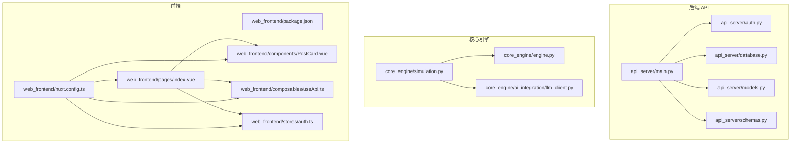
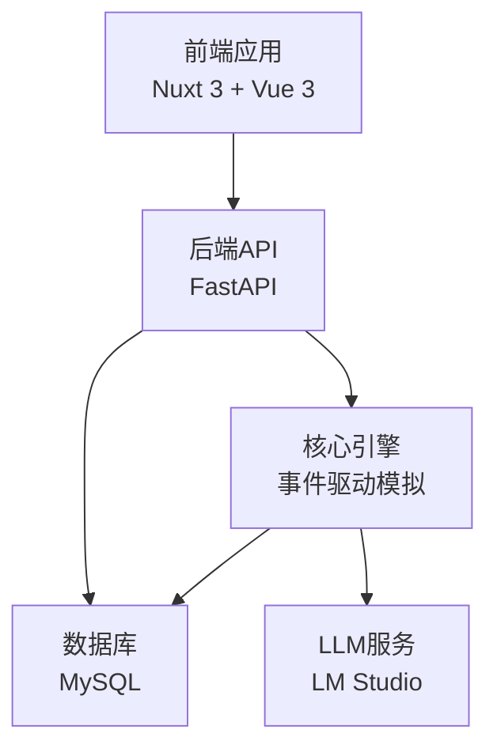
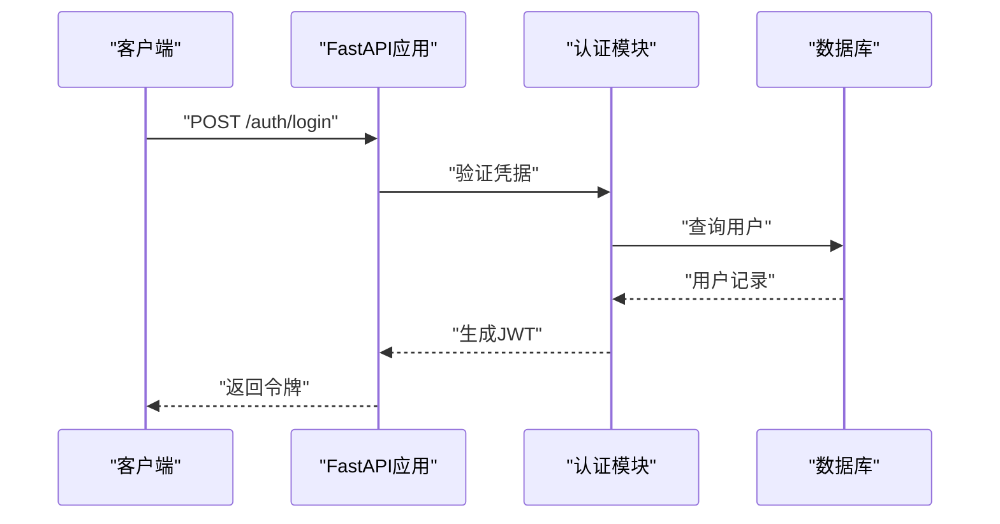
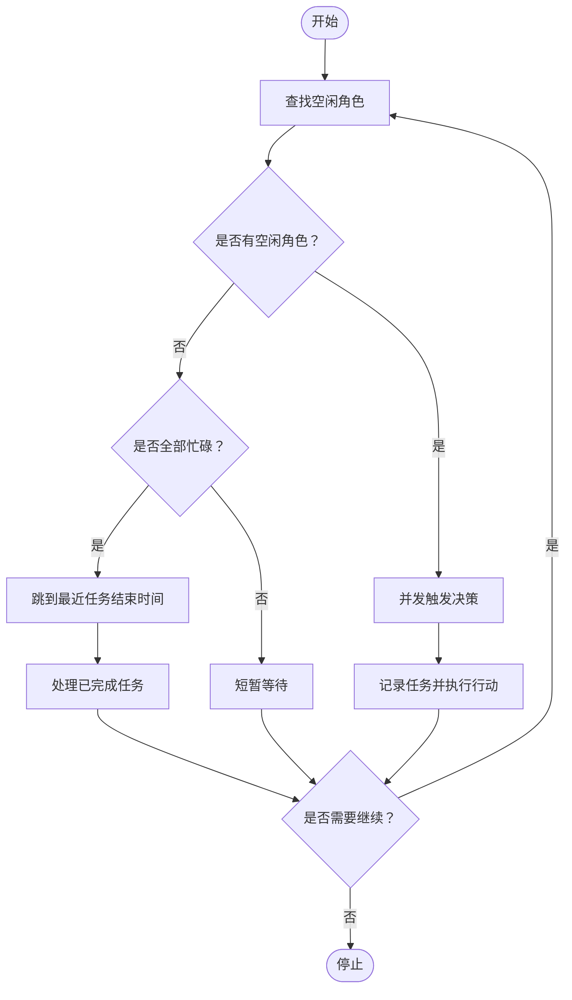
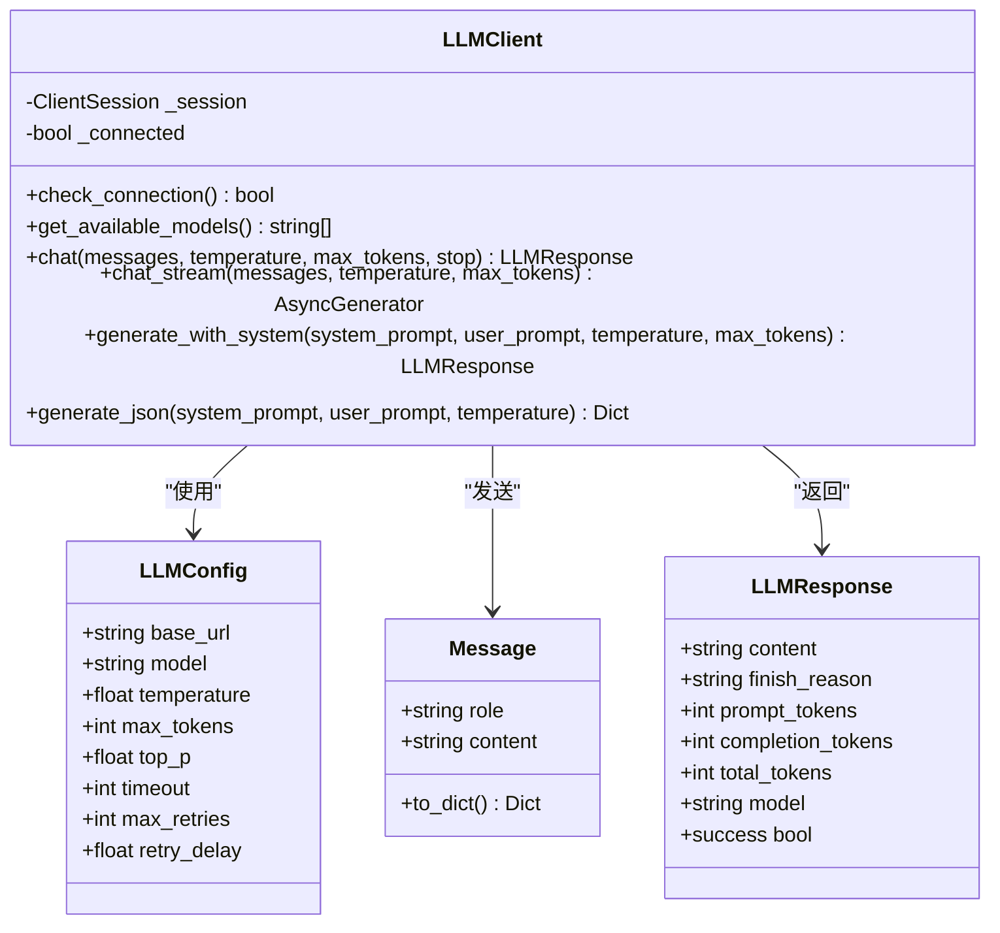
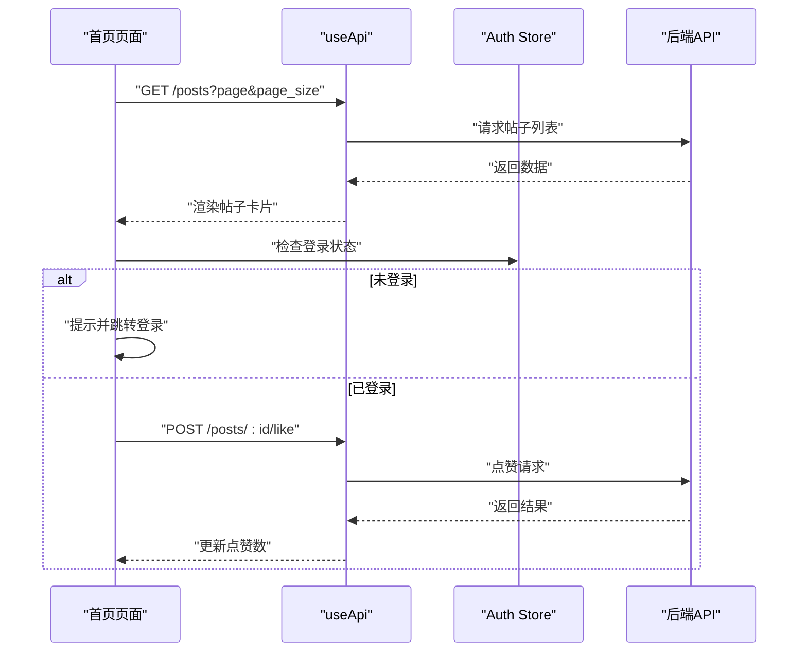
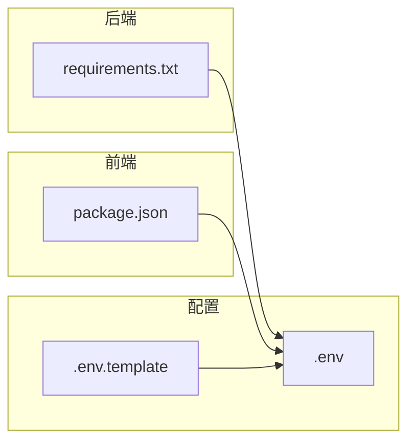

# 开发指南

<cite>
**本文引用的文件**
- [README.md](file://README.md)
- [开发目标.md](file://开发目标.md)
- [开发进度.md](file://开发进度.md)
- [requirements.txt](file://requirements.txt)
- [.env](file://.env)
- [.env.template](file://.env.template)
- [api_server/main.py](file://api_server/main.py)
- [api_server/database.py](file://api_server/database.py)
- [api_server/models.py](file://api_server/models.py)
- [api_server/schemas.py](file://api_server/schemas.py)
- [api_server/auth.py](file://api_server/auth.py)
- [core_engine/engine.py](file://core_engine/engine.py)
- [core_engine/simulation.py](file://core_engine/simulation.py)
- [core_engine/ai_integration/llm_client.py](file://core_engine/ai_integration/llm_client.py)
- [web_frontend/package.json](file://web_frontend/package.json)
- [web_frontend/nuxt.config.ts](file://web_frontend/nuxt.config.ts)
- [web_frontend/pages/index.vue](file://web_frontend/pages/index.vue)
- [web_frontend/components/PostCard.vue](file://web_frontend/components/PostCard.vue)
- [web_frontend/composables/useApi.ts](file://web_frontend/composables/useApi.ts)
- [web_frontend/stores/auth.ts](file://web_frontend/stores/auth.ts)
</cite>

## 目录
1. [简介](#简介)
2. [项目结构](#项目结构)
3. [核心组件](#核心组件)
4. [架构总览](#架构总览)
5. [详细组件分析](#详细组件分析)
6. [依赖分析](#依赖分析)
7. [性能考量](#性能考量)
8. [故障排查指南](#故障排查指南)
9. [结论](#结论)
10. [附录](#附录)

## 简介
本开发指南面向AI社区项目的开发者，提供从代码风格、模块命名、注释规范到扩展开发、调试工具、测试策略、版本控制与CI流程、贡献指南以及架构演进与技术债务管理的系统性指导。项目采用前后端分离架构：后端基于FastAPI，前端基于Nuxt 3 + Vue 3，核心模拟引擎采用事件驱动的时间模型，结合LLM进行AI角色的自主决策。

## 项目结构
项目采用按功能域划分的模块化组织方式：
- 后端API服务：api_server（路由、认证、数据库、模型与Schema）
- 核心引擎：core_engine（时间引擎、事件系统、环境系统、角色系统、社交增强、可视化、AI集成）
- 前端应用：web_frontend（Nuxt 3页面、组件、组合式函数、状态管理）
- 共享配置：shared（全局配置）
- 数据与迁移：data（SQL迁移脚本）
- 启动与脚本：run_simulation.py、run_visualization.py、init_db.py、start.bat

图表来源
- [api_server/main.py](file://api_server/main.py#L1-L69)
- [api_server/auth.py](file://api_server/auth.py#L1-L89)
- [api_server/database.py](file://api_server/database.py#L1-L33)
- [api_server/models.py](file://api_server/models.py#L1-L293)
- [api_server/schemas.py](file://api_server/schemas.py#L1-L166)
- [core_engine/engine.py](file://core_engine/engine.py#L1-L429)
- [core_engine/simulation.py](file://core_engine/simulation.py#L1-L529)
- [core_engine/ai_integration/llm_client.py](file://core_engine/ai_integration/llm_client.py#L1-L351)
- [web_frontend/package.json](file://web_frontend/package.json#L1-L28)
- [web_frontend/nuxt.config.ts](file://web_frontend/nuxt.config.ts#L1-L42)
- [web_frontend/pages/index.vue](file://web_frontend/pages/index.vue#L1-L145)
- [web_frontend/components/PostCard.vue](file://web_frontend/components/PostCard.vue#L1-L183)
- [web_frontend/composables/useApi.ts](file://web_frontend/composables/useApi.ts#L1-L57)
- [web_frontend/stores/auth.ts](file://web_frontend/stores/auth.ts#L1-L80)

章节来源
- [README.md](file://README.md#L1-L35)
- [开发进度.md](file://开发进度.md#L228-L311)

## 核心组件
- 后端API：基于FastAPI，提供认证、用户、帖子、评论、文件上传、私聊消息等接口；支持CORS、静态资源挂载与健康检查端点。
- 数据层：SQLAlchemy ORM模型与Pydantic Schema，统一数据校验与序列化。
- 核心引擎：事件驱动的时间管理器、事件队列与处理器注册机制；模拟器基于行动结束触发，支持时间跳跃与AI自主决策。
- AI集成：OpenAI兼容的LLM客户端，支持同步与流式响应、JSON输出解析与自动重试。
- 前端：Nuxt 3应用，使用Vant移动端组件库，Pinia状态管理，组合式函数封装API与WebSocket。

章节来源
- [api_server/main.py](file://api_server/main.py#L1-L69)
- [api_server/database.py](file://api_server/database.py#L1-L33)
- [api_server/models.py](file://api_server/models.py#L1-L293)
- [api_server/schemas.py](file://api_server/schemas.py#L1-L166)
- [core_engine/engine.py](file://core_engine/engine.py#L167-L429)
- [core_engine/simulation.py](file://core_engine/simulation.py#L64-L529)
- [core_engine/ai_integration/llm_client.py](file://core_engine/ai_integration/llm_client.py#L54-L351)
- [web_frontend/package.json](file://web_frontend/package.json#L1-L28)
- [web_frontend/nuxt.config.ts](file://web_frontend/nuxt.config.ts#L1-L42)

## 架构总览
系统采用三层架构：前端（Nuxt 3）、后端（FastAPI）、核心引擎（事件驱动模拟）。后端通过ORM访问MySQL，前端通过REST API与WebSocket与后端交互；核心引擎通过LLM进行AI角色决策，驱动事件队列与世界状态变化。

图表来源
- [README.md](file://README.md#L8-L35)
- [api_server/main.py](file://api_server/main.py#L1-L69)
- [core_engine/simulation.py](file://core_engine/simulation.py#L64-L114)
- [core_engine/ai_integration/llm_client.py](file://core_engine/ai_integration/llm_client.py#L54-L80)

## 详细组件分析

### 后端API组件分析
- 路由与中间件：集中注册认证、用户、帖子、评论、文件、消息路由；配置CORS允许前端域名访问。
- 认证与授权：基于JWT的OAuth2密码流，提供当前用户解析与可选用户解析。
- 数据库与模型：统一的数据库引擎、会话工厂与ORM模型；Schema用于请求/响应校验。
- 健康检查：根路径与/health端点便于容器与运维监控。

图表来源
- [api_server/main.py](file://api_server/main.py#L36-L42)
- [api_server/auth.py](file://api_server/auth.py#L58-L89)
- [api_server/database.py](file://api_server/database.py#L26-L33)

章节来源
- [api_server/main.py](file://api_server/main.py#L1-L69)
- [api_server/auth.py](file://api_server/auth.py#L1-L89)
- [api_server/database.py](file://api_server/database.py#L1-L33)
- [api_server/models.py](file://api_server/models.py#L1-L293)
- [api_server/schemas.py](file://api_server/schemas.py#L1-L166)

### 核心引擎组件分析
- 时间管理器：以分钟为粒度的时间推进，支持时段判断、昼夜与天气联动。
- 游戏状态：可序列化保存/加载，包含事件统计与引擎状态。
- 事件系统：事件队列与处理器注册，支持冲突检测与异步执行。
- 模拟器：基于行动结束触发，空闲角色并发决策，忙碌时时间跳跃至最近结束点，支持手动步进与回调钩子。

图表来源
- [core_engine/simulation.py](file://core_engine/simulation.py#L220-L249)
- [core_engine/simulation.py](file://core_engine/simulation.py#L346-L379)
- [core_engine/engine.py](file://core_engine/engine.py#L288-L320)

章节来源
- [core_engine/engine.py](file://core_engine/engine.py#L167-L429)
- [core_engine/simulation.py](file://core_engine/simulation.py#L64-L529)

### AI集成组件分析
- LLM客户端：OpenAI兼容接口，支持同步与流式响应、JSON解析、自动重试与连接检查。
- 配置：可配置base_url、model、温度、最大token、超时与重试策略。
- 测试：提供独立测试脚本验证连接与基本对话。

图表来源
- [core_engine/ai_integration/llm_client.py](file://core_engine/ai_integration/llm_client.py#L14-L53)
- [core_engine/ai_integration/llm_client.py](file://core_engine/ai_integration/llm_client.py#L54-L351)

章节来源
- [core_engine/ai_integration/llm_client.py](file://core_engine/ai_integration/llm_client.py#L1-L351)

### 前端组件分析
- 页面与组件：首页列表、帖子卡片、登录/注册、个人中心、私信会话与详情页。
- 组合式函数：useApi封装REST请求，useFileUrl统一文件URL处理，useWebSocket封装WebSocket（单例）。
- 状态管理：Pinia Store管理认证状态，持久化到localStorage。
- 配置：Nuxt配置模块化，CSS引入，运行时配置暴露API基础地址。

图表来源
- [web_frontend/pages/index.vue](file://web_frontend/pages/index.vue#L66-L133)
- [web_frontend/composables/useApi.ts](file://web_frontend/composables/useApi.ts#L8-L48)
- [web_frontend/stores/auth.ts](file://web_frontend/stores/auth.ts#L28-L77)

章节来源
- [web_frontend/package.json](file://web_frontend/package.json#L1-L28)
- [web_frontend/nuxt.config.ts](file://web_frontend/nuxt.config.ts#L1-L42)
- [web_frontend/pages/index.vue](file://web_frontend/pages/index.vue#L1-L145)
- [web_frontend/components/PostCard.vue](file://web_frontend/components/PostCard.vue#L1-L183)
- [web_frontend/composables/useApi.ts](file://web_frontend/composables/useApi.ts#L1-L57)
- [web_frontend/stores/auth.ts](file://web_frontend/stores/auth.ts#L1-L80)

## 依赖分析
- 后端依赖：FastAPI、SQLAlchemy、PyMySQL、Pydantic、python-jose、passlib、aiofiles、Pillow、python-dotenv等。
- 前端依赖：Nuxt 3、Vue 3、Pinia、Vant、@vant/nuxt等。
- 环境变量：数据库、JWT、服务器、前端URL、文件存储、预留AI与ComfyUI接口。

图表来源
- [requirements.txt](file://requirements.txt#L1-L32)
- [web_frontend/package.json](file://web_frontend/package.json#L1-L28)
- [.env](file://.env#L1-L30)
- [.env.template](file://.env.template#L1-L30)

章节来源
- [requirements.txt](file://requirements.txt#L1-L32)
- [.env](file://.env#L1-L30)
- [.env.template](file://.env.template#L1-L30)

## 性能考量
- 异步与并发：后端使用aiohttp与异步数据库会话；前端请求采用fetch异步处理。
- 事件驱动与时间跳跃：核心引擎在角色忙碌时自动跳到最近结束点，避免无效轮询。
- LLM调用优化：客户端内置重试与超时控制，建议在高负载场景下限制并发请求或增加缓存层。
- 前端渲染：列表懒加载与下拉刷新，避免一次性加载大量数据。

## 故障排查指南
- LLM连接失败：确认LM Studio已启动并加载模型，检查base_url与端口；使用独立脚本测试连接。
- 数据库连接失败：确认MySQL服务运行、密码正确、数据库存在；检查连接URL与池配置。
- AI角色缺失：确保数据库中存在is_ai=True的用户记录；模拟器需要真实用户数据驱动。
- 健康检查：访问后端/health端点确认服务可用；查看CORS配置是否允许前端域名。

章节来源
- [README.md](file://README.md#L269-L286)
- [core_engine/ai_integration/llm_client.py](file://core_engine/ai_integration/llm_client.py#L319-L351)
- [api_server/main.py](file://api_server/main.py#L55-L58)

## 结论
本指南提供了从架构理解、组件剖析到扩展开发、调试与测试的全链路开发指引。建议在新增功能时遵循统一的模块命名与注释规范，保持前后端接口契约稳定，利用事件驱动与LLM集成能力扩展AI行为，并通过完善的日志与监控体系保障系统稳定性。

## 附录

### 开发规范与最佳实践
- 代码风格：后端遵循Python风格指南，前端使用TypeScript与Vue单文件组件；统一使用UTF-8编码。
- 模块命名：后端模块按功能域命名（如routers、models、schemas），前端组件采用帕斯卡命名法，页面按路由路径组织。
- 注释规范：公共接口与复杂算法需提供清晰注释；错误处理与边界条件需明确标注。
- 错误处理：后端统一使用HTTP状态码与异常抛出；前端对错误进行友好提示与降级处理。
- 性能优化：合理使用异步与并发；避免在热路径中进行阻塞操作；对频繁请求进行缓存与节流。

### 扩展开发步骤
- 新增API接口
  - 在api_server/routers下新增路由模块，定义路径与处理器。
  - 在api_server/schemas.py中新增对应Pydantic模型。
  - 在api_server/models.py中新增ORM模型（如涉及数据库）。
  - 在api_server/main.py中注册新路由。
  - 编写单元测试与集成测试，确保接口契约稳定。
  
  章节来源
  - [api_server/main.py](file://api_server/main.py#L36-L42)
  - [api_server/schemas.py](file://api_server/schemas.py#L1-L166)
  - [api_server/models.py](file://api_server/models.py#L1-L293)

- AI行为扩展
  - 在core_engine/character或social目录下新增行为或处理器，注册到事件系统。
  - 使用LLM客户端生成JSON格式的决策结果，确保格式约束与解析健壮性。
  - 在模拟器中注册回调钩子，监听行动开始/结束与时间推进事件。
  
  章节来源
  - [core_engine/simulation.py](file://core_engine/simulation.py#L435-L478)
  - [core_engine/ai_integration/llm_client.py](file://core_engine/ai_integration/llm_client.py#L253-L300)

- 前端组件开发
  - 在web_frontend/components新增组件，遵循Props/Events/Slots约定。
  - 在web_frontend/pages中新增页面，使用组合式函数封装API调用。
  - 在web_frontend/stores中维护全局状态，必要时持久化到localStorage。
  
  章节来源
  - [web_frontend/components/PostCard.vue](file://web_frontend/components/PostCard.vue#L54-L90)
  - [web_frontend/pages/index.vue](file://web_frontend/pages/index.vue#L33-L137)
  - [web_frontend/stores/auth.ts](file://web_frontend/stores/auth.ts#L18-L79)

### 调试技巧与工具
- 后端
  - 使用Uvicorn热重载启动后端服务，便于快速迭代。
  - 利用/health端点与日志输出定位服务状态。
  - 使用FastAPI自动生成的/docs与/redoc进行接口调试。
- 前端
  - 使用Nuxt Devtools与浏览器开发者工具进行组件与状态调试。
  - 通过useApi封装统一处理错误与鉴权头。
- 核心引擎
  - 使用模拟器的verbose配置输出详细日志。
  - 通过回调钩子观察行动与时间推进过程。

章节来源
- [api_server/main.py](file://api_server/main.py#L61-L69)
- [web_frontend/nuxt.config.ts](file://web_frontend/nuxt.config.ts#L32-L40)
- [core_engine/simulation.py](file://core_engine/simulation.py#L504-L508)

### 测试策略
- 单元测试：针对核心引擎的GameEngine与事件处理、LLM客户端的连接与JSON解析进行单元测试。
- 集成测试：覆盖后端路由与数据库交互，确保认证、用户、帖子、评论、消息与文件上传的端到端流程。
- 端到端测试：使用前端自动化测试框架（如Playwright或Cypress）验证页面交互与用户流程。

### 版本控制、代码审查与持续集成
- 分支策略：采用Git Flow，主分支保护，特性分支开发，发布分支管理版本。
- 提交规范：使用语义化提交信息，配合Conventional Commits。
- 代码审查：PR必须通过至少一名维护者审核，关注安全性、性能与可维护性。
- CI流程：在CI中执行lint、单元测试、集成测试与打包检查，确保质量门禁。

### 贡献指南
- Issue提交：提供清晰标题、重现步骤、期望与实际结果、环境信息与日志。
- Pull Request：关联相关Issue，提供变更说明、测试用例与文档更新。
- 社区参与：遵守行为准则，积极讨论设计与实现方案，协助维护与测试。

### 项目架构演进、技术债务与重构策略
- 架构演进：从线上社区基础逐步扩展到核心引擎与可视化系统，未来可引入生图系统与更复杂的社交事件。
- 技术债务：关注LLM调用的稳定性与成本控制，优化事件队列与回调链的性能瓶颈。
- 重构策略：优先保证接口稳定性，采用渐进式重构；对关键路径进行基准测试，确保性能不退化。