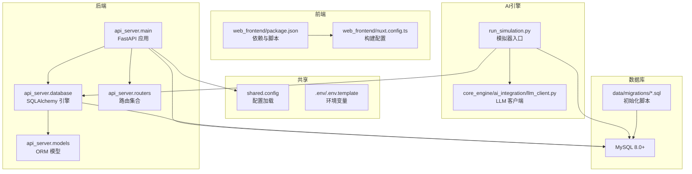
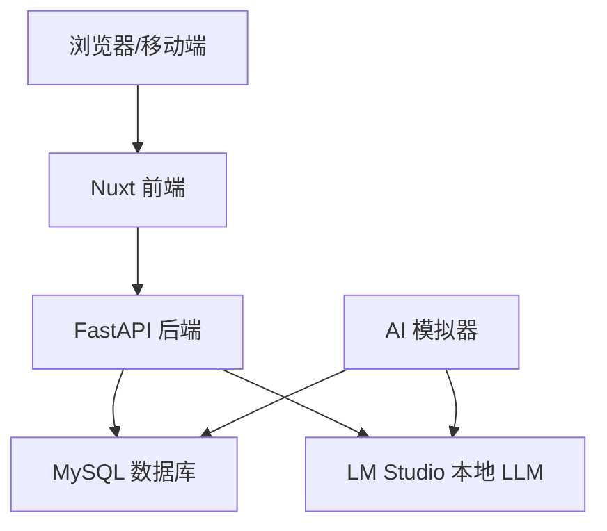
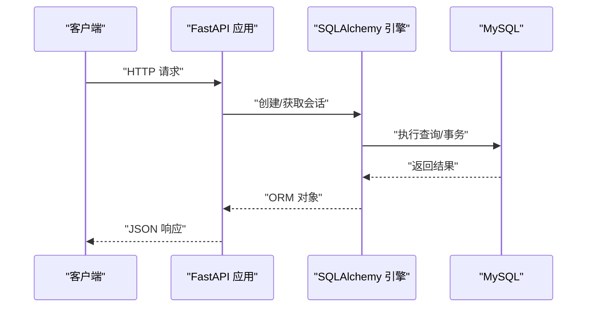
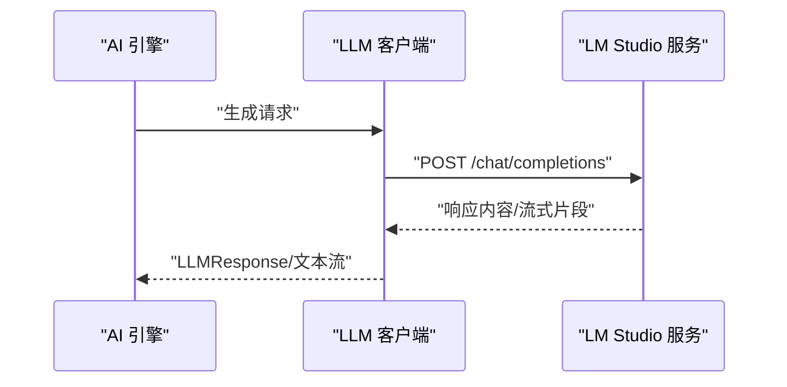
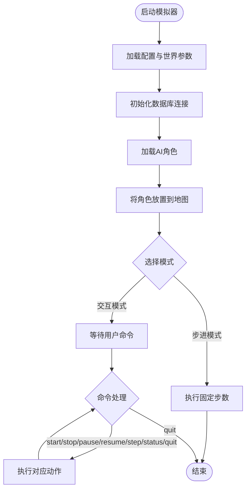
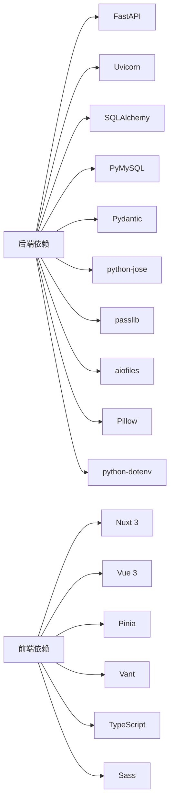

# 开发环境搭建

<cite>
**本文引用的文件**
- [README.md](file://README.md)
- [requirements.txt](file://requirements.txt)
- [.env.template](file://.env.template)
- [shared/config.py](file://shared/config.py)
- [api_server/main.py](file://api_server/main.py)
- [api_server/database.py](file://api_server/database.py)
- [api_server/models.py](file://api_server/models.py)
- [web_frontend/package.json](file://web_frontend/package.json)
- [web_frontend/nuxt.config.ts](file://web_frontend/nuxt.config.ts)
- [start.bat](file://start.bat)
- [run_simulation.py](file://run_simulation.py)
- [init_db.py](file://init_db.py)
- [data/migrations/001_init.sql](file://data/migrations/001_init.sql)
- [core_engine/ai_integration/llm_client.py](file://core_engine/ai_integration/llm_client.py)
</cite>

## 目录
1. [简介](#简介)
2. [项目结构](#项目结构)
3. [核心组件](#核心组件)
4. [架构总览](#架构总览)
5. [详细组件分析](#详细组件分析)
6. [依赖关系分析](#依赖关系分析)
7. [性能注意事项](#性能注意事项)
8. [故障排查指南](#故障排查指南)
9. [结论](#结论)
10. [附录](#附录)

## 简介
本指南面向希望在本地搭建并运行“AI社区”项目的开发者，涵盖系统要求、前置依赖、数据库配置、LLM服务配置、启动脚本使用、IDE配置建议以及常见问题排查。项目采用前后端分离架构：后端基于 FastAPI，前端基于 Nuxt 3 + Vue 3，AI模拟引擎独立运行，数据库使用 MySQL。

## 项目结构
项目采用分层与功能域结合的组织方式：
- 后端 API 服务：api_server
- AI 模拟引擎：core_engine
- 前端应用：web_frontend
- 共享配置：shared
- 数据与迁移：data
- 启动与脚本：根目录下的启动脚本与模拟脚本

图表来源
- [api_server/main.py](file://api_server/main.py#L1-L69)
- [api_server/database.py](file://api_server/database.py#L1-L33)
- [api_server/models.py](file://api_server/models.py#L1-L200)
- [shared/config.py](file://shared/config.py#L1-L52)
- [web_frontend/package.json](file://web_frontend/package.json#L1-L28)
- [web_frontend/nuxt.config.ts](file://web_frontend/nuxt.config.ts#L1-L42)
- [run_simulation.py](file://run_simulation.py#L1-L258)
- [core_engine/ai_integration/llm_client.py](file://core_engine/ai_integration/llm_client.py#L1-L351)
- [data/migrations/001_init.sql](file://data/migrations/001_init.sql#L1-L200)

章节来源
- [README.md](file://README.md#L1-L35)
- [api_server/main.py](file://api_server/main.py#L1-L69)
- [shared/config.py](file://shared/config.py#L1-L52)

## 核心组件
- 后端 API 服务：提供认证、用户、帖子、评论、文件、消息等接口，支持 CORS、健康检查与文档。
- 数据库层：通过 SQLAlchemy 连接 MySQL，提供会话管理与 ORM 模型。
- 前端应用：Nuxt 3 + Vue 3，Pinia 状态管理，Vant 移动端 UI 组件。
- AI 模拟引擎：事件驱动的时间模型，AI 角色通过 LLM 客户端进行决策。
- LLM 客户端：对接 LM Studio 等本地 OpenAI 兼容服务，支持同步与流式响应。
- 启动脚本：Windows 批处理脚本与 Python 启动脚本，分别负责依赖安装、数据库初始化与服务启动。

章节来源
- [api_server/main.py](file://api_server/main.py#L1-L69)
- [api_server/database.py](file://api_server/database.py#L1-L33)
- [web_frontend/package.json](file://web_frontend/package.json#L1-L28)
- [run_simulation.py](file://run_simulation.py#L1-L258)
- [core_engine/ai_integration/llm_client.py](file://core_engine/ai_integration/llm_client.py#L1-L351)

## 架构总览
系统采用三层架构：前端通过 HTTP 与后端交互；后端通过 ORM 访问 MySQL；AI 模拟器独立进程，通过数据库与 LLM 服务协作。

图表来源
- [api_server/main.py](file://api_server/main.py#L1-L69)
- [web_frontend/nuxt.config.ts](file://web_frontend/nuxt.config.ts#L1-L42)
- [core_engine/ai_integration/llm_client.py](file://core_engine/ai_integration/llm_client.py#L1-L351)
- [data/migrations/001_init.sql](file://data/migrations/001_init.sql#L1-L200)

## 详细组件分析

### 系统要求与前置依赖
- Python 3.10+
- Node.js 18+
- MySQL 8.0+
- LM Studio（或其他 OpenAI 兼容的本地 LLM 服务）

章节来源
- [README.md](file://README.md#L37-L42)

### 数据库配置步骤
- 安装并启动 MySQL 8.0+
- 初始化数据库与表结构
  - 使用提供的初始化脚本或 SQL 文件创建数据库与表
  - 参考初始化脚本与 SQL 文件中的建表语句
- 权限设置
  - 使用 .env/.env.template 中的凭据连接数据库
  - 确保用户具备创建数据库、表及写入权限

章节来源
- [README.md](file://README.md#L67-L81)
- [init_db.py](file://init_db.py#L1-L70)
- [data/migrations/001_init.sql](file://data/migrations/001_init.sql#L1-L200)
- [.env.template](file://.env.template#L1-L30)
- [shared/config.py](file://shared/config.py#L1-L52)

### LLM 服务配置
- 使用 LM Studio 启动本地 LLM 服务，推荐模型如 qwen3-vl-8b
- LLM 客户端默认连接地址与模型可在 LLM 客户端配置中查看
- 提供连接测试方法，验证服务连通性与可用模型

章节来源
- [README.md](file://README.md#L82-L98)
- [core_engine/ai_integration/llm_client.py](file://core_engine/ai_integration/llm_client.py#L1-L351)

### 启动脚本说明
- Windows
  - 使用批处理脚本一键创建虚拟环境、安装依赖、启动后端服务，并提示前端启动步骤
- Linux/macOS
  - 使用 Bash 脚本或手动命令启动后端、前端与模拟器
- 后端 API 服务
  - 通过 Uvicorn 启动，监听 0.0.0.0:8000，支持热重载
- 前端开发服务器
  - Nuxt 开发服务器默认监听 3000 端口
- AI 模拟器
  - 提供交互模式与步进模式，支持手动控制与批量步进

章节来源
- [README.md](file://README.md#L100-L156)
- [start.bat](file://start.bat#L1-L45)
- [api_server/main.py](file://api_server/main.py#L61-L69)
- [web_frontend/package.json](file://web_frontend/package.json#L1-L28)
- [run_simulation.py](file://run_simulation.py#L1-L258)

### IDE 配置建议
- VSCode
  - 推荐扩展：Python、Pylance、ESLint、Vue Language Features、Nuxt
  - 设置 Python 解释器为虚拟环境路径
  - 前端使用 Volar、Sass 等扩展
- PyCharm
  - 配置项目解释器为虚拟环境
  - 启用数据库工具视图，连接本地 MySQL
  - 前端使用内置 Node/npm 工具链

章节来源
- [README.md](file://README.md#L1-L35)

### 虚拟环境与依赖安装
- 创建虚拟环境
  - Windows: venv\Scripts\activate
  - Linux/macOS: source venv/bin/activate
- 安装 Python 依赖
  - pip install -r requirements.txt
- 安装前端依赖
  - cd web_frontend && npm install

章节来源
- [README.md](file://README.md#L46-L65)
- [requirements.txt](file://requirements.txt#L1-L32)
- [web_frontend/package.json](file://web_frontend/package.json#L1-L28)

### API 与数据库交互流程

图表来源
- [api_server/main.py](file://api_server/main.py#L1-L69)
- [api_server/database.py](file://api_server/database.py#L1-L33)
- [api_server/models.py](file://api_server/models.py#L1-L200)

### LLM 客户端调用序列

图表来源
- [core_engine/ai_integration/llm_client.py](file://core_engine/ai_integration/llm_client.py#L106-L227)

### 模拟器启动与交互流程

图表来源
- [run_simulation.py](file://run_simulation.py#L54-L186)
- [run_simulation.py](file://run_simulation.py#L188-L233)

## 依赖关系分析
- 后端依赖
  - FastAPI、Uvicorn、SQLAlchemy、PyMySQL、Pydantic、python-jose、passlib、aiofiles、Pillow、python-dotenv
- 前端依赖
  - Nuxt 3、Vue 3、Pinia、Vant、TypeScript、Sass
- AI 模拟器
  - asyncio、aiohttp、项目内 LLM 客户端

图表来源
- [requirements.txt](file://requirements.txt#L1-L32)
- [web_frontend/package.json](file://web_frontend/package.json#L1-L28)

章节来源
- [requirements.txt](file://requirements.txt#L1-L32)
- [web_frontend/package.json](file://web_frontend/package.json#L1-L28)

## 性能注意事项
- 数据库连接池
  - 后端使用 SQLAlchemy 连接池，启用 pre_ping 与合理回收策略
- LLM 请求超时与重试
  - LLM 客户端配置了超时与重试策略，避免长时间阻塞
- 前端开发体验
  - Nuxt 开发服务器默认启用热更新与调试工具

章节来源
- [api_server/database.py](file://api_server/database.py#L14-L19)
- [core_engine/ai_integration/llm_client.py](file://core_engine/ai_integration/llm_client.py#L14-L27)
- [web_frontend/nuxt.config.ts](file://web_frontend/nuxt.config.ts#L1-L42)

## 故障排查指南
- LLM 连接失败
  - 确认 LM Studio 已启动并加载模型
  - 检查端口是否为 1234
  - 运行 LLM 客户端自带的连接测试
- 数据库连接失败
  - 确认 MySQL 服务已启动
  - 检查 .env 中的主机、端口、用户名、密码与数据库名
  - 确认数据库存在且具备相应权限
- 没有 AI 角色
  - 在数据库中创建 is_ai=True 的用户记录，模拟器需要该类用户参与
- 前端无法访问后端
  - 检查 CORS 配置与前端 API 基础地址
- 启动脚本问题
  - Windows：确认批处理脚本能正确激活虚拟环境并安装依赖
  - Linux/macOS：使用 Bash 手动执行各服务启动命令

章节来源
- [README.md](file://README.md#L269-L286)
- [core_engine/ai_integration/llm_client.py](file://core_engine/ai_integration/llm_client.py#L319-L346)
- [shared/config.py](file://shared/config.py#L1-L52)
- [api_server/main.py](file://api_server/main.py#L23-L34)
- [web_frontend/nuxt.config.ts](file://web_frontend/nuxt.config.ts#L15-L19)
- [start.bat](file://start.bat#L1-L45)

## 结论
通过本指南，您可以在本地快速搭建并运行“AI社区”项目。建议优先完成系统要求与前置依赖安装，随后完成数据库初始化与 LLM 服务配置，最后分别启动后端 API、前端与 AI 模拟器。遇到问题时，可依据故障排查指南逐项定位并解决。

## 附录

### 环境变量与配置要点
- 数据库相关
  - 主机、端口、用户名、密码、数据库名
- JWT 相关
  - 密钥、算法、过期时间
- 服务器与前端
  - API 监听地址与端口、前端 URL
- 文件存储
  - 上传目录与 URL 前缀
- AI 与 ComfyUI（预留）
  - LLM API 基础地址与密钥、ComfyUI API 地址

章节来源
- [.env.template](file://.env.template#L1-L30)
- [shared/config.py](file://shared/config.py#L6-L36)