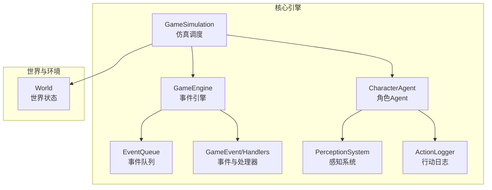
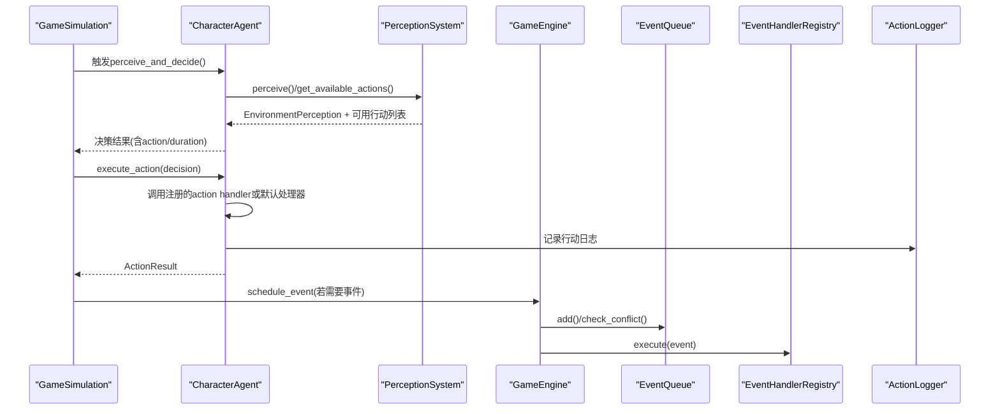
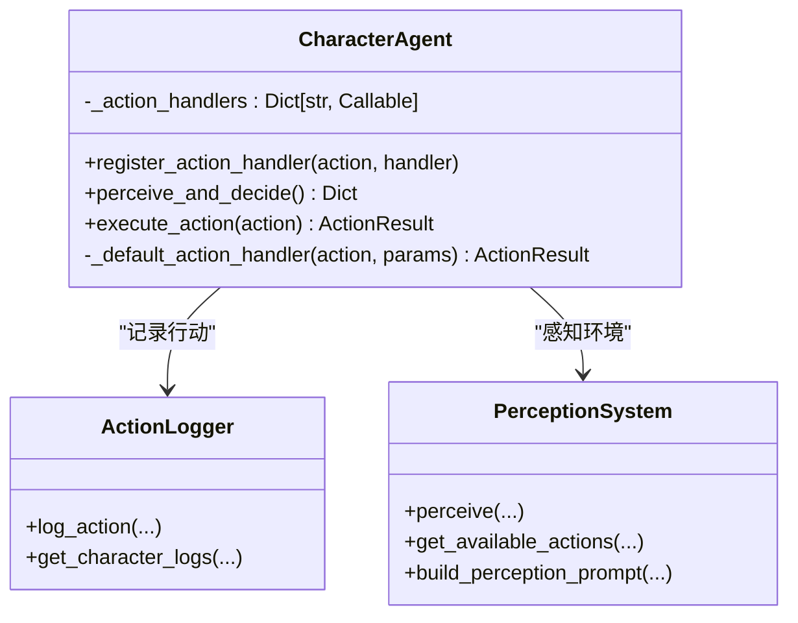
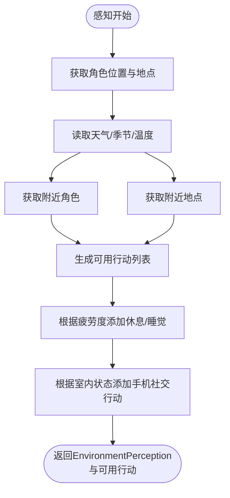
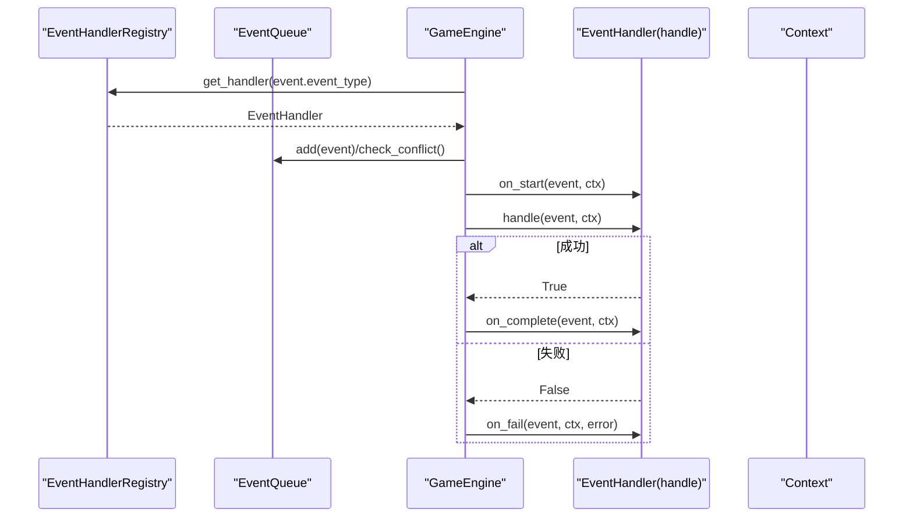
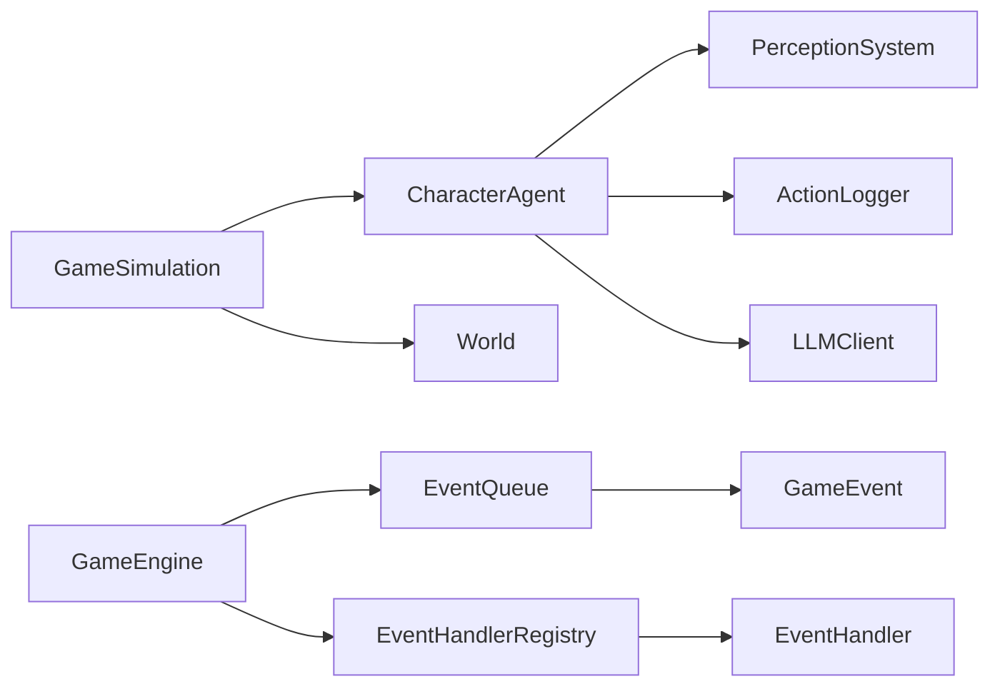

# AI行为扩展

<cite>
**本文引用的文件**
- [core_engine/character/agent.py](file://core_engine/character/agent.py)
- [core_engine/character/perception.py](file://core_engine/character/perception.py)
- [core_engine/event_system/events.py](file://core_engine/event_system/events.py)
- [core_engine/event_system/handlers.py](file://core_engine/event_system/handlers.py)
- [core_engine/event_system/event_queue.py](file://core_engine/event_system/event_queue.py)
- [core_engine/engine.py](file://core_engine/engine.py)
- [core_engine/character/action_logger.py](file://core_engine/character/action_logger.py)
- [core_engine/simulation.py](file://core_engine/simulation.py)
- [run_simulation.py](file://run_simulation.py)
- [README.md](file://README.md)
</cite>

## 目录
1. [简介](#简介)
2. [项目结构](#项目结构)
3. [核心组件](#核心组件)
4. [架构总览](#架构总览)
5. [详细组件分析](#详细组件分析)
6. [依赖分析](#依赖分析)
7. [性能考量](#性能考量)
8. [故障排查指南](#故障排查指南)
9. [结论](#结论)
10. [附录](#附录)

## 简介
本指南面向希望在AI社区项目中扩展AI角色行为的开发者，重点围绕CharacterAgent的行为扩展机制，包括：
- register_action_handler方法的使用与自定义行动处理器实现
- 行动回调函数设计与执行流程
- 事件处理器注册流程（事件类型定义、处理器函数编写、事件调度机制）
- 感知系统的扩展方法（EnvironmentPerception增强、可用行动识别、环境信息收集）
- 完整的AI行为扩展示例（复杂行动逻辑、多步骤任务、条件判断）
- 行为优先级、冲突解决与性能优化技巧

## 项目结构
AI社区项目采用分层架构，核心模拟引擎位于core_engine目录，包含角色系统、事件系统、世界环境与仿真调度等模块。运行入口位于run_simulation.py，通过GameSimulation协调角色、世界与事件系统。

图表来源
- [core_engine/simulation.py](file://core_engine/simulation.py#L64-L114)
- [core_engine/engine.py](file://core_engine/engine.py#L167-L197)
- [core_engine/event_system/event_queue.py](file://core_engine/event_system/event_queue.py#L29-L44)
- [core_engine/event_system/events.py](file://core_engine/event_system/events.py#L55-L129)
- [core_engine/event_system/handlers.py](file://core_engine/event_system/handlers.py#L50-L84)
- [core_engine/character/perception.py](file://core_engine/character/perception.py#L211-L225)
- [core_engine/character/agent.py](file://core_engine/character/agent.py#L116-L175)
- [core_engine/character/action_logger.py](file://core_engine/character/action_logger.py#L89-L98)
- [core_engine/environment/world.py](file://core_engine/environment/world.py#L93-L121)

章节来源
- [README.md](file://README.md#L1-L35)
- [run_simulation.py](file://run_simulation.py#L17-L29)

## 核心组件
- CharacterAgent：负责感知、决策、执行行动与日志记录，支持通过register_action_handler注册自定义行动处理器。
- PerceptionSystem/EnvironmentPerception：提供环境感知、可用行动集合与环境描述构建。
- GameEvent/EventHandler：定义事件类型、优先级与状态，提供处理器注册与执行机制。
- EventQueue/EventEngine：基于优先队列的事件调度与冲突检测。
- ActionLogger：统一记录行动类型、时长、原因与结果，便于查询与可视化。
- GameSimulation：基于行动结束触发的仿真调度器，协调时间推进与角色任务堆。

章节来源
- [core_engine/character/agent.py](file://core_engine/character/agent.py#L116-L175)
- [core_engine/character/perception.py](file://core_engine/character/perception.py#L211-L225)
- [core_engine/event_system/events.py](file://core_engine/event_system/events.py#L55-L129)
- [core_engine/event_system/handlers.py](file://core_engine/event_system/handlers.py#L50-L84)
- [core_engine/event_system/event_queue.py](file://core_engine/event_system/event_queue.py#L29-L44)
- [core_engine/character/action_logger.py](file://core_engine/character/action_logger.py#L89-L98)
- [core_engine/simulation.py](file://core_engine/simulation.py#L64-L114)

## 架构总览
AI行为扩展贯穿感知、决策、执行与日志四个环节，同时与事件系统协同实现可调度、可冲突检测与可扩展的执行框架。

图表来源
- [core_engine/simulation.py](file://core_engine/simulation.py#L267-L343)
- [core_engine/character/agent.py](file://core_engine/character/agent.py#L358-L478)
- [core_engine/character/perception.py](file://core_engine/character/perception.py#L395-L527)
- [core_engine/engine.py](file://core_engine/engine.py#L211-L227)
- [core_engine/event_system/event_queue.py](file://core_engine/event_system/event_queue.py#L46-L72)
- [core_engine/event_system/handlers.py](file://core_engine/event_system/handlers.py#L99-L137)
- [core_engine/character/action_logger.py](file://core_engine/character/action_logger.py#L103-L161)

## 详细组件分析

### CharacterAgent 行为扩展机制
- register_action_handler(action, handler)：注册自定义行动处理器，key为action字符串，value为异步回调函数，签名形如async def handler(agent, params) -> ActionResult。
- execute_action(action)：根据action类型查找处理器，优先使用已注册处理器，否则回落至默认处理器；执行后记录日志并消耗疲劳。
- 默认处理器覆盖常见行动（等待、休息、移动、浏览、发帖、私信、查看主页等），并结合世界位置与社交调度器实现复杂行为。
- 行动结果包含success、action、message、duration与data，便于日志与后续调度。

图表来源
- [core_engine/character/agent.py](file://core_engine/character/agent.py#L176-L179)
- [core_engine/character/agent.py](file://core_engine/character/agent.py#L479-L521)
- [core_engine/character/agent.py](file://core_engine/character/agent.py#L574-L800)
- [core_engine/character/action_logger.py](file://core_engine/character/action_logger.py#L89-L161)
- [core_engine/character/perception.py](file://core_engine/character/perception.py#L211-L225)

章节来源
- [core_engine/character/agent.py](file://core_engine/character/agent.py#L176-L179)
- [core_engine/character/agent.py](file://core_engine/character/agent.py#L479-L521)
- [core_engine/character/agent.py](file://core_engine/character/agent.py#L574-L800)

### 感知系统扩展（EnvironmentPerception 与 PerceptionSystem）
- EnvironmentPerception：封装位置、环境、附近角色、附近对象、附近地点与身体状态，提供to_dict与描述文本构建。
- PerceptionSystem：
  - perceive(character_id, physical_state)：从世界获取位置、地点、环境与附近角色/地点。
  - get_available_actions(perception)：根据环境与身体状态动态生成可用行动（移动、对话、互动、休息、睡觉、室内社交等），并为每个行动附带预估时长。
  - build_perception_prompt(perception)：将感知结果格式化为提示词，供LLM决策使用。

图表来源
- [core_engine/character/perception.py](file://core_engine/character/perception.py#L226-L303)
- [core_engine/character/perception.py](file://core_engine/character/perception.py#L395-L527)

章节来源
- [core_engine/character/perception.py](file://core_engine/character/perception.py#L148-L209)
- [core_engine/character/perception.py](file://core_engine/character/perception.py#L226-L303)
- [core_engine/character/perception.py](file://core_engine/character/perception.py#L395-L527)

### 事件系统与调度机制
- 事件类型与优先级：EventType定义个人事件、集体事件与突发事件；EventPriority定义优先级等级；EventStatus定义事件生命周期。
- 事件处理器注册：EventHandlerRegistry提供register/unregister/get_handler/add_before_hook/add_after_hook；event_handler装饰器便捷注册。
- 事件队列：EventQueue基于堆实现，按scheduled_time与priority排序；支持冲突检测、懒删除与重新调度。
- 事件执行：GameEngine.schedule_event调度事件并检查冲突；_execute_event执行处理器并推进时间；支持回调与状态持久化。

图表来源
- [core_engine/event_system/events.py](file://core_engine/event_system/events.py#L55-L129)
- [core_engine/event_system/handlers.py](file://core_engine/event_system/handlers.py#L50-L84)
- [core_engine/event_system/handlers.py](file://core_engine/event_system/handlers.py#L99-L137)
- [core_engine/event_system/event_queue.py](file://core_engine/event_system/event_queue.py#L46-L72)
- [core_engine/engine.py](file://core_engine/engine.py#L211-L227)

章节来源
- [core_engine/event_system/events.py](file://core_engine/event_system/events.py#L13-L53)
- [core_engine/event_system/handlers.py](file://core_engine/event_system/handlers.py#L50-L84)
- [core_engine/event_system/handlers.py](file://core_engine/event_system/handlers.py#L99-L137)
- [core_engine/event_system/event_queue.py](file://core_engine/event_system/event_queue.py#L154-L178)
- [core_engine/engine.py](file://core_engine/engine.py#L211-L227)

### 行动日志与可视化
- ActionLogger统一记录行动类型、时长、原因、结果与附加数据；提供按角色、类型与时间范围查询接口；支持将日志转换为显示文本。
- 日志类型覆盖移动、对话、使用手机、发帖、点赞、评论、私信、休息、睡觉、醒来、思考、相遇等。

章节来源
- [core_engine/character/action_logger.py](file://core_engine/character/action_logger.py#L89-L161)
- [core_engine/character/action_logger.py](file://core_engine/character/action_logger.py#L336-L405)
- [core_engine/character/action_logger.py](file://core_engine/character/action_logger.py#L406-L466)

### 仿真调度与时间推进
- GameSimulation采用“行动结束触发”模型：空闲角色触发决策，决策包含行动与时长；所有角色忙碌时时间跳跃到最近任务结束；任务完成后角色变为空闲。
- 支持手动步进step()与回调注册（行动开始/结束、时间推进）。

章节来源
- [core_engine/simulation.py](file://core_engine/simulation.py#L220-L249)
- [core_engine/simulation.py](file://core_engine/simulation.py#L267-L343)
- [core_engine/simulation.py](file://core_engine/simulation.py#L346-L395)
- [run_simulation.py](file://run_simulation.py#L37-L52)

## 依赖分析
- CharacterAgent依赖感知系统、记忆系统、库存系统、LLM客户端与行动日志器；通过set_world注入世界引用以支持移动与位置同步。
- GameEngine依赖事件队列与处理器注册表；通过上下文传递引擎、时间与状态。
- EventQueue与EventHandlerRegistry共同保证事件调度的正确性与可扩展性。
- ActionLogger与数据库模型耦合，提供查询与持久化能力。

图表来源
- [core_engine/character/agent.py](file://core_engine/character/agent.py#L116-L175)
- [core_engine/simulation.py](file://core_engine/simulation.py#L84-L86)
- [core_engine/engine.py](file://core_engine/engine.py#L178-L182)
- [core_engine/event_system/event_queue.py](file://core_engine/event_system/event_queue.py#L29-L44)
- [core_engine/event_system/handlers.py](file://core_engine/event_system/handlers.py#L50-L84)

章节来源
- [core_engine/character/agent.py](file://core_engine/character/agent.py#L116-L175)
- [core_engine/engine.py](file://core_engine/engine.py#L178-L182)
- [core_engine/event_system/event_queue.py](file://core_engine/event_system/event_queue.py#L29-L44)
- [core_engine/event_system/handlers.py](file://core_engine/event_system/handlers.py#L50-L84)

## 性能考量
- 并行决策：GameSimulation对空闲角色并行触发决策，提升吞吐量。
- 时间跳跃：当所有角色忙碌时，直接跳到最近任务结束点，避免轮询开销。
- 事件冲突检测：EventQueue在调度前进行冲突检测，避免无效执行。
- LLM调用超时：决策阶段设置超时，防止阻塞；超时后回退到默认等待行动。
- 日志与数据库：ActionLogger在无数据库会话时仅打印日志，降低异常风险。

章节来源
- [core_engine/simulation.py](file://core_engine/simulation.py#L267-L271)
- [core_engine/simulation.py](file://core_engine/simulation.py#L346-L378)
- [core_engine/event_system/event_queue.py](file://core_engine/event_system/event_queue.py#L154-L178)
- [core_engine/character/agent.py](file://core_engine/character/agent.py#L286-L289)
- [core_engine/character/action_logger.py](file://core_engine/character/action_logger.py#L127-L130)

## 故障排查指南
- LLM连接失败：确认本地LLM服务已启动且端口正确；参考README的测试步骤。
- 数据库连接失败：检查MySQL服务、凭据与数据库是否存在。
- 没有AI角色：确保数据库中存在is_ai=True的用户记录。
- 事件冲突：调度时冲突返回None，需检查角色计划与时间安排。
- 行动日志异常：ActionLogger在数据库错误时回滚并打印错误，检查数据库权限与连接。

章节来源
- [README.md](file://README.md#L269-L286)
- [core_engine/engine.py](file://core_engine/engine.py#L221-L226)
- [core_engine/character/action_logger.py](file://core_engine/character/action_logger.py#L157-L160)

## 结论
通过CharacterAgent的register_action_handler与PerceptionSystem的动态可用行动生成，结合事件系统与仿真调度，AI社区项目提供了高度可扩展的行为框架。开发者可在此基础上实现复杂行动逻辑、多步骤任务与条件判断，并利用事件优先级与冲突检测保障系统稳定性与性能。

## 附录

### 行为扩展实践清单
- 自定义行动处理器
  - 使用register_action_handler注册处理器，返回ActionResult（包含success、message、duration与data）。
  - 在execute_action中优先匹配已注册处理器，否则回落至默认处理器。
- 感知增强
  - 在PerceptionSystem.perceive中补充新的环境信息（如特殊物体、NPC状态）。
  - 在get_available_actions中根据感知结果动态添加行动项与预估时长。
- 事件扩展
  - 定义新的EventType与EventPriority，必要时新增事件类型。
  - 使用event_handler装饰器注册处理器，或通过EventHandlerRegistry手动注册。
  - 在GameEngine中调度事件并处理冲突与状态变更。
- 日志与可视化
  - 使用ActionLogger记录自定义行动类型与关键数据，便于查询与展示。
- 性能优化
  - 并行触发决策、时间跳跃、冲突检测与懒删除策略。
  - 控制LLM调用超时与缓存提示词，减少重复计算。

章节来源
- [core_engine/character/agent.py](file://core_engine/character/agent.py#L176-L179)
- [core_engine/character/agent.py](file://core_engine/character/agent.py#L479-L521)
- [core_engine/character/perception.py](file://core_engine/character/perception.py#L395-L527)
- [core_engine/event_system/events.py](file://core_engine/event_system/events.py#L13-L53)
- [core_engine/event_system/handlers.py](file://core_engine/event_system/handlers.py#L141-L155)
- [core_engine/engine.py](file://core_engine/engine.py#L211-L227)
- [core_engine/character/action_logger.py](file://core_engine/character/action_logger.py#L103-L161)
- [core_engine/simulation.py](file://core_engine/simulation.py#L267-L271)