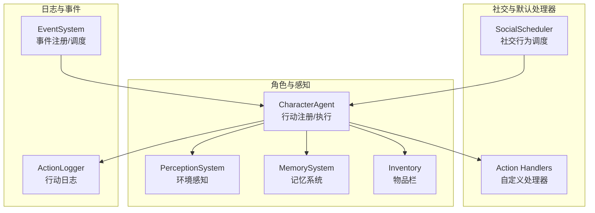
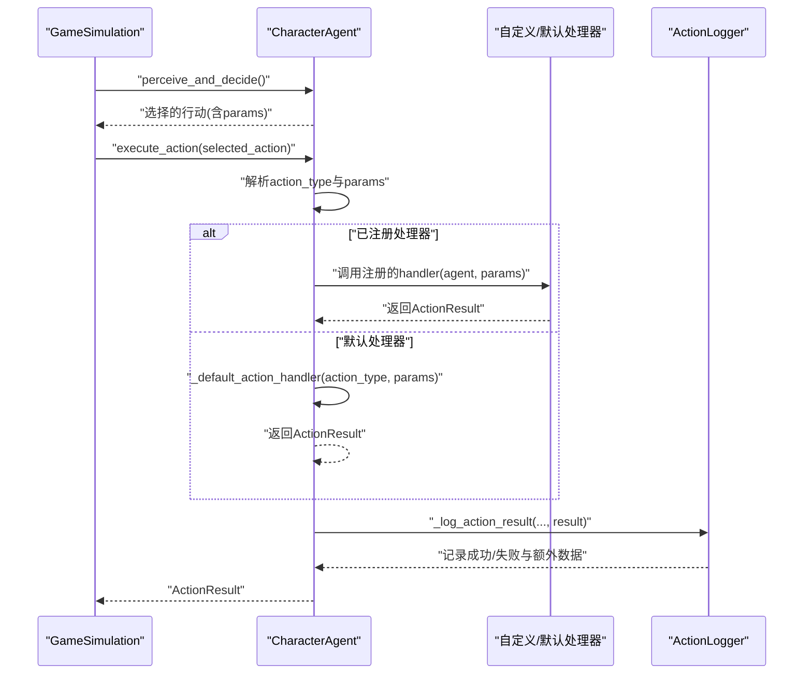
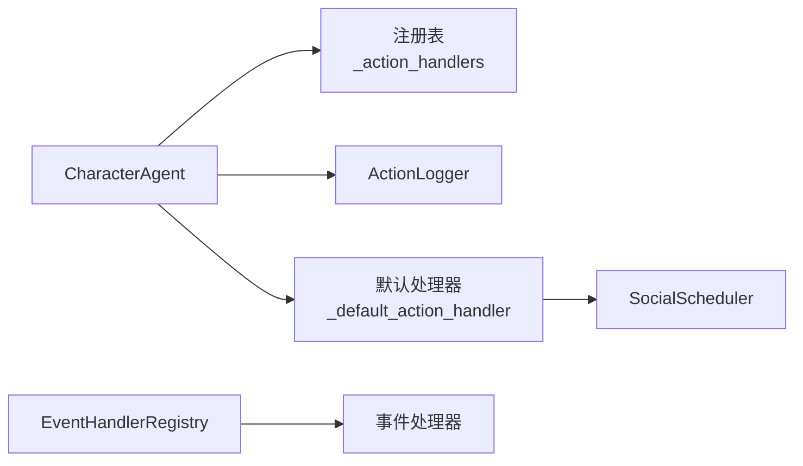

# Agent行为扩展

<cite>
**本文档引用的文件**
- [core_engine/character/agent.py](file://core_engine/character/agent.py)
- [core_engine/character/action_logger.py](file://core_engine/character/action_logger.py)
- [core_engine/social/social_scheduler.py](file://core_engine/social/social_scheduler.py)
- [core_engine/social/social_handlers.py](file://core_engine/social/social_handlers.py)
- [core_engine/event_system/handlers.py](file://core_engine/event_system/handlers.py)
- [core_engine/event_system/event_queue.py](file://core_engine/event_system/event_queue.py)
- [api_server/models.py](file://api_server/models.py)
- [run_simulation.py](file://run_simulation.py)
</cite>

## 目录
1. [简介](#简介)
2. [项目结构](#项目结构)
3. [核心组件](#核心组件)
4. [架构总览](#架构总览)
5. [详细组件分析](#详细组件分析)
6. [依赖关系分析](#依赖关系分析)
7. [性能考量](#性能考量)
8. [故障排查指南](#故障排查指南)
9. [结论](#结论)

## 简介
本指南面向希望为 CharacterAgent 扩展自定义行为的开发者，重点围绕 register_action_handler 方法的使用方式与最佳实践展开，涵盖：
- action 参数的定义与命名规范
- handler 回调函数的签名、返回值格式与 ActionResult 构造
- 异步处理、参数验证、错误处理策略
- 复杂行动逻辑的实现模式、多步骤任务分解与条件判断
- 行动优先级与冲突解决机制
- 性能优化技巧
- 默认行动处理器的工作原理与扩展点

## 项目结构
Agent 行为扩展涉及以下关键模块：
- CharacterAgent：核心角色控制器，负责感知、决策与行动执行，并提供 register_action_handler 注册接口
- ActionLogger：行动日志记录与查询，支撑调试与可视化
- SocialScheduler：社交行为调度器，提供默认社交类行动处理器
- EventSystem：事件系统与处理器注册机制，支持事件驱动的扩展
- 数据模型：ActionLog 等数据库模型，承载日志持久化

图表来源
- [core_engine/character/agent.py](file://core_engine/character/agent.py#L116-L180)
- [core_engine/character/action_logger.py](file://core_engine/character/action_logger.py#L89-L120)
- [core_engine/social/social_scheduler.py](file://core_engine/social/social_scheduler.py#L47-L66)
- [core_engine/event_system/handlers.py](file://core_engine/event_system/handlers.py#L50-L84)

章节来源
- [core_engine/character/agent.py](file://core_engine/character/agent.py#L116-L180)
- [core_engine/character/action_logger.py](file://core_engine/character/action_logger.py#L89-L120)
- [core_engine/social/social_scheduler.py](file://core_engine/social/social_scheduler.py#L47-L66)
- [core_engine/event_system/handlers.py](file://core_engine/event_system/handlers.py#L50-L84)

## 核心组件
- CharacterAgent
  - 提供 register_action_handler(action: str, handler: Callable[[CharacterAgent, Dict], Awaitable[ActionResult]]) 方法注册自定义行动处理器
  - execute_action(action: Dict[str, Any]) 负责执行行动，优先调用已注册处理器，否则回落到默认处理器
  - _default_action_handler(action_type: str, params: Dict[str, Any]) 实现默认行动逻辑（如 wait、rest、move_to、use_phone 等）

- ActionResult
  - 行动结果的数据结构，包含 success、action、message、duration、data 等字段，用于统一返回格式与日志记录

- ActionLogger
  - 记录行动日志，支持按类型映射与查询，便于调试与可视化

- SocialScheduler
  - 提供默认社交类行动（浏览帖子、发帖、查看私信、使用手机等）的实现，可作为自定义处理器的参考模板

章节来源
- [core_engine/character/agent.py](file://core_engine/character/agent.py#L107-L114)
- [core_engine/character/agent.py](file://core_engine/character/agent.py#L176-L180)
- [core_engine/character/agent.py](file://core_engine/character/agent.py#L479-L522)
- [core_engine/character/agent.py](file://core_engine/character/agent.py#L574-L800)
- [core_engine/character/action_logger.py](file://core_engine/character/action_logger.py#L32-L82)
- [core_engine/character/action_logger.py](file://core_engine/character/action_logger.py#L103-L161)
- [core_engine/social/social_scheduler.py](file://core_engine/social/social_scheduler.py#L69-L109)

## 架构总览
下图展示了 CharacterAgent 的行动执行流程，以及自定义处理器与默认处理器的协作关系。

图表来源
- [core_engine/character/agent.py](file://core_engine/character/agent.py#L358-L478)
- [core_engine/character/agent.py](file://core_engine/character/agent.py#L479-L566)
- [core_engine/character/action_logger.py](file://core_engine/character/action_logger.py#L103-L161)

章节来源
- [core_engine/character/agent.py](file://core_engine/character/agent.py#L358-L566)
- [core_engine/character/action_logger.py](file://core_engine/character/action_logger.py#L103-L161)

## 详细组件分析

### register_action_handler 方法详解
- 方法签名
  - register_action_handler(action: str, handler: Callable[[CharacterAgent, Dict], Awaitable[ActionResult]])
  - action：字符串标识，对应 execute_action 接收到的 action_type
  - handler：异步回调，接收 agent 实例与 params 字典，返回 Awaitable[ActionResult]

- 使用要点
  - action 名称需与 execute_action 传入的 action['action'] 一致
  - handler 必须返回 ActionResult，其中 duration 用于消耗游戏时间，success 控制是否计入今日事件与日志成功标记
  - handler 应进行参数校验与边界检查，必要时返回失败结果以避免异常传播

- 示例路径
  - 注册接口定义：[register_action_handler](file://core_engine/character/agent.py#L176-L180)
  - 行动执行与处理器调用：[execute_action](file://core_engine/character/agent.py#L479-L522)

章节来源
- [core_engine/character/agent.py](file://core_engine/character/agent.py#L176-L180)
- [core_engine/character/agent.py](file://core_engine/character/agent.py#L479-L522)

### ActionResult 数据结构与构造
- 字段说明
  - success: 是否成功
  - action: 行动类型标识
  - message: 行动结果描述
  - duration: 消耗的游戏时间（分钟）
  - data: 额外数据（如位置、帖子ID等）

- 构造建议
  - 成功路径：success=True，message 描述明确，duration 合理
  - 失败路径：success=False，message 提供原因，duration 仍应有意义（如1）
  - data 中包含后续处理所需的键值，便于日志与UI展示

- 示例路径
  - ActionResult 定义：[ActionResult](file://core_engine/character/agent.py#L107-L114)
  - 日志记录时使用 data：[log_action 调用](file://core_engine/character/agent.py#L550-L565)

章节来源
- [core_engine/character/agent.py](file://core_engine/character/agent.py#L107-L114)
- [core_engine/character/agent.py](file://core_engine/character/agent.py#L550-L565)

### 默认行动处理器工作原理与扩展点
- 默认处理器覆盖范围
  - wait、rest、look_around、move_to/move、browse_posts、create_post、check_messages、use_phone、send_message、view_user_profile 等
- 扩展点
  - 可在自定义处理器中复用默认处理器的部分逻辑（例如移动后的定位更新），再叠加业务规则
  - 可通过 ActionLogger 的日志类型映射，将自定义 action 映射到合适的 ActionType

- 示例路径
  - 默认处理器实现：[_default_action_handler](file://core_engine/character/agent.py#L574-L800)
  - 日志类型映射：[_log_action_result 类型映射](file://core_engine/character/agent.py#L523-L546)

章节来源
- [core_engine/character/agent.py](file://core_engine/character/agent.py#L574-L800)
- [core_engine/character/agent.py](file://core_engine/character/agent.py#L523-L546)

### 自定义行动处理器实现模式

#### 异步处理与参数验证
- 异步处理
  - handler 必须声明为 async，内部可调用数据库、网络或LLM接口
- 参数验证
  - 校验 params 中必需字段是否存在与类型正确
  - 对于外部依赖（如世界、社交系统），先检查引用是否存在，再决定返回失败还是降级处理

- 示例路径
  - 社交行为调度器中的异步调用：[use_phone/browe_feed/create_post](file://core_engine/social/social_scheduler.py#L69-L109)

章节来源
- [core_engine/social/social_scheduler.py](file://core_engine/social/social_scheduler.py#L69-L109)

#### ActionResult 构造与错误处理
- 成功返回
  - success=True，message 描述结果，duration 合理，data 包含必要上下文
- 失败返回
  - success=False，message 说明原因，duration 仍应有意义
- 错误处理
  - 捕获异常并返回失败 ActionResult，避免抛出异常导致模拟中断

- 示例路径
  - 社交行为结果 SocialActionResult：[SocialActionResult](file://core_engine/social/social_scheduler.py#L37-L45)

章节来源
- [core_engine/social/social_scheduler.py](file://core_engine/social/social_scheduler.py#L37-L45)

#### 复杂行动逻辑与多步骤任务分解
- 分步执行
  - 将复杂行动拆分为多个子步骤，逐步构造 ActionResult 并记录中间结果
- 条件判断
  - 根据 agent 的状态（如疲劳度）、环境（如室内/室外）与参数动态调整行为
- 示例路径
  - 使用手机的综合行为：[use_phone](file://core_engine/social/social_scheduler.py#L69-L109)
  - 浏览帖子并决策点赞/评论：[browse_feed](file://core_engine/social/social_scheduler.py#L110-L224)

章节来源
- [core_engine/social/social_scheduler.py](file://core_engine/social/social_scheduler.py#L69-L224)

### 行动优先级与冲突解决机制
- 事件优先级与冲突检测
  - 事件系统通过优先队列管理事件，支持冲突检测（check_conflict），返回冲突事件列表
  - 冲突解决策略可基于优先级、资源占用与时间窗口进行排序与合并
- 行动执行时机
  - 模拟器在角色完成行动后触发下一次决策，避免并发冲突
- 示例路径
  - 冲突检测实现：[check_conflict](file://core_engine/event_system/event_queue.py#L154-L165)

章节来源
- [core_engine/event_system/event_queue.py](file://core_engine/event_system/event_queue.py#L154-L165)

### 性能优化技巧
- 减少不必要的外部调用
  - 缓存常用数据（如世界位置、用户信息），避免重复查询
- 合理设置 duration
  - duration 影响疲劳度消耗与时间推进，应与实际业务耗时匹配
- 异步批处理
  - 对多个相似操作（如批量点赞/评论）采用异步并发，注意限流与速率控制
- 日志与调试
  - 使用 ActionLogger 记录关键路径，便于定位性能瓶颈

## 依赖关系分析
- Agent 与处理器
  - CharacterAgent 通过 _action_handlers 字典维护处理器映射
  - execute_action 根据 action_type 选择处理器，保证低耦合与高扩展性
- Agent 与日志
  - _log_action_result 将 ActionResult 转换为 ActionLogEntry 并持久化
- Agent 与社交系统
  - 默认处理器部分依赖 SocialScheduler，可作为自定义处理器的参考模板
- 事件系统
  - EventHandlerRegistry 提供事件处理器注册与调度，支持扩展新的事件类型

图表来源
- [core_engine/character/agent.py](file://core_engine/character/agent.py#L169-L180)
- [core_engine/character/agent.py](file://core_engine/character/agent.py#L479-L566)
- [core_engine/character/action_logger.py](file://core_engine/character/action_logger.py#L103-L161)
- [core_engine/social/social_scheduler.py](file://core_engine/social/social_scheduler.py#L47-L66)
- [core_engine/event_system/handlers.py](file://core_engine/event_system/handlers.py#L50-L84)

章节来源
- [core_engine/character/agent.py](file://core_engine/character/agent.py#L169-L180)
- [core_engine/character/agent.py](file://core_engine/character/agent.py#L479-L566)
- [core_engine/character/action_logger.py](file://core_engine/character/action_logger.py#L103-L161)
- [core_engine/social/social_scheduler.py](file://core_engine/social/social_scheduler.py#L47-L66)
- [core_engine/event_system/handlers.py](file://core_engine/event_system/handlers.py#L50-L84)

## 性能考量
- 行动耗时估算
  - duration 应与实际业务逻辑相符，避免过短导致频繁决策，或过长导致时间推进缓慢
- 资源竞争
  - 对共享资源（如数据库、LLM）进行限流与重试，防止阻塞
- 日志开销
  - 大量日志写入会影响性能，建议仅记录关键路径与错误场景
- 事件调度
  - 合理设置事件优先级与冲突检测，减少无效重调度

## 故障排查指南
- 常见问题
  - 注册的处理器不生效：确认 action 名称与 execute_action 传入的 action['action'] 完全一致
  - handler 抛出异常：确保 handler 内部捕获异常并返回失败 ActionResult
  - 日志缺失：检查 ActionLogger 是否有数据库会话，以及 log_action 的返回值
- 调试建议
  - 使用 run_simulation 的回调打印当前行动与耗时
  - 通过 ActionLogger 查询最近日志，核对 action_type、duration 与 extra_data
- 示例路径
  - 回调打印：[on_action_start/on_action_end](file://run_simulation.py#L37-L46)
  - 日志查询接口：[get_recent_logs/get_character_logs](file://core_engine/character/action_logger.py#L336-L466)

章节来源
- [run_simulation.py](file://run_simulation.py#L37-L46)
- [core_engine/character/action_logger.py](file://core_engine/character/action_logger.py#L336-L466)

## 结论
通过 register_action_handler，开发者可以灵活扩展 CharacterAgent 的行为能力。建议遵循以下原则：
- 明确 action 名称与参数约定，保持处理器职责单一
- 统一使用 ActionResult 返回，确保日志与模拟器正确处理
- 在处理器中进行充分的参数验证与错误处理，必要时回落到默认处理器
- 参考 SocialScheduler 的实现模式，将复杂行动拆分为可维护的子步骤
- 利用事件系统与冲突检测机制，合理安排行动优先级与并发控制