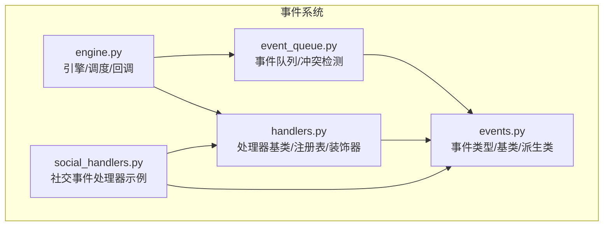
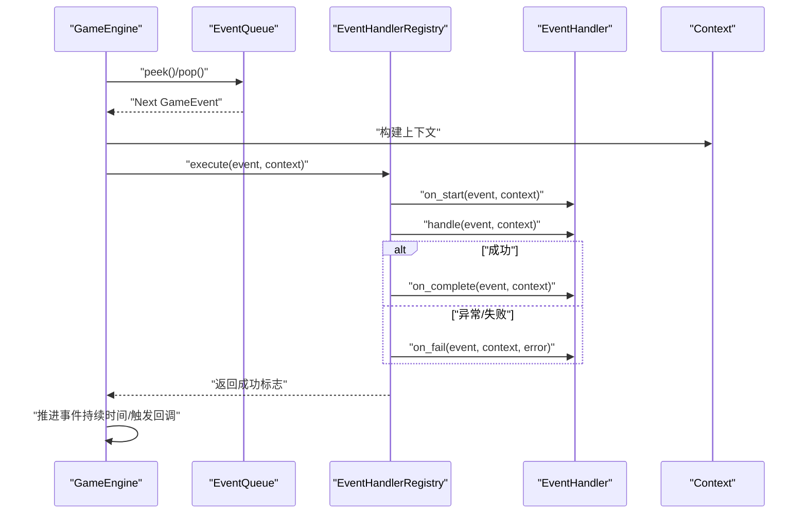
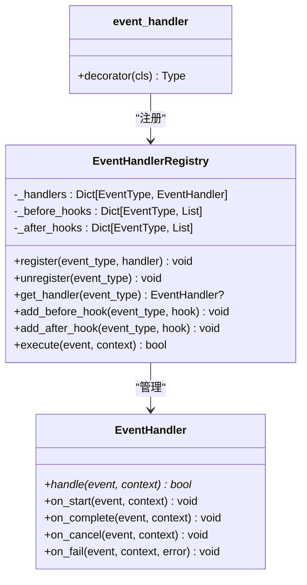
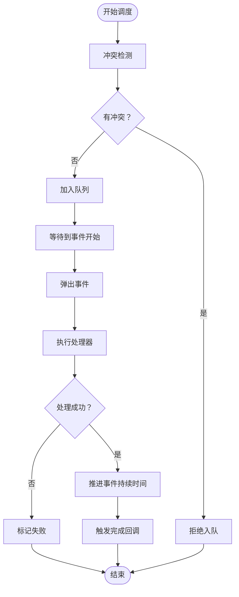
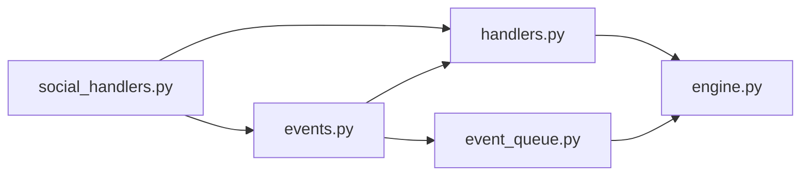

# 事件处理器扩展

<cite>
**本文引用的文件**
- [events.py](file://core_engine/event_system/events.py)
- [handlers.py](file://core_engine/event_system/handlers.py)
- [event_queue.py](file://core_engine/event_system/event_queue.py)
- [engine.py](file://core_engine/engine.py)
- [social_handlers.py](file://core_engine/social/social_handlers.py)
- [__init__.py](file://core_engine/event_system/__init__.py)
</cite>

## 目录
1. [简介](#简介)
2. [项目结构](#项目结构)
3. [核心组件](#核心组件)
4. [架构总览](#架构总览)
5. [详细组件分析](#详细组件分析)
6. [依赖关系分析](#依赖关系分析)
7. [性能考量](#性能考量)
8. [故障排查指南](#故障排查指南)
9. [结论](#结论)
10. [附录](#附录)

## 简介
本指南面向希望扩展事件系统的开发者，系统性讲解事件类型定义与分类、事件处理器注册与实现、事件调度机制、优先级与传播、以及日志、错误处理与性能监控最佳实践。文档基于仓库中的事件系统实现，覆盖枚举定义、事件模型、处理器基类与注册表、事件队列与调度器，并给出同步与异步处理示例与流程图。

## 项目结构
事件系统位于 core_engine/event_system 目录，主要文件：
- events.py：事件类型、事件基类与派生类、优先级与状态枚举
- handlers.py：事件处理器抽象基类、注册表、便捷装饰器
- event_queue.py：基于优先队列的事件调度与冲突检测
- engine.py：游戏引擎，整合事件队列与处理器执行
- social_handlers.py：社交事件处理器示例（使用装饰器注册）
- __init__.py：事件系统导出入口

图表来源
- [events.py](file://core_engine/event_system/events.py#L13-L356)
- [handlers.py](file://core_engine/event_system/handlers.py#L12-L156)
- [event_queue.py](file://core_engine/event_system/event_queue.py#L29-L244)
- [engine.py](file://core_engine/engine.py#L167-L429)
- [social_handlers.py](file://core_engine/social/social_handlers.py#L18-L253)

章节来源
- [events.py](file://core_engine/event_system/events.py#L1-L356)
- [handlers.py](file://core_engine/event_system/handlers.py#L1-L156)
- [event_queue.py](file://core_engine/event_system/event_queue.py#L1-L244)
- [engine.py](file://core_engine/engine.py#L1-L429)
- [social_handlers.py](file://core_engine/social/social_handlers.py#L1-L253)
- [__init__.py](file://core_engine/event_system/__init__.py#L1-L21)

## 核心组件
- 事件类型与分类
  - EventType：个人事件、集体事件、突发事件三类枚举值
  - EventPriority：优先级（数值越小优先级越高）
  - EventStatus：事件状态（待执行、进行中、已完成、已取消、失败）
- 事件模型
  - GameEvent：事件基类，包含类型、角色、时间、持续、优先级、状态、数据等
  - 派生类：PersonalEvent、CollectiveEvent、EmergencyEvent，提供便捷构造方法
- 处理器体系
  - EventHandler：抽象基类，定义 handle、on_start/on_complete/on_cancel/on_fail 生命周期回调
  - EventHandlerRegistry：单例注册表，维护事件类型到处理器映射，支持前后置钩子
  - event_handler：装饰器，简化处理器注册
- 事件队列
  - EventQueue：基于堆的优先队列，支持冲突检测、懒删除、按角色筛选、重排等
- 引擎集成
  - GameEngine：主循环推进时间、调度事件、执行处理器、触发回调、状态持久化

章节来源
- [events.py](file://core_engine/event_system/events.py#L13-L356)
- [handlers.py](file://core_engine/event_system/handlers.py#L12-L156)
- [event_queue.py](file://core_engine/event_system/event_queue.py#L29-L244)
- [engine.py](file://core_engine/engine.py#L167-L429)

## 架构总览
事件系统采用“事件模型 + 处理器注册表 + 事件队列 + 引擎调度”的分层设计。引擎在主循环中根据时间推进事件，通过注册表定位处理器并执行，最终更新事件状态与统计信息。

图表来源
- [engine.py](file://core_engine/engine.py#L343-L382)
- [handlers.py](file://core_engine/event_system/handlers.py#L99-L137)

## 详细组件分析

### 事件类型与分类
- EventType
  - 个人事件：工作、等待、睡眠、拍照、发帖、看手机、移动
  - 集体事件：线下群聊、网络群聊、网络私聊
  - 突发事件：相遇、疲劳警告、视觉事件、声音事件
- EventPriority
  - 数值越小优先级越高：紧急事件、高优先级、普通、低优先级、后台任务
- EventStatus
  - 事件生命周期状态：待执行、进行中、已完成、已取消、失败
- GameEvent
  - 关键属性：事件类型、角色ID、计划时间、持续时间、优先级、状态、数据、创建时间
  - 比较规则：先按计划时间，再按优先级排序
  - 序列化：to_dict/from_dict
- 派生类与便捷构造
  - PersonalEvent：工作、睡眠、拍照、发帖、看手机、移动
  - CollectiveEvent：线下/群聊/私聊，含参与者列表与最大轮次
  - EmergencyEvent：相遇、疲劳警告等，支持可否打断

章节来源
- [events.py](file://core_engine/event_system/events.py#L13-L356)

### 事件处理器注册与执行
- EventHandler 抽象基类
  - 必须实现 handle(event, context) -> bool
  - 可覆写 on_start/on_complete/on_cancel/on_fail 更新状态
- EventHandlerRegistry
  - 单例，维护 event_type -> handler 映射
  - 支持注册/注销/获取处理器
  - 支持 before/after 钩子列表，执行顺序：前置钩子 -> 处理器 -> 后置钩子
  - execute 流程：查找处理器 -> 前置钩子 -> on_start -> handle -> 成功则 on_complete，否则 on_fail -> 后置钩子
- event_handler 装饰器
  - 用法：@event_handler(EventType.XXX) class XHandler(EventHandler): ...

图表来源
- [handlers.py](file://core_engine/event_system/handlers.py#L12-L156)

章节来源
- [handlers.py](file://core_engine/event_system/handlers.py#L12-L156)

### 事件队列与调度
- EventQueue
  - 基于堆的优先队列，元素为带排序键的包装器
  - 排序键：(scheduled_time, priority.value, id)
  - 支持：添加、取消（懒删除）、查看队首、弹出、按时间范围取事件、按角色筛选、冲突检测、重排
  - 冲突检测：同一角色在时间区间内不可重叠
- GameEngine 调度
  - schedule_event：冲突检测，无冲突才入队
  - 主循环：等待暂停 -> peek -> 时间推进到事件开始 -> pop -> _execute_event -> 推进事件持续时间 -> 触发回调
  - _execute_event：构建上下文（引擎、时间、状态、可选数据库会话）-> 注册表执行 -> 成功计数+推进时间 -> 触发完成回调

图表来源
- [engine.py](file://core_engine/engine.py#L211-L227)
- [engine.py](file://core_engine/engine.py#L288-L382)
- [event_queue.py](file://core_engine/event_system/event_queue.py#L46-L214)

章节来源
- [event_queue.py](file://core_engine/event_system/event_queue.py#L29-L244)
- [engine.py](file://core_engine/engine.py#L211-L382)

### 事件处理器实现示例
- 同步/异步处理
  - handlers.py 中的 handle 方法声明为异步，便于执行异步操作（如网络请求、数据库访问）
  - 示例处理器：UsePhoneHandler、PostContentHandler、OnlinePrivateChatHandler、EncounterHandler
- 事件参数与返回值
  - 参数：event（包含类型、角色、时间、数据等）、context（引擎、时间、状态、可选db会话）
  - 返回值：bool 表示处理是否成功；失败时 on_fail 会将状态置为 FAILED
- 事件数据更新
  - 处理器可在 event.data 中写入结果、中间状态，供后续钩子或日志使用

章节来源
- [handlers.py](file://core_engine/event_system/handlers.py#L19-L47)
- [social_handlers.py](file://core_engine/social/social_handlers.py#L18-L206)

### 事件优先级、事件链与事件传播
- 优先级
  - EventPriority：数值越小优先级越高；队列按 (scheduled_time, priority.value, id) 排序
- 事件链
  - 事件完成后，若 event.duration > 0，引擎会推进相应分钟数，形成“事件链”
- 事件传播
  - 注册表支持 before/after 钩子，可在事件处理前后注入横切逻辑（如日志、缓存、关系更新）

章节来源
- [events.py](file://core_engine/event_system/events.py#L86-L96)
- [event_queue.py](file://core_engine/event_system/event_queue.py#L20-L26)
- [engine.py](file://core_engine/engine.py#L364-L372)
- [handlers.py](file://core_engine/event_system/handlers.py#L85-L97)

### 自定义事件类型的创建
- 定义事件类型
  - 在 EventType 中新增枚举值
  - 在 events.py 中新增派生类或在现有派生类中添加便捷构造方法
- 实现处理器
  - 继承 EventHandler 并实现 handle
  - 使用 @event_handler 装饰器注册，或在模块导入时由装饰器自动注册
- 调度与测试
  - 使用 PersonalEvent/CollectiveEvent/EmergencyEvent 的便捷构造方法创建事件
  - 通过 GameEngine.schedule_event 入队并观察日志与状态变化

章节来源
- [events.py](file://core_engine/event_system/events.py#L13-L356)
- [handlers.py](file://core_engine/event_system/handlers.py#L140-L156)
- [social_handlers.py](file://core_engine/social/social_handlers.py#L216-L237)

## 依赖关系分析
- 模块耦合
  - engine.py 依赖 event_queue.py 与 handlers.py
  - handlers.py 依赖 events.py
  - event_queue.py 依赖 events.py
  - social_handlers.py 依赖 handlers.py 与 events.py
- 导出接口
  - 事件系统通过 __init__.py 导出常用类型与组件

图表来源
- [engine.py](file://core_engine/engine.py#L14-L16)
- [handlers.py](file://core_engine/event_system/handlers.py#L9)
- [event_queue.py](file://core_engine/event_system/event_queue.py#L10)
- [social_handlers.py](file://core_engine/social/social_handlers.py#L13-L15)
- [__init__.py](file://core_engine/event_system/__init__.py#L3-L8)

章节来源
- [engine.py](file://core_engine/engine.py#L14-L16)
- [handlers.py](file://core_engine/event_system/handlers.py#L9)
- [event_queue.py](file://core_engine/event_system/event_queue.py#L10)
- [social_handlers.py](file://core_engine/social/social_handlers.py#L13-L15)
- [__init__.py](file://core_engine/event_system/__init__.py#L3-L8)

## 性能考量
- 事件队列
  - 基于堆的 O(log N) 插入与弹出，适合高频调度
  - 懒删除策略减少堆重建开销
- 处理器执行
  - 异步处理避免阻塞主循环
  - 建议在处理器内部进行 I/O 并发（如批量数据库写入）
- 冲突检测
  - 同角色冲突检测为线性扫描，建议控制角色事件密度或使用更高效的数据结构
- 回调与钩子
  - 钩子应保持轻量，避免阻塞事件执行

[本节为通用指导，无需特定文件引用]

## 故障排查指南
- 无处理器注册
  - 现象：执行时打印“未注册处理器”警告
  - 排查：确认 @event_handler 装饰器已应用且模块被导入
- 处理失败
  - 现象：事件状态变为 FAILED
  - 排查：检查处理器内部异常捕获与 on_fail 回调
- 冲突导致无法入队
  - 现象：schedule_event 返回 None
  - 排查：检查角色事件时间区间重叠，调整计划时间或移除冲突事件
- 事件未执行
  - 现象：队列为空或时间未到
  - 排查：确认引擎处于运行状态，检查主循环与时间推进逻辑

章节来源
- [handlers.py](file://core_engine/event_system/handlers.py#L110-L113)
- [engine.py](file://core_engine/engine.py#L221-L226)
- [engine.py](file://core_engine/engine.py#L298-L303)

## 结论
事件系统提供了清晰的事件模型、灵活的处理器注册与执行机制、可靠的事件队列与冲突检测，以及完善的生命周期回调。通过装饰器与注册表，开发者可以快速扩展新的事件类型与处理器，结合钩子实现日志、监控与关系更新等横切关注点。遵循本文的实现规范与最佳实践，可获得稳定、可维护且高性能的事件驱动系统。

[本节为总结，无需特定文件引用]

## 附录

### 事件类型与优先级速查
- 个人事件：工作、等待、睡眠、拍照、发帖、看手机、移动
- 集体事件：线下群聊、网络群聊、网络私聊
- 突发事件：相遇、疲劳警告、视觉事件、声音事件
- 优先级：紧急事件 > 高优先级 > 普通 > 低优先级 > 后台任务

章节来源
- [events.py](file://core_engine/event_system/events.py#L13-L34)

### 处理器编写规范
- 必须实现 handle(event, context) -> bool
- 在 handle 中读取 event.data 并更新 event.data
- 返回 True 表示成功，否则失败（将触发 on_fail）
- 如需异步 I/O，确保 handle 为异步方法

章节来源
- [handlers.py](file://core_engine/event_system/handlers.py#L19-L31)

### 注册流程与示例
- 使用装饰器注册：@event_handler(EventType.XXX) + 继承 EventHandler
- 或在模块导入时由装饰器自动注册
- 示例处理器：UsePhoneHandler、PostContentHandler、OnlinePrivateChatHandler、EncounterHandler

章节来源
- [handlers.py](file://core_engine/event_system/handlers.py#L140-L156)
- [social_handlers.py](file://core_engine/social/social_handlers.py#L18-L206)