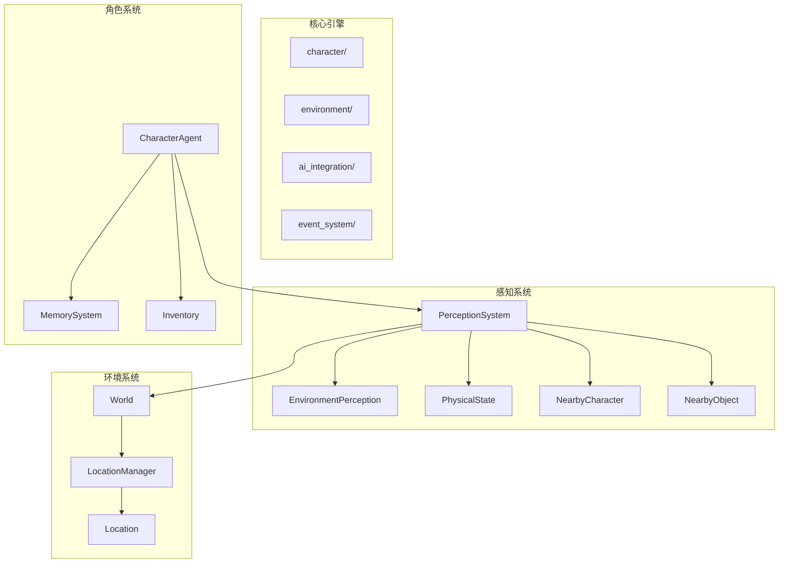
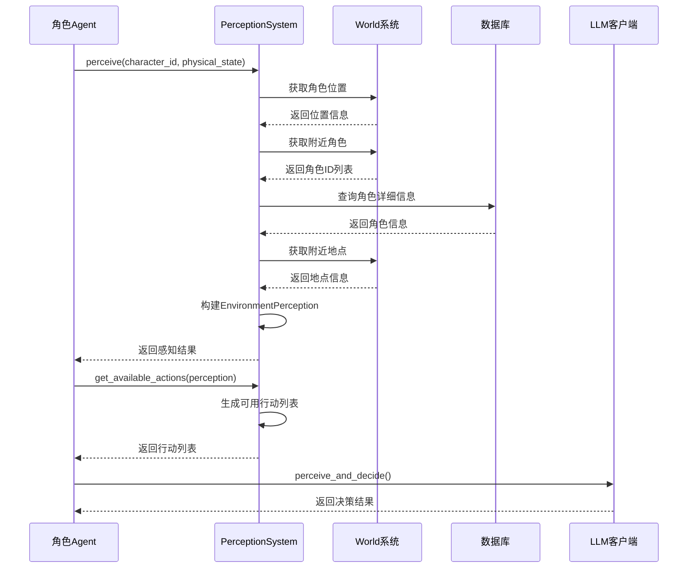
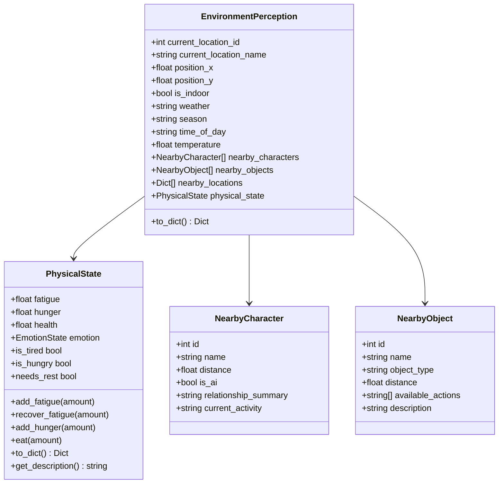
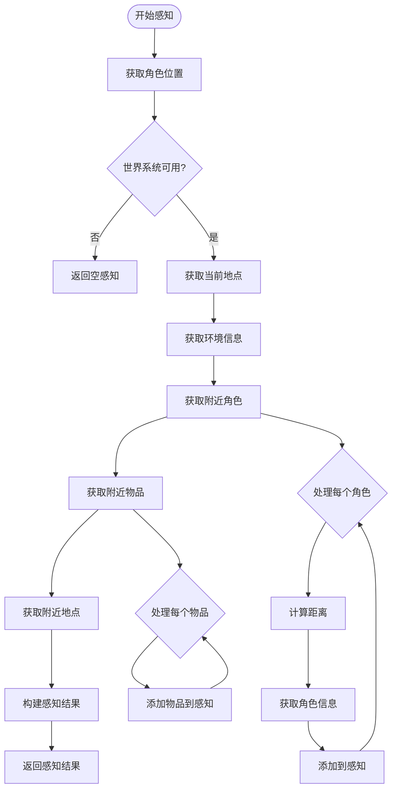
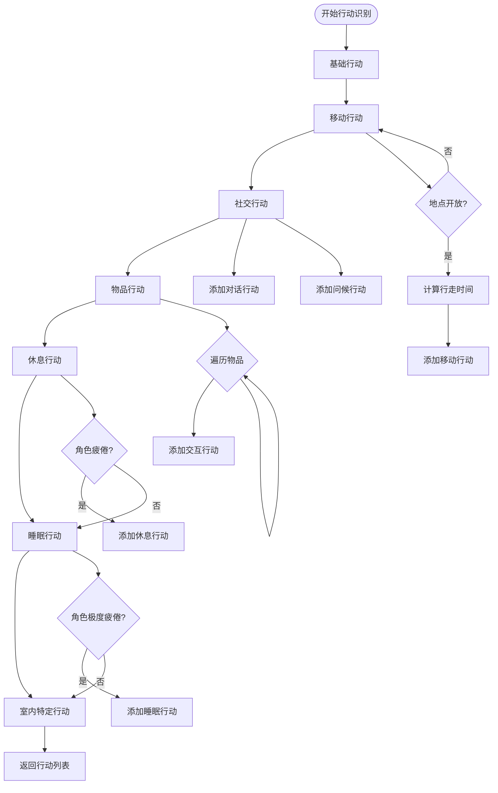
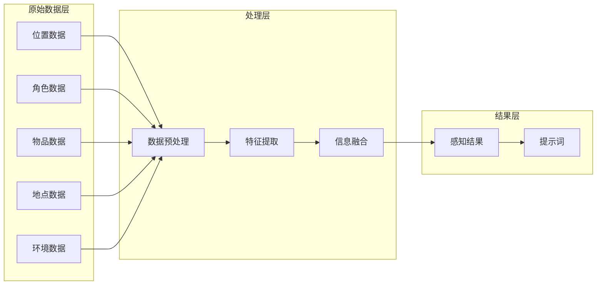
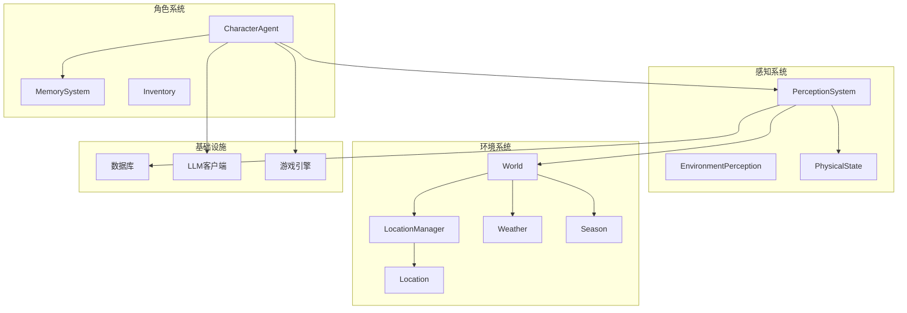

# 感知系统扩展

<cite>
**本文档引用的文件**
- [perception.py](file://core_engine/character/perception.py)
- [agent.py](file://core_engine/character/agent.py)
- [world.py](file://core_engine/environment/world.py)
- [locations.py](file://core_engine/environment/locations.py)
- [memory.py](file://core_engine/character/memory.py)
- [engine.py](file://core_engine/engine.py)
- [simulation.py](file://core_engine/simulation.py)
- [run_simulation.py](file://run_simulation.py)
- [README.md](file://README.md)
</cite>

## 目录
1. [简介](#简介)
2. [项目结构](#项目结构)
3. [核心组件](#核心组件)
4. [架构概览](#架构概览)
5. [详细组件分析](#详细组件分析)
6. [依赖关系分析](#依赖关系分析)
7. [性能考虑](#性能考虑)
8. [故障排除指南](#故障排除指南)
9. [结论](#结论)
10. [附录](#附录)

## 简介

本指南面向AI社区项目的感知系统扩展，重点围绕EnvironmentPerception的增强方法进行深入分析。感知系统是AI角色智能行为的核心基础，负责收集和处理环境信息，为决策提供依据。本文档将详细说明如何扩展感知能力，包括新感知类型的添加、感知范围的调整、感知精度的优化，以及可用行动的识别机制。

## 项目结构

AI社区项目采用模块化架构设计，感知系统位于核心引擎的character模块中，与环境系统、记忆系统、行动系统紧密协作。

**图表来源**
- [perception.py](file://core_engine/character/perception.py#L211-L328)
- [world.py](file://core_engine/environment/world.py#L93-L121)
- [agent.py](file://core_engine/character/agent.py#L116-L175)

**章节来源**
- [README.md](file://README.md#L1-L35)
- [perception.py](file://core_engine/character/perception.py#L1-L528)

## 核心组件

感知系统由多个核心组件构成，每个组件承担特定的功能职责：

### EnvironmentPerception 数据结构
EnvironmentPerception是感知系统的核心数据结构，封装了角色感知到的所有环境信息。该结构包含位置信息、环境条件、周围对象、身体状态等关键要素。

### PerceptionSystem 感知引擎
PerceptionSystem是感知系统的主要执行组件，负责收集、处理和组织环境信息。它通过与世界系统交互获取实时环境数据，并将其转换为AI可理解的格式。

### PhysicalState 身体状态
PhysicalState管理角色的生理状态，包括疲劳值、饥饿值、健康值和情绪状态。这些状态直接影响角色的行为决策和感知优先级。

**章节来源**
- [perception.py](file://core_engine/character/perception.py#L149-L208)
- [perception.py](file://core_engine/character/perception.py#L211-L328)
- [perception.py](file://core_engine/character/perception.py#L25-L87)

## 架构概览

感知系统采用分层架构设计，确保各组件间的松耦合和高内聚。

**图表来源**
- [agent.py](file://core_engine/character/agent.py#L358-L477)
- [perception.py](file://core_engine/character/perception.py#L226-L328)

## 详细组件分析

### EnvironmentPerception 数据结构分析

EnvironmentPerception采用数据类设计，提供了清晰的层次结构和丰富的元数据。

**图表来源**
- [perception.py](file://core_engine/character/perception.py#L149-L208)
- [perception.py](file://core_engine/character/perception.py#L25-L87)
- [perception.py](file://core_engine/character/perception.py#L127-L146)

### PerceptionSystem 核心算法分析

PerceptionSystem的感知算法采用多阶段处理策略，确保信息收集的完整性和准确性。

**图表来源**
- [perception.py](file://core_engine/character/perception.py#L226-L328)
- [perception.py](file://core_engine/character/perception.py#L268-L303)

### 可用行动识别机制

可用行动的识别是感知系统的关键功能，通过get_available_actions方法实现。

**图表来源**
- [perception.py](file://core_engine/character/perception.py#L395-L527)

**章节来源**
- [perception.py](file://core_engine/character/perception.py#L395-L527)

### 环境信息收集和处理

环境信息的收集和处理涉及多个层次的数据处理和特征提取。

**图表来源**
- [perception.py](file://core_engine/character/perception.py#L320-L393)

**章节来源**
- [perception.py](file://core_engine/character/perception.py#L320-L393)

## 依赖关系分析

感知系统的依赖关系体现了模块化设计的优势，各组件间保持适当的耦合度。

**图表来源**
- [perception.py](file://core_engine/character/perception.py#L218-L221)
- [world.py](file://core_engine/environment/world.py#L100-L121)
- [agent.py](file://core_engine/character/agent.py#L139-L143)

**章节来源**
- [perception.py](file://core_engine/character/perception.py#L218-L221)
- [world.py](file://core_engine/environment/world.py#L100-L121)
- [agent.py](file://core_engine/character/agent.py#L139-L143)

## 性能考虑

感知系统的性能优化是确保AI角色流畅运行的关键因素。

### 时间复杂度分析
- **感知收集**: O(n)，其中n为附近角色数量
- **距离计算**: O(1)每对角色
- **行动生成**: O(m)，其中m为可用行动数量
- **整体复杂度**: O(n + m)

### 内存管理策略
- **数据结构优化**: 使用dataclass减少内存开销
- **懒加载机制**: 延迟加载数据库查询结果
- **缓存策略**: 缓存常用的位置和状态信息
- **垃圾回收**: 及时清理不再使用的感知数据

### 实时性保证
- **异步处理**: 使用asyncio确保非阻塞操作
- **并发优化**: 并行处理多个角色的感知请求
- **时间跳跃**: 通过事件驱动模型实现高效的时间推进
- **资源池**: 复用LLM客户端连接

**章节来源**
- [simulation.py](file://core_engine/simulation.py#L220-L249)
- [engine.py](file://core_engine/engine.py#L288-L342)

## 故障排除指南

### 常见问题诊断

#### 感知数据缺失
**症状**: 角色无法感知到周围环境
**原因分析**:
- 世界系统未正确初始化
- 数据库连接失败
- 角色位置信息丢失

**解决方案**:
1. 检查世界系统初始化状态
2. 验证数据库连接配置
3. 确认角色位置数据完整性

#### 行动识别异常
**症状**: 可用行动列表不完整或错误
**原因分析**:
- 地点状态检查失败
- 角色关系记忆缺失
- 物品交互权限问题

**解决方案**:
1. 验证地点开放状态
2. 检查关系记忆系统
3. 确认物品权限配置

#### 性能问题
**症状**: 感知处理延迟过高
**原因分析**:
- 数据库查询过于频繁
- 距离计算复杂度高
- LLM调用阻塞

**解决方案**:
1. 实施查询缓存机制
2. 优化距离计算算法
3. 使用异步LLM调用

**章节来源**
- [perception.py](file://core_engine/character/perception.py#L305-L318)
- [agent.py](file://core_engine/character/agent.py#L358-L477)

## 结论

感知系统作为AI社区项目的核心基础设施，其扩展能力直接影响整个系统的智能化水平。通过本文档的分析，我们可以看到感知系统在架构设计、数据处理、行动识别等方面都具备良好的扩展性。

未来扩展方向建议：
1. **多模态感知**: 集成视觉、听觉等多模态传感器
2. **动态感知范围**: 根据情境调整感知范围和精度
3. **深度学习集成**: 使用神经网络提升感知准确性
4. **边缘计算优化**: 在客户端进行部分感知处理

## 附录

### 扩展指南实践

#### 新感知类型的添加步骤
1. **定义数据结构**: 扩展EnvironmentPerception类
2. **实现感知逻辑**: 在PerceptionSystem中添加处理方法
3. **更新行动识别**: 在get_available_actions中考虑新感知
4. **测试验证**: 确保新感知类型正常工作

#### 感知范围调整方法
- **静态调整**: 修改固定半径参数
- **动态调整**: 基于角色状态和情境调整
- **性能优化**: 实现空间索引加速查询

#### 感知精度优化技术
- **噪声过滤**: 实现数据清洗和去噪算法
- **特征选择**: 选择最重要的感知特征
- **机器学习**: 使用训练模型提升识别准确率

**章节来源**
- [perception.py](file://core_engine/character/perception.py#L149-L208)
- [perception.py](file://core_engine/character/perception.py#L226-L328)
- [perception.py](file://core_engine/character/perception.py#L395-L527)