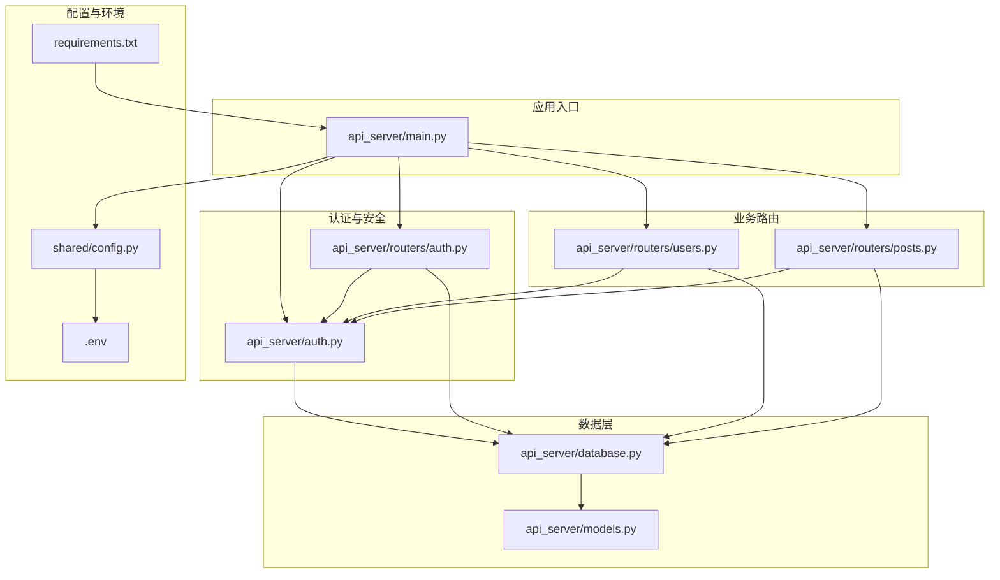
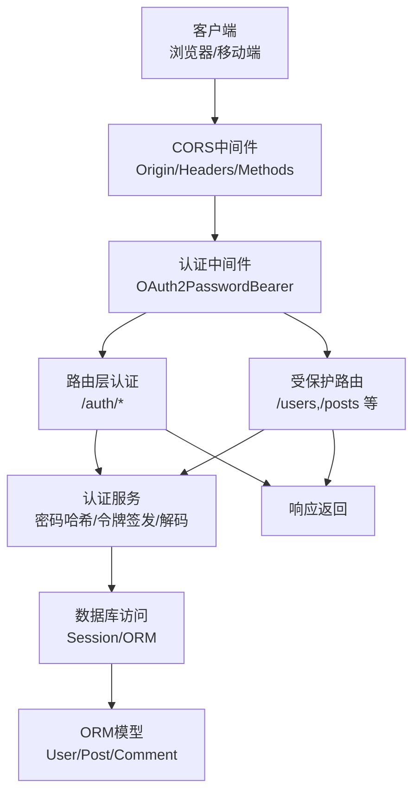
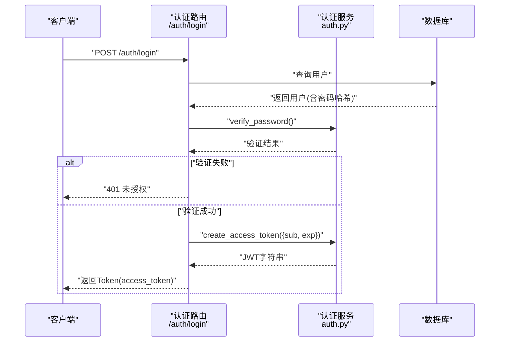
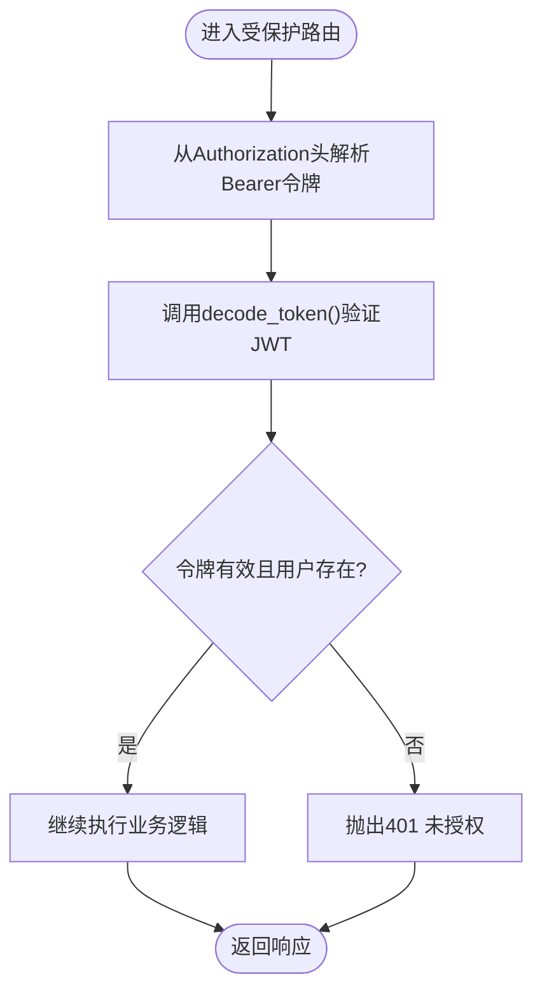
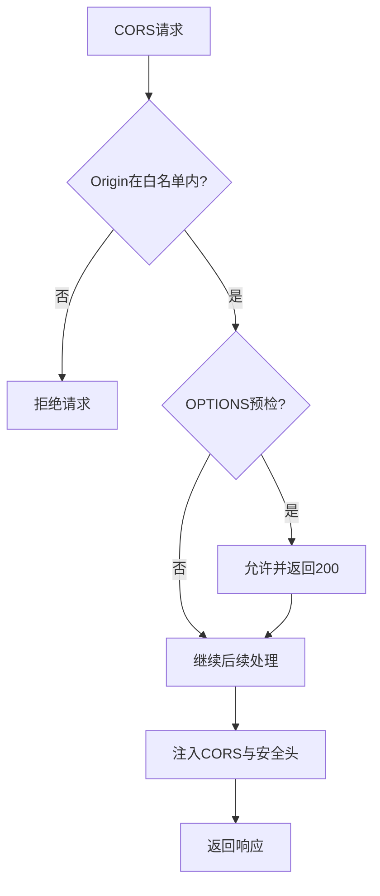
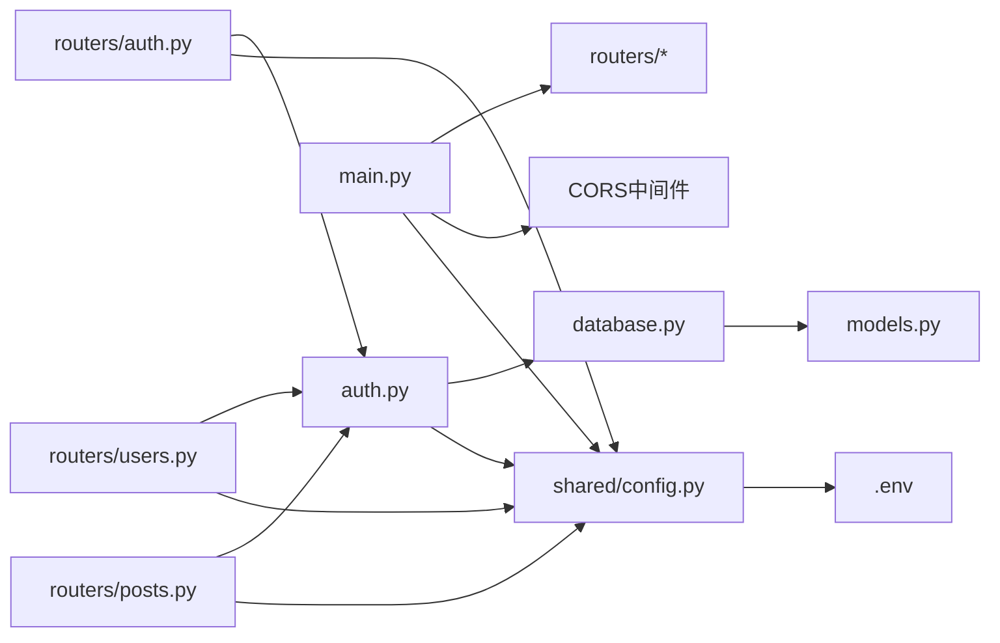

# API安全扩展

<cite>
**本文引用的文件**
- [api_server/main.py](file://api_server/main.py)
- [api_server/auth.py](file://api_server/auth.py)
- [api_server/routers/auth.py](file://api_server/routers/auth.py)
- [api_server/routers/users.py](file://api_server/routers/users.py)
- [api_server/routers/posts.py](file://api_server/routers/posts.py)
- [api_server/database.py](file://api_server/database.py)
- [api_server/models.py](file://api_server/models.py)
- [api_server/schemas.py](file://api_server/schemas.py)
- [shared/config.py](file://shared/config.py)
- [.env](file://.env)
- [requirements.txt](file://requirements.txt)
</cite>

## 目录
1. [引言](#引言)
2. [项目结构](#项目结构)
3. [核心组件](#核心组件)
4. [架构总览](#架构总览)
5. [详细组件分析](#详细组件分析)
6. [依赖关系分析](#依赖关系分析)
7. [性能考量](#性能考量)
8. [故障排查指南](#故障排查指南)
9. [结论](#结论)
10. [附录](#附录)

## 引言
本指南面向AI社区项目的API安全扩展开发，围绕以下目标展开：增强JWT令牌的生成与验证、完善用户认证中间件与权限控制、扩展CORS配置（白名单、预检与安全头）、强化输入验证与防护（SQL注入、XSS、CSRF）、实现速率限制与防滥用（IP限制、频率控制、黑名单）、HTTPS与安全头最佳实践、API文档安全与审计日志。内容基于现有代码库进行深入分析，并提供可落地的扩展建议与图示。

## 项目结构
后端采用FastAPI框架，按功能模块组织路由，认证与鉴权逻辑集中在独立模块，配置通过环境变量与Pydantic Settings集中管理。数据库连接与ORM模型位于独立模块，便于统一接入安全中间件与权限校验。

图表来源
- [api_server/main.py](file://api_server/main.py#L1-L69)
- [api_server/auth.py](file://api_server/auth.py#L1-L89)
- [api_server/routers/auth.py](file://api_server/routers/auth.py#L1-L78)
- [api_server/routers/users.py](file://api_server/routers/users.py#L1-L57)
- [api_server/routers/posts.py](file://api_server/routers/posts.py#L1-L166)
- [api_server/database.py](file://api_server/database.py#L1-L33)
- [api_server/models.py](file://api_server/models.py#L1-L293)
- [shared/config.py](file://shared/config.py#L1-L52)
- [.env](file://.env#L1-L30)
- [requirements.txt](file://requirements.txt#L1-L32)

章节来源
- [api_server/main.py](file://api_server/main.py#L1-L69)
- [shared/config.py](file://shared/config.py#L1-L52)
- [.env](file://.env#L1-L30)

## 核心组件
- 应用入口与CORS：在应用启动时注册CORS中间件，允许前端域名、本地开发端口等来源，支持凭据与通配方法/头。
- 认证与授权：基于OAuth2 Password Bearer与JWT，提供密码哈希、令牌签发与解码、当前用户解析；路由层通过依赖注入强制鉴权。
- 数据库与模型：统一的数据库引擎与Session工厂，ORM模型定义用户、帖子、评论等实体及关系。
- 配置中心：集中管理数据库、JWT、服务端口、前端地址、上传目录等参数，支持从.env加载。
- 输入验证：Pydantic模型定义请求/响应结构，内置长度、范围等约束，配合FastAPI自动校验。

章节来源
- [api_server/main.py](file://api_server/main.py#L23-L34)
- [api_server/auth.py](file://api_server/auth.py#L1-L89)
- [api_server/routers/auth.py](file://api_server/routers/auth.py#L1-L78)
- [api_server/database.py](file://api_server/database.py#L1-L33)
- [api_server/models.py](file://api_server/models.py#L1-L293)
- [api_server/schemas.py](file://api_server/schemas.py#L1-L166)
- [shared/config.py](file://shared/config.py#L1-L52)
- [.env](file://.env#L1-L30)

## 架构总览
下图展示API安全扩展的关键交互：CORS中间件、认证中间件（OAuth2 + JWT）、路由依赖注入、数据库访问与模型。

图表来源
- [api_server/main.py](file://api_server/main.py#L23-L34)
- [api_server/auth.py](file://api_server/auth.py#L1-L89)
- [api_server/routers/auth.py](file://api_server/routers/auth.py#L1-L78)
- [api_server/routers/users.py](file://api_server/routers/users.py#L1-L57)
- [api_server/routers/posts.py](file://api_server/routers/posts.py#L1-L166)
- [api_server/database.py](file://api_server/database.py#L1-L33)
- [api_server/models.py](file://api_server/models.py#L1-L293)

## 详细组件分析

### JWT令牌生成与验证
- 密码处理：使用bcrypt上下文进行哈希与验证，避免明文存储。
- 令牌签发：以用户ID为sub，附加过期时间，使用配置中的密钥与算法生成JWT。
- 令牌解码：使用相同密钥与算法验证签名，提取用户ID并查询用户对象。
- 当前用户解析：依赖注入获取令牌，解码后查询数据库，失败时抛出未授权异常。

图表来源
- [api_server/routers/auth.py](file://api_server/routers/auth.py#L45-L71)
- [api_server/auth.py](file://api_server/auth.py#L24-L56)

章节来源
- [api_server/auth.py](file://api_server/auth.py#L1-L89)
- [api_server/routers/auth.py](file://api_server/routers/auth.py#L1-L78)
- [shared/config.py](file://shared/config.py#L14-L17)
- [.env](file://.env#L8-L11)

### 用户认证中间件与权限控制
- OAuth2密码流：通过OAuth2PasswordBearer自动从Authorization头中提取Bearer令牌。
- 依赖注入：各受保护路由通过Depends(get_current_user)强制鉴权，未登录或无效令牌将被拒绝。
- 可选鉴权：get_current_user_optional允许匿名访问，用于公开接口（如列表页）。
- 权限边界：示例中对删除帖子增加了“仅作者可删”的业务权限校验。

图表来源
- [api_server/auth.py](file://api_server/auth.py#L58-L88)
- [api_server/routers/posts.py](file://api_server/routers/posts.py#L107-L128)

章节来源
- [api_server/auth.py](file://api_server/auth.py#L58-L88)
- [api_server/routers/users.py](file://api_server/routers/users.py#L25-L41)
- [api_server/routers/posts.py](file://api_server/routers/posts.py#L107-L128)

### CORS配置扩展（白名单、预检与安全头）
- 当前配置：允许前端URL、本地开发端口，支持凭据、通配方法与头。
- 扩展建议：
  - 白名单：将allow_origins改为动态读取，结合生产环境域名列表，避免通配。
  - 预检请求：保留通配headers/methods满足开发阶段，生产环境限定实际使用的头与方法。
  - 安全头：在应用层添加HTTP安全头（如Content-Security-Policy、Strict-Transport-Security），或由反向代理统一注入。

图表来源
- [api_server/main.py](file://api_server/main.py#L23-L34)

章节来源
- [api_server/main.py](file://api_server/main.py#L23-L34)

### 输入验证与防护
- Pydantic模型：对用户名、昵称、密码、内容等字段设置最小/最大长度与必填约束，减少脏数据进入数据库。
- SQL注入防护：当前使用SQLAlchemy ORM，避免原生SQL拼接；建议统一通过ORM查询、参数化绑定，禁止动态拼接SQL。
- XSS与CSRF：
  - XSS：对输出内容进行HTML转义或使用模板引擎默认转义；后端不直接渲染富文本，富文本处理应由前端负责。
  - CSRF：本项目为无状态API，主要依赖JWT Bearer认证，无需传统CSRF令牌；但需确保CORS白名单严格、禁用不必要凭据、安全头生效。

章节来源
- [api_server/schemas.py](file://api_server/schemas.py#L8-L166)
- [api_server/database.py](file://api_server/database.py#L14-L21)

### 速率限制与防滥用
- IP限制：在网关或反向代理层按IP限速（如Nginx limit_req），或在应用层维护内存级计数器（注意多实例部署需共享存储）。
- 请求频率控制：针对敏感端点（如登录）实施滑动窗口或令牌桶算法，结合Redis实现分布式限流。
- 黑名单管理：维护IP/用户ID黑名单，命中即拒绝请求并记录审计日志。

说明：当前仓库未包含速率限制实现，以上为扩展建议与通用模式。

### HTTPS配置与安全头
- HTTPS：在反向代理（如Nginx/Caddy）启用TLS，配置强密码套件与协议版本。
- 安全头：通过中间件或反向代理设置（建议反向代理统一设置）：
  - Content-Security-Policy
  - X-Frame-Options
  - X-Content-Type-Options
  - Strict-Transport-Security
  - Referrer-Policy
- 敏感数据保护：密钥、数据库密码等通过环境变量与只读文件管理，避免硬编码。

章节来源
- [.env](file://.env#L1-L30)
- [shared/config.py](file://shared/config.py#L14-L17)

### API文档安全与审计日志
- 文档安全：Swagger/ReDoc仅用于开发，生产关闭或限制访问。
- 审计日志：建议在认证与关键业务操作处记录操作人、时间、IP、操作类型、结果等，落库或写入日志系统；可复用现有ActionLog表结构或新增审计表。

说明：当前仓库未包含专门的审计日志实现，以上为扩展建议。

## 依赖关系分析
- 组件耦合：路由依赖认证模块与数据库会话；认证模块依赖配置与数据库；配置模块依赖环境变量。
- 外部依赖：FastAPI、SQLAlchemy、Pydantic、Passlib、python-jose等，均来自requirements.txt。

图表来源
- [api_server/routers/auth.py](file://api_server/routers/auth.py#L1-L78)
- [api_server/routers/users.py](file://api_server/routers/users.py#L1-L57)
- [api_server/routers/posts.py](file://api_server/routers/posts.py#L1-L166)
- [api_server/auth.py](file://api_server/auth.py#L1-L89)
- [api_server/database.py](file://api_server/database.py#L1-L33)
- [api_server/models.py](file://api_server/models.py#L1-L293)
- [api_server/main.py](file://api_server/main.py#L1-L69)
- [shared/config.py](file://shared/config.py#L1-L52)
- [.env](file://.env#L1-L30)

章节来源
- [requirements.txt](file://requirements.txt#L1-L32)

## 性能考量
- 连接池与回收：数据库连接池配置pool_pre_ping与pool_recycle，降低连接失效导致的异常。
- ORM查询优化：使用joinedload减少N+1查询；合理索引（如用户唯一索引、帖子时间索引）。
- 缓存策略：对热点读取（如用户基本信息、热门帖子列表）引入缓存层（Redis）。
- 中间件顺序：CORS置于靠前位置，避免不必要的后续处理。

章节来源
- [api_server/database.py](file://api_server/database.py#L14-L21)
- [api_server/models.py](file://api_server/models.py#L38-L54)
- [api_server/routers/posts.py](file://api_server/routers/posts.py#L54-L62)

## 故障排查指南
- 401未授权：
  - 检查Authorization头是否为Bearer令牌格式。
  - 核对JWT密钥、算法与过期时间配置。
  - 确认用户是否存在且密码哈希正确。
- 403禁止：
  - 检查业务权限（如删除帖子仅作者可删）。
- CORS失败：
  - 核对allow_origins白名单与请求Origin是否匹配。
  - 确认预检请求的Method/Headers是否在允许范围内。
- 数据库连接问题：
  - 检查数据库URL、账号密码、网络连通性。
  - 查看连接池配置与超时设置。

章节来源
- [api_server/auth.py](file://api_server/auth.py#L58-L88)
- [api_server/routers/posts.py](file://api_server/routers/posts.py#L120-L124)
- [api_server/main.py](file://api_server/main.py#L23-L34)
- [api_server/database.py](file://api_server/database.py#L14-L21)
- [shared/config.py](file://shared/config.py#L40-L42)

## 结论
本项目已具备基础的JWT认证与CORS配置，建议在此基础上进一步完善：严格的CORS白名单、输入验证与防护、速率限制与防滥用、HTTPS与安全头、审计日志与文档安全。通过分层设计与依赖注入，可平滑扩展安全能力，提升整体抗风险水平。

## 附录
- 配置项参考
  - 数据库：主机、端口、用户、密码、库名
  - JWT：密钥、算法、过期分钟数
  - 服务器：监听地址、端口
  - 前端：前端域名
  - 文件存储：上传目录与URL前缀
- 依赖包要点
  - FastAPI、SQLAlchemy、Pydantic、Passlib、python-jose等

章节来源
- [.env](file://.env#L1-L30)
- [shared/config.py](file://shared/config.py#L6-L32)
- [requirements.txt](file://requirements.txt#L1-L32)